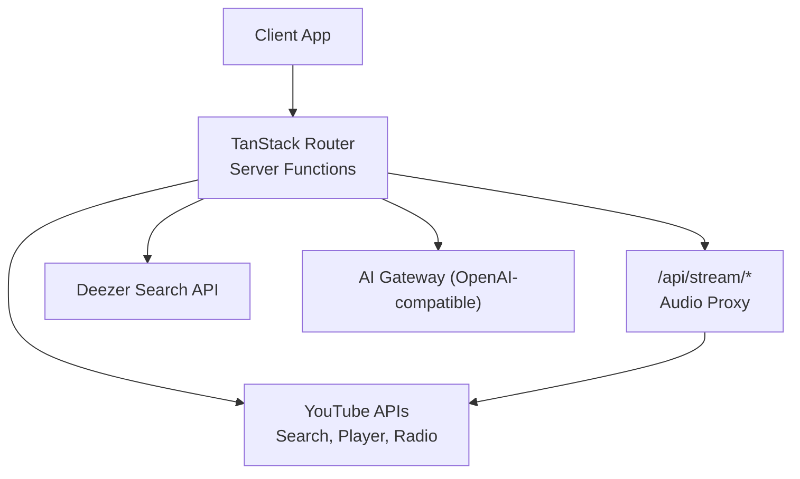
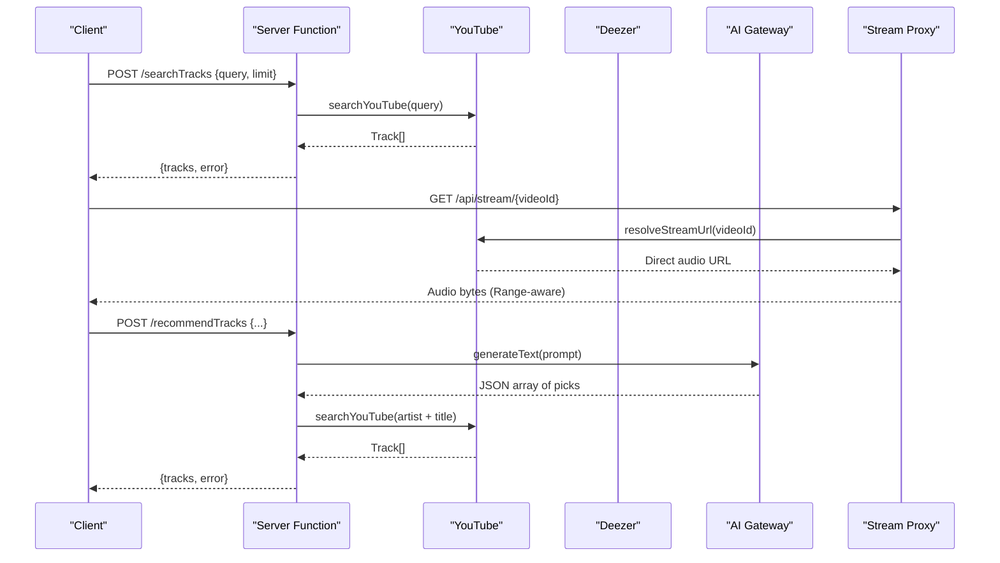
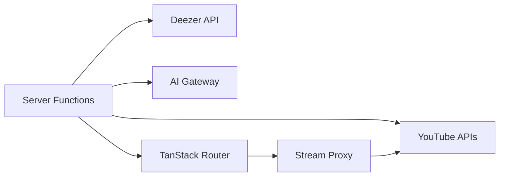

# API Reference

<cite>
**Referenced Files in This Document**
- [server.ts](file://src/server.ts)
- [start.ts](file://src/start.ts)
- [music.functions.ts](file://src/lib/music.functions.ts)
- [music.server.ts](file://src/lib/music.server.ts)
- [stream.server.ts](file://src/lib/stream.server.ts)
- [deezer.server.ts](file://src/lib/deezer.server.ts)
- [radio.server.ts](file://src/lib/radio.server.ts)
- [ai-gateway.server.ts](file://src/lib/ai-gateway.server.ts)
- [auth-attacher.ts](file://src/integrations/supabase/auth-attacher.ts)
- [index.tsx](file://src/routes/index.tsx)
</cite>

## Table of Contents
1. Introduction
2. Project Structure
3. Core Components
4. Architecture Overview
5. Detailed Component Analysis
6. Dependency Analysis
7. Performance Considerations
8. Troubleshooting Guide
9. Conclusion

## Introduction
This document provides comprehensive API documentation for the YouTube Music Companion server functions and external integrations. It covers:
- Server-side endpoints exposed via TanStack Start server functions
- A streaming proxy endpoint for audio playback
- External integrations with YouTube, Deezer, and an AI gateway
- Request/response schemas, parameter validation, error handling, authentication, rate limiting considerations, and client usage guidelines

The application uses a hybrid strategy: YouTube is the primary source for full tracks and recommendations; Deezer provides 30-second previews as a reliable fallback. An optional AI-powered recommendation engine is gated by an environment variable and gracefully degrades to local heuristics when unavailable.

## Project Structure
At runtime, HTTP requests are handled by a single server entry that:
- Proxies audio streams under /api/stream/:videoId
- Delegates all other routes to the TanStack router and server functions
- Wraps responses with error normalization and CSRF protection for server functions

**Diagram sources**
- [server.ts:101-178](file://src/server.ts#L101-L178)
- [music.functions.ts:8-21](file://src/lib/music.functions.ts#L8-L21)
- [music.functions.ts:58-137](file://src/lib/music.functions.ts#L58-L137)
- [deezer.server.ts:39-74](file://src/lib/deezer.server.ts#L39-L74)
- [ai-gateway.server.ts:3-9](file://src/lib/ai-gateway.server.ts#L3-L9)

**Section sources**
- [server.ts:1-198](file://src/server.ts#L1-L198)
- [start.ts:1-32](file://src/start.ts#L1-L32)

## Core Components
- Server entry and streaming proxy: handles /api/stream/:videoId with range support and chunked delivery to bypass YouTube throttling and CORS constraints.
- Server functions: typed, validated POST endpoints for search, suggestions, recommendations, mixes, radio, new songs/podcasts/drops, mood picks, and stream URL resolution.
- External integrations:
  - YouTube: search results scraping, player API for direct audio URLs, and radio endpoint.
  - Deezer: free search returning preview MP3s.
  - AI Gateway: OpenAI-compatible provider for Gemini-based recommendations.

**Section sources**
- [server.ts:101-178](file://src/server.ts#L101-L178)
- [music.functions.ts:8-627](file://src/lib/music.functions.ts#L8-L627)
- [music.server.ts:140-214](file://src/lib/music.server.ts#L140-L214)
- [stream.server.ts:108-123](file://src/lib/stream.server.ts#L108-L123)
- [deezer.server.ts:39-97](file://src/lib/deezer.server.ts#L39-L97)
- [radio.server.ts:25-95](file://src/lib/radio.server.ts#L25-L95)
- [ai-gateway.server.ts:3-9](file://src/lib/ai-gateway.server.ts#L3-L9)

## Architecture Overview
The request flow for typical operations:
- Client calls a server function (POST) with Zod-validated input.
- The handler imports the appropriate module on demand and calls external services.
- For streaming, the client either uses a direct preview URL (Deezer) or requests /api/stream/:videoId which resolves a playable YouTube audio URL and proxies bytes with Range support.

**Diagram sources**
- [music.functions.ts:8-21](file://src/lib/music.functions.ts#L8-L21)
- [music.functions.ts:58-137](file://src/lib/music.functions.ts#L58-L137)
- [stream.server.ts:108-123](file://src/lib/stream.server.ts#L108-L123)
- [server.ts:101-178](file://src/server.ts#L101-L178)

## Detailed Component Analysis

### Streaming Proxy Endpoint
- Method: GET
- Path: /api/stream/:videoId
- Purpose: Serve a playable audio stream for a YouTube video ID, honoring Range requests and chunking to avoid throttling.
- Behavior:
  - Resolves a direct audio URL using the YouTube player API.
  - Probes file size and content type.
  - Rejects capped streams early to prevent truncated downloads.
  - Streams in bounded chunks with retries per chunk.
- Response:
  - 200 OK with full content-length for non-range requests.
  - 206 Partial Content for Range requests with correct content-range headers.
  - 400 Bad Request if videoId is missing.
  - 404 Not Found if no stream URL can be resolved.
  - 502 Bad Gateway if upstream stream is unavailable or capped.
  - 416 Range Not Satisfied if requested range is invalid.
- Authentication: None required.
- Rate limiting: Depends on upstream YouTube behavior; the proxy retries each chunk once and caps per-request sizes to ~1 MiB.

Example call:
- GET /api/stream/dQw4w9WgXcQ
- Expected response: audio stream with appropriate headers.

Error scenarios:
- Missing video id -> 400
- No playable stream found -> 404
- Upstream throttled/capped -> 502
- Invalid range -> 416

**Section sources**
- [server.ts:101-178](file://src/server.ts#L101-L178)
- [stream.server.ts:108-123](file://src/lib/stream.server.ts#L108-L123)

### Search and Suggestions
- Endpoints:
  - POST /searchTracks
    - Input: { query: string (min 1), limit?: number }
    - Output: { tracks: Track[], error?: string | null }
    - Behavior: Searches YouTube with music-only filters and returns up to limit tracks.
  - POST /suggestSearch
    - Input: { query: string (min 1, max 120) }
    - Output: { suggestions: string[] }
    - Behavior: Returns autocomplete suggestions from Google suggest service.
  - POST /searchDeezerTracks
    - Input: { query: string (min 1), limit?: number }
    - Output: { tracks: Track[], error?: string | null }
    - Behavior: Searches Deezer and returns tracks with direct preview URLs.

Track schema:
- id: string
- title: string
- artist: string
- duration: string
- thumbnail: string
- previewUrl?: string (for Deezer previews)
- source?: "youtube" | "deezer"
- reason?: string (for AI-derived picks)

Examples:
- POST /searchTracks
  - Request body: { "query": "indie rock", "limit": 20 }
  - Response: { "tracks": [...], "error": null }
- POST /suggestSearch
  - Request body: { "query": "lofi" }
  - Response: { "suggestions": ["lofi hip hop", "lofi study", ...] }
- POST /searchDeezerTracks
  - Request body: { "query": "jazz piano", "limit": 10 }
  - Response: { "tracks": [{ id: "deezer:123", title: "...", artist: "...", duration: "3:45", thumbnail: "...", previewUrl: "https://...", source: "deezer" }], "error": null }

Error handling:
- Network failures or parsing errors return empty arrays and may include an error message.
- Validation errors are rejected by Zod before reaching handlers.

**Section sources**
- [music.functions.ts:8-44](file://src/lib/music.functions.ts#L8-L44)
- [music.server.ts:140-214](file://src/lib/music.server.ts#L140-L214)
- [deezer.server.ts:39-74](file://src/lib/deezer.server.ts#L39-L74)

### Recommendations and Mixes
- Endpoints:
  - POST /recommendTracks
    - Input: { liked: string[], recent: string[], disliked?: string[], sequence?: string[], skipped?: string[], mood?: string, brief?: string, count?: number }
    - Output: { tracks: Track[], error?: string | null }
    - Behavior: Uses AI to generate personalized picks, then resolves them via YouTube search. Falls back to local heuristics if AI key is missing or fails.
  - POST /buildMix
    - Input: { kind: "discover" | "newrelease", liked?: string[], recent?: string[], sequence?: string[], skipped?: string[], artists?: string[], brief?: string, count?: number }
    - Output: { tracks: Track[], error?: string | null }
    - Behavior: Discover uses AI; New Release searches for latest drops from known artists.
  - POST /localPicks
    - Input: { artists?: string[], currentArtist?: string, mode?: "feed" | "discover" | "nextup", count?: number }
    - Output: { tracks: Track[], error?: string | null }
    - Behavior: No-AI fallback mirroring YouTube Music balance.
  - POST /moodPicks
    - Input: { mood: string (min 1, max 40) }
    - Output: { tracks: Track[], error?: string | null }
    - Behavior: Curated mood radio via YouTube search without AI.

Examples:
- POST /recommendTracks
  - Request body: { "liked": ["Song A — Artist A"], "recent": ["Song B — Artist B"], "count": 20 }
  - Response: { "tracks": [...], "error": null }
- POST /buildMix
  - Request body: { "kind": "discover", "artists": ["Artist X"], "count": 20 }
  - Response: { "tracks": [...], "error": null }
- POST /moodPicks
  - Request body: { "mood": "focus" }
  - Response: { "tracks": [...], "error": null }

Error handling:
- If LOVABLE_API_KEY is not set, AI endpoints return explicit errors indicating configuration is needed.
- Rate-limited or credit-exhausted AI responses are mapped to user-friendly messages.

**Section sources**
- [music.functions.ts:47-137](file://src/lib/music.functions.ts#L47-L137)
- [music.functions.ts:140-245](file://src/lib/music.functions.ts#L140-L245)
- [music.functions.ts:310-369](file://src/lib/music.functions.ts#L310-L369)
- [music.functions.ts:583-610](file://src/lib/music.functions.ts#L583-L610)
- [ai-gateway.server.ts:3-9](file://src/lib/ai-gateway.server.ts#L3-L9)

### Radio and Fresh Content
- Endpoints:
  - POST /radioTracks
    - Input: { videoId: string (min 1, max 64), count?: number }
    - Output: { tracks: Track[], error?: string | null }
    - Behavior: Uses YouTube’s built-in radio to get similar tracks.
  - POST /newSongs
    - Input: { artists?: string[], count?: number, languages?: string[] }
    - Output: { tracks: Track[], error?: string | null }
    - Behavior: Aggregates fresh uploads this week/year, new drops from known artists, and trending content, optionally filtered by language.
  - POST /podcastPicks
    - Input: { artists?: string[], count?: number, languages?: string[], topics?: string[] }
    - Output: { tracks: Track[], error?: string | null }
    - Behavior: Finds fresh podcast episodes and top shows based on topics/languages/artists.
  - POST /newDrops
    - Input: { artists?: string[], maxArtists?: number }
    - Output: { drops: Array<{ artist, title, videoId, thumbnail }>, error?: string | null }
    - Behavior: Detects recent releases from your artists.

Examples:
- POST /radioTracks
  - Request body: { "videoId": "dQw4w9WgXcQ", "count": 15 }
  - Response: { "tracks": [...], "error": null }
- POST /newSongs
  - Request body: { "languages": ["Hindi", "English"], "count": 24 }
  - Response: { "tracks": [...], "error": null }
- POST /podcastPicks
  - Request body: { "topics": ["Tech", "Business"], "count": 20 }
  - Response: { "tracks": [...], "error": null }
- POST /newDrops
  - Request body: { "artists": ["Artist A", "Artist B"], "maxArtists": 4 }
  - Response: { "drops": [...], "error": null }

**Section sources**
- [music.functions.ts:248-307](file://src/lib/music.functions.ts#L248-L307)
- [music.functions.ts:372-458](file://src/lib/music.functions.ts#L372-L458)
- [music.functions.ts:461-559](file://src/lib/music.functions.ts#L461-L559)
- [music.functions.ts:562-580](file://src/lib/music.functions.ts#L562-L580)
- [radio.server.ts:25-95](file://src/lib/radio.server.ts#L25-L95)

### Stream URL Resolution
- Endpoint:
  - POST /getStreamUrl
    - Input: { videoId: string (min 1, max 64) }
    - Output: { url: string | null, error?: string | null }
    - Behavior: Resolves a direct, ad-free audio URL suitable for background playback.
- Use case: When you need a direct URL instead of proxying through /api/stream.

Example:
- POST /getStreamUrl
  - Request body: { "videoId": "dQw4w9WgXcQ" }
  - Response: { "url": "https://googlevideo.com/...", "error": null }

**Section sources**
- [music.functions.ts:613-627](file://src/lib/music.functions.ts#L613-L627)
- [stream.server.ts:108-123](file://src/lib/stream.server.ts#L108-L123)

### Authentication and Security
- Server functions are protected by CSRF middleware and Supabase auth attachment:
  - attachSupabaseAuth adds Authorization header with bearer token for serverFn RPCs.
  - CSRF middleware ensures serverFn calls originate from trusted contexts.
- Streaming proxy does not require authentication.

Configuration:
- Ensure start instance registers functionMiddleware and requestMiddleware as defined.

**Section sources**
- [start.ts:6-31](file://src/start.ts#L6-L31)
- [auth-attacher.ts:7-15](file://src/integrations/supabase/auth-attacher.ts#L7-L15)

## Dependency Analysis
External dependencies and their roles:
- YouTube:
  - Search scraping for track discovery
  - Player API for resolving direct audio URLs
  - Radio endpoint for similarity-based recommendations
- Deezer:
  - Free search providing 30-second MP3 previews
- AI Gateway:
  - OpenAI-compatible provider for Gemini model access
- TanStack Start:
  - Server functions, routing, CSRF middleware
- Supabase:
  - Auth session attachment for serverFn calls

**Diagram sources**
- [music.functions.ts:8-627](file://src/lib/music.functions.ts#L8-L627)
- [server.ts:101-178](file://src/server.ts#L101-L178)
- [ai-gateway.server.ts:3-9](file://src/lib/ai-gateway.server.ts#L3-L9)

**Section sources**
- [music.functions.ts:8-627](file://src/lib/music.functions.ts#L8-L627)
- [server.ts:101-178](file://src/server.ts#L101-L178)
- [ai-gateway.server.ts:3-9](file://src/lib/ai-gateway.server.ts#L3-L9)

## Performance Considerations
- Chunked streaming: The proxy fetches in ~1 MiB chunks to avoid YouTube throttling and supports seeking via Range.
- Parallelism: Server functions use Promise.all where appropriate to parallelize independent queries (e.g., multiple artist searches).
- Fallbacks: Hybrid strategies ensure availability even when one source fails (YouTube -> Deezer; AI -> Local heuristics).
- Timeouts: External calls use AbortSignal timeouts to prevent hanging requests.
- Deduplication: Results are deduplicated by id or normalized keys to minimize redundant data.

[No sources needed since this section provides general guidance]

## Troubleshooting Guide
Common issues and resolutions:
- AI not configured:
  - Symptom: Recommendation/mix endpoints return errors indicating AI is not configured.
  - Resolution: Set LOVABLE_API_KEY environment variable.
- Too many requests:
  - Symptom: Errors mentioning rate limits (e.g., 429).
  - Resolution: Retry after a short delay; implement exponential backoff on the client.
- Credits exhausted:
  - Symptom: Errors indicating payment required or credits exhausted.
  - Resolution: Add credits to the AI account or fall back to local picks.
- Stream unavailable:
  - Symptom: 502 responses from /api/stream.
  - Resolution: Check video availability; some videos are region-restricted or capped.
- Network failures:
  - Symptom: Empty arrays returned from search endpoints.
  - Resolution: Retry with backoff; verify network connectivity.

**Section sources**
- [music.functions.ts:58-137](file://src/lib/music.functions.ts#L58-L137)
- [music.functions.ts:156-245](file://src/lib/music.functions.ts#L156-L245)
- [server.ts:101-178](file://src/server.ts#L101-L178)

## Conclusion
The YouTube Music Companion exposes a robust set of server functions for search, recommendations, library-related content generation, and streaming. It integrates seamlessly with YouTube and Deezer, with optional AI-powered personalization. The streaming proxy ensures reliable playback by handling CORS, throttling, and range requests. Clients should validate inputs, handle errors gracefully, and leverage fallbacks to maintain a smooth experience.

[No sources needed since this section summarizes without analyzing specific files]