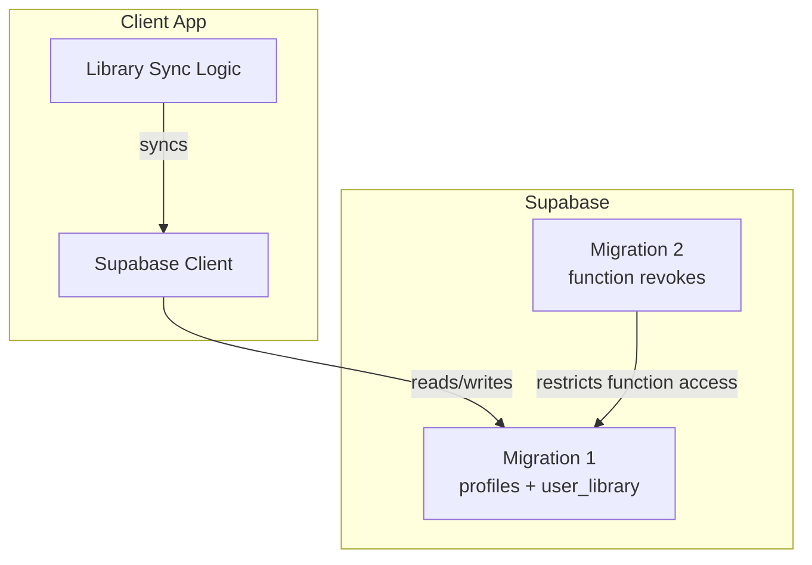
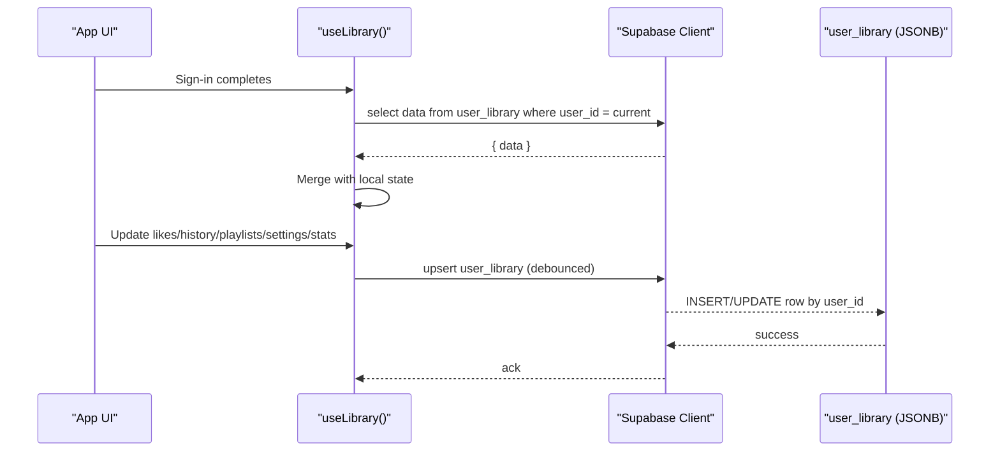
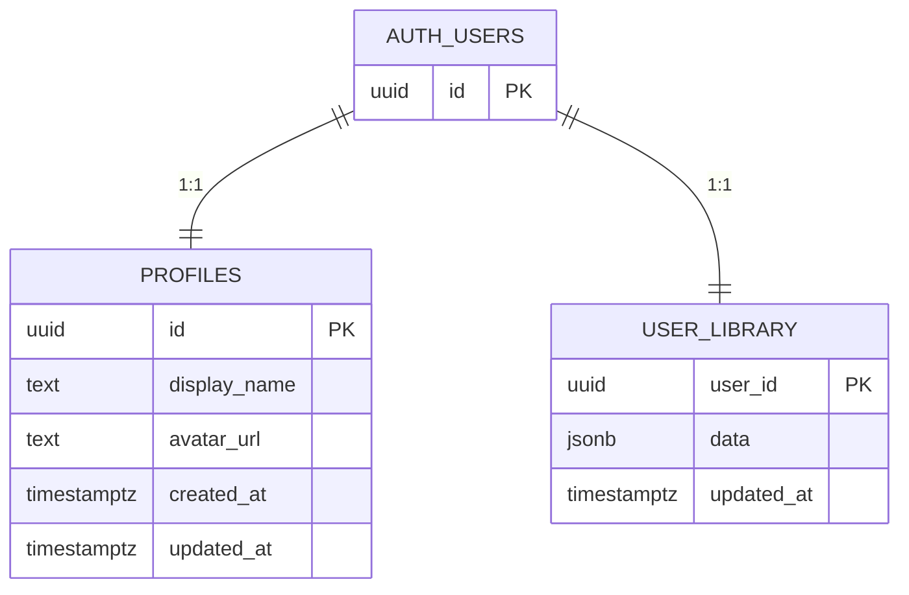
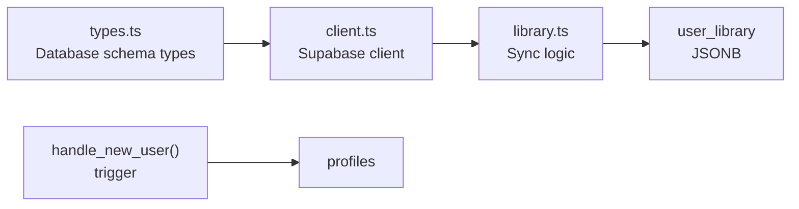

# Database Schema

<cite>
**Referenced Files in This Document**
- [20260808085443_8253f78c-652e-4cb4-8772-8818ce90215c.sql](file://supabase/migrations/20260808085443_8253f78c-652e-4cb4-8772-8818ce90215c.sql)
- [20260808085506_fb5fd43f-6504-4c96-8335-2aeac753c924.sql](file://supabase/migrations/20260808085506_fb5fd43f-6504-4c96-8335-2aeac753c924.sql)
- [config.toml](file://supabase/config.toml)
- [client.ts](file://src/integrations/supabase/client.ts)
- [types.ts](file://src/integrations/supabase/types.ts)
- [library.ts](file://src/lib/library.ts)
</cite>

## Table of Contents
1. Introduction
2. Project Structure
3. Core Components
4. Architecture Overview
5. Detailed Component Analysis
6. Dependency Analysis
7. Performance Considerations
8. Troubleshooting Guide
9. Conclusion
10. Appendices

## Introduction
This document describes the Supabase backend database schema for the music application, focusing on user library data (tracks, playlists, listening history, and preferences). It covers table definitions, relationships, constraints, row-level security policies, migration strategy, indexes, query patterns, and operational guidance for production deployments.

## Project Structure
The database schema is defined via SQL migrations under the Supabase project. The application uses a local-first approach: user library data is stored locally and synced to a single JSONB document per user in the database when signed in.

**Diagram sources**
- [20260808085443_8253f78c-652e-4cb4-8772-8818ce90215c.sql:1-63](file://supabase/migrations/20260808085443_8253f78c-652e-4cb4-8772-8818ce90215c.sql#L1-L63)
- [20260808085506_fb5fd43f-6504-4c96-8335-2aeac753c924.sql:1-2](file://supabase/migrations/20260808085506_fb5fd43f-6504-4c96-8335-2aeac753c924.sql#L1-L2)
- [client.ts:30-56](file://src/integrations/supabase/client.ts#L30-L56)
- [library.ts:262-349](file://src/lib/library.ts#L262-L349)

**Section sources**
- [20260808085443_8253f78c-652e-4cb4-8772-8818ce90215c.sql:1-63](file://supabase/migrations/20260808085443_8253f78c-652e-4cb4-8772-8818ce90215c.sql#L1-L63)
- [20260808085506_fb5fd43f-6504-4c96-8335-2aeac753c924.sql:1-2](file://supabase/migrations/20260808085506_fb5fd43f-6504-4c96-8335-2aeac753c924.sql#L1-L2)
- [config.toml:1-1](file://supabase/config.toml#L1-L1)
- [client.ts:30-56](file://src/integrations/supabase/client.ts#L30-L56)
- [library.ts:262-349](file://src/lib/library.ts#L262-L349)

## Core Components
- profiles: User profile metadata linked to auth.users.
- user_library: A single JSONB document per user storing likes, dislikes, history, playlists, settings, and stats.

Key characteristics:
- Row-Level Security (RLS) enabled on both tables with policies restricting access to authenticated users and enforcing ownership where applicable.
- Triggers maintain updated_at timestamps automatically.
- A trigger creates a profile record when a new user signs up.
- Function execution permissions are revoked from public roles for security.

**Section sources**
- [20260808085443_8253f78c-652e-4cb4-8772-8818ce90215c.sql:1-63](file://supabase/migrations/20260808085443_8253f78c-652e-4cb4-8772-8818ce90215c.sql#L1-L63)
- [20260808085506_fb5fd43f-6504-4c96-8335-2aeac753c924.sql:1-2](file://supabase/migrations/20260808085506_fb5fd43f-6504-4c96-8335-2aeac753c924.sql#L1-L2)

## Architecture Overview
The app follows a local-first architecture:
- On sign-in, it fetches the user’s library JSONB from user_library and merges it with local storage.
- Changes are debounced and upserted back to user_library.
- RLS ensures users can only read/write their own rows.

**Diagram sources**
- [library.ts:262-349](file://src/lib/library.ts#L262-L349)
- [20260808085443_8253f78c-652e-4cb4-8772-8818ce90215c.sql:20-32](file://supabase/migrations/20260808085443_8253f78c-652e-4cb4-8772-8818ce90215c.sql#L20-L32)

## Detailed Component Analysis

### Tables and Fields

#### profiles
- Purpose: Store display name and avatar URL for each user.
- Primary key: id (UUID) referencing auth.users with ON DELETE CASCADE.
- Columns:
  - id: UUID, PK, FK to auth.users
  - display_name: TEXT, nullable
  - avatar_url: TEXT, nullable
  - created_at: TIMESTAMPTZ, default now()
  - updated_at: TIMESTAMPTZ, default now()
- Constraints:
  - Foreign key to auth.users with cascade delete
  - RLS enabled; policies allow:
    - SELECT for authenticated users
    - INSERT only if creating own profile
    - UPDATE only if updating own profile
- Trigger:
  - touch_updated_at sets updated_at on update
  - handle_new_user auto-creates profile on auth.users insert

**Section sources**
- [20260808085443_8253f78c-652e-4cb4-8772-8818ce90215c.sql:1-18](file://supabase/migrations/20260808085443_8253f78c-652e-4cb4-8772-8818ce90215c.sql#L1-L18)
- [20260808085443_8253f78c-652e-4cb4-8772-8818ce90215c.sql:34-63](file://supabase/migrations/20260808085443_8253f78c-652e-4cb4-8772-8818ce90215c.sql#L34-L63)

#### user_library
- Purpose: Persist per-user library data as a single JSONB document.
- Primary key: user_id (UUID) referencing auth.users with ON DELETE CASCADE.
- Columns:
  - user_id: UUID, PK, FK to auth.users
  - data: JSONB, not null, default empty object
  - updated_at: TIMESTAMPTZ, default now()
- Constraints:
  - Foreign key to auth.users with cascade delete
  - RLS enabled; policy allows full CRUD for authenticated users only on their own row
- Trigger:
  - touch_updated_at sets updated_at on update

Data model inside JSONB (application-defined):
- likes: array of track objects
- dislikes: array of track objects
- history: array of track objects (limited on sync)
- playlists: array of playlist objects
- settings: recommendation settings object
- stats: map of trackId -> play statistics

Validation rules enforced at the application layer:
- History is truncated to a fixed size before sync
- Playlists and tracks are deduplicated during merge operations
- Stats are merged using max counters to avoid overwrites

**Section sources**
- [20260808085443_8253f78c-652e-4cb4-8772-8818ce90215c.sql:20-32](file://supabase/migrations/20260808085443_8253f78c-652e-4cb4-8772-8818ce90215c.sql#L20-L32)
- [library.ts:200-207](file://src/lib/library.ts#L200-L207)
- [library.ts:227-236](file://src/lib/library.ts#L227-L236)
- [library.ts:321-349](file://src/lib/library.ts#L321-L349)

### Relationships and Referential Integrity
- Both profiles.id and user_library.user_id reference auth.users.
- ON DELETE CASCADE ensures that deleting an auth user removes related profiles and user_library rows.
- No direct relationships between profiles and user_library beyond shared auth.users linkage.

**Section sources**
- [20260808085443_8253f78c-652e-4cb4-8772-8818ce90215c.sql:1-7](file://supabase/migrations/20260808085443_8253f78c-652e-4cb4-8772-8818ce90215c.sql#L1-L7)
- [20260808085443_8253f78c-652e-4cb4-8772-8818ce90215c.sql:20-24](file://supabase/migrations/20260808085443_8253f78c-652e-4cb4-8772-8818ce90215c.sql#L20-L24)

### Row-Level Security and Access Control
- profiles:
  - SELECT allowed for authenticated users
  - INSERT restricted to creating own profile
  - UPDATE restricted to updating own profile
- user_library:
  - All operations allowed for authenticated users, but scoped to rows where user_id equals current user
- Functions:
  - handle_new_user and touch_updated_at execute with SECURITY DEFINER
  - Execution privileges revoked from PUBLIC, anon, authenticated to prevent misuse

**Section sources**
- [20260808085443_8253f78c-652e-4cb4-8772-8818ce90215c.sql:13-18](file://supabase/migrations/20260808085443_8253f78c-652e-4cb4-8772-8818ce90215c.sql#L13-L18)
- [20260808085443_8253f78c-652e-4cb4-8772-8818ce90215c.sql:30-32](file://supabase/migrations/20260808085443_8253f78c-652e-4cb4-8772-8818ce90215c.sql#L30-L32)
- [20260808085443_8253f78c-652e-4cb4-8772-8818ce90215c.sql:47-59](file://supabase/migrations/20260808085443_8253f78c-652e-4cb4-8772-8818ce90215c.sql#L47-L59)
- [20260808085506_fb5fd43f-6504-4c96-8335-2aeac753c924.sql:1-2](file://supabase/migrations/20260808085506_fb5fd43f-6504-4c96-8335-2aeac753c924.sql#L1-L2)

### Migration Strategy
- Version management:
  - Each migration file is timestamped and uniquely identified, applied sequentially by Supabase.
- Rollback procedures:
  - Create a new migration that reverses changes (drop tables/functions/policies) or revert to a previous version by applying earlier migrations in a controlled environment.
- Schema evolution patterns:
  - Use additive changes (new columns, new tables) when possible.
  - For JSONB fields, evolve structure gradually and validate in application code.
  - Keep triggers and functions idempotent or guard against re-application.

Operational notes:
- Ensure service_role retains necessary privileges for server-side tasks.
- After adding new tables or policies, run appropriate GRANT statements.

**Section sources**
- [20260808085443_8253f78c-652e-4cb4-8772-8818ce90215c.sql:1-63](file://supabase/migrations/20260808085443_8253f78c-652e-4cb4-8772-8818ce90215c.sql#L1-L63)
- [20260808085506_fb5fd43f-6504-4c96-8335-2aeac753c924.sql:1-2](file://supabase/migrations/20260808085506_fb5fd43f-6504-4c96-8335-2aeac753c924.sql#L1-L2)

### Indexes and Performance
Current state:
- No explicit indexes are defined in migrations.
- Primary keys exist on profiles.id and user_library.user_id, which create unique indexes automatically.

Recommendations:
- If querying frequently by specific JSONB paths (e.g., top liked tracks), consider GIN indexes on user_library.data for efficient containment queries.
- If filtering by creation time or recency, add indexes on created_at/updated_at where needed.
- Monitor query plans and adjust indexes based on actual usage patterns.

[No sources needed since this section provides general guidance]

### Query Patterns and Sample Queries
Common operations implemented in the application:
- Read user library:
  - Select data from user_library where user_id equals current user
- Upsert user library:
  - Insert or update user_library row with user_id and JSONB payload
- Profile management:
  - Insert/update profile with RLS ensuring ownership

Example patterns (described, not code):
- Retrieve user library:
  - Select data column from user_library filtered by user_id
- Manage playlists:
  - Update JSONB data field to add/remove/reorder playlist entries
- Generate statistics:
  - Read stats from JSONB and compute aggregates client-side

Note: These patterns correspond to the client-side logic that reads and writes the user_library JSONB document.

**Section sources**
- [library.ts:262-349](file://src/lib/library.ts#L262-L349)

### Data Model Diagram

**Diagram sources**
- [20260808085443_8253f78c-652e-4cb4-8772-8818ce90215c.sql:1-7](file://supabase/migrations/20260808085443_8253f78c-652e-4cb4-8772-8818ce90215c.sql#L1-L7)
- [20260808085443_8253f78c-652e-4cb4-8772-8818ce90215c.sql:20-24](file://supabase/migrations/20260808085443_8253f78c-652e-4cb4-8772-8818ce90215c.sql#L20-L24)

## Dependency Analysis
- Application depends on Supabase client configuration and types generated from the database schema.
- Library sync logic depends on user_library table structure and RLS policies.
- Profiles are auto-created via trigger on auth.users insert.

**Diagram sources**
- [types.ts:9-73](file://src/integrations/supabase/types.ts#L9-L73)
- [client.ts:30-56](file://src/integrations/supabase/client.ts#L30-L56)
- [library.ts:262-349](file://src/lib/library.ts#L262-L349)
- [20260808085443_8253f78c-652e-4cb4-8772-8818ce90215c.sql:47-63](file://supabase/migrations/20260808085443_8253f78c-652e-4cb4-8772-8818ce90215c.sql#L47-L63)

**Section sources**
- [types.ts:9-73](file://src/integrations/supabase/types.ts#L9-L73)
- [client.ts:30-56](file://src/integrations/supabase/client.ts#L30-L56)
- [library.ts:262-349](file://src/lib/library.ts#L262-L349)
- [20260808085443_8253f78c-652e-4cb4-8772-8818ce90215c.sql:47-63](file://supabase/migrations/20260808085443_8253f78c-652e-4cb4-8772-8818ce90215c.sql#L47-L63)

## Performance Considerations
- Local-first design minimizes database load; sync is debounced to reduce write frequency.
- JSONB allows flexible schema evolution but may require careful indexing for complex queries.
- Consider:
  - Adding GIN indexes on frequently queried JSONB paths
  - Limiting history size to reduce payload size
  - Monitoring network requests and error rates

[No sources needed since this section provides general guidance]

## Troubleshooting Guide
Common issues and resolutions:
- Missing environment variables:
  - Ensure SUPABASE_URL and SUPABASE_PUBLISHABLE_KEY are set; client throws an error if missing.
- RLS policy violations:
  - Verify that the current user is authenticated and owns the row being modified.
- Function permission errors:
  - Ensure function execution privileges are correctly granted to service_role and revoked from public roles.
- Sync failures:
  - Check console warnings for library sync errors and retry logic.

**Section sources**
- [client.ts:30-44](file://src/integrations/supabase/client.ts#L30-L44)
- [20260808085443_8253f78c-652e-4cb4-8772-8818ce90215c.sql:30-32](file://supabase/migrations/20260808085443_8253f78c-652e-4cb4-8772-8818ce90215c.sql#L30-L32)
- [20260808085506_fb5fd43f-6504-4c96-8335-2aeac753c924.sql:1-2](file://supabase/migrations/20260808085506_fb5fd43f-6504-4c96-8335-2aeac753c924.sql#L1-L2)
- [library.ts:321-349](file://src/lib/library.ts#L321-L349)

## Conclusion
The database schema centers around two core tables—profiles and user_library—with strong integration to Supabase Auth via foreign keys and RLS policies. The application employs a local-first pattern that syncs a JSONB document per user, enabling flexible library management while maintaining security and performance. Migrations are versioned and incremental, with clear rollback strategies. Operational best practices include monitoring, indexing JSONB where appropriate, and ensuring robust environment configuration.

[No sources needed since this section summarizes without analyzing specific files]

## Appendices

### Backup and Recovery Procedures
- Use Supabase-provided backup mechanisms (database backups and point-in-time recovery) to protect data.
- For critical environments:
  - Schedule regular automated backups
  - Test restore procedures periodically
  - Maintain documentation of migration history and rollback steps

[No sources needed since this section provides general guidance]