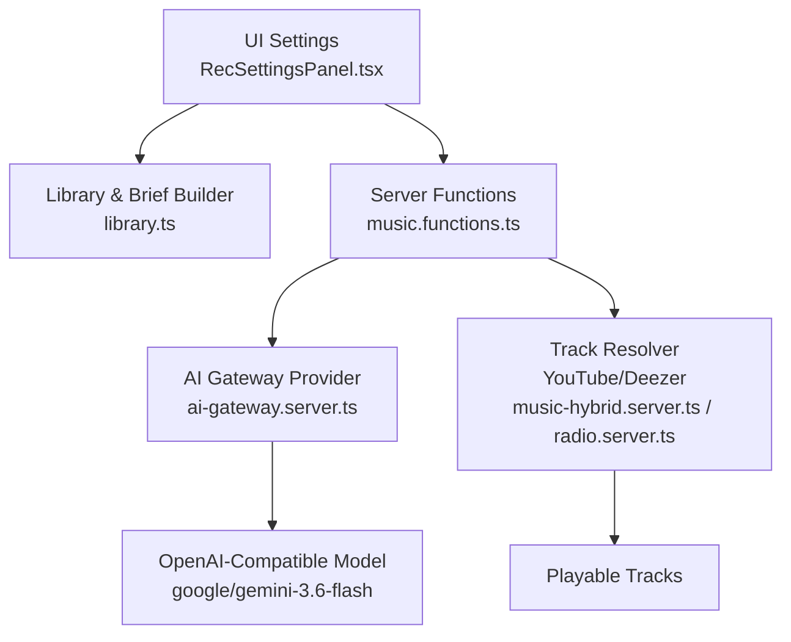
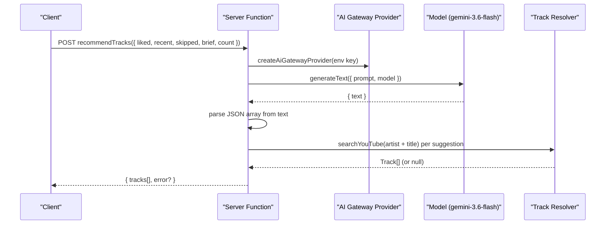
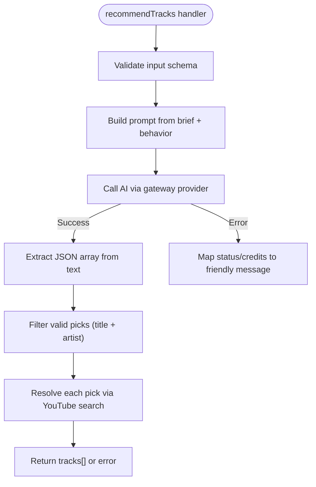
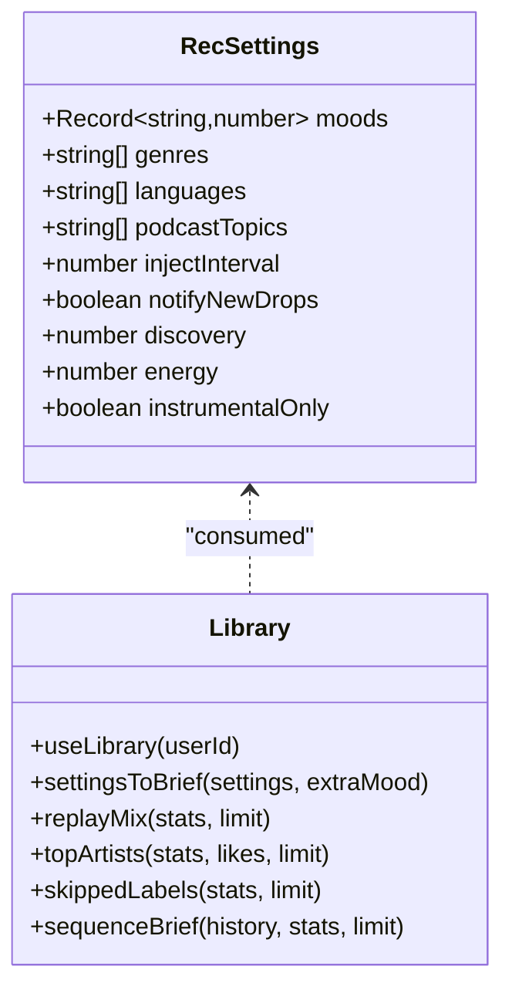
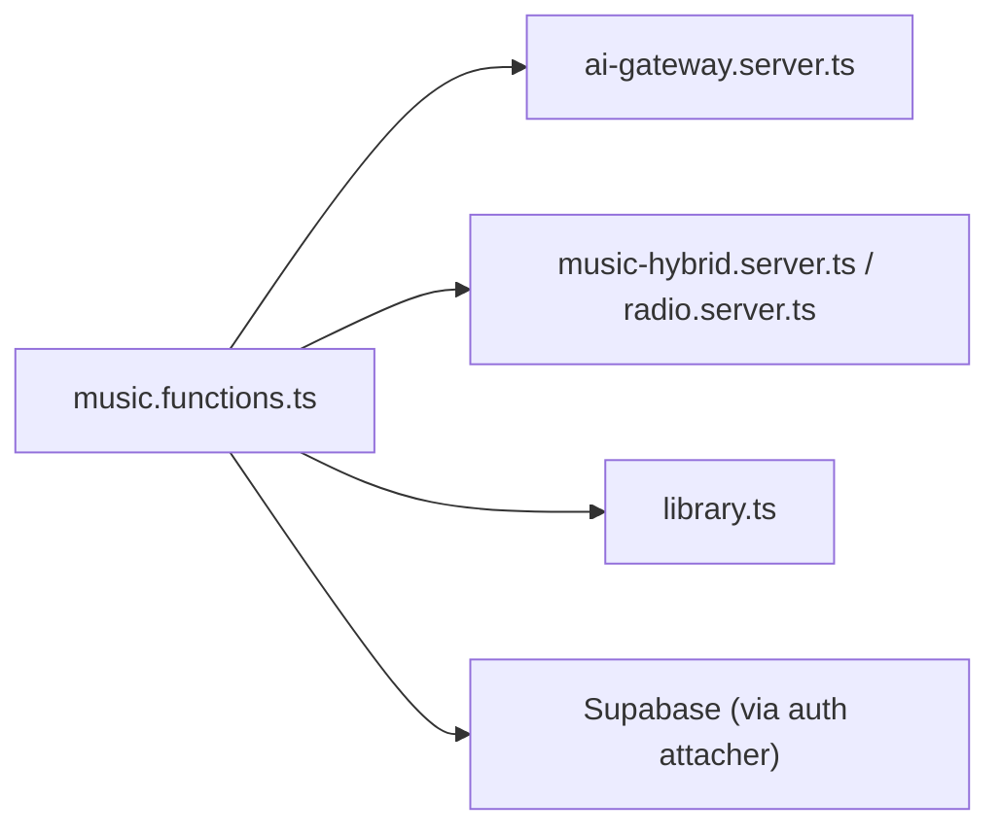

# AI Recommendation Gateway

<cite>
**Referenced Files in This Document**
- [ai-gateway.server.ts](file://src/lib/ai-gateway.server.ts)
- [music.functions.ts](file://src/lib/music.functions.ts)
- [library.ts](file://src/lib/library.ts)
- [RecSettingsPanel.tsx](file://src/components/music/RecSettingsPanel.tsx)
- [music-hybrid.server.ts](file://src/lib/music-hybrid.server.ts)
- [radio.server.ts](file://src/lib/radio.server.ts)
- [error-capture.ts](file://src/lib/error-capture.ts)
- [auth-attacher.ts](file://src/integrations/supabase/auth-attacher.ts)
- [20260808085443_8253f78c-652e-4cb4-8772-8818ce90215c.sql](file://supabase/migrations/20260808085443_8253f78c-652e-4cb4-8772-8818ce90215c.sql)
</cite>

## Table of Contents
1. [Introduction](#introduction)
2. [Project Structure](#project-structure)
3. [Core Components](#core-components)
4. [Architecture Overview](#architecture-overview)
5. [Detailed Component Analysis](#detailed-component-analysis)
6. [Dependency Analysis](#dependency-analysis)
7. [Performance Considerations](#performance-considerations)
8. [Troubleshooting Guide](#troubleshooting-guide)
9. [Conclusion](#conclusion)
10. [Appendices](#appendices)

## Introduction
This document explains the AI recommendation gateway that powers personalized music recommendations using an OpenAI-compatible provider through a hosted gateway. It covers configuration, model selection, prompt customization, user behavior processing, response parsing, authentication, error handling, and security considerations for API keys and data privacy.

## Project Structure
The AI recommendation system is implemented as server-side functions that:
- Build prompts from user preferences and behavior
- Call an OpenAI-compatible AI gateway
- Parse structured JSON responses into track suggestions
- Resolve those suggestions to playable tracks via YouTube or Deezer

**Diagram sources**
- [RecSettingsPanel.tsx:1-284](file://src/components/music/RecSettingsPanel.tsx#L1-L284)
- [library.ts:68-103](file://src/lib/library.ts#L68-L103)
- [music.functions.ts:58-137](file://src/lib/music.functions.ts#L58-L137)
- [ai-gateway.server.ts:1-9](file://src/lib/ai-gateway.server.ts#L1-L9)
- [music-hybrid.server.ts:22-98](file://src/lib/music-hybrid.server.ts#L22-L98)
- [radio.server.ts:25-95](file://src/lib/radio.server.ts#L25-L95)

**Section sources**
- [RecSettingsPanel.tsx:1-284](file://src/components/music/RecSettingsPanel.tsx#L1-L284)
- [library.ts:68-103](file://src/lib/library.ts#L68-L103)
- [music.functions.ts:58-137](file://src/lib/music.functions.ts#L58-L137)
- [ai-gateway.server.ts:1-9](file://src/lib/ai-gateway.server.ts#L1-L9)
- [music-hybrid.server.ts:22-98](file://src/lib/music-hybrid.server.ts#L22-L98)
- [radio.server.ts:25-95](file://src/lib/radio.server.ts#L25-L95)

## Core Components
- AI Gateway Provider: Creates an OpenAI-compatible client configured with a base URL and API key header.
- Server Functions: Expose endpoints to generate recommendations, build mixes, and fetch radio tracks. They assemble prompts from user settings and behavior, call the AI gateway, parse results, and resolve them to playable tracks.
- Library Utilities: Define recommendation settings, convert settings into natural-language briefs, and aggregate behavioral signals (likes, history, skips, completions).
- Fallback Engines: Provide non-AI alternatives (YouTube radio, Deezer previews) when AI is unavailable or fails.

Key responsibilities:
- Configuration: Provider setup and environment-based API key usage.
- Prompting: Dynamic prompt assembly based on user tuning and behavior.
- Parsing: Extract JSON arrays from AI text and validate fields.
- Resolution: Map suggested titles/artists to actual playable tracks.
- Error Handling: Distinguish rate limits, credits exhaustion, and generic failures; return user-friendly messages.

**Section sources**
- [ai-gateway.server.ts:1-9](file://src/lib/ai-gateway.server.ts#L1-L9)
- [music.functions.ts:58-137](file://src/lib/music.functions.ts#L58-L137)
- [library.ts:68-103](file://src/lib/library.ts#L68-L103)
- [music-hybrid.server.ts:22-98](file://src/lib/music-hybrid.server.ts#L22-L98)
- [radio.server.ts:25-95](file://src/lib/radio.server.ts#L25-L95)

## Architecture Overview
The recommendation flow:
1. The UI collects tuning preferences (moods, genres, languages, energy, discovery level).
2. These preferences are converted into a concise natural-language brief.
3. Behavioral signals (liked songs, recent plays, skips, dislikes) are gathered.
4. A server function builds a prompt combining brief and behavior, then calls the AI gateway.
5. The AI returns a JSON array of suggested tracks with reasons.
6. The server resolves each suggestion to a playable track via YouTube search; if unavailable, it falls back to Deezer or radio engines.
7. Errors are handled gracefully with clear messages and fallbacks.

**Diagram sources**
- [music.functions.ts:58-137](file://src/lib/music.functions.ts#L58-L137)
- [ai-gateway.server.ts:1-9](file://src/lib/ai-gateway.server.ts#L1-L9)

## Detailed Component Analysis

### AI Gateway Provider
- Purpose: Create an OpenAI-compatible client pointing at a hosted gateway endpoint and injecting the API key via a custom header.
- Configuration: Name, base URL, and headers containing the API key.
- Usage: Imported by server functions to instantiate a provider per request using an environment variable.

Security note: The API key is read from the server environment and never exposed to the client.

**Section sources**
- [ai-gateway.server.ts:1-9](file://src/lib/ai-gateway.server.ts#L1-L9)
- [music.functions.ts:61-66](file://src/lib/music.functions.ts#L61-L66)

### Recommendation Server Function
- Inputs: Validated via schema (liked/recent/disliked sequences, mood, brief, count).
- Prompt Assembly: Combines user brief and behavioral signals into a detailed instruction set for the model.
- Model Selection: Uses the OpenAI-compatible provider to call a specific model identifier.
- Response Parsing: Extracts a JSON array from the model’s text output and validates entries.
- Track Resolution: For each valid suggestion, searches YouTube to find a playable track; attaches reason metadata.
- Error Handling: Detects rate limiting and credit errors; returns user-friendly messages without leaking internals.

**Diagram sources**
- [music.functions.ts:58-137](file://src/lib/music.functions.ts#L58-L137)

**Section sources**
- [music.functions.ts:58-137](file://src/lib/music.functions.ts#L58-L137)

### Mix Builder Server Function
- Purpose: Generate a “discover” mix of new artists matching the listener’s sonic profile or a “newrelease” mix of recent drops from known artists.
- Behavior:
  - New release mode: Searches for recent uploads per artist without AI.
  - Discover mode: Builds a prompt similar to recommendations but emphasizes unknown artists; parses and resolves similarly.
- Error Handling: Same pattern as recommendations with graceful fallbacks.

**Section sources**
- [music.functions.ts:156-245](file://src/lib/music.functions.ts#L156-L245)

### Local Picks and Radio (Non-AI Fallbacks)
- Local Picks: Generates a balanced set of comfort, similar, and older tracks using curated YouTube queries when AI is not available.
- Radio: Uses YouTube’s built-in radio engine to fetch related tracks for a given video ID.

These ensure continuous functionality even when AI services are down or misconfigured.

**Section sources**
- [music.functions.ts:324-369](file://src/lib/music.functions.ts#L324-L369)
- [music.functions.ts:571-580](file://src/lib/music.functions.ts#L571-L580)
- [radio.server.ts:25-95](file://src/lib/radio.server.ts#L25-L95)

### User Behavior Processing and Settings
- Settings: Moods, genres, languages, podcast topics, discovery vs familiarity, energy, instrumental-only, injection intervals, notifications.
- Brief Generation: Converts high-weight moods, avoided moods, genres, languages, discovery, energy, and instrumental preference into a concise natural-language brief.
- Behavioral Signals: Tracks likes, dislikes, history, skips, completions; used to shape prompts and avoid repeated or disliked content.

**Diagram sources**
- [library.ts:68-103](file://src/lib/library.ts#L68-L103)
- [library.ts:563-588](file://src/lib/library.ts#L563-L588)
- [library.ts:592-645](file://src/lib/library.ts#L592-L645)

**Section sources**
- [library.ts:68-103](file://src/lib/library.ts#L68-L103)
- [library.ts:563-588](file://src/lib/library.ts#L563-L588)
- [library.ts:592-645](file://src/lib/library.ts#L592-L645)
- [RecSettingsPanel.tsx:1-284](file://src/components/music/RecSettingsPanel.tsx#L1-L284)

### Authentication Setup
- Server-side API Key: The AI gateway provider reads the API key from the server environment variable and injects it into requests.
- Supabase Auth Attacher: Adds bearer tokens to server function RPCs when a user is authenticated, enabling secure access to protected resources.

Security considerations:
- Never expose API keys to the client.
- Use environment variables for secrets.
- Restrict server functions to server-only execution contexts.

**Section sources**
- [music.functions.ts:61-66](file://src/lib/music.functions.ts#L61-L66)
- [ai-gateway.server.ts:1-9](file://src/lib/ai-gateway.server.ts#L1-L9)
- [auth-attacher.ts:1-15](file://src/integrations/supabase/auth-attacher.ts#L1-L15)

### Rate Limiting and Retry Mechanisms
- Current Implementation: No explicit retry logic or rate limiter is present in the codebase. Errors indicating rate limits (status 429) are detected and surfaced to users with friendly messages.
- Recommendations:
  - Implement exponential backoff with jitter for transient errors.
  - Add circuit breaker patterns to avoid cascading failures.
  - Queue or throttle concurrent AI requests to respect provider quotas.

[No sources needed since this section provides general guidance]

### Error Handling Strategies
- AI Errors: Differentiates between rate limits and credit exhaustion; returns user-facing messages.
- Parsing Errors: If the AI does not return expected JSON, returns a clear error.
- Network/Service Errors: Catches exceptions during YouTube/Deezer resolution and returns empty results or fallbacks.
- Global Error Capture: Captures and describes errors for logging and recovery.

**Section sources**
- [music.functions.ts:105-137](file://src/lib/music.functions.ts#L105-L137)
- [music.functions.ts:212-245](file://src/lib/music.functions.ts#L212-L245)
- [error-capture.ts:1-71](file://src/lib/error-capture.ts#L1-L71)

## Dependency Analysis
The AI recommendation pipeline depends on:
- OpenAI-compatible SDK and gateway provider for model calls.
- Server functions for orchestration and validation.
- YouTube and Deezer integrations for track resolution and fallbacks.
- Supabase for user library persistence and authentication context.

**Diagram sources**
- [music.functions.ts:58-137](file://src/lib/music.functions.ts#L58-L137)
- [ai-gateway.server.ts:1-9](file://src/lib/ai-gateway.server.ts#L1-L9)
- [music-hybrid.server.ts:22-98](file://src/lib/music-hybrid.server.ts#L22-L98)
- [radio.server.ts:25-95](file://src/lib/radio.server.ts#L25-L95)
- [auth-attacher.ts:1-15](file://src/integrations/supabase/auth-attacher.ts#L1-L15)

**Section sources**
- [music.functions.ts:58-137](file://src/lib/music.functions.ts#L58-L137)
- [ai-gateway.server.ts:1-9](file://src/lib/ai-gateway.server.ts#L1-L9)
- [music-hybrid.server.ts:22-98](file://src/lib/music-hybrid.server.ts#L22-L98)
- [radio.server.ts:25-95](file://src/lib/radio.server.ts#L25-L95)
- [auth-attacher.ts:1-15](file://src/integrations/supabase/auth-attacher.ts#L1-L15)

## Performance Considerations
- Prompt Size: Keep brief and behavioral inputs within reasonable limits to reduce token usage and latency.
- Parallel Resolution: Resolve multiple suggested tracks concurrently to minimize total response time.
- Fallback Efficiency: Prefer local picks and radio when AI is slow or unavailable to maintain responsiveness.
- Quota Management: Batch requests and implement throttling to avoid hitting provider limits.

[No sources needed since this section provides general guidance]

## Troubleshooting Guide
Common issues and resolutions:
- AI Not Configured: Ensure the server environment variable for the API key is set before invoking recommendation endpoints.
- Rate Limits: If receiving rate limit messages, wait and retry later; consider implementing backoff.
- Credits Exhausted: Add credits to the gateway account to resume AI features.
- Parsing Failures: If the AI response lacks expected JSON, adjust prompts or add stricter formatting instructions.
- Track Resolution Failures: If YouTube search fails, rely on fallbacks like Deezer or radio engines.

Logging and diagnostics:
- Use global error capture to record detailed error information for debugging.
- Inspect server logs for stack traces and cause chains.

**Section sources**
- [music.functions.ts:61-66](file://src/lib/music.functions.ts#L61-L66)
- [music.functions.ts:105-137](file://src/lib/music.functions.ts#L105-L137)
- [error-capture.ts:1-71](file://src/lib/error-capture.ts#L1-L71)

## Conclusion
The AI recommendation gateway integrates an OpenAI-compatible provider to deliver personalized music suggestions. It combines user tuning and behavioral signals into dynamic prompts, parses structured AI outputs into actionable tracks, and employs robust fallback mechanisms to ensure reliability. Security is maintained by keeping API keys server-side and leveraging authentication middleware. While current error handling surfaces friendly messages, adding retries and rate limiting would further improve resilience.

[No sources needed since this section summarizes without analyzing specific files]

## Appendices

### Configuration Schema for AI Providers
- Provider Creation: Configure name, base URL, and headers including the API key.
- Environment Variables: Store the API key securely on the server side.
- Model Selection: Choose a model identifier compatible with the OpenAI-compatible interface.

**Section sources**
- [ai-gateway.server.ts:1-9](file://src/lib/ai-gateway.server.ts#L1-L9)
- [music.functions.ts:61-66](file://src/lib/music.functions.ts#L61-L66)

### Model Selection Options
- The implementation uses a specific model identifier via the OpenAI-compatible provider. Adjust the model string to switch providers or models while maintaining compatibility.

**Section sources**
- [music.functions.ts:100-103](file://src/lib/music.functions.ts#L100-L103)
- [music.functions.ts:209-211](file://src/lib/music.functions.ts#L209-L211)

### Prompt Template Customization
- Brief Construction: Convert settings into a concise natural-language brief emphasizing moods, genres, languages, discovery, energy, and instrumental preference.
- Behavioral Context: Include liked songs, recent plays, skips, dislikes, and sequence to guide the model toward relevant recommendations.
- Output Format: Enforce a strict JSON array structure with title, artist, and reason fields for reliable parsing.

**Section sources**
- [library.ts:563-588](file://src/lib/library.ts#L563-L588)
- [music.functions.ts:70-92](file://src/lib/music.functions.ts#L70-L92)
- [music.functions.ts:189-205](file://src/lib/music.functions.ts#L189-L205)

### Response Parsing Logic
- Extraction: Locate JSON array within the model’s text output.
- Validation: Filter entries requiring both title and artist; attach reason metadata.
- Resolution: Search YouTube for each suggestion; map to playable tracks; handle failures per entry.

**Section sources**
- [music.functions.ts:113-137](file://src/lib/music.functions.ts#L113-L137)
- [music.functions.ts:220-245](file://src/lib/music.functions.ts#L220-L245)

### Authentication Setup for Various AI Providers
- Server-Side Key Injection: Read API key from environment and pass via headers to the gateway.
- Supabase Integration: Attach bearer tokens to server function calls for authenticated contexts.

**Section sources**
- [ai-gateway.server.ts:1-9](file://src/lib/ai-gateway.server.ts#L1-L9)
- [auth-attacher.ts:1-15](file://src/integrations/supabase/auth-attacher.ts#L1-L15)

### Rate Limiting and Retry Mechanisms
- Current State: No built-in retry or rate limiter; errors are detected and surfaced.
- Recommended Enhancements:
  - Exponential backoff with jitter.
  - Circuit breaker to prevent overload.
  - Request queuing and throttling.

[No sources needed since this section provides general guidance]

### Error Handling Strategies
- Distinguish between rate limits, credit exhaustion, and generic failures.
- Provide user-friendly messages without exposing internal details.
- Use global error capture for comprehensive logging.

**Section sources**
- [music.functions.ts:105-137](file://src/lib/music.functions.ts#L105-L137)
- [error-capture.ts:1-71](file://src/lib/error-capture.ts#L1-L71)

### Security Considerations for API Keys and Data Privacy
- API Key Management:
  - Store keys in server environment variables.
  - Never transmit keys to clients.
  - Rotate keys regularly and restrict access.
- Data Privacy:
  - Minimize sensitive data sent to external AI services.
  - Use server-side processing to shield user data.
  - Apply least privilege principles for database access and policies.

**Section sources**
- [music.functions.ts:61-66](file://src/lib/music.functions.ts#L61-L66)
- [20260808085443_8253f78c-652e-4cb4-8772-8818ce90215c.sql:20-33](file://supabase/migrations/20260808085443_8253f78c-652e-4cb4-8772-8818ce90215c.sql#L20-L33)