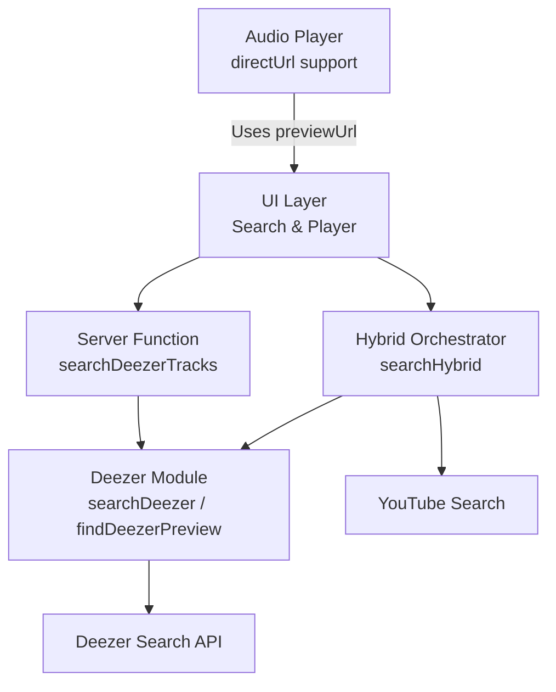
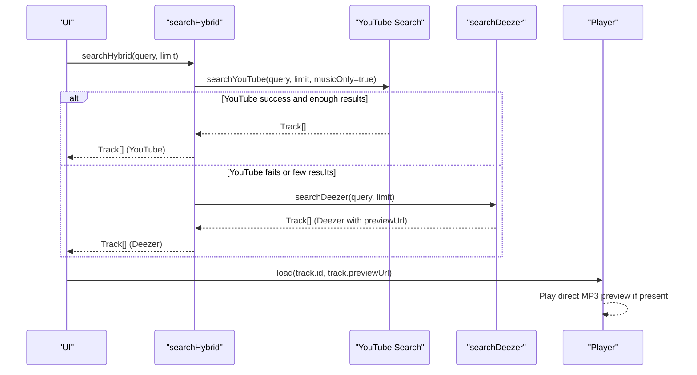
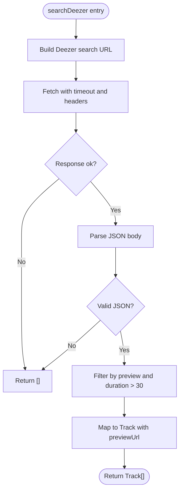
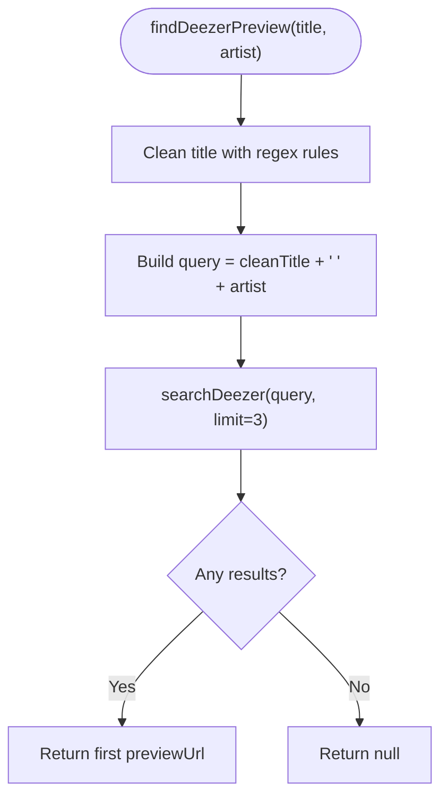
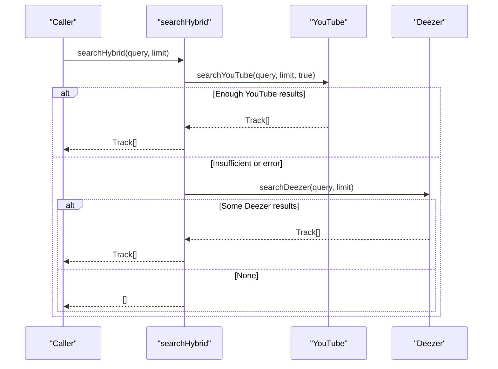
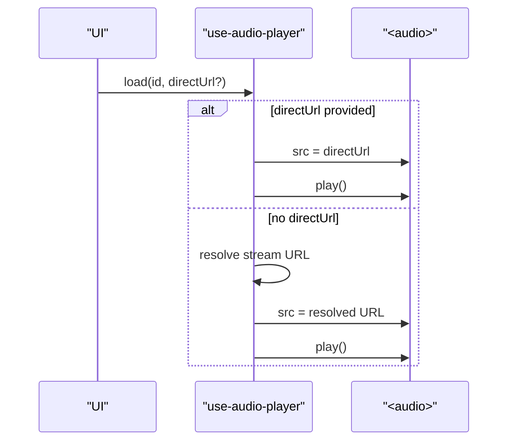

# Deezer Music API Integration

<cite>
**Referenced Files in This Document**
- [deezer.server.ts](file://src/lib/deezer.server.ts)
- [music-hybrid.server.ts](file://src/lib/music-hybrid.server.ts)
- [music.functions.ts](file://src/lib/music.functions.ts)
- [music.server.ts](file://src/lib/music.server.ts)
- [index.tsx](file://src/routes/index.tsx)
- [use-audio-player.ts](file://src/lib/use-audio-player.ts)
</cite>

## Table of Contents
1. [Introduction](#introduction)
2. [Project Structure](#project-structure)
3. [Core Components](#core-components)
4. [Architecture Overview](#architecture-overview)
5. [Detailed Component Analysis](#detailed-component-analysis)
6. [Dependency Analysis](#dependency-analysis)
7. [Performance Considerations](#performance-considerations)
8. [Troubleshooting Guide](#troubleshooting-guide)
9. [Conclusion](#conclusion)
10. [Appendices](#appendices)

## Introduction
This document explains the Deezer music API integration used as a reliable fallback when YouTube search fails or tracks are restricted. The system provides 30-second audio previews via Deezer’s free, no-API-key search endpoint and integrates seamlessly with the existing player to ensure playback continuity. It covers:
- Search functionality and parameters
- Response format and track metadata
- Title cleaning for matching by title and artist
- Error handling, timeouts, and rate limiting considerations
- End-to-end workflow between YouTube and Deezer sources
- Practical guidance for integrating Deezer previews into the music player

## Project Structure
The Deezer integration spans server-side utilities and client-side playback logic:
- Server-side Deezer search and helper functions live under src/lib/deezer.server.ts
- Hybrid orchestration (YouTube primary, Deezer fallback) lives under src/lib/music-hybrid.server.ts
- A server function exposes a POST endpoint for direct Deezer search from the UI layer under src/lib/music.functions.ts
- The Track type is defined centrally under src/lib/music.server.ts
- The player consumes preview URLs directly under src/routes/index.tsx and src/lib/use-audio-player.ts

**Diagram sources**
- [music.functions.ts:34-44](file://src/lib/music.functions.ts#L34-L44)
- [deezer.server.ts:39-96](file://src/lib/deezer.server.ts#L39-L96)
- [music-hybrid.server.ts:22-49](file://src/lib/music-hybrid.server.ts#L22-L49)
- [index.tsx:537-540](file://src/routes/index.tsx#L537-L540)
- [use-audio-player.ts:142-172](file://src/lib/use-audio-player.ts#L142-L172)

**Section sources**
- [music.functions.ts:34-44](file://src/lib/music.functions.ts#L34-L44)
- [deezer.server.ts:39-96](file://src/lib/deezer.server.ts#L39-L96)
- [music-hybrid.server.ts:22-49](file://src/lib/music-hybrid.server.ts#L22-L49)
- [music.server.ts:1-13](file://src/lib/music.server.ts#L1-L13)
- [index.tsx:537-540](file://src/routes/index.tsx#L537-L540)
- [use-audio-player.ts:142-172](file://src/lib/use-audio-player.ts#L142-L172)

## Core Components
- searchDeezer(query, limit): Searches Deezer and returns normalized Track[] with direct previewUrl values. Filters to items that have a preview and duration greater than 30 seconds.
- findDeezerPreview(title, artist): Cleans YouTube-style titles to remove clutter, then searches Deezer to return a single preview URL if found.
- searchHybrid(query, limit): Tries YouTube first; if insufficient results or failure occurs, falls back to Deezer to guarantee playable content.
- searchDeezerTracks (server function): Exposes a POST endpoint that accepts query and optional limit, returning Deezer tracks for the UI.

Key behaviors:
- Timeout: 8 seconds per Deezer request using AbortSignal.timeout(8_000).
- Error handling: Network errors, non-OK responses, and JSON parse failures all resolve to empty arrays to keep the UI resilient.
- Rate limiting: No explicit rate limiting is implemented; callers should avoid excessive concurrent requests and consider debouncing user input on the UI side.

**Section sources**
- [deezer.server.ts:39-96](file://src/lib/deezer.server.ts#L39-L96)
- [music-hybrid.server.ts:22-49](file://src/lib/music-hybrid.server.ts#L22-L49)
- [music.functions.ts:34-44](file://src/lib/music.functions.ts#L34-L44)

## Architecture Overview
The hybrid strategy ensures users always get playable audio:
1. Attempt YouTube search for full tracks.
2. If YouTube yields sufficient results, use them.
3. Otherwise, fall back to Deezer to provide 30-second previews.
4. The player can play Deezer previews directly via their previewUrl without proxying.

**Diagram sources**
- [music-hybrid.server.ts:22-49](file://src/lib/music-hybrid.server.ts#L22-L49)
- [deezer.server.ts:39-74](file://src/lib/deezer.server.ts#L39-L74)
- [index.tsx:537-540](file://src/routes/index.tsx#L537-L540)
- [use-audio-player.ts:142-172](file://src/lib/use-audio-player.ts#L142-L172)

## Detailed Component Analysis

### searchDeezer(query, limit)
- Purpose: Search Deezer and return normalized tracks with direct preview URLs.
- Parameters:
  - query: string — search term (e.g., song title + artist)
  - limit: number — maximum number of results (default 10)
- Behavior:
  - Builds a GET request to the public Deezer search endpoint with encoded query and limit.
  - Sets a User-Agent header and an 8-second timeout.
  - On network error, non-OK response, or invalid JSON, returns an empty array.
  - Filters results to those with a preview and duration > 30 seconds.
  - Maps each result to the shared Track type with id prefixed by “deezer:”, title, artist, formatted duration, thumbnail (album cover), previewUrl, and source set to “deezer”.
- Complexity: O(n) over returned results for filtering and mapping.
- Timeouts and errors: 8s timeout; all errors degrade gracefully to empty results.

**Diagram sources**
- [deezer.server.ts:39-74](file://src/lib/deezer.server.ts#L39-L74)

**Section sources**
- [deezer.server.ts:39-74](file://src/lib/deezer.server.ts#L39-L74)

### findDeezerPreview(title, artist)
- Purpose: Given a YouTube-style title and artist, find a matching Deezer preview URL.
- Title cleaning:
  - Removes trailing segments after “|”
  - Removes parenthesized phrases containing “official”
  - Removes bracketed tags like “[Lyrics]”, “[HD]”
  - Removes common keywords such as “official video”, “official audio”, “lyrics”, “hd”, “4k”, “mv”
  - Trims whitespace and caps length at 80 characters
- Query construction: Combines cleaned title with artist; if cleaned title is empty, uses original title.
- Execution: Calls searchDeezer with a small limit (3) and returns the first previewUrl or null.

**Diagram sources**
- [deezer.server.ts:80-96](file://src/lib/deezer.server.ts#L80-L96)
- [deezer.server.ts:39-74](file://src/lib/deezer.server.ts#L39-L74)

**Section sources**
- [deezer.server.ts:80-96](file://src/lib/deezer.server.ts#L80-L96)

### searchHybrid(query, limit)
- Purpose: Provide a robust search experience by preferring YouTube but falling back to Deezer.
- Strategy:
  - Try YouTube first with music-only filter.
  - If YouTube returns at least min(limit, 5) results, return those.
  - Otherwise, try Deezer search with the same query and limit.
  - If both fail, return an empty array.
- Logging: Warns on console when YouTube or Deezer fallbacks occur.

**Diagram sources**
- [music-hybrid.server.ts:22-49](file://src/lib/music-hybrid.server.ts#L22-L49)

**Section sources**
- [music-hybrid.server.ts:22-49](file://src/lib/music-hybrid.server.ts#L22-L49)

### searchDeezerTracks (Server Function)
- Purpose: Expose a POST endpoint to search Deezer from the UI.
- Input validation: Accepts query (string, min 1) and optional limit (number).
- Handler: Dynamically imports searchDeezer and returns { tracks, error: null } on success or empty tracks on error.

Usage pattern:
- UI calls the server function with a query and optional limit.
- Receives Deezer tracks with previewUrl ready for playback.

**Section sources**
- [music.functions.ts:34-44](file://src/lib/music.functions.ts#L34-L44)

### Player Integration with Deezer Previews
- Direct URL support: The player accepts a directUrl parameter to bypass the stream proxy when available.
- Route-level helper: Extracts previewUrl from a track to pass as directUrl to the player.
- Playback flow:
  - If a directUrl exists (e.g., Deezer preview), set it directly on the audio element.
  - Otherwise, use the standard stream resolution path.

**Diagram sources**
- [index.tsx:537-540](file://src/routes/index.tsx#L537-L540)
- [use-audio-player.ts:142-172](file://src/lib/use-audio-player.ts#L142-L172)

**Section sources**
- [index.tsx:537-540](file://src/routes/index.tsx#L537-L540)
- [use-audio-player.ts:142-172](file://src/lib/use-audio-player.ts#L142-L172)

## Dependency Analysis
- deezer.server.ts depends on the shared Track type from music.server.ts.
- music-hybrid.server.ts composes both YouTube and Deezer modules dynamically to minimize startup cost and handle failures gracefully.
- music.functions.ts exposes server functions that import modules on demand and call Deezer search.
- The UI layer reads previewUrl from tracks and passes it to the player for direct playback.

**Diagram sources**
- [music.server.ts:1-13](file://src/lib/music.server.ts#L1-L13)
- [deezer.server.ts:9-96](file://src/lib/deezer.server.ts#L9-L96)
- [music-hybrid.server.ts:14-49](file://src/lib/music-hybrid.server.ts#L14-L49)
- [music.functions.ts:34-44](file://src/lib/music.functions.ts#L34-L44)
- [index.tsx:537-540](file://src/routes/index.tsx#L537-L540)
- [use-audio-player.ts:142-172](file://src/lib/use-audio-player.ts#L142-L172)

**Section sources**
- [music.server.ts:1-13](file://src/lib/music.server.ts#L1-L13)
- [deezer.server.ts:9-96](file://src/lib/deezer.server.ts#L9-L96)
- [music-hybrid.server.ts:14-49](file://src/lib/music-hybrid.server.ts#L14-L49)
- [music.functions.ts:34-44](file://src/lib/music.functions.ts#L34-L44)
- [index.tsx:537-540](file://src/routes/index.tsx#L537-L540)
- [use-audio-player.ts:142-172](file://src/lib/use-audio-player.ts#L142-L172)

## Performance Considerations
- Caching: YouTube search results are cached in-memory with a 5-minute TTL and LRU eviction. This reduces repeated network calls and improves responsiveness.
- Dynamic imports: Both YouTube and Deezer modules are imported lazily within hybrid search to reduce initial bundle size and startup time.
- Request limits: Deezer requests use a small default limit (10) and a conservative limit (3) for title-based matching to minimize payload size and latency.
- Duration filter: Only tracks with duration > 30 seconds are included, ensuring meaningful previews.
- Recommendations:
  - Debounce UI search inputs to avoid rapid-fire requests.
  - Consider adding a simple in-process cache for Deezer queries if usage spikes.
  - Monitor network conditions and adjust limits or add retry/backoff strategies at the caller level.

[No sources needed since this section provides general guidance]

## Troubleshooting Guide
Common issues and resolutions:
- Network errors or timeouts:
  - Deezer requests time out after 8 seconds; failures return empty arrays to keep the UI responsive.
  - Ensure stable connectivity and consider retrying with exponential backoff at the UI layer.
- Non-OK HTTP responses:
  - Any non-OK status from Deezer degrades to empty results; verify query encoding and limit values.
- Invalid JSON responses:
  - Parsing errors return empty arrays; log and retry with adjusted parameters if necessary.
- No matching preview:
  - findDeezerPreview may return null if no match is found; ensure title cleaning produces a concise, relevant query.
- Rate limiting:
  - There is no built-in rate limiter; implement throttling or queuing on the client if making many concurrent requests.

**Section sources**
- [deezer.server.ts:45-61](file://src/lib/deezer.server.ts#L45-L61)
- [music-hybrid.server.ts:27-46](file://src/lib/music-hybrid.server.ts#L27-L46)

## Conclusion
The Deezer integration provides a robust fallback mechanism that guarantees playable audio even when YouTube search fails or tracks are restricted. With clear parameters, predictable response formats, and resilient error handling, developers can confidently integrate Deezer previews into the player. The hybrid approach balances quality (full songs from YouTube) with reliability (always-available previews from Deezer), while keeping performance and user experience in mind.

[No sources needed since this section summarizes without analyzing specific files]

## Appendices

### API Reference: searchDeezer
- Endpoint: Public Deezer search (no API key required)
- Method: GET
- Base URL: https://api.deezer.com/search
- Query parameters:
  - q: string — search query (URL-encoded)
  - limit: number — max results (default 10)
- Headers:
  - User-Agent: MelodyMap/1.0
- Timeout: 8 seconds
- Response shape: Array of tracks mapped to Track type with previewUrl and source set to “deezer”
- Notes:
  - Filters to tracks with preview and duration > 30 seconds
  - Errors and non-OK responses return empty arrays

**Section sources**
- [deezer.server.ts:39-74](file://src/lib/deezer.server.ts#L39-L74)

### API Reference: findDeezerPreview
- Inputs:
  - title: string — YouTube-style title (will be cleaned)
  - artist: string — artist name
- Output:
  - String preview URL if found, otherwise null
- Behavior:
  - Cleans title to remove common YouTube-specific clutter
  - Constructs a combined query with artist
  - Uses a small limit (3) for efficiency

**Section sources**
- [deezer.server.ts:80-96](file://src/lib/deezer.server.ts#L80-L96)

### Integration Examples (Conceptual)
- Searching Deezer from the UI:
  - Call the server function searchDeezerTracks with a query and optional limit.
  - Receive tracks with previewUrl and render them in the search results.
- Playing a Deezer preview:
  - When loading a track, pass its previewUrl as directUrl to the player.
  - The player will set the audio element’s src to the preview URL and play it directly.
- Fallback workflow:
  - Use searchHybrid to attempt YouTube first; if insufficient or failed, rely on Deezer results.
  - Display a consistent UI regardless of source; treat previewUrl as a hint for direct playback.

[No sources needed since this section provides conceptual guidance]