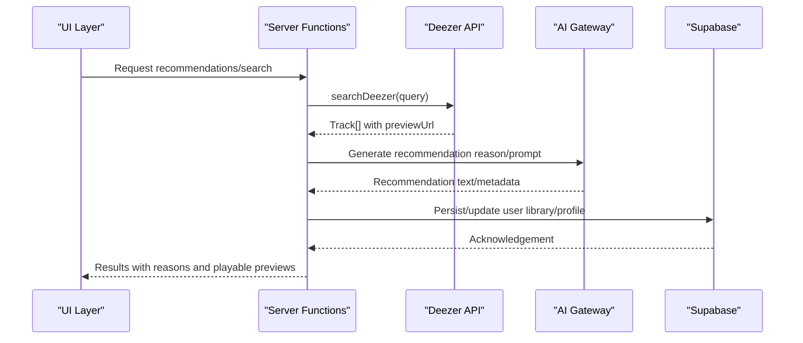
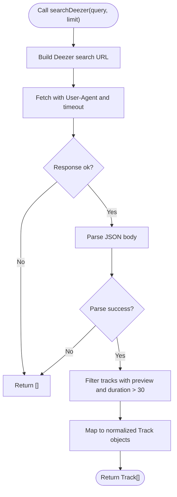
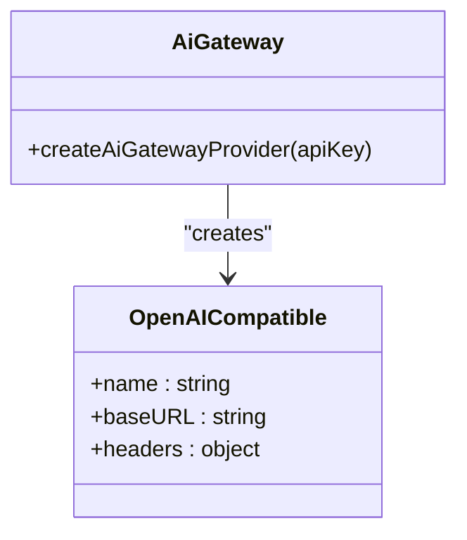
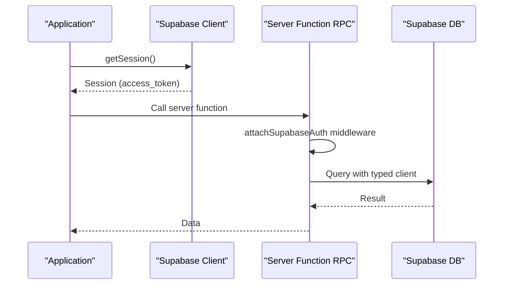
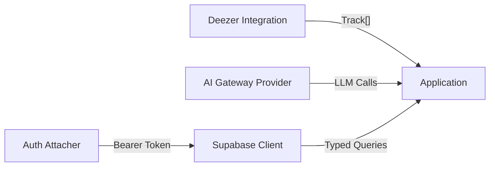

# External API Integrations

<cite>
**Referenced Files in This Document**
- [deezer.server.ts](file://src/lib/deezer.server.ts)
- [ai-gateway.server.ts](file://src/lib/ai-gateway.server.ts)
- [client.ts](file://src/integrations/supabase/client.ts)
- [auth-attacher.ts](file://src/integrations/supabase/auth-attacher.ts)
- [types.ts](file://src/integrations/supabase/types.ts)
- [music.server.ts](file://src/lib/music.server.ts)
- [auth.ts](file://src/lib/auth.ts)
- [error-capture.ts](file://src/lib/error-capture.ts)
- [server.ts](file://src/server.ts)
- [config.toml](file://supabase/config.toml)
</cite>

## Table of Contents
1. Introduction
2. Project Structure
3. Core Components
4. Architecture Overview
5. Detailed Component Analysis
6. Dependency Analysis
7. Performance Considerations
8. Troubleshooting Guide
9. Conclusion
10. Appendices

## Introduction
This document provides detailed API documentation for external service integrations used by the application:
- Deezer Music API integration for track metadata retrieval, preview URL generation, and artist information with authentication requirements and rate limiting considerations.
- AI recommendation gateway using an OpenAI-compatible provider to power recommendations, including model selection, prompt templates, and response parsing guidance.
- Supabase backend services for database operations, authentication flows, and real-time subscriptions, including client setup and environment configuration.

The document includes configuration schemas, environment variables, error handling strategies, implementation examples (via code paths), retry logic patterns, and security considerations for safe and compliant usage of external APIs.

## Project Structure
External integrations are organized into focused modules:
- Deezer integration under server-side library utilities for search and preview resolution.
- AI gateway provider configured via an OpenAI-compatible adapter.
- Supabase client and auth middleware for typed database access and authenticated RPCs.

```mermaid
graph TB
subgraph "Server Libraries"
DZ["Deezer Integration<br/>searchDeezer / findDeezerPreview"]
AI["AI Gateway Provider<br/>createAiGatewayProvider"]
YT["YouTube Search Utilities<br/>searchYouTube / suggestQueries"]
end
subgraph "Supabase Integration"
SB_CLIENT["Supabase Client<br/>createClient + fetch wrapper"]
AUTH_ATTACH["Auth Attacher Middleware<br/>attachSupabaseAuth"]
TYPES["Database Types<br/>Tables: profiles, user_library"]
end
DZ --> |"returns Track[] with previewUrl"| YT
AI --> |"OpenAI-compatible calls"||"External LLM API"|
SB_CLIENT --> |"Typed DB access"| TYPES
AUTH_ATTACH --> |"Bearer token on RPCs"| SB_CLIENT
```

**Diagram sources**
- [deezer.server.ts:39-96](file://src/lib/deezer.server.ts#L39-L96)
- [ai-gateway.server.ts:3-9](file://src/lib/ai-gateway.server.ts#L3-L9)
- [music.server.ts:140-213](file://src/lib/music.server.ts#L140-L213)
- [client.ts:30-67](file://src/integrations/supabase/client.ts#L30-L67)
- [auth-attacher.ts:7-15](file://src/integrations/supabase/auth-attacher.ts#L7-L15)
- [types.ts:15-73](file://src/integrations/supabase/types.ts#L15-L73)

**Section sources**
- [deezer.server.ts:1-97](file://src/lib/deezer.server.ts#L1-L97)
- [ai-gateway.server.ts:1-10](file://src/lib/ai-gateway.server.ts#L1-L10)
- [client.ts:1-69](file://src/integrations/supabase/client.ts#L1-L69)
- [auth-attacher.ts:1-16](file://src/integrations/supabase/auth-attacher.ts#L1-L16)
- [types.ts:1-197](file://src/integrations/supabase/types.ts#L1-L197)
- [music.server.ts:1-214](file://src/lib/music.server.ts#L1-L214)

## Core Components
- Deezer Integration: Provides search and preview resolution without requiring an API key; returns normalized tracks with direct preview URLs.
- AI Gateway: Configures an OpenAI-compatible provider through a gateway endpoint, passing an API key header.
- Supabase Client: Initializes a typed client with environment-driven configuration, custom fetch wrapper, and auth persistence.
- Auth Attacher: Injects the current Supabase session token into server function RPC headers.
- Error Capture: Captures and describes errors for better observability across layers.

**Section sources**
- [deezer.server.ts:39-96](file://src/lib/deezer.server.ts#L39-L96)
- [ai-gateway.server.ts:3-9](file://src/lib/ai-gateway.server.ts#L3-L9)
- [client.ts:30-67](file://src/integrations/supabase/client.ts#L30-L67)
- [auth-attacher.ts:7-15](file://src/integrations/supabase/auth-attacher.ts#L7-L15)
- [error-capture.ts:18-32](file://src/lib/error-capture.ts#L18-L32)

## Architecture Overview
The system integrates three external services:
- Deezer: Used as a fallback or alternative source for music previews when YouTube results are restricted or unavailable.
- AI Gateway: Supplies recommendation reasoning and suggestions via an OpenAI-compatible interface.
- Supabase: Stores user profiles and library data, handles authentication, and supports real-time features.



**Diagram sources**
- [deezer.server.ts:39-96](file://src/lib/deezer.server.ts#L39-L96)
- [ai-gateway.server.ts:3-9](file://src/lib/ai-gateway.server.ts#L3-L9)
- [client.ts:30-67](file://src/integrations/supabase/client.ts#L30-L67)
- [auth-attacher.ts:7-15](file://src/integrations/supabase/auth-attacher.ts#L7-L15)

## Detailed Component Analysis

### Deezer Integration
Responsibilities:
- Search Deezer for tracks matching a query and return normalized tracks with direct preview URLs.
- Resolve a Deezer preview URL given a title and artist, cleaning up common noise from titles.

Key behaviors:
- No API key required; uses public search endpoint.
- Uses a User-Agent header and request timeout to avoid hanging requests.
- Filters results to ensure valid previews and reasonable durations.
- Returns empty arrays on network or parse failures to keep the UI resilient.

Authentication and Rate Limiting:
- Authentication: Not required for public search.
- Rate Limiting: The code does not implement explicit rate limiting; callers should consider adding backoff/retry if high volume is expected.

Error Handling:
- Network errors and non-OK responses return empty arrays.
- JSON parse errors return empty arrays.
- Timeout is enforced via AbortSignal.

Implementation Examples (paths):
- Search tracks: [searchDeezer:39-74](file://src/lib/deezer.server.ts#L39-L74)
- Find preview by title/artist: [findDeezerPreview:80-96](file://src/lib/deezer.server.ts#L80-L96)



**Diagram sources**
- [deezer.server.ts:39-74](file://src/lib/deezer.server.ts#L39-L74)

**Section sources**
- [deezer.server.ts:1-97](file://src/lib/deezer.server.ts#L1-L97)

### AI Gateway Configuration
Responsibilities:
- Create an OpenAI-compatible provider pointing to the gateway endpoint with a custom API key header.

Configuration:
- Base URL: https://ai.gateway.lovable.dev/v1
- Header: Lovable-API-Key set to the provided apiKey parameter.
- Provider name: melodymap-ai

Model Selection and Prompts:
- Model selection is handled by the caller using the returned provider instance. Configure model names per your gateway’s supported models.
- Prompt templates should be defined in your application layer; this module only configures transport and authentication.

Response Parsing:
- Response parsing depends on the SDK you use with the provider. Ensure you handle streaming vs non-streaming responses appropriately in your calling code.

Security:
- Never hardcode the API key; pass it securely at runtime via environment variables.
- Validate and sanitize prompts to prevent injection.

Implementation Example (path):
- Provider creation: [createAiGatewayProvider:3-9](file://src/lib/ai-gateway.server.ts#L3-L9)



**Diagram sources**
- [ai-gateway.server.ts:3-9](file://src/lib/ai-gateway.server.ts#L3-L9)

**Section sources**
- [ai-gateway.server.ts:1-10](file://src/lib/ai-gateway.server.ts#L1-L10)

### Supabase Backend Services
Responsibilities:
- Initialize a typed Supabase client with environment-based configuration.
- Attach Supabase session tokens to server function RPCs.
- Provide strongly-typed database schema for profiles and user_library tables.

Environment Variables:
- VITE_SUPABASE_URL or SUPABASE_URL
- VITE_SUPABASE_PUBLISHABLE_KEY or SUPABASE_PUBLISHABLE_KEY

Client Setup:
- Custom fetch wrapper ensures correct apikey header and avoids misusing new-style keys as Bearer tokens.
- Auth options enable localStorage persistence and auto token refresh.

Authentication Flows:
- Use supabase.auth.getSession and onAuthStateChange to manage sessions.
- attachSupabaseAuth middleware injects Authorization: Bearer <token> for server functions.

Real-Time Subscriptions:
- Use Supabase Realtime channels in your application layer; the client supports subscription APIs out of the box.

Database Schema:
- Tables:
  - profiles: id, display_name, avatar_url, created_at, updated_at
  - user_library: user_id, data (JSON), updated_at

Implementation Examples (paths):
- Client initialization: [createSupabaseClient:30-56](file://src/integrations/supabase/client.ts#L30-L56)
- Auth middleware: [attachSupabaseAuth:7-15](file://src/integrations/supabase/auth-attacher.ts#L7-L15)
- Database types: [Database schema:15-73](file://src/integrations/supabase/types.ts#L15-L73)
- Auth hook usage: [useAuth:12-69](file://src/lib/auth.ts#L12-L69)



**Diagram sources**
- [client.ts:30-67](file://src/integrations/supabase/client.ts#L30-L67)
- [auth-attacher.ts:7-15](file://src/integrations/supabase/auth-attacher.ts#L7-L15)
- [types.ts:15-73](file://src/integrations/supabase/types.ts#L15-L73)

**Section sources**
- [client.ts:1-69](file://src/integrations/supabase/client.ts#L1-L69)
- [auth-attacher.ts:1-16](file://src/integrations/supabase/auth-attacher.ts#L1-L16)
- [types.ts:1-197](file://src/integrations/supabase/types.ts#L1-L197)
- [auth.ts:1-70](file://src/lib/auth.ts#L1-L70)

## Dependency Analysis
- Deezer integration depends on standard fetch and returns normalized Track objects compatible with other parts of the app.
- AI gateway depends on an OpenAI-compatible SDK and requires a valid API key header.
- Supabase client depends on environment variables and provides typed queries against the public schema.
- Auth middleware depends on Supabase session state and attaches tokens to RPCs.



**Diagram sources**
- [deezer.server.ts:39-96](file://src/lib/deezer.server.ts#L39-L96)
- [ai-gateway.server.ts:3-9](file://src/lib/ai-gateway.server.ts#L3-L9)
- [client.ts:30-67](file://src/integrations/supabase/client.ts#L30-L67)
- [auth-attacher.ts:7-15](file://src/integrations/supabase/auth-attacher.ts#L7-L15)

**Section sources**
- [deezer.server.ts:39-96](file://src/lib/deezer.server.ts#L39-L96)
- [ai-gateway.server.ts:3-9](file://src/lib/ai-gateway.server.ts#L3-L9)
- [client.ts:30-67](file://src/integrations/supabase/client.ts#L30-L67)
- [auth-attacher.ts:7-15](file://src/integrations/supabase/auth-attacher.ts#L7-L15)

## Performance Considerations
- Network Timeouts:
  - Deezer search enforces an 8-second timeout to prevent long hangs.
  - Streaming proxy uses bounded chunk sizes and timeouts to mitigate throttling and large payloads.
- Caching:
  - Consider caching frequent search results or preview resolutions to reduce external API load.
- Backpressure:
  - For high-volume scenarios, add exponential backoff and jitter for retries on transient errors.
- Media Streaming:
  - The server proxies media in 1 MiB chunks to work around throttled URLs and support seeking.

[No sources needed since this section provides general guidance]

## Troubleshooting Guide
Common issues and strategies:
- Missing Environment Variables:
  - Supabase client throws an error if required environment variables are missing. Ensure VITE_SUPABASE_URL and VITE_SUPABASE_PUBLISHABLE_KEY (or server equivalents) are set.
  - Reference: [client.ts:30-44](file://src/integrations/supabase/client.ts#L30-L44)
- Network Errors:
  - Deezer search returns empty arrays on failure; verify connectivity and consider retry logic in higher layers.
  - Reference: [deezer.server.ts:45-61](file://src/lib/deezer.server.ts#L45-L61)
- Error Observability:
  - Global error capture expands error stacks and cause chains for better diagnostics.
  - Reference: [error-capture.ts:18-32](file://src/lib/error-capture.ts#L18-L32)
- Stream Proxy Issues:
  - Range requests and size checks help avoid truncated downloads and throttling.
  - Reference: [server.ts:62-174](file://src/server.ts#L62-L174)

**Section sources**
- [client.ts:30-44](file://src/integrations/supabase/client.ts#L30-L44)
- [deezer.server.ts:45-61](file://src/lib/deezer.server.ts#L45-L61)
- [error-capture.ts:18-32](file://src/lib/error-capture.ts#L18-L32)
- [server.ts:62-174](file://src/server.ts#L62-L174)

## Conclusion
The application integrates Deezer, an AI recommendation gateway, and Supabase to deliver robust music discovery and playback experiences:
- Deezer provides reliable previews and metadata without API keys, with graceful error handling.
- The AI gateway enables flexible recommendation engines via an OpenAI-compatible interface, with secure key management.
- Supabase offers typed database access, authentication, and real-time capabilities, with clear environment configuration and middleware for secure RPC calls.

Adopt retry logic, timeouts, and caching where appropriate to improve resilience and performance. Follow security best practices to protect API keys and user data.

[No sources needed since this section summarizes without analyzing specific files]

## Appendices

### Configuration Schemas and Environment Variables
- Supabase:
  - Required: VITE_SUPABASE_URL or SUPABASE_URL; VITE_SUPABASE_PUBLISHABLE_KEY or SUPABASE_PUBLISHABLE_KEY
  - Behavior: Throws if missing; sets apikey header; persists sessions and auto-refreshes tokens.
  - Reference: [client.ts:30-56](file://src/integrations/supabase/client.ts#L30-L56)
- AI Gateway:
  - Requires a valid API key passed to createAiGatewayProvider; header Lovable-API-Key is set automatically.
  - Reference: [ai-gateway.server.ts:3-9](file://src/lib/ai-gateway.server.ts#L3-L9)
- Supabase Project ID:
  - Stored in configuration file for project identification.
  - Reference: [config.toml:1](file://supabase/config.toml#L1)

**Section sources**
- [client.ts:30-56](file://src/integrations/supabase/client.ts#L30-L56)
- [ai-gateway.server.ts:3-9](file://src/lib/ai-gateway.server.ts#L3-L9)
- [config.toml:1](file://supabase/config.toml#L1)

### Security and Compliance Considerations
- API Key Management:
  - Store secrets in environment variables; never hardcode keys in source.
  - Use minimal permissions for API keys and restrict access to necessary endpoints.
- Data Privacy:
  - Avoid logging sensitive data (tokens, PII). Sanitize logs and error messages.
  - Comply with applicable regulations (e.g., GDPR) when storing user data in Supabase.
- External API Usage:
  - Respect terms of service for Deezer and AI gateway providers.
  - Implement rate limiting and backoff to avoid overloading external services.
- Transport Security:
  - Use HTTPS for all external calls; enforce TLS in production.
  - Validate and sanitize inputs to prevent injection attacks.

[No sources needed since this section provides general guidance]

### Implementation Examples (Paths)
- Handle API Responses:
  - Normalize and filter Deezer results: [deezer.server.ts:63-74](file://src/lib/deezer.server.ts#L63-L74)
  - Parse and validate AI responses in your calling code based on the SDK’s conventions.
- Manage Authentication Tokens:
  - Retrieve session and attach to RPCs: [auth-attacher.ts:7-15](file://src/integrations/supabase/auth-attacher.ts#L7-L15)
  - Manage user session state: [auth.ts:12-69](file://src/lib/auth.ts#L12-L69)
- Implement Retry Logic:
  - Add retry with exponential backoff in higher-level functions that call Deezer or AI gateway.
  - Leverage existing timeouts and chunked streaming for robust media delivery: [server.ts:62-174](file://src/server.ts#L62-L174)

**Section sources**
- [deezer.server.ts:63-74](file://src/lib/deezer.server.ts#L63-L74)
- [auth-attacher.ts:7-15](file://src/integrations/supabase/auth-attacher.ts#L7-L15)
- [auth.ts:12-69](file://src/lib/auth.ts#L12-L69)
- [server.ts:62-174](file://src/server.ts#L62-L174)