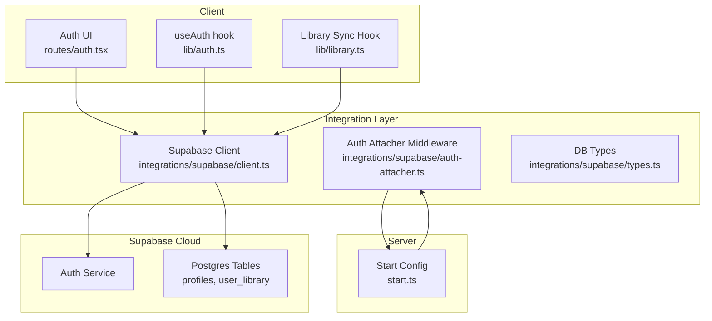
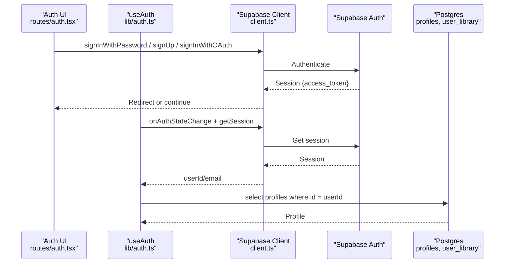
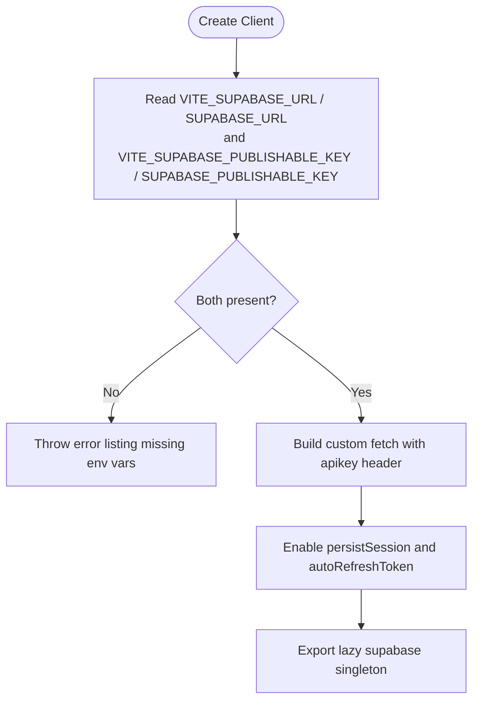
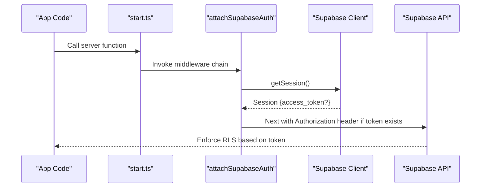
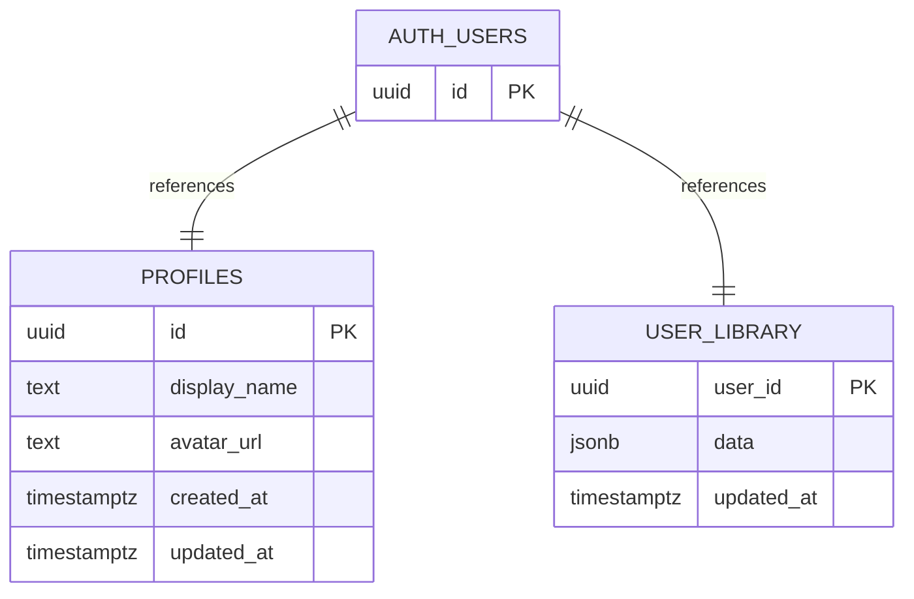
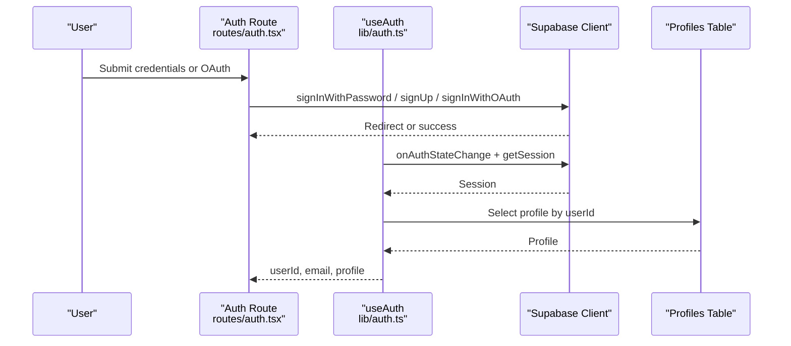
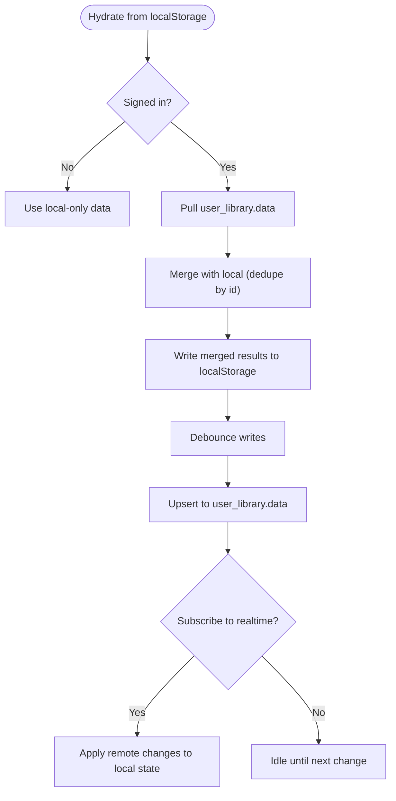
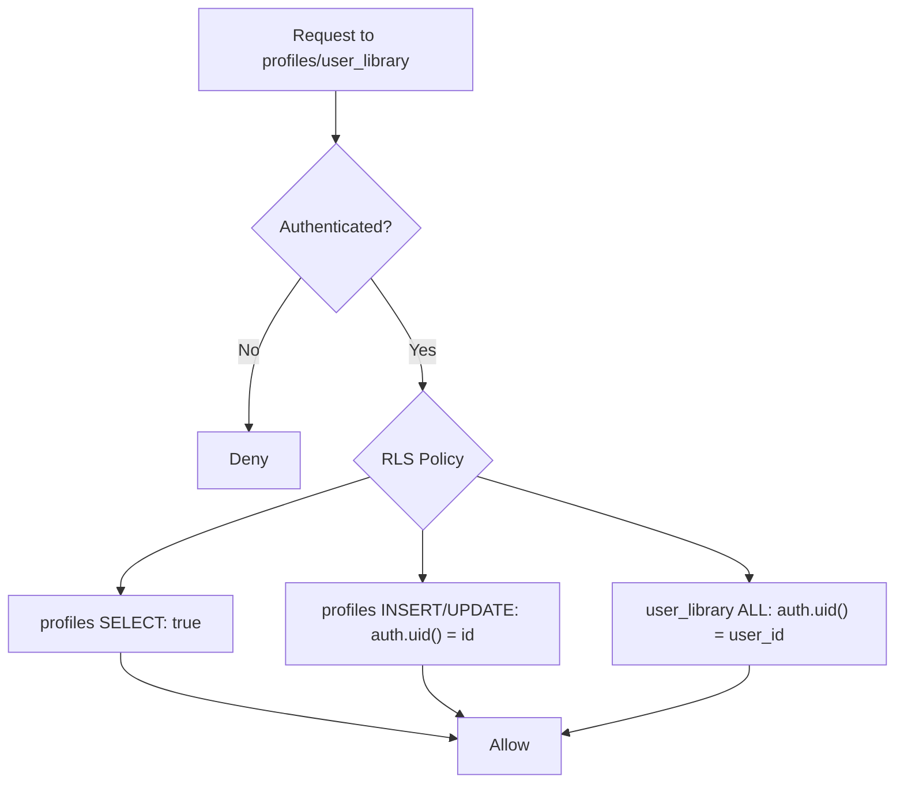
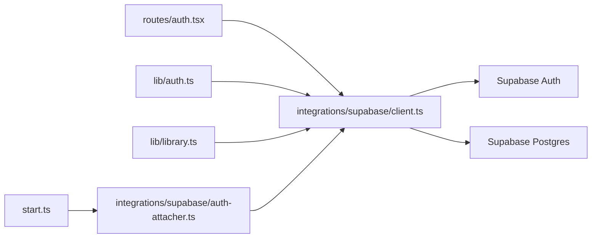

# Supabase Backend Services

<cite>
**Referenced Files in This Document**
- [client.ts](file://src/integrations/supabase/client.ts)
- [auth-attacher.ts](file://src/integrations/supabase/auth-attacher.ts)
- [types.ts](file://src/integrations/supabase/types.ts)
- [config.toml](file://supabase/config.toml)
- [20260808085443_8253f78c-652e-4cb4-8772-8818ce90215c.sql](file://supabase/migrations/20260808085443_8253f78c-652e-4cb4-8772-8818ce90215c.sql)
- [20260808085506_fb5fd43f-6504-4c96-8335-2aeac753c924.sql](file://supabase/migrations/20260808085506_fb5fd43f-6504-4c96-8335-2aeac753c924.sql)
- [auth.ts](file://src/lib/auth.ts)
- [auth.tsx](file://src/routes/auth.tsx)
- [library.ts](file://src/lib/library.ts)
- [start.ts](file://src/start.ts)
</cite>

## Table of Contents
1. [Introduction](#introduction)
2. [Project Structure](#project-structure)
3. [Core Components](#core-components)
4. [Architecture Overview](#architecture-overview)
5. [Detailed Component Analysis](#detailed-component-analysis)
6. [Dependency Analysis](#dependency-analysis)
7. [Performance Considerations](#performance-considerations)
8. [Troubleshooting Guide](#troubleshooting-guide)
9. [Conclusion](#conclusion)
10. [Appendices](#appendices)

## Introduction
This document explains how the application integrates with Supabase for authentication, database access, and data synchronization. It covers client initialization, environment configuration, session management via middleware, type-safe database schemas, real-time capabilities, and practical examples for CRUD operations on user libraries and profile updates. It also documents security policies (row-level security), migration strategy, and error handling patterns for network failures, authentication timeouts, and database constraints.

## Project Structure
The Supabase integration is centered around a small set of files:
- Client initialization and fetch customization live in the integrations layer.
- Authentication state and profile management are implemented in React hooks and routes.
- Database schema and types are generated from migrations and exposed as TypeScript types.
- A server function middleware attaches the current session token to outbound RPC calls.
- Library sync logic bridges local storage with cloud storage using Supabase.

**Diagram sources**
- [client.ts:30-56](file://src/integrations/supabase/client.ts#L30-L56)
- [auth-attacher.ts:7-15](file://src/integrations/supabase/auth-attacher.ts#L7-L15)
- [types.ts:9-73](file://src/integrations/supabase/types.ts#L9-L73)
- [auth.tsx:46-93](file://src/routes/auth.tsx#L46-L93)
- [auth.ts:12-69](file://src/lib/auth.ts#L12-L69)
- [library.ts:242-349](file://src/lib/library.ts#L242-L349)
- [start.ts:28-31](file://src/start.ts#L28-L31)

**Section sources**
- [client.ts:30-56](file://src/integrations/supabase/client.ts#L30-L56)
- [auth-attacher.ts:7-15](file://src/integrations/supabase/auth-attacher.ts#L7-L15)
- [types.ts:9-73](file://src/integrations/supabase/types.ts#L9-L73)
- [auth.tsx:46-93](file://src/routes/auth.tsx#L46-L93)
- [auth.ts:12-69](file://src/lib/auth.ts#L12-L69)
- [library.ts:242-349](file://src/lib/library.ts#L242-L349)
- [start.ts:28-31](file://src/start.ts#L28-L31)

## Core Components
- Supabase client initialization: Creates a typed client with custom fetch that injects the API key and handles new-style keys. Enables persistent sessions and automatic token refresh.
- Auth attacher middleware: For server functions, reads the current session and attaches the bearer token to outgoing requests so Supabase enforces RLS correctly.
- Type definitions: Generated types for tables profiles and user_library, plus helper generic types for row/insert/update shapes.
- Auth hook: Subscribes to auth state changes, loads profile, and exposes update/sign-out actions.
- Library sync: Local-first library persisted to localStorage; when signed in, merges with cloud copy and debouncedly pushes changes back to Supabase.

**Section sources**
- [client.ts:30-67](file://src/integrations/supabase/client.ts#L30-L67)
- [auth-attacher.ts:7-15](file://src/integrations/supabase/auth-attacher.ts#L7-L15)
- [types.ts:9-73](file://src/integrations/supabase/types.ts#L9-L73)
- [auth.ts:12-69](file://src/lib/auth.ts#L12-L69)
- [library.ts:242-349](file://src/lib/library.ts#L242-L349)

## Architecture Overview
The app uses a local-first approach with optional cloud sync. The Supabase client is lazily created and configured with environment variables. Authentication flows use email/password and OAuth providers. Server functions automatically receive the user’s JWT via middleware. Data models include user profiles and a JSONB-based user library. Row-level security ensures users can only access their own data.

**Diagram sources**
- [auth.tsx:46-93](file://src/routes/auth.tsx#L46-L93)
- [auth.ts:18-49](file://src/lib/auth.ts#L18-L49)
- [client.ts:30-56](file://src/integrations/supabase/client.ts#L30-L56)

## Detailed Component Analysis

### Supabase Client Initialization and Environment Configuration
- Reads environment variables for URL and publishable key, with fallbacks for client vs SSR.
- Throws a descriptive error if required variables are missing.
- Uses a custom fetch wrapper to ensure the correct apikey header is set and avoids misusing new-style keys as Authorization tokens.
- Enables session persistence and auto-refresh.
- Exports a lazy-initialized singleton via Proxy to avoid unnecessary initialization.

**Diagram sources**
- [client.ts:30-67](file://src/integrations/supabase/client.ts#L30-L67)

**Section sources**
- [client.ts:30-67](file://src/integrations/supabase/client.ts#L30-L67)

### Authentication Attacher Middleware
- Registered as a function middleware in start configuration.
- For each server function call, retrieves the current session and attaches the access token as an Authorization header.
- Ensures Supabase enforces row-level security on server-side operations.

**Diagram sources**
- [auth-attacher.ts:7-15](file://src/integrations/supabase/auth-attacher.ts#L7-L15)
- [start.ts:28-31](file://src/start.ts#L28-L31)

**Section sources**
- [auth-attacher.ts:7-15](file://src/integrations/supabase/auth-attacher.ts#L7-L15)
- [start.ts:28-31](file://src/start.ts#L28-L31)

### Database Schema and Types
- Two primary tables:
  - profiles: stores display name and avatar linked to auth.users.
  - user_library: stores a JSONB document representing the user’s library (likes, dislikes, history, playlists, settings, stats).
- Row-level security policies restrict access to authenticated users and enforce ownership by user_id or id.
- Triggers maintain updated_at timestamps and auto-create profiles on user creation.
- Generated TypeScript types provide compile-time safety for queries and mutations.

**Diagram sources**
- [20260808085443_8253f78c-652e-4cb4-8772-8818ce90215c.sql:1-63](file://supabase/migrations/20260808085443_8253f78c-652e-4cb4-8772-8818ce90215c.sql#L1-L63)
- [types.ts:9-73](file://src/integrations/supabase/types.ts#L9-L73)

**Section sources**
- [20260808085443_8253f78c-652e-4cb4-8772-8818ce90215c.sql:1-63](file://supabase/migrations/20260808085443_8253f78c-652e-4cb4-8772-8818ce90215c.sql#L1-L63)
- [20260808085506_fb5fd43f-6504-4c96-8335-2aeac753c924.sql:1-2](file://supabase/migrations/20260808085506_fb5fd43f-6504-4c96-8335-2aeac753c924.sql#L1-L2)
- [types.ts:9-73](file://src/integrations/supabase/types.ts#L9-L73)

### Authentication Flow and State Management
- Sign-in/sign-up/OAuth handled in the auth route.
- useAuth hook subscribes to auth state changes, initializes session, and loads the user profile.
- Provides updateProfile and signOut utilities.

**Diagram sources**
- [auth.tsx:46-93](file://src/routes/auth.tsx#L46-L93)
- [auth.ts:18-69](file://src/lib/auth.ts#L18-L69)

**Section sources**
- [auth.tsx:46-93](file://src/routes/auth.tsx#L46-L93)
- [auth.ts:18-69](file://src/lib/auth.ts#L18-L69)

### Library Synchronization and Real-Time Updates
- Local-first: likes, dislikes, history, playlists, settings, and stats are stored in localStorage.
- When signed in, the hook pulls the cloud copy once per sign-in and merges it with local data.
- Changes are debounced and upserted into user_library.data.
- Real-time subscriptions: While not currently used in this codebase, Supabase supports channel subscriptions for live updates. To enable cross-device live sync, subscribe to changes on user_library rows filtered by user_id and merge incoming updates into local state.

**Diagram sources**
- [library.ts:242-349](file://src/lib/library.ts#L242-L349)

**Section sources**
- [library.ts:242-349](file://src/lib/library.ts#L242-L349)

### Security Policies and Row-Level Security
- Profiles:
  - SELECT allowed for authenticated users.
  - INSERT/UPDATE restricted to the user’s own row (id matches auth.uid()).
- User library:
  - All operations allowed for authenticated users, but restricted to rows where user_id equals auth.uid().
- Functions:
  - handle_new_user and touch_updated_at are SECURITY DEFINER and revoked from PUBLIC/ANON/AUTHENTICATED to prevent misuse.

**Diagram sources**
- [20260808085443_8253f78c-652e-4cb4-8772-8818ce90215c.sql:9-32](file://supabase/migrations/20260808085443_8253f78c-652e-4cb4-8772-8818ce90215c.sql#L9-L32)
- [20260808085506_fb5fd43f-6504-4c96-8335-2aeac753c924.sql:1-2](file://supabase/migrations/20260808085506_fb5fd43f-6504-4c96-8335-2aeac753c924.sql#L1-L2)

**Section sources**
- [20260808085443_8253f78c-652e-4cb4-8772-8818ce90215c.sql:9-32](file://supabase/migrations/20260808085443_8253f78c-652e-4cb4-8772-8818ce90215c.sql#L9-L32)
- [20260808085506_fb5fd43f-6504-4c96-8335-2aeac753c924.sql:1-2](file://supabase/migrations/20260808085506_fb5fd43f-6504-4c96-8335-2aeac753c924.sql#L1-L2)

### Data Migration Strategy
- Migrations define schema, grants, policies, triggers, and functions.
- New user creation triggers auto-profile insertion with sensible defaults.
- Updated-at triggers keep timestamps consistent.
- Function execution permissions are tightened post-creation.

**Section sources**
- [20260808085443_8253f78c-652e-4cb4-8772-8818ce90215c.sql:1-63](file://supabase/migrations/20260808085443_8253f78c-652e-4cb4-8772-8818ce90215c.sql#L1-L63)
- [20260808085506_fb5fd43f-6504-4c96-8335-2aeac753c924.sql:1-2](file://supabase/migrations/20260808085506_fb5fd43f-6504-4c96-8335-2aeac753c924.sql#L1-L2)

## Dependency Analysis
- The client depends on environment variables and Supabase JS SDK.
- Auth flow depends on the client and React state.
- Library sync depends on both local storage and the client for cloud sync.
- Server functions depend on the auth attacher middleware to propagate tokens.

**Diagram sources**
- [auth.tsx:46-93](file://src/routes/auth.tsx#L46-L93)
- [auth.ts:18-69](file://src/lib/auth.ts#L18-L69)
- [library.ts:242-349](file://src/lib/library.ts#L242-L349)
- [start.ts:28-31](file://src/start.ts#L28-L31)
- [auth-attacher.ts:7-15](file://src/integrations/supabase/auth-attacher.ts#L7-L15)
- [client.ts:30-67](file://src/integrations/supabase/client.ts#L30-L67)

**Section sources**
- [auth.tsx:46-93](file://src/routes/auth.tsx#L46-L93)
- [auth.ts:18-69](file://src/lib/auth.ts#L18-L69)
- [library.ts:242-349](file://src/lib/library.ts#L242-L349)
- [start.ts:28-31](file://src/start.ts#L28-L31)
- [auth-attacher.ts:7-15](file://src/integrations/supabase/auth-attacher.ts#L7-L15)
- [client.ts:30-67](file://src/integrations/supabase/client.ts#L30-L67)

## Performance Considerations
- Lazy client initialization reduces startup overhead.
- Debounced upserts minimize network calls during rapid edits.
- Local-first design improves responsiveness and resilience offline.
- Custom fetch ensures minimal headers and avoids redundant Authorization usage for new-style keys.
- Consider enabling Supabase Realtime channels for live sync across devices if needed.

[No sources needed since this section provides general guidance]

## Troubleshooting Guide
- Missing environment variables:
  - Symptom: Error thrown during client creation indicating missing Supabase URL or key.
  - Resolution: Ensure VITE_SUPABASE_URL and VITE_SUPABASE_PUBLISHABLE_KEY (or server equivalents) are set.
- Network failures:
  - Symptom: Errors during library sync or auth calls.
  - Resolution: Implement retries/backoff around network calls; log errors; degrade gracefully to local-only mode.
- Authentication timeouts:
  - Symptom: Session expires or refresh fails.
  - Resolution: Auto-refresh is enabled; handle sign-out flows and re-auth prompts; verify token validity before sensitive operations.
- Database constraints:
  - Symptom: Upsert fails due to unique constraints or policy violations.
  - Resolution: Validate inputs; ensure user_id matches authenticated user; review RLS policies.

**Section sources**
- [client.ts:36-44](file://src/integrations/supabase/client.ts#L36-L44)
- [library.ts:321-349](file://src/lib/library.ts#L321-L349)
- [auth.ts:18-69](file://src/lib/auth.ts#L18-L69)

## Conclusion
The application integrates Supabase with a robust, local-first architecture. Authentication is straightforward with email/password and OAuth, while server functions automatically carry the user’s token for secure operations. The database schema enforces strict row-level security, and the library sync mechanism balances performance and consistency. Real-time capabilities can be added to support live cross-device updates. Proper error handling and environment configuration ensure reliability and maintainability.

[No sources needed since this section summarizes without analyzing specific files]

## Appendices

### Implementation Examples

- Initialize Supabase client and read session:
  - See client initialization and session retrieval paths.
  - References: [client.ts:30-67](file://src/integrations/supabase/client.ts#L30-L67)

- Perform sign-in/sign-up/OAuth:
  - See auth route handlers.
  - References: [auth.tsx:46-93](file://src/routes/auth.tsx#L46-L93)

- Manage user profile:
  - Load and update profile via useAuth.
  - References: [auth.ts:18-69](file://src/lib/auth.ts#L18-L69)

- CRUD on user library:
  - Pull, merge, and upsert library data with debouncing.
  - References: [library.ts:242-349](file://src/lib/library.ts#L242-L349)

- Real-time subscription setup (conceptual):
  - Subscribe to user_library changes for the current user and apply updates to local state.
  - No direct file mapping; implement using Supabase channels with filters on user_id.

- Security policies:
  - RLS ensures users can only access their own data.
  - References: [20260808085443_8253f78c-652e-4cb4-8772-8818ce90215c.sql:9-32](file://supabase/migrations/20260808085443_8253f78c-652e-4cb4-8772-8818ce90215c.sql#L9-L32)

- Data migrations:
  - Schema, triggers, and functions defined in migrations.
  - References: [20260808085443_8253f78c-652e-4cb4-8772-8818ce90215c.sql:1-63](file://supabase/migrations/20260808085443_8253f78c-652e-4cb4-8772-8818ce90215c.sql#L1-L63), [20260808085506_fb5fd43f-6504-4c96-8335-2aeac753c924.sql:1-2](file://supabase/migrations/20260808085506_fb5fd43f-6504-4c96-8335-2aeac753c924.sql#L1-L2)