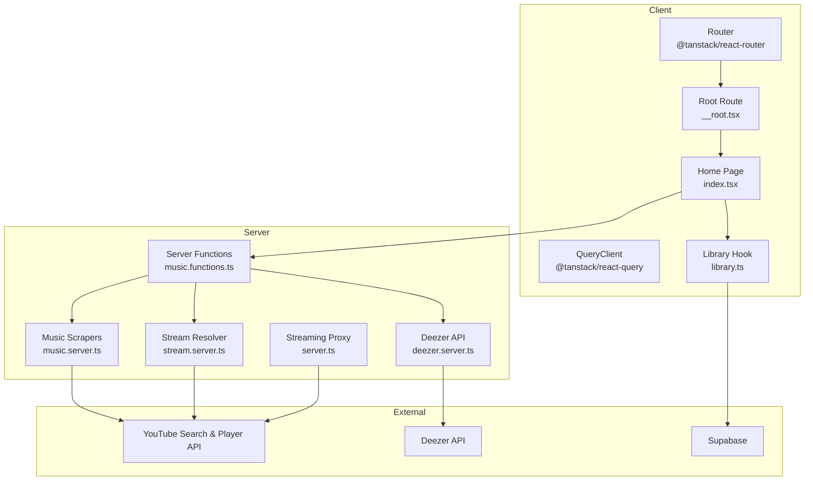
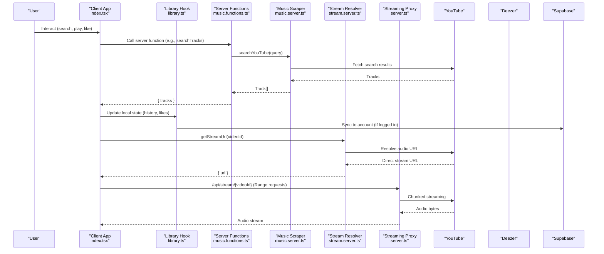
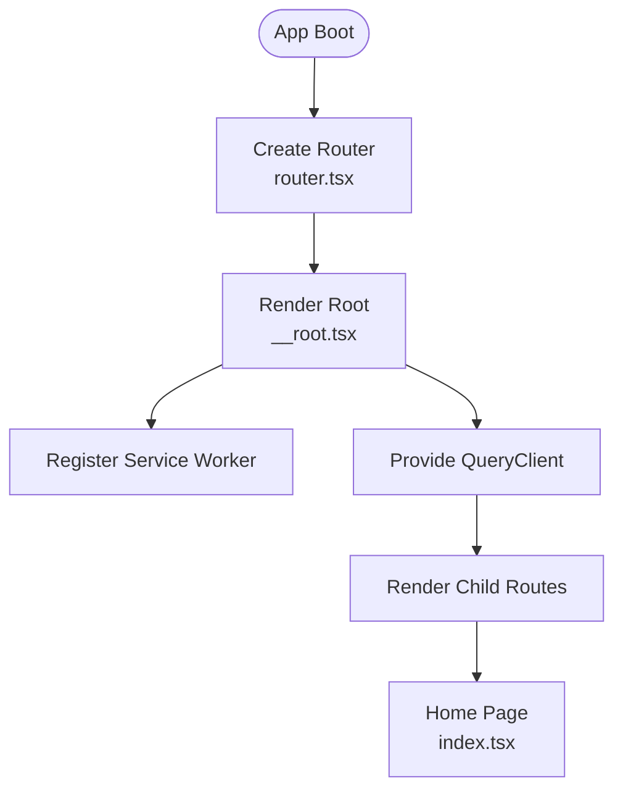
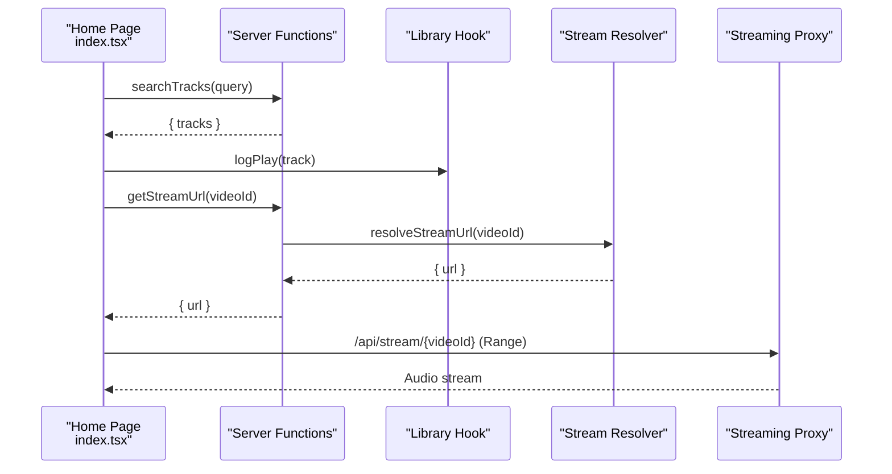
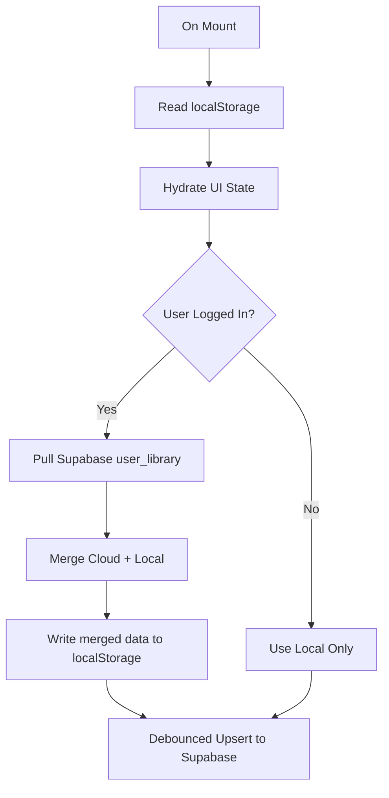
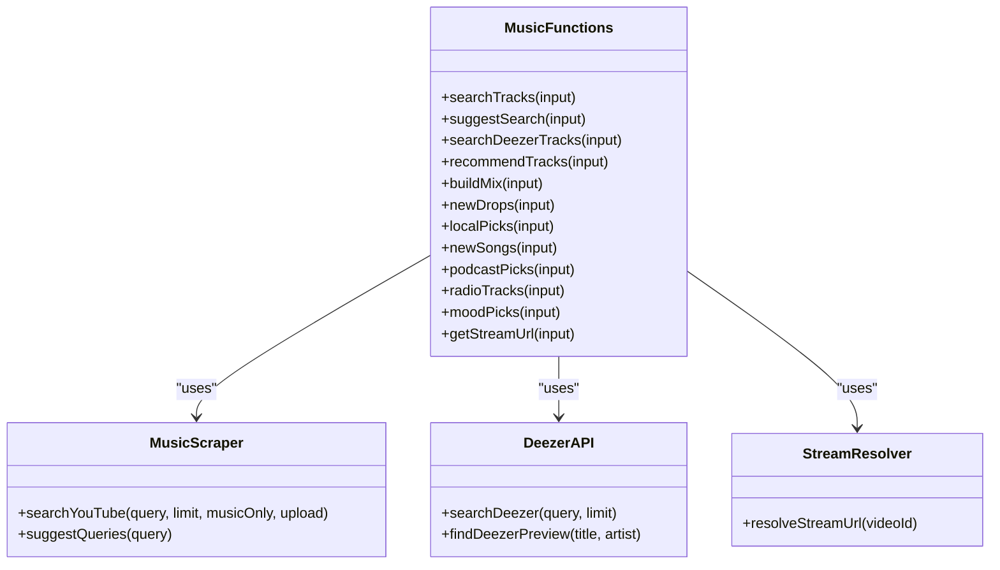
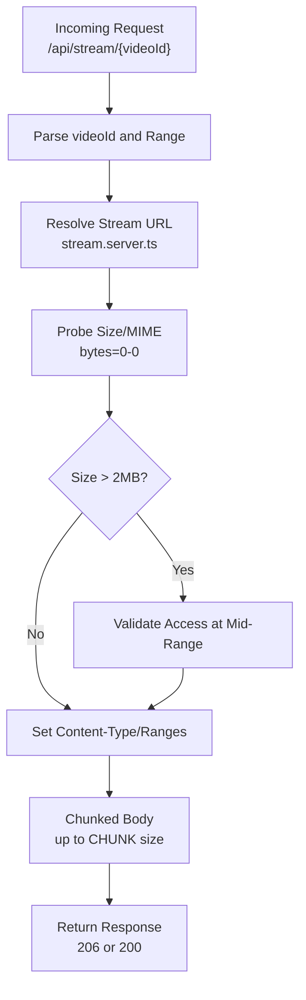
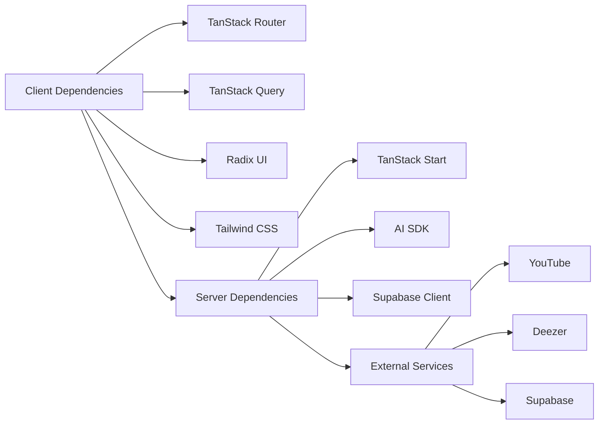

# Architecture Overview

<cite>
**Referenced Files in This Document**
- [README.md](file://README.md)
- [package.json](file://package.json)
- [src/start.ts](file://src/start.ts)
- [src/server.ts](file://src/server.ts)
- [src/router.tsx](file://src/router.tsx)
- [src/routes/__root.tsx](file://src/routes/__root.tsx)
- [src/routes/index.tsx](file://src/routes/index.tsx)
- [src/lib/music.functions.ts](file://src/lib/music.functions.ts)
- [src/lib/music.server.ts](file://src/lib/music.server.ts)
- [src/lib/deezer.server.ts](file://src/lib/deezer.server.ts)
- [src/lib/stream.server.ts](file://src/lib/stream.server.ts)
- [src/lib/library.ts](file://src/lib/library.ts)
- [src/integrations/supabase/client.ts](file://src/integrations/supabase/client.ts)
- [src/components/music/ErrorBoundary.tsx](file://src/components/music/ErrorBoundary.tsx)
</cite>

## Table of Contents
1. [Introduction](#introduction)
2. [Project Structure](#project-structure)
3. [Core Components](#core-components)
4. [Architecture Overview](#architecture-overview)
5. [Detailed Component Analysis](#detailed-component-analysis)
6. [Dependency Analysis](#dependency-analysis)
7. [Performance Considerations](#performance-considerations)
8. [Troubleshooting Guide](#troubleshooting-guide)
9. [Conclusion](#conclusion)

## Introduction
This document describes the architecture of the YouTube Music Companion system, a local-first music discovery and playback application built with TanStack Start (React + server functions), React components, and integrations to external services (YouTube, Deezer, Supabase). It explains how user interactions flow through server functions to external APIs and back to the UI, outlines the component hierarchy from root to feature modules, and documents service boundaries, state management, error handling, caching strategies, and performance considerations.

## Project Structure
The project follows a modern full-stack structure:
- Client-side React app with TanStack Router for routing and TanStack Query for data fetching.
- Server entrypoint that handles streaming proxying and SSR error normalization.
- Server functions encapsulating business logic and external API calls.
- Local-first library persistence via localStorage with optional Supabase sync when authenticated.
- Feature components under src/components/music and shared UI primitives under src/components/ui.

**Diagram sources**
- [src/router.tsx:1-17](file://src/router.tsx#L1-L17)
- [src/routes/__root.tsx:1-154](file://src/routes/__root.tsx#L1-L154)
- [src/routes/index.tsx:1-800](file://src/routes/index.tsx#L1-L800)
- [src/lib/music.functions.ts:1-627](file://src/lib/music.functions.ts#L1-L627)
- [src/lib/music.server.ts:1-214](file://src/lib/music.server.ts#L1-L214)
- [src/lib/deezer.server.ts:1-97](file://src/lib/deezer.server.ts#L1-L97)
- [src/lib/stream.server.ts:1-123](file://src/lib/stream.server.ts#L1-L123)
- [src/server.ts:1-198](file://src/server.ts#L1-L198)
- [src/integrations/supabase/client.ts:1-69](file://src/integrations/supabase/client.ts#L1-L69)

**Section sources**
- [package.json:1-92](file://package.json#L1-L92)
- [src/router.tsx:1-17](file://src/router.tsx#L1-L17)
- [src/routes/__root.tsx:1-154](file://src/routes/__root.tsx#L1-L154)

## Core Components
- Application shell and routing:
  - Root route sets up meta tags, PWA service worker registration, global error boundary, and provides QueryClient context.
  - Router config creates a router with scroll restoration and default preloading behavior.
- Main music page:
  - Orchestrates search, recommendations, mixes, radio, downloads, queue, and playback.
  - Uses server functions for all data operations and integrates with local library hook for persistent state.
- Library hook:
  - Local-first storage using localStorage; optional Supabase sync when signed in.
  - Manages likes, dislikes, history, playlists, settings, stats, and episode positions.
- Server functions:
  - Typed endpoints for search, recommendations, mix building, new songs, podcasts, mood picks, radio, and stream URL resolution.
  - Validate inputs with Zod and delegate to server libraries.
- Server libraries:
  - YouTube search scraping and suggestion queries.
  - Deezer search returning playable preview URLs.
  - Stream resolver that finds ad-free audio URLs via YouTube’s player API.
- Streaming proxy:
  - Proxies YouTube streams in small chunks to bypass CORS and throttling, honoring Range requests for seeking and progress.

**Section sources**
- [src/routes/__root.tsx:1-154](file://src/routes/__root.tsx#L1-L154)
- [src/router.tsx:1-17](file://src/router.tsx#L1-L17)
- [src/routes/index.tsx:1-800](file://src/routes/index.tsx#L1-L800)
- [src/lib/library.ts:1-636](file://src/lib/library.ts#L1-L636)
- [src/lib/music.functions.ts:1-627](file://src/lib/music.functions.ts#L1-L627)
- [src/lib/music.server.ts:1-214](file://src/lib/music.server.ts#L1-L214)
- [src/lib/deezer.server.ts:1-97](file://src/lib/deezer.server.ts#L1-L97)
- [src/lib/stream.server.ts:1-123](file://src/lib/stream.server.ts#L1-L123)
- [src/server.ts:1-198](file://src/server.ts#L1-L198)

## Architecture Overview
The system uses a local-first architecture with a clear separation between client and server responsibilities:
- Client:
  - React components manage UI state and orchestrate flows.
  - TanStack Query caches server function results and manages refetching.
  - Local storage persists user preferences, history, and playback state.
- Server:
  - Server functions provide typed, validated endpoints for data operations.
  - External integrations are isolated in server libraries to keep secrets off the client.
  - A streaming proxy ensures reliable playback by handling CORS and throttling constraints.

**Diagram sources**
- [src/routes/index.tsx:1-800](file://src/routes/index.tsx#L1-L800)
- [src/lib/music.functions.ts:1-627](file://src/lib/music.functions.ts#L1-L627)
- [src/lib/music.server.ts:1-214](file://src/lib/music.server.ts#L1-L214)
- [src/lib/stream.server.ts:1-123](file://src/lib/stream.server.ts#L1-L123)
- [src/server.ts:1-198](file://src/server.ts#L1-L198)
- [src/integrations/supabase/client.ts:1-69](file://src/integrations/supabase/client.ts#L1-L69)

## Detailed Component Analysis

### Root and Routing Layer
- Root route configures head metadata, registers the PWA service worker, wraps the app with QueryClientProvider and ErrorBoundary, and renders nested routes.
- Router initializes QueryClient and sets defaults for scrolling and prefetching.

**Diagram sources**
- [src/router.tsx:1-17](file://src/router.tsx#L1-L17)
- [src/routes/__root.tsx:1-154](file://src/routes/__root.tsx#L1-L154)

**Section sources**
- [src/routes/__root.tsx:1-154](file://src/routes/__root.tsx#L1-L154)
- [src/router.tsx:1-17](file://src/router.tsx#L1-L17)

### Main Music Page and State Orchestration
- The home page composes multiple panels (mixes, queue, playlists, lyrics, search results) and controls playback via an audio player hook.
- It wires server functions for search, recommendations, mix building, new songs, podcast picks, mood picks, radio, and stream URL resolution.
- It maintains local state for tabs, suggestions, results, recommendations, queue, volume, settings, and offline downloads.
- It implements continuous mode to extend the queue based on radio or AI/local picks and injects fresh releases periodically.

**Diagram sources**
- [src/routes/index.tsx:1-800](file://src/routes/index.tsx#L1-L800)
- [src/lib/music.functions.ts:1-627](file://src/lib/music.functions.ts#L1-L627)
- [src/lib/stream.server.ts:1-123](file://src/lib/stream.server.ts#L1-L123)
- [src/server.ts:1-198](file://src/server.ts#L1-L198)

**Section sources**
- [src/routes/index.tsx:1-800](file://src/routes/index.tsx#L1-L800)

### Local-First Library and Sync
- The library hook reads/writes to localStorage for immediate responsiveness and persists user library data (likes, dislikes, history, playlists, settings, stats).
- When a user is authenticated, it pulls their cloud copy once and merges with local data, then debounces writes back to Supabase.
- Episode positions are tracked to offer resume prompts for long-form content.

**Diagram sources**
- [src/lib/library.ts:1-636](file://src/lib/library.ts#L1-L636)
- [src/integrations/supabase/client.ts:1-69](file://src/integrations/supabase/client.ts#L1-L69)

**Section sources**
- [src/lib/library.ts:1-636](file://src/lib/library.ts#L1-L636)
- [src/integrations/supabase/client.ts:1-69](file://src/integrations/supabase/client.ts#L1-L69)

### Server Functions and External Integrations
- Search:
  - YouTube search via scraping; suggestions via Google suggest endpoint.
  - Deezer search returns direct MP3 previews for fallback playback.
- Recommendations and Mixes:
  - Optional AI-powered recommendations using an AI gateway provider; falls back to local engine if unavailable.
  - Mix builders use YouTube search with filters for new releases and trending content.
- Radio and Mood Picks:
  - Radio leverages YouTube’s recommendation engine; mood picks map curated queries to YouTube searches.
- Stream Resolution:
  - Resolves ad-free audio URLs via YouTube’s internal player API with retries across client configs and probes to ensure streamability.

**Diagram sources**
- [src/lib/music.functions.ts:1-627](file://src/lib/music.functions.ts#L1-L627)
- [src/lib/music.server.ts:1-214](file://src/lib/music.server.ts#L1-L214)
- [src/lib/deezer.server.ts:1-97](file://src/lib/deezer.server.ts#L1-L97)
- [src/lib/stream.server.ts:1-123](file://src/lib/stream.server.ts#L1-L123)

**Section sources**
- [src/lib/music.functions.ts:1-627](file://src/lib/music.functions.ts#L1-L627)
- [src/lib/music.server.ts:1-214](file://src/lib/music.server.ts#L1-L214)
- [src/lib/deezer.server.ts:1-97](file://src/lib/deezer.server.ts#L1-L97)
- [src/lib/stream.server.ts:1-123](file://src/lib/stream.server.ts#L1-L123)

### Streaming Proxy and Playback Flow
- The streaming proxy handles range requests and chunked responses to support seeking and progress bars while circumventing CORS and throttling restrictions.
- It probes upstream streams to determine size and MIME type, validates capped streams, and yields 1 MiB chunks with retry logic.

**Diagram sources**
- [src/server.ts:1-198](file://src/server.ts#L1-L198)
- [src/lib/stream.server.ts:1-123](file://src/lib/stream.server.ts#L1-L123)

**Section sources**
- [src/server.ts:1-198](file://src/server.ts#L1-L198)
- [src/lib/stream.server.ts:1-123](file://src/lib/stream.server.ts#L1-L123)

## Dependency Analysis
- Client dependencies:
  - React, React DOM for UI.
  - TanStack Router for routing and navigation.
  - TanStack Query for caching and background updates.
  - Radix UI primitives for accessible components.
  - Tailwind CSS for styling.
- Server dependencies:
  - TanStack Start for server functions and middleware.
  - AI SDK for optional AI-powered recommendations.
  - Supabase client for authentication and data sync.
- External integrations:
  - YouTube search and player API for content discovery and streaming.
  - Deezer API for additional track previews.
  - Supabase for user library synchronization.

**Diagram sources**
- [package.json:1-92](file://package.json#L1-L92)
- [src/start.ts:1-32](file://src/start.ts#L1-L32)
- [src/integrations/supabase/client.ts:1-69](file://src/integrations/supabase/client.ts#L1-L69)

**Section sources**
- [package.json:1-92](file://package.json#L1-L92)
- [src/start.ts:1-32](file://src/start.ts#L1-L32)

## Performance Considerations
- Local-first state minimizes network latency and keeps the UI responsive.
- Debounced Supabase writes reduce unnecessary network calls during rapid edits.
- Parallel execution of search and recommendations improves perceived performance.
- Streaming proxy uses chunked transfers to support seeking and progress without loading entire files.
- Fallback mechanisms (local engine when AI is unavailable) maintain functionality under degraded conditions.
- Service worker registration enables offline capabilities for cached assets and potentially downloaded tracks.

[No sources needed since this section provides general guidance]

## Troubleshooting Guide
- Global error handling:
  - Root route includes an error component to inform users and allow recovery actions.
  - Error boundary catches render errors and offers reload or recovery options.
- Server error normalization:
  - The server entrypoint normalizes catastrophic SSR responses and renders a consistent error page.
  - CSRF middleware protects server functions from cross-site requests.
- Streaming issues:
  - The streaming proxy validates upstream access and returns appropriate status codes when streams are restricted or unavailable.
  - Retry logic helps mitigate transient failures during chunk retrieval.

**Section sources**
- [src/routes/__root.tsx:1-154](file://src/routes/__root.tsx#L1-L154)
- [src/components/music/ErrorBoundary.tsx:1-72](file://src/components/music/ErrorBoundary.tsx#L1-L72)
- [src/start.ts:1-32](file://src/start.ts#L1-L32)
- [src/server.ts:1-198](file://src/server.ts#L1-L198)

## Conclusion
The YouTube Music Companion system combines a local-first architecture with a robust server layer to deliver seamless music discovery and playback. By separating concerns into client components, server functions, and service integrations, it achieves resilience, performance, and scalability. The streaming proxy ensures reliable playback despite platform limitations, while local-first state and optional cloud sync provide continuity across devices. The modular design supports future enhancements such as additional providers, improved recommendation algorithms, and expanded offline capabilities.

[No sources needed since this section summarizes without analyzing specific files]