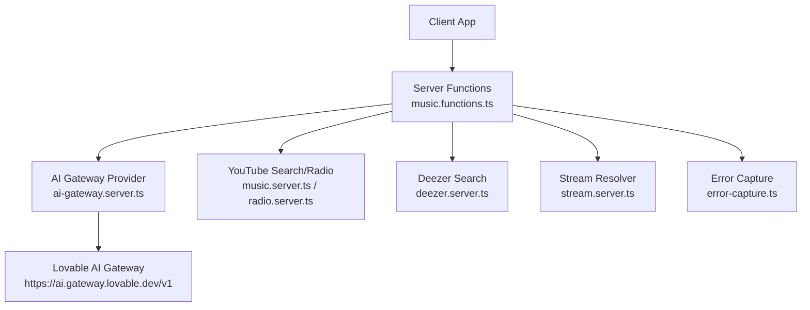
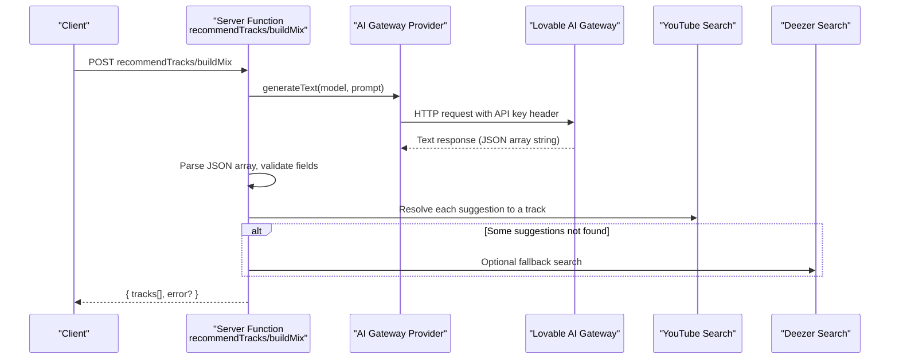
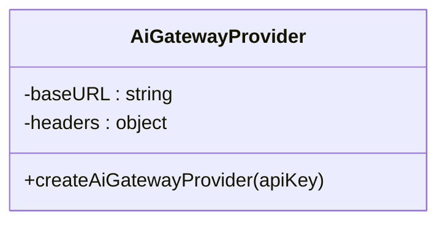
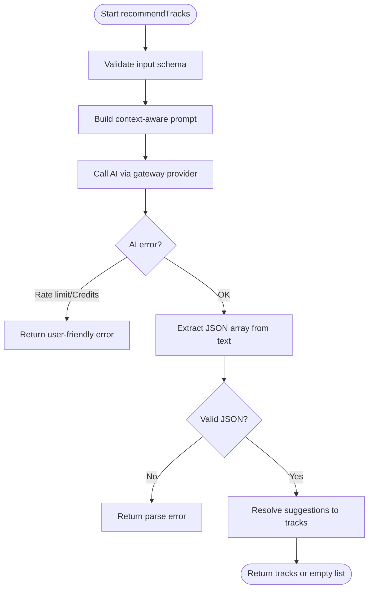
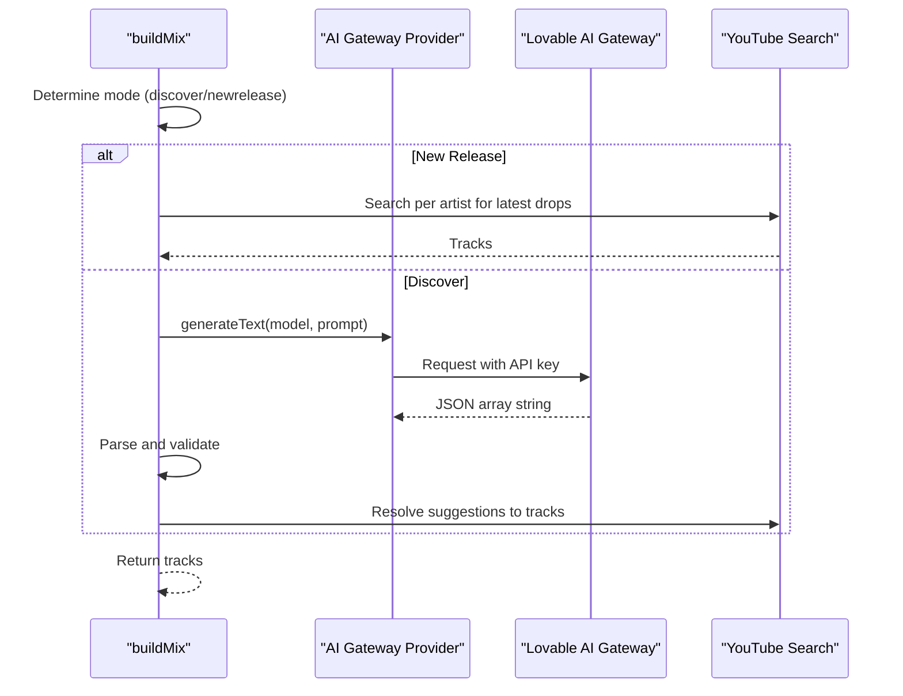
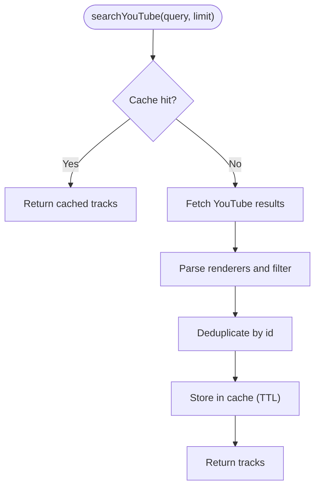
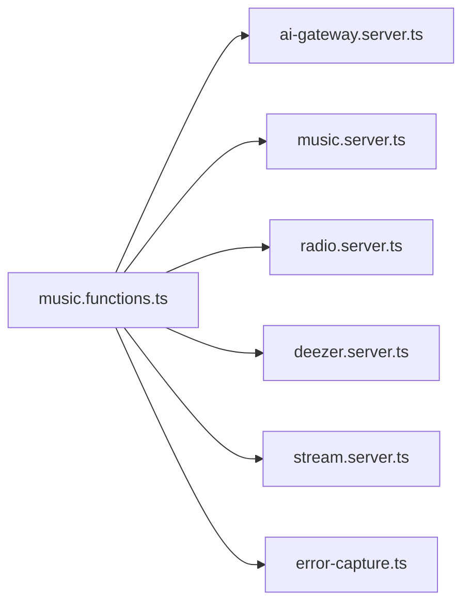

# AI Gateway Service

<cite>
**Referenced Files in This Document**
- [ai-gateway.server.ts](file://src/lib/ai-gateway.server.ts)
- [music.functions.ts](file://src/lib/music.functions.ts)
- [music.server.ts](file://src/lib/music.server.ts)
- [radio.server.ts](file://src/lib/radio.server.ts)
- [deezer.server.ts](file://src/lib/deezer.server.ts)
- [stream.server.ts](file://src/lib/stream.server.ts)
- [error-capture.ts](file://src/lib/error-capture.ts)
- [server.ts](file://src/server.ts)
- [README.md](file://README.md)
</cite>

## Table of Contents
1. [Introduction](#introduction)
2. [Project Structure](#project-structure)
3. [Core Components](#core-components)
4. [Architecture Overview](#architecture-overview)
5. [Detailed Component Analysis](#detailed-component-analysis)
6. [Dependency Analysis](#dependency-analysis)
7. [Performance Considerations](#performance-considerations)
8. [Troubleshooting Guide](#troubleshooting-guide)
9. [Conclusion](#conclusion)

## Introduction
This document explains the AI gateway service that provides unified access to OpenAI-compatible recommendation engines for music recommendations. It focuses on the provider abstraction layer, configuration management, prompt engineering patterns for music tasks, error handling, security measures, integration with recommendation algorithms, and performance considerations such as request batching, response caching, and timeout management.

The system uses a server-side function layer to orchestrate AI calls and downstream music search services (YouTube and Deezer), returning playable track results to clients.

**Section sources**
- [README.md:1-25](file://README.md#L1-L25)

## Project Structure
At a high level:
- Provider abstraction: a small module creates an OpenAI-compatible provider configured to call a hosted gateway endpoint with a custom API key header.
- Server functions: typed endpoints that build prompts, call the AI provider, parse structured JSON responses, and resolve tracks via YouTube or Deezer.
- Music services: YouTube scraping/search, radio generation, streaming URL resolution, and Deezer preview fallbacks.
- Error capture: centralized error serialization and logging helpers.

**Diagram sources**
- [music.functions.ts:58-137](file://src/lib/music.functions.ts#L58-L137)
- [ai-gateway.server.ts:1-9](file://src/lib/ai-gateway.server.ts#L1-L9)
- [music.server.ts:182-247](file://src/lib/music.server.ts#L182-L247)
- [radio.server.ts:25-94](file://src/lib/radio.server.ts#L25-L94)
- [deezer.server.ts:39-74](file://src/lib/deezer.server.ts#L39-L74)
- [stream.server.ts:108-122](file://src/lib/stream.server.ts#L108-L122)
- [error-capture.ts:18-32](file://src/lib/error-capture.ts#L18-L32)

**Section sources**
- [ai-gateway.server.ts:1-9](file://src/lib/ai-gateway.server.ts#L1-L9)
- [music.functions.ts:1-627](file://src/lib/music.functions.ts#L1-L627)
- [music.server.ts:1-248](file://src/lib/music.server.ts#L1-L248)
- [radio.server.ts:1-95](file://src/lib/radio.server.ts#L1-L95)
- [deezer.server.ts:1-97](file://src/lib/deezer.server.ts#L1-L97)
- [stream.server.ts:1-123](file://src/lib/stream.server.ts#L1-L123)
- [error-capture.ts:1-81](file://src/lib/error-capture.ts#L1-L81)

## Core Components
- AI Gateway Provider: Creates an OpenAI-compatible client pointing at a hosted gateway and injects a custom API key header.
- Recommendation Server Functions: Build context-aware prompts, call the AI provider, parse JSON arrays of suggested tracks, and resolve them into playable items using YouTube or Deezer.
- Music Services: Provide search, radio, and streaming capabilities with timeouts and retries where applicable.
- Error Capture: Centralized error description and capture utilities used by the server runtime.

Key responsibilities:
- Abstraction over AI providers via a single factory function.
- Secure environment-based API key usage.
- Structured prompt construction for consistent AI outputs.
- Robust parsing and validation of AI responses before resolving tracks.
- Graceful fallbacks to non-AI strategies when needed.

**Section sources**
- [ai-gateway.server.ts:1-9](file://src/lib/ai-gateway.server.ts#L1-L9)
- [music.functions.ts:58-137](file://src/lib/music.functions.ts#L58-L137)
- [music.functions.ts:156-245](file://src/lib/music.functions.ts#L156-L245)
- [music.server.ts:182-247](file://src/lib/music.server.ts#L182-L247)
- [radio.server.ts:25-94](file://src/lib/radio.server.ts#L25-L94)
- [deezer.server.ts:39-74](file://src/lib/deezer.server.ts#L39-L74)
- [stream.server.ts:108-122](file://src/lib/stream.server.ts#L108-L122)
- [error-capture.ts:18-32](file://src/lib/error-capture.ts#L18-L32)

## Architecture Overview
The AI gateway is integrated through a provider factory that returns an OpenAI-compatible client. The server functions use this provider to generate text with carefully constructed prompts. Responses are parsed into structured JSON arrays and then resolved into actual playable tracks via YouTube or Deezer. Non-AI paths exist for scenarios without an API key or when AI is unavailable.

**Diagram sources**
- [music.functions.ts:58-137](file://src/lib/music.functions.ts#L58-L137)
- [music.functions.ts:156-245](file://src/lib/music.functions.ts#L156-L245)
- [ai-gateway.server.ts:1-9](file://src/lib/ai-gateway.server.ts#L1-L9)
- [music.server.ts:182-247](file://src/lib/music.server.ts#L182-L247)
- [deezer.server.ts:39-74](file://src/lib/deezer.server.ts#L39-L74)

## Detailed Component Analysis

### AI Gateway Provider
- Purpose: Create an OpenAI-compatible provider configured to call a hosted gateway endpoint with a custom API key header.
- Configuration:
  - Name: internal identifier for the provider.
  - Base URL: hosted gateway endpoint.
  - Headers: includes a custom header carrying the API key from environment.
- Security: API key is read from environment variables and passed only in headers; never logged or exposed to clients.

**Diagram sources**
- [ai-gateway.server.ts:1-9](file://src/lib/ai-gateway.server.ts#L1-L9)

**Section sources**
- [ai-gateway.server.ts:1-9](file://src/lib/ai-gateway.server.ts#L1-L9)

### Recommendation Server Functions
- Input validation: Uses schema validation to enforce limits and types for inputs like liked/recent/disliked lists, mood, brief, and counts.
- Prompt engineering:
  - Context building: Incorporates user taste signals (liked songs, recent plays, skipped tracks, disliked tracks), session sequence, mood, and tuning preferences.
  - Output contract: Requests a strict JSON array format with title, artist, and reason fields to simplify parsing and validation.
- Response handling:
  - Extracts JSON array from model output.
  - Validates entries (title and artist present).
  - Resolves each suggestion to a playable track via YouTube search; optional Deezer fallback if needed.
- Error handling:
  - Detects rate limiting and credit errors from the AI provider and returns user-friendly messages.
  - Handles malformed or missing JSON gracefully.

**Diagram sources**
- [music.functions.ts:58-137](file://src/lib/music.functions.ts#L58-L137)

**Section sources**
- [music.functions.ts:58-137](file://src/lib/music.functions.ts#L58-L137)

### Mix Builder Server Function
- Purpose: Generate personalized mixes (discover or new release) using either AI or deterministic logic.
- AI path: Similar prompt strategy to recommendations but tailored for discovery or new releases; enforces constraints like avoiding known artists.
- Non-AI path: For new releases, queries YouTube directly per artist; for discover mode without AI, falls back to local heuristics.

**Diagram sources**
- [music.functions.ts:156-245](file://src/lib/music.functions.ts#L156-L245)
- [ai-gateway.server.ts:1-9](file://src/lib/ai-gateway.server.ts#L1-L9)
- [music.server.ts:182-247](file://src/lib/music.server.ts#L182-L247)

**Section sources**
- [music.functions.ts:156-245](file://src/lib/music.functions.ts#L156-L245)

### YouTube Search and Radio
- YouTube search: Scrapes results with filters for music-only content and upload date ranges; caches results for 5 minutes to reduce external calls.
- Radio: Uses YouTube’s built-in radio endpoint to get similar tracks based on a seed video ID; parses structured data and deduplicates results.

**Diagram sources**
- [music.server.ts:52-75](file://src/lib/music.server.ts#L52-L75)
- [music.server.ts:182-247](file://src/lib/music.server.ts#L182-L247)

**Section sources**
- [music.server.ts:52-75](file://src/lib/music.server.ts#L52-L75)
- [music.server.ts:182-247](file://src/lib/music.server.ts#L182-L247)
- [radio.server.ts:25-94](file://src/lib/radio.server.ts#L25-L94)

### Deezer Integration
- Purpose: Provide direct MP3 previews as a fallback when YouTube results are restricted or unavailable.
- Behavior: Searches Deezer, maps results to a compatible track shape including a previewUrl and source marker.

**Section sources**
- [deezer.server.ts:39-74](file://src/lib/deezer.server.ts#L39-L74)

### Streaming URL Resolution
- Purpose: Resolve a direct audio stream URL for a YouTube video to enable ad-free playback and background play.
- Strategy: Tries multiple client configurations and probes URLs to ensure they stream; selects best audio format.

**Section sources**
- [stream.server.ts:108-122](file://src/lib/stream.server.ts#L108-L122)

## Dependency Analysis
- Server functions depend on:
  - AI gateway provider for text generation.
  - YouTube search and radio services for track resolution.
  - Deezer search for fallback previews.
  - Stream resolver for playback URLs.
  - Error capture utilities for robust logging.

**Diagram sources**
- [music.functions.ts:58-137](file://src/lib/music.functions.ts#L58-L137)
- [music.functions.ts:156-245](file://src/lib/music.functions.ts#L156-L245)
- [ai-gateway.server.ts:1-9](file://src/lib/ai-gateway.server.ts#L1-L9)
- [music.server.ts:182-247](file://src/lib/music.server.ts#L182-L247)
- [radio.server.ts:25-94](file://src/lib/radio.server.ts#L25-L94)
- [deezer.server.ts:39-74](file://src/lib/deezer.server.ts#L39-L74)
- [stream.server.ts:108-122](file://src/lib/stream.server.ts#L108-L122)
- [error-capture.ts:18-32](file://src/lib/error-capture.ts#L18-L32)

**Section sources**
- [music.functions.ts:58-137](file://src/lib/music.functions.ts#L58-L137)
- [music.functions.ts:156-245](file://src/lib/music.functions.ts#L156-L245)
- [ai-gateway.server.ts:1-9](file://src/lib/ai-gateway.server.ts#L1-L9)
- [music.server.ts:182-247](file://src/lib/music.server.ts#L182-L247)
- [radio.server.ts:25-94](file://src/lib/radio.server.ts#L25-L94)
- [deezer.server.ts:39-74](file://src/lib/deezer.server.ts#L39-L74)
- [stream.server.ts:108-122](file://src/lib/stream.server.ts#L108-L122)
- [error-capture.ts:18-32](file://src/lib/error-capture.ts#L18-L32)

## Performance Considerations
- Request batching:
  - Parallel resolution of AI-suggested tracks via concurrent searches reduces total latency.
  - Batched YouTube queries for new releases and podcast picks improve throughput.
- Response caching:
  - In-memory LRU-style cache for YouTube search results with a 5-minute TTL and size cap reduces repeated external calls.
- Timeout management:
  - External requests set explicit timeouts to prevent hanging operations (e.g., YouTube radio, Deezer search, player resolution).
- Fallback strategies:
  - Hybrid search prefers YouTube but falls back to Deezer to ensure playable results.
  - Non-AI modes provide deterministic recommendations when API keys are absent or AI is unavailable.

[No sources needed since this section provides general guidance]

## Troubleshooting Guide
Common issues and resolutions:
- AI not configured:
  - Symptom: Recommendations indicate AI is not configured.
  - Cause: Missing environment variable for the API key.
  - Resolution: Set the required environment variable on the server.
- Rate limiting:
  - Symptom: User sees “Too many requests” message.
  - Cause: Exceeded provider rate limits.
  - Resolution: Retry after a short delay; consider reducing request frequency or increasing quotas.
- Credits exhausted:
  - Symptom: Message indicating credits are exhausted.
  - Cause: Account has insufficient credits.
  - Resolution: Add credits to the account or disable AI features temporarily.
- Invalid AI response:
  - Symptom: Errors about reading recommendations or building mixes.
  - Cause: Model returned unexpected text without a valid JSON array.
  - Resolution: Adjust prompts or retry; ensure output contract is enforced.
- YouTube/Deezer failures:
  - Symptom: Empty results or playback issues.
  - Cause: Network errors, throttling, or restricted content.
  - Resolution: Rely on fallbacks; check timeouts and retry logic; verify network connectivity.

Security notes:
- API key storage:
  - Keys are read from environment variables and injected into request headers; avoid logging or exposing them.
- Request sanitization:
  - Inputs are validated with schemas to constrain length and type; queries are encoded when sent to external services.
- Output validation:
  - AI responses are parsed and filtered to ensure only valid track suggestions are processed.

**Section sources**
- [music.functions.ts:58-137](file://src/lib/music.functions.ts#L58-L137)
- [music.functions.ts:156-245](file://src/lib/music.functions.ts#L156-L245)
- [music.server.ts:182-247](file://src/lib/music.server.ts#L182-L247)
- [radio.server.ts:25-94](file://src/lib/radio.server.ts#L25-L94)
- [deezer.server.ts:39-74](file://src/lib/deezer.server.ts#L39-L74)
- [stream.server.ts:108-122](file://src/lib/stream.server.ts#L108-L122)
- [error-capture.ts:18-32](file://src/lib/error-capture.ts#L18-L32)
- [server.ts:135-175](file://src/server.ts#L135-L175)

## Conclusion
The AI gateway service integrates a provider abstraction to call an OpenAI-compatible recommendation engine while maintaining consistent interfaces across different AI services. It combines strong prompt engineering, robust input/output validation, and resilient fallbacks to deliver reliable music recommendations. Performance is optimized through caching, batching, and timeouts, while security is maintained by environment-based API key handling and sanitized requests. When AI is unavailable or misconfigured, deterministic strategies ensure continuous functionality.

[No sources needed since this section summarizes without analyzing specific files]