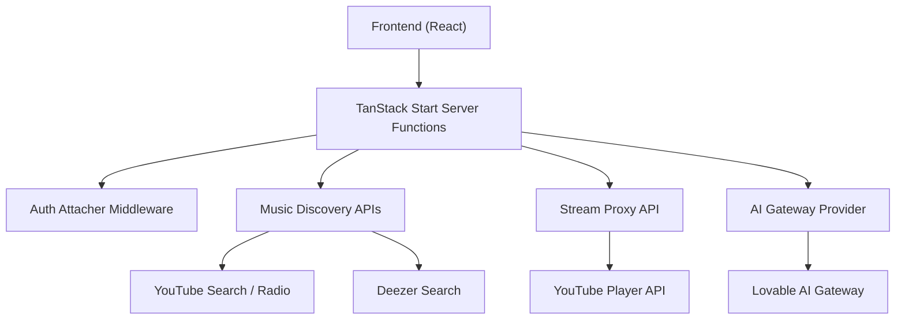
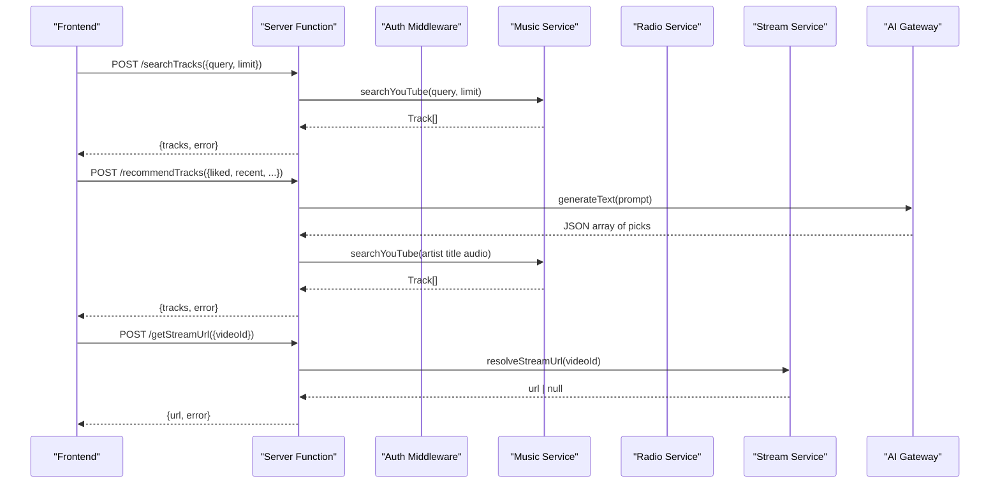
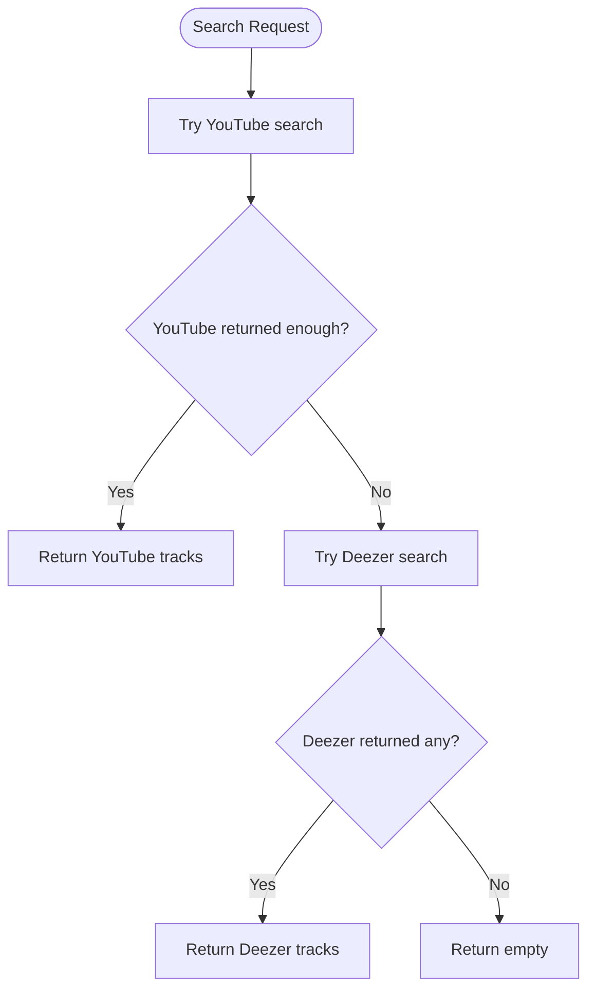
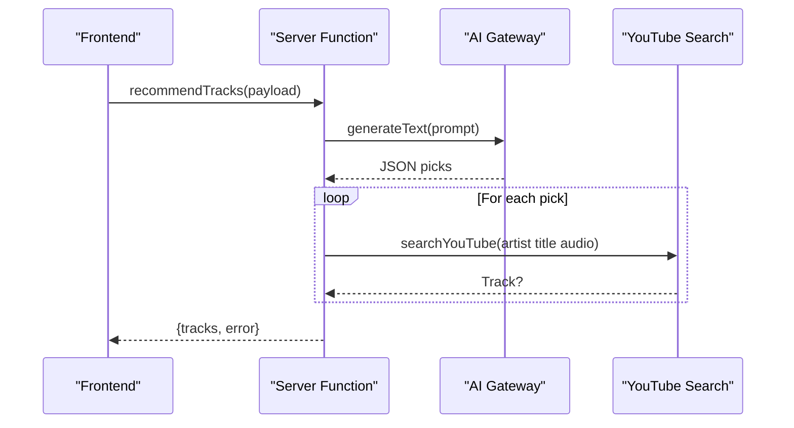
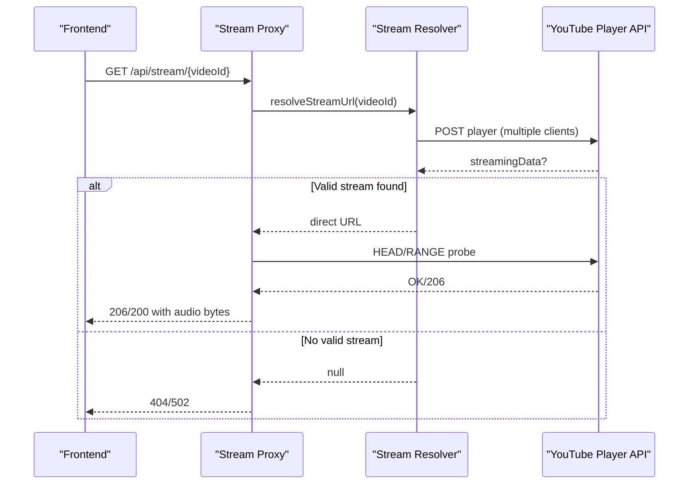
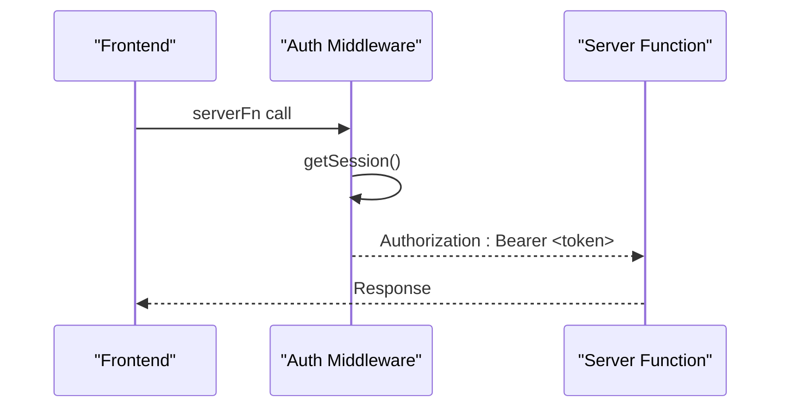
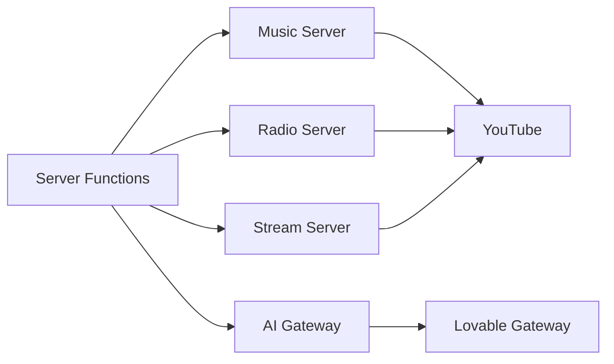

# Backend Services

<cite>
**Referenced Files in This Document**
- [src/server.ts](file://src/server.ts)
- [src/start.ts](file://src/start.ts)
- [src/lib/music.functions.ts](file://src/lib/music.functions.ts)
- [src/lib/music.server.ts](file://src/lib/music.server.ts)
- [src/lib/deezer.server.ts](file://src/lib/deezer.server.ts)
- [src/lib/radio.server.ts](file://src/lib/radio.server.ts)
- [src/lib/stream.server.ts](file://src/lib/stream.server.ts)
- [src/lib/ai-gateway.server.ts](file://src/lib/ai-gateway.server.ts)
- [src/integrations/supabase/auth-attacher.ts](file://src/integrations/supabase/auth-attacher.ts)
- [src/lib/library.ts](file://src/lib/library.ts)
- [package.json](file://package.json)
</cite>

## Table of Contents
1. Introduction
2. Project Structure
3. Core Components
4. Architecture Overview
5. Detailed Component Analysis
6. Dependency Analysis
7. Performance Considerations
8. Troubleshooting Guide
9. Conclusion

## Introduction
This document explains the backend services architecture built with TanStack Start server functions. It covers the server-client separation pattern, type-safe APIs exposed to the frontend, and the music discovery service that aggregates content from YouTube and Deezer. It also documents the stream proxy for YouTube audio streaming, the AI gateway integration for personalized recommendations, authentication flows, rate limiting strategies, error handling patterns, caching mechanisms, request/response transformation, data validation using Zod schemas, security considerations, input sanitization, and API versioning strategies.

## Project Structure
The backend is implemented as a set of server-side modules and TanStack Start server functions:
- Server entry and middleware orchestration live in the server bootstrap files.
- Domain logic for music search, radio, streaming, and AI-powered recommendations is encapsulated in server modules under src/lib.
- Authentication is attached via a function middleware that injects Supabase tokens into server function calls.
- Data models and client-side state are defined in shared libraries; server functions validate inputs with Zod and return typed responses consumed by the frontend.

**Diagram sources**
- [src/start.ts:1-31](file://src/start.ts#L1-L31)
- [src/lib/music.functions.ts:1-627](file://src/lib/music.functions.ts#L1-L627)
- [src/lib/music.server.ts:1-214](file://src/lib/music.server.ts#L1-L214)
- [src/lib/deezer.server.ts:1-97](file://src/lib/deezer.server.ts#L1-L97)
- [src/lib/radio.server.ts:1-95](file://src/lib/radio.server.ts#L1-L95)
- [src/lib/stream.server.ts:1-123](file://src/lib/stream.server.ts#L1-L123)
- [src/lib/ai-gateway.server.ts:1-10](file://src/lib/ai-gateway.server.ts#L1-L10)
- [src/integrations/supabase/auth-attacher.ts:1-16](file://src/integrations/supabase/auth-attacher.ts#L1-L16)

**Section sources**
- [src/start.ts:1-31](file://src/start.ts#L1-L31)
- [src/server.ts:1-199](file://src/server.ts#L1-L199)
- [package.json:1-92](file://package.json#L1-L92)

## Core Components
- Server functions (typed APIs): Provide strongly-typed endpoints for search, suggestions, recommendations, mixes, new drops, podcast picks, radio, and stream URL resolution. Inputs are validated with Zod; outputs are consistent objects with tracks and optional errors.
- Music discovery: Aggregates results from YouTube and Deezer with fallback strategies and hybrid selection.
- Stream proxy: Resolves direct audio URLs and proxies them with range support and throttling bypass.
- AI gateway: Integrates an OpenAI-compatible provider through a gateway for personalized recommendations and mix generation.
- Authentication: Function middleware attaches Supabase session tokens to server function calls.

**Section sources**
- [src/lib/music.functions.ts:1-627](file://src/lib/music.functions.ts#L1-L627)
- [src/lib/music-hybrid.server.ts:1-98](file://src/lib/music-hybrid.server.ts#L1-L98)
- [src/lib/stream.server.ts:1-123](file://src/lib/stream.server.ts#L1-L123)
- [src/lib/ai-gateway.server.ts:1-10](file://src/lib/ai-gateway.server.ts#L1-L10)
- [src/integrations/supabase/auth-attacher.ts:1-16](file://src/integrations/supabase/auth-attacher.ts#L1-L16)

## Architecture Overview
The system follows a clear server-client separation:
- The frontend calls server functions via TanStack Start’s RPC-like interface. These functions are type-safe because they use Zod input validators and return structured responses.
- Server functions delegate to domain modules for external integrations (YouTube, Deezer, AI gateway).
- A custom server entry handles streaming proxy requests and SSR error normalization.

**Diagram sources**
- [src/lib/music.functions.ts:8-21](file://src/lib/music.functions.ts#L8-L21)
- [src/lib/music.functions.ts:58-137](file://src/lib/music.functions.ts#L58-L137)
- [src/lib/music.functions.ts:613-627](file://src/lib/music.functions.ts#L613-L627)
- [src/lib/music.server.ts:154-213](file://src/lib/music.server.ts#L154-L213)
- [src/lib/stream.server.ts:108-122](file://src/lib/stream.server.ts#L108-L122)
- [src/lib/ai-gateway.server.ts:1-10](file://src/lib/ai-gateway.server.ts#L1-L10)

## Detailed Component Analysis

### Server Functions and Type-Safe APIs
- Input validation: All server functions define Zod schemas for inputs (e.g., search queries, recommendation payloads, stream IDs), ensuring runtime safety and enabling TypeScript inference on both sides.
- Consistent response shape: Handlers return objects with tracks and optional error fields, simplifying frontend error handling and UI states.
- Dynamic imports: Heavy modules (YouTube, Deezer, AI) are imported inside handlers to reduce cold start overhead and avoid loading unused code paths.

Key endpoints include:
- Search and suggestions
- Hybrid search across YouTube and Deezer
- Recommendations and personalized mixes
- New releases and podcast picks
- Radio based on YouTube’s recommendation engine
- Stream URL resolution

**Section sources**
- [src/lib/music.functions.ts:1-627](file://src/lib/music.functions.ts#L1-L627)

### Music Discovery Service
- YouTube search: Scrapes search results with filters for music-only content and upload date ranges. Extracts video metadata and thumbnails, filtering out non-music or compilation videos.
- Deezer search: Returns tracks with playable preview URLs as a reliable fallback when YouTube results are restricted or unavailable.
- Hybrid strategy: Prefers YouTube full songs; falls back to Deezer previews if needed. Provides helper utilities to determine playable URLs per track source.

**Diagram sources**
- [src/lib/music-hybrid.server.ts:22-49](file://src/lib/music-hybrid.server.ts#L22-L49)
- [src/lib/music.server.ts:154-213](file://src/lib/music.server.ts#L154-L213)
- [src/lib/deezer.server.ts:39-74](file://src/lib/deezer.server.ts#L39-L74)

**Section sources**
- [src/lib/music.server.ts:1-214](file://src/lib/music.server.ts#L1-L214)
- [src/lib/deezer.server.ts:1-97](file://src/lib/deezer.server.ts#L1-L97)
- [src/lib/music-hybrid.server.ts:1-98](file://src/lib/music-hybrid.server.ts#L1-L98)

### Recommendation Algorithms and Personalization
- AI-driven recommendations: Builds prompts from user behavior (likes, recent plays, skips, disliked tracks), mood preferences, and tuning settings. Uses an OpenAI-compatible provider via a gateway to generate JSON arrays of recommended tracks, then resolves them against YouTube.
- Local picks: When AI is not configured, uses heuristic queries to YouTube to assemble comfort picks, similar artists, and trending content.
- Mix builder: Generates curated mixes (discover vs new release) with constraints to avoid repetition and maintain diversity.

**Diagram sources**
- [src/lib/music.functions.ts:58-137](file://src/lib/music.functions.ts#L58-L137)
- [src/lib/ai-gateway.server.ts:1-10](file://src/lib/ai-gateway.server.ts#L1-L10)
- [src/lib/music.server.ts:154-213](file://src/lib/music.server.ts#L154-L213)

**Section sources**
- [src/lib/music.functions.ts:140-245](file://src/lib/music.functions.ts#L140-L245)
- [src/lib/music.functions.ts:324-369](file://src/lib/music.functions.ts#L324-L369)

### Stream Proxy Service
- Direct audio resolution: Calls YouTube’s internal player API with multiple client configurations to obtain adaptive formats, preferring high-quality audio-only streams. Probes URLs to ensure they actually stream before returning.
- CORS bypass and throttling: Proxies audio bytes through the application origin with Range support. Streams in bounded chunks to bypass throttled URLs that reject large ranges or open-ended requests. Detects capped streams early to fail fast.

**Diagram sources**
- [src/lib/stream.server.ts:47-122](file://src/lib/stream.server.ts#L47-L122)
- [src/server.ts:102-179](file://src/server.ts#L102-L179)

**Section sources**
- [src/lib/stream.server.ts:1-123](file://src/lib/stream.server.ts#L1-L123)
- [src/server.ts:48-179](file://src/server.ts#L48-L179)

### AI Gateway Integration
- Provider setup: Creates an OpenAI-compatible provider pointing to a gateway endpoint with a custom header for API key authorization.
- Usage: Server functions call the AI gateway to generate text responses containing JSON arrays of recommendations or mix selections, which are parsed and resolved to actual tracks.

**Section sources**
- [src/lib/ai-gateway.server.ts:1-10](file://src/lib/ai-gateway.server.ts#L1-L10)
- [src/lib/music.functions.ts:58-137](file://src/lib/music.functions.ts#L58-L137)

### Authentication Flows
- Function middleware: Automatically attaches Supabase session tokens to server function calls, enabling authenticated operations on the backend without manual header management.
- Client-side auth hook: Manages session state and profile retrieval, keeping the UI responsive and synchronized.

**Diagram sources**
- [src/integrations/supabase/auth-attacher.ts:1-16](file://src/integrations/supabase/auth-attacher.ts#L1-L16)
- [src/start.ts:21-31](file://src/start.ts#L21-L31)

**Section sources**
- [src/integrations/supabase/auth-attacher.ts:1-16](file://src/integrations/supabase/auth-attacher.ts#L1-L16)
- [src/start.ts:1-31](file://src/start.ts#L1-L31)
- [src/lib/library.ts:1-70](file://src/lib/library.ts#L1-L70)

### Caching Mechanisms
- Local-first library: User likes, dislikes, history, playlists, settings, and stats are persisted in localStorage and optionally synced to the cloud when signed in. Changes are debounced to reduce network calls.
- Episode positions: Per-episode playback positions are saved locally to resume listening seamlessly.

**Section sources**
- [src/lib/library.ts:105-349](file://src/lib/library.ts#L105-L349)
- [src/lib/library.ts:169-197](file://src/lib/library.ts#L169-L197)

### Request/Response Transformation and Data Validation
- Input validation: Zod schemas enforce constraints on all server function inputs (e.g., query length limits, array sizes, enums).
- Output shaping: Responses consistently include tracks and optional error messages, making it straightforward for the frontend to handle success and failure cases uniformly.
- Content processing: YouTube and Deezer results are normalized into a common Track model, including thumbnail extraction, duration formatting, and source tagging.

**Section sources**
- [src/lib/music.functions.ts:6-44](file://src/lib/music.functions.ts#L6-L44)
- [src/lib/music.server.ts:1-13](file://src/lib/music.server.ts#L1-L13)
- [src/lib/deezer.server.ts:29-74](file://src/lib/deezer.server.ts#L29-L74)

### Security Considerations, Input Sanitization, and API Versioning
- CSRF protection: CSRF middleware is enabled for server functions to prevent cross-site request forgery attacks.
- Input sanitization: Queries are cleaned before searching Deezer (stripping clutter like “Official Video”, brackets, etc.) to improve match quality and reduce noise.
- Rate limiting: External providers (YouTube, Deezer, AI gateway) may throttle or block requests. The code includes timeouts, retries for stream probing, and graceful degradation to fallback sources. Application-level rate limiting can be added around server functions if needed.
- Error handling: Server functions catch upstream errors and return user-friendly messages. The server entry normalizes SSR errors and renders a consistent error page.
- API versioning: Current endpoints are not explicitly versioned. To introduce versioning, prefix server function routes (e.g., v1) and update client calls accordingly. Maintain backward compatibility by supporting multiple versions during transitions.

**Section sources**
- [src/start.ts:21-31](file://src/start.ts#L21-L31)
- [src/lib/deezer.server.ts:80-96](file://src/lib/deezer.server.ts#L80-L96)
- [src/server.ts:21-46](file://src/server.ts#L21-L46)
- [src/lib/music.functions.ts:58-137](file://src/lib/music.functions.ts#L58-L137)

## Dependency Analysis
The backend modules have clear responsibilities and minimal coupling:
- Server functions depend on domain modules for specific tasks (music search, radio, streaming, AI).
- Domain modules depend on external APIs (YouTube, Deezer, AI gateway) but isolate integration details.
- Authentication middleware is independent and applied globally to server functions.

**Diagram sources**
- [src/lib/music.functions.ts:1-627](file://src/lib/music.functions.ts#L1-L627)
- [src/lib/music.server.ts:1-214](file://src/lib/music.server.ts#L1-L214)
- [src/lib/radio.server.ts:1-95](file://src/lib/radio.server.ts#L1-L95)
- [src/lib/stream.server.ts:1-123](file://src/lib/stream.server.ts#L1-L123)
- [src/lib/ai-gateway.server.ts:1-10](file://src/lib/ai-gateway.server.ts#L1-L10)

**Section sources**
- [package.json:14-70](file://package.json#L14-L70)

## Performance Considerations
- Cold starts: Use dynamic imports for heavy modules inside handlers to minimize startup time.
- Network timeouts: Apply AbortSignal timeouts to external requests to avoid hanging connections.
- Streaming efficiency: Stream proxy reads in bounded chunks to respect upstream throttling and enable seeking.
- Fallback strategies: Prefer robust sources (Deezer previews) when primary sources fail to maintain responsiveness.
- Debounced sync: Library changes are debounced to reduce unnecessary network traffic.

[No sources needed since this section provides general guidance]

## Troubleshooting Guide
Common issues and resolutions:
- AI unavailability: If the AI gateway returns rate-limit or credit errors, server functions return appropriate messages; consider retrying after a delay or falling back to local picks.
- Stream unavailable: If YouTube restricts a video or throttles the stream, the proxy detects capped streams and returns an error; try alternative sources or verify video availability.
- Search failures: If YouTube or Deezer endpoints fail, server functions return empty results with no crash; check network connectivity and quotas.
- SSR errors: The server entry normalizes h3-swallowed errors and renders a consistent error page; inspect logs for root causes.

**Section sources**
- [src/lib/music.functions.ts:58-137](file://src/lib/music.functions.ts#L58-L137)
- [src/server.ts:21-46](file://src/server.ts#L21-L46)
- [src/server.ts:102-179](file://src/server.ts#L102-L179)

## Conclusion
The backend leverages TanStack Start server functions to provide type-safe, validated APIs that abstract complex integrations behind simple interfaces. The music discovery service combines YouTube and Deezer for resilient content access, while the stream proxy ensures reliable playback by resolving and forwarding audio streams with CORS bypass and throttling mitigation. AI-powered personalization enhances recommendations and mix generation, with graceful fallbacks when unavailable. Authentication is seamlessly integrated via middleware, and local-first caching improves performance and user experience. With careful input validation, error handling, and security measures, the system delivers a robust foundation for scalable music discovery and streaming features.