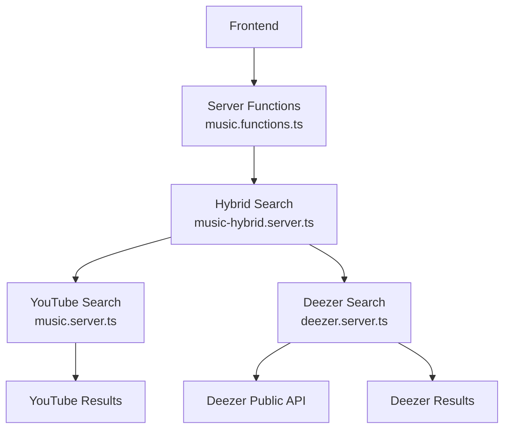
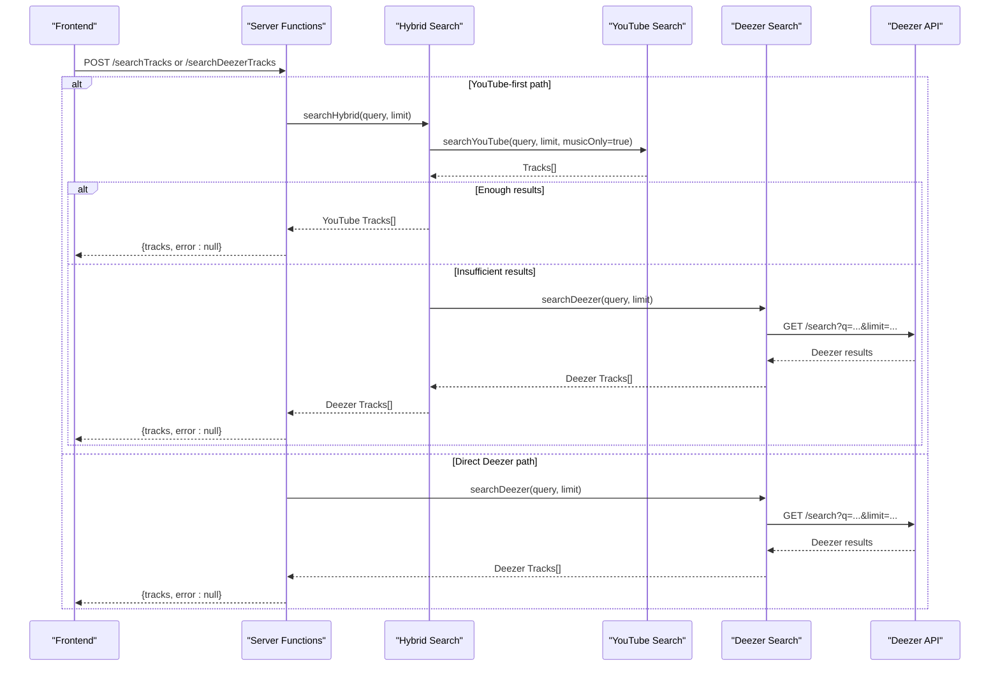
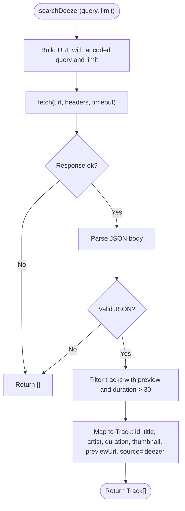
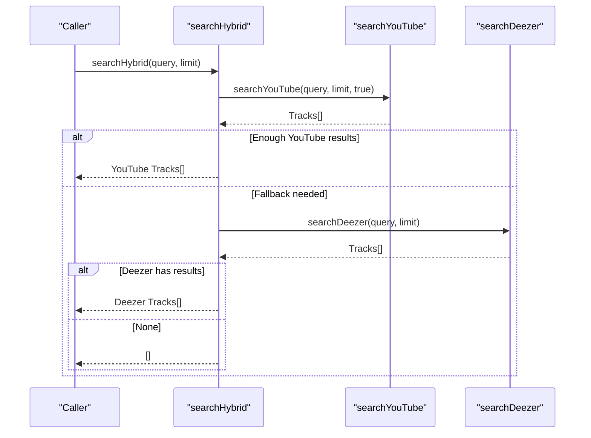
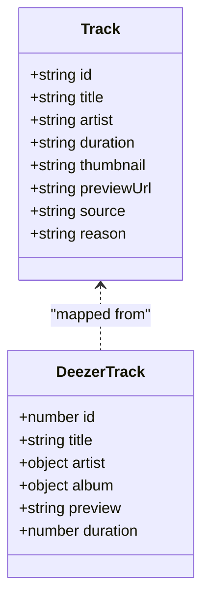
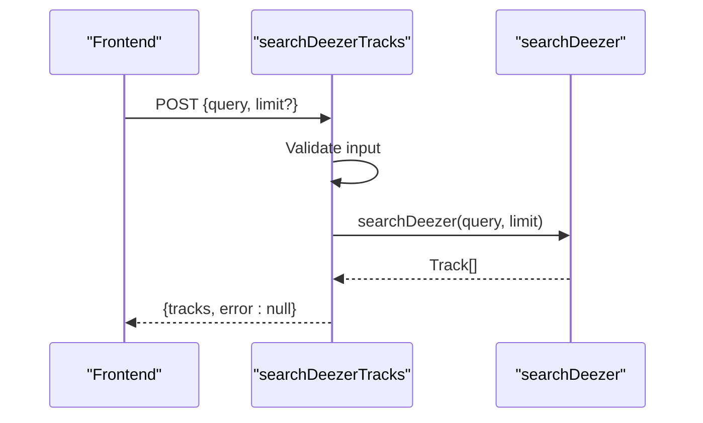
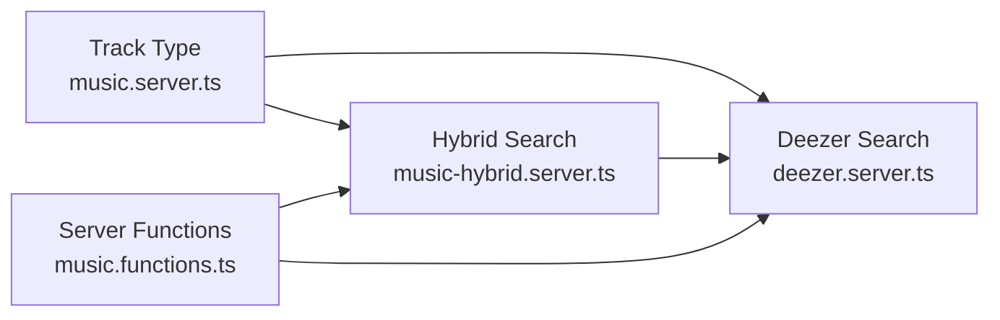

# Deezer Integration

<cite>
**Referenced Files in This Document**
- [deezer.server.ts](file://src/lib/deezer.server.ts)
- [music-hybrid.server.ts](file://src/lib/music-hybrid.server.ts)
- [music.server.ts](file://src/lib/music.server.ts)
- [music.functions.ts](file://src/lib/music.functions.ts)
- [error-capture.ts](file://src/lib/error-capture.ts)
</cite>

## Table of Contents
1. [Introduction](#introduction)
2. [Project Structure](#project-structure)
3. [Core Components](#core-components)
4. [Architecture Overview](#architecture-overview)
5. [Detailed Component Analysis](#detailed-component-analysis)
6. [Dependency Analysis](#dependency-analysis)
7. [Performance Considerations](#performance-considerations)
8. [Troubleshooting Guide](#troubleshooting-guide)
9. [Conclusion](#conclusion)

## Introduction
This document explains the Deezer integration that augments music search and playback with additional catalog coverage and reliable 30-second previews. The service connects to Deezer’s public search endpoint without requiring authentication keys for basic search operations. It is integrated as a resilient fallback when YouTube-based searches fail or return restricted content, ensuring users can always preview or play something.

Key benefits:
- Expanded catalog access via Deezer’s free search API
- Reliable 30-second MP3 previews that bypass streaming restrictions
- Seamless fallback from YouTube to Deezer to maintain playback continuity
- Standardized Track data model across sources

## Project Structure
The Deezer integration spans several server-side modules:
- deezer.server.ts: Direct integration with Deezer’s public search API, including query building, response parsing, and mapping to the application’s Track type.
- music-hybrid.server.ts: Orchestrates hybrid search (YouTube primary, Deezer fallback) and radio recommendations with fallbacks.
- music.server.ts: Defines the shared Track type used by all providers and provides YouTube search utilities.
- music.functions.ts: Server functions that expose search endpoints to the frontend, including a dedicated Deezer search function.
- error-capture.ts: Centralized error capture and description utilities used across the server.

**Diagram sources**
- [music.functions.ts:8-44](file://src/lib/music.functions.ts#L8-L44)
- [music-hybrid.server.ts:22-49](file://src/lib/music-hybrid.server.ts#L22-L49)
- [music.server.ts:182-247](file://src/lib/music.server.ts#L182-L247)
- [deezer.server.ts:39-74](file://src/lib/deezer.server.ts#L39-L74)

**Section sources**
- [deezer.server.ts:1-97](file://src/lib/deezer.server.ts#L1-L97)
- [music-hybrid.server.ts:1-98](file://src/lib/music-hybrid.server.ts#L1-L98)
- [music.server.ts:1-248](file://src/lib/music.server.ts#L1-L248)
- [music.functions.ts:1-627](file://src/lib/music.functions.ts#L1-L627)
- [error-capture.ts:1-82](file://src/lib/error-capture.ts#L1-L82)

## Core Components
- Deezer Search Client: Builds queries, performs HTTP requests with timeouts, parses JSON responses, filters valid tracks, and maps them to the standardized Track format.
- Hybrid Search Orchestrator: Tries YouTube first; if insufficient results or errors occur, falls back to Deezer. Also handles radio/recommendation fallbacks.
- Server Function Expose: Provides a POST endpoint to search Deezer directly from the client, validating inputs and returning standardized results.
- Shared Data Model: The Track type unifies fields like id, title, artist, duration, thumbnail, optional previewUrl, source provider, and recommendation reason.

**Section sources**
- [deezer.server.ts:11-27](file://src/lib/deezer.server.ts#L11-L27)
- [music.server.ts:1-13](file://src/lib/music.server.ts#L1-L13)
- [music-hybrid.server.ts:14-16](file://src/lib/music-hybrid.server.ts#L14-L16)
- [music.functions.ts:34-44](file://src/lib/music.functions.ts#L34-L44)

## Architecture Overview
The system uses a layered approach:
- Frontend calls server functions to search music.
- Hybrid search attempts YouTube first; on failure or low result count, it invokes Deezer search.
- Deezer search returns direct preview URLs that can be played immediately without a stream proxy.
- Errors are captured centrally to preserve stack traces and status information.

**Diagram sources**
- [music.functions.ts:8-44](file://src/lib/music.functions.ts#L8-L44)
- [music-hybrid.server.ts:22-49](file://src/lib/music-hybrid.server.ts#L22-L49)
- [deezer.server.ts:39-74](file://src/lib/deezer.server.ts#L39-L74)
- [music.server.ts:182-247](file://src/lib/music.server.ts#L182-L247)

## Detailed Component Analysis

### Deezer Search Implementation
- Query translation: Encodes user input into a URL-safe query parameter and appends a limit.
- Network call: Uses fetch with a User-Agent header and an 8-second timeout signal to avoid hanging requests.
- Response handling: Parses JSON, filters out entries without previews or invalid durations, and maps each entry to the application’s Track type.
- Preview extraction: Sets previewUrl to the direct MP3 link returned by Deezer and marks source as "deezer".

**Diagram sources**
- [deezer.server.ts:39-74](file://src/lib/deezer.server.ts#L39-L74)

**Section sources**
- [deezer.server.ts:39-74](file://src/lib/deezer.server.ts#L39-L74)

### Hybrid Search Orchestration
- Primary path: Attempts YouTube search with music-only filtering. If enough results are found, returns them immediately.
- Fallback path: On error or insufficient results, invokes Deezer search and returns its results if available.
- Radio fallback: For recommendations, tries YouTube radio first; if not sufficient, falls back to searching popular songs on Deezer.

**Diagram sources**
- [music-hybrid.server.ts:22-49](file://src/lib/music-hybrid.server.ts#L22-L49)
- [music.server.ts:182-247](file://src/lib/music.server.ts#L182-L247)
- [deezer.server.ts:39-74](file://src/lib/deezer.server.ts#L39-L74)

**Section sources**
- [music-hybrid.server.ts:22-49](file://src/lib/music-hybrid.server.ts#L22-L49)

### Data Transformation Layer
- Input: Deezer track objects containing id, title, artist, album cover images, preview URL, and duration in seconds.
- Processing: Filters invalid entries, formats duration to a human-readable string, selects appropriate thumbnail, and constructs a Track object.
- Output: Standardized Track with source set to "deezer" and previewUrl populated for direct playback.

**Diagram sources**
- [music.server.ts:1-13](file://src/lib/music.server.ts#L1-L13)
- [deezer.server.ts:11-27](file://src/lib/deezer.server.ts#L11-L27)
- [deezer.server.ts:63-74](file://src/lib/deezer.server.ts#L63-L74)

**Section sources**
- [deezer.server.ts:63-74](file://src/lib/deezer.server.ts#L63-L74)
- [music.server.ts:1-13](file://src/lib/music.server.ts#L1-L13)

### Server Function Exposure
- Endpoint: POST /searchDeezerTracks accepts validated input with query and optional limit.
- Handler: Dynamically imports the Deezer search module and returns standardized results or empty arrays on error.
- Validation: Uses schema validation to ensure safe inputs before processing.

**Diagram sources**
- [music.functions.ts:34-44](file://src/lib/music.functions.ts#L34-L44)
- [deezer.server.ts:39-74](file://src/lib/deezer.server.ts#L39-L74)

**Section sources**
- [music.functions.ts:34-44](file://src/lib/music.functions.ts#L34-L44)

## Dependency Analysis
- Deezer module depends on the shared Track type defined in music.server.ts.
- Hybrid search depends on both YouTube and Deezer modules and orchestrates their usage based on result quality and availability.
- Server functions depend on dynamic imports to keep runtime dependencies minimal and to isolate error paths.

**Diagram sources**
- [music.server.ts:1-13](file://src/lib/music.server.ts#L1-L13)
- [music-hybrid.server.ts:14-16](file://src/lib/music-hybrid.server.ts#L14-L16)
- [music.functions.ts:34-44](file://src/lib/music.functions.ts#L34-L44)
- [deezer.server.ts:9-27](file://src/lib/deezer.server.ts#L9-L27)

**Section sources**
- [music-hybrid.server.ts:14-16](file://src/lib/music-hybrid.server.ts#L14-L16)
- [deezer.server.ts:9-27](file://src/lib/deezer.server.ts#L9-L27)
- [music.functions.ts:34-44](file://src/lib/music.functions.ts#L34-L44)

## Performance Considerations
- Timeouts: Deezer requests use an 8-second timeout to prevent long hangs.
- Filtering: Only tracks with valid previews and reasonable durations are included, reducing downstream processing.
- Caching: YouTube search results are cached for 5 minutes to reduce repeated network calls; while not applied to Deezer, this helps overall performance in hybrid flows.
- Dynamic Imports: Modules are imported at runtime to minimize startup cost and isolate failures.

[No sources needed since this section provides general guidance]

## Troubleshooting Guide
Common issues and remedies:
- Network errors: If fetch fails or times out, the implementation returns an empty array to avoid breaking the UI. Check connectivity and consider retrying later.
- Malformed responses: Invalid JSON triggers a safe fallback to empty results. Verify network integrity and try again.
- API limits: The current implementation does not implement explicit rate limiting or retries. If you encounter frequent failures due to rate limits, add exponential backoff and request throttling around the fetch call.
- Error capture: Use centralized error capture to log detailed stack traces and status codes for debugging.

Recommended enhancements:
- Add retry logic with exponential backoff for transient network errors.
- Implement rate limiting per IP or per request to respect external API constraints.
- Log request payloads and responses (sanitized) to aid debugging.
- Introduce circuit breaker patterns to temporarily disable failing integrations.

**Section sources**
- [error-capture.ts:1-82](file://src/lib/error-capture.ts#L1-L82)
- [deezer.server.ts:45-61](file://src/lib/deezer.server.ts#L45-L61)

## Conclusion
The Deezer integration provides a robust, keyless fallback for music search and playback, ensuring users can always preview or play content even when YouTube results are restricted or unavailable. By standardizing data through the Track model and orchestrating hybrid search flows, the system maintains a consistent user experience. Future improvements should focus on rate limiting, retries, and enhanced observability to further stabilize API communication.

[No sources needed since this section summarizes without analyzing specific files]