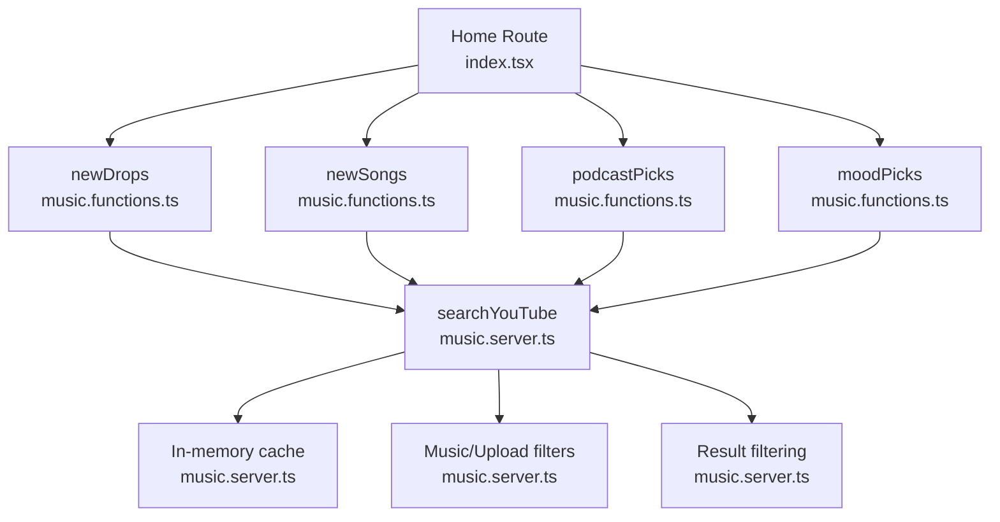
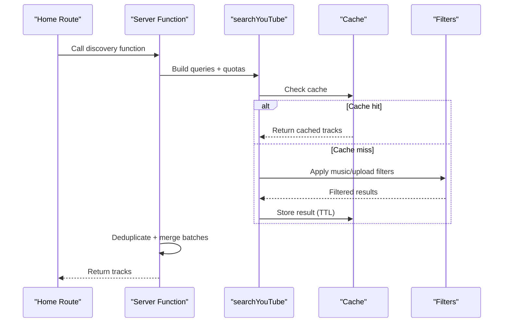
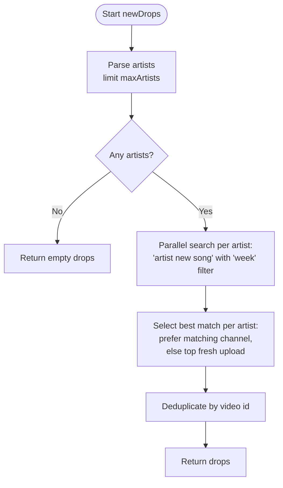
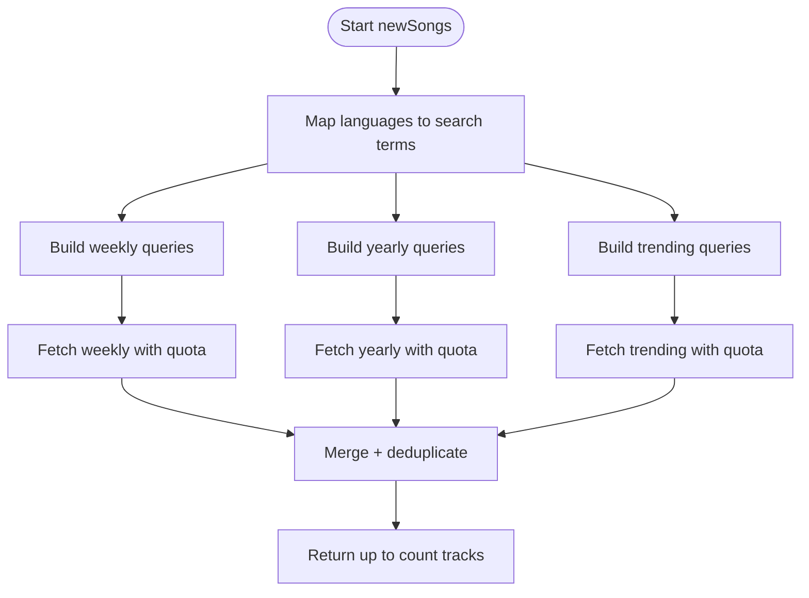
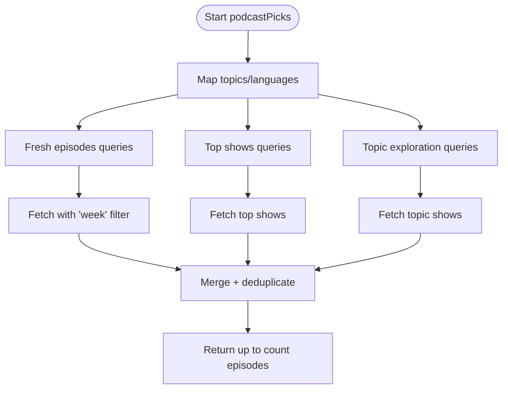
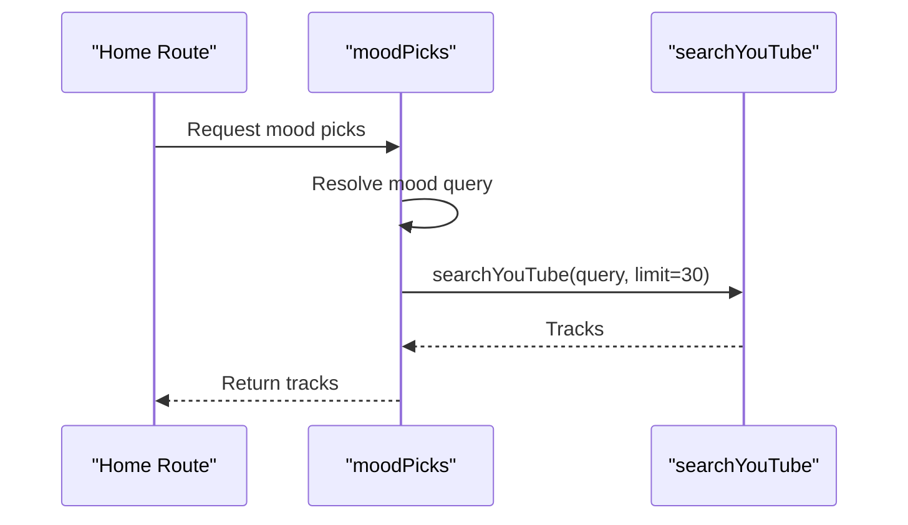
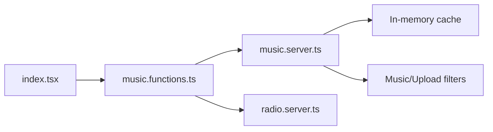

# Content Discovery

<cite>
**Referenced Files in This Document**
- [music.functions.ts](file://src/lib/music.functions.ts)
- [music.server.ts](file://src/lib/music.server.ts)
- [radio.server.ts](file://src/lib/radio.server.ts)
- [index.tsx](file://src/routes/index.tsx)
</cite>

## Table of Contents
1. [Introduction](#introduction)
2. [Project Structure](#project-structure)
3. [Core Components](#core-components)
4. [Architecture Overview](#architecture-overview)
5. [Detailed Component Analysis](#detailed-component-analysis)
6. [Dependency Analysis](#dependency-analysis)
7. [Performance Considerations](#performance-considerations)
8. [Troubleshooting Guide](#troubleshooting-guide)
9. [Conclusion](#conclusion)

## Introduction
This document explains the content discovery features that help users find fresh and relevant music and podcast content. It focuses on:
- newDrops: recent releases from the listener’s favorite artists using weekly uploads
- newSongs: genuinely fresh tracks via multiple strategies (weekly, yearly, trending, language-specific)
- podcastPicks: podcast episodes curated by topics and languages
- moodPicks: instant radio-style playlists based on emotional states or activities using predefined YouTube search queries

It also covers query construction, result filtering, and the sophisticated batching system that optimizes API usage while maintaining quality and diversity.

## Project Structure
The discovery features are implemented as server functions that orchestrate YouTube searches and filters, then return normalized track objects to the UI. The main entry points for discovery are exposed through server functions and consumed by the home route to build mixes and feeds.

**Diagram sources**
- [index.tsx:156-164](file://src/routes/index.tsx#L156-L164)
- [music.functions.ts:257-307](file://src/lib/music.functions.ts#L257-L307)
- [music.functions.ts:398-458](file://src/lib/music.functions.ts#L398-L458)
- [music.functions.ts:491-559](file://src/lib/music.functions.ts#L491-L559)
- [music.functions.ts:600-610](file://src/lib/music.functions.ts#L600-L610)
- [music.server.ts:182-247](file://src/lib/music.server.ts#L182-L247)

**Section sources**
- [index.tsx:156-164](file://src/routes/index.tsx#L156-L164)
- [music.functions.ts:257-307](file://src/lib/music.functions.ts#L257-L307)
- [music.functions.ts:398-458](file://src/lib/music.functions.ts#L398-L458)
- [music.functions.ts:491-559](file://src/lib/music.functions.ts#L491-L559)
- [music.functions.ts:600-610](file://src/lib/music.functions.ts#L600-L610)
- [music.server.ts:182-247](file://src/lib/music.server.ts#L182-L247)

## Core Components
- newDrops: Finds recent releases from the listener’s favorite artists by searching for weekly uploads and selecting the best match per artist.
- newSongs: Discovers genuinely fresh tracks using a multi-strategy approach:
  - Weekly new releases
  - Yearly latest tracks
  - Artist-specific new songs
  - Trending content
  - Language-focused queries when preferences are set
- podcastPicks: Extends discovery beyond music to include podcast episodes with topic-based and language-focused curation.
- moodPicks: Provides instant radio-style playlists based on emotional states or activities using predefined YouTube search queries.

All components rely on a shared search engine and filtering pipeline to ensure quality, diversity, and efficient API usage.

**Section sources**
- [music.functions.ts:257-307](file://src/lib/music.functions.ts#L257-L307)
- [music.functions.ts:398-458](file://src/lib/music.functions.ts#L398-L458)
- [music.functions.ts:491-559](file://src/lib/music.functions.ts#L491-L559)
- [music.functions.ts:600-610](file://src/lib/music.functions.ts#L600-L610)

## Architecture Overview
Discovery flows follow a consistent pattern:
1. The UI calls a server function with input parameters (artists, count, languages, topics, mood).
2. The server function constructs targeted queries and runs them through a shared search utility.
3. Results are filtered for music quality and deduplicated.
4. A batching strategy controls how many results to fetch per query to optimize API usage and maintain diversity.
5. The final list is returned to the UI for display.

**Diagram sources**
- [music.functions.ts:398-458](file://src/lib/music.functions.ts#L398-L458)
- [music.server.ts:52-75](file://src/lib/music.server.ts#L52-L75)
- [music.server.ts:182-247](file://src/lib/music.server.ts#L182-L247)

## Detailed Component Analysis

### newDrops: Recent Releases from Favorite Artists
Purpose:
- Identify recent releases from the listener’s favorite artists by searching for weekly uploads.

Key behaviors:
- Accepts a list of favorite artists and limits the number of artists searched.
- For each artist, performs a parallel search for “artist new song” with an upload filter set to “week”.
- Selects the best match per artist:
  - Prefers a result whose channel matches the artist name.
  - Falls back to the top fresh upload if no exact channel match is found.
- Deduplicates results across artists.

Query construction:
- Uses a time-bound search with “week” upload filter to prioritize very recent drops.

Result filtering:
- Leverages the shared music-only filter to exclude non-music content.

Batching and optimization:
- Parallelizes one search per artist to reduce latency.
- Limits per-artist results to a small quota to avoid over-fetching.

**Diagram sources**
- [music.functions.ts:257-307](file://src/lib/music.functions.ts#L257-L307)
- [music.server.ts:182-247](file://src/lib/music.server.ts#L182-L247)

**Section sources**
- [music.functions.ts:257-307](file://src/lib/music.functions.ts#L257-L307)
- [music.server.ts:182-247](file://src/lib/music.server.ts#L182-L247)

### newSongs: Genuinely Fresh Tracks
Purpose:
- Discover fresh tracks through multiple strategies: weekly new releases, yearly latest tracks, artist-specific new songs, and trending content. Supports language-focused searches when preferences are set.

Key behaviors:
- Builds three tiers of queries:
  - Weekly new releases: “new <language> songs” or “new songs”
  - Yearly latest tracks: “latest <language> songs <year>” or “latest songs <year>”
  - Artist-specific new songs: “<artist> new song <year>”
  - Trending content: “trending <language> songs” or “trending songs this week”
- Applies quotas per tier to balance freshness, relevance, and diversity.
- Merges results and deduplicates by video id.

Query construction:
- Maps user-selected languages to search terms.
- Adds “audio” suffix for music-only searches.
- Uses upload filters (“week”) where appropriate.

Result filtering:
- Music-only mode excludes non-music content and long compilations.
- Duration heuristics help remove shorts and live streams.

Batching and optimization:
- Distributes quotas across multiple queries to avoid over-fetching.
- Uses a shared cache to reduce repeated network calls.

**Diagram sources**
- [music.functions.ts:398-458](file://src/lib/music.functions.ts#L398-L458)
- [music.server.ts:182-247](file://src/lib/music.server.ts#L182-L247)

**Section sources**
- [music.functions.ts:398-458](file://src/lib/music.functions.ts#L398-L458)
- [music.server.ts:182-247](file://src/lib/music.server.ts#L182-L247)

### podcastPicks: Topic-Based and Language-Focused Podcast Episodes
Purpose:
- Extend discovery beyond music to include podcast episodes curated by topics and languages.

Key behaviors:
- Translates selected topics into search terms.
- Builds three tiers of queries:
  - Fresh episodes: “<topic> podcast new episodes” or language variants
  - Top shows: “top <topic> podcasts” or “best <topic> podcasts”
  - General topic exploration: “<topic> podcast episodes”
- When topics are not set, falls back to language-focused and general trending shows.
- Disables music-only filtering so podcast episodes pass through.

Query construction:
- Uses topic-to-search mapping and language mappings similar to music discovery.
- Avoids “audio” suffix to capture podcast content.

Result filtering:
- Skips non-music exclusions; allows podcast episodes to be included.

Batching and optimization:
- Distributes quotas across fresh, top, and topic queries.
- Deduplicates by video id.

**Diagram sources**
- [music.functions.ts:491-559](file://src/lib/music.functions.ts#L491-L559)
- [music.server.ts:182-247](file://src/lib/music.server.ts#L182-L247)

**Section sources**
- [music.functions.ts:491-559](file://src/lib/music.functions.ts#L491-L559)
- [music.server.ts:182-247](file://src/lib/music.server.ts#L182-L247)

### moodPicks: Instant Radio-Style Playlists by Mood
Purpose:
- Provide instant radio-style playlists based on emotional states or activities using predefined YouTube search queries.

Key behaviors:
- Maps moods to curated search strings (e.g., “focus”, “late night”, “upbeat workout”).
- If a mood is unrecognized, falls back to a generic “<mood> songs” query.
- Returns a batch of tracks suitable for immediate playback.

Query construction:
- Uses predefined queries optimized for mood-based discovery.
- Music-only mode ensures only songs are returned.

Result filtering:
- Relies on shared music-only filtering to exclude non-music content.

Batching and optimization:
- Single query per mood request with a fixed limit to keep responses fast.

**Diagram sources**
- [music.functions.ts:600-610](file://src/lib/music.functions.ts#L600-L610)
- [music.server.ts:182-247](file://src/lib/music.server.ts#L182-L247)

**Section sources**
- [music.functions.ts:600-610](file://src/lib/music.functions.ts#L600-L610)
- [music.server.ts:182-247](file://src/lib/music.server.ts#L182-L247)

## Dependency Analysis
Discovery functions depend on a shared search utility and filtering pipeline. They also integrate with caching and optional AI-powered recommendation paths elsewhere in the app.

**Diagram sources**
- [music.functions.ts:257-307](file://src/lib/music.functions.ts#L257-L307)
- [music.functions.ts:398-458](file://src/lib/music.functions.ts#L398-L458)
- [music.functions.ts:491-559](file://src/lib/music.functions.ts#L491-L559)
- [music.functions.ts:600-610](file://src/lib/music.functions.ts#L600-L610)
- [music.server.ts:182-247](file://src/lib/music.server.ts#L182-L247)
- [radio.server.ts:25-94](file://src/lib/radio.server.ts#L25-L94)
- [index.tsx:156-164](file://src/routes/index.tsx#L156-L164)

**Section sources**
- [music.functions.ts:257-307](file://src/lib/music.functions.ts#L257-L307)
- [music.functions.ts:398-458](file://src/lib/music.functions.ts#L398-L458)
- [music.functions.ts:491-559](file://src/lib/music.functions.ts#L491-L559)
- [music.functions.ts:600-610](file://src/lib/music.functions.ts#L600-L610)
- [music.server.ts:182-247](file://src/lib/music.server.ts#L182-L247)
- [radio.server.ts:25-94](file://src/lib/radio.server.ts#L25-L94)
- [index.tsx:156-164](file://src/routes/index.tsx#L156-L164)

## Performance Considerations
- Caching: Search results are cached in memory with a 5-minute TTL to reduce repeated network calls.
- Quotas and Batching: Each discovery function distributes quotas across multiple queries to avoid over-fetching and to maintain diversity.
- Upload Filters: Time-bound filters (“today”, “week”) narrow results to fresh content, improving relevance and reducing noise.
- Music-Only Mode: Excludes non-music content and long compilations to keep results focused on songs.
- Parallelization: Where safe (e.g., per-artist searches), parallel requests reduce latency.

[No sources needed since this section provides general guidance]

## Troubleshooting Guide
Common issues and mitigations:
- Network errors during search: Functions catch exceptions and return empty results or user-friendly error messages.
- AI unavailability: Some features fall back to non-AI logic when configuration is missing or rate-limited.
- Empty results: Ensure valid inputs (artists, languages, topics) and check that filters are not too restrictive.
- Stale results: Rely on the cache TTL; refresh the page or re-trigger discovery to fetch fresh data.

**Section sources**
- [music.functions.ts:14-21](file://src/lib/music.functions.ts#L14-L21)
- [music.functions.ts:571-580](file://src/lib/music.functions.ts#L571-L580)
- [music.functions.ts:616-626](file://src/lib/music.functions.ts#L616-L626)
- [music.server.ts:182-247](file://src/lib/music.server.ts#L182-L247)

## Conclusion
The content discovery system combines targeted query construction, robust filtering, and intelligent batching to deliver fresh, relevant music and podcast content. By leveraging weekly and yearly time bounds, language and topic preferences, and trending signals, it balances novelty with familiarity. The shared search and caching infrastructure ensures efficient API usage and responsive experiences across all discovery features.

[No sources needed since this section summarizes without analyzing specific files]