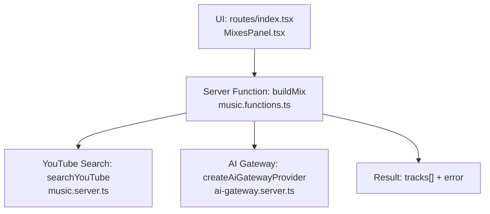
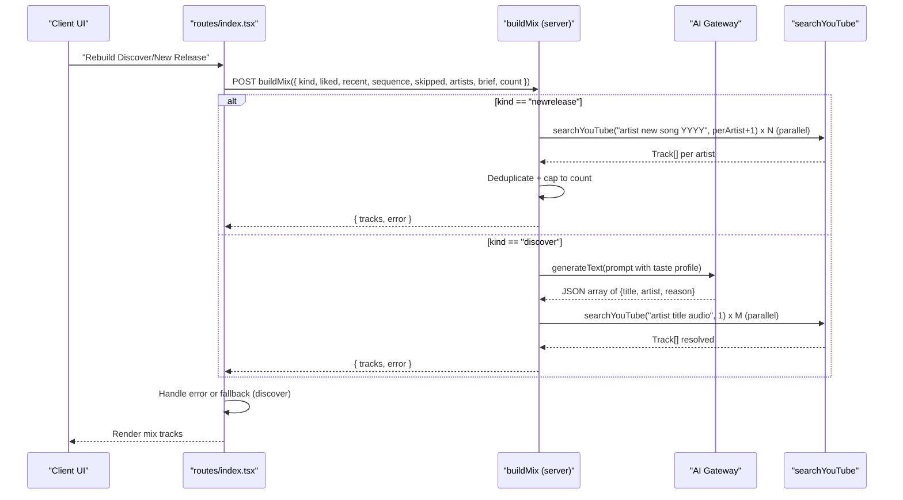
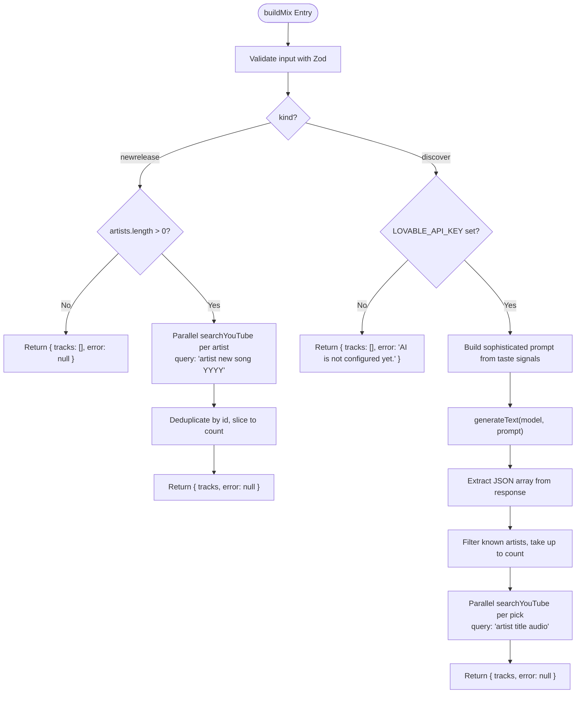
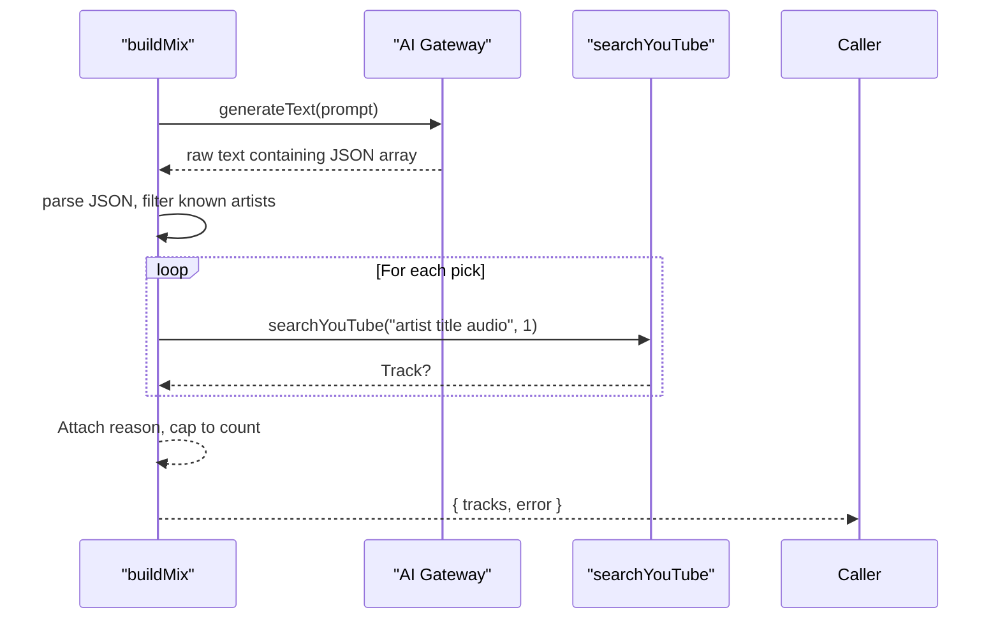
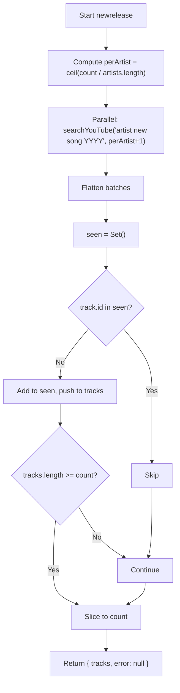
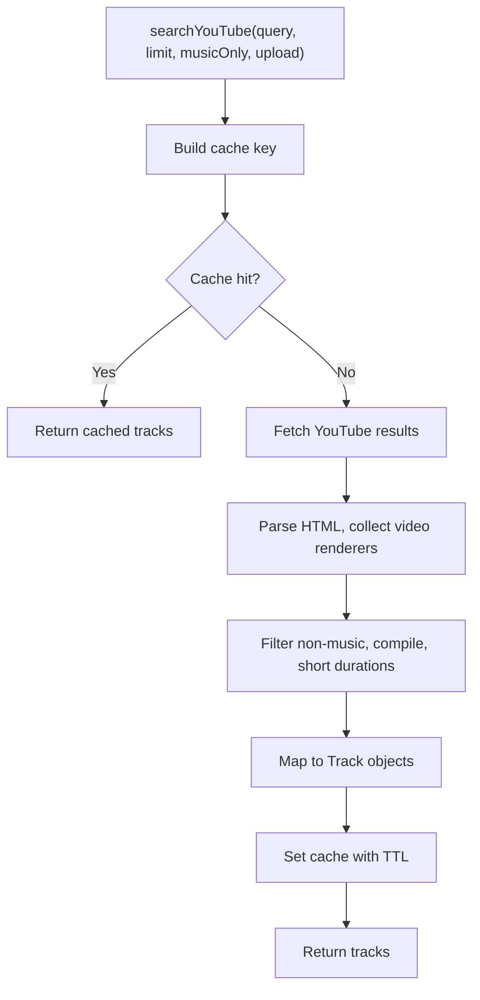
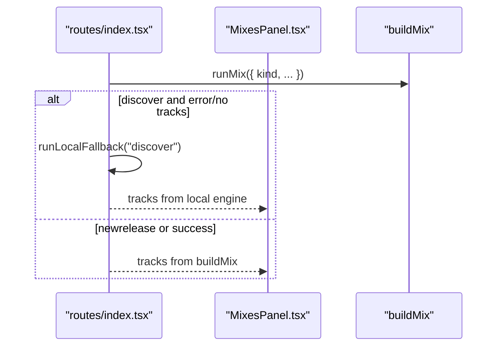
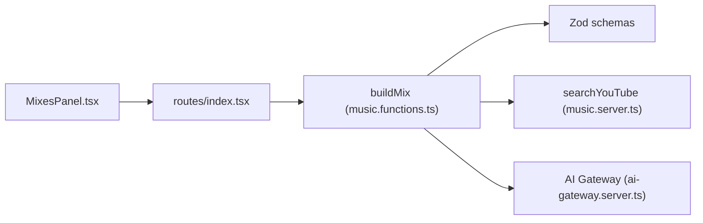

# Mix Generation

<cite>
**Referenced Files in This Document**
- [music.functions.ts](file://src/lib/music.functions.ts)
- [music.server.ts](file://src/lib/music.server.ts)
- [ai-gateway.server.ts](file://src/lib/ai-gateway.server.ts)
- [index.tsx](file://src/routes/index.tsx)
- [MixesPanel.tsx](file://src/components/music/MixesPanel.tsx)
</cite>

## Table of Contents
1. [Introduction](#introduction)
2. [Project Structure](#project-structure)
3. [Core Components](#core-components)
4. [Architecture Overview](#architecture-overview)
5. [Detailed Component Analysis](#detailed-component-analysis)
6. [Dependency Analysis](#dependency-analysis)
7. [Performance Considerations](#performance-considerations)
8. [Troubleshooting Guide](#troubleshooting-guide)
9. [Conclusion](#conclusion)

## Introduction
This document explains the mix generation system that creates personalized music collections. It focuses on the buildMix function, which supports two modes:
- discover: AI-powered discovery of new artists that match the listener’s sonic profile but are likely unknown to them.
- newrelease: finds the latest drops from the listener’s favorite artists by performing parallel searches for recent uploads from the current year.

It also covers input validation with Zod schemas, batch processing, result deduplication, error handling for individual artist searches, and performance optimizations through parallel API calls and efficient merging strategies.

## Project Structure
The mix generation spans server functions (Zod-validated endpoints), a YouTube search layer, an AI gateway provider, and UI orchestration:
- Server functions define validated inputs and implement business logic for mix generation.
- The YouTube search layer scrapes results, filters music-only content, and caches responses.
- The AI gateway connects to a hosted model provider to generate recommendations.
- The UI triggers mix builds and handles fallbacks when AI is unavailable.

**Diagram sources**
- [music.functions.ts:140-245](file://src/lib/music.functions.ts#L140-L245)
- [music.server.ts:182-247](file://src/lib/music.server.ts#L182-L247)
- [ai-gateway.server.ts:1-10](file://src/lib/ai-gateway.server.ts#L1-L10)
- [index.tsx:265-325](file://src/routes/index.tsx#L265-L325)
- [MixesPanel.tsx:10-46](file://src/components/music/MixesPanel.tsx#L10-L46)

**Section sources**
- [music.functions.ts:140-245](file://src/lib/music.functions.ts#L140-L245)
- [music.server.ts:182-247](file://src/lib/music.server.ts#L182-L247)
- [ai-gateway.server.ts:1-10](file://src/lib/ai-gateway.server.ts#L1-L10)
- [index.tsx:265-325](file://src/routes/index.tsx#L265-L325)
- [MixesPanel.tsx:10-46](file://src/components/music/MixesPanel.tsx#L10-L46)

## Core Components
- buildMix: A server function that validates inputs via Zod and branches into two modes:
  - newrelease: Parallel per-artist searches for recent songs from the current year, then deduplicates and caps results.
  - discover: Sends a sophisticated prompt to the AI gateway to recommend new artists matching the listener’s taste, then resolves each pick to a track via YouTube search.
- searchYouTube: Scrapes YouTube results with music-only filtering, upload-date filters, and a 5-minute LRU cache.
- AI gateway: Provides an OpenAI-compatible client configured with a hosted endpoint and API key header.
- UI integration: Routes trigger buildMix, handle errors, and fall back to local picks for discover mode when AI is unavailable.

Key responsibilities:
- Input validation and limits enforced by Zod schemas.
- Batched, parallelized external calls to reduce latency.
- Deduplication using sets to avoid repeated tracks.
- Graceful error handling at both AI and search layers.

**Section sources**
- [music.functions.ts:140-245](file://src/lib/music.functions.ts#L140-L245)
- [music.server.ts:182-247](file://src/lib/music.server.ts#L182-L247)
- [ai-gateway.server.ts:1-10](file://src/lib/ai-gateway.server.ts#L1-L10)
- [index.tsx:265-325](file://src/routes/index.tsx#L265-L325)

## Architecture Overview
The end-to-end flow for mix generation:

**Diagram sources**
- [music.functions.ts:156-245](file://src/lib/music.functions.ts#L156-L245)
- [music.server.ts:182-247](file://src/lib/music.server.ts#L182-L247)
- [ai-gateway.server.ts:1-10](file://src/lib/ai-gateway.server.ts#L1-L10)
- [index.tsx:265-325](file://src/routes/index.tsx#L265-L325)

## Detailed Component Analysis

### buildMix: Input Validation and Modes
- Zod schema enforces:
  - kind: enum ["discover", "newrelease"]
  - liked/recent/sequence/skipped/artists arrays with max lengths
  - optional brief string with length limit
  - optional count number within bounds
- Behavior:
  - newrelease: If no artists provided, returns empty tracks without error. Otherwise computes per-artist quota, performs parallel searches for “artist new song YYYY”, flattens results, deduplicates by id, and slices to count.
  - discover: Requires AI key; constructs a detailed prompt describing the listener’s sonic profile and constraints; parses JSON response; filters out known artists; resolves each pick to a track via YouTube search; returns up to count tracks.

**Diagram sources**
- [music.functions.ts:140-245](file://src/lib/music.functions.ts#L140-L245)

**Section sources**
- [music.functions.ts:140-245](file://src/lib/music.functions.ts#L140-L245)

### AI-Powered Discover Mode
- Prompt construction includes:
  - Loved songs, recent listening order, skips, disliked items, known artists to exclude, tuning preferences, and explicit instruction to recommend new artists closely matching the listener’s sonic profile.
- Error handling:
  - 429 rate limit: returns a user-friendly message.
  - 402 or credit exhaustion: returns a message prompting credits.
  - Other failures: generic unavailability message.
- Result resolution:
  - Parses JSON array of picks.
  - Filters out known artists.
  - Resolves each pick to a track via YouTube search with “audio” qualifier.
  - Returns up to count tracks with reasons attached.

**Diagram sources**
- [music.functions.ts:183-245](file://src/lib/music.functions.ts#L183-L245)
- [ai-gateway.server.ts:1-10](file://src/lib/ai-gateway.server.ts#L1-L10)
- [music.server.ts:182-247](file://src/lib/music.server.ts#L182-L247)

**Section sources**
- [music.functions.ts:183-245](file://src/lib/music.functions.ts#L183-L245)
- [ai-gateway.server.ts:1-10](file://src/lib/ai-gateway.server.ts#L1-L10)

### New Release Mode: Parallel Searches and Deduplication
- Computes per-artist quota to distribute results evenly across artists.
- Executes parallel searches for “artist new song YYYY” with a small buffer (+1).
- Uses a Set to deduplicate tracks by id across all batches.
- Caps final list to requested count.
- Individual artist search errors are caught and treated as empty results, ensuring partial success.

**Diagram sources**
- [music.functions.ts:162-181](file://src/lib/music.functions.ts#L162-L181)

**Section sources**
- [music.functions.ts:162-181](file://src/lib/music.functions.ts#L162-L181)

### YouTube Search Layer: Filtering and Caching
- Music-only filtering:
  - Applies category filters and excludes non-music terms and compilations.
  - Enforces reasonable duration ranges to avoid shorts/live streams.
- Upload date filters:
  - Supports “today” and “week” ranges for freshness signals.
- Caching:
  - In-memory LRU cache keyed by query parameters with 5-minute TTL and max entries.
  - Evicts oldest entry when full.

**Diagram sources**
- [music.server.ts:182-247](file://src/lib/music.server.ts#L182-L247)

**Section sources**
- [music.server.ts:182-247](file://src/lib/music.server.ts#L182-L247)

### UI Orchestration and Fallbacks
- loadMix triggers buildMix for discover/newrelease, passing top artists, liked/recent history, sequence, skips, and settings.
- For discover mode, if AI is unavailable or returns no tracks, it falls back to a local engine that generates picks without AI.
- New release mix can surface “New from your artists” alerts based on periodic checks.

**Diagram sources**
- [index.tsx:265-325](file://src/routes/index.tsx#L265-L325)
- [MixesPanel.tsx:10-46](file://src/components/music/MixesPanel.tsx#L10-L46)

**Section sources**
- [index.tsx:265-325](file://src/routes/index.tsx#L265-L325)
- [MixesPanel.tsx:10-46](file://src/components/music/MixesPanel.tsx#L10-L46)

## Dependency Analysis
- buildMix depends on:
  - Zod for input validation.
  - searchYouTube for resolving tracks.
  - AI gateway for discover mode.
- searchYouTube depends on:
  - HTTP fetch to YouTube results page.
  - HTML parsing utilities to extract video metadata.
  - Local cache for performance.
- UI depends on:
  - Server functions exposed via TanStack Start.
  - Local fallback for resilience when AI is unavailable.

**Diagram sources**
- [music.functions.ts:140-245](file://src/lib/music.functions.ts#L140-L245)
- [music.server.ts:182-247](file://src/lib/music.server.ts#L182-L247)
- [ai-gateway.server.ts:1-10](file://src/lib/ai-gateway.server.ts#L1-L10)
- [index.tsx:265-325](file://src/routes/index.tsx#L265-L325)
- [MixesPanel.tsx:10-46](file://src/components/music/MixesPanel.tsx#L10-L46)

**Section sources**
- [music.functions.ts:140-245](file://src/lib/music.functions.ts#L140-L245)
- [music.server.ts:182-247](file://src/lib/music.server.ts#L182-L247)
- [ai-gateway.server.ts:1-10](file://src/lib/ai-gateway.server.ts#L1-L10)
- [index.tsx:265-325](file://src/routes/index.tsx#L265-L325)
- [MixesPanel.tsx:10-46](file://src/components/music/MixesPanel.tsx#L10-L46)

## Performance Considerations
- Parallelism:
  - newrelease uses Promise.all to search multiple artists concurrently, reducing total latency.
  - discover resolves multiple picks concurrently after AI returns suggestions.
- Caching:
  - searchYouTube caches results for 5 minutes with LRU eviction, minimizing redundant network requests.
- Quotas and Limits:
  - Per-artist quotas prevent over-fetching and ensure balanced coverage.
  - Max limits on arrays and counts protect against excessive payloads.
- Deduplication:
  - Sets used to deduplicate by track id across batches avoid duplicates efficiently.
- Filtering:
  - Music-only filters and duration checks reduce irrelevant results early.

[No sources needed since this section provides general guidance]

## Troubleshooting Guide
Common issues and their handling:
- AI configuration missing:
  - discover mode returns a clear error indicating AI is not configured.
- Rate limiting or credits exhausted:
  - Specific messages guide users to retry later or add credits.
- Network or parsing failures:
  - searchYouTube returns empty results or throws; callers catch and treat as empty, preserving partial success.
- No artists for newrelease:
  - Returns empty tracks without error, allowing UI to show an appropriate empty state.

Operational tips:
- Ensure LOVABLE_API_KEY is set for discover mode.
- Monitor cache size and TTL if under heavy load.
- Use rebuild actions to refresh mixes when external catalogs change.

**Section sources**
- [music.functions.ts:183-245](file://src/lib/music.functions.ts#L183-L245)
- [music.server.ts:182-247](file://src/lib/music.server.ts#L182-L247)

## Conclusion
The mix generation system combines robust input validation, intelligent AI-driven discovery, and efficient parallel search strategies to deliver personalized music collections. The newrelease mode quickly surfaces fresh drops from favorite artists, while the discover mode leverages sophisticated prompts to find new artists aligned with the listener’s taste. Robust error handling, caching, and deduplication ensure reliability and performance across varying conditions.

[No sources needed since this section summarizes without analyzing specific files]