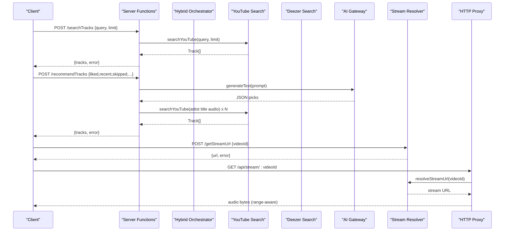
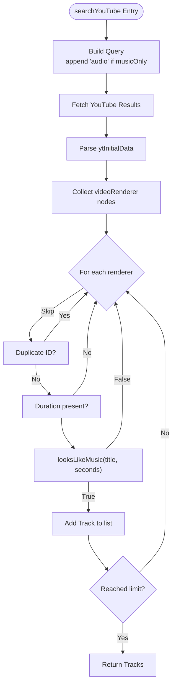
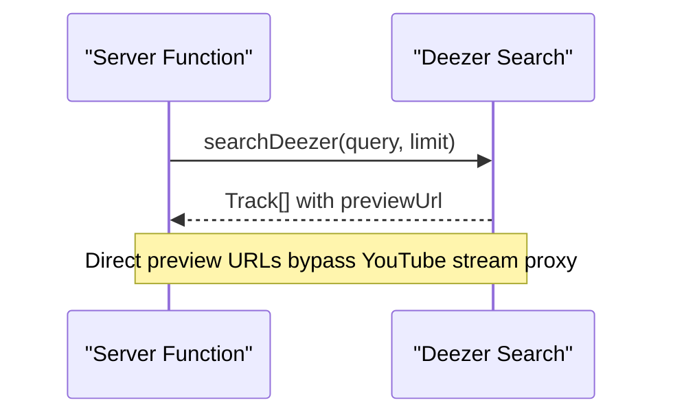
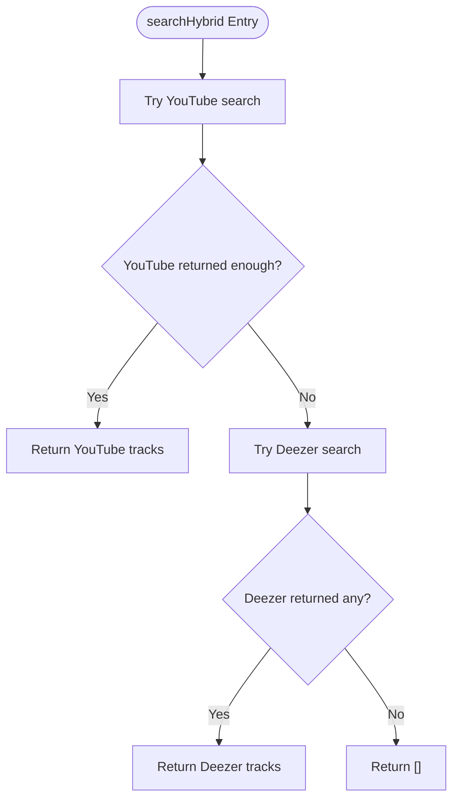
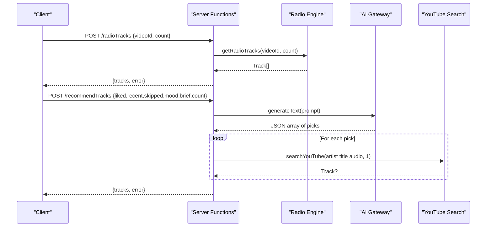
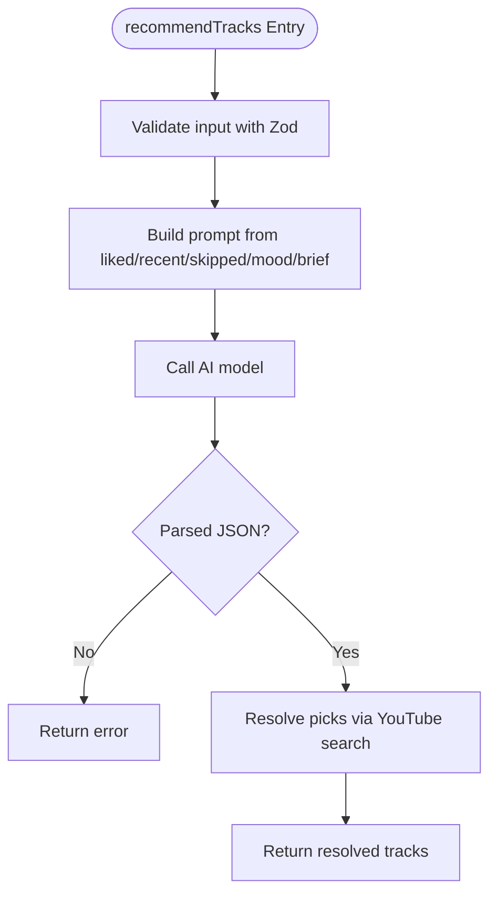
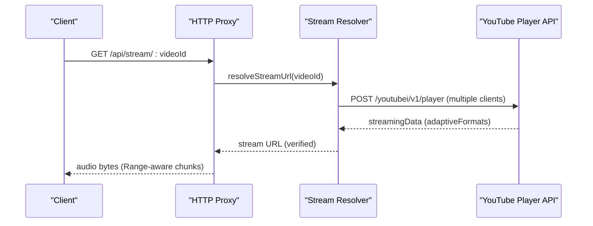
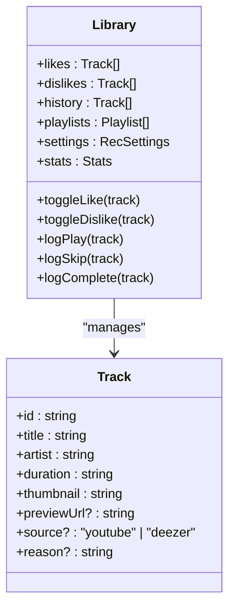
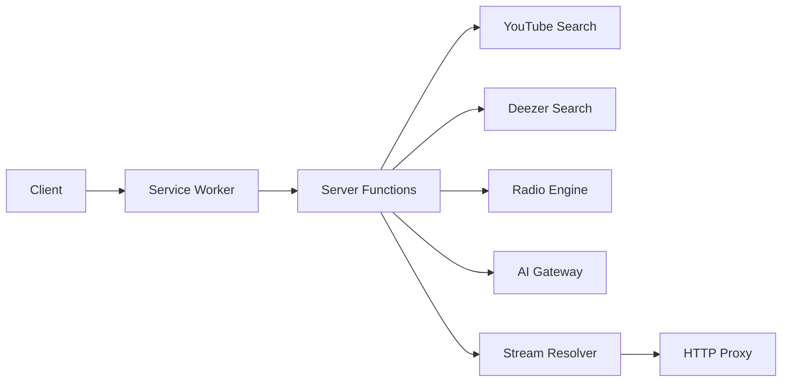

# Music Discovery Service

<cite>
**Referenced Files in This Document**
- [music.server.ts](file://src/lib/music.server.ts)
- [deezer.server.ts](file://src/lib/deezer.server.ts)
- [ai-gateway.server.ts](file://src/lib/ai-gateway.server.ts)
- [music-hybrid.server.ts](file://src/lib/music-hybrid.server.ts)
- [radio.server.ts](file://src/lib/radio.server.ts)
- [music.functions.ts](file://src/lib/music.functions.ts)
- [stream.server.ts](file://src/lib/stream.server.ts)
- [server.ts](file://src/server.ts)
- [library.ts](file://src/lib/library.ts)
- [error-capture.ts](file://src/lib/error-capture.ts)
- [sw.js](file://public/sw.js)
</cite>

## Table of Contents
1. [Introduction](#introduction)
2. [Project Structure](#project-structure)
3. [Core Components](#core-components)
4. [Architecture Overview](#architecture-overview)
5. [Detailed Component Analysis](#detailed-component-analysis)
6. [Dependency Analysis](#dependency-analysis)
7. [Performance Considerations](#performance-considerations)
8. [Troubleshooting Guide](#troubleshooting-guide)
9. [Conclusion](#conclusion)

## Introduction
This document explains the music discovery service that powers search, recommendations, and content aggregation across YouTube and Deezer. It covers:
- Multi-source search with YouTube as primary and Deezer as fallback for playable previews
- Search query processing, result filtering, and pagination via limits
- Recommendation algorithms driven by user behavior (likes, skips, play history) and an AI-powered system using OpenAI-compatible APIs
- Content processing pipeline that transforms raw API responses into standardized Track objects
- Caching mechanisms, request optimization, and performance considerations for large-scale operations
- Error handling patterns and streaming proxy details

## Project Structure
The service is organized into server-side libraries that integrate with external APIs and expose server functions for the frontend. Key modules include:
- Search and scraping utilities for YouTube
- Deezer integration for preview playback
- Hybrid orchestration to combine sources
- Radio/recommendation engine leveraging YouTube’s built-in radio
- AI gateway abstraction for OpenAI-compatible models
- Stream resolution and proxy for ad-free playback
- Local-first library with sync to cloud storage
- Global error capture and service worker caching

```mermaid
graph TB
Client["Client App"] --> ServerFn["Server Functions<br/>music.functions.ts"]
ServerFn --> YTSearch["YouTube Search<br/>music.server.ts"]
ServerFn --> Hybrid["Hybrid Orchestrator<br/>music-hybrid.server.ts"]
Hybrid --> YTSearch
Hybrid --> Deezer["Deezer Search<br/>deezer.server.ts"]
ServerFn --> Radio["Radio Engine<br/>radio.server.ts"]
ServerFn --> AI["AI Gateway<br/>ai-gateway.server.ts"]
ServerFn --> Stream["Stream Resolver<br/>stream.server.ts"]
Stream --> Proxy["HTTP Proxy<br/>server.ts"]
Client <- --> SW["Service Worker Cache<br/>sw.js"]
```

**Diagram sources**
- [music.functions.ts:8-627](file://src/lib/music.functions.ts#L8-L627)
- [music.server.ts:182-247](file://src/lib/music.server.ts#L182-L247)
- [deezer.server.ts:39-96](file://src/lib/deezer.server.ts#L39-L96)
- [music-hybrid.server.ts:22-98](file://src/lib/music-hybrid.server.ts#L22-L98)
- [radio.server.ts:25-94](file://src/lib/radio.server.ts#L25-L94)
- [ai-gateway.server.ts:1-10](file://src/lib/ai-gateway.server.ts#L1-L10)
- [stream.server.ts:108-122](file://src/lib/stream.server.ts#L108-L122)
- [server.ts:102-179](file://src/server.ts#L102-L179)
- [sw.js:52-67](file://public/sw.js#L52-L67)

**Section sources**
- [music.functions.ts:8-627](file://src/lib/music.functions.ts#L8-L627)
- [music.server.ts:182-247](file://src/lib/music.server.ts#L182-L247)
- [deezer.server.ts:39-96](file://src/lib/deezer.server.ts#L39-L96)
- [music-hybrid.server.ts:22-98](file://src/lib/music-hybrid.server.ts#L22-L98)
- [radio.server.ts:25-94](file://src/lib/radio.server.ts#L25-L94)
- [ai-gateway.server.ts:1-10](file://src/lib/ai-gateway.server.ts#L1-L10)
- [stream.server.ts:108-122](file://src/lib/stream.server.ts#L108-L122)
- [server.ts:102-179](file://src/server.ts#L102-L179)
- [sw.js:52-67](file://public/sw.js#L52-L67)

## Core Components
- Standardized Track model used across all components
- YouTube search with music-only filtering and upload date filters
- Deezer search returning direct preview URLs
- Hybrid orchestrator combining YouTube and Deezer
- Radio engine based on YouTube’s recommendation endpoint
- AI-powered recommendation and mix builder using OpenAI-compatible APIs
- Stream resolver and HTTP proxy for ad-free playback
- Local-first library tracking likes, dislikes, history, playlists, settings, and stats
- Global error capture and service worker caching strategy

**Section sources**
- [music.server.ts:1-13](file://src/lib/music.server.ts#L1-L13)
- [music.server.ts:182-247](file://src/lib/music.server.ts#L182-L247)
- [deezer.server.ts:39-96](file://src/lib/deezer.server.ts#L39-L96)
- [music-hybrid.server.ts:22-98](file://src/lib/music-hybrid.server.ts#L22-L98)
- [radio.server.ts:25-94](file://src/lib/radio.server.ts#L25-L94)
- [music.functions.ts:58-137](file://src/lib/music.functions.ts#L58-L137)
- [stream.server.ts:108-122](file://src/lib/stream.server.ts#L108-L122)
- [server.ts:102-179](file://src/server.ts#L102-L179)
- [library.ts:242-557](file://src/lib/library.ts#L242-L557)
- [error-capture.ts:1-81](file://src/lib/error-capture.ts#L1-L81)
- [sw.js:52-67](file://public/sw.js#L52-L67)

## Architecture Overview
The service exposes server functions that validate inputs with Zod schemas, call source integrations, and return standardized results. A hybrid approach ensures resilience: YouTube provides full tracks when available; Deezer provides reliable previews otherwise. Recommendations can be AI-driven or local heuristics depending on configuration. Playback uses a stream resolver and a same-origin proxy to bypass CORS and throttling constraints.



**Diagram sources**
- [music.functions.ts:8-21](file://src/lib/music.functions.ts#L8-L21)
- [music.functions.ts:58-137](file://src/lib/music.functions.ts#L58-L137)
- [music.functions.ts:613-627](file://src/lib/music.functions.ts#L613-L627)
- [music-hybrid.server.ts:22-49](file://src/lib/music-hybrid.server.ts#L22-L49)
- [music.server.ts:182-247](file://src/lib/music.server.ts#L182-L247)
- [deezer.server.ts:39-96](file://src/lib/deezer.server.ts#L39-L96)
- [stream.server.ts:108-122](file://src/lib/stream.server.ts#L108-L122)
- [server.ts:102-179](file://src/server.ts#L102-L179)

## Detailed Component Analysis

### YouTube Search and Filtering
- Scrapes YouTube search results without an API key
- Applies music-only filters and optional upload-date filters
- Filters out non-music and compilation videos by title keywords and duration heuristics
- Deduplicates results and enforces limits
- Implements in-memory LRU-style cache with TTL for repeated queries



**Diagram sources**
- [music.server.ts:182-247](file://src/lib/music.server.ts#L182-L247)
- [music.server.ts:149-162](file://src/lib/music.server.ts#L149-L162)
- [music.server.ts:52-75](file://src/lib/music.server.ts#L52-L75)

**Section sources**
- [music.server.ts:182-247](file://src/lib/music.server.ts#L182-L247)
- [music.server.ts:149-162](file://src/lib/music.server.ts#L149-L162)
- [music.server.ts:52-75](file://src/lib/music.server.ts#L52-L75)

### Deezer Integration
- Searches Deezer’s free API for tracks matching a query
- Returns tracks with direct MP3 preview URLs suitable for playback
- Normalizes durations and thumbnails into the standard Track shape
- Provides a helper to find a Deezer preview for a given YouTube track title and artist



**Diagram sources**
- [deezer.server.ts:39-96](file://src/lib/deezer.server.ts#L39-L96)

**Section sources**
- [deezer.server.ts:39-96](file://src/lib/deezer.server.ts#L39-L96)

### Hybrid Orchestration
- Tries YouTube first; falls back to Deezer if YouTube fails or returns insufficient results
- Ensures always-playable results by preferring Deezer previews when needed
- Provides helpers to detect Deezer tracks and compute playable URLs



**Diagram sources**
- [music-hybrid.server.ts:22-49](file://src/lib/music-hybrid.server.ts#L22-L49)

**Section sources**
- [music-hybrid.server.ts:22-49](file://src/lib/music-hybrid.server.ts#L22-L49)

### Radio and Recommendations
- Radio: Uses YouTube’s built-in “RD” playlist endpoint to get similar songs based on the current track
- Recommendations: Builds prompts from user behavior (likes, recent plays, skips, disliked, mood, brief) and calls an OpenAI-compatible model to produce JSON picks; then resolves those picks via YouTube search
- Mix builder: Similar to recommendations but tailored for discover or new release mixes



**Diagram sources**
- [radio.server.ts:25-94](file://src/lib/radio.server.ts#L25-L94)
- [music.functions.ts:58-137](file://src/lib/music.functions.ts#L58-L137)
- [music.functions.ts:156-245](file://src/lib/music.functions.ts#L156-L245)

**Section sources**
- [radio.server.ts:25-94](file://src/lib/radio.server.ts#L25-L94)
- [music.functions.ts:58-137](file://src/lib/music.functions.ts#L58-L137)
- [music.functions.ts:156-245](file://src/lib/music.functions.ts#L156-L245)

### AI-Powered Recommendations
- Uses an OpenAI-compatible provider configured via environment key
- Constructs a prompt from behavioral signals and tuning preferences
- Parses model output as JSON and resolves picks to playable tracks
- Handles rate limiting and credit errors gracefully



**Diagram sources**
- [music.functions.ts:58-137](file://src/lib/music.functions.ts#L58-L137)
- [ai-gateway.server.ts:1-10](file://src/lib/ai-gateway.server.ts#L1-L10)

**Section sources**
- [music.functions.ts:58-137](file://src/lib/music.functions.ts#L58-L137)
- [ai-gateway.server.ts:1-10](file://src/lib/ai-gateway.server.ts#L1-L10)

### Streaming and Playback
- Resolves a direct audio URL from YouTube’s player endpoint, probing multiple client configs and verifying stream availability
- Proxies audio through a same-origin endpoint to handle CORS and throttling, supporting range requests and chunked delivery
- Detects capped streams and rejects them early to avoid truncated downloads



**Diagram sources**
- [stream.server.ts:47-122](file://src/lib/stream.server.ts#L47-L122)
- [server.ts:102-179](file://src/server.ts#L102-L179)

**Section sources**
- [stream.server.ts:47-122](file://src/lib/stream.server.ts#L47-L122)
- [server.ts:102-179](file://src/server.ts#L102-L179)

### Library and Behavioral Signals
- Tracks likes, dislikes, history, playlists, settings, and per-track stats (plays, skips, completions)
- Persists data locally and syncs to cloud when signed in
- Exposes utilities to derive top artists, replay mixes, skipped labels, and sequence briefs for recommendations



**Diagram sources**
- [library.ts:3-14](file://src/lib/library.ts#L3-L14)
- [library.ts:242-557](file://src/lib/library.ts#L242-L557)

**Section sources**
- [library.ts:3-14](file://src/lib/library.ts#L3-L14)
- [library.ts:242-557](file://src/lib/library.ts#L242-L557)

## Dependency Analysis
- Server functions depend on source integrations (YouTube, Deezer), radio engine, and AI gateway
- Hybrid orchestrator depends on both YouTube and Deezer modules
- Stream resolver depends on YouTube’s internal player API and is proxied by the server
- Service worker caches API responses and app shell, excluding audio streams



**Diagram sources**
- [music.functions.ts:8-627](file://src/lib/music.functions.ts#L8-L627)
- [music-hybrid.server.ts:22-98](file://src/lib/music-hybrid.server.ts#L22-L98)
- [stream.server.ts:108-122](file://src/lib/stream.server.ts#L108-L122)
- [server.ts:102-179](file://src/server.ts#L102-L179)
- [sw.js:52-67](file://public/sw.js#L52-L67)

**Section sources**
- [music.functions.ts:8-627](file://src/lib/music.functions.ts#L8-L627)
- [music-hybrid.server.ts:22-98](file://src/lib/music-hybrid.server.ts#L22-L98)
- [stream.server.ts:108-122](file://src/lib/stream.server.ts#L108-L122)
- [server.ts:102-179](file://src/server.ts#L102-L179)
- [sw.js:52-67](file://public/sw.js#L52-L67)

## Performance Considerations
- In-memory LRU search cache with 5-minute TTL reduces repeated YouTube scrapes
- Limits on search and recommendation counts prevent excessive network calls
- Parallel batched searches for recommendations and mixes improve throughput
- Stream proxy uses chunked delivery and range requests to handle throttled URLs and reduce memory pressure
- Service worker caches API responses and app shell to improve offline resilience and reduce latency
- AbortSignal timeouts guard against slow upstream responses

[No sources needed since this section provides general guidance]

## Troubleshooting Guide
- AI rate limits and credits: The recommendation endpoints return specific error messages for 429 and credit exhaustion
- Stream unavailability: The stream proxy validates upstream responses and returns clear status codes when streams are restricted or throttled
- SSR error recovery: Global error capture wraps console.error and event listeners to preserve stack traces even when h3 swallows errors

**Section sources**
- [music.functions.ts:98-111](file://src/lib/music.functions.ts#L98-L111)
- [music.functions.ts:207-218](file://src/lib/music.functions.ts#L207-L218)
- [server.ts:135-149](file://src/server.ts#L135-L149)
- [error-capture.ts:1-81](file://src/lib/error-capture.ts#L1-L81)

## Conclusion
The music discovery service combines robust multi-source search, intelligent recommendations, and resilient playback. It leverages YouTube for rich catalog access and Deezer for reliable previews, while an AI layer personalizes suggestions based on user behavior. Caching, streaming optimizations, and comprehensive error handling ensure a smooth experience at scale.

[No sources needed since this section summarizes without analyzing specific files]