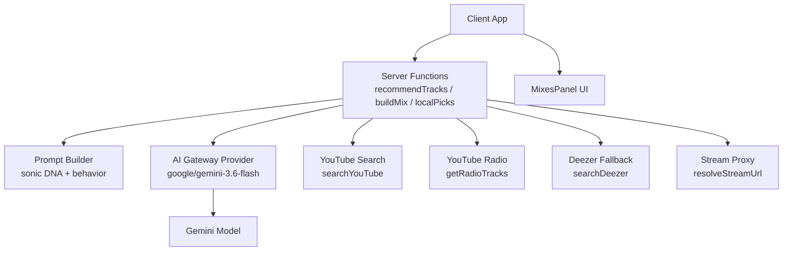
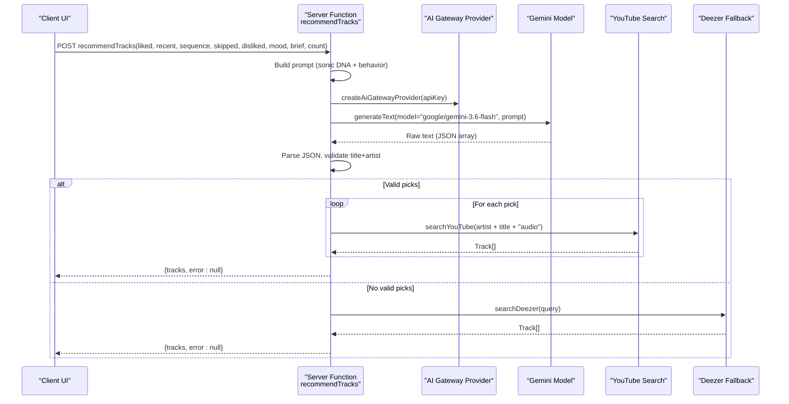
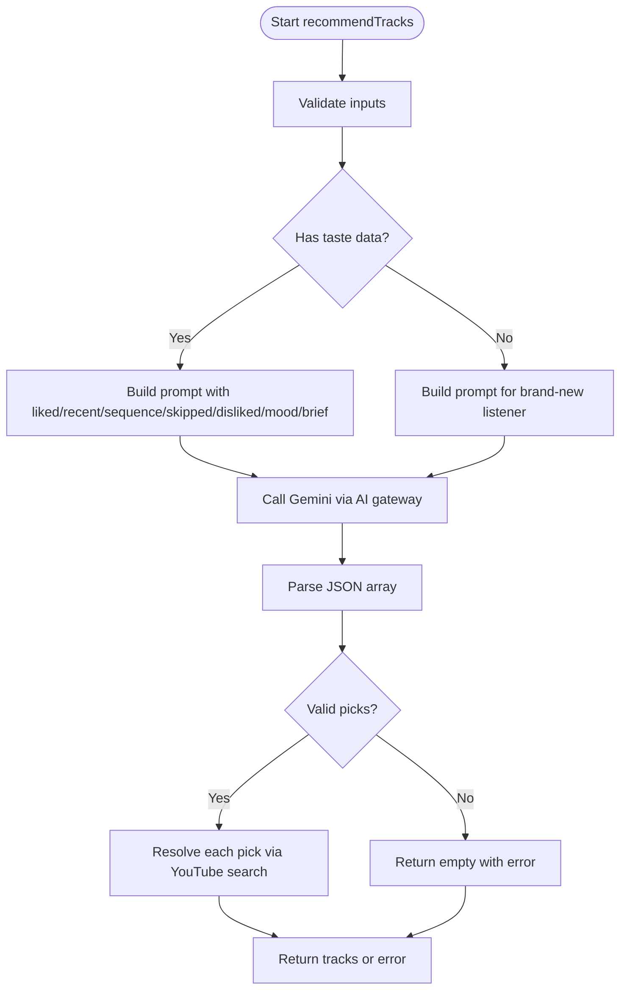
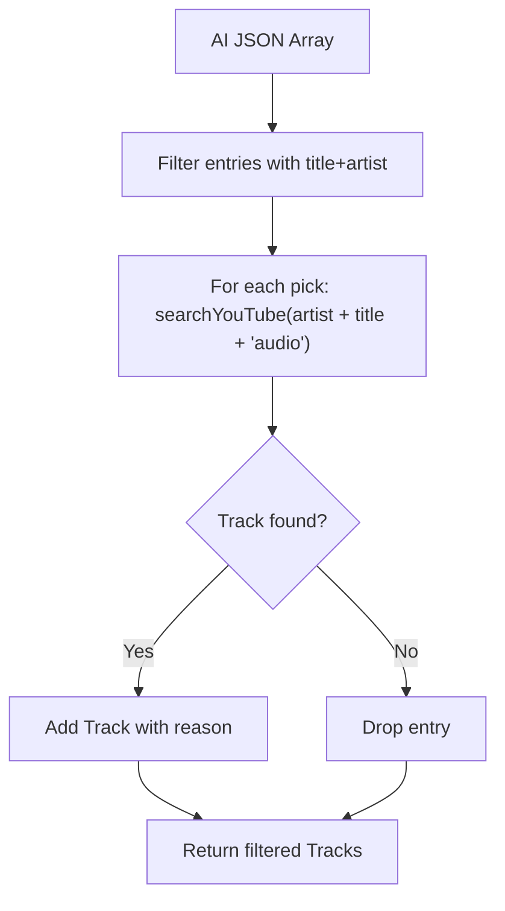
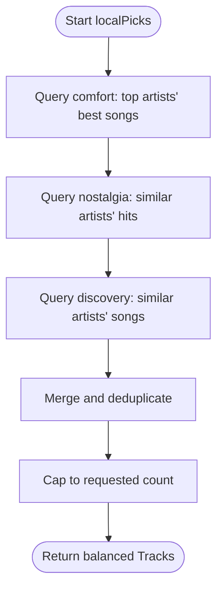
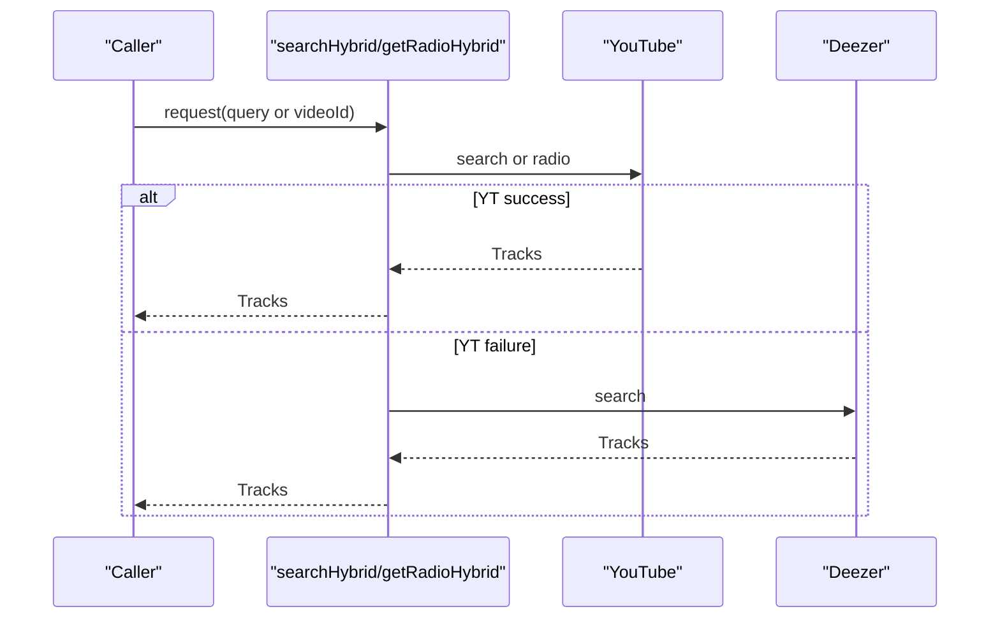
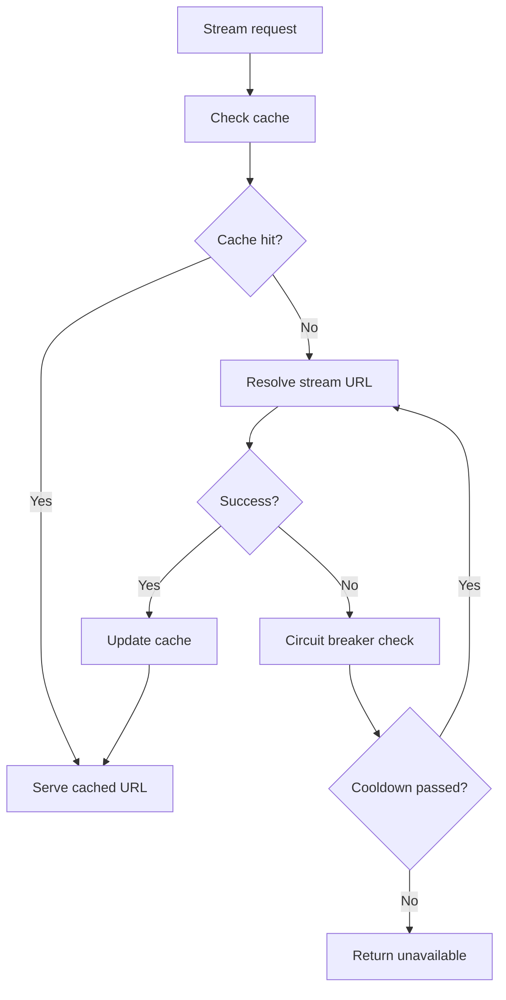
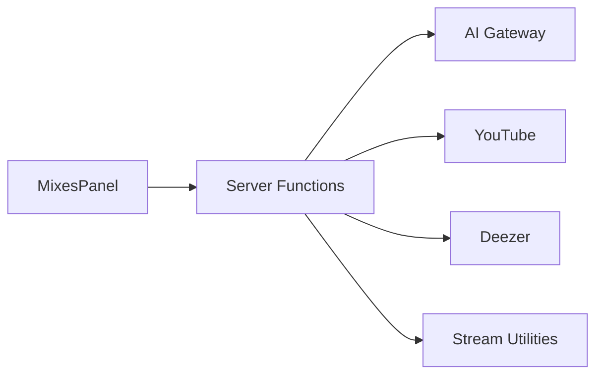

# AI-Powered Recommendations

<cite>
**Referenced Files in This Document**
- [music.functions.ts](file://src/lib/music.functions.ts)
- [ai-gateway.server.ts](file://src/lib/ai-gateway.server.ts)
- [music.server.ts](file://src/lib/music.server.ts)
- [radio.server.ts](file://src/lib/radio.server.ts)
- [deezer.server.ts](file://src/lib/deezer.server.ts)
- [stream.server.ts](file://src/lib/stream.server.ts)
- [server.ts](file://src/server.ts)
- [error-capture.ts](file://src/lib/error-capture.ts)
- [MixesPanel.tsx](file://src/components/music/MixesPanel.tsx)
</cite>

## Table of Contents
1. [Introduction](#introduction)
2. [Project Structure](#project-structure)
3. [Core Components](#core-components)
4. [Architecture Overview](#architecture-overview)
5. [Detailed Component Analysis](#detailed-component-analysis)
6. [Dependency Analysis](#dependency-analysis)
7. [Performance Considerations](#performance-considerations)
8. [Troubleshooting Guide](#troubleshooting-guide)
9. [Conclusion](#conclusion)

## Introduction
This document explains the AI-powered recommendation system that analyzes user preferences and generates personalized music suggestions. It covers sophisticated prompt engineering that captures sonic DNA characteristics and behavioral patterns from user interactions, integration with Google Gemini models via an AI gateway, response parsing and validation, and a balancing algorithm to ensure diversity across comfort tracks, nostalgic favorites, and new discoveries. It also documents how AI responses are transformed into valid Track objects by searching YouTube for matching audio content, and provides troubleshooting guidance for common AI service issues such as rate limiting, authentication failures, credit exhaustion, timeouts, and malformed responses.

## Project Structure
The recommendation system is implemented primarily on the server side using TanStack Server Functions. The key modules include:
- Recommendation orchestration and prompt assembly
- AI model invocation through an OpenAI-compatible gateway
- YouTube search and radio retrieval
- Deezer fallback for playable previews
- Streaming proxy and error capture utilities
- UI components that present mixes and settings



**Diagram sources**
- [music.functions.ts:58-137](file://src/lib/music.functions.ts#L58-L137)
- [ai-gateway.server.ts:1-10](file://src/lib/ai-gateway.server.ts#L1-L10)
- [music.server.ts:182-247](file://src/lib/music.server.ts#L182-L247)
- [radio.server.ts:25-94](file://src/lib/radio.server.ts#L25-L94)
- [deezer.server.ts:39-74](file://src/lib/deezer.server.ts#L39-L74)
- [stream.server.ts:35-80](file://src/lib/stream.server.ts#L35-L80)

**Section sources**
- [music.functions.ts:58-137](file://src/lib/music.functions.ts#L58-L137)
- [MixesPanel.tsx:10-46](file://src/components/music/MixesPanel.tsx#L10-L46)

## Core Components
- Recommendation server function: Assembles prompts from liked songs, recent plays, session sequences, skipped tracks, dislikes, mood, and tuning preferences; calls Gemini via the AI gateway; parses JSON responses; validates entries; resolves each suggestion to a playable Track via YouTube search; returns results or errors.
- AI gateway provider: Configures an OpenAI-compatible client pointing to the Lovable AI gateway with API key headers.
- YouTube search and radio: Scrapes YouTube results with music filters and upload-date filters; extracts structured track metadata; builds radio recommendations based on a seed video.
- Deezer fallback: Provides direct preview URLs when YouTube results are unavailable or restricted.
- Streaming and caching: Resolves stream URLs with circuit breaker logic and caches to improve reliability and performance.
- Error capture: Enhances error logging and preserves stack traces for debugging.

**Section sources**
- [music.functions.ts:58-137](file://src/lib/music.functions.ts#L58-L137)
- [ai-gateway.server.ts:1-10](file://src/lib/ai-gateway.server.ts#L1-L10)
- [music.server.ts:182-247](file://src/lib/music.server.ts#L182-L247)
- [radio.server.ts:25-94](file://src/lib/radio.server.ts#L25-L94)
- [deezer.server.ts:39-74](file://src/lib/deezer.server.ts#L39-L74)
- [stream.server.ts:35-80](file://src/lib/stream.server.ts#L35-L80)
- [error-capture.ts:1-71](file://src/lib/error-capture.ts#L1-L71)

## Architecture Overview
The recommendation pipeline orchestrates multiple services to deliver diverse, high-quality suggestions:



**Diagram sources**
- [music.functions.ts:58-137](file://src/lib/music.functions.ts#L58-L137)
- [ai-gateway.server.ts:1-10](file://src/lib/ai-gateway.server.ts#L1-L10)
- [music.server.ts:182-247](file://src/lib/music.server.ts#L182-L247)
- [deezer.server.ts:39-74](file://src/lib/deezer.server.ts#L39-L74)

## Detailed Component Analysis

### Recommendation Orchestration and Prompt Engineering
- Inputs validated via schema: liked songs, recent plays, session sequence, skipped tracks, disliked songs, mood, brief tuning preferences, and desired count.
- Prompt construction:
  - Captures sonic DNA: tempo, pitch, instrumentation, vocal texture, energy.
  - Incorporates behavioral signals: order of plays, replays, skips, dislikes.
  - Includes explicit constraints: avoid repeats, respect tuning preferences, balance categories.
- Balancing directive: 40% comfort picks aligned to current taste, 30% nostalgic favorites they may not have heard in years, 30% completely new artists closely matching their sonic profile.
- Output format enforced: JSON array with title, artist, reason.



**Diagram sources**
- [music.functions.ts:58-137](file://src/lib/music.functions.ts#L58-L137)

**Section sources**
- [music.functions.ts:47-137](file://src/lib/music.functions.ts#L47-L137)

### AI Gateway Integration
- Provider configuration uses an OpenAI-compatible client pointed at the Lovable AI gateway with a custom header for the API key.
- Model selection: google/gemini-3.6-flash invoked via generateText.
- Request formatting: prompt string assembled from user context and constraints.
- Response handling: raw text parsed to extract JSON array; robust error handling for rate limits, credits exhaustion, and general unavailability.

```mermaid
classDiagram
class AiGatewayProvider {
+createAiGatewayProvider(apiKey)
}
class GeminiModel {
+generateText({model, prompt})
}
class RecommendHandler {
+recommendTracks(input)
}
RecommendHandler --> AiGatewayProvider : "creates"
RecommendHandler --> GeminiModel : "calls"
```

**Diagram sources**
- [ai-gateway.server.ts:1-10](file://src/lib/ai-gateway.server.ts#L1-L10)
- [music.functions.ts:97-111](file://src/lib/music.functions.ts#L97-L111)

**Section sources**
- [ai-gateway.server.ts:1-10](file://src/lib/ai-gateway.server.ts#L1-L10)
- [music.functions.ts:97-111](file://src/lib/music.functions.ts#L97-L111)

### Validation and Filtering to Track Objects
- After parsing AI output, only entries with both title and artist are kept.
- Each pick is resolved to a playable Track by searching YouTube with the artist and title plus “audio” to prioritize music-only content.
- If resolution fails, the entry is dropped; final result includes only valid Tracks.
- Optional reason field preserved from AI output for display.



**Diagram sources**
- [music.functions.ts:113-137](file://src/lib/music.functions.ts#L113-L137)
- [music.server.ts:182-247](file://src/lib/music.server.ts#L182-L247)

**Section sources**
- [music.functions.ts:113-137](file://src/lib/music.functions.ts#L113-L137)
- [music.server.ts:182-247](file://src/lib/music.server.ts#L182-L247)

### Recommendation Balancing Algorithm
- The prompt instructs the model to balance the batch:
  - 40% comfort picks aligned to current taste
  - 30% nostalgic favorites they likely haven’t heard in years
  - 30% completely new artists closely matching their sonic profile
- Additional constraints: avoid repetition, maintain profile consistency, and respect tuning preferences.
- Non-AI fallback modes (localPicks) mirror this balance using curated YouTube queries when AI is unavailable.



**Diagram sources**
- [music.functions.ts:324-369](file://src/lib/music.functions.ts#L324-L369)

**Section sources**
- [music.functions.ts:324-369](file://src/lib/music.functions.ts#L324-L369)

### YouTube Radio and Hybrid Fallbacks
- YouTube radio leverages YouTube’s built-in recommendation engine to fetch similar tracks based on a seed video ID.
- Hybrid strategy:
  - Try YouTube first for full songs; if insufficient or failed, fall back to Deezer for playable previews.
  - Radio hybrid: try YouTube radio; if insufficient, search Deezer trending content.



**Diagram sources**
- [music-hybrid.server.ts:22-98](file://src/lib/music-hybrid.server.ts#L22-L98)
- [radio.server.ts:25-94](file://src/lib/radio.server.ts#L25-L94)
- [deezer.server.ts:39-74](file://src/lib/deezer.server.ts#L39-L74)

**Section sources**
- [music-hybrid.server.ts:22-98](file://src/lib/music-hybrid.server.ts#L22-L98)
- [radio.server.ts:25-94](file://src/lib/radio.server.ts#L25-L94)

### Streaming, Caching, and Reliability
- Stream URL resolution includes a circuit breaker to prevent cascading failures during repeated errors.
- In-memory caches for search results and stream URLs reduce load and improve latency.
- Server-side stream proxy handles range requests and caps detection to avoid truncated playback.



**Diagram sources**
- [stream.server.ts:35-80](file://src/lib/stream.server.ts#L35-L80)
- [server.ts:134-169](file://src/server.ts#L134-L169)

**Section sources**
- [stream.server.ts:35-80](file://src/lib/stream.server.ts#L35-L80)
- [server.ts:134-169](file://src/server.ts#L134-L169)

## Dependency Analysis
- Server functions depend on:
  - AI gateway provider for model access
  - YouTube search and radio for content discovery
  - Deezer for fallback previews
  - Stream utilities for playback
- UI depends on server functions to populate mixes and settings.



**Diagram sources**
- [MixesPanel.tsx:10-46](file://src/components/music/MixesPanel.tsx#L10-L46)
- [music.functions.ts:58-137](file://src/lib/music.functions.ts#L58-L137)
- [ai-gateway.server.ts:1-10](file://src/lib/ai-gateway.server.ts#L1-L10)
- [music.server.ts:182-247](file://src/lib/music.server.ts#L182-L247)
- [deezer.server.ts:39-74](file://src/lib/deezer.server.ts#L39-L74)
- [stream.server.ts:35-80](file://src/lib/stream.server.ts#L35-L80)

**Section sources**
- [MixesPanel.tsx:10-46](file://src/components/music/MixesPanel.tsx#L10-L46)
- [music.functions.ts:58-137](file://src/lib/music.functions.ts#L58-L137)

## Performance Considerations
- Caching:
  - Search results cached for 5 minutes with LRU eviction to reduce redundant network calls.
  - Stream URLs cached with TTL and LRU eviction to minimize repeated resolution overhead.
- Concurrency:
  - Parallel resolution of AI-suggested tracks via Promise.all to speed up validation and enrichment.
- Timeouts:
  - AbortSignal timeouts on external requests to prevent hanging operations.
- Fallbacks:
  - Hybrid strategies ensure playable content even when primary sources fail.

[No sources needed since this section provides general guidance]

## Troubleshooting Guide
Common AI service issues and mitigation strategies:

- Rate limiting (HTTP 429):
  - Symptom: “Too many requests — try again shortly.”
  - Action: Back off retries; consider batching requests; monitor usage quotas.
  - Source references: [music.functions.ts:105-111](file://src/lib/music.functions.ts#L105-L111)

- Credit exhaustion or payment required (HTTP 402 or message containing credit/payment_required):
  - Symptom: “AI credits are exhausted — add credits to keep generating picks.”
  - Action: Add credits to the account; verify billing status; retry after funding.
  - Source references: [music.functions.ts:105-111](file://src/lib/music.functions.ts#L105-L111)

- Authentication failures:
  - Symptom: Errors indicating invalid or missing API key.
  - Action: Ensure LOVABLE_API_KEY is configured; verify gateway headers; re-authenticate if necessary.
  - Source references: [ai-gateway.server.ts:1-10](file://src/lib/ai-gateway.server.ts#L1-L10), [music.functions.ts:60-63](file://src/lib/music.functions.ts#L60-L63)

- Service unavailability:
  - Symptom: “Recommendations are unavailable right now.”
  - Action: Retry later; use non-AI fallbacks like localPicks or radioTracks; check upstream status.
  - Source references: [music.functions.ts:105-111](file://src/lib/music.functions.ts#L105-L111)

- Malformed responses:
  - Symptom: “Could not read the recommendations.”
  - Action: Inspect raw model output; adjust prompt constraints; implement stricter parsing; log and report anomalies.
  - Source references: [music.functions.ts:113-121](file://src/lib/music.functions.ts#L113-L121)

- API timeouts:
  - Symptom: Network timeouts or aborted requests.
  - Action: Increase timeouts judiciously; implement retries with exponential backoff; use fallback sources.
  - Source references: [music.server.ts:182-247](file://src/lib/music.server.ts#L182-L247), [stream.server.ts:35-80](file://src/lib/stream.server.ts#L35-L80)

- Stream unavailability:
  - Symptom: “This track could not be streamed.”
  - Action: Invalidate stream cache; retry resolution; switch to Deezer preview if available.
  - Source references: [music.functions.ts:616-626](file://src/lib/music.functions.ts#L616-L626), [server.ts:134-169](file://src/server.ts#L134-L169)

**Section sources**
- [music.functions.ts:60-63](file://src/lib/music.functions.ts#L60-L63)
- [music.functions.ts:105-121](file://src/lib/music.functions.ts#L105-L121)
- [music.functions.ts:616-626](file://src/lib/music.functions.ts#L616-L626)
- [ai-gateway.server.ts:1-10](file://src/lib/ai-gateway.server.ts#L1-L10)
- [music.server.ts:182-247](file://src/lib/music.server.ts#L182-L247)
- [stream.server.ts:35-80](file://src/lib/stream.server.ts#L35-L80)
- [server.ts:134-169](file://src/server.ts#L134-L169)
- [error-capture.ts:1-71](file://src/lib/error-capture.ts#L1-L71)

## Conclusion
The recommendation system combines sophisticated prompt engineering with robust fallbacks and streaming reliability to deliver personalized, diverse music suggestions. By capturing sonic DNA and behavioral signals, enforcing strict validation, and balancing comfort, nostalgia, and discovery, it ensures high-quality experiences even under adverse conditions. The integration with Google Gemini via the AI gateway enables scalable personalization, while hybrid strategies and caching maintain performance and resilience.

[No sources needed since this section summarizes without analyzing specific files]