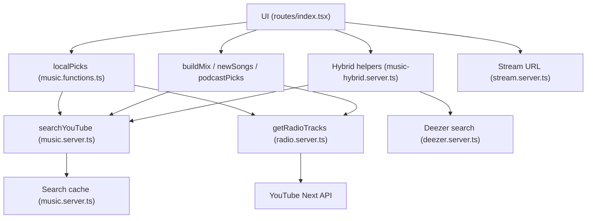
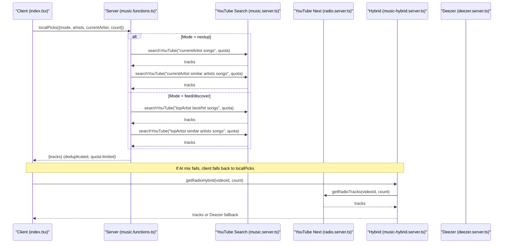
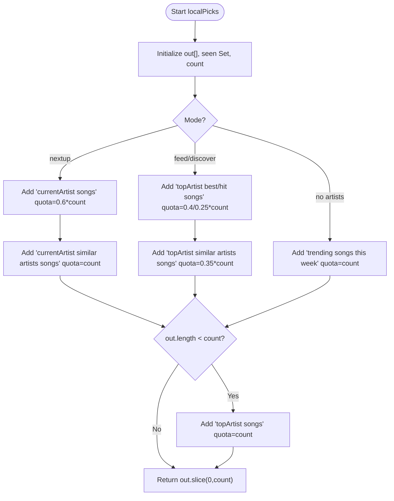
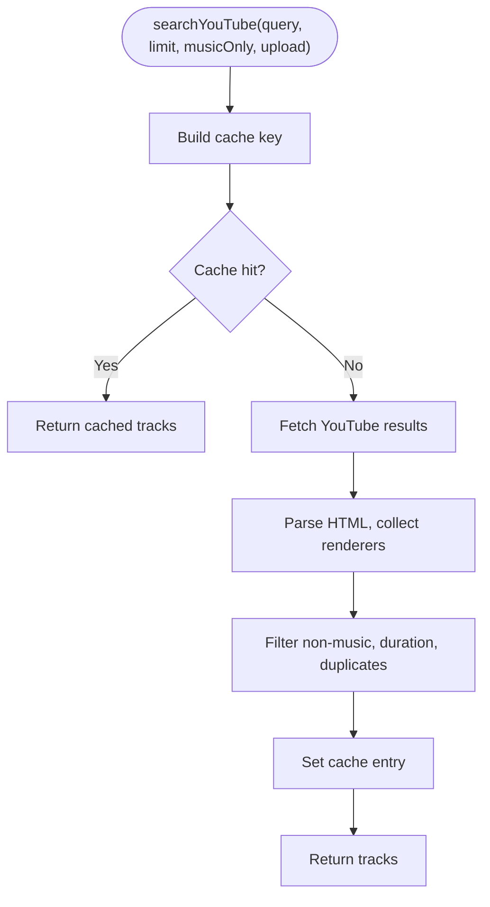
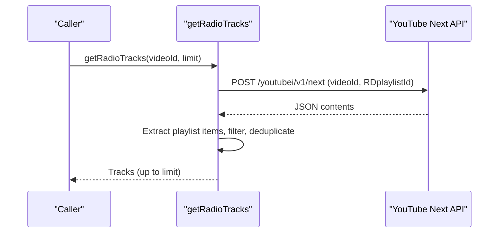
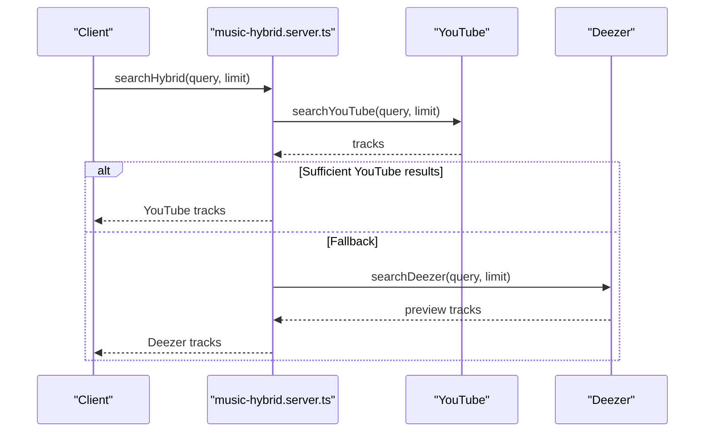
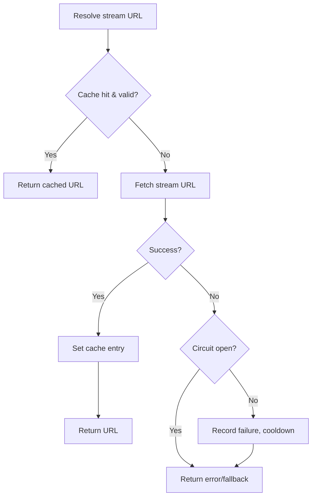
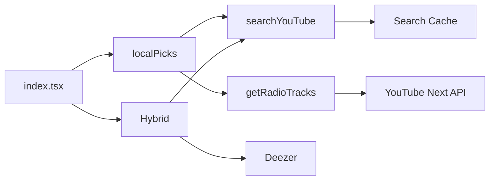

# Local Recommendation Algorithms

<cite>
**Referenced Files in This Document**
- [music.functions.ts](file://src/lib/music.functions.ts)
- [music.server.ts](file://src/lib/music.server.ts)
- [radio.server.ts](file://src/lib/radio.server.ts)
- [music-hybrid.server.ts](file://src/lib/music-hybrid.server.ts)
- [deezer.server.ts](file://src/lib/deezer.server.ts)
- [stream.server.ts](file://src/lib/stream.server.ts)
- [index.tsx](file://src/routes/index.tsx)
</cite>

## Table of Contents
1. [Introduction](#introduction)
2. [Project Structure](#project-structure)
3. [Core Components](#core-components)
4. [Architecture Overview](#architecture-overview)
5. [Detailed Component Analysis](#detailed-component-analysis)
6. [Dependency Analysis](#dependency-analysis)
7. [Performance Considerations](#performance-considerations)
8. [Troubleshooting Guide](#troubleshooting-guide)
9. [Conclusion](#conclusion)

## Introduction
This document explains the local recommendation algorithms that power music suggestions without requiring AI services. The core function, localPicks, mirrors YouTube Music’s recommendation balance using deterministic search strategies when AI is unavailable or disabled. It supports three modes:
- feed: general discovery based on trending and familiar content
- discover: new artist exploration using similar artist queries
- nextup: contextual recommendations based on currently playing content

The system composes diverse recommendation batches by combining artist-specific searches, genre-based exploration, and trending content. It includes deduplication to prevent duplicate tracks and a quota management strategy to optimize API usage. Performance features include caching, parallel request handling, and fallback mechanisms when external services are unavailable or rate limited.

## Project Structure
The local recommendation logic spans server functions and utilities:
- Server functions define the recommendation endpoints and orchestrate queries
- Search and radio utilities fetch results from YouTube and Deezer
- Streaming utilities provide playback with caching and circuit breaking
- The route layer wires UI actions to these server functions

**Diagram sources**
- [music.functions.ts:324-369](file://src/lib/music.functions.ts#L324-L369)
- [music.server.ts:182-247](file://src/lib/music.server.ts#L182-L247)
- [radio.server.ts:25-94](file://src/lib/radio.server.ts#L25-L94)
- [music-hybrid.server.ts:22-78](file://src/lib/music-hybrid.server.ts#L22-L78)
- [stream.server.ts:35-80](file://src/lib/stream.server.ts#L35-L80)

**Section sources**
- [music.functions.ts:324-369](file://src/lib/music.functions.ts#L324-L369)
- [music.server.ts:182-247](file://src/lib/music.server.ts#L182-L247)
- [radio.server.ts:25-94](file://src/lib/radio.server.ts#L25-L94)
- [music-hybrid.server.ts:22-78](file://src/lib/music-hybrid.server.ts#L22-L78)
- [stream.server.ts:35-80](file://src/lib/stream.server.ts#L35-L80)
- [index.tsx:250-323](file://src/routes/index.tsx#L250-L323)

## Core Components
- localPicks: Deterministic, no-AI recommendation engine supporting feed, discover, and nextup modes. It builds query batches, enforces quotas, and deduplicates results.
- searchYouTube: Scrapes YouTube search results with filters for music-only and upload ranges; caches results for 5 minutes.
- getRadioTracks: Uses YouTube’s built-in “RD” playlist endpoint to generate contextual recommendations around a track.
- Hybrid helpers: Provide fallbacks to Deezer previews when YouTube results are restricted or unavailable.
- Stream utilities: Cache stream URLs and implement a circuit breaker to handle failures gracefully.

Key responsibilities:
- Query construction: Compose targeted queries per mode (artist hits, similar artists, trending)
- Quota management: Allocate per-query limits to meet target counts while minimizing requests
- Deduplication: Track seen video IDs to avoid duplicates across batches
- Fallbacks: Gracefully degrade when external services fail or return insufficient results

**Section sources**
- [music.functions.ts:324-369](file://src/lib/music.functions.ts#L324-L369)
- [music.server.ts:52-75](file://src/lib/music.server.ts#L52-L75)
- [music.server.ts:182-247](file://src/lib/music.server.ts#L182-L247)
- [radio.server.ts:25-94](file://src/lib/radio.server.ts#L25-L94)
- [music-hybrid.server.ts:22-78](file://src/lib/music-hybrid.server.ts#L22-L78)
- [stream.server.ts:35-80](file://src/lib/stream.server.ts#L35-L80)

## Architecture Overview
The recommendation pipeline combines deterministic search strategies with robust fallbacks:

**Diagram sources**
- [music.functions.ts:324-369](file://src/lib/music.functions.ts#L324-L369)
- [music.server.ts:182-247](file://src/lib/music.server.ts#L182-L247)
- [radio.server.ts:25-94](file://src/lib/radio.server.ts#L25-L94)
- [music-hybrid.server.ts:54-78](file://src/lib/music-hybrid.server.ts#L54-L78)
- [index.tsx:310-319](file://src/routes/index.tsx#L310-L319)

## Detailed Component Analysis

### localPicks: Deterministic No-AI Recommendations
localPicks orchestrates query batching to mirror YouTube Music’s balance:
- Comfort picks: Hits from top artists the user listens to
- Similar artists: New artists that sound close to favorites
- Trending: For new users or when quotas fall short, trending content fills gaps

Mode behaviors:
- feed: General discovery using comfort and similar artist queries; trending if no artist data
- discover: Emphasizes similar artist exploration to find new artists
- nextup: Contextual recommendations starting from the current artist, then widening

Query construction and quotas:
- Each batch has an allocated quota; the function requests extra results to account for filtering and deduplication
- A shared seen set prevents duplicates across batches
- If quotas produce fewer than the target count, a final top-up query ensures sufficient results

**Diagram sources**
- [music.functions.ts:324-369](file://src/lib/music.functions.ts#L324-L369)

**Section sources**
- [music.functions.ts:324-369](file://src/lib/music.functions.ts#L324-L369)

### searchYouTube: Caching and Filtering
- Adds “audio” to queries to prioritize audio-only content
- Applies music-only filters and optional upload date filters (today/week)
- Parses HTML to extract video renderers, filters non-music titles and durations
- Implements a 5-minute LRU-style cache keyed by query parameters

**Diagram sources**
- [music.server.ts:52-75](file://src/lib/music.server.ts#L52-L75)
- [music.server.ts:182-247](file://src/lib/music.server.ts#L182-L247)

**Section sources**
- [music.server.ts:182-247](file://src/lib/music.server.ts#L182-L247)

### getRadioTracks: Contextual Recommendations via YouTube Next
- Calls YouTube’s Next API with a “RD” playlist ID derived from the current video
- Extracts related tracks from two-column or single-column layouts
- Deduplicates against the current video and skips live streams/shorts

**Diagram sources**
- [radio.server.ts:25-94](file://src/lib/radio.server.ts#L25-L94)

**Section sources**
- [radio.server.ts:25-94](file://src/lib/radio.server.ts#L25-L94)

### Hybrid Helpers: Fallback to Deezer
- searchHybrid tries YouTube first; if insufficient or failed, falls back to Deezer
- getRadioHybrid uses YouTube radio first; if insufficient, falls back to Deezer trending
- Ensures playable content even when YouTube restrictions apply

**Diagram sources**
- [music-hybrid.server.ts:22-49](file://src/lib/music-hybrid.server.ts#L22-L49)
- [music-hybrid.server.ts:54-78](file://src/lib/music-hybrid.server.ts#L54-L78)
- [deezer.server.ts:39-74](file://src/lib/deezer.server.ts#L39-L74)

**Section sources**
- [music-hybrid.server.ts:22-78](file://src/lib/music-hybrid.server.ts#L22-L78)
- [deezer.server.ts:39-74](file://src/lib/deezer.server.ts#L39-L74)

### Stream Utilities: Caching and Circuit Breaking
- In-memory LRU cache for stream URLs with TTL and eviction
- Circuit breaker to reduce load during repeated failures
- Provides direct streaming URLs to avoid ads and support background playback

**Diagram sources**
- [stream.server.ts:35-80](file://src/lib/stream.server.ts#L35-L80)

**Section sources**
- [stream.server.ts:35-80](file://src/lib/stream.server.ts#L35-L80)

## Dependency Analysis
- localPicks depends on searchYouTube for deterministic queries and on getRadioTracks for contextual radio when needed
- searchYouTube relies on YouTube’s public pages and implements caching to reduce load
- getRadioTracks depends on YouTube’s Next API to leverage YouTube’s own recommendation engine
- Hybrid helpers coordinate between YouTube and Deezer to ensure playable results
- The route layer triggers localPicks when AI-powered mixes are unavailable

**Diagram sources**
- [music.functions.ts:324-369](file://src/lib/music.functions.ts#L324-L369)
- [music.server.ts:182-247](file://src/lib/music.server.ts#L182-L247)
- [radio.server.ts:25-94](file://src/lib/radio.server.ts#L25-L94)
- [music-hybrid.server.ts:22-78](file://src/lib/music-hybrid.server.ts#L22-L78)
- [index.tsx:310-319](file://src/routes/index.tsx#L310-L319)

**Section sources**
- [music.functions.ts:324-369](file://src/lib/music.functions.ts#L324-L369)
- [music.server.ts:182-247](file://src/lib/music.server.ts#L182-L247)
- [radio.server.ts:25-94](file://src/lib/radio.server.ts#L25-L94)
- [music-hybrid.server.ts:22-78](file://src/lib/music-hybrid.server.ts#L22-L78)
- [index.tsx:310-319](file://src/routes/index.tsx#L310-L319)

## Performance Considerations
- Caching strategies:
  - Search results cached for 5 minutes with LRU eviction to reduce redundant requests
  - Stream URLs cached with TTL and eviction to minimize repeated resolution calls
- Parallel request handling:
  - Batches of queries executed concurrently where appropriate (e.g., building mixes across multiple artists)
  - Promise.all patterns used to aggregate results efficiently
- Fallback mechanisms:
  - Hybrid search and radio fallback to Deezer when YouTube is restricted or fails
  - Circuit breaker in streaming to avoid hammering failing endpoints
- Quota management:
  - Per-query quotas allocate budget across batches to meet target counts while limiting total requests
  - Extra results requested per query to compensate for filtering and deduplication losses

[No sources needed since this section provides general guidance]

## Troubleshooting Guide
Common issues and mitigations:
- External service unavailability:
  - searchYouTube may fail due to network errors or rate limits; localPicks continues with remaining batches and returns partial results
  - getRadioTracks may return empty lists; hybrid helpers fall back to Deezer trending
- Rate limiting:
  - AI-powered routes return explicit errors for 429 or credit exhaustion; localPicks remains unaffected
  - Stream circuit breaker reduces load during repeated failures
- Deduplication:
  - Duplicate video IDs are filtered at each stage to ensure unique results in final outputs
- Caching staleness:
  - Search cache entries expire after 5 minutes; stale entries are evicted automatically

**Section sources**
- [music.functions.ts:105-111](file://src/lib/music.functions.ts#L105-L111)
- [music-hybrid.server.ts:33-46](file://src/lib/music-hybrid.server.ts#L33-L46)
- [music-hybrid.server.ts:65-76](file://src/lib/music-hybrid.server.ts#L65-L76)
- [stream.server.ts:67-80](file://src/lib/stream.server.ts#L67-L80)

## Conclusion
The local recommendation algorithms provide reliable, deterministic music suggestions without relying on AI services. By combining artist-specific searches, similar artist exploration, and trending content, they deliver a balanced mix akin to YouTube Music. Robust caching, parallel execution, and fallback mechanisms ensure performance and resilience under varying conditions. The modular design allows easy extension and maintenance while keeping the user experience consistent and high-quality.

[No sources needed since this section summarizes without analyzing specific files]