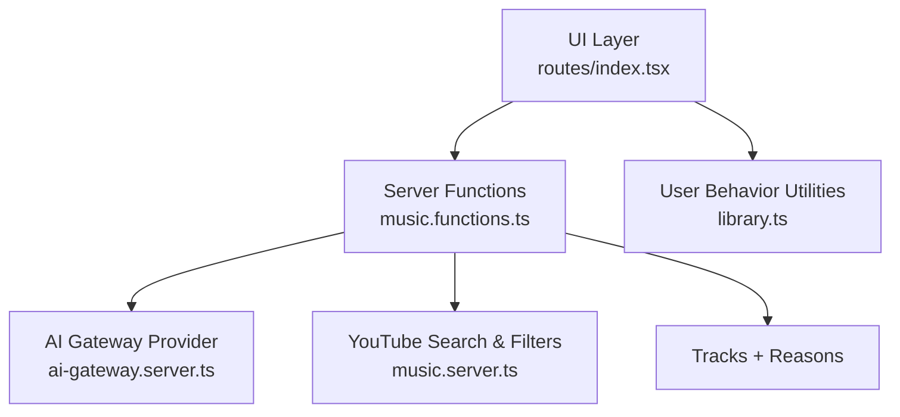
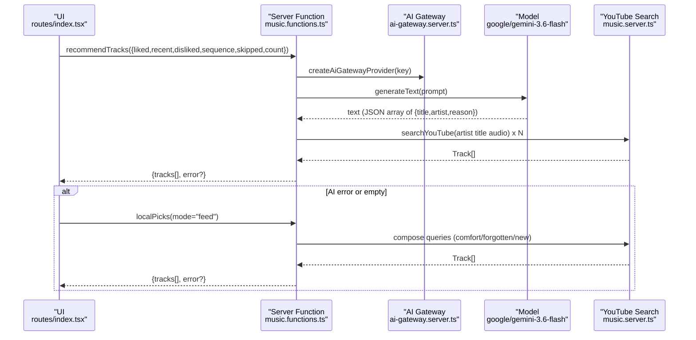
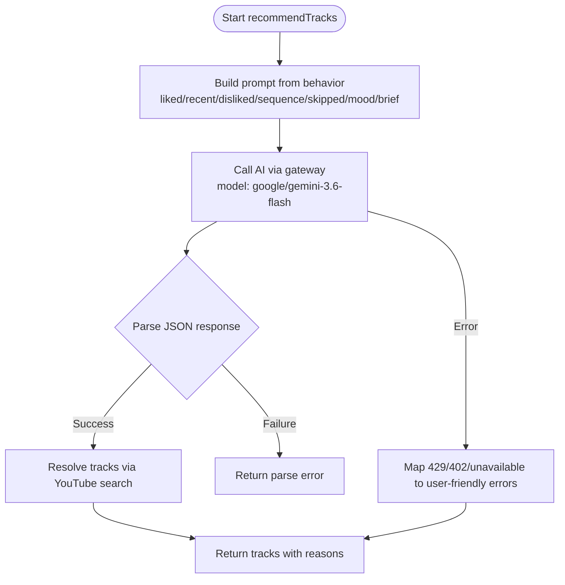
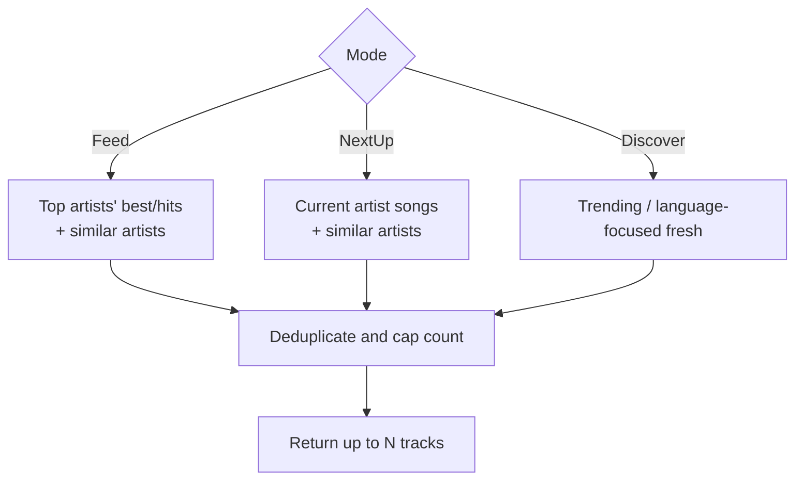
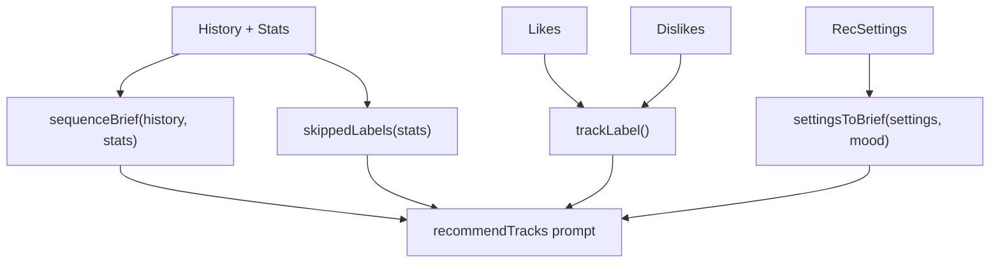
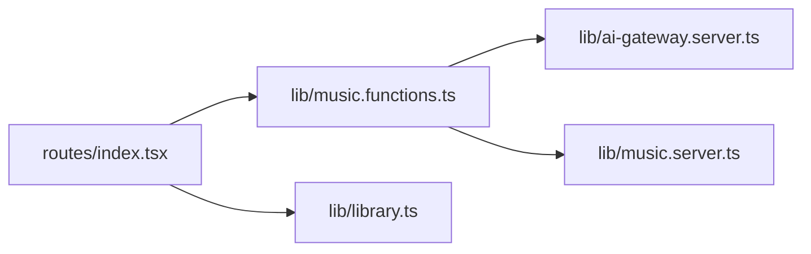

# Recommendation Engine

<cite>
**Referenced Files in This Document**
- [music.functions.ts](file://src/lib/music.functions.ts)
- [ai-gateway.server.ts](file://src/lib/ai-gateway.server.ts)
- [index.tsx](file://src/routes/index.tsx)
- [library.ts](file://src/lib/library.ts)
- [music.server.ts](file://src/lib/music.server.ts)
</cite>

## Table of Contents
1. Introduction
2. Project Structure
3. Core Components
4. Architecture Overview
5. Detailed Component Analysis
6. Dependency Analysis
7. Performance Considerations
8. Troubleshooting Guide
9. Conclusion

## Introduction
This document explains the AI-powered recommendation engine that generates personalized music suggestions. It covers how user behavior data (liked songs, recent plays, skipped tracks, and dislikes) is transformed into a comprehensive taste profile, how prompt engineering maps sonic DNA characteristics to targeted recommendations, and how the system integrates with an OpenAI-compatible AI gateway to call a specific model. It also documents the algorithmic balance between comfort picks, forgotten favorites, and new artist discoveries, along with robust error handling and fallback mechanisms when AI services are unavailable.

## Project Structure
The recommendation engine spans server-side functions, an AI gateway provider, and UI orchestration:
- Server functions implement the core logic for generating recommendations, building mixes, and local fallbacks.
- The AI gateway provider configures an OpenAI-compatible client pointing to a hosted gateway.
- The route orchestrates user interactions, collects behavior signals, calls the AI or local engines, and renders results.

**Diagram sources**
- [music.functions.ts:58-137](file://src/lib/music.functions.ts#L58-L137)
- [ai-gateway.server.ts:1-10](file://src/lib/ai-gateway.server.ts#L1-L10)
- [index.tsx:612-650](file://src/routes/index.tsx#L612-L650)
- [library.ts:559-645](file://src/lib/library.ts#L559-L645)
- [music.server.ts:182-200](file://src/lib/music.server.ts#L182-L200)

**Section sources**
- [music.functions.ts:58-137](file://src/lib/music.functions.ts#L58-L137)
- [ai-gateway.server.ts:1-10](file://src/lib/ai-gateway.server.ts#L1-L10)
- [index.tsx:612-650](file://src/routes/index.tsx#L612-L650)
- [library.ts:559-645](file://src/lib/library.ts#L559-L645)
- [music.server.ts:182-200](file://src/lib/music.server.ts#L182-L200)

## Core Components
- recommendTracks: Builds a behavior-aware prompt from liked/recent/disliked/skipped/session sequences and invokes the AI gateway to return candidate tracks with reasons.
- buildMix: Generates discovery or new-release mixes using AI or direct search strategies.
- localPicks: A deterministic, no-AI fallback that mirrors the same comfort/forgotten/new balance by composing YouTube queries.
- AI gateway provider: Configures an OpenAI-compatible client to a hosted gateway endpoint with API key headers.
- User behavior utilities: Convert raw history and stats into concise prompts and top artists for local picks.

Key responsibilities:
- Transform user signals into structured prompts emphasizing sonic DNA attributes.
- Call the AI model and parse JSON responses into track objects.
- Resolve tracks via YouTube search and attach reasons.
- Provide resilient fallbacks when AI is unavailable.

**Section sources**
- [music.functions.ts:58-137](file://src/lib/music.functions.ts#L58-L137)
- [music.functions.ts:156-245](file://src/lib/music.functions.ts#L156-L245)
- [music.functions.ts:324-369](file://src/lib/music.functions.ts#L324-L369)
- [ai-gateway.server.ts:1-10](file://src/lib/ai-gateway.server.ts#L1-L10)
- [library.ts:559-645](file://src/lib/library.ts#L559-L645)

## Architecture Overview
The end-to-end flow starts at the UI, which gathers user behavior and settings, then calls the server function to generate recommendations. If AI is configured and available, it uses the AI gateway; otherwise, it falls back to a local algorithm.

**Diagram sources**
- [music.functions.ts:58-137](file://src/lib/music.functions.ts#L58-L137)
- [ai-gateway.server.ts:1-10](file://src/lib/ai-gateway.server.ts#L1-L10)
- [index.tsx:612-650](file://src/routes/index.tsx#L612-L650)
- [music.server.ts:182-200](file://src/lib/music.server.ts#L182-L200)

## Detailed Component Analysis

### recommendTracks: Behavior-driven Prompting and AI Integration
- Input validation ensures safe limits on liked, recent, disliked, sequence, and skipped arrays, plus optional mood and brief tuning preferences.
- Prompt construction:
  - Establishes the goal: map sonic DNA (tempo, pitch, instrumentation, vocal texture, energy) and read sequential behavior (play order, replays, skips).
  - Includes loved songs and recently played tracks if present; otherwise defaults to broadly popular selections for new listeners.
  - Appends session sequence showing actions per track (played, replayed, skipped).
  - Adds negative signals: repeatedly skipped tracks and explicitly disliked tracks.
  - Incorporates optional mood and tuning preferences.
  - Requests a balanced batch: roughly 40% comfort picks, 30% older/forgotten favorites, 30% new artists closely matching the sonic profile.
  - Constrains output to a strict JSON array format with title, artist, and reason.
- AI call:
  - Uses an OpenAI-compatible provider configured to a hosted gateway with an API key header.
  - Calls the model google/gemini-3.6-flash with the constructed prompt.
- Response parsing:
  - Extracts a JSON array from the response text.
  - Validates entries require both title and artist.
  - Resolves each candidate via YouTube search and attaches the reason.
- Error handling:
  - Detects rate limiting (HTTP 429), credit exhaustion (HTTP 402 or payment-related messages), and general unavailability.
  - Returns structured errors so the UI can show meaningful messages and trigger fallbacks.

**Diagram sources**
- [music.functions.ts:58-137](file://src/lib/music.functions.ts#L58-L137)
- [ai-gateway.server.ts:1-10](file://src/lib/ai-gateway.server.ts#L1-L10)

**Section sources**
- [music.functions.ts:58-137](file://src/lib/music.functions.ts#L58-L137)

### Prompt Engineering Strategy: Sonic DNA and Behavioral Signals
- Sonic DNA framing: The prompt instructs the model to consider tempo, pitch feel, instrumentation, vocal texture, and overall energy to match the listener’s taste.
- Behavioral sequencing: The prompt includes ordered session data indicating what the user played, replayed, or skipped, enabling temporal context beyond static likes.
- Negative constraints: Explicitly lists repeatedly skipped and disliked tracks to steer away from similar sounds.
- Tuning preferences: Optional mood and brief settings refine the style and energy targets.
- Output contract: Strict JSON schema ensures reliable parsing downstream.

**Section sources**
- [music.functions.ts:68-92](file://src/lib/music.functions.ts#L68-L92)

### AI Gateway Provider: OpenAI-Compatible Integration
- Creates an OpenAI-compatible provider targeting a hosted gateway URL.
- Injects the API key via a custom header for authentication.
- Enables consistent model invocation through the AI SDK without coupling to a single vendor implementation.

**Section sources**
- [ai-gateway.server.ts:1-10](file://src/lib/ai-gateway.server.ts#L1-L10)

### Model Selection and Response Parsing
- Model selection: The code explicitly selects google/gemini-3.6-flash via the gateway provider.
- Response parsing:
  - Extracts the first JSON array found in the response text.
  - Parses into an array of objects with title, artist, and optional reason.
  - Filters invalid entries and resolves them to playable tracks via YouTube search.

**Section sources**
- [music.functions.ts:97-137](file://src/lib/music.functions.ts#L97-L137)

### Recommendation Algorithm: Balancing Comfort, Forgotten Favorites, and New Discoveries
- AI path: The prompt requests a rough split of 40% comfort picks, 30% older/forgotten favorites, and 30% new artists that sound strikingly close to the listener’s sonic profile.
- Local fallback path: When AI is unavailable, localPicks composes YouTube queries to mirror this balance:
  - Comfort picks: best/hit songs from top artists.
  - Similar artists: queries for “similar artists” to broaden discovery.
  - Brand-new listeners: trending songs across genres.
  - Up Next mode: prioritizes current artist and similar artists.

**Diagram sources**
- [music.functions.ts:324-369](file://src/lib/music.functions.ts#L324-L369)

**Section sources**
- [music.functions.ts:324-369](file://src/lib/music.functions.ts#L324-L369)

### User Behavior Data Pipeline
- Liked songs: Truncated to a fixed limit and converted to label strings for inclusion in the prompt.
- Recent plays: Truncated and included to reflect immediate taste.
- Dislikes: Truncated and used as strong negative signals.
- Session sequence: Built from history and stats to show play order and actions (played, replayed, skipped).
- Skipped tracks: Computed from repeated skips exceeding completions to avoid similar sounds.
- Settings brief: Converts moods and tuning preferences into a concise natural-language summary for the AI.

**Diagram sources**
- [library.ts:559-645](file://src/lib/library.ts#L559-L645)
- [music.functions.ts:68-92](file://src/lib/music.functions.ts#L68-L92)

**Section sources**
- [library.ts:559-645](file://src/lib/library.ts#L559-L645)
- [music.functions.ts:68-92](file://src/lib/music.functions.ts#L68-L92)

### Fallback Mechanism and Local Picks Alternative
- When AI is not configured or returns an error/empty result, the UI triggers the local fallback with mode “feed”.
- localPicks composes deterministic queries to approximate the same balance without AI:
  - Comfort: top artists’ best/hits.
  - Discovery: similar artists to top picks.
  - New listeners: trending songs.
  - Up Next: current artist and similar artists.
- Deduplication and quota management ensure a clean, capped result set.

**Section sources**
- [index.tsx:633-650](file://src/routes/index.tsx#L633-L650)
- [music.functions.ts:324-369](file://src/lib/music.functions.ts#L324-L369)

### Error Handling: Rate Limits, Credits, and Service Unavailability
- Rate limits: Errors containing HTTP 429 are mapped to a friendly message prompting retry shortly.
- Credit exhaustion: Errors containing HTTP 402 or payment-related keywords return a message prompting adding credits.
- Service unavailability: Other errors return a generic unavailability message.
- UI integration: On any error or empty result, the UI switches to the local fallback and surfaces the error message if present.

**Section sources**
- [music.functions.ts:97-137](file://src/lib/music.functions.ts#L97-L137)
- [index.tsx:633-650](file://src/routes/index.tsx#L633-L650)

## Dependency Analysis
- recommendTracks depends on:
  - AI SDK generateText for model calls.
  - ai-gateway.server.ts for provider configuration.
  - music.server.ts for YouTube search and filtering.
  - library.ts for behavior signal preparation.
- UI depends on:
  - Server functions for recommendations and local picks.
  - Behavior utilities to assemble inputs.

**Diagram sources**
- [index.tsx:612-650](file://src/routes/index.tsx#L612-L650)
- [music.functions.ts:58-137](file://src/lib/music.functions.ts#L58-L137)
- [ai-gateway.server.ts:1-10](file://src/lib/ai-gateway.server.ts#L1-L10)
- [music.server.ts:182-200](file://src/lib/music.server.ts#L182-L200)
- [library.ts:559-645](file://src/lib/library.ts#L559-L645)

**Section sources**
- [index.tsx:612-650](file://src/routes/index.tsx#L612-L650)
- [music.functions.ts:58-137](file://src/lib/music.functions.ts#L58-L137)
- [ai-gateway.server.ts:1-10](file://src/lib/ai-gateway.server.ts#L1-L10)
- [music.server.ts:182-200](file://src/lib/music.server.ts#L182-L200)
- [library.ts:559-645](file://src/lib/library.ts#L559-L645)

## Performance Considerations
- Prompt size control: Inputs are truncated to reasonable limits to reduce token usage and latency.
- Parallel resolution: Candidate tracks are resolved concurrently via Promise.all to minimize total time.
- YouTube search caching: Results are cached with TTL to reduce redundant network calls.
- Query composition: LocalPicks uses targeted queries to minimize extraneous results and deduplicates efficiently.
- Error short-circuiting: Early detection of rate limits and credit issues avoids unnecessary retries.

[No sources needed since this section provides general guidance]

## Troubleshooting Guide
- No AI key configured: The server returns a clear message indicating AI is not configured; the UI will fall back to local picks automatically.
- Too many requests: A 429-like error yields a retry-after hint; users should wait briefly before refreshing.
- Credits exhausted: Payment-related errors prompt adding credits; the UI shows a helpful message.
- Recommendations unavailable: Generic service errors are surfaced; the UI still provides local picks.
- Empty results: If AI returns no valid tracks, the UI triggers the local fallback to ensure continuous playback.

**Section sources**
- [music.functions.ts:97-137](file://src/lib/music.functions.ts#L97-L137)
- [index.tsx:633-650](file://src/routes/index.tsx#L633-L650)

## Conclusion
The recommendation engine combines rich behavioral signals with prompt engineering focused on sonic DNA to deliver highly personalized music suggestions. It integrates seamlessly with an OpenAI-compatible AI gateway, selecting a specific model and parsing structured responses for reliable downstream processing. When AI is unavailable, a deterministic local algorithm preserves the intended balance of comfort, nostalgia, and discovery. Robust error handling ensures graceful degradation and clear user feedback throughout the experience.