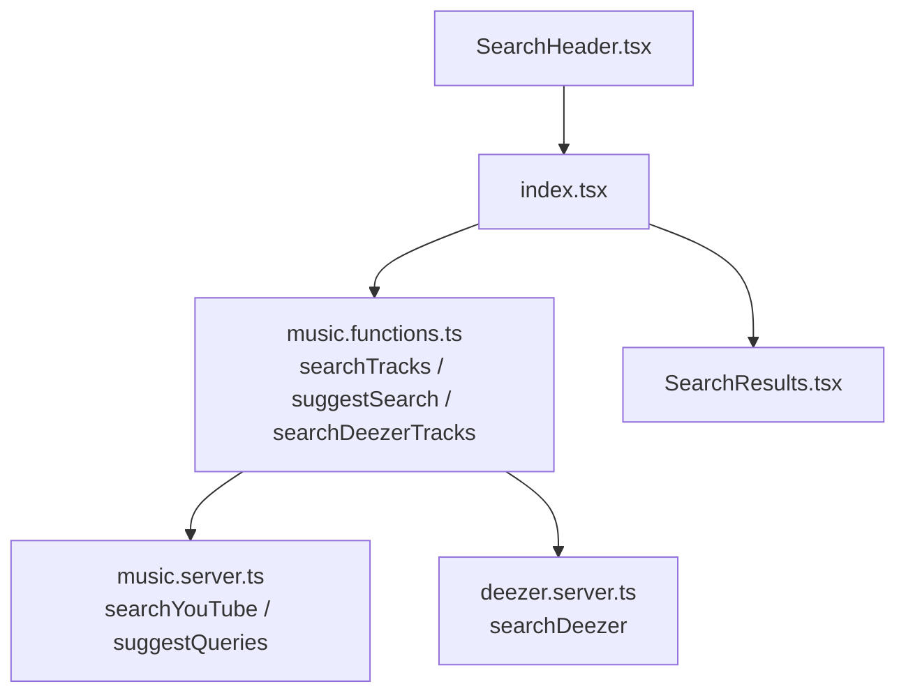
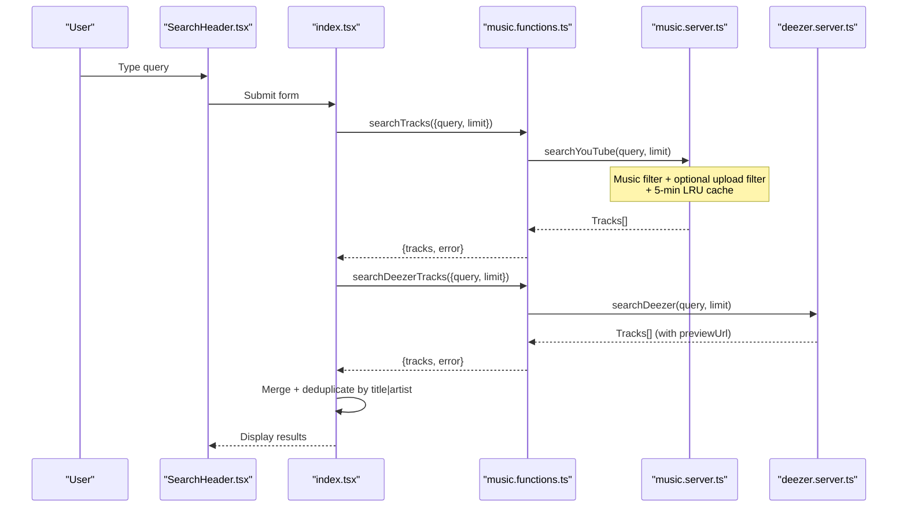
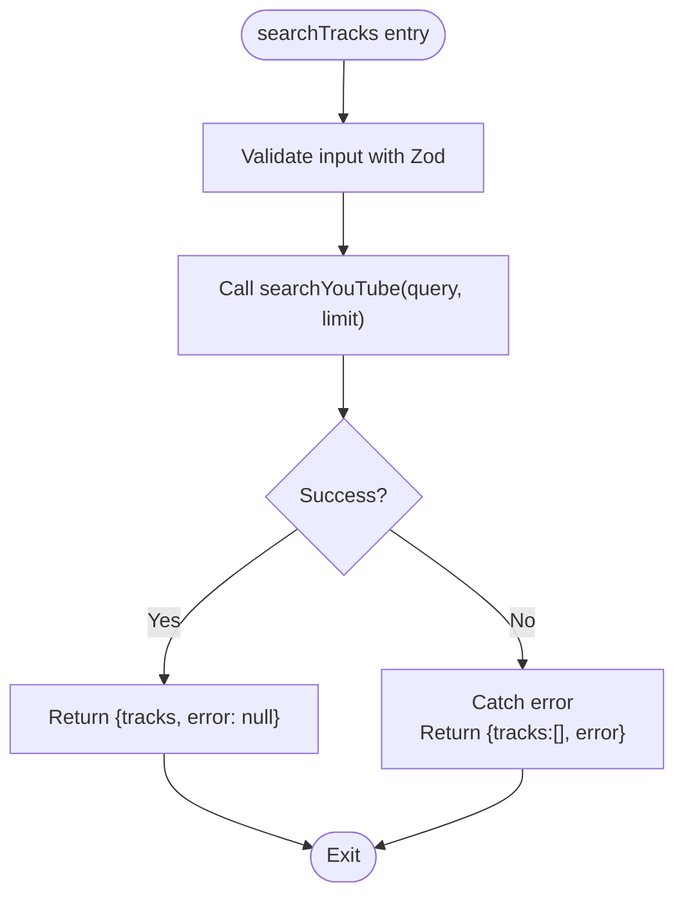
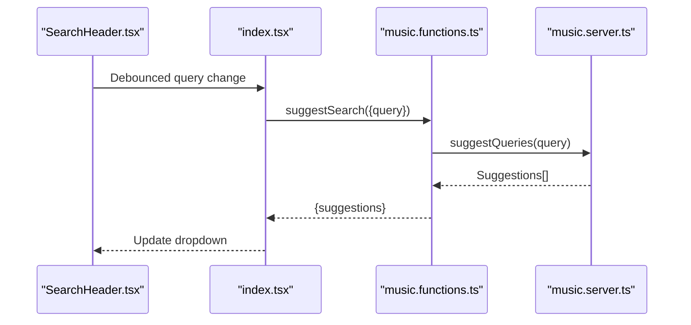
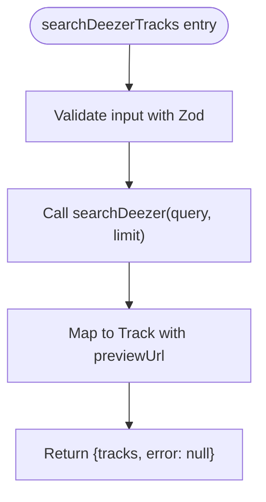
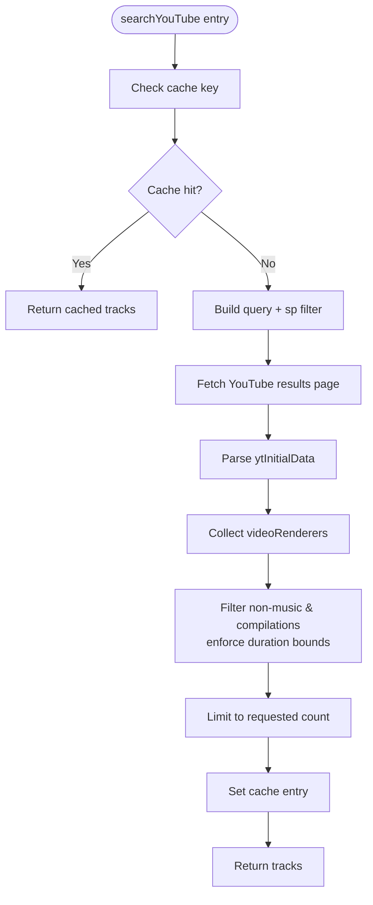
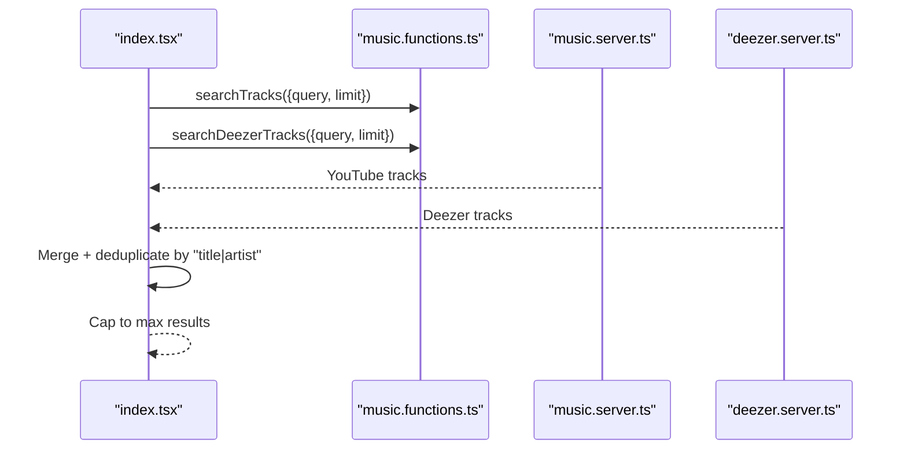
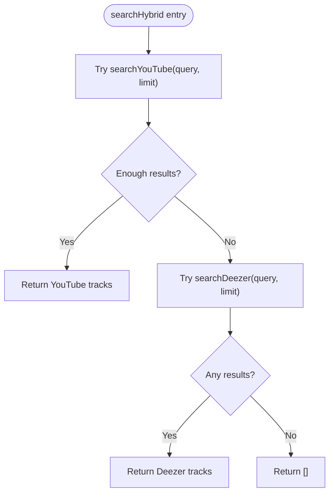
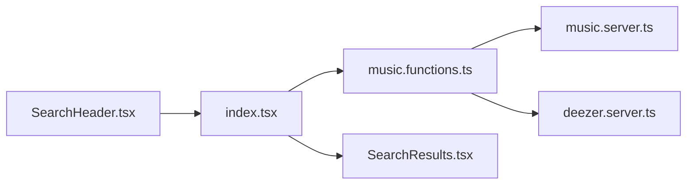

# Search Functionality

<cite>
**Referenced Files in This Document**
- [music.functions.ts](file://src/lib/music.functions.ts)
- [music.server.ts](file://src/lib/music.server.ts)
- [deezer.server.ts](file://src/lib/deezer.server.ts)
- [music-hybrid.server.ts](file://src/lib/music-hybrid.server.ts)
- [index.tsx](file://src/routes/index.tsx)
- [SearchHeader.tsx](file://src/components/music/layout/SearchHeader.tsx)
- [SearchResults.tsx](file://src/components/music/ui/SearchResults.tsx)
</cite>

## Table of Contents
1. [Introduction](#introduction)
2. [Project Structure](#project-structure)
3. [Core Components](#core-components)
4. [Architecture Overview](#architecture-overview)
5. [Detailed Component Analysis](#detailed-component-analysis)
6. [Dependency Analysis](#dependency-analysis)
7. [Performance Considerations](#performance-considerations)
8. [Troubleshooting Guide](#troubleshooting-guide)
9. [Conclusion](#conclusion)

## Introduction
This document explains the search functionality that powers music discovery across multiple sources. It covers how user queries are validated, processed, and executed against YouTube and Deezer, including autocomplete suggestions, result filtering, pagination handling, error handling patterns, rate limiting strategies, response caching, and performance best practices for large-scale search operations.

## Project Structure
The search feature spans server functions, data providers, and UI components:
- Server functions define typed endpoints with input validation and orchestrate searches.
- Providers implement source-specific logic (YouTube scraping, Deezer API).
- The main route composes parallel searches and merges results for display.
- UI components render the search bar, suggestions, and results.

**Diagram sources**
- [SearchHeader.tsx:68-152](file://src/components/music/layout/SearchHeader.tsx#L68-L152)
- [index.tsx:760-814](file://src/routes/index.tsx#L760-L814)
- [music.functions.ts:8-44](file://src/lib/music.functions.ts#L8-L44)
- [music.server.ts:164-247](file://src/lib/music.server.ts#L164-L247)
- [deezer.server.ts:39-74](file://src/lib/deezer.server.ts#L39-L74)
- [SearchResults.tsx:31-72](file://src/components/music/ui/SearchResults.tsx#L31-L72)

**Section sources**
- [music.functions.ts:8-44](file://src/lib/music.functions.ts#L8-L44)
- [music.server.ts:164-247](file://src/lib/music.server.ts#L164-L247)
- [deezer.server.ts:39-74](file://src/lib/deezer.server.ts#L39-L74)
- [index.tsx:760-814](file://src/routes/index.tsx#L760-L814)
- [SearchHeader.tsx:68-152](file://src/components/music/layout/SearchHeader.tsx#L68-L152)
- [SearchResults.tsx:31-72](file://src/components/music/ui/SearchResults.tsx#L31-L72)

## Core Components
- searchTracks: Validates input via Zod, calls YouTube search, returns tracks or an error message.
- suggestSearch: Validates a short query, fetches YouTube autocomplete suggestions.
- searchDeezerTracks: Validates input, calls Deezer free API to return tracks with playable preview URLs.
- searchYouTube: Scrapes YouTube results with music-only filters, upload-date filters, and in-memory LRU cache.
- searchDeezer: Calls Deezer search endpoint, maps results to a unified Track type with previewUrl.
- Route integration: Executes YouTube and Deezer searches in parallel, merges and deduplicates results, caps at a maximum.

Key responsibilities:
- Input validation using Zod schemas ensures safe, consistent payloads.
- Source-specific implementations abstract differences between YouTube and Deezer.
- Parallel execution reduces latency and improves coverage.
- Deduplication prevents duplicate titles/artists from different sources.

**Section sources**
- [music.functions.ts:8-44](file://src/lib/music.functions.ts#L8-L44)
- [music.server.ts:164-247](file://src/lib/music.server.ts#L164-L247)
- [deezer.server.ts:39-74](file://src/lib/deezer.server.ts#L39-L74)
- [index.tsx:760-814](file://src/routes/index.tsx#L760-L814)

## Architecture Overview
The search pipeline consists of:
- Client-side input and suggestion UI.
- Server function layer with strict schema validation.
- Provider layer for YouTube and Deezer.
- Merge and presentation layer in the route.

**Diagram sources**
- [index.tsx:760-814](file://src/routes/index.tsx#L760-L814)
- [music.functions.ts:8-44](file://src/lib/music.functions.ts#L8-L44)
- [music.server.ts:182-247](file://src/lib/music.server.ts#L182-L247)
- [deezer.server.ts:39-74](file://src/lib/deezer.server.ts#L39-L74)

## Detailed Component Analysis

### searchTracks
- Purpose: Search YouTube for tracks based on a validated query.
- Validation: Uses a Zod schema requiring a non-empty string query and an optional numeric limit.
- Execution: Dynamically imports YouTube search to avoid cold-start overhead; returns tracks or a user-friendly error.
- Error handling: Catches network or parsing errors and returns an empty array with an error message.

**Diagram sources**
- [music.functions.ts:8-21](file://src/lib/music.functions.ts#L8-L21)

**Section sources**
- [music.functions.ts:8-21](file://src/lib/music.functions.ts#L8-L21)

### suggestSearch
- Purpose: Provide autocomplete suggestions based on partial queries.
- Validation: Requires a non-empty string up to a max length.
- Execution: Calls YouTube’s suggest service; parses JSONP-like payload safely.
- Error handling: Returns an empty suggestions array on failure.

**Diagram sources**
- [SearchHeader.tsx:68-152](file://src/components/music/layout/SearchHeader.tsx#L68-L152)
- [index.tsx:792-809](file://src/routes/index.tsx#L792-L809)
- [music.functions.ts:23-32](file://src/lib/music.functions.ts#L23-L32)
- [music.server.ts:164-180](file://src/lib/music.server.ts#L164-L180)

**Section sources**
- [music.functions.ts:23-32](file://src/lib/music.functions.ts#L23-L32)
- [music.server.ts:164-180](file://src/lib/music.server.ts#L164-L180)
- [index.tsx:792-809](file://src/routes/index.tsx#L792-L809)
- [SearchHeader.tsx:68-152](file://src/components/music/layout/SearchHeader.tsx#L68-L152)

### searchDeezerTracks
- Purpose: Integrate with Deezer’s free API to provide additional track results with playable preview URLs.
- Validation: Reuses the same input schema as searchTracks.
- Execution: Calls searchDeezer with query and limit; returns tracks or an empty array on failure.
- Output: Each track includes a direct preview URL suitable for playback without ads.

**Diagram sources**
- [music.functions.ts:34-44](file://src/lib/music.functions.ts#L34-L44)
- [deezer.server.ts:39-74](file://src/lib/deezer.server.ts#L39-L74)

**Section sources**
- [music.functions.ts:34-44](file://src/lib/music.functions.ts#L34-L44)
- [deezer.server.ts:39-74](file://src/lib/deezer.server.ts#L39-L74)

### searchYouTube
- Purpose: Scrape YouTube search results with music-only filtering and optional upload-date constraints.
- Query normalization: Appends “audio” when musicOnly is true to prioritize audio content.
- Filtering: Excludes non-music and compilation-type videos; enforces typical song duration bounds.
- Pagination: Respects the requested limit; stops once enough tracks are collected.
- Caching: Implements an in-memory LRU-style cache with a 5-minute TTL and size cap.

**Diagram sources**
- [music.server.ts:182-247](file://src/lib/music.server.ts#L182-L247)
- [music.server.ts:52-75](file://src/lib/music.server.ts#L52-L75)

**Section sources**
- [music.server.ts:52-75](file://src/lib/music.server.ts#L52-L75)
- [music.server.ts:182-247](file://src/lib/music.server.ts#L182-L247)

### Route Integration and Result Merging
- Parallel execution: Executes both YouTube and Deezer searches concurrently to minimize latency.
- Deduplication: Merges results while avoiding duplicates by normalizing title and artist keys.
- Cap: Limits total displayed results to a reasonable number for performance and UX.

**Diagram sources**
- [index.tsx:760-814](file://src/routes/index.tsx#L760-L814)

**Section sources**
- [index.tsx:760-814](file://src/routes/index.tsx#L760-L814)

### Hybrid Search (Optional Enhancement)
- Strategy: Try YouTube first; if insufficient results or failure, fall back to Deezer.
- Utility: Provides helper functions to identify Deezer tracks and resolve stream URLs.

**Diagram sources**
- [music-hybrid.server.ts:22-49](file://src/lib/music-hybrid.server.ts#L22-L49)

**Section sources**
- [music-hybrid.server.ts:22-49](file://src/lib/music-hybrid.server.ts#L22-L49)

## Dependency Analysis
- Server functions depend on provider modules via dynamic imports to reduce startup cost and isolate failures.
- UI depends on server functions through React hooks and event handlers.
- Providers encapsulate external service interactions and normalize outputs to a common Track type.

**Diagram sources**
- [SearchHeader.tsx:68-152](file://src/components/music/layout/SearchHeader.tsx#L68-L152)
- [index.tsx:760-814](file://src/routes/index.tsx#L760-L814)
- [music.functions.ts:8-44](file://src/lib/music.functions.ts#L8-L44)
- [music.server.ts:182-247](file://src/lib/music.server.ts#L182-L247)
- [deezer.server.ts:39-74](file://src/lib/deezer.server.ts#L39-L74)
- [SearchResults.tsx:31-72](file://src/components/music/ui/SearchResults.tsx#L31-L72)

**Section sources**
- [music.functions.ts:8-44](file://src/lib/music.functions.ts#L8-L44)
- [music.server.ts:182-247](file://src/lib/music.server.ts#L182-L247)
- [deezer.server.ts:39-74](file://src/lib/deezer.server.ts#L39-L74)
- [index.tsx:760-814](file://src/routes/index.tsx#L760-L814)

## Performance Considerations
- Parallel execution: Running YouTube and Deezer searches concurrently reduces overall latency and increases result diversity.
- In-memory caching: A 5-minute TTL LRU cache for YouTube search results avoids repeated network requests for identical queries.
- Request timeouts: Both YouTube and Deezer calls use timeouts to prevent hanging requests under poor network conditions.
- Result limits: Enforcing per-source limits and a final cap prevents excessive memory usage and rendering costs.
- Dynamic imports: Server functions dynamically import heavy modules to minimize cold start times.
- Deduplication: Normalized keys prevent redundant entries and reduce UI workload.

[No sources needed since this section provides general guidance]

## Troubleshooting Guide
Common issues and mitigations:
- Network failures: Both YouTube and Deezer calls catch exceptions and return empty arrays or user-friendly messages.
- Rate limiting: External services may throttle requests; timeouts and retries (if implemented) help mitigate transient errors.
- Parsing errors: Robust JSON parsing and fallbacks ensure graceful degradation when upstream formats change.
- Empty results: If one source fails, the other can still provide results; merging ensures continuity.

Operational tips:
- Monitor error logs for recurring failures.
- Adjust limits and timeouts based on observed latency and error rates.
- Consider adding exponential backoff for retryable errors.

**Section sources**
- [music.functions.ts:8-44](file://src/lib/music.functions.ts#L8-L44)
- [music.server.ts:164-180](file://src/lib/music.server.ts#L164-L180)
- [deezer.server.ts:39-74](file://src/lib/deezer.server.ts#L39-L74)

## Conclusion
The search functionality combines robust input validation, efficient parallel execution, and resilient error handling to deliver reliable music discovery across YouTube and Deezer. Caching, timeouts, and result limits optimize performance for large-scale operations, while the modular design allows easy extension to additional sources. The UI integrates seamlessly with server functions to provide a responsive and user-friendly search experience.

[No sources needed since this section summarizes without analyzing specific files]