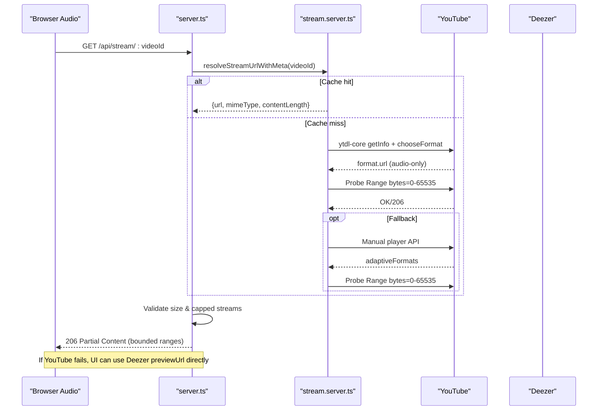
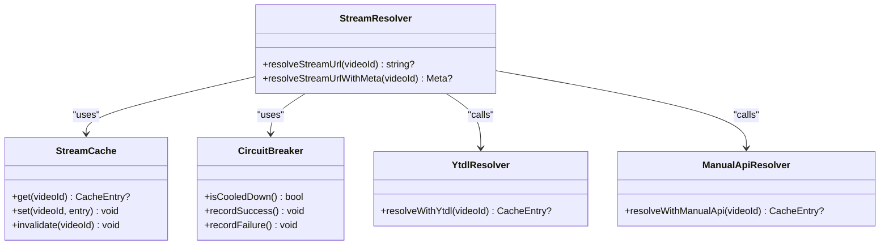
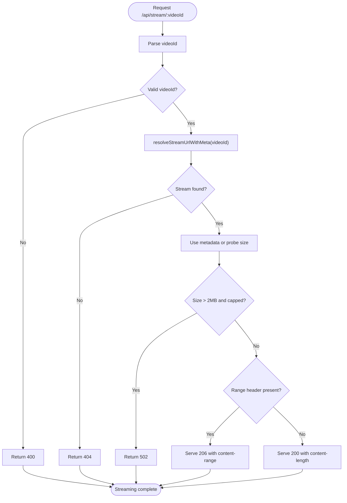
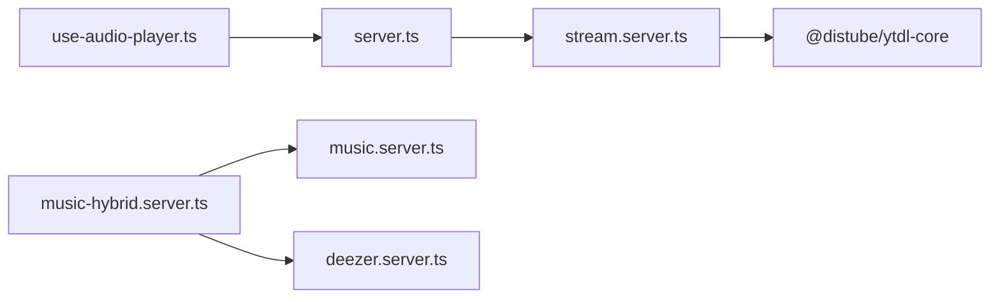

# Streaming Integration

<cite>
**Referenced Files in This Document**
- [stream.server.ts](file://src/lib/stream.server.ts)
- [server.ts](file://src/server.ts)
- [music-hybrid.server.ts](file://src/lib/music-hybrid.server.ts)
- [music.server.ts](file://src/lib/music.server.ts)
- [deezer.server.ts](file://src/lib/deezer.server.ts)
- [use-audio-player.ts](file://src/lib/use-audio-player.ts)
- [error-capture.ts](file://src/lib/error-capture.ts)
- [package.json](file://package.json)
</cite>

## Table of Contents
1. [Introduction](#introduction)
2. [Project Structure](#project-structure)
3. [Core Components](#core-components)
4. [Architecture Overview](#architecture-overview)
5. [Detailed Component Analysis](#detailed-component-analysis)
6. [Dependency Analysis](#dependency-analysis)
7. [Performance Considerations](#performance-considerations)
8. [Troubleshooting Guide](#troubleshooting-guide)
9. [Conclusion](#conclusion)

## Introduction
This document explains the streaming integration that enables seamless, ad-free audio playback across platforms by resolving direct audio URLs from video IDs and serving them through a same-origin proxy. The system resolves YouTube stream URLs server-side, caches results, probes for validity, and streams bounded byte ranges to bypass browser CORS restrictions and platform throttling. It also integrates with Deezer previews as a fallback to ensure playable content when YouTube is restricted or unavailable.

Key outcomes:
- Background playback and seeking via HTML5 Audio using direct audio streams.
- Ad-free listening by bypassing embedded player constraints.
- Robust error handling, circuit breaking, and cache invalidation.
- A hybrid search strategy (YouTube primary, Deezer fallback) to maximize availability.

## Project Structure
The streaming feature spans several modules:
- Stream URL resolution and caching live in a server module.
- A server entrypoint that intercepts /api/stream requests and proxies bytes with range support.
- Client hooks that drive HTML5 Audio against the proxy.
- Hybrid search utilities that combine YouTube and Deezer sources.

```mermaid
graph TB
subgraph "Client"
UI["Audio Player Hook<br/>use-audio-player.ts"]
end
subgraph "Server"
Proxy["Stream Proxy<br/>server.ts"]
Resolver["Stream Resolver<br/>stream.server.ts"]
SearchHybrid["Hybrid Search<br/>music-hybrid.server.ts"]
YTSearch["YouTube Search<br/>music.server.ts"]
Deezer["Deezer API<br/>deezer.server.ts"]
end
subgraph "External"
YT["YouTube Streams"]
DZ["Deezer API"]
end
UI --> |GET /api/stream/:videoId| Proxy
Proxy --> |resolveStreamUrlWithMeta(videoId)| Resolver
Resolver --> |ytdl-core + manual API| YT
SearchHybrid --> YTSearch
SearchHybrid --> Deezer
UI --> |Direct previewUrl| DZ
```

**Diagram sources**
- [server.ts:119-202](file://src/server.ts#L119-L202)
- [stream.server.ts:301-387](file://src/lib/stream.server.ts#L301-L387)
- [music-hybrid.server.ts:22-98](file://src/lib/music-hybrid.server.ts#L22-L98)
- [music.server.ts:182-247](file://src/lib/music.server.ts#L182-L247)
- [deezer.server.ts:39-74](file://src/lib/deezer.server.ts#L39-L74)
- [use-audio-player.ts:16-156](file://src/lib/use-audio-player.ts#L16-L156)

**Section sources**
- [server.ts:119-202](file://src/server.ts#L119-L202)
- [stream.server.ts:22-108](file://src/lib/stream.server.ts#L22-L108)
- [music-hybrid.server.ts:22-98](file://src/lib/music-hybrid.server.ts#L22-L98)
- [use-audio-player.ts:16-156](file://src/lib/use-audio-player.ts#L16-L156)

## Core Components
- Stream URL resolver: Resolves direct audio URLs for a given video ID using ytdl-core with a manual API fallback. Includes LRU cache with TTL, probe verification, and circuit breaker.
- Stream proxy: Same-origin HTTP proxy that serves bounded byte ranges, handles CORS, and enforces size checks to avoid truncated downloads.
- Audio player hook: HTML5 Audio wrapper that plays via the proxy or direct preview URLs, supports offline playback, and manages lifecycle events.
- Hybrid search: Combines YouTube search with Deezer previews to always return playable tracks.

**Section sources**
- [stream.server.ts:301-387](file://src/lib/stream.server.ts#L301-L387)
- [server.ts:119-202](file://src/server.ts#L119-L202)
- [use-audio-player.ts:16-156](file://src/lib/use-audio-player.ts#L16-L156)
- [music-hybrid.server.ts:22-98](file://src/lib/music-hybrid.server.ts#L22-L98)

## Architecture Overview
The streaming pipeline ensures reliable playback by resolving and validating stream URLs on the server, then streaming data in small, bounded chunks to the client.



**Diagram sources**
- [server.ts:119-202](file://src/server.ts#L119-L202)
- [stream.server.ts:98-174](file://src/lib/stream.server.ts#L98-L174)
- [stream.server.ts:215-289](file://src/lib/stream.server.ts#L215-L289)
- [stream.server.ts:301-387](file://src/lib/stream.server.ts#L301-L387)
- [music-hybrid.server.ts:92-98](file://src/lib/music-hybrid.server.ts#L92-L98)

## Detailed Component Analysis

### Stream URL Resolution (stream.server.ts)
Responsibilities:
- Resolve direct audio URLs for a video ID using ytdl-core with multiple player clients.
- Validate playability and pick best audio-only format.
- Probe resolved URLs to ensure they stream before caching.
- Maintain an LRU cache with 25-minute TTL and max entries.
- Implement a circuit breaker to back off after consecutive failures.
- Provide metadata-aware resolution for the proxy to skip HEAD probes.

Key behaviors:
- Primary path: ytdl-core getInfo with IOS/ANDROID/WEB clients; chooseFormat(audioonly, highestaudio).
- Fallback path: manual YouTube player API calls with Android/iOS contexts; prefer itag 140 (m4a), then 139.
- Probe: Range bytes=0-65535 with timeout to verify streaming capability.
- Cache: LRU eviction and TTL-based expiration; invalidate on mid-stream 403.
- Circuit breaker: After N consecutive failures, cooldown prevents further attempts for a period.

Error handling:
- Logs warnings/errors for non-playable videos, missing formats, and failed probes.
- Returns null if all strategies fail; caller should treat as unavailable.

Performance considerations:
- Cache avoids repeated network calls.
- Probing reduces wasted playback attempts.
- Circuit breaker protects against cascading failures.

**Section sources**
- [stream.server.ts:22-108](file://src/lib/stream.server.ts#L22-L108)
- [stream.server.ts:112-174](file://src/lib/stream.server.ts#L112-L174)
- [stream.server.ts:176-289](file://src/lib/stream.server.ts#L176-L289)
- [stream.server.ts:291-387](file://src/lib/stream.server.ts#L291-L387)

#### Class-like structure of stream resolver


**Diagram sources**
- [stream.server.ts:22-108](file://src/lib/stream.server.ts#L22-L108)
- [stream.server.ts:112-174](file://src/lib/stream.server.ts#L112-L174)
- [stream.server.ts:215-289](file://src/lib/stream.server.ts#L215-L289)
- [stream.server.ts:301-387](file://src/lib/stream.server.ts#L301-L387)

### Stream Proxy (server.ts)
Responsibilities:
- Intercept /api/stream/:videoId requests.
- Resolve stream URL with metadata via the resolver.
- Validate total size and detect capped streams to prevent truncated downloads.
- Serve bounded byte ranges (1 MiB chunks) to handle throttled/expired URLs.
- Set proper headers (content-type, accept-ranges, content-range, content-length).
- Invalidate cached URLs on upstream 403 responses during chunked streaming.

Error handling:
- Returns 400 for missing video id, 404 if stream not found, 502 for unavailable/capped streams, 416 for invalid ranges.
- On chunk 403, invalidates cache and aborts streaming to force refresh.

Performance considerations:
- Uses metadata from resolver to avoid extra HEAD probe when available.
- Streams in bounded chunks to comply with upstream limits and improve resilience.

**Section sources**
- [server.ts:48-117](file://src/server.ts#L48-L117)
- [server.ts:119-202](file://src/server.ts#L119-L202)

#### Proxy flowchart


**Diagram sources**
- [server.ts:119-202](file://src/server.ts#L119-L202)

### Audio Player Hook (use-audio-player.ts)
Responsibilities:
- Manage HTML5 Audio element lifecycle and events.
- Load tracks via the proxy (/api/stream/:id) or direct previewUrl (Deezer).
- Support offline playback using cached blobs.
- Handle autoplay policies and user gestures gracefully.

Integration points:
- Builds stream URL as /api/stream/:id.
- Prefers offline blob if available; otherwise uses proxy or direct URL.
- Emits errors and updates UI state accordingly.

**Section sources**
- [use-audio-player.ts:16-156](file://src/lib/use-audio-player.ts#L16-L156)

### Hybrid Search and Track Routing (music-hybrid.server.ts, music.server.ts, deezer.server.ts)
Responsibilities:
- Search YouTube first; if insufficient results or failure, fall back to Deezer.
- For Deezer tracks, provide direct previewUrl to bypass the proxy.
- Normalize track objects with source and optional previewUrl.

Routing logic:
- getTrackStreamUrl returns Deezer previewUrl when present; otherwise returns /api/stream/:id.

**Section sources**
- [music-hybrid.server.ts:22-98](file://src/lib/music-hybrid.server.ts#L22-L98)
- [music.server.ts:182-247](file://src/lib/music.server.ts#L182-L247)
- [deezer.server.ts:39-74](file://src/lib/deezer.server.ts#L39-L74)

## Dependency Analysis
High-level dependencies:
- server.ts depends on stream.server.ts for URL resolution and metadata.
- stream.server.ts depends on @distube/ytdl-core for YouTube stream resolution.
- music-hybrid.server.ts dynamically imports music.server.ts and deezer.server.ts to implement fallback search.
- use-audio-player.ts consumes the proxy endpoint and optional direct preview URLs.



**Diagram sources**
- [server.ts:119-202](file://src/server.ts#L119-L202)
- [stream.server.ts:20-21](file://src/lib/stream.server.ts#L20-L21)
- [music-hybrid.server.ts:22-49](file://src/lib/music-hybrid.server.ts#L22-L49)
- [use-audio-player.ts:16-156](file://src/lib/use-audio-player.ts#L16-L156)

**Section sources**
- [package.json:14-17](file://package.json#L14-L17)
- [music-hybrid.server.ts:22-49](file://src/lib/music-hybrid.server.ts#L22-L49)

## Performance Considerations
- Stream URL caching: LRU cache with 25-minute TTL reduces repeated resolution and probing.
- Chunked streaming: 1 MiB chunks respect upstream throttling and enable seeking without loading entire files.
- Metadata reuse: Using contentLength and MIME type from resolver avoids extra HEAD requests.
- Circuit breaker: Prevents hammering upstream services during outages or rate limiting.
- Offline playback: Blob-based playback eliminates network overhead when available.

Recommendations:
- Monitor cache hit rates and adjust TTL/max entries based on traffic patterns.
- Consider connection pooling at the fetch layer if running in environments where it is supported.
- Add metrics around resolution latency, cache hits, and upstream errors to guide tuning.

[No sources needed since this section provides general guidance]

## Troubleshooting Guide
Common issues and resolutions:
- Region restrictions or content unavailability:
  - Symptoms: Stream not found or capped stream errors.
  - Actions: Check playability status via resolver logs; try alternative sources via hybrid search; consider Deezer previewUrl for immediate playback.
- Network connectivity problems:
  - Symptoms: Timeouts or chunk failures.
  - Actions: Verify network stability; retry with fresh stream URL (cache invalidated on 403); check timeouts in resolver/proxy.
- Throttled or expired URLs:
  - Symptoms: 403 on chunk reads; playback stops mid-stream.
  - Actions: Cache invalidation triggers re-resolution; ensure circuit breaker cooldown has elapsed before next attempt.
- CORS-related playback blocks:
  - Symptoms: Browser cannot fetch YouTube URLs directly.
  - Actions: Use /api/stream proxy which sets appropriate headers and serves bounded ranges.

Operational tips:
- Inspect logs for “[stream]” and “[stream-proxy]” messages to diagnose resolution and proxy issues.
- Use the error capture utility to retrieve detailed stack traces for SSR errors.

**Section sources**
- [stream.server.ts:98-108](file://src/lib/stream.server.ts#L98-L108)
- [stream.server.ts:301-387](file://src/lib/stream.server.ts#L301-L387)
- [server.ts:77-83](file://src/server.ts#L77-L83)
- [server.ts:155-172](file://src/server.ts#L155-L172)
- [error-capture.ts:1-82](file://src/lib/error-capture.ts#L1-L82)

## Conclusion
The streaming integration delivers reliable, ad-free audio playback by resolving direct stream URLs server-side, validating them, and serving bounded ranges through a same-origin proxy. It combines robust caching, circuit breaking, and fallback mechanisms to handle region restrictions, throttling, and network issues. The hybrid search strategy ensures playable content even when primary sources are limited. With careful monitoring and tuning of cache and timeouts, the system provides a resilient foundation for cross-platform audio experiences.

[No sources needed since this section summarizes without analyzing specific files]