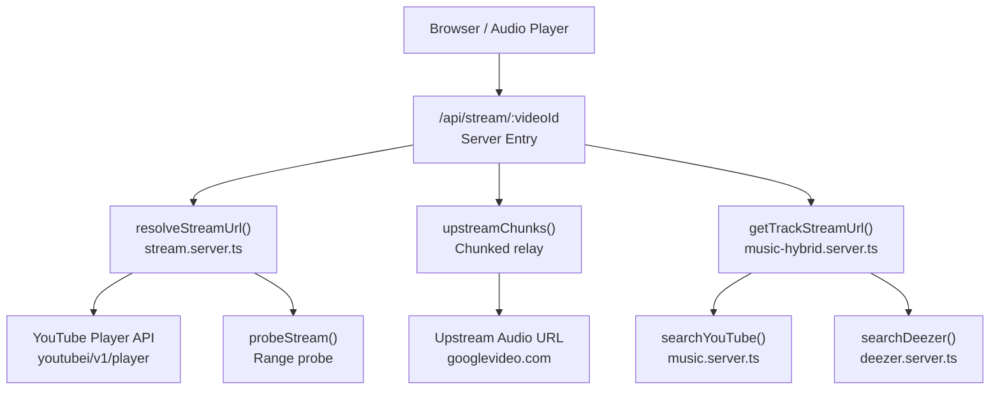
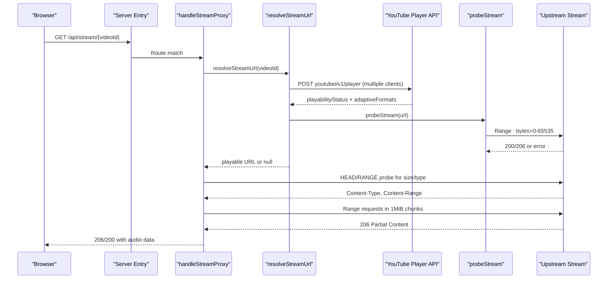
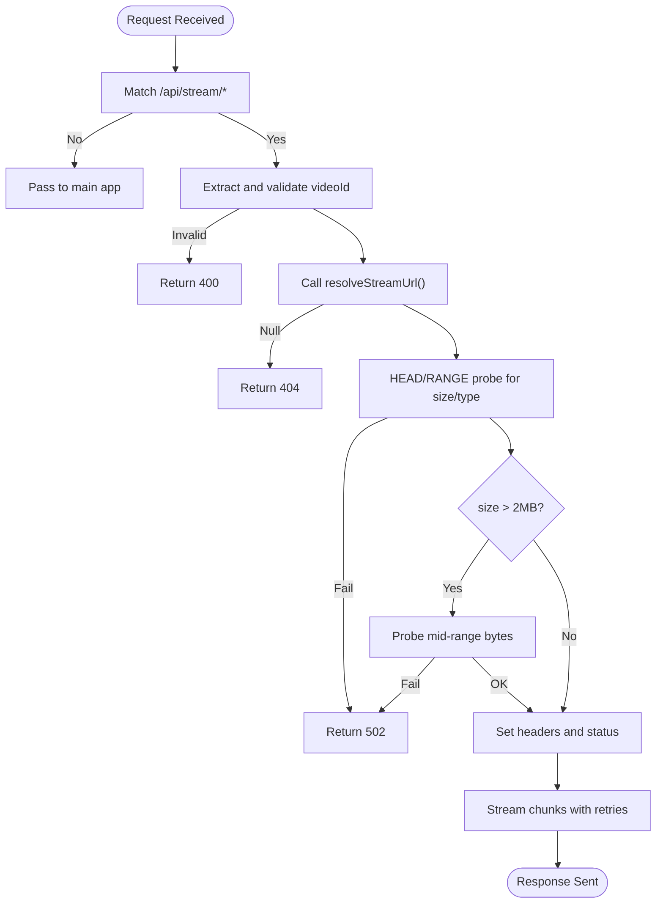
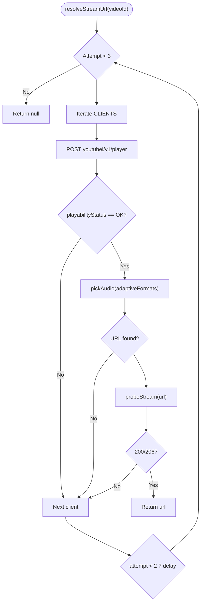
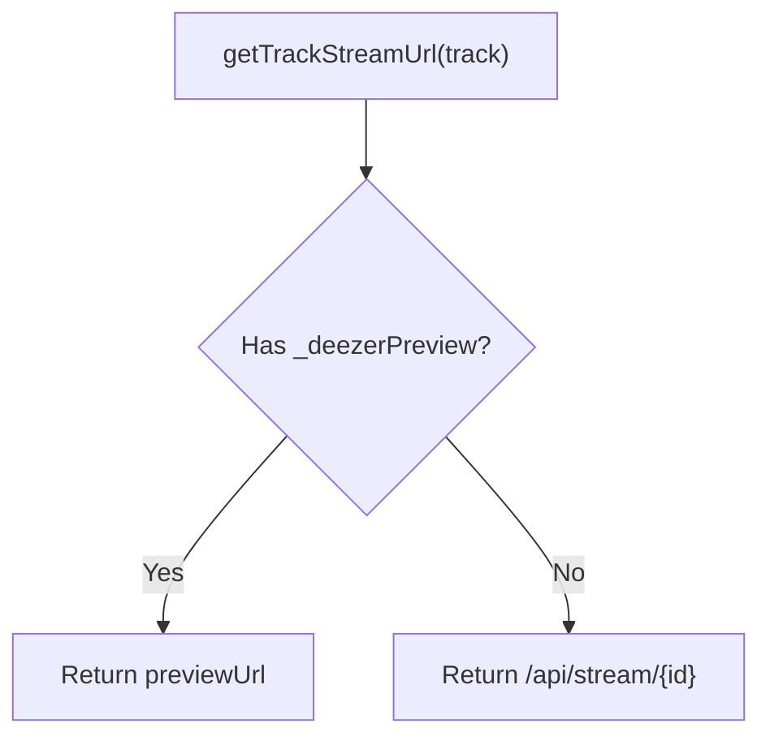
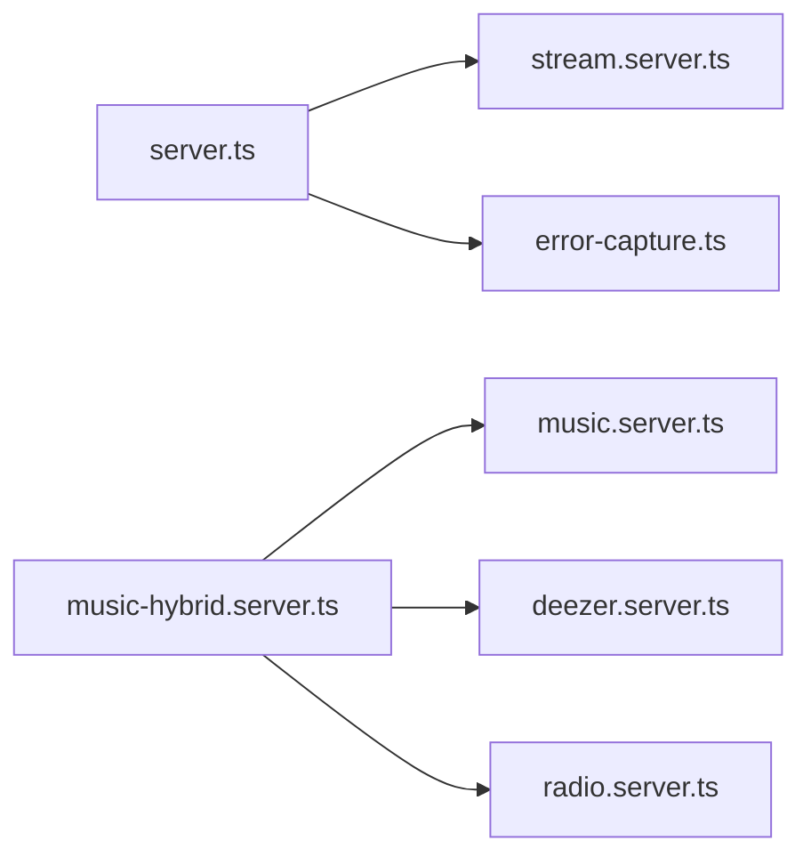

# Stream Proxy Service

<cite>
**Referenced Files in This Document**
- [server.ts](file://src/server.ts)
- [stream.server.ts](file://src/lib/stream.server.ts)
- [music-hybrid.server.ts](file://src/lib/music-hybrid.server.ts)
- [music.server.ts](file://src/lib/music.server.ts)
- [deezer.server.ts](file://src/lib/deezer.server.ts)
- [radio.server.ts](file://src/lib/radio.server.ts)
- [error-capture.ts](file://src/lib/error-capture.ts)
</cite>

## Table of Contents
1. [Introduction](#introduction)
2. [Project Structure](#project-structure)
3. [Core Components](#core-components)
4. [Architecture Overview](#architecture-overview)
5. [Detailed Component Analysis](#detailed-component-analysis)
6. [Dependency Analysis](#dependency-analysis)
7. [Performance Considerations](#performance-considerations)
8. [Troubleshooting Guide](#troubleshooting-guide)
9. [Conclusion](#conclusion)

## Introduction
This document explains the stream proxy service that enables background, ad-free audio playback for YouTube videos by resolving direct streaming URLs and relaying them through a same-origin endpoint. The service:
- Resolves playable, ad-free audio URLs from YouTube using internal player endpoints with multiple client profiles to improve reliability.
- Probes and validates streams before serving to avoid throttled or restricted links.
- Proxies audio bytes via a chunked streaming pipeline that honors HTTP Range requests, enabling seeking and progress bars while bypassing browser CORS restrictions.
- Integrates with a hybrid search strategy (YouTube primary, Deezer fallback) so users always get playable content.
- Implements robust error handling, timeouts, and retry logic to manage flaky upstream services.

## Project Structure
The streaming functionality is implemented across a small set of focused modules:
- Server entrypoint and stream proxy handler
- YouTube URL resolution and quality selection
- Hybrid search and track routing
- Upstream integrations (YouTube search, radio, Deezer previews)
- Error capture and reporting utilities

**Diagram sources**
- [server.ts:102-179](file://src/server.ts#L102-L179)
- [stream.server.ts:47-122](file://src/lib/stream.server.ts#L47-L122)
- [music-hybrid.server.ts:22-97](file://src/lib/music-hybrid.server.ts#L22-L97)
- [music.server.ts:182-247](file://src/lib/music.server.ts#L182-L247)
- [deezer.server.ts:39-74](file://src/lib/deezer.server.ts#L39-L74)

**Section sources**
- [server.ts:102-179](file://src/server.ts#L102-L179)
- [stream.server.ts:47-122](file://src/lib/stream.server.ts#L47-L122)
- [music-hybrid.server.ts:22-97](file://src/lib/music-hybrid.server.ts#L22-L97)
- [music.server.ts:182-247](file://src/lib/music.server.ts#L182-L247)
- [deezer.server.ts:39-74](file://src/lib/deezer.server.ts#L39-L74)

## Core Components
- Stream proxy handler: Validates route, resolves video ID, obtains a playable URL, probes availability, and streams bytes with proper headers and range support.
- URL resolver: Calls YouTube’s internal player API with multiple client profiles, selects best audio format, and verifies stream accessibility.
- Hybrid track routing: Chooses between YouTube tracks (proxied) and Deezer previews (direct), ensuring playable results even when YouTube is restricted.
- Search and radio integrations: Provide discovery and recommendations; include caching and filtering to reduce noise and improve relevance.
- Error capture: Enhances logging and recovers detailed error context when underlying frameworks swallow exceptions.

**Section sources**
- [server.ts:102-179](file://src/server.ts#L102-L179)
- [stream.server.ts:47-122](file://src/lib/stream.server.ts#L47-L122)
- [music-hybrid.server.ts:22-97](file://src/lib/music-hybrid.server.ts#L22-L97)
- [music.server.ts:52-75](file://src/lib/music.server.ts#L52-L75)
- [error-capture.ts:1-82](file://src/lib/error-capture.ts#L1-L82)

## Architecture Overview
The service follows a layered approach:
- Request routing at the server entrypoint detects stream proxy requests and delegates to the streaming handler.
- The handler resolves a direct audio URL from YouTube using multiple client configurations and validates it via a Range probe.
- For large files, the handler performs an additional mid-file check to detect CDN caps and fail fast if necessary.
- Bytes are streamed back in 1 MiB chunks with retries per chunk, honoring Range requests for seeking and setting appropriate headers.
- Discovery uses a hybrid strategy: YouTube first, then Deezer previews as fallback.

**Diagram sources**
- [server.ts:102-179](file://src/server.ts#L102-L179)
- [stream.server.ts:47-122](file://src/lib/stream.server.ts#L47-L122)

## Detailed Component Analysis

### Stream Proxy Handler
Responsibilities:
- Route matching for /api/stream/:videoId
- Input validation (presence of video ID)
- Delegation to URL resolver
- Pre-flight probing to determine file size and MIME type
- Early detection of capped streams to fail fast
- Streaming with correct headers and Range support
- Chunked relay with retries

Key behaviors:
- Uses a 1 MiB chunk size to work around upstream throttling limits on single requests.
- Honors Range requests to enable seeking; returns 416 for invalid ranges.
- Sets Accept-Ranges and Content-Type based on upstream response.
- Returns 404 when no stream URL can be resolved and 502 when upstream is unavailable or capped.

**Diagram sources**
- [server.ts:102-179](file://src/server.ts#L102-L179)

**Section sources**
- [server.ts:102-179](file://src/server.ts#L102-L179)

### YouTube URL Resolution
Responsibilities:
- Call YouTube’s internal player API with multiple client profiles to increase success rate.
- Filter out non-playable videos (age-restricted, members-only, region-blocked).
- Select best audio-only format, preferring 128kbps m4a (itag 140), then 48kbps (itag 139).
- Probe the selected URL with a bounded Range request to ensure it actually streams.
- Retry across clients and attempts with short delays to handle transient failures.

Quality optimization:
- Prioritizes higher-quality audio formats when available.
- Avoids mixed or non-audio formats by filtering on mimeType prefix.

Error handling:
- Gracefully handles network errors, malformed responses, and non-OK statuses.
- Returns null if no valid stream URL can be obtained after retries.

**Diagram sources**
- [stream.server.ts:47-122](file://src/lib/stream.server.ts#L47-L122)

**Section sources**
- [stream.server.ts:47-122](file://src/lib/stream.server.ts#L47-L122)

### Hybrid Track Routing
Responsibilities:
- Provide a unified way to obtain a playable URL for any track.
- Prefer YouTube full tracks via the proxy endpoint; use Deezer previews directly when available.
- Ensure always returning a playable source by falling back to Deezer if YouTube search fails or yields insufficient results.

Flow:
- If a track has a Deezer preview, return it directly.
- Otherwise, return the proxied stream URL for the YouTube video ID.

**Diagram sources**
- [music-hybrid.server.ts:87-97](file://src/lib/music-hybrid.server.ts#L87-L97)

**Section sources**
- [music-hybrid.server.ts:22-97](file://src/lib/music-hybrid.server.ts#L22-L97)

### Search and Radio Integrations
- YouTube search: Scrapes results with music filters and upload date filters, caches results for 5 minutes with LRU eviction, and filters out non-music content.
- Deezer search: Returns 30-second MP3 previews without authentication, used as fallback.
- Radio: Fetches YouTube’s built-in radio playlist for a given video to power “Up Next” recommendations.

Caching:
- In-memory cache with TTL and max entries reduces repeated upstream calls and improves latency.

**Section sources**
- [music.server.ts:52-75](file://src/lib/music.server.ts#L52-L75)
- [music.server.ts:182-247](file://src/lib/music.server.ts#L182-L247)
- [deezer.server.ts:39-74](file://src/lib/deezer.server.ts#L39-L74)
- [radio.server.ts:25-94](file://src/lib/radio.server.ts#L25-L94)

## Dependency Analysis
- server.ts depends on stream.server.ts for URL resolution and on error-capture.ts for enhanced error reporting.
- music-hybrid.server.ts composes music.server.ts and deezer.server.ts to provide resilient search outcomes.
- radio.server.ts depends on YouTube’s next endpoint to generate recommendation lists.
- All upstream calls use AbortSignal timeouts to prevent hanging requests.

**Diagram sources**
- [server.ts:102-179](file://src/server.ts#L102-L179)
- [stream.server.ts:47-122](file://src/lib/stream.server.ts#L47-L122)
- [music-hybrid.server.ts:22-97](file://src/lib/music-hybrid.server.ts#L22-L97)
- [music.server.ts:182-247](file://src/lib/music.server.ts#L182-L247)
- [deezer.server.ts:39-74](file://src/lib/deezer.server.ts#L39-L74)
- [radio.server.ts:25-94](file://src/lib/radio.server.ts#L25-L94)

**Section sources**
- [server.ts:102-179](file://src/server.ts#L102-L179)
- [stream.server.ts:47-122](file://src/lib/stream.server.ts#L47-L122)
- [music-hybrid.server.ts:22-97](file://src/lib/music-hybrid.server.ts#L22-L97)
- [music.server.ts:182-247](file://src/lib/music.server.ts#L182-L247)
- [deezer.server.ts:39-74](file://src/lib/deezer.server.ts#L39-L74)
- [radio.server.ts:25-94](file://src/lib/radio.server.ts#L25-L94)

## Performance Considerations
- Chunked streaming: The proxy reads upstream data in 1 MiB chunks to respect upstream throttling limits and keep memory usage bounded during long streams.
- Range requests: Honoring Range allows efficient seeking and avoids re-downloading entire files.
- Timeouts: All upstream fetches use AbortSignal timeouts to prevent resource leaks and long hangs.
- Retries: Per-chunk retry and multi-client resolution improve resilience against transient failures.
- Caching: Search results are cached in-memory with TTL and LRU eviction to reduce redundant network calls.
- Memory management: Streaming uses ReadableStream and iterators to process data incrementally rather than buffering entire files.

[No sources needed since this section provides general guidance]

## Troubleshooting Guide
Common issues and resolutions:
- Missing video ID: The handler returns 400 when the path does not include a valid video ID.
- No playable stream: If resolveStreamUrl cannot find a working URL after retries, the handler returns 404.
- Upstream unavailability or capped streams: When probing fails or the stream is restricted beyond the initial segment, the handler returns 502.
- Invalid Range requests: Requests with start positions beyond the file size or invalid ranges receive 416 with Content-Range indicating total size.
- Network errors: Timeouts and fetch failures are handled gracefully; logs include contextual information via error capture.

Operational tips:
- Inspect logs for “[stream-proxy]” messages indicating chunk-level failures.
- Verify upstream availability by testing the resolved URL directly with Range requests.
- Use the hybrid search flow to ensure playable results even when YouTube is restricted.

**Section sources**
- [server.ts:102-179](file://src/server.ts#L102-L179)
- [stream.server.ts:47-122](file://src/lib/stream.server.ts#L47-L122)
- [error-capture.ts:1-82](file://src/lib/error-capture.ts#L1-L82)

## Conclusion
The stream proxy service provides a reliable, efficient mechanism for playing YouTube audio in browsers by resolving direct streaming URLs and relaying bytes with proper Range support. It combines robust URL resolution, quality selection, and streaming techniques with a hybrid search strategy to ensure consistent playback. Built-in timeouts, retries, and error capture make the system resilient to upstream instability, while chunked streaming and caching optimize performance under load.