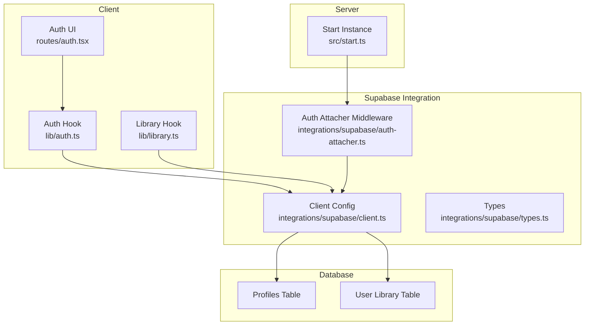
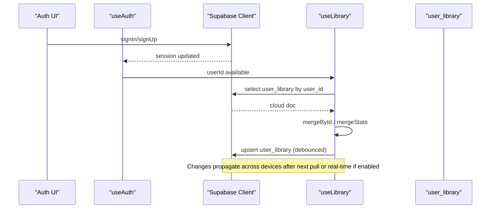
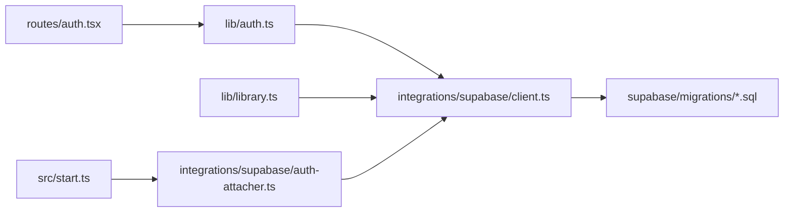

# Cloud Synchronization & Supabase Integration

<cite>
**Referenced Files in This Document**
- [auth-attacher.ts](file://src/integrations/supabase/auth-attacher.ts)
- [client.ts](file://src/integrations/supabase/client.ts)
- [types.ts](file://src/integrations/supabase/types.ts)
- [library.ts](file://src/lib/library.ts)
- [auth.ts](file://src/lib/auth.ts)
- [auth.tsx](file://src/routes/auth.tsx)
- [start.ts](file://src/start.ts)
- [offline.ts](file://src/lib/offline.ts)
- [20260808085443_8253f78c-652e-4cb4-8772-8818ce90215c.sql](file://supabase/migrations/20260808085443_8253f78c-652e-4cb4-8772-8818ce90215c.sql)
- [20260808085506_fb5fd43f-6504-4c96-8335-2aeac753c924.sql](file://supabase/migrations/20260808085506_fb5fd43f-6504-4c96-8335-2aeac753c924.sql)
- [config.toml](file://supabase/config.toml)
</cite>

## Table of Contents
1. [Introduction](#introduction)
2. [Project Structure](#project-structure)
3. [Core Components](#core-components)
4. [Architecture Overview](#architecture-overview)
5. [Detailed Component Analysis](#detailed-component-analysis)
6. [Dependency Analysis](#dependency-analysis)
7. [Performance Considerations](#performance-considerations)
8. [Troubleshooting Guide](#troubleshooting-guide)
9. [Conclusion](#conclusion)
10. [Appendices](#appendices)

## Introduction
This document explains the cloud synchronization system built with Supabase for a music application. It covers how the Supabase client is configured, how authentication integrates with server functions, and how user library data (likes, dislikes, history, playlists, settings, and stats) is synchronized between local storage and the cloud. It also documents the database schema and migrations, merge algorithms used when signing in, debounced sync behavior to prevent excessive API calls, error handling strategies, and offline-to-online transitions.

## Project Structure
The synchronization system spans several layers:
- Client configuration and auth middleware for attaching tokens to server requests
- Authentication flows and session management
- Local-first library state with automatic cloud sync on sign-in
- Database schema and security policies for per-user data isolation
- Offline support via IndexedDB and service worker caching

**Diagram sources**
- [auth.tsx:1-197](file://src/routes/auth.tsx#L1-L197)
- [auth.ts:1-70](file://src/lib/auth.ts#L1-L70)
- [library.ts:242-349](file://src/lib/library.ts#L242-L349)
- [client.ts:1-69](file://src/integrations/supabase/client.ts#L1-L69)
- [auth-attacher.ts:1-16](file://src/integrations/supabase/auth-attacher.ts#L1-L16)
- [start.ts:1-31](file://src/start.ts#L1-L31)
- [20260808085443_8253f78c-652e-4cb4-8772-8818ce90215c.sql:1-63](file://supabase/migrations/20260808085443_8253f78c-652e-4cb4-8772-8818ce90215c.sql#L1-L63)

**Section sources**
- [auth.tsx:1-197](file://src/routes/auth.tsx#L1-L197)
- [auth.ts:1-70](file://src/lib/auth.ts#L1-L70)
- [library.ts:242-349](file://src/lib/library.ts#L242-L349)
- [client.ts:1-69](file://src/integrations/supabase/client.ts#L1-L69)
- [auth-attacher.ts:1-16](file://src/integrations/supabase/auth-attacher.ts#L1-L16)
- [start.ts:1-31](file://src/start.ts#L1-L31)
- [20260808085443_8253f78c-652e-4cb4-8772-8818ce90215c.sql:1-63](file://supabase/migrations/20260808085443_8253f78c-652e-4cb4-8772-8818ce90215c.sql#L1-L63)

## Core Components
- Supabase client configuration: Initializes the client with environment variables, custom fetch wrapper, and auth persistence.
- Auth attacher middleware: Attaches the current session’s access token to server function RPCs.
- Authentication hook: Manages session state, profile retrieval, and sign-out.
- Library hook: Local-first state with pull-on-sign-in and debounced push to cloud.
- Database schema: Profiles and user_library tables with row-level security policies and triggers.

**Section sources**
- [client.ts:1-69](file://src/integrations/supabase/client.ts#L1-L69)
- [auth-attacher.ts:1-16](file://src/integrations/supabase/auth-attacher.ts#L1-L16)
- [auth.ts:1-70](file://src/lib/auth.ts#L1-L70)
- [library.ts:242-349](file://src/lib/library.ts#L242-L349)
- [20260808085443_8253f78c-652e-4cb4-8772-8818ce90215c.sql:1-63](file://supabase/migrations/20260808085443_8253f78c-652e-4cb4-8772-8818ce90215c.sql#L1-L63)

## Architecture Overview
The system uses a local-first approach:
- On app load, the library hook hydrates state from localStorage.
- When a user signs in, it pulls their cloud library once and merges it into local state.
- Subsequent changes are debounced and pushed back to the cloud via upsert.
- Server functions automatically receive the bearer token via middleware.

**Diagram sources**
- [auth.tsx:46-81](file://src/routes/auth.tsx#L46-L81)
- [auth.ts:18-49](file://src/lib/auth.ts#L18-L49)
- [library.ts:262-349](file://src/lib/library.ts#L262-L349)
- [20260808085443_8253f78c-652e-4cb4-8772-8818ce90215c.sql:20-32](file://supabase/migrations/20260808085443_8253f78c-652e-4cb4-8772-8818ce90215c.sql#L20-L32)

## Detailed Component Analysis

### Supabase Client Configuration
- Reads environment variables for URL and publishable key; throws if missing.
- Wraps fetch to inject apikey header and handle new-style keys.
- Enables persistent sessions and auto-refresh tokens.
- Exports a lazily initialized singleton via Proxy.

Key behaviors:
- Environment validation ensures correct project setup.
- Custom fetch avoids misusing secret keys in Authorization headers.
- Session persistence allows seamless re-auth on reload.

**Section sources**
- [client.ts:5-56](file://src/integrations/supabase/client.ts#L5-L56)

### Authentication Attacher Middleware
- Extracts the current session access token and attaches it as a Bearer Authorization header for server function RPCs.
- Must be registered as a global function middleware so server endpoints can authenticate requests.

Impact:
- Ensures server-side operations that require identity can rely on the authenticated user context.

**Section sources**
- [auth-attacher.ts:1-16](file://src/integrations/supabase/auth-attacher.ts#L1-L16)
- [start.ts:28-31](file://src/start.ts#L28-L31)

### Authentication Flow
- The auth page supports email/password sign-in and Google OAuth.
- After successful sign-in, the app navigates to the home route.
- The useAuth hook listens to auth state changes and loads the user profile.

Flow highlights:
- Sign-up optionally sets display name metadata which seeds the profiles table.
- Profile updates are persisted to the profiles table.

**Section sources**
- [auth.tsx:46-93](file://src/routes/auth.tsx#L46-L93)
- [auth.ts:18-68](file://src/lib/auth.ts#L18-L68)

### User Library Sync and Merge Algorithms
- Hydrates local state from localStorage on mount.
- On sign-in, pulls the user’s cloud library once and merges:
  - Likes/dislikes/playlists/history: merged by id, preserving order and limiting size.
  - Stats: merged by taking max counters and latest timestamps.
  - Settings: merged with defaults overridden by cloud values.
- Debounces writes to the cloud to avoid excessive API calls.

Merge specifics:
- Arrays are deduplicated by track id and capped at a maximum length to control memory and payload size.
- History preserves recent entries while removing duplicates.
- Stats aggregation favors the most recent and highest counts to reconcile concurrent edits.

Sync details:
- Uses upsert to create or update the single row per user.
- Truncates history to a fixed size before persisting to reduce payload.

**Section sources**
- [library.ts:200-349](file://src/lib/library.ts#L200-L349)

### Database Schema and Migrations
- profiles: stores display_name and avatar_url linked to auth.users with RLS policies allowing users to manage only their own profile.
- user_library: stores JSONB data per user with RLS ensuring users can only read/write their own row.
- Triggers update updated_at on row changes.
- Trigger creates a profile row when a new user signs up.

Security:
- Row-Level Security policies restrict access to authenticated users and enforce ownership checks.
- Grants allow authenticated users to perform CRUD on both tables; service role has full access.

**Section sources**
- [20260808085443_8253f78c-652e-4cb4-8772-8818ce90215c.sql:1-63](file://supabase/migrations/20260808085443_8253f78c-652e-4cb4-8772-8818ce90215c.sql#L1-L63)
- [20260808085506_fb5fd43f-6504-4c96-8335-2aeac753c924.sql:1-2](file://supabase/migrations/20260808085506_fb5fd43f-6504-4c96-8335-2aeac753c924.sql#L1-L2)

### Data Model Mapping
- Local keys map to fields in the JSONB payload stored in user_library:
  - likes, dislikes, history, playlists, settings, stats
- Types define the shape of these structures for type safety.

Mapping notes:
- History and lists are bounded to limit payload size.
- Stats are aggregated per track with counters and last activity timestamp.

**Section sources**
- [types.ts:15-58](file://src/integrations/supabase/types.ts#L15-L58)
- [library.ts:200-236](file://src/lib/library.ts#L200-L236)

### Real-Time Sync Capabilities
- The codebase does not implement explicit realtime subscriptions for user_library changes.
- Current sync model is pull-on-sign-in plus debounced push; cross-device consistency relies on subsequent pulls or manual refresh.
- Supabase realtime dependencies are present in the project but not wired into the library sync flow.

Recommendation:
- To enable real-time propagation, subscribe to changes on user_library and apply incremental merges similar to the sign-in flow.

[No sources needed since this section summarizes implementation status without analyzing specific files]

### Offline-to-Online Transition
- Offline audio playback uses IndexedDB to store downloaded tracks.
- Service worker caches app shell and API responses where appropriate, bypassing streaming endpoints.
- Network failures during download are handled with timeouts and errors surfaced to callers.

Transition behavior:
- While offline, local state remains functional.
- When online, the library hook will attempt to sync changes on next interaction or sign-in.

**Section sources**
- [offline.ts:58-201](file://src/lib/offline.ts#L58-L201)
- [sw.js:41-89](file://public/sw.js#L41-L89)

## Dependency Analysis
The following diagram shows core dependencies among components involved in cloud sync.

**Diagram sources**
- [auth.tsx:1-197](file://src/routes/auth.tsx#L1-L197)
- [auth.ts:1-70](file://src/lib/auth.ts#L1-L70)
- [library.ts:242-349](file://src/lib/library.ts#L242-L349)
- [client.ts:1-69](file://src/integrations/supabase/client.ts#L1-L69)
- [auth-attacher.ts:1-16](file://src/integrations/supabase/auth-attacher.ts#L1-L16)
- [start.ts:1-31](file://src/start.ts#L1-L31)
- [20260808085443_8253f78c-652e-4cb4-8772-8818ce90215c.sql:1-63](file://supabase/migrations/20260808085443_8253f78c-652e-4cb4-8772-8818ce90215c.sql#L1-L63)

**Section sources**
- [auth.tsx:1-197](file://src/routes/auth.tsx#L1-L197)
- [auth.ts:1-70](file://src/lib/auth.ts#L1-L70)
- [library.ts:242-349](file://src/lib/library.ts#L242-L349)
- [client.ts:1-69](file://src/integrations/supabase/client.ts#L1-L69)
- [auth-attacher.ts:1-16](file://src/integrations/supabase/auth-attacher.ts#L1-L16)
- [start.ts:1-31](file://src/start.ts#L1-L31)
- [20260808085443_8253f78c-652e-4cb4-8772-8818ce90215c.sql:1-63](file://supabase/migrations/20260808085443_8253f78c-652e-4cb4-8772-8818ce90215c.sql#L1-L63)

## Performance Considerations
- Debounced sync reduces API calls by batching rapid changes into a single upsert.
- Lists are capped to prevent large payloads and memory growth.
- History truncation limits bandwidth and storage usage.
- Lazy initialization of the Supabase client avoids unnecessary overhead until first use.

[No sources needed since this section provides general guidance]

## Troubleshooting Guide
Common issues and resolutions:
- Missing environment variables: Ensure VITE_SUPABASE_URL and VITE_SUPABASE_PUBLISHABLE_KEY are set; the client will throw an error indicating missing variables.
- Network failures during sync: Errors are logged; consider retry logic or user prompts to retry later.
- Offline downloads failing: Check network connectivity and storage quota; IndexedDB operations may fail if unavailable or quota exceeded.
- Authentication token not attached to server functions: Verify that the auth attacher middleware is registered as a function middleware.

Error handling patterns:
- Library sync catches and logs errors without crashing the app.
- Offline utilities log warnings and return safe fallbacks.
- Error boundary provides recovery options for unexpected crashes.

**Section sources**
- [client.ts:36-44](file://src/integrations/supabase/client.ts#L36-L44)
- [library.ts:325-349](file://src/lib/library.ts#L325-L349)
- [offline.ts:58-201](file://src/lib/offline.ts#L58-L201)
- [auth-attacher.ts:1-16](file://src/integrations/supabase/auth-attacher.ts#L1-L16)
- [start.ts:1-31](file://src/start.ts#L1-L31)

## Conclusion
The application implements a robust local-first synchronization strategy using Supabase. It securely authenticates users, persists their library data in a per-user JSONB structure, and merges local and cloud states efficiently. Debounced syncing minimizes API usage, while offline capabilities ensure continuity. For enhanced cross-device consistency, consider adding realtime subscriptions to propagate changes instantly.

[No sources needed since this section summarizes without analyzing specific files]

## Appendices

### Setup Instructions for Supabase Project Configuration
- Create a Supabase project and note the project ID.
- Configure environment variables:
  - VITE_SUPABASE_URL
  - VITE_SUPABASE_PUBLISHABLE_KEY
- Apply migrations to create profiles and user_library tables and set up RLS policies.
- Enable providers (email/password and Google) in the Supabase dashboard.
- Ensure the auth attacher middleware is registered as a function middleware in the start instance.

**Section sources**
- [config.toml:1-1](file://supabase/config.toml#L1-L1)
- [20260808085443_8253f78c-652e-4cb4-8772-8818ce90215c.sql:1-63](file://supabase/migrations/20260808085443_8253f78c-652e-4cb4-8772-8818ce90215c.sql#L1-L63)
- [client.ts:31-56](file://src/integrations/supabase/client.ts#L31-L56)
- [start.ts:28-31](file://src/start.ts#L28-L31)

### Conflict Resolution Strategies Summary
- Likes/Dislikes/History/Playlists: Deduplicate by id and preserve order; cap list sizes to bound memory and payload.
- Stats: Take the maximum of counters and the latest timestamp to reconcile concurrent edits.
- Settings: Merge with defaults, letting cloud settings override local defaults.

**Section sources**
- [library.ts:209-236](file://src/lib/library.ts#L209-L236)
- [library.ts:262-307](file://src/lib/library.ts#L262-L307)