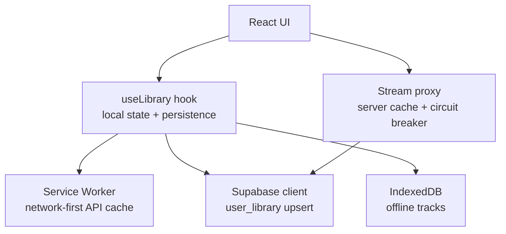
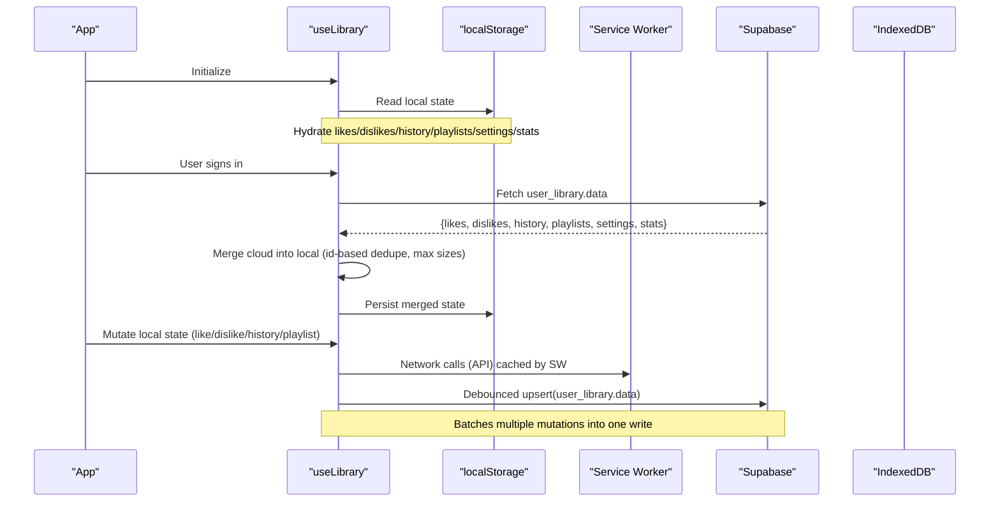
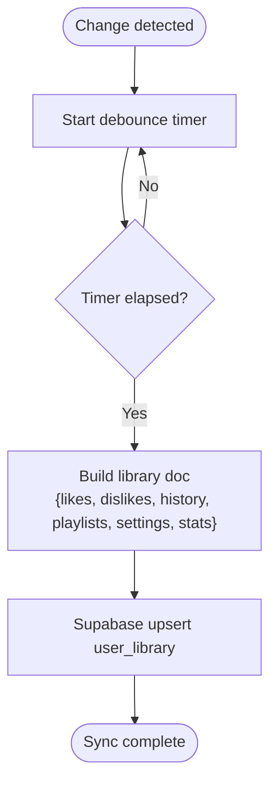
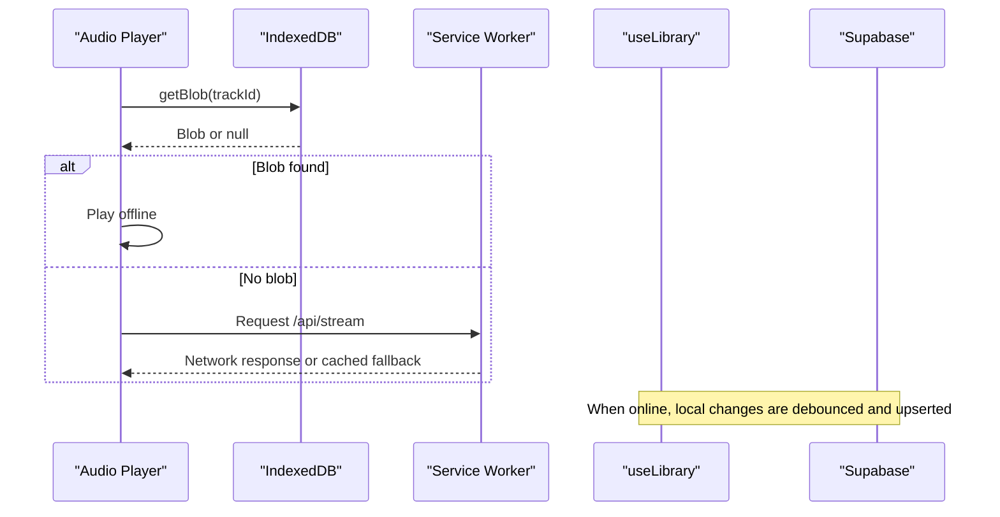
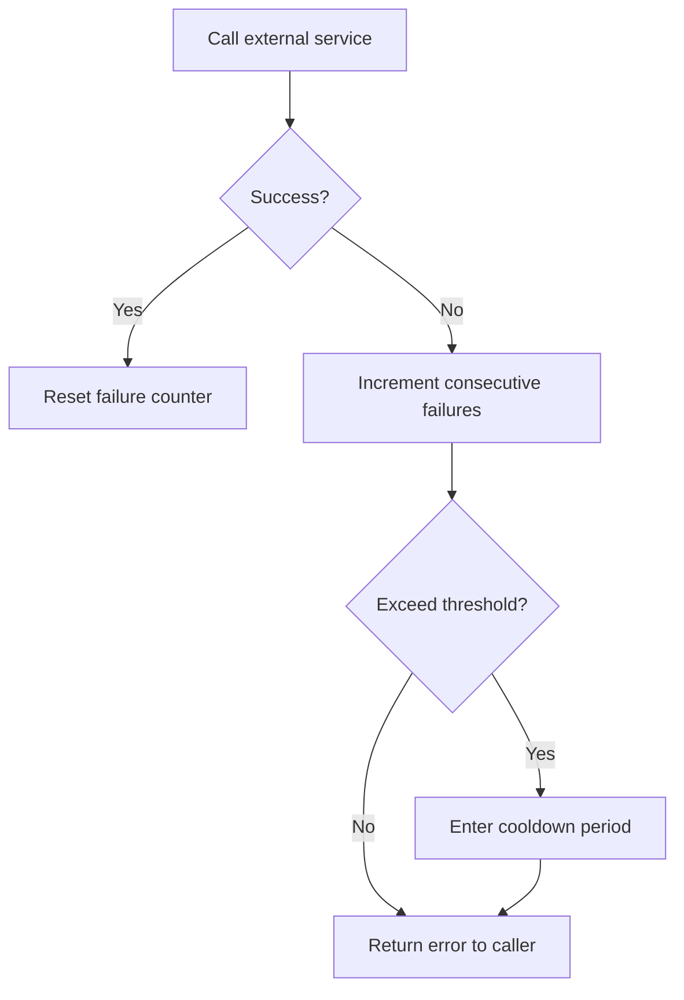
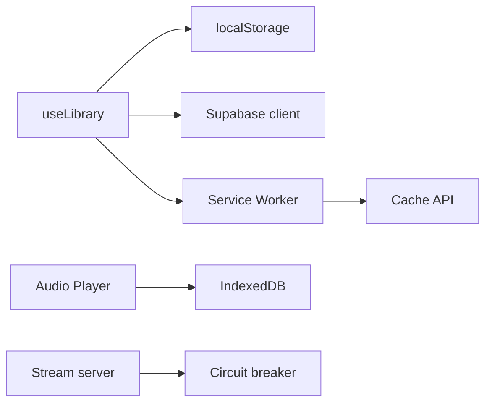

# Data Synchronization Algorithms

<cite>
**Referenced Files in This Document**
- [library.ts](file://src/lib/library.ts)
- [offline.ts](file://src/lib/offline.ts)
- [sw.js](file://public/sw.js)
- [client.ts](file://src/integrations/supabase/client.ts)
- [stream.server.ts](file://src/lib/stream.server.ts)
- [ErrorBoundary.tsx](file://src/components/music/ErrorBoundary.tsx)
- [20260808085443_8253f78c-652e-4cb4-8772-8818ce90215c.sql](file://supabase/migrations/20260808085443_8253f78c-652e-4cb4-8772-8818ce90215c.sql)
</cite>

## Table of Contents
1. [Introduction](#introduction)
2. [Project Structure](#project-structure)
3. [Core Components](#core-components)
4. [Architecture Overview](#architecture-overview)
5. [Detailed Component Analysis](#detailed-component-analysis)
6. [Dependency Analysis](#dependency-analysis)
7. [Performance Considerations](#performance-considerations)
8. [Troubleshooting Guide](#troubleshooting-guide)
9. [Conclusion](#conclusion)

## Introduction
This document explains the data synchronization algorithms that merge local and cloud data, focusing on conflict resolution strategies, debounced batching, offline-to-online transitions, and retry/error recovery. It covers how likes, dislikes, playlists, and listening history are merged and persisted, and how the system behaves when connectivity is restored after offline changes.

## Project Structure
The synchronization logic spans a few key areas:
- Local state and persistence for user library data (likes, dislikes, history, playlists, settings, stats).
- Debounced sync to the cloud via Supabase when the user is signed in.
- Offline storage for audio blobs using IndexedDB.
- Service Worker caching strategy for API responses and app shell.
- Server-side streaming cache and circuit breaker for resilience.

**Diagram sources**
- [library.ts:242-349](file://src/lib/library.ts#L242-L349)
- [sw.js:52-67](file://public/sw.js#L52-L67)
- [client.ts:30-56](file://src/integrations/supabase/client.ts#L30-L56)
- [offline.ts:24-41](file://src/lib/offline.ts#L24-L41)
- [stream.server.ts:65-80](file://src/lib/stream.server.ts#L65-L80)

**Section sources**
- [library.ts:242-349](file://src/lib/library.ts#L242-L349)
- [sw.js:1-90](file://public/sw.js#L1-L90)
- [offline.ts:1-201](file://src/lib/offline.ts#L1-L201)
- [client.ts:1-69](file://src/integrations/supabase/client.ts#L1-L69)
- [stream.server.ts:35-80](file://src/lib/stream.server.ts#L35-L80)

## Core Components
- useLibrary: Manages local state for likes, dislikes, history, playlists, settings, and stats; hydrates from localStorage; merges with cloud data on sign-in; debounces writes back to the cloud.
- Offline storage: IndexedDB-backed blob store for downloaded tracks enabling playback without network.
- Service Worker: Caches API responses and app shell; bypasses audio stream caching; supports offline UX.
- Supabase client: Provides authenticated access to the user_library table for syncing.
- Streaming server cache and circuit breaker: Protects downstream services and reduces redundant work.

**Section sources**
- [library.ts:125-143](file://src/lib/library.ts#L125-L143)
- [library.ts:242-349](file://src/lib/library.ts#L242-L349)
- [offline.ts:58-141](file://src/lib/offline.ts#L58-L141)
- [sw.js:52-67](file://public/sw.js#L52-L67)
- [client.ts:30-56](file://src/integrations/supabase/client.ts#L30-L56)
- [stream.server.ts:65-80](file://src/lib/stream.server.ts#L65-L80)

## Architecture Overview
The sync architecture is local-first with periodic cloud reconciliation:
- On hydration, local data is read from localStorage.
- When a user signs in, the cloud copy is pulled and merged into local state using id-based deduplication and time-aware merging rules.
- Changes made locally are debounced and batched into a single upsert to the cloud.
- Offline playback uses pre-downloaded blobs stored in IndexedDB.
- The Service Worker caches API responses to improve resilience and reduce network usage.

**Diagram sources**
- [library.ts:251-349](file://src/lib/library.ts#L251-L349)
- [sw.js:52-67](file://public/sw.js#L52-L67)
- [client.ts:30-56](file://src/integrations/supabase/client.ts#L30-L56)

## Detailed Component Analysis

### Local-first Library Sync and Merge Logic
- Hydration: Reads local state from localStorage keys for likes, dislikes, history, playlists, settings, and stats.
- Cloud pull: On sign-in, fetches the user’s library document from Supabase and merges it into local state.
- Merge strategies:
  - Likes, Dislikes, Playlists: Merged by unique id, preserving order and limiting size to avoid large payloads.
  - History: Merged with local entries taking precedence (recent local plays preserved), capped at a fixed length.
  - Stats: Merged per track using “max” semantics for counters and lastAt timestamps to keep the most recent or highest values.
  - Settings: Cloud settings override defaults; local defaults remain if not present.
- Debounced push: After any change to the above fields, a timer batches updates and performs a single upsert to the cloud.

**Diagram sources**
- [library.ts:321-349](file://src/lib/library.ts#L321-L349)

**Section sources**
- [library.ts:125-143](file://src/lib/library.ts#L125-L143)
- [library.ts:251-349](file://src/lib/library.ts#L251-L349)
- [library.ts:209-236](file://src/lib/library.ts#L209-L236)

### Conflict Resolution Strategies
- Id-based deduplication: For arrays like likes, dislikes, and playlists, items are merged by id to prevent duplicates while preserving the most relevant ordering.
- History precedence: Local history entries are prioritized to reflect immediate user actions before they reach the cloud.
- Stats aggregation: Counters and timestamps are merged using maximums to ensure no regression in metrics across devices.
- Size limits: Arrays are truncated to bounded lengths to control payload size and memory usage.

These strategies ensure consistent convergence when the same item exists in both locations with different values.

**Section sources**
- [library.ts:209-236](file://src/lib/library.ts#L209-L236)
- [library.ts:276-307](file://src/lib/library.ts#L276-L307)

### Debounced Sync Mechanism
- A timeout-based debouncer coalesces rapid local mutations into a single cloud upsert.
- The effect watches all relevant state slices and resets the timer on each change.
- This prevents excessive API calls during bulk operations (e.g., adding many tracks to playlists or rapidly toggling likes).

**Section sources**
- [library.ts:321-349](file://src/lib/library.ts#L321-L349)

### Offline-to-Online Transition
- Offline playback: Audio blobs are stored in IndexedDB and played directly from disk when available.
- Service Worker caching: API responses are cached network-first with fallback to cache for non-stream requests, improving offline UX.
- On reconnect: Subsequent reads/writes proceed normally; the debounced sync will push pending local changes to the cloud on next mutation cycle.

**Diagram sources**
- [offline.ts:85-141](file://src/lib/offline.ts#L85-L141)
- [sw.js:52-67](file://public/sw.js#L52-L67)
- [library.ts:321-349](file://src/lib/library.ts#L321-L349)

**Section sources**
- [offline.ts:85-141](file://src/lib/offline.ts#L85-L141)
- [sw.js:52-67](file://public/sw.js#L52-L67)
- [library.ts:321-349](file://src/lib/library.ts#L321-L349)

### Merge Logic for Different Data Types
- Likes: Unique by id; added to front; limited to a maximum count.
- Dislikes: Unique by id; removed from likes when disliked; limited to a maximum count.
- History: Prepend new play; remove duplicates; cap at a fixed length.
- Playlists: Unique by playlist id; tracks within playlists are unique by id; supports add/remove/reorder/move operations.
- Stats: Per-track counters aggregated with max semantics; lastAt updated to latest timestamp.

**Section sources**
- [library.ts:353-411](file://src/lib/library.ts#L353-L411)
- [library.ts:422-515](file://src/lib/library.ts#L422-L515)
- [library.ts:209-236](file://src/lib/library.ts#L209-L236)

### Retry Mechanisms and Error Recovery
- Streaming server protection: A circuit breaker tracks consecutive failures and enforces a cooldown window to avoid hammering failing endpoints.
- Error capture: Errors are described and captured to aid debugging and recovery flows.
- UI error boundary: Presents a recoverable error state with options to reload or attempt recovery.

**Diagram sources**
- [stream.server.ts:65-80](file://src/lib/stream.server.ts#L65-L80)

**Section sources**
- [stream.server.ts:65-80](file://src/lib/stream.server.ts#L65-L80)
- [error-capture.ts:1-34](file://src/lib/error-capture.ts#L1-L34)
- [ErrorBoundary.tsx:37-66](file://src/components/music/ErrorBoundary.tsx#L37-L66)

### Examples of Sync Scenarios and Outcomes
- Scenario A: Like a track on Device 1, then dislike on Device 2 before sync. Outcome: Final state reflects the latest action based on id-based merge and local precedence for history; stats counters take maximums.
- Scenario B: Add multiple tracks to a playlist quickly. Outcome: Debouncing batches these into a single upsert, reducing API calls and ensuring consistency.
- Scenario C: Listen offline, then reconnect. Outcome: Playback uses IndexedDB blobs; subsequent sync pushes local history and stats to the cloud.

[No sources needed since this section summarizes scenarios derived from analyzed code]

## Dependency Analysis
- useLibrary depends on:
  - localStorage for local persistence.
  - Supabase client for cloud read/write.
  - Service Worker indirectly via network requests that benefit from caching.
- Offline module depends on IndexedDB for blob storage.
- Service Worker intercepts network requests to cache API responses and app shell assets.
- Streaming server module provides in-memory cache and circuit breaker for robustness.

**Diagram sources**
- [library.ts:242-349](file://src/lib/library.ts#L242-L349)
- [offline.ts:24-41](file://src/lib/offline.ts#L24-L41)
- [sw.js:52-67](file://public/sw.js#L52-L67)
- [stream.server.ts:65-80](file://src/lib/stream.server.ts#L65-L80)

**Section sources**
- [library.ts:242-349](file://src/lib/library.ts#L242-L349)
- [offline.ts:24-41](file://src/lib/offline.ts#L24-L41)
- [sw.js:52-67](file://public/sw.js#L52-L67)
- [stream.server.ts:65-80](file://src/lib/stream.server.ts#L65-L80)

## Performance Considerations
- Debounced batching: Reduces API call frequency by grouping mutations into a single upsert.
- Array size limits: Caps likes, dislikes, history, and playlists to bounded sizes to control memory and payload size.
- Stats merging: Uses max semantics to avoid unnecessary churn and preserve accurate metrics.
- Service Worker caching: Caches API responses to reduce network overhead and improve responsiveness.
- Offline playback: IndexedDB avoids repeated downloads and enables zero-latency playback for cached content.
- Streaming cache and circuit breaker: Minimizes redundant stream resolution and protects against cascading failures.

[No sources needed since this section provides general guidance derived from analyzed components]

## Troubleshooting Guide
- If sync fails:
  - Check console warnings for library sync errors and verify Supabase configuration.
  - Ensure environment variables for Supabase are set correctly.
- If offline playback fails:
  - Verify IndexedDB availability and quota; check for download completion.
- If streaming fails:
  - Inspect circuit breaker state and cooldown periods; consider retry after cooldown.
- UI-level errors:
  - Use the error boundary to reload or attempt recovery; review captured error descriptions.

**Section sources**
- [library.ts:321-349](file://src/lib/library.ts#L321-L349)
- [client.ts:30-56](file://src/integrations/supabase/client.ts#L30-L56)
- [offline.ts:85-141](file://src/lib/offline.ts#L85-L141)
- [stream.server.ts:65-80](file://src/lib/stream.server.ts#L65-L80)
- [ErrorBoundary.tsx:37-66](file://src/components/music/ErrorBoundary.tsx#L37-L66)

## Conclusion
The synchronization system is local-first, leveraging id-based merges, debounced batching, and bounded collections to maintain consistency and performance. Offline capabilities are supported through IndexedDB and Service Worker caching, while server-side protections ensure resilience under load or failures. Together, these mechanisms provide a robust experience across online and offline states, with clear paths for error recovery and performance optimization.

[No sources needed since this section summarizes without analyzing specific files]