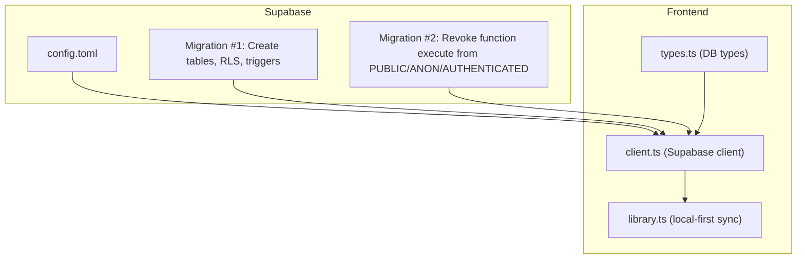
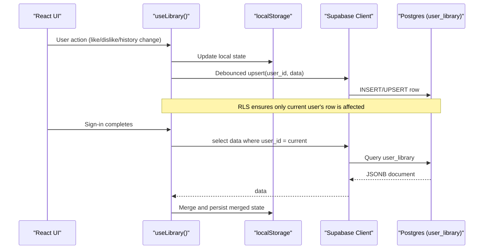
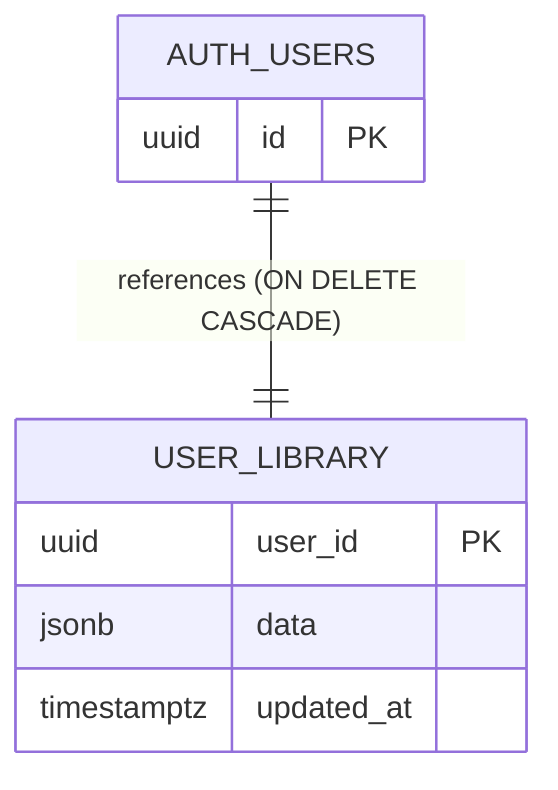
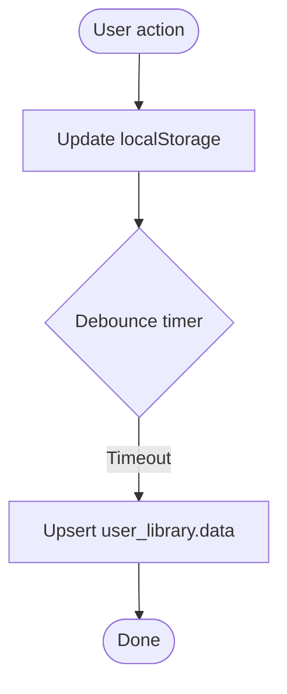
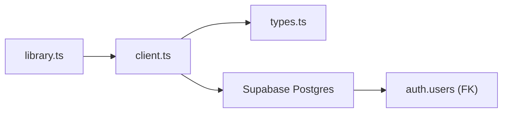
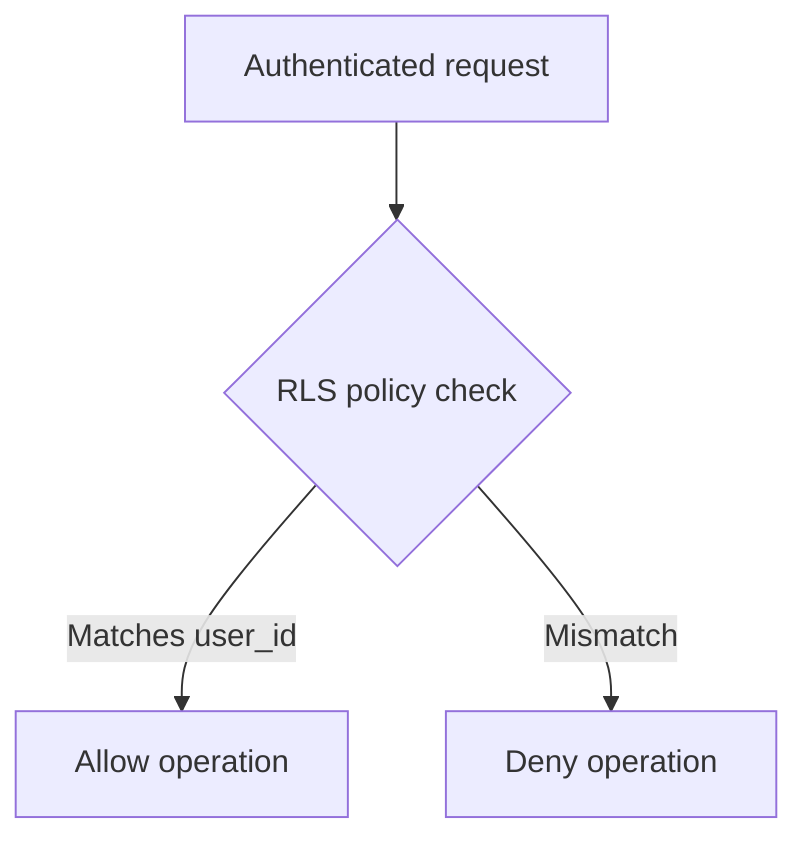

# Database Schema & Migrations

<cite>
**Referenced Files in This Document**
- [config.toml](file://supabase/config.toml)
- [20260808085443_8253f78c-652e-4cb4-8772-8818ce90215c.sql](file://supabase/migrations/20260808085443_8253f78c-652e-4cb4-8772-8818ce90215c.sql)
- [20260808085506_fb5fd43f-6504-4c96-8335-2aeac753c924.sql](file://supabase/migrations/20260808085506_fb5fd43f-6504-4c96-8335-2aeac753c924.sql)
- [types.ts](file://src/integrations/supabase/types.ts)
- [client.ts](file://src/integrations/supabase/client.ts)
- [library.ts](file://src/lib/library.ts)
</cite>

## Table of Contents
1. [Introduction](#introduction)
2. [Project Structure](#project-structure)
3. [Core Components](#core-components)
4. [Architecture Overview](#architecture-overview)
5. [Detailed Component Analysis](#detailed-component-analysis)
6. [Dependency Analysis](#dependency-analysis)
7. [Performance Considerations](#performance-considerations)
8. [Security and Access Control](#security-and-access-control)
9. [Backup, Recovery, and Maintenance](#backup-recovery-and-maintenance)
10. [Troubleshooting Guide](#troubleshooting-guide)
11. [Conclusion](#conclusion)

## Introduction
This document explains the Supabase-backed database schema and migration system for the application. It focuses on:
- The user_library table structure and its role in storing per-user library data (likes, dislikes, history, playlists, settings, stats).
- SQL migrations that create and secure the schema.
- Project configuration via config.toml.
- Mapping between local storage structures and cloud tables.
- Common queries and operations used by the app.
- Indexing strategies, security policies, and maintenance guidance.

## Project Structure
The database-related assets are organized under supabase/migrations and supabase/config.toml. The client-side integration uses generated types and a Supabase client to read/write data.

**Diagram sources**
- [config.toml:1-1](file://supabase/config.toml#L1-L1)
- [20260808085443_8253f78c-652e-4cb4-8772-8818ce90215c.sql:1-63](file://supabase/migrations/20260808085443_8253f78c-652e-4cb4-8772-8818ce90215c.sql#L1-L63)
- [20260808085506_fb5fd43f-6504-4c96-8335-2aeac753c924.sql:1-2](file://supabase/migrations/20260808085506_fb5fd43f-6504-4c96-8335-2aeac753c924.sql#L1-L2)
- [types.ts:9-73](file://src/integrations/supabase/types.ts#L9-L73)
- [client.ts:30-56](file://src/integrations/supabase/client.ts#L30-L56)
- [library.ts:262-349](file://src/lib/library.ts#L262-L349)

**Section sources**
- [config.toml:1-1](file://supabase/config.toml#L1-L1)
- [20260808085443_8253f78c-652e-4cb4-8772-8818ce90215c.sql:1-63](file://supabase/migrations/20260808085443_8253f78c-652e-4cb4-8772-8818ce90215c.sql#L1-L63)
- [20260808085506_fb5fd43f-6504-4c96-8335-2aeac753c924.sql:1-2](file://supabase/migrations/20260808085506_fb5fd43f-6504-4c96-8335-2aeac753c924.sql#L1-L2)
- [types.ts:9-73](file://src/integrations/supabase/types.ts#L9-L73)
- [client.ts:30-56](file://src/integrations/supabase/client.ts#L30-L56)
- [library.ts:262-349](file://src/lib/library.ts#L262-L349)

## Core Components
- Tables
  - profiles: stores display_name and avatar_url linked to auth.users.
  - user_library: stores a JSONB document per user containing likes, dislikes, history, playlists, settings, and stats.
- Triggers and Functions
  - touch_updated_at(): updates updated_at on row changes.
  - handle_new_user(): creates a profile when a new user signs up.
- Security
  - Row Level Security (RLS) enabled on both tables with policies restricting access to authenticated users and enforcing ownership.
- Grants
  - Authenticated role can SELECT/INSERT/UPDATE/DELETE; service_role has full access.

**Section sources**
- [20260808085443_8253f78c-652e-4cb4-8772-8818ce90215c.sql:1-63](file://supabase/migrations/20260808085443_8253f78c-652e-4cb4-8772-8818ce90215c.sql#L1-L63)
- [20260808085506_fb5fd43f-6504-4c96-8335-2aeac753c924.sql:1-2](file://supabase/migrations/20260808085506_fb5fd43f-6504-4c96-8335-2aeac753c924.sql#L1-L2)

## Architecture Overview
The app follows a local-first pattern:
- On device: store likes, dislikes, history, playlists, settings, stats in localStorage.
- When signed in: pull account copy from user_library into memory/localStorage, merge with device data, then debounce-sync back to the cloud.

**Diagram sources**
- [library.ts:262-349](file://src/lib/library.ts#L262-L349)
- [20260808085443_8253f78c-652e-4cb4-8772-8818ce90215c.sql:20-32](file://supabase/migrations/20260808085443_8253f78c-652e-4cb4-8772-8818ce90215c.sql#L20-L32)

## Detailed Component Analysis

### user_library Table Schema
- Columns
  - user_id: UUID, primary key, references auth.users with cascade delete.
  - data: JSONB, not null, default empty object. Stores likes, dislikes, history, playlists, settings, stats.
  - updated_at: TIMESTAMPTZ, defaults to now(), updated by trigger on update.
- Constraints and Relationships
  - Primary key on user_id.
  - Foreign key to auth.users with ON DELETE CASCADE.
- Triggers
  - user_library_touch: sets updated_at on UPDATE.
- Security
  - RLS enabled.
  - Policy allows authenticated users to manage their own row (read/write) based on matching user_id.

**Diagram sources**
- [20260808085443_8253f78c-652e-4cb4-8772-8818ce90215c.sql:20-32](file://supabase/migrations/20260808085443_8253f78c-652e-4cb4-8772-8818ce90215c.sql#L20-L32)

**Section sources**
- [20260808085443_8253f78c-652e-4cb4-8772-8818ce90215c.sql:20-45](file://supabase/migrations/20260808085443_8253f78c-652e-4cb4-8772-8818ce90215c.sql#L20-L45)

### Profiles Table Schema
- Columns
  - id: UUID, primary key, references auth.users with cascade delete.
  - display_name: TEXT, nullable.
  - avatar_url: TEXT, nullable.
  - created_at: TIMESTAMPTZ, defaults to now().
  - updated_at: TIMESTAMPTZ, defaults to now(), updated by trigger on update.
- Security
  - RLS enabled.
  - Policies allow reading profiles for authenticated users and restrict insert/update to owner.

**Section sources**
- [20260808085443_8253f78c-652e-4cb4-8772-8818ce90215c.sql:1-18](file://supabase/migrations/20260808085443_8253f78c-652e-4cb4-8772-8818ce90215c.sql#L1-L18)

### Data Model Mapping: Local Storage vs Cloud
- Local keys
  - Likes, dislikes, history, playlists, settings, stats stored in separate localStorage entries.
- Cloud mapping
  - All these fields are serialized into a single JSONB document in user_library.data.
- Sync behavior
  - On sign-in: fetch user_library.data and merge into local state.
  - On changes: debounce and upsert the entire document to user_library.

**Diagram sources**
- [library.ts:321-349](file://src/lib/library.ts#L321-L349)

**Section sources**
- [library.ts:105-143](file://src/lib/library.ts#L105-L143)
- [library.ts:262-349](file://src/lib/library.ts#L262-L349)

### Supabase Client and Configuration
- Environment variables
  - SUPABASE_URL and SUPABASE_PUBLISHABLE_KEY are required to initialize the client.
- Key handling
  - New-style API keys are handled by setting the apikey header instead of Authorization bearer.
- Project ID
  - Defined in config.toml for local tooling or reference.

**Section sources**
- [client.ts:30-56](file://src/integrations/supabase/client.ts#L30-L56)
- [config.toml:1-1](file://supabase/config.toml#L1-L1)

### TypeScript Types for Database
- Generated types define the shape of public.profiles and public.user_library rows, inserts, and updates.
- These types ensure type safety when querying and mutating data through the Supabase client.

**Section sources**
- [types.ts:9-73](file://src/integrations/supabase/types.ts#L9-L73)

## Dependency Analysis
- Frontend dependencies
  - library.ts depends on the Supabase client to read/write user_library.
  - client.ts depends on environment variables to connect to Supabase.
  - types.ts provides compile-time types aligned with the database schema.
- Database dependencies
  - user_library depends on auth.users via foreign key.
  - Triggers depend on plpgsql functions.

**Diagram sources**
- [library.ts:262-349](file://src/lib/library.ts#L262-L349)
- [client.ts:30-56](file://src/integrations/supabase/client.ts#L30-L56)
- [types.ts:9-73](file://src/integrations/supabase/types.ts#L9-L73)
- [20260808085443_8253f78c-652e-4cb4-8772-8818ce90215c.sql:20-24](file://supabase/migrations/20260808085443_8253f78c-652e-4cb4-8772-8818ce90215c.sql#L20-L24)

**Section sources**
- [library.ts:262-349](file://src/lib/library.ts#L262-L349)
- [client.ts:30-56](file://src/integrations/supabase/client.ts#L30-L56)
- [types.ts:9-73](file://src/integrations/supabase/types.ts#L9-L73)
- [20260808085443_8253f78c-652e-4cb4-8772-8818ce90215c.sql:20-24](file://supabase/migrations/20260808085443_8253f78c-652e-4cb4-8772-8818ce90215c.sql#L20-L24)

## Performance Considerations
- Current indexing
  - No explicit indexes beyond the primary key on user_library.user_id.
- Recommended indexes
  - If you query by user_id frequently, the primary key already serves as an index.
  - For JSONB queries inside user_library.data (e.g., filtering by genre or mood), consider adding a GIN index on data if such queries become common.
- Query patterns
  - The app reads/writes the entire JSONB document per user, which is efficient for small-to-medium payloads.
  - Avoid scanning large arrays within data; keep history limited (the app slices history to a bounded size before syncing).

[No sources needed since this section provides general guidance]

## Security and Access Control
- Row Level Security (RLS)
  - Enabled on profiles and user_library.
  - Policies enforce that authenticated users can only access their own rows.
- Grants
  - Authenticated role has CRUD on both tables.
  - Service role has full privileges for server-side operations.
- Function execution
  - A follow-up migration revokes execute permissions on internal functions from PUBLIC, ANON, and AUTHENTICATED roles to reduce attack surface.

**Diagram sources**
- [20260808085443_8253f78c-652e-4cb4-8772-8818ce90215c.sql:26-32](file://supabase/migrations/20260808085443_8253f78c-652e-4cb4-8772-8818ce90215c.sql#L26-L32)
- [20260808085506_fb5fd43f-6504-4c96-8335-2aeac753c924.sql:1-2](file://supabase/migrations/20260808085506_fb5fd43f-6504-4c96-8335-2aeac753c924.sql#L1-L2)

**Section sources**
- [20260808085443_8253f78c-652e-4cb4-8772-8818ce90215c.sql:9-18](file://supabase/migrations/20260808085443_8253f78c-652e-4cb4-8772-8818ce90215c.sql#L9-L18)
- [20260808085443_8253f78c-652e-4cb4-8772-8818ce90215c.sql:26-32](file://supabase/migrations/20260808085443_8253f78c-652e-4cb4-8772-8818ce90215c.sql#L26-L32)
- [20260808085506_fb5fd43f-6504-4c96-8335-2aeac753c924.sql:1-2](file://supabase/migrations/20260808085506_fb5fd43f-6504-4c96-8335-2aeac753c924.sql#L1-L2)

## Backup, Recovery, and Maintenance
- Backups
  - Use Supabase’s built-in backup features or PostgreSQL logical backups to capture schema and data.
  - Ensure regular snapshots of the project to preserve migrations and configuration.
- Recovery
  - Restore from a known-good snapshot to revert schema or data regressions.
  - Validate RLS policies after restore to ensure correct access control.
- Maintenance
  - Monitor disk usage and query performance.
  - Periodically review and prune large JSONB documents if necessary (e.g., limit history length).
  - Keep migrations additive and idempotent where possible.

[No sources needed since this section provides general guidance]

## Troubleshooting Guide
- Missing environment variables
  - If SUPABASE_URL or SUPABASE_PUBLISHABLE_KEY are missing, the client will throw an error during initialization.
- Sync failures
  - Library sync errors are logged; check network connectivity and RLS policies if upserts fail.
- RLS denials
  - If operations are denied, verify that the user is authenticated and that the policy conditions match the row’s user_id.
- Trigger issues
  - If updated_at does not update, ensure triggers exist and have proper permissions.

**Section sources**
- [client.ts:30-56](file://src/integrations/supabase/client.ts#L30-L56)
- [library.ts:321-349](file://src/lib/library.ts#L321-L349)
- [20260808085443_8253f78c-652e-4cb4-8772-8818ce90215c.sql:26-32](file://supabase/migrations/20260808085443_8253f78c-652e-4cb4-8772-8818ce90215c.sql#L26-L32)

## Conclusion
The database schema centers around a minimal set of tables with strong security via RLS and a flexible JSONB payload for user-specific library data. The local-first sync strategy improves responsiveness while keeping data consistent across devices. With careful indexing and ongoing maintenance, the system scales well for typical music library workloads.