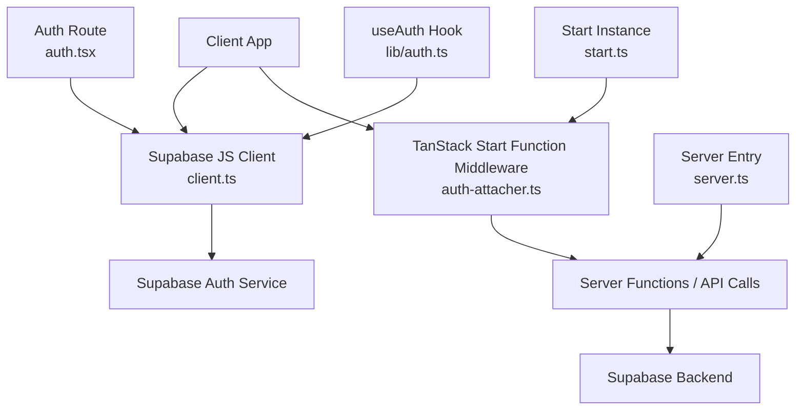
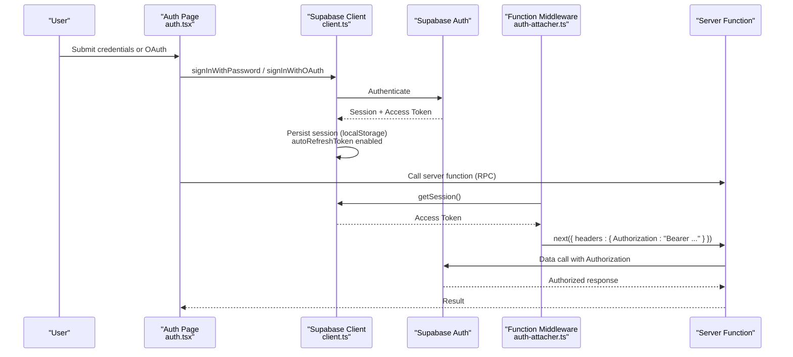
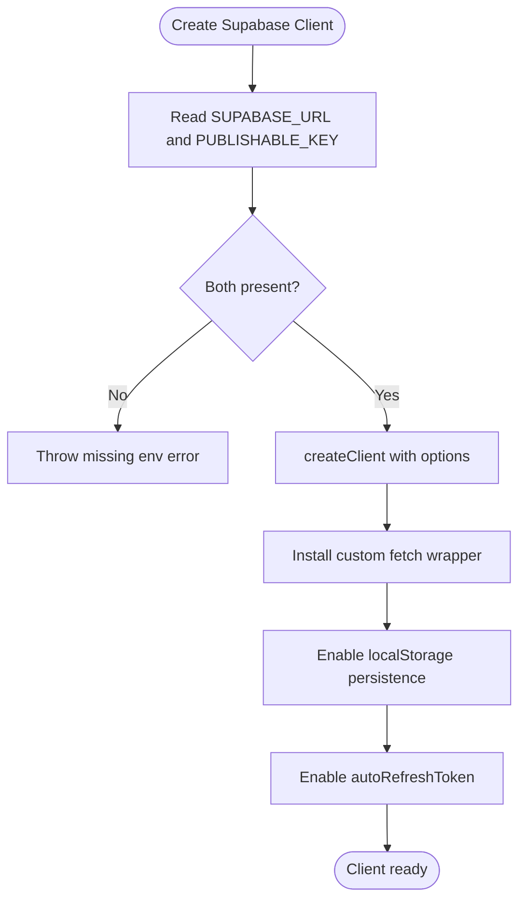
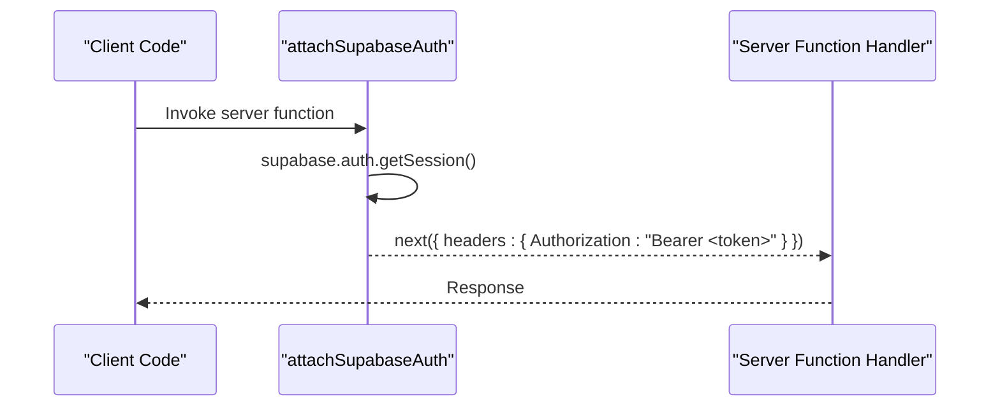
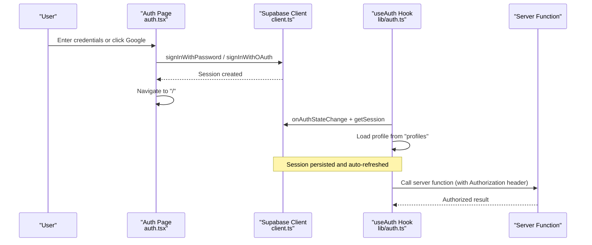
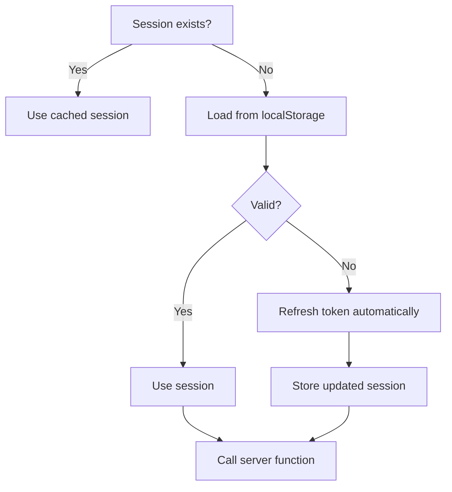
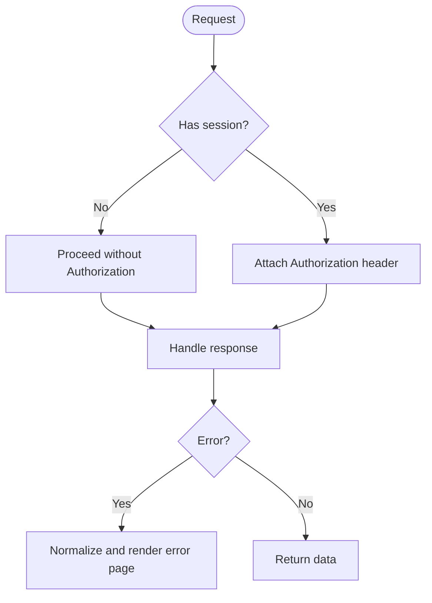
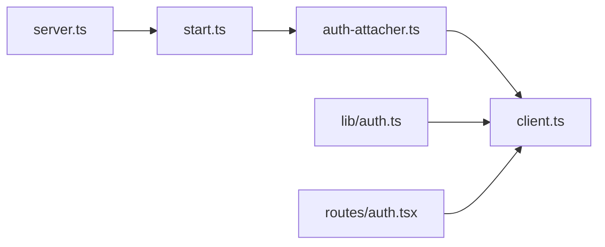

# Supabase Authentication Integration

<cite>
**Referenced Files in This Document**
- [auth-attacher.ts](file://src/integrations/supabase/auth-attacher.ts)
- [client.ts](file://src/integrations/supabase/client.ts)
- [types.ts](file://src/integrations/supabase/types.ts)
- [start.ts](file://src/start.ts)
- [server.ts](file://src/server.ts)
- [auth.ts](file://src/lib/auth.ts)
- [auth.tsx](file://src/routes/auth.tsx)
</cite>

## Table of Contents
1. Introduction
2. Project Structure
3. Core Components
4. Architecture Overview
5. Detailed Component Analysis
6. Dependency Analysis
7. Performance Considerations
8. Troubleshooting Guide
9. Conclusion
10. Appendices

## Introduction
This document explains the Supabase authentication integration used by the application. It covers how server functions receive authenticated context via middleware, how the client is configured and persists sessions, the end-to-end flow from login to data access, token refresh behavior, examples of protected routes and authenticated API calls, error handling strategies, and security considerations including key management and CORS.

## Project Structure
The authentication system spans a small set of focused files:
- Client initialization and fetch wrapper: src/integrations/supabase/client.ts
- Server function middleware that attaches the Supabase bearer token: src/integrations/supabase/auth-attacher.ts
- Middleware registration for TanStack Start: src/start.ts
- Frontend auth hook and profile management: src/lib/auth.ts
- Sign-in/sign-up route with OAuth support: src/routes/auth.tsx
- Database schema types (for typed queries): src/integrations/supabase/types.ts
- Global server entry and error normalization: src/server.ts

**Diagram sources**
- [client.ts:30-56](file://src/integrations/supabase/client.ts#L30-L56)
- [auth-attacher.ts:7-15](file://src/integrations/supabase/auth-attacher.ts#L7-L15)
- [start.ts:28-31](file://src/start.ts#L28-L31)
- [auth.tsx:46-93](file://src/routes/auth.tsx#L46-L93)
- [auth.ts:12-68](file://src/lib/auth.ts#L12-L68)
- [server.ts:187-204](file://src/server.ts#L187-L204)

**Section sources**
- [client.ts:1-69](file://src/integrations/supabase/client.ts#L1-L69)
- [auth-attacher.ts:1-16](file://src/integrations/supabase/auth-attacher.ts#L1-L16)
- [start.ts:1-32](file://src/start.ts#L1-L32)
- [auth.ts:1-70](file://src/lib/auth.ts#L1-L70)
- [auth.tsx:1-197](file://src/routes/auth.tsx#L1-L197)
- [types.ts:1-197](file://src/integrations/supabase/types.ts#L1-L197)
- [server.ts:1-205](file://src/server.ts#L1-L205)

## Core Components
- Supabase client configuration and session persistence:
  - Reads environment variables for URL and publishable key.
  - Installs a custom fetch wrapper that injects the apikey header and handles new-style keys.
  - Enables localStorage-based session persistence and automatic token refresh.
- Server function middleware:
  - Extracts the current session access token and attaches it as an Authorization header for server-side RPCs.
- Auth UI and hooks:
  - Provides sign-in, sign-up, and Google OAuth flows.
  - Maintains user identity and profile state on the client.

**Section sources**
- [client.ts:30-56](file://src/integrations/supabase/client.ts#L30-L56)
- [auth-attacher.ts:7-15](file://src/integrations/supabase/auth-attacher.ts#L7-L15)
- [auth.tsx:46-93](file://src/routes/auth.tsx#L46-L93)
- [auth.ts:12-68](file://src/lib/auth.ts#L12-L68)

## Architecture Overview
The authentication architecture integrates three layers:
- Client layer: Supabase JS client manages sessions, persists them in localStorage, and automatically refreshes tokens when needed.
- Middleware layer: TanStack Start function middleware intercepts server function calls and attaches the current Supabase access token to outgoing requests.
- Server layer: The server entry normalizes errors and proxies specific endpoints; authenticated server functions can rely on the injected Authorization header to enforce RLS or other policies.

**Diagram sources**
- [auth.tsx:46-93](file://src/routes/auth.tsx#L46-L93)
- [client.ts:30-56](file://src/integrations/supabase/client.ts#L30-L56)
- [auth-attacher.ts:7-15](file://src/integrations/supabase/auth-attacher.ts#L7-L15)

## Detailed Component Analysis

### Supabase Client Configuration and Fetch Wrapper
- Environment setup:
  - Reads VITE_SUPABASE_URL and VITE_SUPABASE_PUBLISHABLE_KEY at build time for the browser, falling back to process.env equivalents on the server.
  - Throws a clear error if either variable is missing.
- Custom fetch wrapper:
  - Ensures the apikey header is always present.
  - Removes Authorization if it incorrectly uses a new-style Supabase key as a bearer token.
- Session persistence and refresh:
  - Persists sessions to localStorage on the client.
  - Enables autoRefreshToken so expired tokens are refreshed transparently.

**Diagram sources**
- [client.ts:30-56](file://src/integrations/supabase/client.ts#L30-L56)

**Section sources**
- [client.ts:5-27](file://src/integrations/supabase/client.ts#L5-L27)
- [client.ts:30-56](file://src/integrations/supabase/client.ts#L30-L56)

### Server Function Middleware: Attaching Authentication Context
- Purpose:
  - Ensures every server function invoked from the client carries the current Supabase access token.
- Behavior:
  - Retrieves the current session and extracts the access token.
  - Adds an Authorization header with the bearer token before invoking the next handler.
- Registration:
  - Registered as a functionMiddleware in the Start instance so it runs around all server function RPCs.

**Diagram sources**
- [auth-attacher.ts:7-15](file://src/integrations/supabase/auth-attacher.ts#L7-L15)
- [start.ts:28-31](file://src/start.ts#L28-L31)

**Section sources**
- [auth-attacher.ts:1-16](file://src/integrations/supabase/auth-attacher.ts#L1-L16)
- [start.ts:21-31](file://src/start.ts#L21-L31)

### Authentication Flow: Login, Session Management, Data Access
- Sign-in/Sign-up:
  - Email/password and Google OAuth flows are implemented in the auth route.
  - On success, navigation redirects to the home route.
- Session persistence:
  - Supabase client persists the session in localStorage and refreshes tokens automatically.
- Profile loading:
  - The useAuth hook listens to auth state changes and loads the user’s profile from the profiles table.
- Data access:
  - Any server function called after login will include the Authorization header due to middleware, enabling backend enforcement of Row Level Security or other policies.

**Diagram sources**
- [auth.tsx:46-93](file://src/routes/auth.tsx#L46-L93)
- [client.ts:30-56](file://src/integrations/supabase/client.ts#L30-L56)
- [auth.ts:12-68](file://src/lib/auth.ts#L12-L68)
- [auth-attacher.ts:7-15](file://src/integrations/supabase/auth-attacher.ts#L7-L15)

**Section sources**
- [auth.tsx:40-93](file://src/routes/auth.tsx#L40-L93)
- [auth.ts:12-68](file://src/lib/auth.ts#L12-L68)

### Protected Routes and Authenticated API Calls
- Example: Protecting a server function
  - Ensure the function is invoked from the client after login. The middleware will attach the Authorization header automatically.
  - On the server, validate the request or rely on Supabase RLS to restrict data based on the authenticated user.
- Example: Protecting a client route
  - Use the useAuth hook to check readiness and userId before rendering sensitive content.
  - Redirect unauthenticated users to the auth route.

Note: Replace placeholders with your actual server function names and route paths.

[No sources needed since this section provides usage guidance without analyzing specific files]

### Token Refresh Mechanism and Automatic Session Handling
- Automatic refresh:
  - Enabled via client configuration, ensuring expired tokens are refreshed without manual intervention.
- Persistence:
  - Sessions are stored in localStorage on the client, surviving page reloads and restarts.
- Server context:
  - Each server function invocation retrieves the latest session and attaches the current access token.

**Diagram sources**
- [client.ts:30-56](file://src/integrations/supabase/client.ts#L30-L56)
- [auth-attacher.ts:7-15](file://src/integrations/supabase/auth-attacher.ts#L7-L15)

**Section sources**
- [client.ts:30-56](file://src/integrations/supabase/client.ts#L30-L56)
- [auth-attacher.ts:7-15](file://src/integrations/supabase/auth-attacher.ts#L7-L15)

### Error Handling for Authentication Failures, Expired Sessions, and Network Issues
- Client-side errors:
  - The auth route displays error messages returned by Supabase for sign-in, sign-up, and OAuth flows.
- Session issues:
  - If no session exists, the middleware attaches no Authorization header; server functions should handle missing auth appropriately.
- Server-side errors:
  - The server entry normalizes certain swallowed errors into readable HTML responses and logs detailed error information.

**Diagram sources**
- [auth.tsx:46-93](file://src/routes/auth.tsx#L46-L93)
- [auth-attacher.ts:7-15](file://src/integrations/supabase/auth-attacher.ts#L7-L15)
- [server.ts:21-46](file://src/server.ts#L21-L46)

**Section sources**
- [auth.tsx:46-93](file://src/routes/auth.tsx#L46-L93)
- [server.ts:21-46](file://src/server.ts#L21-L46)

### Security Considerations: Key Management and CORS
- Key management:
  - Use the publishable key for client-side operations; never expose secret keys in the browser bundle.
  - The client enforces the presence of the apikey header and avoids misusing new-style keys as bearer tokens.
- CORS:
  - For same-origin audio streaming, a server proxy is used to bypass upstream CORS restrictions.
  - Ensure your Supabase project allows your app’s origin and configure any required CORS settings in the Supabase dashboard.
- CSRF protection:
  - CSRF middleware is registered for server function handlers to mitigate cross-site request forgery.

**Section sources**
- [client.ts:9-27](file://src/integrations/supabase/client.ts#L9-L27)
- [server.ts:48-58](file://src/server.ts#L48-L58)
- [start.ts:21-26](file://src/start.ts#L21-L26)

## Dependency Analysis
Key dependencies and relationships:
- start.ts registers the auth-attacher middleware for all server functions.
- auth-attacher depends on the Supabase client to retrieve the current session.
- client.ts configures the Supabase client with environment variables and a custom fetch wrapper.
- lib/auth.ts consumes the Supabase client to manage user state and profile data.
- routes/auth.tsx performs authentication actions and navigates based on results.

**Diagram sources**
- [start.ts:28-31](file://src/start.ts#L28-L31)
- [auth-attacher.ts:7-15](file://src/integrations/supabase/auth-attacher.ts#L7-L15)
- [client.ts:30-56](file://src/integrations/supabase/client.ts#L30-L56)
- [auth.ts:12-68](file://src/lib/auth.ts#L12-L68)
- [auth.tsx:46-93](file://src/routes/auth.tsx#L46-L93)
- [server.ts:187-204](file://src/server.ts#L187-L204)

**Section sources**
- [start.ts:21-31](file://src/start.ts#L21-L31)
- [auth-attacher.ts:1-16](file://src/integrations/supabase/auth-attacher.ts#L1-L16)
- [client.ts:1-69](file://src/integrations/supabase/client.ts#L1-L69)
- [auth.ts:1-70](file://src/lib/auth.ts#L1-L70)
- [auth.tsx:1-197](file://src/routes/auth.tsx#L1-L197)
- [server.ts:1-205](file://src/server.ts#L1-L205)

## Performance Considerations
- Session persistence reduces repeated logins and network calls across page reloads.
- Automatic token refresh minimizes failed requests due to expired tokens.
- Server function middleware adds minimal overhead by retrieving the session once per call.
- Streaming proxy chunks large media payloads to avoid throttling and improve playback reliability.

[No sources needed since this section provides general guidance]

## Troubleshooting Guide
Common issues and resolutions:
- Missing environment variables:
  - Ensure VITE_SUPABASE_URL and VITE_SUPABASE_PUBLISHABLE_KEY are set for the client build and corresponding server environment variables are available during SSR.
- Unauthorized server function calls:
  - Verify that the user has an active session and that the middleware is registered as functionMiddleware.
- Network errors:
  - Check connectivity and Supabase service status; review server logs for normalized error pages.
- OAuth failures:
  - Confirm provider configuration and redirect URLs match your app’s origin.

**Section sources**
- [client.ts:30-44](file://src/integrations/supabase/client.ts#L30-L44)
- [start.ts:28-31](file://src/start.ts#L28-L31)
- [server.ts:21-46](file://src/server.ts#L21-L46)
- [auth.tsx:46-93](file://src/routes/auth.tsx#L46-L93)

## Conclusion
The Supabase integration provides a robust, secure authentication experience:
- The client manages sessions with persistence and automatic refresh.
- Server functions receive authenticated context via middleware, enabling reliable backend authorization.
- The auth route supports email/password and OAuth flows, while the useAuth hook streamlines client-side state management.
- Error handling and CSRF protection enhance resilience and security.

[No sources needed since this section summarizes without analyzing specific files]

## Appendices

### Environment Variables Reference
- Required for client build:
  - VITE_SUPABASE_URL
  - VITE_SUPABASE_PUBLISHABLE_KEY
- Required for server runtime (SSR):
  - SUPABASE_URL
  - SUPABASE_PUBLISHABLE_KEY

**Section sources**
- [client.ts:30-44](file://src/integrations/supabase/client.ts#L30-L44)

### Database Schema Types
- Typed database model definitions enable type-safe queries for tables such as profiles and user_library.

**Section sources**
- [types.ts:9-73](file://src/integrations/supabase/types.ts#L9-L73)