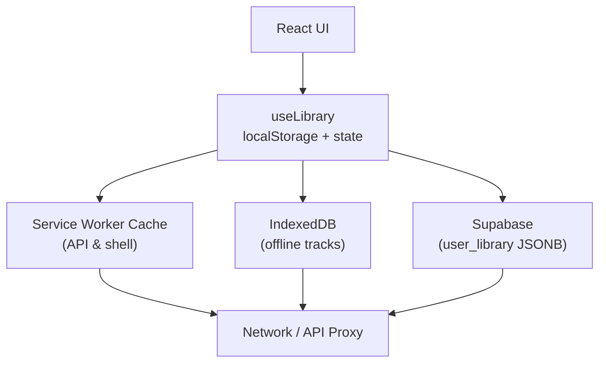
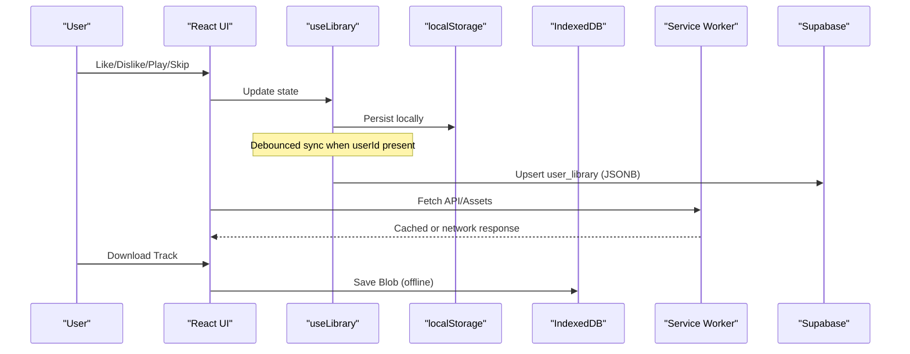
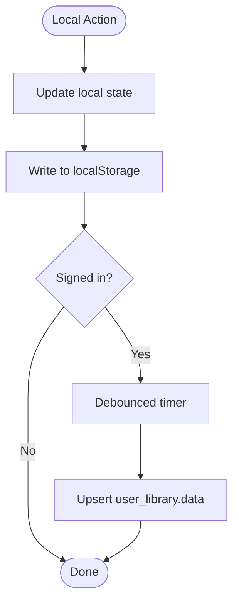
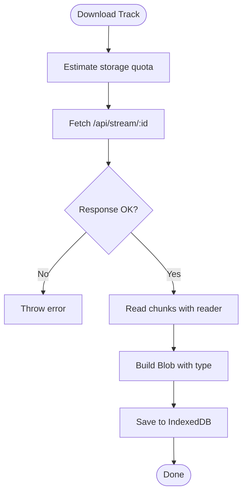
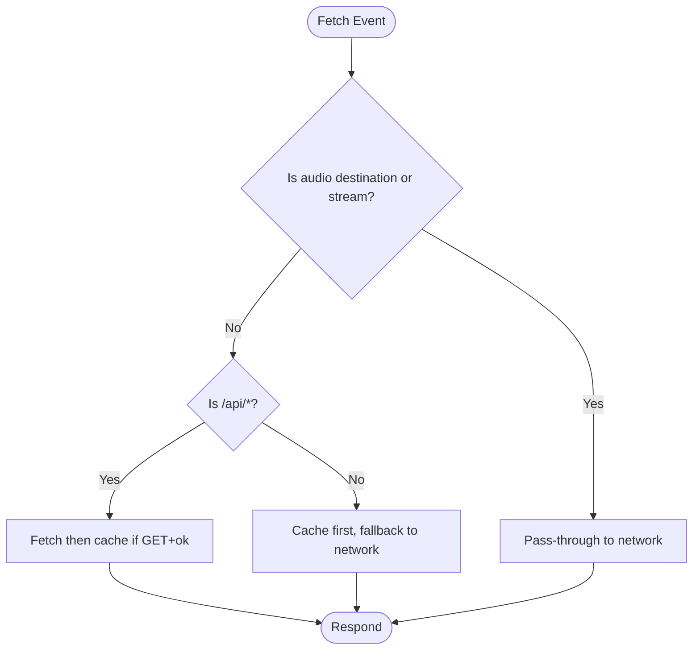
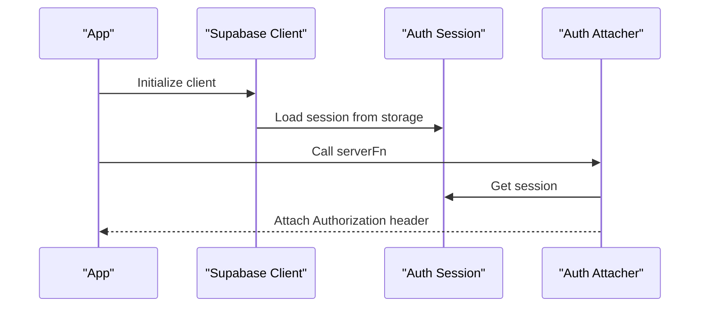
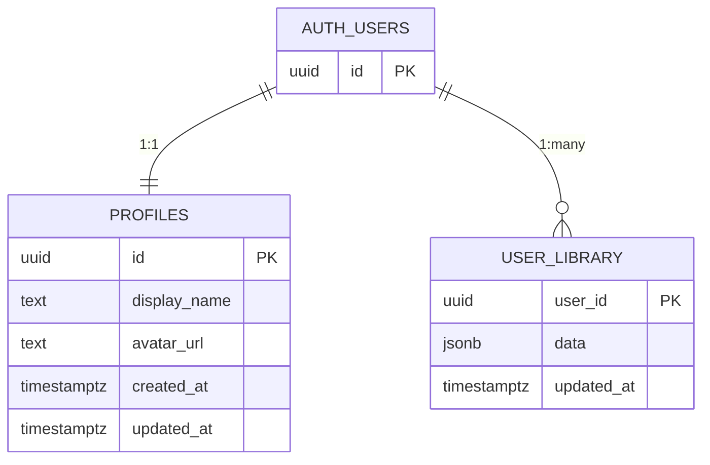
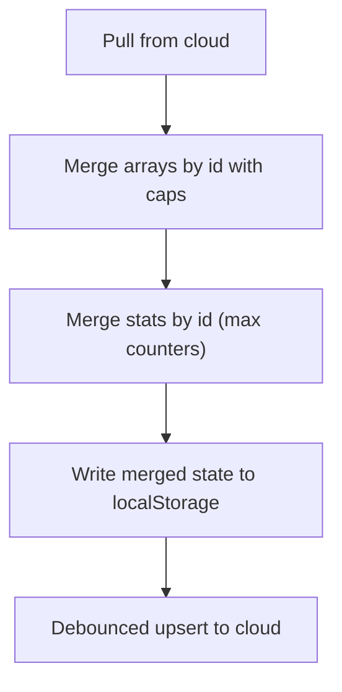
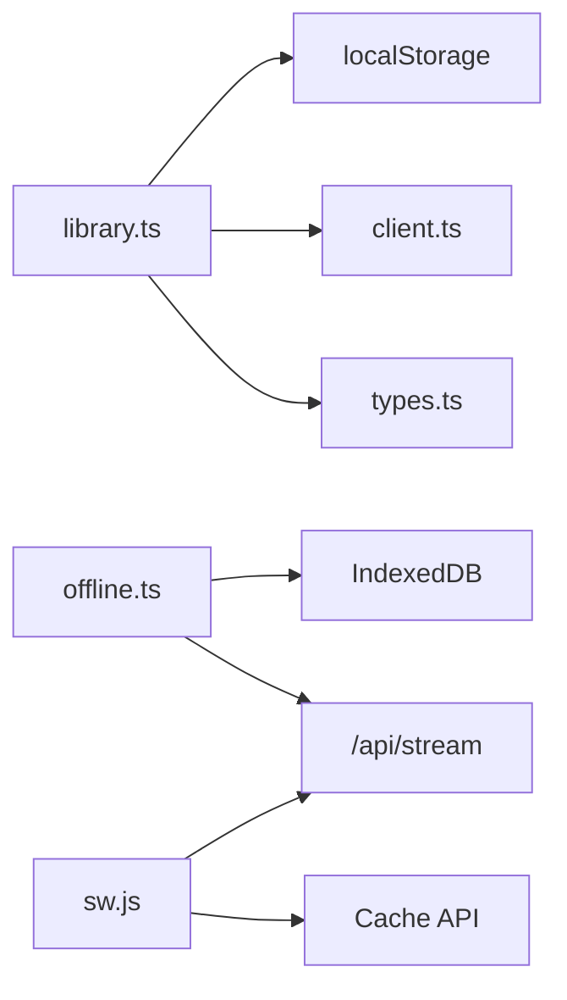

# Data Management

<cite>
**Referenced Files in This Document**
- [library.ts](file://src/lib/library.ts)
- [offline.ts](file://src/lib/offline.ts)
- [client.ts](file://src/integrations/supabase/client.ts)
- [auth-attacher.ts](file://src/integrations/supabase/auth-attacher.ts)
- [types.ts](file://src/integrations/supabase/types.ts)
- [20260808085443_8253f78c-652e-4cb4-8772-8818ce90215c.sql](file://supabase/migrations/20260808085443_8253f78c-652e-4cb4-8772-8818ce90215c.sql)
- [20260808085506_fb5fd43f-6504-4c96-8335-2aeac753c924.sql](file://supabase/migrations/20260808085506_fb5fd43f-6504-4c96-8335-2aeac753c924.sql)
- [sw.js](file://public/sw.js)
</cite>

## Table of Contents
1. [Introduction](#introduction)
2. [Project Structure](#project-structure)
3. [Core Components](#core-components)
4. [Architecture Overview](#architecture-overview)
5. [Detailed Component Analysis](#detailed-component-analysis)
6. [Dependency Analysis](#dependency-analysis)
7. [Performance Considerations](#performance-considerations)
8. [Troubleshooting Guide](#troubleshooting-guide)
9. [Conclusion](#conclusion)
10. [Appendices](#appendices)

## Introduction
This document explains the local-first data management architecture for a music app that persists user preferences, likes, playlists, and listening history on-device using localStorage and IndexedDB, with optional cloud synchronization to Supabase when the user is signed in. It covers offline capabilities (track downloads, blob storage), caching layers (service worker), sync algorithms for merging local and remote data, schema design, migration strategy, and performance techniques for large datasets.

## Project Structure
The data layer spans several modules:
- Local persistence and library state: [library.ts](file://src/lib/library.ts)
- Offline audio storage via IndexedDB: [offline.ts](file://src/lib/offline.ts)
- Service Worker caching for shell and API responses: [sw.js](file://public/sw.js)
- Supabase client and auth middleware: [client.ts](file://src/integrations/supabase/client.ts), [auth-attacher.ts](file://src/integrations/supabase/auth-attacher.ts)
- Database schema and migrations: [20260808085443_8253f78c-652e-4cb4-8772-8818ce90215c.sql](file://supabase/migrations/20260808085443_8253f78c-652e-4cb4-8772-8818ce90215c.sql), [20260808085506_fb5fd43f-6504-4c96-8335-2aeac753c924.sql](file://supabase/migrations/20260808085506_fb5fd43f-6504-4c96-8335-2aeac753c924.sql)
- Type definitions for Supabase tables: [types.ts](file://src/integrations/supabase/types.ts)

**Diagram sources**
- [library.ts:242-349](file://src/lib/library.ts#L242-L349)
- [offline.ts:24-141](file://src/lib/offline.ts#L24-L141)
- [sw.js:37-84](file://public/sw.js#L37-L84)
- [client.ts:30-67](file://src/integrations/supabase/client.ts#L30-L67)

**Section sources**
- [library.ts:1-646](file://src/lib/library.ts#L1-L646)
- [offline.ts:1-201](file://src/lib/offline.ts#L1-L201)
- [sw.js:1-90](file://public/sw.js#L1-L90)
- [client.ts:1-69](file://src/integrations/supabase/client.ts#L1-L69)
- [auth-attacher.ts:1-16](file://src/integrations/supabase/auth-attacher.ts#L1-L16)
- [types.ts:1-197](file://src/integrations/supabase/types.ts#L1-L197)
- [20260808085443_8253f78c-652e-4cb4-8772-8818ce90215c.sql:1-63](file://supabase/migrations/20260808085443_8253f78c-652e-4cb4-8772-8818ce90215c.sql#L1-L63)
- [20260808085506_fb5fd43f-6504-4c96-8335-2aeac753c924.sql:1-2](file://supabase/migrations/20260808085506_fb5fd43f-6504-4c96-8335-2aeac753c924.sql#L1-L2)

## Core Components
- Library state and persistence: A React hook manages likes, dislikes, history, playlists, settings, stats, and playback positions. It reads/writes to localStorage keys and optionally syncs to Supabase when authenticated.
- Offline storage: IndexedDB stores downloaded audio blobs keyed by track id, with metadata like size and savedAt. Includes quota checks and streaming download support.
- Service Worker: Caches app shell and API GET responses; bypasses audio streams to avoid bloating cache and to rely on explicit downloads.
- Supabase integration: Provides typed client, environment-based configuration, session persistence, and server-side auth attachment for RPC calls.

Key responsibilities:
- Local-first writes with immediate UI updates
- Debounced upsert to cloud for consistency across devices
- Merge strategies for conflict resolution between device and cloud
- Robust error handling and graceful degradation when offline or quota-limited

**Section sources**
- [library.ts:105-147](file://src/lib/library.ts#L105-L147)
- [library.ts:242-349](file://src/lib/library.ts#L242-L349)
- [offline.ts:58-141](file://src/lib/offline.ts#L58-L141)
- [sw.js:37-84](file://public/sw.js#L37-L84)
- [client.ts:30-67](file://src/integrations/supabase/client.ts#L30-L67)

## Architecture Overview
The system follows a local-first pattern:
- All user actions update local state and persist immediately to localStorage or IndexedDB.
- When online and authenticated, changes are debounced and upserted to Supabase.
- On sign-in, the app pulls the latest cloud copy and merges it into local state using deterministic merge functions.
- The service worker caches static assets and API responses to improve offline resilience. Audio content is explicitly downloaded to IndexedDB for offline playback.

**Diagram sources**
- [library.ts:242-349](file://src/lib/library.ts#L242-L349)
- [offline.ts:150-201](file://src/lib/offline.ts#L150-L201)
- [sw.js:37-84](file://public/sw.js#L37-L84)
- [client.ts:30-67](file://src/integrations/supabase/client.ts#L30-L67)

## Detailed Component Analysis

### Library and Local Persistence
- Data model: Tracks, Playlists, RecSettings, Stats, SavedPlayback, EpisodePosition.
- Storage keys: Distinct localStorage keys for likes, dislikes, history, playlists, settings, stats, playback, episode positions.
- Sync behavior:
  - Pull: On sign-in, fetches user_library row and merges arrays by id with limits to prevent unbounded growth.
  - Push: Debounced upsert of current local state to user_library.data JSONB.
- Conflict resolution:
  - Arrays merged by id with last-seen wins; duplicates removed; capped sizes applied during merge.
  - Stats merged by taking max counters per field to preserve highest observed values.
- Utilities: Replay mix, top artists, skipped labels, sequence brief derive insights from local stats/history.

**Diagram sources**
- [library.ts:242-349](file://src/lib/library.ts#L242-L349)

**Section sources**
- [library.ts:105-147](file://src/lib/library.ts#L105-L147)
- [library.ts:209-236](file://src/lib/library.ts#L209-L236)
- [library.ts:242-349](file://src/lib/library.ts#L242-L349)
- [library.ts:590-646](file://src/lib/library.ts#L590-L646)

### Offline Audio Storage (IndexedDB)
- Store: Object store named tracks with keyPath id.
- Operations: saveDownload, getBlob, listDownloads, removeDownload, clearDownloads, totalDownloadSize.
- Quota awareness: Uses navigator.storage.estimate to warn when remaining space is low before saving.
- Streaming download: Reads response body chunks, computes progress, and saves final Blob with correct MIME type.

**Diagram sources**
- [offline.ts:58-141](file://src/lib/offline.ts#L58-L141)
- [offline.ts:150-201](file://src/lib/offline.ts#L150-L201)

**Section sources**
- [offline.ts:10-48](file://src/lib/offline.ts#L10-L48)
- [offline.ts:58-141](file://src/lib/offline.ts#L58-L141)
- [offline.ts:150-201](file://src/lib/offline.ts#L150-L201)

### Service Worker Caching Strategy
- App shell caching: Pre-caches essential assets on install; cleans old caches on activate.
- API caching: Network-first for /api/* GET requests; falls back to cache on failure.
- Audio stream bypass: Requests to /api/stream and /api/range, or audio destinations, are not cached to avoid quota issues and redundant downloads.

**Diagram sources**
- [sw.js:7-33](file://public/sw.js#L7-L33)
- [sw.js:37-84](file://public/sw.js#L37-L84)

**Section sources**
- [sw.js:1-90](file://public/sw.js#L1-L90)

### Supabase Integration and Authentication
- Client setup: Environment-driven URL and publishable key; custom fetch wrapper sets apikey header and handles new-style keys.
- Session persistence: Uses localStorage to persist sessions and auto-refresh tokens.
- Server-side auth attachment: Middleware attaches access token to server function calls for secure RPCs.

**Diagram sources**
- [client.ts:30-67](file://src/integrations/supabase/client.ts#L30-L67)
- [auth-attacher.ts:7-15](file://src/integrations/supabase/auth-attacher.ts#L7-L15)

**Section sources**
- [client.ts:1-69](file://src/integrations/supabase/client.ts#L1-L69)
- [auth-attacher.ts:1-16](file://src/integrations/supabase/auth-attacher.ts#L1-L16)

### Data Models and Schema Design
- Local models: Track, Playlist, RecSettings, Stats, SavedPlayback, EpisodePosition.
- Cloud schema:
  - profiles: user profile linked to auth.users with RLS policies.
  - user_library: JSONB payload storing likes, dislikes, history, playlists, settings, stats per user_id with RLS policies and updated_at triggers.

**Diagram sources**
- [20260808085443_8253f78c-652e-4cb4-8772-8818ce90215c.sql:1-63](file://supabase/migrations/20260808085443_8253f78c-652e-4cb4-8772-8818ce90215c.sql#L1-L63)
- [types.ts:16-58](file://src/integrations/supabase/types.ts#L16-L58)

**Section sources**
- [library.ts:3-21](file://src/lib/library.ts#L3-L21)
- [library.ts:68-121](file://src/lib/library.ts#L68-L121)
- [20260808085443_8253f78c-652e-4cb4-8772-8818ce90215c.sql:20-33](file://supabase/migrations/20260808085443_8253f78c-652e-4cb4-8772-8818ce90215c.sql#L20-L33)
- [types.ts:16-58](file://src/integrations/supabase/types.ts#L16-L58)

### Migration Strategy
- Migrations define schema and security policies:
  - Create profiles and user_library tables with RLS.
  - Add triggers to update timestamps and initialize profiles on user creation.
  - Restrict execution of helper functions to service role only.
- Versioning: Each migration file represents an incremental change to the database schema.

**Section sources**
- [20260808085443_8253f78c-652e-4cb4-8772-8818ce90215c.sql:1-63](file://supabase/migrations/20260808085443_8253f78c-652e-4cb4-8772-8818ce90215c.sql#L1-L63)
- [20260808085506_fb5fd43f-6504-4c96-8335-2aeac753c924.sql:1-2](file://supabase/migrations/20260808085506_fb5fd43f-6504-4c96-8335-2aeac753c924.sql#L1-L2)

### Sync Algorithms and Conflict Resolution
- Merge by id: Deduplicates arrays by id, preserving insertion order and applying a maximum length cap.
- Stats merge: For each track id, takes the maximum of plays, skips, completions, and lastAt to reconcile concurrent updates.
- Pull-then-push flow:
  - Pull: On sign-in, fetches user_library and merges into local state, writing back to localStorage.
  - Push: Debounced upsert ensures eventual consistency without spamming the network.

**Diagram sources**
- [library.ts:209-236](file://src/lib/library.ts#L209-L236)
- [library.ts:262-349](file://src/lib/library.ts#L262-L349)

**Section sources**
- [library.ts:209-236](file://src/lib/library.ts#L209-L236)
- [library.ts:262-349](file://src/lib/library.ts#L262-L349)

### Caching Layers and Data Persistence Patterns
- localStorage: Small, structured data (likes, dislikes, history, playlists, settings, stats, playback, episode positions).
- IndexedDB: Large binary blobs (audio downloads) with metadata.
- Service Worker: Caches app shell and API GET responses; avoids caching audio streams.
- Pattern: Immediate local write for responsiveness; background sync to cloud for cross-device consistency.

**Section sources**
- [library.ts:105-147](file://src/lib/library.ts#L105-L147)
- [offline.ts:24-48](file://src/lib/offline.ts#L24-L48)
- [sw.js:37-84](file://public/sw.js#L37-L84)

### Backup and Restore Mechanisms
- Export/Import: Since all core data is stored in well-known localStorage keys and IndexedDB, backup can be implemented by serializing these stores and restoring them on demand.
- Cloud backup: Signed-in users have their library persisted to user_library JSONB, providing a cloud-backed restore point.

[No sources needed since this section provides general guidance]

### Data Consistency and Integrity Checks
- Idempotency: Merge-by-id prevents duplicate entries; stats merge uses max counters to avoid regressions.
- Limits: History and playlist arrays are truncated to bounded sizes to prevent unbounded growth.
- Security: Row-level security policies ensure users can only access their own data.

**Section sources**
- [library.ts:227-236](file://src/lib/library.ts#L227-L236)
- [library.ts:286-295](file://src/lib/library.ts#L286-L295)
- [20260808085443_8253f78c-652e-4cb4-8772-8818ce90215c.sql:20-33](file://supabase/migrations/20260808085443_8253f78c-652e-4cb4-8772-8818ce90215c.sql#L20-L33)

### Performance Optimization Techniques
- Debounced sync: Reduces network calls by batching updates.
- Array capping: Limits history and playlist sizes to control memory usage.
- Streaming downloads: Reads chunks with progress reporting to handle large files efficiently.
- Quota checks: Warns when storage is running low to prevent failures.
- Service Worker caching: Improves load times and reduces network usage for non-audio resources.

**Section sources**
- [library.ts:321-349](file://src/lib/library.ts#L321-L349)
- [library.ts:286-295](file://src/lib/library.ts#L286-L295)
- [offline.ts:58-83](file://src/lib/offline.ts#L58-L83)
- [offline.ts:150-201](file://src/lib/offline.ts#L150-L201)
- [sw.js:37-84](file://public/sw.js#L37-L84)

## Dependency Analysis
- useLibrary depends on:
  - localStorage for immediate persistence
  - Supabase client for optional cloud sync
  - Types for runtime safety
- Offline module depends on:
  - IndexedDB for blob storage
  - Network proxy for streaming audio
- Service Worker depends on:
  - Cache API for asset and API caching
  - Fetch event for request interception

**Diagram sources**
- [library.ts:242-349](file://src/lib/library.ts#L242-L349)
- [offline.ts:58-141](file://src/lib/offline.ts#L58-L141)
- [sw.js:37-84](file://public/sw.js#L37-L84)
- [client.ts:30-67](file://src/integrations/supabase/client.ts#L30-L67)
- [types.ts:16-58](file://src/integrations/supabase/types.ts#L16-L58)

**Section sources**
- [library.ts:242-349](file://src/lib/library.ts#L242-L349)
- [offline.ts:58-141](file://src/lib/offline.ts#L58-L141)
- [sw.js:37-84](file://public/sw.js#L37-L84)
- [client.ts:30-67](file://src/integrations/supabase/client.ts#L30-L67)
- [types.ts:16-58](file://src/integrations/supabase/types.ts#L16-L58)

## Performance Considerations
- Prefer local writes for responsiveness; batch cloud sync with debounce.
- Cap array sizes to avoid excessive memory usage.
- Use streaming downloads with progress feedback for large audio files.
- Leverage service worker caching for faster app startup and API responses.
- Monitor storage quota and warn users when nearing limits.

[No sources needed since this section provides general guidance]

## Troubleshooting Guide
- Missing Supabase environment variables: The client throws an error indicating missing VITE_SUPABASE_URL or VITE_SUPABASE_PUBLISHABLE_KEY.
- IndexedDB unavailable: Offline module rejects with an error if indexedDB is undefined.
- Storage quota warnings: Offline module logs warnings when remaining storage is low.
- Sync failures: Library logs warnings when Supabase upsert fails; check network connectivity and RLS policies.

**Section sources**
- [client.ts:36-44](file://src/integrations/supabase/client.ts#L36-L44)
- [offline.ts:24-26](file://src/lib/offline.ts#L24-L26)
- [offline.ts:58-72](file://src/lib/offline.ts#L58-L72)
- [library.ts:321-349](file://src/lib/library.ts#L321-L349)

## Conclusion
The application implements a robust local-first data management architecture that prioritizes immediate responsiveness and offline capability while offering seamless cloud synchronization for signed-in users. Through careful merge strategies, caching layers, and performance optimizations, it delivers a reliable experience across varying network conditions and device constraints.

[No sources needed since this section summarizes without analyzing specific files]

## Appendices

### API and Storage Summary
- Local keys: likes, dislikes, history, playlists, settings, stats, playback, episode positions.
- IndexedDB store: tracks (id, track, blob, size, savedAt).
- Service Worker caches: app shell and API GET responses; audio streams bypassed.
- Supabase tables: profiles, user_library (JSONB).

**Section sources**
- [library.ts:105-147](file://src/lib/library.ts#L105-L147)
- [offline.ts:14-20](file://src/lib/offline.ts#L14-L20)
- [sw.js:37-84](file://public/sw.js#L37-L84)
- [20260808085443_8253f78c-652e-4cb4-8772-8818ce90215c.sql:20-33](file://supabase/migrations/20260808085443_8253f78c-652e-4cb4-8772-8818ce90215c.sql#L20-L33)