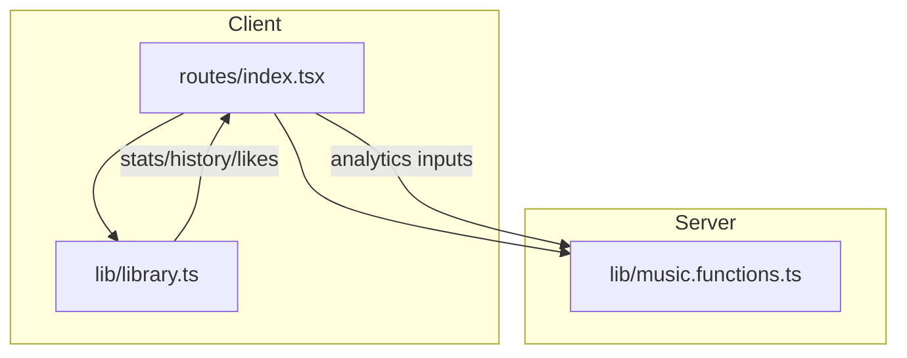
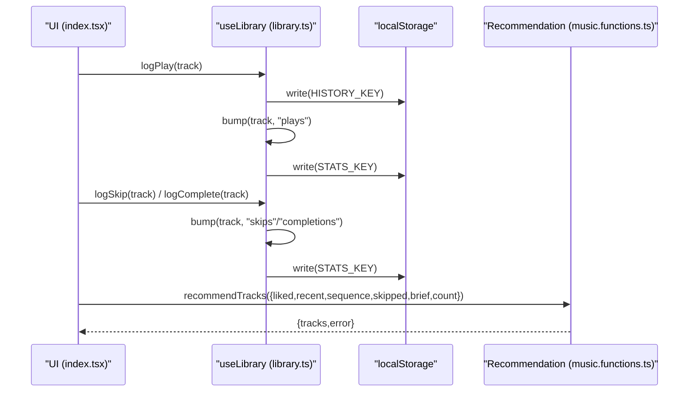
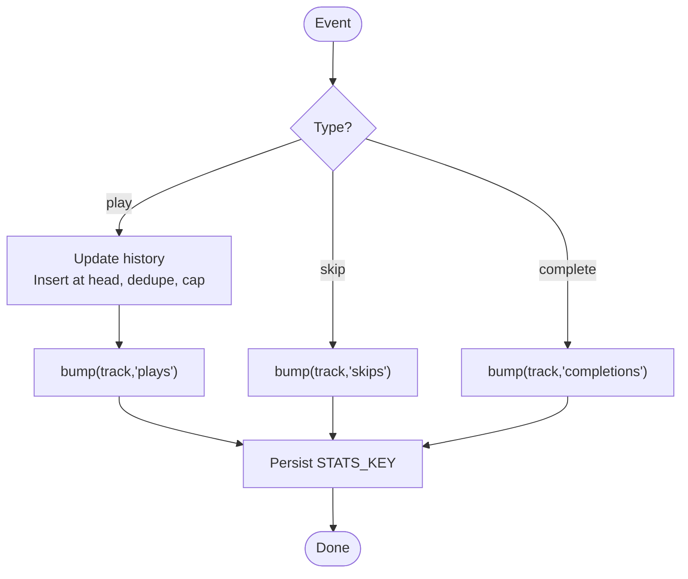
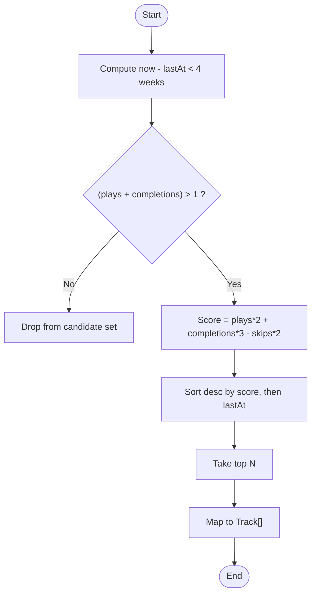
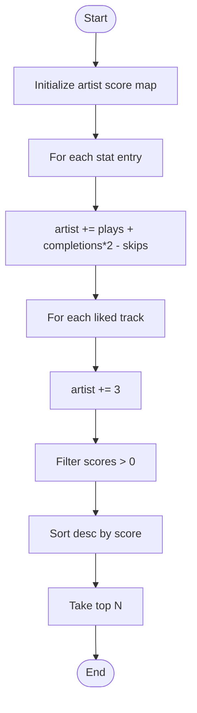
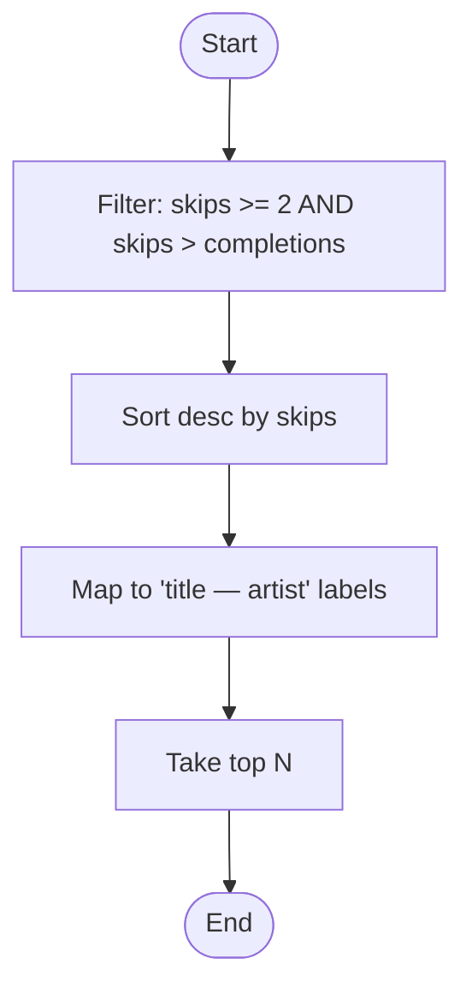
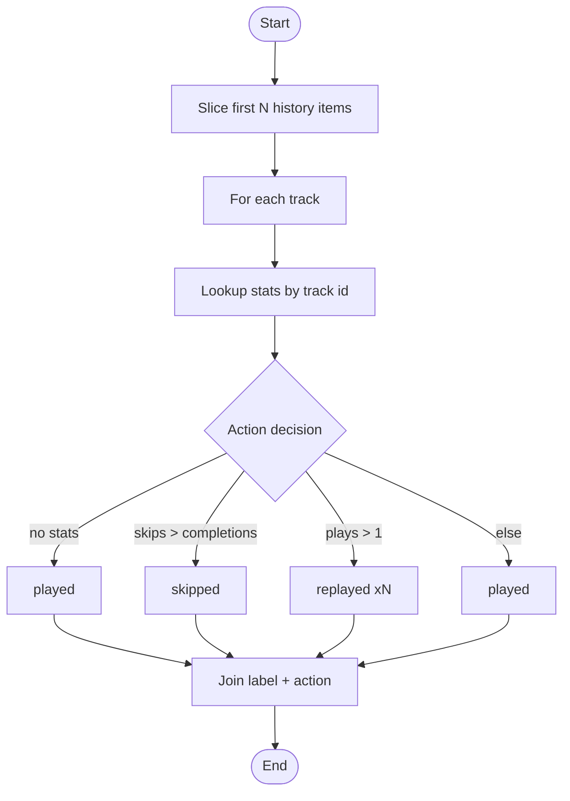
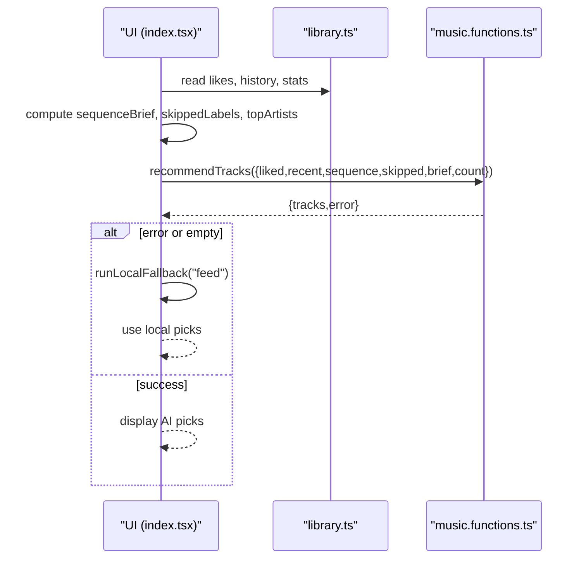
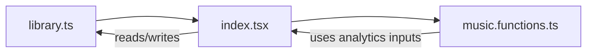

# Behavioral Analytics

<cite>
**Referenced Files in This Document**
- [library.ts](file://src/lib/library.ts)
- [index.tsx](file://src/routes/index.tsx)
- [music.functions.ts](file://src/lib/music.functions.ts)
</cite>

## Table of Contents
1. [Introduction](#introduction)
2. [Project Structure](#project-structure)
3. [Core Components](#core-components)
4. [Architecture Overview](#architecture-overview)
5. [Detailed Component Analysis](#detailed-component-analysis)
6. [Dependency Analysis](#dependency-analysis)
7. [Performance Considerations](#performance-considerations)
8. [Troubleshooting Guide](#troubleshooting-guide)
9. [Conclusion](#conclusion)

## Introduction
This document explains the behavioral analytics system that tracks user interactions to build preference profiles and power recommendations. It covers how plays, skips, and completions are recorded with automatic timestamp updates; how recent listening history is annotated with actions; how frequently played songs are identified over a four-week window using weighted scoring; how artists are ranked by combined metrics including likes; how consistently skipped content is detected for negative signals; and how these analytics feed into both AI-driven and local recommendation engines.

## Project Structure
The behavioral analytics system lives primarily in the library module and is consumed by the main route and server-side recommendation functions:
- Data model and tracking logic: library.ts
- UI integration and analytics usage: index.tsx
- Server-side recommendation pipelines that consume analytics: music.functions.ts

**Diagram sources**
- [library.ts:242-350](file://src/lib/library.ts#L242-L350)
- [index.tsx:170-196](file://src/routes/index.tsx#L170-L196)
- [music.functions.ts:58-137](file://src/lib/music.functions.ts#L58-L137)

**Section sources**
- [library.ts:112-121](file://src/lib/library.ts#L112-L121)
- [index.tsx:170-196](file://src/routes/index.tsx#L170-L196)
- [music.functions.ts:58-137](file://src/lib/music.functions.ts#L58-L137)

## Core Components
- PlayStat and Stats: per-track counters for plays, skips, completions, and last activity time.
- bump: increments a specific counter and refreshes lastAt automatically.
- logPlay, logSkip, logComplete: high-level actions that update history and stats.
- replayMix: identifies frequently played songs from the last 4 weeks using weighted scoring.
- topArtists: ranks artists by combined metrics (plays, completions, dislikes, and explicit likes).
- skippedLabels: identifies consistently skipped content as negative preference signals.
- sequenceBrief: generates a concise recent listening history with action annotations.

These components persist data locally and sync across devices when signed in.

**Section sources**
- [library.ts:112-121](file://src/lib/library.ts#L112-L121)
- [library.ts:384-411](file://src/lib/library.ts#L384-L411)
- [library.ts:593-645](file://src/lib/library.ts#L593-L645)

## Architecture Overview
Behavioral events flow from the UI into the library hook, which updates local state and persists changes. The same stats and history are then used to compute analytics summaries and feed them into recommendation functions.

**Diagram sources**
- [library.ts:397-411](file://src/lib/library.ts#L397-L411)
- [music.functions.ts:58-137](file://src/lib/music.functions.ts#L58-L137)
- [index.tsx:612-649](file://src/routes/index.tsx#L612-L649)

## Detailed Component Analysis

### Tracking Events: bump, logPlay, logSkip, logComplete
- bump(track, field):
  - Updates the corresponding counter (plays, skips, or completions) for the track.
  - Sets lastAt to the current timestamp on every update.
  - Persists updated stats to localStorage and merges into React state.
- logPlay(track):
  - Inserts the track at the front of the history list (deduplicated), capped at a fixed size.
  - Persists history to localStorage.
  - Calls bump(track, "plays").
- logSkip(track):
  - Calls bump(track, "skips").
- logComplete(track):
  - Calls bump(track, "completions").

**Diagram sources**
- [library.ts:384-411](file://src/lib/library.ts#L384-L411)

**Section sources**
- [library.ts:384-411](file://src/lib/library.ts#L384-L411)

### replayMix: Frequently Played Songs (Last 4 Weeks)
- Time window: last 4 weeks based on lastAt timestamps.
- Filter: only tracks where total engagement (plays + completions) exceeds 1.
- Scoring: weighted formula that rewards plays and completions and penalizes skips.
- Sorting: by score descending, then by most recent lastAt.
- Output: top N tracks (default 30).

**Diagram sources**
- [library.ts:590-603](file://src/lib/library.ts#L590-L603)

**Section sources**
- [library.ts:590-603](file://src/lib/library.ts#L590-L603)

### topArtists: Ranked Artists by Combined Metrics
- Aggregates per artist:
  - Adds plays and completions (weighted higher) and subtracts skips.
  - Adds bonus points for explicit likes.
- Filters out non-positive scores.
- Sorts by score descending and returns top N artist names.

**Diagram sources**
- [library.ts:605-621](file://src/lib/library.ts#L605-L621)

**Section sources**
- [library.ts:605-621](file://src/lib/library.ts#L605-L621)

### skippedLabels: Negative Preference Signals
- Identifies tracks with repeated skips relative to completions.
- Threshold: at least two skips and more skips than completions.
- Sorts by skip count descending and returns labels for top N entries.

**Diagram sources**
- [library.ts:623-630](file://src/lib/library.ts#L623-L630)

**Section sources**
- [library.ts:623-630](file://src/lib/library.ts#L623-L630)

### sequenceBrief: Recent Listening History with Actions
- Takes the recent history list and annotates each item with an action derived from stats:
  - If no stats: "played".
  - If skips exceed completions: "skipped".
  - If plays > 1: "replayed xN".
  - Otherwise: "played".
- Returns a concise array of strings describing recent behavior.

**Diagram sources**
- [library.ts:632-645](file://src/lib/library.ts#L632-L645)

**Section sources**
- [library.ts:632-645](file://src/lib/library.ts#L632-L645)

### Integration with Recommendation Engine
- The UI composes analytics into prompts for both AI and local recommendation paths:
  - Liked tracks, recent history, sequence brief, skipped labels, top artists, and tuning brief.
- AI path:
  - Sends structured context to a server function that builds a prompt and calls an AI model to return recommended tracks.
- Local fallback:
  - Uses top artists and other heuristics to generate picks without AI.

**Diagram sources**
- [index.tsx:247-324](file://src/routes/index.tsx#L247-L324)
- [index.tsx:612-649](file://src/routes/index.tsx#L612-L649)
- [music.functions.ts:58-137](file://src/lib/music.functions.ts#L58-L137)

**Section sources**
- [index.tsx:247-324](file://src/routes/index.tsx#L247-L324)
- [index.tsx:612-649](file://src/routes/index.tsx#L612-L649)
- [music.functions.ts:58-137](file://src/lib/music.functions.ts#L58-L137)

## Dependency Analysis
- library.ts defines core types and analytics functions and exposes them to the UI.
- index.tsx consumes useLibrary and analytics functions to drive UI features and recommendation requests.
- music.functions.ts consumes analytics-derived inputs to construct prompts and fetch recommendations.

**Diagram sources**
- [library.ts:242-350](file://src/lib/library.ts#L242-L350)
- [index.tsx:170-196](file://src/routes/index.tsx#L170-L196)
- [music.functions.ts:58-137](file://src/lib/music.functions.ts#L58-L137)

**Section sources**
- [library.ts:242-350](file://src/lib/library.ts#L242-L350)
- [index.tsx:170-196](file://src/routes/index.tsx#L170-L196)
- [music.functions.ts:58-137](file://src/lib/music.functions.ts#L58-L137)

## Performance Considerations
- History and stats are persisted to localStorage on each change. Ensure operations remain efficient by keeping lists bounded (e.g., history capped at a fixed size).
- Stats merging during account sync uses max-based aggregation to avoid regressions and keep lastAt up-to-date.
- Analytics computations (replayMix, topArtists, skippedLabels, sequenceBrief) iterate over stats and history; consider memoization in the UI to avoid recomputation on unrelated renders.
- Debounced syncing to the cloud reduces network overhead while preserving consistency.

[No sources needed since this section provides general guidance]

## Troubleshooting Guide
- Missing or stale analytics:
  - Verify that logPlay/logSkip/logComplete are called appropriately when playback events occur.
  - Check that stats are written to localStorage and merged correctly on sign-in.
- Incorrect rankings:
  - Confirm thresholds and weights in replayMix and topArtists align with desired behavior.
  - Validate that likes contribute positively to artist scores.
- SequenceBrief anomalies:
  - Ensure stats exist for recently played tracks; otherwise defaults to "played".
  - Confirm that skips vs completions logic matches expected user behavior.

**Section sources**
- [library.ts:384-411](file://src/lib/library.ts#L384-L411)
- [library.ts:593-645](file://src/lib/library.ts#L593-L645)

## Conclusion
The behavioral analytics system captures granular interaction signals (plays, skips, completions) and transforms them into actionable insights: frequent replays, top artists, negative signals, and annotated recent history. These analytics directly inform both AI-powered and local recommendation engines, enabling personalized mixes and feeds that reflect actual listening behavior and explicit preferences.

[No sources needed since this section summarizes without analyzing specific files]