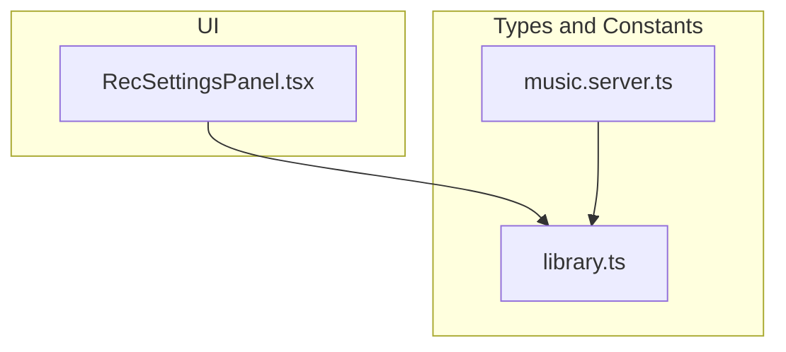
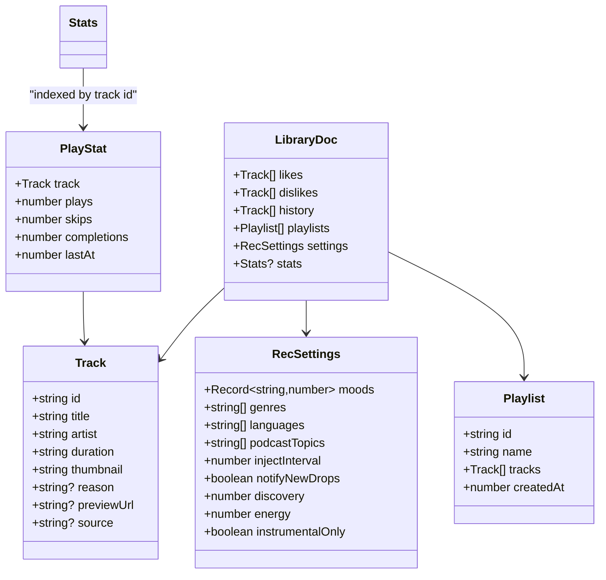
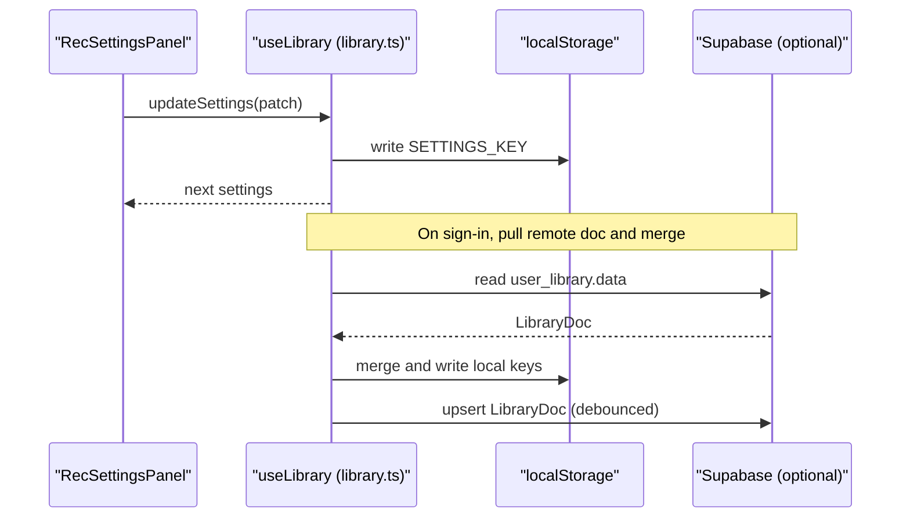
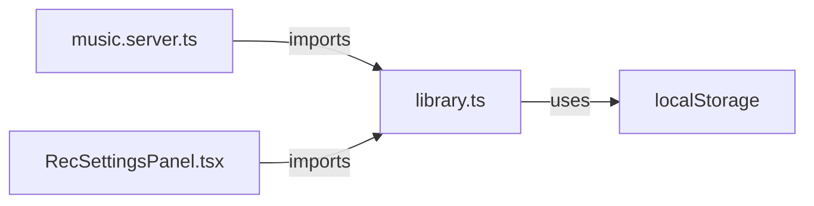

# Core Data Models

<cite>
**Referenced Files in This Document**
- [library.ts](file://src/lib/library.ts)
- [music.server.ts](file://src/lib/music.server.ts)
- [RecSettingsPanel.tsx](file://src/components/music/RecSettingsPanel.tsx)
</cite>

## Table of Contents
1. [Introduction](#introduction)
2. [Project Structure](#project-structure)
3. [Core Components](#core-components)
4. [Architecture Overview](#architecture-overview)
5. [Detailed Component Analysis](#detailed-component-analysis)
6. [Dependency Analysis](#dependency-analysis)
7. [Performance Considerations](#performance-considerations)
8. [Troubleshooting Guide](#troubleshooting-guide)
9. [Conclusion](#conclusion)

## Introduction
This document describes the core data models used by the local storage system for music and podcast recommendations. It focuses on the types that represent tracks, playlists, recommendation settings, behavioral statistics, and the composite user library document. It also documents the predefined constant arrays that constrain user choices for genres, languages, podcast topics, and moods.

## Project Structure
The core data models are defined primarily in a single module that centralizes types, constants, defaults, and persistence helpers. A server-side type is also exported to keep client and server representations aligned. UI components consume these models to render configuration panels and operate on user data.

**Diagram sources**
- [library.ts:3-121](file://src/lib/library.ts#L3-L121)
- [music.server.ts:1-13](file://src/lib/music.server.ts#L1-L13)
- [RecSettingsPanel.tsx:1-15](file://src/components/music/RecSettingsPanel.tsx#L1-L15)

**Section sources**
- [library.ts:3-121](file://src/lib/library.ts#L3-L121)
- [music.server.ts:1-13](file://src/lib/music.server.ts#L1-L13)
- [RecSettingsPanel.tsx:1-15](file://src/components/music/RecSettingsPanel.tsx#L1-L15)

## Core Components
This section summarizes each model and its role in the local storage system.

- Track: Represents a playable media item with identity, metadata, optional preview URL, and source provider.
- Playlist: A named collection of tracks with creation timestamp.
- RecSettings: User preference object controlling recommendation behavior (mood weights, genre/language/topic filters, injection cadence, notifications, discovery vs familiarity, energy target, instrumental-only mode).
- PlayStat: Per-track behavioral counters and last activity timestamp.
- Stats: Index of PlayStat entries keyed by track id.
- LibraryDoc: Composite snapshot of all user data persisted locally and synced to the account.

**Section sources**
- [library.ts:3-21](file://src/lib/library.ts#L3-L21)
- [library.ts:68-103](file://src/lib/library.ts#L68-L103)
- [library.ts:113-121](file://src/lib/library.ts#L113-L121)
- [library.ts:200-207](file://src/lib/library.ts#L200-L207)
- [music.server.ts:1-13](file://src/lib/music.server.ts#L1-L13)

## Architecture Overview
The models form the backbone of a local-first library. Types define the shape of data; constants constrain inputs; defaults provide sensible starting points; and utilities persist and merge state across sessions and devices.

**Diagram sources**
- [library.ts:3-21](file://src/lib/library.ts#L3-L21)
- [library.ts:68-103](file://src/lib/library.ts#L68-L103)
- [library.ts:113-121](file://src/lib/library.ts#L113-L121)
- [library.ts:200-207](file://src/lib/library.ts#L200-L207)

## Detailed Component Analysis

### Track
- Purpose: Canonical representation of a playable item across the app.
- Key properties:
  - id: Unique identifier for the track.
  - title: Display title.
  - artist: Artist name.
  - duration: Human-readable duration string.
  - thumbnail: Image URL for cover art.
  - reason: Optional AI recommendation reason shown in feeds.
  - previewUrl: Optional direct audio URL that bypasses streaming proxy.
  - source: Provider tag indicating origin ("youtube" or "deezer").
- Notes: The same shape is exported from the server module to keep client/server contracts consistent.

**Section sources**
- [library.ts:3-14](file://src/lib/library.ts#L3-L14)
- [music.server.ts:1-13](file://src/lib/music.server.ts#L1-L13)

### Playlist
- Purpose: User-created collections of tracks.
- Key properties:
  - id: Unique playlist identifier.
  - name: Display name.
  - tracks: Ordered list of Track objects.
  - createdAt: Creation time as epoch milliseconds.

**Section sources**
- [library.ts:16-21](file://src/lib/library.ts#L16-L21)

### RecSettings
- Purpose: Encapsulates user preferences that guide recommendation logic.
- Fields:
  - moods: Weighted scores per mood (0–100), driving mood-based selection.
  - genres: Selected preferred genres.
  - languages: Selected preferred languages.
  - podcastTopics: Topics to prioritize when building podcast mixes.
  - injectInterval: Frequency to insert fresh releases into the queue (0 disables).
  - notifyNewDrops: Whether to send browser notifications for new drops from favorite artists.
  - discovery: Balance between familiar hits and deep cuts (0–100).
  - energy: Target energy level (0–100).
  - instrumentalOnly: When true, only instrumental tracks are recommended.
- Defaults: A default instance initializes moods from MOODS with neutral weights and reasonable defaults for other fields.

**Section sources**
- [library.ts:68-103](file://src/lib/library.ts#L68-L103)

### PlayStat
- Purpose: Behavioral signal per track to inform future recommendations.
- Fields:
  - track: The associated Track object.
  - plays: Number of times played.
  - skips: Number of times skipped.
  - completions: Number of times completed.
  - lastAt: Timestamp of last recorded activity.

**Section sources**
- [library.ts:113-119](file://src/lib/library.ts#L113-L119)

### Stats
- Purpose: Record of PlayStat entries indexed by track id for efficient lookup and aggregation.
- Shape: Map-like record where keys are track ids and values are PlayStat.

**Section sources**
- [library.ts:121-121](file://src/lib/library.ts#L121-L121)

### LibraryDoc
- Purpose: Composite snapshot of all user data persisted locally and optionally synced to the cloud.
- Fields:
  - likes: Liked tracks.
  - dislikes: Disliked tracks.
  - history: Recent listening history.
  - playlists: User playlists.
  - settings: Recommendation settings.
  - stats: Optional behavioral statistics.

**Section sources**
- [library.ts:200-207](file://src/lib/library.ts#L200-L207)

### Constants
These arrays constrain and populate UI controls for recommendation tuning.

- GENRES: Predefined list of music genres available for selection.
- LANGUAGES: Supported language filters for content discovery.
- PODCAST_TOPICS: Topic categories used to tailor podcast recommendations.
- MOODS: Mood labels whose weights are adjustable via sliders.

Usage: These constants are consumed by the recommendation settings panel to render selectable options and validate inputs.

**Section sources**
- [library.ts:23-66](file://src/lib/library.ts#L23-L66)
- [library.ts:80-91](file://src/lib/library.ts#L80-L91)
- [RecSettingsPanel.tsx:1-15](file://src/components/music/RecSettingsPanel.tsx#L1-L15)

## Architecture Overview
The models integrate with local storage and optional cloud sync. Defaults ensure a valid initial state; constants constrain user input; and utilities merge and persist changes safely.

**Diagram sources**
- [library.ts:242-349](file://src/lib/library.ts#L242-L349)
- [library.ts:125-143](file://src/lib/library.ts#L125-L143)
- [RecSettingsPanel.tsx:17-61](file://src/components/music/RecSettingsPanel.tsx#L17-L61)

## Detailed Component Analysis

### Track Model Details
- Identity and display: id, title, artist, duration, thumbnail.
- Optional enrichment: reason for AI-driven picks; previewUrl for direct playback; source provider for routing playback logic.
- Cross-module alignment: The server-side Track type mirrors the client definition to maintain consistency during API interactions.

**Section sources**
- [library.ts:3-14](file://src/lib/library.ts#L3-L14)
- [music.server.ts:1-13](file://src/lib/music.server.ts#L1-L13)

### Playlist Model Details
- Tracks are stored as full Track objects within the playlist.
- Creation time enables sorting and lifecycle management.

**Section sources**
- [library.ts:16-21](file://src/lib/library.ts#L16-L21)

### RecSettings Model Details
- Moods: A map of mood label to weight (0–100). Defaults initialize all moods to a neutral value using the MOODS array.
- Filters: Genres, languages, and podcast topics are arrays of strings selected by the user.
- Injection: injectInterval controls how often fresh releases are inserted into the queue.
- Notifications: notifyNewDrops toggles browser notifications for new releases from favorite artists.
- Discovery and energy: discovery balances familiarity vs deep cuts; energy targets overall intensity.
- Instrumental-only: instrumentalOnly restricts recommendations to instrumentals.

**Section sources**
- [library.ts:68-103](file://src/lib/library.ts#L68-L103)
- [library.ts:80-91](file://src/lib/library.ts#L80-L91)

### PlayStat and Stats Model Details
- PlayStat captures per-track engagement metrics and recency.
- Stats indexes these records by track id for O(1) access and easy aggregation.
- Utilities increment counters and update timestamps on play, skip, and completion events.

**Section sources**
- [library.ts:113-121](file://src/lib/library.ts#L113-L121)
- [library.ts:384-411](file://src/lib/library.ts#L384-L411)

### LibraryDoc Model Details
- Aggregates all user data: likes, dislikes, history, playlists, settings, and optional stats.
- Used as the canonical payload for local persistence and cloud synchronization.

**Section sources**
- [library.ts:200-207](file://src/lib/library.ts#L200-L207)
- [library.ts:321-349](file://src/lib/library.ts#L321-L349)

### Constants Usage
- GENRES, LANGUAGES, PODCAST_TOPICS, MOODS are imported by the settings panel to render selectable options and validate user input.
- DEFAULT_SETTINGS initializes moods from MOODS and sets sensible defaults for other fields.

**Section sources**
- [library.ts:23-66](file://src/lib/library.ts#L23-L66)
- [library.ts:80-103](file://src/lib/library.ts#L80-L103)
- [RecSettingsPanel.tsx:1-15](file://src/components/music/RecSettingsPanel.tsx#L1-L15)

## Dependency Analysis
- Types are shared between client and server modules to ensure consistent payloads.
- UI consumes constants and types to build configuration interfaces.
- Local storage keys encapsulate each domain (likes, dislikes, history, playlists, settings, stats) to isolate concerns.

**Diagram sources**
- [music.server.ts:1-13](file://src/lib/music.server.ts#L1-L13)
- [library.ts:125-143](file://src/lib/library.ts#L125-L143)
- [RecSettingsPanel.tsx:1-15](file://src/components/music/RecSettingsPanel.tsx#L1-L15)

**Section sources**
- [music.server.ts:1-13](file://src/lib/music.server.ts#L1-L13)
- [library.ts:125-143](file://src/lib/library.ts#L125-L143)
- [RecSettingsPanel.tsx:1-15](file://src/components/music/RecSettingsPanel.tsx#L1-L15)

## Performance Considerations
- Stats merging uses max semantics to avoid regressions when syncing across devices.
- History and playlists are capped to prevent excessive storage growth.
- Settings updates are debounced before syncing to reduce network calls.

[No sources needed since this section provides general guidance]

## Troubleshooting Guide
- Local storage failures: Read/write operations catch errors and log warnings without crashing the app.
- Sync failures: Upsert errors are logged for diagnosis; local state remains authoritative until resolved.
- Invalid settings: Defaults guard against malformed or missing settings on first run.

**Section sources**
- [library.ts:125-143](file://src/lib/library.ts#L125-L143)
- [library.ts:321-349](file://src/lib/library.ts#L321-L349)

## Conclusion
The core data models define a clear, typed contract for tracks, playlists, recommendation settings, behavioral statistics, and the composite user library document. Constants constrain user choices, while defaults and persistence utilities ensure robust operation both offline and when synced to the cloud. Together, they enable personalized, adaptive music and podcast experiences grounded in local-first design.