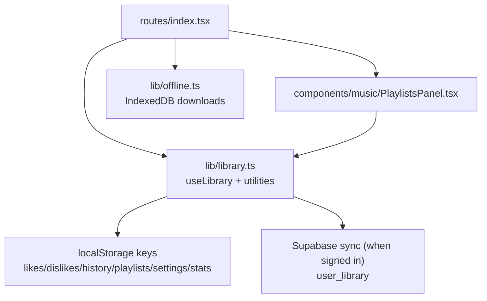
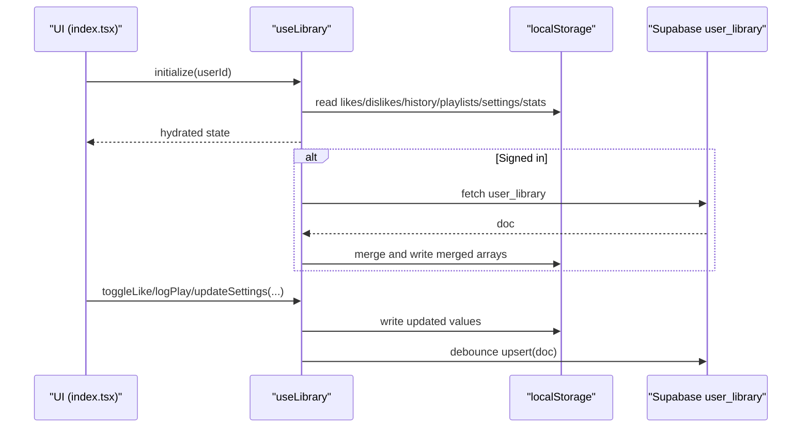
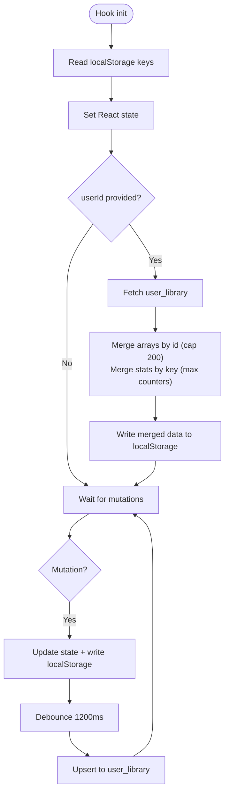
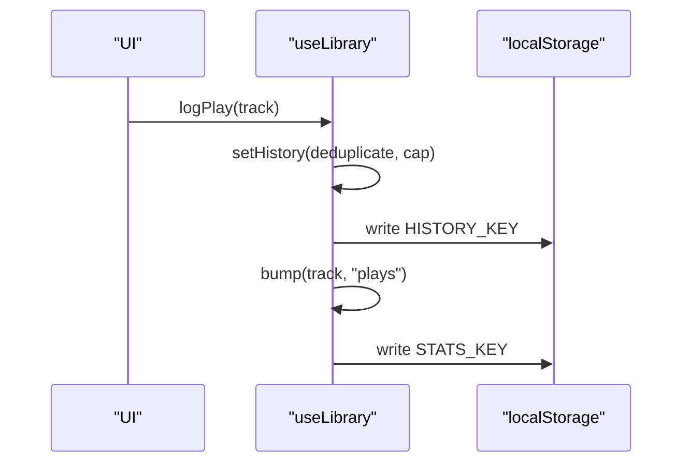
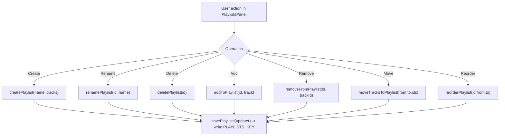
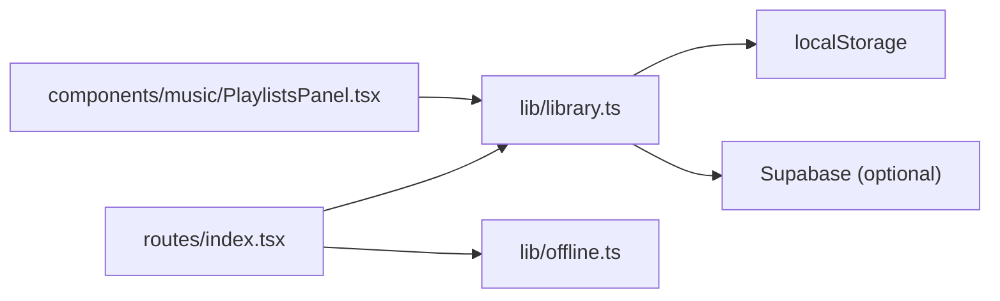

# Local Storage & Library Management

<cite>
**Referenced Files in This Document**
- [library.ts](file://src/lib/library.ts)
- [index.tsx](file://src/routes/index.tsx)
- [PlaylistsPanel.tsx](file://src/components/music/PlaylistsPanel.tsx)
- [offline.ts](file://src/lib/offline.ts)
</cite>

## Table of Contents
1. [Introduction](#introduction)
2. [Project Structure](#project-structure)
3. [Core Components](#core-components)
4. [Architecture Overview](#architecture-overview)
5. [Detailed Component Analysis](#detailed-component-analysis)
6. [Dependency Analysis](#dependency-analysis)
7. [Performance Considerations](#performance-considerations)
8. [Troubleshooting Guide](#troubleshooting-guide)
9. [Conclusion](#conclusion)

## Introduction
This document explains the local-first library management system that powers user preferences, playlists, and behavioral tracking using localStorage as the primary storage layer. It focuses on the useLibrary hook, data models (Track, Playlist, RecSettings, PlayStat, Stats), core operations (toggleLike, toggleDislike, logPlay, logSkip, logComplete), playlist management (createPlaylist, renamePlaylist, deletePlaylist, addToPlaylist, removeFromPlaylist, moveTracksToPlaylist, reorderPlaylist), behavioral tracking, settings management (updateSettings, resetSettings), and utility functions for analyzing listening patterns (replayMix, topArtists, skippedLabels, sequenceBrief). It also covers persistence patterns, storage limits handling, and data migration strategies.

## Project Structure
The library management logic is centralized in a single module that exposes types, stateful hooks, and analytics utilities. The main route consumes the hook to drive UI interactions, while a dedicated panel provides playlist management UX. Offline storage complements localStorage for larger assets.

**Diagram sources**
- [library.ts:242-557](file://src/lib/library.ts#L242-L557)
- [index.tsx:170-196](file://src/routes/index.tsx#L170-L196)
- [PlaylistsPanel.tsx:16-29](file://src/components/music/PlaylistsPanel.tsx#L16-L29)
- [offline.ts:58-95](file://src/lib/offline.ts#L58-L95)

**Section sources**
- [library.ts:1-646](file://src/lib/library.ts#L1-L646)
- [index.tsx:170-196](file://src/routes/index.tsx#L170-L196)
- [PlaylistsPanel.tsx:1-314](file://src/components/music/PlaylistsPanel.tsx#L1-L314)
- [offline.ts:50-95](file://src/lib/offline.ts#L50-L95)

## Core Components
- Data models: Track, Playlist, RecSettings, PlayStat, Stats
- Stateful hook: useLibrary(userId?)
- Persistence helpers: read/write wrappers around localStorage
- Sync helpers: mergeById, mergeStats, debounced upsert to Supabase
- Playlist CRUD: create, rename, delete, add/remove/move/reorder
- Behavioral tracking: bump plays/skips/completions; logPlay/logSkip/logComplete
- Settings: updateSettings, resetSettings
- Analytics utilities: replayMix, topArtists, skippedLabels, sequenceBrief, settingsToBrief

**Section sources**
- [library.ts:3-121](file://src/lib/library.ts#L3-L121)
- [library.ts:125-147](file://src/lib/library.ts#L125-L147)
- [library.ts:200-236](file://src/lib/library.ts#L200-L236)
- [library.ts:242-557](file://src/lib/library.ts#L242-L557)
- [library.ts:559-645](file://src/lib/library.ts#L559-L645)

## Architecture Overview
The system is local-first: all user data lives in localStorage and is mirrored to a cloud account when signed in. The hook hydrates from localStorage, merges with server data on sign-in, and debounces writes back to the server. UI components call exposed methods to mutate state and persist changes immediately.

**Diagram sources**
- [library.ts:242-349](file://src/lib/library.ts#L242-L349)
- [index.tsx:170-196](file://src/routes/index.tsx#L170-L196)

## Detailed Component Analysis

### Data Models
- Track: unique id, title, artist, duration, thumbnail, optional previewUrl and source provider
- Playlist: id, name, tracks array, createdAt timestamp
- RecSettings: moods map, genres/languages/podcastTopics arrays, injectInterval, notifyNewDrops, discovery, energy, instrumentalOnly
- PlayStat: per-track counters for plays, skips, completions, lastAt timestamp
- Stats: mapping from track id to PlayStat

These models are used consistently across the hook’s state and persisted structures.

**Section sources**
- [library.ts:3-21](file://src/lib/library.ts#L3-L21)
- [library.ts:68-103](file://src/lib/library.ts#L68-L103)
- [library.ts:113-121](file://src/lib/library.ts#L113-L121)

### useLibrary Hook
Responsibilities:
- Hydration: reads all keys from localStorage into React state
- Sync on sign-in: pulls remote data once per userId, merges with local arrays (deduped by id, capped at 200), updates stats and settings, persists merged results locally
- Debounced push: after any change, schedules an upsert to the server with current state snapshot
- Exposes mutation APIs for likes, dislikes, history, playlists, settings, and stats

Key behaviors:
- Lists and history are capped to prevent unbounded growth
- Stats are merged by taking max counters to avoid overwriting newer values
- Settings merge defaults with stored partials

**Diagram sources**
- [library.ts:242-349](file://src/lib/library.ts#L242-L349)

**Section sources**
- [library.ts:242-349](file://src/lib/library.ts#L242-L349)

### Behavioral Tracking
- bump(track, field): increments plays/skips/completions and updates lastAt; persists to stats
- logPlay(track): adds track to history (deduplicated, capped), then bumps plays
- logSkip(track): bumps skips
- logComplete(track): bumps completions

These operations build a preference profile used by analytics utilities and recommendation flows.

**Diagram sources**
- [library.ts:384-411](file://src/lib/library.ts#L384-L411)

**Section sources**
- [library.ts:384-411](file://src/lib/library.ts#L384-L411)

### Like/Dislike Management
- toggleLike(track): removes from dislikes if present; toggles presence in likes; caps likes to 200
- toggleDislike(track): removes from likes if present; toggles presence in dislikes; caps dislikes to 200

Both operations persist immediately to their respective keys.

**Section sources**
- [library.ts:353-382](file://src/lib/library.ts#L353-L382)

### Playlist Management
Exposed via savePlaylists updater pattern:
- createPlaylist(name, tracks?): creates new playlist with unique id and timestamp
- renamePlaylist(id, name): updates name
- deletePlaylist(id): removes playlist
- addToPlaylist(id, track): appends track if not already present
- removeFromPlaylist(id, trackId): removes specific track
- removeManyFromPlaylist(id, trackIds): bulk removal
- moveTracksToPlaylist(fromId, toId, trackIds): moves selected tracks without duplicates
- reorderPlaylist(id, from, to): reorders within playlist

The PlaylistsPanel component wires these actions to UI interactions like drag-and-drop reordering and multi-select operations.

**Diagram sources**
- [library.ts:422-515](file://src/lib/library.ts#L422-L515)
- [PlaylistsPanel.tsx:61-307](file://src/components/music/PlaylistsPanel.tsx#L61-L307)

**Section sources**
- [library.ts:422-515](file://src/lib/library.ts#L422-L515)
- [PlaylistsPanel.tsx:16-29](file://src/components/music/PlaylistsPanel.tsx#L16-L29)
- [PlaylistsPanel.tsx:61-307](file://src/components/music/PlaylistsPanel.tsx#L61-L307)

### Settings Management
- updateSettings(patch): merges patch into current settings and persists
- resetSettings(): restores DEFAULT_SETTINGS and persists

Settings influence recommendation behavior and are included in the synced document.

**Section sources**
- [library.ts:517-528](file://src/lib/library.ts#L517-L528)
- [library.ts:93-103](file://src/lib/library.ts#L93-L103)

### Analytics Utilities
- replayMix(stats, limit): returns recent repeat listens scored by plays, completions, and skips
- topArtists(stats, likes, limit): ranks artists by weighted engagement plus like bonus
- skippedLabels(stats, limit): identifies frequently skipped tracks
- sequenceBrief(history, stats, limit): summarizes recent actions per track
- settingsToBrief(settings, extraMood?): converts tuning options into a natural-language brief for recommendations

These functions consume the same data models and stats produced by the hook.

**Section sources**
- [library.ts:559-645](file://src/lib/library.ts#L559-L645)
- [index.tsx:297-325](file://src/routes/index.tsx#L297-L325)

## Dependency Analysis
- useLibrary depends on:
  - localStorage read/write helpers
  - Optional Supabase client for sync (lazy imported)
  - Types defined in the same module
- index.tsx consumes useLibrary to drive UI and passes derived metrics to recommendation flows
- PlaylistsPanel consumes playlist-related callbacks from useLibrary
- offline.ts uses IndexedDB for large assets and includes quota-aware checks

**Diagram sources**
- [library.ts:242-349](file://src/lib/library.ts#L242-L349)
- [index.tsx:170-196](file://src/routes/index.tsx#L170-L196)
- [PlaylistsPanel.tsx:16-29](file://src/components/music/PlaylistsPanel.tsx#L16-L29)
- [offline.ts:58-95](file://src/lib/offline.ts#L58-L95)

**Section sources**
- [library.ts:242-349](file://src/lib/library.ts#L242-L349)
- [index.tsx:170-196](file://src/routes/index.tsx#L170-L196)
- [PlaylistsPanel.tsx:16-29](file://src/components/music/PlaylistsPanel.tsx#L16-L29)
- [offline.ts:58-95](file://src/lib/offline.ts#L58-L95)

## Performance Considerations
- Arrays (likes, dislikes, history, playlists) are capped to 200 items to control memory and storage usage
- History is deduplicated on insert to avoid redundant entries
- Stats merging uses max counters to preserve the latest counts safely
- Server sync is debounced (1200ms) to reduce network churn during rapid interactions
- Large assets are offloaded to IndexedDB with quota checks before saving

[No sources needed since this section provides general guidance]

## Troubleshooting Guide
Common issues and mitigations:
- localStorage quota exceeded: write helper catches errors and logs warnings; consider pruning history or clearing old data
- Sync failures: debounced upsert logs warnings; retry occurs automatically on next change
- Corrupted or missing data: read helper returns fallbacks on parse errors; hydration ensures safe defaults
- Offline storage low: saveDownload warns when remaining quota is below threshold; consider removing old downloads

Operational tips:
- Use clearHistory to reset listening history if storage grows too large
- Reset settings to defaults if tuning becomes inconsistent
- For playback resume, ensure episode positions are saved only when position exceeds a small threshold to avoid noise

**Section sources**
- [library.ts:125-143](file://src/lib/library.ts#L125-L143)
- [library.ts:321-349](file://src/lib/library.ts#L321-L349)
- [offline.ts:58-95](file://src/lib/offline.ts#L58-L95)

## Conclusion
The local-first library management system centers on a robust useLibrary hook that manages user preferences, playlists, and behavioral signals with immediate localStorage persistence and optional cloud synchronization. Its data models and utilities enable rich personalization through replay mixes, artist rankings, skip detection, and concise summaries. Built-in caps, deduplication, and debounced syncing keep performance stable under typical usage. Complementary offline storage handles larger assets with quota awareness, ensuring a resilient experience across devices and sessions.