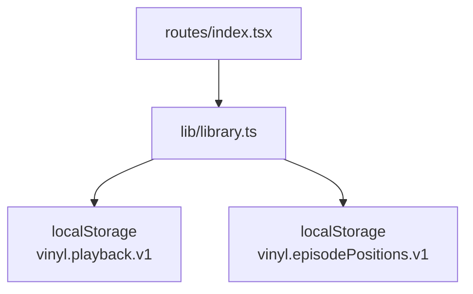
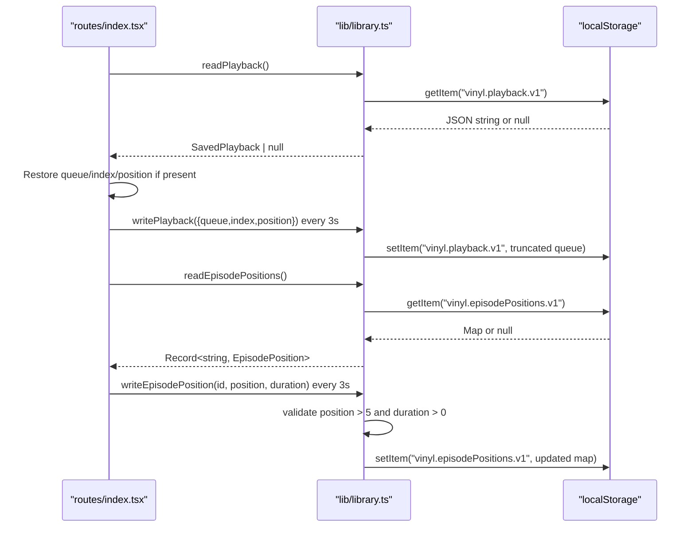
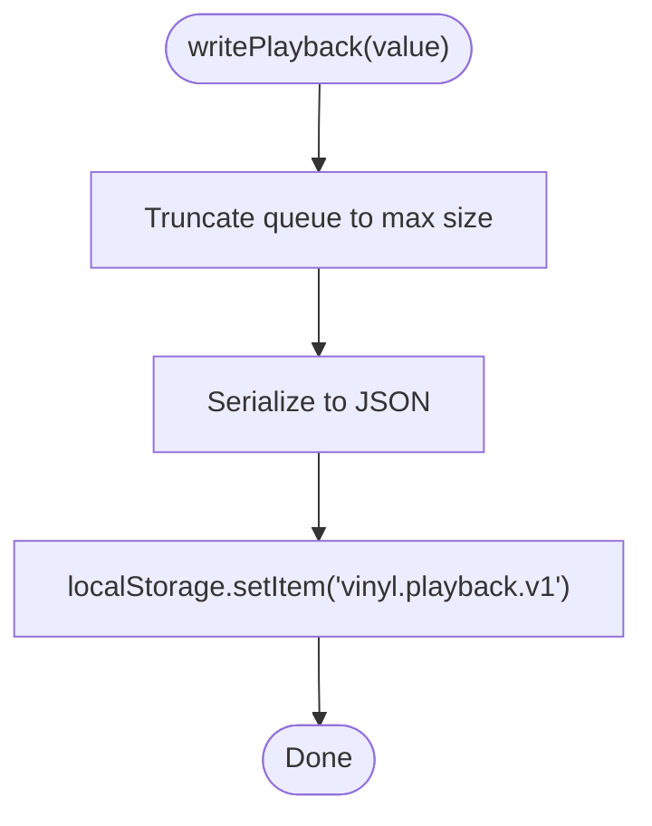
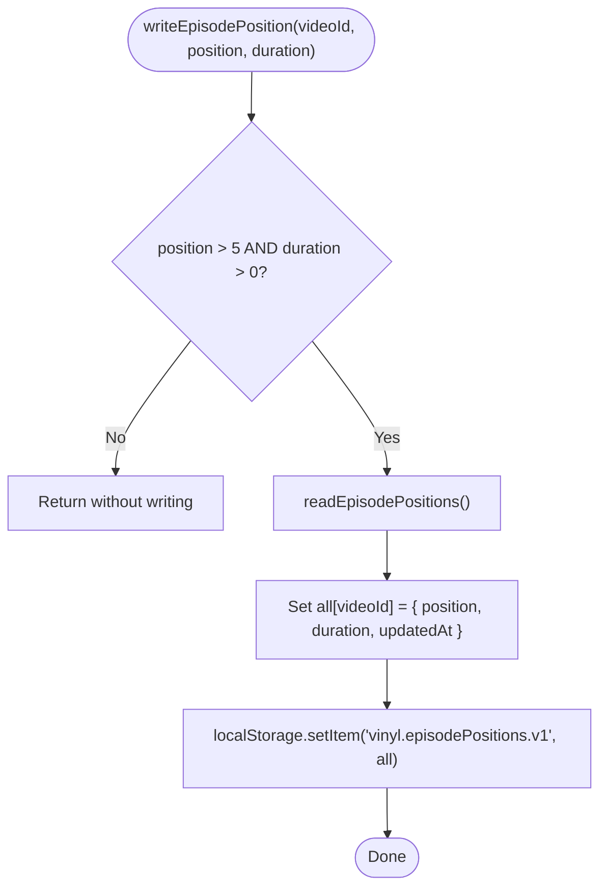
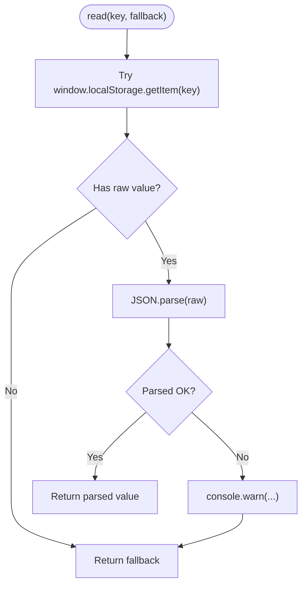
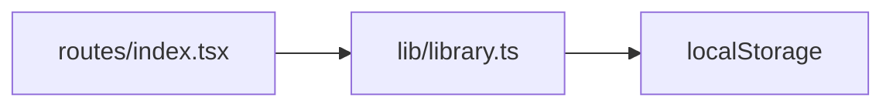

# Playback Persistence

<cite>
**Referenced Files in This Document**
- [library.ts](file://src/lib/library.ts)
- [index.tsx](file://src/routes/index.tsx)
</cite>

## Table of Contents
1. [Introduction](#introduction)
2. [Project Structure](#project-structure)
3. [Core Components](#core-components)
4. [Architecture Overview](#architecture-overview)
5. [Detailed Component Analysis](#detailed-component-analysis)
6. [Dependency Analysis](#dependency-analysis)
7. [Performance Considerations](#performance-considerations)
8. [Troubleshooting Guide](#troubleshooting-guide)
9. [Conclusion](#conclusion)

## Introduction
This document explains the playback persistence system that saves and restores user listening sessions. It covers:
- SavedPlayback type and its role in resuming a session across app restarts
- readPlayback and writePlayback for reading/writing the current queue and seek position
- EpisodePosition type and per-episode position tracking
- readEpisodePositions, writeEpisodePosition, and clearEpisodePosition for managing resume points for long-form content (e.g., podcasts)
- Storage keys used for different data types
- Fallback mechanisms for corrupted or missing data
- Filtering logic to avoid saving initial load events and invalid durations

## Project Structure
The persistence layer is implemented in a shared library module and consumed by the main route component that orchestrates playback.

**Diagram sources**
- [index.tsx:520-596](file://src/routes/index.tsx#L520-L596)
- [library.ts:125-197](file://src/lib/library.ts#L125-L197)

**Section sources**
- [library.ts:125-197](file://src/lib/library.ts#L125-L197)
- [index.tsx:520-596](file://src/routes/index.tsx#L520-L596)

## Core Components
- SavedPlayback: Captures the last known queue, current index, and playback position so the app can resume where the user left off.
- EpisodePosition: Captures per-episode progress with position, duration, and updatedAt timestamp to offer resume prompts for long-form content.
- readPlayback/writePlayback: Read and persist the current playback session state.
- readEpisodePositions/writeEpisodePosition/clearEpisodePosition: Manage per-episode positions with validation and safe defaults.

Key storage keys:
- vinyl.playback.v1: Stores SavedPlayback
- vinyl.episodePositions.v1: Stores a map of episode IDs to EpisodePosition

Fallback behavior:
- On read errors or missing keys, functions return safe defaults (null or empty objects).
- Corrupted data is rejected and replaced with defaults.

**Section sources**
- [library.ts:149-197](file://src/lib/library.ts#L149-L197)

## Architecture Overview
The UI layer periodically persists playback state and offers resume prompts based on stored episode positions.

**Diagram sources**
- [index.tsx:520-596](file://src/routes/index.tsx#L520-L596)
- [library.ts:125-197](file://src/lib/library.ts#L125-L197)

## Detailed Component Analysis

### SavedPlayback and Session Resume
- Type definition includes queue, index, and position.
- readPlayback retrieves from localStorage and validates that the queue exists and is non-empty; otherwise returns null.
- writePlayback serializes and stores the state while truncating the queue to a maximum length to prevent storage overflow.

**Diagram sources**
- [library.ts:164-166](file://src/lib/library.ts#L164-L166)

Usage in UI:
- On app start, readPlayback restores the previous session’s queue, index, and target position.
- While playing, the UI writes the current state every few seconds to keep persistence up to date.

**Section sources**
- [library.ts:149-166](file://src/lib/library.ts#L149-L166)
- [index.tsx:520-584](file://src/routes/index.tsx#L520-L584)

### Episode Position Tracking
- EpisodePosition includes position, duration, and updatedAt.
- readEpisodePositions returns a validated map; if missing or malformed, it returns an empty object.
- writeEpisodePosition only persists when position is greater than a small threshold and duration is valid, preventing accidental overwrites from initial loads.
- clearEpisodePosition removes a specific episode’s saved position.

**Diagram sources**
- [library.ts:178-197](file://src/lib/library.ts#L178-L197)

Usage in UI:
- When a track becomes ready, the UI checks for a saved episode position and, if conditions are met, shows a resume prompt.
- The UI periodically writes the current position for the active episode.
- Users can choose to “start over,” which clears the saved position.

**Section sources**
- [library.ts:171-197](file://src/lib/library.ts#L171-L197)
- [index.tsx:542-596](file://src/routes/index.tsx#L542-L596)
- [index.tsx:880-894](file://src/routes/index.tsx#L880-L894)

### Data Validation and Fallbacks
- read uses try/catch around JSON parsing and logs warnings on failure, returning a provided fallback.
- readPlayback ensures the queue is a non-empty array before returning saved state.
- readEpisodePositions ensures the stored value is a plain object (not an array) before using it.
- write operations handle quota or serialization errors gracefully via try/catch.

**Diagram sources**
- [library.ts:125-143](file://src/lib/library.ts#L125-L143)

**Section sources**
- [library.ts:125-143](file://src/lib/library.ts#L125-L143)
- [library.ts:158-182](file://src/lib/library.ts#L158-L182)

### Storage Keys and Scope
- vinyl.playback.v1: Current playback session (queue, index, position)
- vinyl.episodePositions.v1: Per-episode positions map

These keys are defined in the library module and used consistently by both read and write functions.

**Section sources**
- [library.ts:149-169](file://src/lib/library.ts#L149-L169)

## Dependency Analysis
- routes/index.tsx depends on lib/library.ts for persistence primitives and exports.
- lib/library.ts encapsulates localStorage access through internal read/write helpers, isolating error handling and key management.
- No circular dependencies exist between these modules.

**Diagram sources**
- [index.tsx:520-596](file://src/routes/index.tsx#L520-L596)
- [library.ts:125-197](file://src/lib/library.ts#L125-L197)

**Section sources**
- [index.tsx:520-596](file://src/routes/index.tsx#L520-L596)
- [library.ts:125-197](file://src/lib/library.ts#L125-L197)

## Performance Considerations
- Queue truncation: writePlayback limits the persisted queue to a fixed maximum length to avoid excessive storage usage.
- Debounced persistence: Both playback and episode positions are written at intervals rather than on every change, reducing I/O overhead.
- Defensive reads: Validation prevents costly or invalid operations on malformed data.

[No sources needed since this section provides general guidance]

## Troubleshooting Guide
Common issues and how the code handles them:
- Missing or first-run state: readPlayback returns null; readEpisodePositions returns an empty object. The UI treats these as “no saved state.”
- Corrupted localStorage entries: read catches parse errors and falls back to defaults; warnings are logged for visibility.
- Quota exceeded or write failures: write wraps localStorage.setItem in try/catch and logs warnings without crashing the app.
- Initial load noise: writeEpisodePosition ignores very small positions and invalid durations to avoid wiping previously saved spots.

Operational tips:
- If resume does not work, verify that the relevant localStorage keys exist and contain expected structures.
- Clearing a specific episode’s position can be triggered via the UI flow that calls clearEpisodePosition.

**Section sources**
- [library.ts:125-143](file://src/lib/library.ts#L125-L143)
- [library.ts:158-197](file://src/lib/library.ts#L158-L197)
- [index.tsx:880-894](file://src/routes/index.tsx#L880-L894)

## Conclusion
The playback persistence system provides robust session recovery and per-episode resume capabilities. It uses well-defined types (SavedPlayback, EpisodePosition), conservative validation, and defensive fallbacks to ensure reliability even with missing or corrupted data. Periodic writes and queue truncation balance persistence accuracy with performance and storage constraints.

[No sources needed since this section summarizes without analyzing specific files]