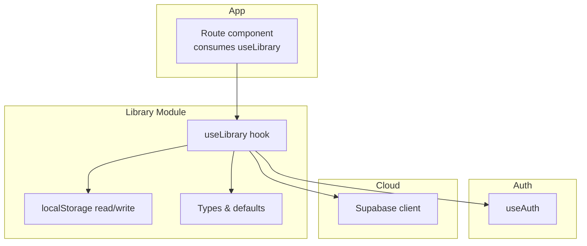
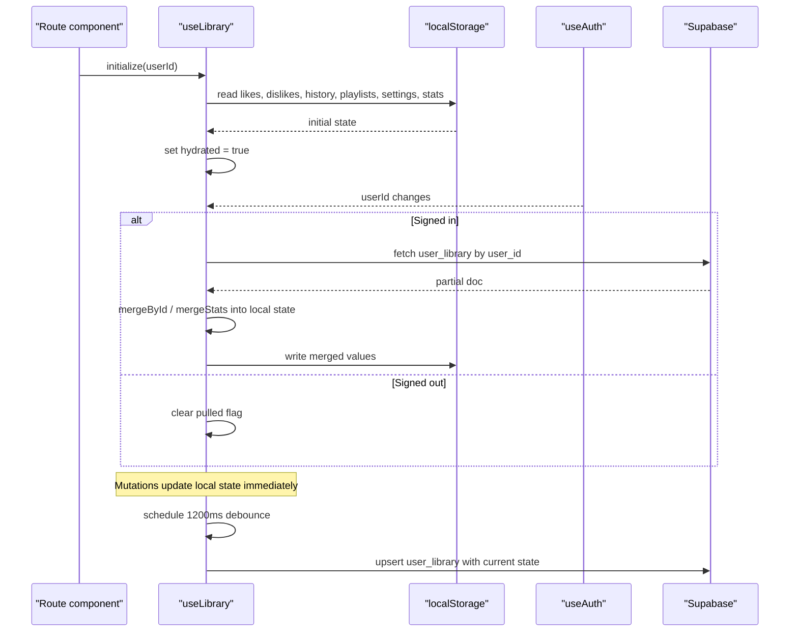
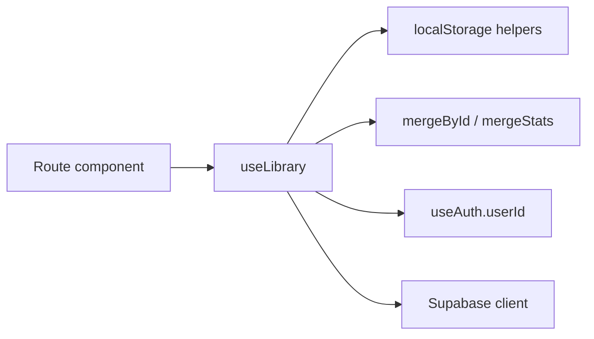

# User Library Hook

<cite>
**Referenced Files in This Document**
- [library.ts](file://src/lib/library.ts)
- [client.ts](file://src/integrations/supabase/client.ts)
- [auth.ts](file://src/lib/auth.ts)
- [index.tsx](file://src/routes/index.tsx)
</cite>

## Table of Contents
1. [Introduction](#introduction)
2. [Project Structure](#project-structure)
3. [Core Components](#core-components)
4. [Architecture Overview](#architecture-overview)
5. [Detailed Component Analysis](#detailed-component-analysis)
6. [Dependency Analysis](#dependency-analysis)
7. [Performance Considerations](#performance-considerations)
8. [Troubleshooting Guide](#troubleshooting-guide)
9. [Conclusion](#conclusion)

## Introduction
This document explains the useLibrary React hook that manages the complete user library state for a music application. It covers initialization from localStorage, hydration and cloud synchronization via Supabase when a user is signed in, merge strategies for combining local and cloud data, debounced sync to push changes back to the cloud, lifecycle management around sign-in/sign-out, all exposed methods (likes/dislikes, history, playlists, settings), and error handling patterns including storage limits.

## Project Structure
The hook lives in a dedicated library module and integrates with:
- Local storage helpers for persistence
- A Supabase client for cloud sync
- An authentication hook to detect sign-in state
- The main route component that consumes the hook

**Diagram sources**
- [index.tsx:170-196](file://src/routes/index.tsx#L170-L196)
- [library.ts:242-557](file://src/lib/library.ts#L242-L557)
- [auth.ts:12-69](file://src/lib/auth.ts#L12-L69)
- [client.ts:30-67](file://src/integrations/supabase/client.ts#L30-L67)

**Section sources**
- [index.tsx:170-196](file://src/routes/index.tsx#L170-L196)
- [library.ts:242-557](file://src/lib/library.ts#L242-L557)
- [auth.ts:12-69](file://src/lib/auth.ts#L12-L69)
- [client.ts:30-67](file://src/integrations/supabase/client.ts#L30-L67)

## Core Components
- useLibrary: Central hook managing likes, dislikes, history, playlists, settings, and stats; hydrates from localStorage; merges with cloud on sign-in; debounces writes to cloud.
- Local storage helpers: read/write utilities with error handling and quota warnings.
- Merge utilities: mergeById for deduplicated arrays and mergeStats for behavioral counters.
- Supabase integration: dynamic import and upsert to user_library table.
- Authentication integration: uses userId to gate pull/push operations.

Key responsibilities:
- Initialize state from localStorage on mount
- Pull account data once per sign-in and merge into local state
- Debounce pushing local changes to the cloud every 1200ms
- Expose methods to mutate library state and persist changes

**Section sources**
- [library.ts:125-147](file://src/lib/library.ts#L125-L147)
- [library.ts:209-236](file://src/lib/library.ts#L209-L236)
- [library.ts:242-557](file://src/lib/library.ts#L242-L557)

## Architecture Overview
The hook implements a local-first architecture with eventual consistency to the cloud. On app start, it reads persisted state from localStorage. When a user signs in, it pulls their cloud library and merges it with local data using specific strategies. Subsequent mutations are written locally immediately and synced to the cloud after a debounce delay.

**Diagram sources**
- [library.ts:251-349](file://src/lib/library.ts#L251-L349)
- [auth.ts:18-49](file://src/lib/auth.ts#L18-L49)
- [client.ts:30-67](file://src/integrations/supabase/client.ts#L30-L67)

## Detailed Component Analysis

### State Initialization and Hydration
- Reads six keys from localStorage: likes, dislikes, history, playlists, settings, stats
- Merges default settings with any saved settings
- Marks the hook as hydrated after reading

Complexity: O(1) reads per key; negligible overhead.

Error handling:
- read() catches parse errors and logs warnings, returning fallbacks
- write() catches quota or serialization errors and logs warnings

**Section sources**
- [library.ts:125-143](file://src/lib/library.ts#L125-L143)
- [library.ts:251-259](file://src/lib/library.ts#L251-L259)

### Cloud Synchronization: Pull on Sign-In
- Triggered when hydrated and userId becomes available and not previously pulled
- Dynamically imports Supabase client to avoid bundling until needed
- Fetches user_library row for the current user
- Merges cloud data into local state:
  - Arrays (likes, dislikes, history, playlists): mergeById with max length caps
  - Stats: mergeStats taking max counters per track
  - Settings: merge with defaults
- Writes merged results back to localStorage to keep local and cloud consistent

Lifecycle:
- pulled ref ensures one-time pull per user session
- Clears pulled flag on sign-out so next sign-in triggers a fresh pull

**Section sources**
- [library.ts:262-319](file://src/lib/library.ts#L262-L319)
- [client.ts:30-67](file://src/integrations/supabase/client.ts#L30-L67)

### Merge Strategies
- mergeById(a, b, max): Deduplicates by id preserving first occurrence order across both arrays, then truncates to max length. Used for likes, dislikes, history, playlists.
- mergeStats(a, b): For each track id, keeps the latest timestamp and takes the maximum of plays, skips, completions between local and cloud.

Rationale:
- Preserves recent local activity while incorporating missing items from cloud
- Prevents unbounded growth with size caps
- Ensures counters reflect the highest observed values across devices

**Section sources**
- [library.ts:209-236](file://src/lib/library.ts#L209-L236)

### Debounced Sync to Cloud
- After any change to library state, schedules an upsert to user_library after 1200ms
- Only runs when hydrated, signed in, and pulled has been completed for the current user
- Truncates history to 100 entries before syncing
- Logs warnings on errors without throwing

Cancellation:
- Uses a cancelled flag and clears timeout on unmount or dependency change to prevent stale writes

**Section sources**
- [library.ts:321-349](file://src/lib/library.ts#L321-L349)

### Lifecycle Management
- Hydration: reads localStorage and sets hydrated flag
- Sign-in: pulls cloud data once per user and merges into local state
- Sign-out: clears pulled flag so future sign-ins trigger a new pull
- Cleanup: cancels pending timers and network work on effect teardown

**Section sources**
- [library.ts:251-319](file://src/lib/library.ts#L251-L319)

### Exposed Methods

#### Likes and Dislikes
- toggleLike(track): Removes from dislikes if present; toggles presence in likes; caps at 200; persists to localStorage
- toggleDislike(track): Removes from likes if present; toggles presence in dislikes; caps at 200; persists to localStorage

Behavioral impact:
- Dislikes inform AI to avoid similar tracks
- Both lists influence recommendation context

**Section sources**
- [library.ts:353-382](file://src/lib/library.ts#L353-L382)

#### History and Playback Signals
- logPlay(track): Prepends track to history, removes duplicates, caps at 200; increments plays counter
- logSkip(track): Increments skips counter
- logComplete(track): Increments completions counter

Storage:
- History persisted to localStorage
- Behavioral counters stored under stats key

**Section sources**
- [library.ts:384-411](file://src/lib/library.ts#L384-L411)

#### History Management
- clearHistory(): Empties history array and persists empty list

**Section sources**
- [library.ts:417-420](file://src/lib/library.ts#L417-L420)

#### Playlist Operations
- createPlaylist(name, tracks?): Creates a playlist with unique id and timestamp; prepends to list
- renamePlaylist(id, name): Updates playlist name
- deletePlaylist(id): Removes playlist by id
- addToPlaylist(id, track): Adds track if not already present
- removeFromPlaylist(id, trackId): Removes track by id
- removeManyFromPlaylist(id, trackIds): Batch removal by ids
- moveTracksToPlaylist(fromId, toId, trackIds): Moves selected tracks from source to destination without duplicates
- reorderPlaylist(id, from, to): Reorders tracks within a playlist

Persistence:
- All operations go through savePlaylists which updates state and writes to localStorage

**Section sources**
- [library.ts:422-515](file://src/lib/library.ts#L422-L515)

#### Settings Management
- updateSettings(patch): Merges patch into current settings and persists
- resetSettings(): Resets to default settings and persists

Defaults include moods, genres, languages, podcast topics, injection interval, notifications, discovery/energy sliders, and instrumental-only mode.

**Section sources**
- [library.ts:93-103](file://src/lib/library.ts#L93-L103)
- [library.ts:517-528](file://src/lib/library.ts#L517-L528)

### Error Handling Patterns
- Local storage read/write failures are caught and logged; fallbacks are used to keep the UI functional
- Cloud sync errors are logged as warnings; no user-facing exceptions are thrown
- Quota exceeded scenarios are handled gracefully with warnings

Best practices:
- Always wrap localStorage access in try/catch
- Log but do not block UI on sync failures
- Use caps and truncation to mitigate storage pressure

**Section sources**
- [library.ts:125-143](file://src/lib/library.ts#L125-L143)
- [library.ts:321-349](file://src/lib/library.ts#L321-L349)

### Storage Limit Considerations
- Lists are capped at 200 items for likes, dislikes, and history to prevent excessive growth
- History is truncated to 100 entries before cloud sync
- Stats are keyed by track id and grow only with unique tracks encountered
- Settings are compact objects with bounded fields

Recommendations:
- Monitor localStorage usage and consider pruning older history periodically
- If quotas are hit frequently, reduce caps or implement archival strategies

**Section sources**
- [library.ts:329-339](file://src/lib/library.ts#L329-L339)
- [library.ts:353-382](file://src/lib/library.ts#L353-L382)

## Dependency Analysis
The hook depends on:
- React hooks: useState, useEffect, useRef, useCallback
- Local storage helpers for persistence
- Supabase client for cloud operations
- Authentication hook for user identity

**Diagram sources**
- [library.ts:242-557](file://src/lib/library.ts#L242-L557)
- [auth.ts:12-69](file://src/lib/auth.ts#L12-L69)
- [client.ts:30-67](file://src/integrations/supabase/client.ts#L30-L67)
- [index.tsx:170-196](file://src/routes/index.tsx#L170-L196)

**Section sources**
- [library.ts:242-557](file://src/lib/library.ts#L242-L557)
- [auth.ts:12-69](file://src/lib/auth.ts#L12-L69)
- [client.ts:30-67](file://src/integrations/supabase/client.ts#L30-L67)
- [index.tsx:170-196](file://src/routes/index.tsx#L170-L196)

## Performance Considerations
- Debounced sync reduces network calls during rapid mutations
- Array deduplication and caps limit memory and storage growth
- Dynamic import of Supabase client avoids unnecessary bundle size
- Local-first updates ensure responsive UI even when offline

Optimization opportunities:
- Consider batching multiple playlist updates into fewer writes
- Implement background cleanup of old history entries beyond the cap
- Add retry logic with exponential backoff for failed syncs

[No sources needed since this section provides general guidance]

## Troubleshooting Guide
Common issues and resolutions:
- LocalStorage quota exceeded:
  - Symptoms: Write warnings in console; some data may not persist
  - Resolution: Reduce history or playlist sizes; clear unused data
- Cloud sync failures:
  - Symptoms: Console warnings about sync errors
  - Resolution: Check network connectivity; verify Supabase environment variables; inspect user_library schema
- Stale data after sign-in:
  - Ensure pulled flag is cleared on sign-out so a fresh pull occurs
- Inconsistent stats:
  - mergeStats takes maximum counters; ensure consistent increment calls across components

Debugging tips:
- Inspect localStorage keys for correct structure
- Verify Supabase client configuration and permissions
- Temporarily increase debounce time to observe individual writes

**Section sources**
- [library.ts:125-143](file://src/lib/library.ts#L125-L143)
- [library.ts:321-349](file://src/lib/library.ts#L321-L349)
- [client.ts:30-67](file://src/integrations/supabase/client.ts#L30-L67)

## Conclusion
The useLibrary hook provides a robust, local-first library management system with seamless cloud synchronization. It initializes state from localStorage, merges cloud data on sign-in using well-defined strategies, and debounces writes to minimize network load. Its comprehensive API supports full control over likes, dislikes, history, playlists, and settings, while handling errors and storage constraints gracefully. Consumers can rely on immediate local updates with eventual consistency to the cloud, ensuring a responsive and resilient user experience.