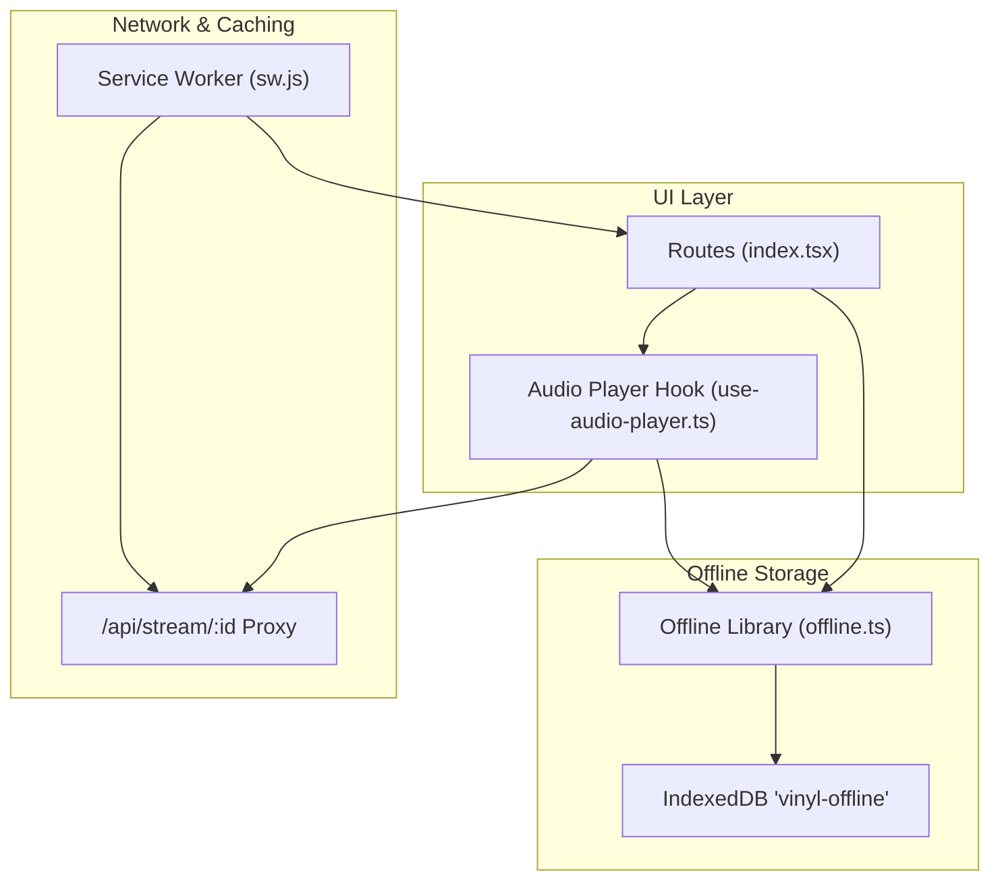
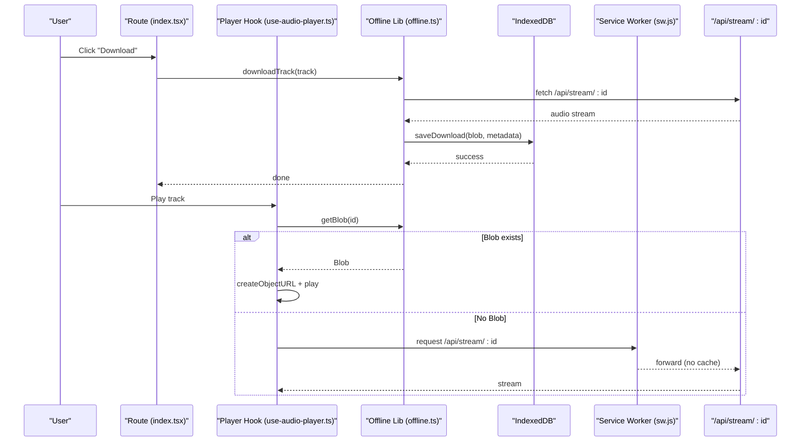
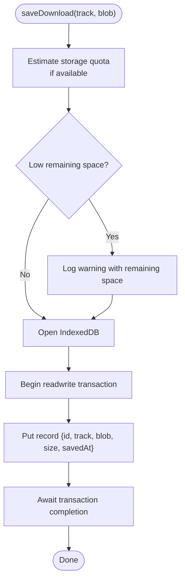
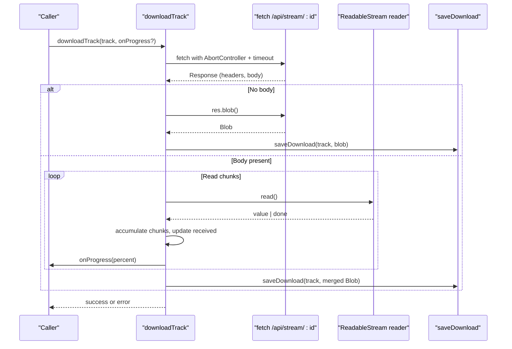
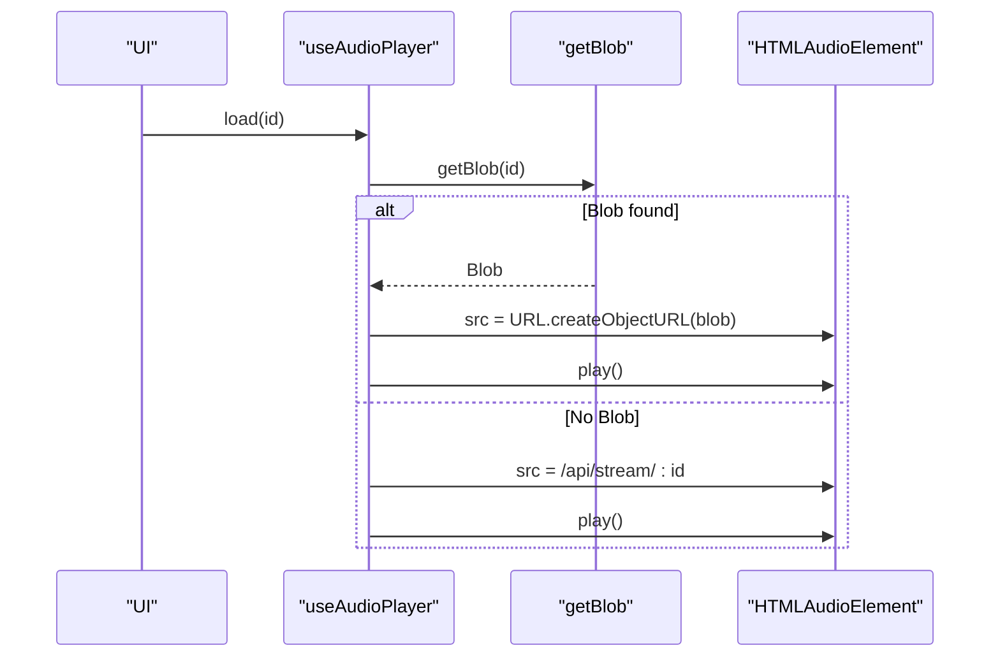
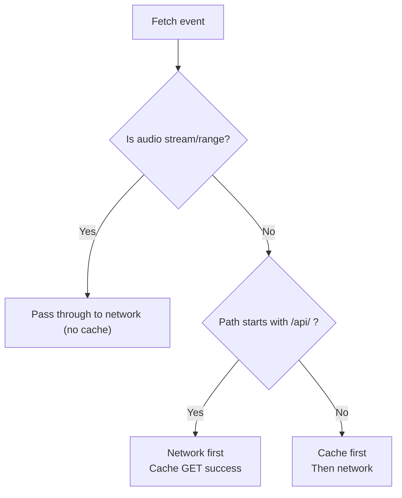
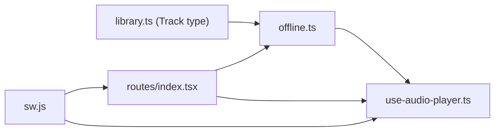

# Offline Functionality & Downloads

<cite>
**Referenced Files in This Document**
- [offline.ts](file://src/lib/offline.ts)
- [use-audio-player.ts](file://src/lib/use-audio-player.ts)
- [index.tsx](file://src/routes/index.tsx)
- [sw.js](file://public/sw.js)
- [library.ts](file://src/lib/library.ts)
- [ErrorBoundary.tsx](file://src/components/music/ErrorBoundary.tsx)
</cite>

## Table of Contents
1. [Introduction](#introduction)
2. [Project Structure](#project-structure)
3. [Core Components](#core-components)
4. [Architecture Overview](#architecture-overview)
5. [Detailed Component Analysis](#detailed-component-analysis)
6. [Dependency Analysis](#dependency-analysis)
7. [Performance Considerations](#performance-considerations)
8. [Troubleshooting Guide](#troubleshooting-guide)
9. [Conclusion](#conclusion)

## Introduction
This document explains the offline music functionality and download system. It covers how tracks are downloaded, stored, and played back without a network connection using IndexedDB-based blob storage. It also documents background caching via a service worker, error handling strategies, performance considerations for large queues and memory management, and browser compatibility approaches.

## Project Structure
The offline system spans several modules:
- Download and storage logic resides in a dedicated library module that manages an IndexedDB database to persist audio blobs and metadata.
- The audio player hook integrates with the storage layer to prefer offline playback when available and fall back to streaming otherwise.
- The main route coordinates user actions such as downloading, listing, removing, and clearing downloads.
- A service worker caches app shell assets and API responses while explicitly bypassing audio stream caching to avoid quota issues.
- Shared types and utilities define track structures and local data persistence patterns used across the app.
- An error boundary provides graceful UI recovery and preserves user data.

**Diagram sources**
- [offline.ts:10-41](file://src/lib/offline.ts#L10-L41)
- [use-audio-player.ts:20-156](file://src/lib/use-audio-player.ts#L20-L156)
- [index.tsx:674-714](file://src/routes/index.tsx#L674-L714)
- [sw.js:35-84](file://public/sw.js#L35-L84)

**Section sources**
- [offline.ts:10-41](file://src/lib/offline.ts#L10-L41)
- [use-audio-player.ts:20-156](file://src/lib/use-audio-player.ts#L20-L156)
- [index.tsx:674-714](file://src/routes/index.tsx#L674-L714)
- [sw.js:35-84](file://public/sw.js#L35-L84)

## Core Components
- Offline storage module: Provides functions to open IndexedDB, save/download tracks, list/remove/clear downloads, compute total size, and format bytes. It includes progress reporting during downloads and best-effort storage quota checks.
- Audio player hook: Implements seamless switching between offline playback (via stored blobs) and online streaming through the same-origin proxy. It manages object URLs and cleanup to prevent memory leaks.
- Route integration: Exposes UI handlers to initiate downloads, remove individual downloads, clear all downloads, and refresh the download list.
- Service worker: Pre-caches the app shell, applies network-first caching for API calls, and bypasses caching for audio streams to avoid bloating storage quotas.

**Section sources**
- [offline.ts:58-147](file://src/lib/offline.ts#L58-L147)
- [use-audio-player.ts:123-156](file://src/lib/use-audio-player.ts#L123-L156)
- [index.tsx:674-714](file://src/routes/index.tsx#L674-L714)
- [sw.js:7-33](file://public/sw.js#L7-L33)
- [sw.js:35-84](file://public/sw.js#L35-L84)

## Architecture Overview
The system combines client-side streaming, offline storage, and service worker caching to deliver a robust offline-first experience:
- Streaming path: The player requests audio from a same-origin proxy endpoint. The service worker allows these requests to pass through to the network without caching them.
- Offline path: When a track is downloaded, its audio blob is persisted in IndexedDB. Playback prefers the local blob; if unavailable, it falls back to streaming.
- App shell and API caching: The service worker ensures the UI loads offline by caching core assets and caches successful GET API responses for resilience.

**Diagram sources**
- [index.tsx:683-714](file://src/routes/index.tsx#L683-L714)
- [offline.ts:150-200](file://src/lib/offline.ts#L150-L200)
- [offline.ts:58-95](file://src/lib/offline.ts#L58-L95)
- [use-audio-player.ts:123-156](file://src/lib/use-audio-player.ts#L123-L156)
- [sw.js:35-84](file://public/sw.js#L35-L84)

## Detailed Component Analysis

### Offline Storage Module
Responsibilities:
- Open and manage an IndexedDB instance named for offline storage, creating an object store for tracks on first run.
- Save downloaded audio blobs along with track metadata, size, and timestamp.
- Retrieve stored blobs by track id for offline playback.
- List all downloads sorted by most recently saved.
- Remove or clear downloads.
- Compute total downloaded size and provide human-readable byte formatting.
- Perform best-effort storage quota estimation before saving to warn about low remaining space.

Key implementation notes:
- Database access is wrapped in promises for consistent async handling.
- Transactions are awaited to ensure completion or failure propagation.
- Quota estimation uses navigator.storage.estimate when available and logs warnings if remaining space is below a threshold relative to the incoming blob size.

**Diagram sources**
- [offline.ts:58-83](file://src/lib/offline.ts#L58-L83)

**Section sources**
- [offline.ts:24-41](file://src/lib/offline.ts#L24-L41)
- [offline.ts:58-95](file://src/lib/offline.ts#L58-L95)
- [offline.ts:103-147](file://src/lib/offline.ts#L103-L147)

### Download Track Flow
Behavior:
- Initiates a fetch to the same-origin streaming proxy endpoint with an abort controller and timeout to guard against long-running downloads.
- Reads the response body in chunks using a reader, accumulating bytes and reporting progress based on content-length when available.
- Merges chunks into a single Uint8Array and constructs a Blob with the appropriate MIME type.
- Persists the blob and metadata via saveDownload.
- Handles timeouts and errors distinctly, surfacing meaningful messages.

**Diagram sources**
- [offline.ts:150-200](file://src/lib/offline.ts#L150-L200)
- [offline.ts:58-83](file://src/lib/offline.ts#L58-L83)

**Section sources**
- [offline.ts:150-200](file://src/lib/offline.ts#L150-L200)

### Offline Playback Workflow
Behavior:
- The player hook attempts to load a track from offline storage first by retrieving the blob for the given id.
- If a blob exists, it creates an object URL and sets it as the audio source, enabling playback without a network connection.
- If no blob exists, it streams from the same-origin proxy endpoint.
- Object URLs are revoked when replaced or on unmount to free memory.

**Diagram sources**
- [use-audio-player.ts:123-156](file://src/lib/use-audio-player.ts#L123-L156)

**Section sources**
- [use-audio-player.ts:123-156](file://src/lib/use-audio-player.ts#L123-L156)

### Service Worker Caching Strategy
Behavior:
- Installs and pre-caches the app shell so the UI can load offline.
- Activates and cleans up old caches to free space.
- For API endpoints, uses a network-first strategy and caches successful GET responses to improve offline resilience for non-media data.
- Explicitly bypasses caching for audio streams and range requests to avoid consuming large amounts of storage and because offline downloads are handled separately via IndexedDB.

**Diagram sources**
- [sw.js:35-84](file://public/sw.js#L35-L84)

**Section sources**
- [sw.js:7-33](file://public/sw.js#L7-L33)
- [sw.js:35-84](file://public/sw.js#L35-L84)

### Route Integration for Downloads
Behavior:
- Initializes and refreshes the list of downloaded tracks.
- Provides handlers to start a download, remove a specific download, and clear all downloads.
- Tracks currently downloading ids to prevent duplicate downloads and updates UI state accordingly.

**Section sources**
- [index.tsx:674-714](file://src/routes/index.tsx#L674-L714)

## Dependency Analysis
- The offline module depends on the shared Track type for metadata preservation alongside blobs.
- The audio player hook depends on the offline module to retrieve stored blobs and on the HTML5 Audio API for playback.
- The route layer orchestrates user interactions and invokes both the offline module and the player hook.
- The service worker interacts with network requests and caches, complementing the offline storage approach by ensuring the app shell and API data are resilient offline.

**Diagram sources**
- [library.ts:3-14](file://src/lib/library.ts#L3-L14)
- [offline.ts:1-20](file://src/lib/offline.ts#L1-L20)
- [use-audio-player.ts:1-20](file://src/lib/use-audio-player.ts#L1-L20)
- [index.tsx:674-714](file://src/routes/index.tsx#L674-L714)
- [sw.js:35-84](file://public/sw.js#L35-L84)

**Section sources**
- [library.ts:3-14](file://src/lib/library.ts#L3-L14)
- [offline.ts:1-20](file://src/lib/offline.ts#L1-L20)
- [use-audio-player.ts:1-20](file://src/lib/use-audio-player.ts#L1-L20)
- [index.tsx:674-714](file://src/routes/index.tsx#L674-L714)
- [sw.js:35-84](file://public/sw.js#L35-L84)

## Performance Considerations
- Large download queues:
  - Use chunked reading and incremental progress updates to keep the UI responsive during downloads.
  - Avoid caching audio streams in the service worker to prevent quota exhaustion; rely on IndexedDB for explicit downloads only.
- Memory management during playback:
  - Revoke object URLs when they are replaced or on component unmount to free memory.
  - Ensure audio elements are paused and their sources cleared appropriately.
- Storage optimization:
  - Estimate storage quota before saving and warn when remaining space is low.
  - Provide mechanisms to remove or clear downloads to reclaim space.
- Background sync capabilities:
  - The current implementation does not include a background sync queue for retries; consider adding retry logic around failed downloads and leveraging service worker events for reconnection handling if needed.

[No sources needed since this section provides general guidance]

## Troubleshooting Guide
Common issues and mitigations:
- IndexedDB unavailable:
  - The offline module rejects operations when indexedDB is undefined. Implement a fallback path or inform users that offline features require a compatible browser.
- Storage full scenarios:
  - Quota estimation warns when remaining space is low. Users should remove or clear downloads to free space.
- Failed downloads:
  - Timeouts and network errors are surfaced with descriptive messages. Retry logic can be added at the caller level to handle transient failures.
- Corrupted file recovery:
  - If playback fails due to corrupted blobs, remove the affected download and re-download the track.
- Browser compatibility:
  - Features depend on IndexedDB, Streams API, and service workers. Provide graceful degradation for unsupported environments by disabling offline features and relying on streaming-only playback.

**Section sources**
- [offline.ts:24-41](file://src/lib/offline.ts#L24-L41)
- [offline.ts:58-83](file://src/lib/offline.ts#L58-L83)
- [offline.ts:150-200](file://src/lib/offline.ts#L150-L200)
- [use-audio-player.ts:87-101](file://src/lib/use-audio-player.ts#L87-L101)
- [ErrorBoundary.tsx:31-93](file://src/components/music/ErrorBoundary.tsx#L31-L93)

## Conclusion
The offline music system combines IndexedDB-based blob storage, a streaming proxy, and a service worker to deliver reliable offline playback and resilient app behavior. Downloads are initiated and managed through a straightforward API, while the player seamlessly switches between offline and online sources. Error handling and storage awareness help maintain stability, and performance-conscious design choices protect memory and storage quotas. Future enhancements could include background retry queues and more sophisticated storage cleanup policies.