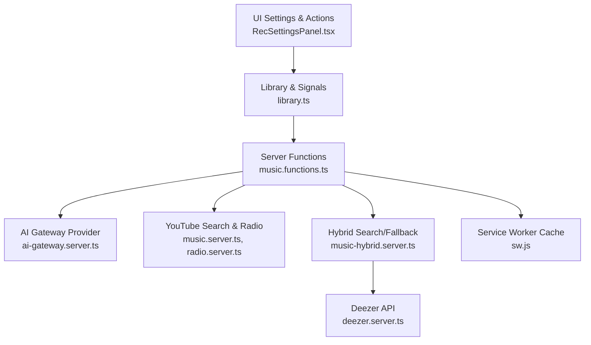
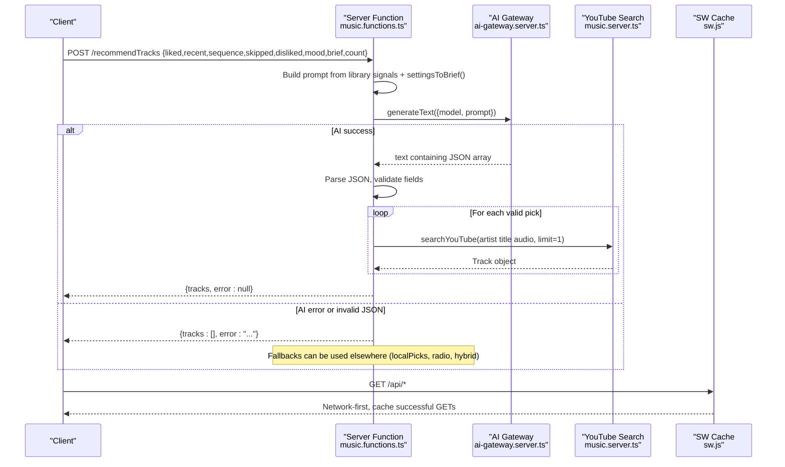
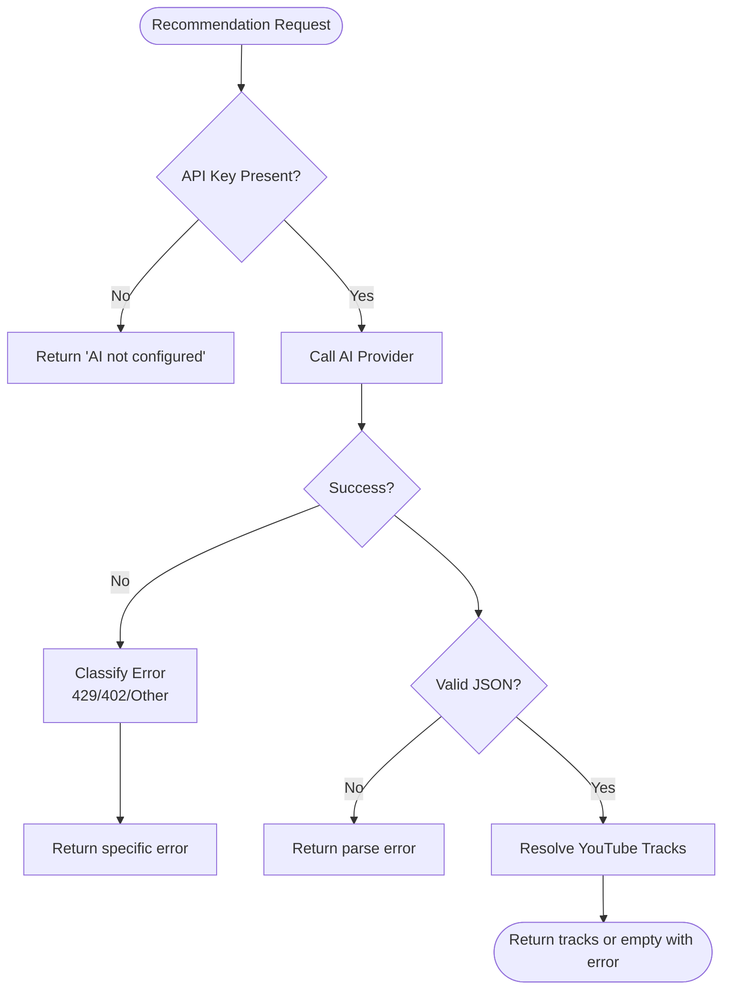
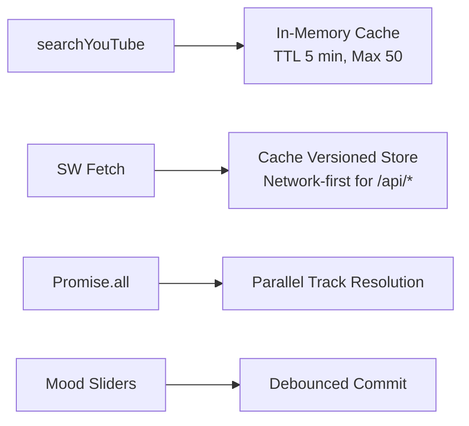
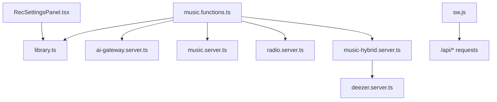

# AI Recommendation Engine

<cite>
**Referenced Files in This Document**
- [music.functions.ts](file://src/lib/music.functions.ts)
- [ai-gateway.server.ts](file://src/lib/ai-gateway.server.ts)
- [library.ts](file://src/lib/library.ts)
- [music.server.ts](file://src/lib/music.server.ts)
- [radio.server.ts](file://src/lib/radio.server.ts)
- [music-hybrid.server.ts](file://src/lib/music-hybrid.server.ts)
- [deezer.server.ts](file://src/lib/deezer.server.ts)
- [RecSettingsPanel.tsx](file://src/components/music/RecSettingsPanel.tsx)
- [sw.js](file://public/sw.js)
</cite>

## Table of Contents
1. [Introduction](#introduction)
2. [Project Structure](#project-structure)
3. [Core Components](#core-components)
4. [Architecture Overview](#architecture-overview)
5. [Detailed Component Analysis](#detailed-component-analysis)
6. [Dependency Analysis](#dependency-analysis)
7. [Performance Considerations](#performance-considerations)
8. [Troubleshooting Guide](#troubleshooting-guide)
9. [Conclusion](#conclusion)
10. [Appendices](#appendices)

## Introduction
This document explains the AI-powered recommendation engine that personalizes music suggestions by analyzing user behavior (likes, dislikes, listening history, skips, completions), explicit preferences (moods, genres, languages, topics), and contextual signals (current mood, energy level). It covers prompt engineering strategies, response parsing logic, fallback mechanisms when AI services are unavailable or return unexpected responses, configuration options for AI providers, performance optimizations (caching, request queuing, batch processing), and examples for customizing recommendation criteria and integrating additional preference signals.

## Project Structure
The recommendation system is implemented as a set of server functions that orchestrate:
- User library and behavioral signals
- Prompt assembly from user settings and behavior
- AI provider calls to generate structured recommendations
- Parsing and enrichment of AI output into playable tracks
- Fallbacks to non-AI sources (YouTube radio, Deezer previews, trending searches)
- Caching at multiple layers (in-memory search cache, service worker cache)

**Diagram sources**
- [RecSettingsPanel.tsx:1-284](file://src/components/music/RecSettingsPanel.tsx#L1-L284)
- [library.ts:105-110](file://src/lib/library.ts#L105-L110)
- [music.functions.ts:58-137](file://src/lib/music.functions.ts#L58-L137)
- [ai-gateway.server.ts:1-10](file://src/lib/ai-gateway.server.ts#L1-L10)
- [music.server.ts:182-247](file://src/lib/music.server.ts#L182-L247)
- [radio.server.ts:25-94](file://src/lib/radio.server.ts#L25-L94)
- [music-hybrid.server.ts:22-98](file://src/lib/music-hybrid.server.ts#L22-L98)
- [deezer.server.ts:39-97](file://src/lib/deezer.server.ts#L39-L97)
- [sw.js:35-84](file://public/sw.js#L35-L84)

**Section sources**
- [music.functions.ts:58-137](file://src/lib/music.functions.ts#L58-L137)
- [library.ts:105-110](file://src/lib/library.ts#L105-L110)
- [sw.js:35-84](file://public/sw.js#L35-L84)

## Core Components
- Server-side recommendation endpoints:
  - recommendTracks: AI-driven personalized picks with JSON response parsing and YouTube resolution
  - buildMix: Discover or new release mixes; discover uses AI, newrelease uses targeted YouTube queries
  - localPicks: Non-AI fallback mirroring YouTube Music’s balance strategy
  - newSongs, podcastPicks, radioTracks, moodPicks: Non-AI curated flows
- Library and signals:
  - Tracks likes, dislikes, history, stats, and RecSettings
  - Translates settings into a natural-language brief for prompts
- AI gateway:
  - OpenAI-compatible provider configured via environment key
- Search and streaming:
  - YouTube scraping with caching and filtering
  - Deezer preview fallback
  - Service worker caching for API responses

**Section sources**
- [music.functions.ts:58-137](file://src/lib/music.functions.ts#L58-L137)
- [music.functions.ts:156-245](file://src/lib/music.functions.ts#L156-L245)
- [music.functions.ts:324-369](file://src/lib/music.functions.ts#L324-L369)
- [library.ts:563-588](file://src/lib/library.ts#L563-L588)
- [ai-gateway.server.ts:1-10](file://src/lib/ai-gateway.server.ts#L1-L10)
- [music.server.ts:52-75](file://src/lib/music.server.ts#L52-L75)
- [music-hybrid.server.ts:22-98](file://src/lib/music-hybrid.server.ts#L22-L98)
- [deezer.server.ts:39-97](file://src/lib/deezer.server.ts#L39-L97)
- [sw.js:35-84](file://public/sw.js#L35-L84)

## Architecture Overview
The end-to-end flow for AI recommendations:
1. UI collects user tuning preferences and behavioral signals.
2. Server function builds a prompt from these signals.
3. AI provider generates a JSON array of recommended tracks with reasons.
4. Server parses the JSON, validates entries, and resolves each track via YouTube search.
5. If AI fails or returns invalid data, fallbacks provide non-AI recommendations.

**Diagram sources**
- [music.functions.ts:58-137](file://src/lib/music.functions.ts#L58-L137)
- [library.ts:563-588](file://src/lib/library.ts#L563-L588)
- [ai-gateway.server.ts:1-10](file://src/lib/ai-gateway.server.ts#L1-L10)
- [music.server.ts:182-247](file://src/lib/music.server.ts#L182-L247)
- [sw.js:35-84](file://public/sw.js#L35-L84)

## Detailed Component Analysis

### Prompt Engineering Strategy
- Inputs to prompts:
  - Liked songs, recent plays, sequence of last sessions with actions (played, skipped, replayed)
  - Repeatedly skipped tracks and disliked tracks to avoid similar sounds
  - Optional mood request and a concise “tuning brief” derived from RecSettings (moods, genres, languages, discovery vs familiarity, energy, instrumental-only)
- Prompt structure:
  - Role framing (“map sonic DNA”)
  - Behavioral context (ordered sequence, likes/dislikes)
  - Explicit constraints (avoid certain artists/sounds, respect tuning)
  - Output format enforcement (strict JSON array with title, artist, reason)
- Two modes:
  - recommendTracks: general personalized picks
  - buildMix (discover): focus on unknown artists close to listener’s profile

Examples of how signals are assembled:
- Behavior summary and avoidance lists are appended to the prompt
- Tuning brief is generated from RecSettings using settingsToBrief

**Section sources**
- [music.functions.ts:70-92](file://src/lib/music.functions.ts#L70-L92)
- [music.functions.ts:189-205](file://src/lib/music.functions.ts#L189-L205)
- [library.ts:563-588](file://src/lib/library.ts#L563-L588)

### Response Parsing Logic
- The AI returns raw text; the server extracts the first JSON array using a regex.
- Parses into an array of objects with title, artist, and optional reason.
- Validates that both title and artist exist; truncates to requested count.
- Resolves each pick to a playable YouTube track by searching “artist title audio”.
- Attaches the AI-provided reason to the final track object.

Error handling during parsing:
- If no JSON array found or parse fails, returns an error message.
- If resolution fails for a pick, it is dropped from results.

**Section sources**
- [music.functions.ts:113-136](file://src/lib/music.functions.ts#L113-L136)
- [music.functions.ts:220-244](file://src/lib/music.functions.ts#L220-L244)

### Fallback Mechanisms
When AI is unavailable or returns unexpected responses:
- Environment check: if LOVABLE_API_KEY is missing, returns a clear error.
- Error classification: rate limits (429), credits exhausted (402/payment required), generic unavailability.
- Non-AI alternatives:
  - localPicks: deterministic mix balancing comfort, similar artists, and older favorites
  - radioTracks: YouTube’s built-in radio based on current track
  - newSongs/podcastPicks/moodPicks: curated non-AI flows
  - Hybrid search: YouTube primary with Deezer fallback for playable previews

**Diagram sources**
- [music.functions.ts:58-137](file://src/lib/music.functions.ts#L58-L137)
- [music.functions.ts:156-245](file://src/lib/music.functions.ts#L156-L245)
- [music-hybrid.server.ts:22-98](file://src/lib/music-hybrid.server.ts#L22-L98)

**Section sources**
- [music.functions.ts:58-137](file://src/lib/music.functions.ts#L58-L137)
- [music-hybrid.server.ts:22-98](file://src/lib/music-hybrid.server.ts#L22-L98)

### Configuration Options for AI Providers
- Provider setup:
  - createAiGatewayProvider configures an OpenAI-compatible client pointing to the Lovable AI gateway with a custom header for the API key.
- Model selection:
  - Uses a Gemini model via the gateway; model name is specified in the call.
- Temperature and advanced parameters:
  - Not explicitly exposed in current code; could be added to generateText options if needed.
- Environment:
  - Requires LOVABLE_API_KEY to be set; otherwise returns an error indicating AI is not configured.

**Section sources**
- [ai-gateway.server.ts:1-10](file://src/lib/ai-gateway.server.ts#L1-L10)
- [music.functions.ts:61-65](file://src/lib/music.functions.ts#L61-L65)
- [music.functions.ts:99-103](file://src/lib/music.functions.ts#L99-L103)
- [music.functions.ts:209-211](file://src/lib/music.functions.ts#L209-L211)

### Performance Optimization
- In-memory search cache:
  - LRU-style cache for YouTube search results with a 5-minute TTL and max size cap to reduce repeated network calls.
- Service worker caching:
  - Network-first for API calls; caches successful GET responses under a versioned cache key.
  - Audio streams bypass caching to avoid quota issues.
- Batch processing:
  - Parallel resolution of AI picks via Promise.all to resolve YouTube tracks concurrently.
  - Batching of per-artist queries for new releases and podcasts to minimize round-trips.
- Debounced updates:
  - UI debounces mood slider changes before committing to settings to reduce state churn.

**Diagram sources**
- [music.server.ts:52-75](file://src/lib/music.server.ts#L52-L75)
- [sw.js:35-84](file://public/sw.js#L35-L84)
- [music.functions.ts:124-134](file://src/lib/music.functions.ts#L124-L134)
- [RecSettingsPanel.tsx:17-40](file://src/components/music/RecSettingsPanel.tsx#L17-L40)

**Section sources**
- [music.server.ts:52-75](file://src/lib/music.server.ts#L52-L75)
- [sw.js:35-84](file://public/sw.js#L35-L84)
- [music.functions.ts:124-134](file://src/lib/music.functions.ts#L124-L134)
- [RecSettingsPanel.tsx:17-40](file://src/components/music/RecSettingsPanel.tsx#L17-L40)

### Customizing Recommendation Criteria and Integrating Additional Signals
- Current customization points:
  - Moods with weights (0–100%)
  - Genres and languages
  - Podcast topics
  - Discovery vs familiarity and energy sliders
  - Instrumental-only toggle
  - Fresh release injection interval and notifications
- How to extend:
  - Add new moods or topics to the constants and UI toggles
  - Extend settingsToBrief to include new signals (e.g., preferred BPM range, vocal presence)
  - Update prompts in recommendTracks/buildMix to incorporate new fields
  - Integrate additional behavioral signals (e.g., time-of-day patterns, device type) into the prompt or filters

Examples of integration:
- Include a “preferred tempo range” by adding a field to RecSettings and appending it to the brief
- Enforce language-specific filters by expanding LANG_SEARCH mappings and query construction in newSongs/podcastPicks

**Section sources**
- [library.ts:23-78](file://src/lib/library.ts#L23-L78)
- [library.ts:563-588](file://src/lib/library.ts#L563-L588)
- [music.functions.ts:398-458](file://src/lib/music.functions.ts#L398-L458)
- [music.functions.ts:491-559](file://src/lib/music.functions.ts#L491-L559)
- [RecSettingsPanel.tsx:80-266](file://src/components/music/RecSettingsPanel.tsx#L80-L266)

## Dependency Analysis
- Server functions depend on:
  - Library for signals and settings
  - AI gateway for generation
  - YouTube search for enrichment and non-AI flows
  - Deezer for fallback previews
  - Service worker for caching API responses
- Coupling:
  - Strong coupling between prompt assembly and library signals
  - Loose coupling via modular imports (dynamic import of ai and gateway modules)
- External integrations:
  - Lovable AI gateway (OpenAI-compatible)
  - YouTube (search and radio)
  - Deezer (preview API)

**Diagram sources**
- [music.functions.ts:58-137](file://src/lib/music.functions.ts#L58-L137)
- [library.ts:105-110](file://src/lib/library.ts#L105-L110)
- [ai-gateway.server.ts:1-10](file://src/lib/ai-gateway.server.ts#L1-L10)
- [music.server.ts:182-247](file://src/lib/music.server.ts#L182-L247)
- [radio.server.ts:25-94](file://src/lib/radio.server.ts#L25-L94)
- [music-hybrid.server.ts:22-98](file://src/lib/music-hybrid.server.ts#L22-L98)
- [deezer.server.ts:39-97](file://src/lib/deezer.server.ts#L39-L97)
- [sw.js:35-84](file://public/sw.js#L35-L84)

**Section sources**
- [music.functions.ts:58-137](file://src/lib/music.functions.ts#L58-L137)
- [library.ts:105-110](file://src/lib/library.ts#L105-L110)
- [sw.js:35-84](file://public/sw.js#L35-L84)

## Performance Considerations
- Reduce redundant network calls:
  - Use in-memory cache for YouTube searches with TTL and size limits
  - Rely on service worker cache for API responses
- Parallelize independent operations:
  - Resolve AI picks concurrently with Promise.all
  - Batch per-artist queries for new releases and podcasts
- Debounce UI interactions:
  - Mood sliders commit on release to avoid excessive state updates
- Avoid caching large media:
  - Service worker intentionally skips audio stream caching

[No sources needed since this section provides general guidance]

## Troubleshooting Guide
Common issues and resolutions:
- AI not configured:
  - Ensure LOVABLE_API_KEY is set; otherwise endpoints return a clear error
- Rate limits or credits exhausted:
  - Errors are classified and returned with actionable messages (try again later, add credits)
- Invalid AI response:
  - If JSON cannot be parsed or lacks required fields, the endpoint returns an error; consider retrying or falling back to non-AI flows
- No results from YouTube:
  - Some tracks may not be available; the system drops failed resolutions and returns what it finds
- Fallbacks:
  - Use localPicks, radioTracks, newSongs, podcastPicks, or hybrid search when AI is down

Operational tips:
- Monitor console logs for warnings about failed external calls
- Validate environment variables and network connectivity
- Use non-AI endpoints for immediate results while investigating AI issues

**Section sources**
- [music.functions.ts:61-65](file://src/lib/music.functions.ts#L61-L65)
- [music.functions.ts:105-111](file://src/lib/music.functions.ts#L105-L111)
- [music.functions.ts:113-121](file://src/lib/music.functions.ts#L113-L121)
- [music.functions.ts:212-218](file://src/lib/music.functions.ts#L212-L218)
- [music-hybrid.server.ts:22-98](file://src/lib/music-hybrid.server.ts#L22-L98)

## Conclusion
The recommendation engine combines rich behavioral signals and explicit user preferences to craft personalized music suggestions via AI, with robust fallbacks ensuring continuous functionality. It employs careful prompt engineering, strict JSON parsing, and parallelized enrichment to deliver high-quality results efficiently. Caching strategies and debounced UI interactions optimize performance, while modular design allows easy extension of signals and algorithms.

[No sources needed since this section summarizes without analyzing specific files]

## Appendices

### Example: Customizing Recommendation Criteria
- Add a new mood or topic:
  - Extend constants in library.ts
  - Add UI controls in RecSettingsPanel.tsx
  - Update settingsToBrief to include the new signal
- Adjust discovery and energy:
  - Use existing sliders to tune familiarity vs deep cuts and calm vs energetic
- Integrate additional signals:
  - Expand brief generation to include new fields
  - Update prompts in recommendTracks/buildMix to leverage them

**Section sources**
- [library.ts:23-78](file://src/lib/library.ts#L23-L78)
- [library.ts:563-588](file://src/lib/library.ts#L563-L588)
- [RecSettingsPanel.tsx:80-266](file://src/components/music/RecSettingsPanel.tsx#L80-L266)
- [music.functions.ts:70-92](file://src/lib/music.functions.ts#L70-L92)
- [music.functions.ts:189-205](file://src/lib/music.functions.ts#L189-L205)