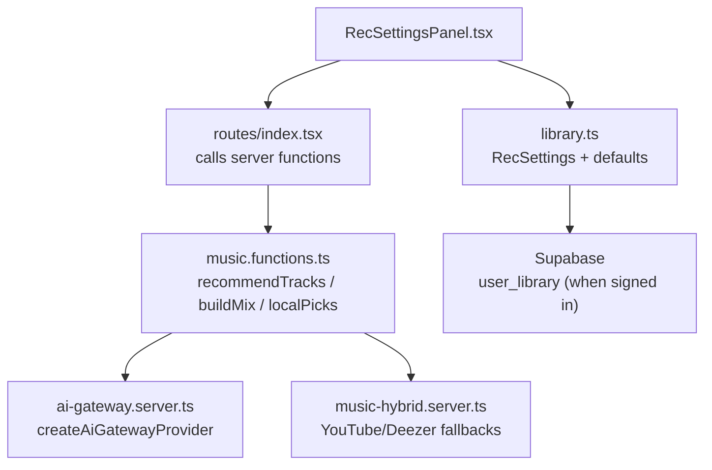
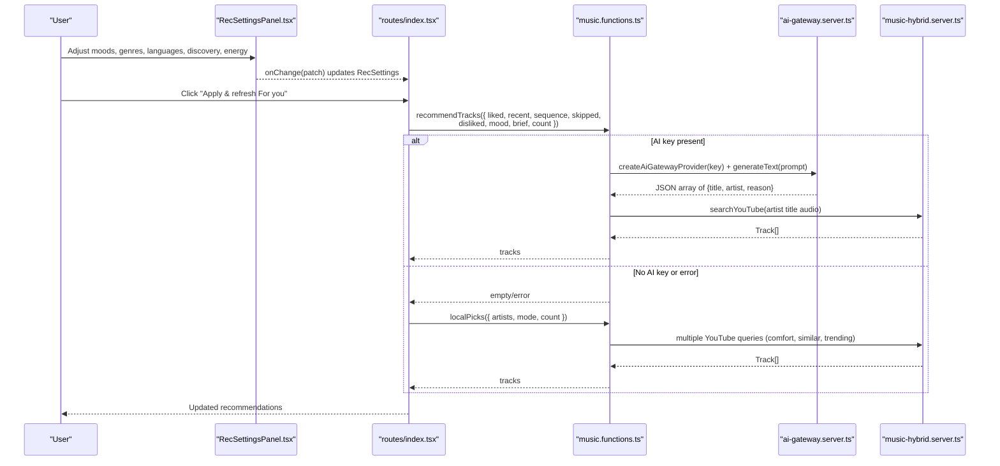
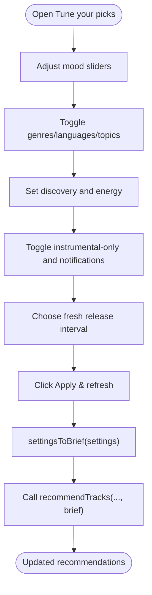
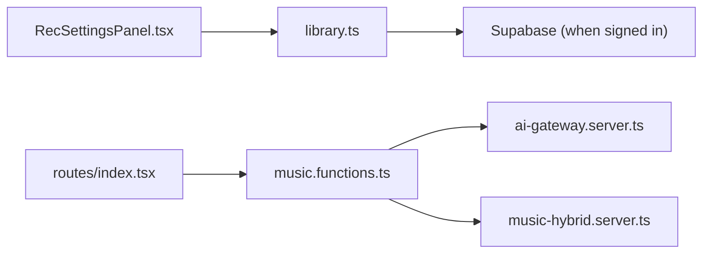

# Configuration & Customization

<cite>
**Referenced Files in This Document**
- [RecSettingsPanel.tsx](file://src/components/music/RecSettingsPanel.tsx)
- [library.ts](file://src/lib/library.ts)
- [music.functions.ts](file://src/lib/music.functions.ts)
- [ai-gateway.server.ts](file://src/lib/ai-gateway.server.ts)
- [music-hybrid.server.ts](file://src/lib/music-hybrid.server.ts)
- [index.tsx](file://src/routes/index.tsx)
</cite>

## Table of Contents
1. [Introduction](#introduction)
2. [Project Structure](#project-structure)
3. [Core Components](#core-components)
4. [Architecture Overview](#architecture-overview)
5. [Detailed Component Analysis](#detailed-component-analysis)
6. [Dependency Analysis](#dependency-analysis)
7. [Performance Considerations](#performance-considerations)
8. [Troubleshooting Guide](#troubleshooting-guide)
9. [Conclusion](#conclusion)
10. [Appendices](#appendices)

## Introduction
This document explains how to configure and customize the AI recommendation engine, including API keys, provider settings, temperature parameters, and recommendation algorithms. It also documents the user preference interface (RecSettingsPanel), how it integrates with backend configuration, and where you can customize criteria, scoring, and personalization weights. Finally, it provides examples of advanced configurations and integration points for external preference systems.

## Project Structure
The recommendation system spans a small set of focused modules:
- Frontend preferences UI: RecSettingsPanel renders sliders, toggles, and tags that shape recommendations.
- Preference model and persistence: library.ts defines RecSettings, default values, and syncs to local storage and Supabase when signed in.
- Backend recommendation functions: music.functions.ts exposes server functions that call the AI gateway or run local heuristics.
- AI provider configuration: ai-gateway.server.ts configures the OpenAI-compatible gateway used by the AI SDK.
- Hybrid fallbacks: music-hybrid.server.ts orchestrates YouTube-first search with Deezer fallbacks for reliability.
- Route orchestration: index.tsx wires user actions into recommendation calls and falls back to local picks when needed.

**Diagram sources**
- [RecSettingsPanel.tsx:1-284](file://src/components/music/RecSettingsPanel.tsx#L1-L284)
- [library.ts:68-103](file://src/lib/library.ts#L68-L103)
- [music.functions.ts:58-137](file://src/lib/music.functions.ts#L58-L137)
- [ai-gateway.server.ts:1-9](file://src/lib/ai-gateway.server.ts#L1-L9)
- [music-hybrid.server.ts:22-49](file://src/lib/music-hybrid.server.ts#L22-L49)
- [index.tsx:612-650](file://src/routes/index.tsx#L612-L650)

**Section sources**
- [RecSettingsPanel.tsx:1-284](file://src/components/music/RecSettingsPanel.tsx#L1-L284)
- [library.ts:68-103](file://src/lib/library.ts#L68-L103)
- [music.functions.ts:58-137](file://src/lib/music.functions.ts#L58-L137)
- [ai-gateway.server.ts:1-9](file://src/lib/ai-gateway.server.ts#L1-L9)
- [music-hybrid.server.ts:22-49](file://src/lib/music-hybrid.server.ts#L22-L49)
- [index.tsx:612-650](file://src/routes/index.tsx#L612-L650)

## Core Components
- RecSettingsPanel: User-facing controls for moods, genres, languages, podcast topics, discovery level, energy, instrumental-only, new-drop notifications, and fresh release injection interval.
- RecSettings model: Defines all tunable fields and their ranges; includes defaults and helpers to convert settings into a natural-language brief for the AI.
- Server functions: recommendTracks and buildMix use the AI gateway; localPicks and other functions provide deterministic fallbacks without an AI key.
- AI gateway: A thin wrapper around an OpenAI-compatible provider configured with a base URL and API key header.

Key configuration options exposed to users:
- Moods: per-mood weight from 0–100.
- Genres: multi-select list.
- Languages: multi-select list.
- Podcast topics: multi-select list.
- Discovery: 0–100 (familiar to deep cuts).
- Energy: 0–100 (calm to energetic).
- Instrumental only: boolean toggle.
- Notify new drops: boolean toggle for browser notifications.
- Inject interval: number of songs between fresh releases (0 = off).

These are persisted locally and synced to the cloud when signed in.

**Section sources**
- [RecSettingsPanel.tsx:1-284](file://src/components/music/RecSettingsPanel.tsx#L1-L284)
- [library.ts:68-103](file://src/lib/library.ts#L68-L103)
- [library.ts:563-588](file://src/lib/library.ts#L563-L588)

## Architecture Overview
The recommendation flow has two paths:
- AI path: When LOVABLE_API_KEY is set, server functions call the AI gateway to generate personalized picks based on user history, likes/dislikes, sequence behavior, and the settings brief.
- Local path: If no AI key is present or the AI call fails, the app uses deterministic heuristics (localPicks) to assemble a balanced mix.

**Diagram sources**
- [music.functions.ts:58-137](file://src/lib/music.functions.ts#L58-L137)
- [ai-gateway.server.ts:1-9](file://src/lib/ai-gateway.server.ts#L1-L9)
- [music-hybrid.server.ts:22-49](file://src/lib/music-hybrid.server.ts#L22-L49)
- [index.tsx:612-650](file://src/routes/index.tsx#L612-L650)

## Detailed Component Analysis

### RecSettingsPanel: User Preference Interface
- Mood weighting: Per-mood sliders with debounce commit on release; warns if all moods are zero.
- Genre/language/topic selection: Multi-select chips toggled via onChange.
- Discovery and energy: Sliders that influence the prompt’s emphasis on familiarity vs novelty and calm vs energy.
- Instrumental-only: Boolean toggle passed through to the settings brief.
- New drop notifications: Requests browser notification permission when enabled.
- Fresh release injection: Interval selector to insert new releases into the queue periodically.

Integration with backend:
- The panel emits partial patches to update RecSettings in memory and persist them.
- On apply, the route composes a brief using settingsToBrief and calls the recommendation server function.

**Diagram sources**
- [RecSettingsPanel.tsx:17-284](file://src/components/music/RecSettingsPanel.tsx#L17-L284)
- [library.ts:563-588](file://src/lib/library.ts#L563-L588)
- [index.tsx:612-650](file://src/routes/index.tsx#L612-L650)

**Section sources**
- [RecSettingsPanel.tsx:17-284](file://src/components/music/RecSettingsPanel.tsx#L17-L284)
- [library.ts:563-588](file://src/lib/library.ts#L563-L588)

### Recommendation Algorithms and Personalization Weights
- AI-driven recommendations:
  - Inputs include liked/recent tracks, session sequence, skips, dislikes, optional mood, and a concise brief derived from RecSettings.
  - The prompt instructs the model to balance comfort, forgotten favorites, and new-sounding artists while respecting tuning preferences.
  - Results are parsed as JSON and resolved to playable tracks via YouTube search.
- Local fallback algorithm:
  - Uses deterministic queries to assemble a mix: comfort hits from top artists, similar artists, and trending content.
  - Mode-specific logic supports feed, discover, and next-up scenarios.
- Podcast and new song engines:
  - Language and topic mappings drive targeted searches for podcasts and new songs without AI.

Personalization levers:
- Moods and genres/languages directly shape the brief and thus the AI’s focus.
- Discovery and energy shift the balance toward familiar or novel content and calm or energetic material.
- Instrumental-only narrows results to vocal-free tracks.
- Skip and dislike signals steer the AI away from certain sounds.

**Section sources**
- [music.functions.ts:58-137](file://src/lib/music.functions.ts#L58-L137)
- [music.functions.ts:156-245](file://src/lib/music.functions.ts#L156-L245)
- [music.functions.ts:324-369](file://src/lib/music.functions.ts#L324-L369)
- [music.functions.ts:398-458](file://src/lib/music.functions.ts#L398-L458)
- [music.functions.ts:491-559](file://src/lib/music.functions.ts#L491-L559)
- [library.ts:563-588](file://src/lib/library.ts#L563-L588)

### AI Provider Configuration
- Provider setup:
  - createAiGatewayProvider builds an OpenAI-compatible client targeting a hosted gateway endpoint.
  - Authentication is provided via a custom header containing the API key.
- Environment requirement:
  - The server reads LOVABLE_API_KEY at runtime; if missing, AI endpoints return an explicit “not configured” message and the app falls back to local picks.

Temperature and model parameters:
- The current implementation uses a fixed model identifier and does not expose temperature or other generation parameters in code. To customize these, extend the provider creation or the generateText call to accept additional parameters.

**Section sources**
- [ai-gateway.server.ts:1-9](file://src/lib/ai-gateway.server.ts#L1-L9)
- [music.functions.ts:58-137](file://src/lib/music.functions.ts#L58-L137)

### Hybrid Search and Fallback Strategy
- YouTube-first strategy:
  - Primary search targets full songs; if insufficient results or errors occur, it falls back to Deezer previews.
- Radio strategy:
  - Attempts YouTube radio first; if unavailable, searches Deezer for popular content.
- Stream resolution:
  - Provides direct URLs for Deezer previews and proxies for YouTube streams.

This ensures reliable playback even when upstream services fail or restrict streaming.

**Section sources**
- [music-hybrid.server.ts:22-49](file://src/lib/music-hybrid.server.ts#L22-L49)
- [music-hybrid.server.ts:54-78](file://src/lib/music-hybrid.server.ts#L54-L78)
- [music-hybrid.server.ts:80-98](file://src/lib/music-hybrid.server.ts#L80-L98)

## Dependency Analysis

- Coupling:
  - RecSettingsPanel depends on library types and constants for available options.
  - Routes depend on server functions for both AI and local strategies.
  - Server functions depend on the AI gateway and hybrid search utilities.
- Cohesion:
  - Each module has a clear responsibility: UI, preference model, orchestration, provider, and fallback search.

**Diagram sources**
- [RecSettingsPanel.tsx:1-284](file://src/components/music/RecSettingsPanel.tsx#L1-L284)
- [library.ts:68-103](file://src/lib/library.ts#L68-L103)
- [music.functions.ts:58-137](file://src/lib/music.functions.ts#L58-L137)
- [ai-gateway.server.ts:1-9](file://src/lib/ai-gateway.server.ts#L1-L9)
- [music-hybrid.server.ts:22-49](file://src/lib/music-hybrid.server.ts#L22-L49)

**Section sources**
- [RecSettingsPanel.tsx:1-284](file://src/components/music/RecSettingsPanel.tsx#L1-L284)
- [library.ts:68-103](file://src/lib/library.ts#L68-L103)
- [music.functions.ts:58-137](file://src/lib/music.functions.ts#L58-L137)
- [ai-gateway.server.ts:1-9](file://src/lib/ai-gateway.server.ts#L1-L9)
- [music-hybrid.server.ts:22-49](file://src/lib/music-hybrid.server.ts#L22-L49)

## Performance Considerations
- Debounced mood updates: Slider changes are committed on release to reduce state churn.
- Local-first persistence: Settings and stats are stored in localStorage for instant access and resilience.
- Cloud sync throttling: Changes are debounced before syncing to avoid excessive network requests.
- Fallback chains: Hybrid search minimizes latency and failure impact by trying multiple sources.
- Deterministic fallback: When AI is unavailable, localPicks still delivers a balanced mix quickly.

[No sources needed since this section provides general guidance]

## Troubleshooting Guide
Common issues and resolutions:
- AI not configured:
  - Symptom: Recommendations return “AI is not configured yet.”
  - Cause: Missing LOVABLE_API_KEY environment variable.
  - Resolution: Set LOVABLE_API_KEY in your server environment.
- Rate limits or credits exhausted:
  - Symptom: Errors indicating too many requests or payment required.
  - Cause: Gateway rate limiting or depleted credits.
  - Resolution: Retry later or add credits to the gateway account.
- Parsing failures:
  - Symptom: “Could not read the recommendations.”
  - Cause: Unexpected response format from the AI.
  - Resolution: Retry; ensure the model returns valid JSON arrays.
- No results from AI:
  - Behavior: The app automatically falls back to localPicks to keep the experience working.

**Section sources**
- [music.functions.ts:58-137](file://src/lib/music.functions.ts#L58-L137)
- [music.functions.ts:156-245](file://src/lib/music.functions.ts#L156-L245)

## Conclusion
The recommendation engine combines a flexible user preference interface with robust backend logic. Users tune moods, genres, languages, discovery, energy, and more through RecSettingsPanel. The backend translates these into a concise brief for the AI and, when necessary, falls back to deterministic heuristics. Provider configuration is centralized and requires only an API key to enable AI features. Extending the system involves updating the brief, adjusting prompts, or adding new preference fields and UI controls.

[No sources needed since this section summarizes without analyzing specific files]

## Appendices

### Configuration Options Reference
- API key:
  - Name: LOVABLE_API_KEY
  - Scope: Server-side environment variable consumed by server functions.
  - Purpose: Authenticates requests to the AI gateway.
- Provider settings:
  - Base URL: Configured in the OpenAI-compatible provider.
  - Header: Lovable-API-Key carries the API key.
- Temperature and model parameters:
  - Not currently exposed in code; model identifier is fixed.
  - To customize, modify the generateText call to accept additional parameters such as temperature.

**Section sources**
- [ai-gateway.server.ts:1-9](file://src/lib/ai-gateway.server.ts#L1-L9)
- [music.functions.ts:58-137](file://src/lib/music.functions.ts#L58-L137)

### Advanced Configuration Examples
- Emphasize instrumental content:
  - Enable instrumental-only in RecSettingsPanel; the settings brief will instruct the AI to exclude vocals.
- Focus on specific languages and topics:
  - Select languages and podcast topics to narrow AI suggestions and podcast mixes accordingly.
- Increase discovery:
  - Raise the discovery slider to push the AI toward deeper cuts and less familiar artists.
- Control energy:
  - Adjust the energy slider to target calm or high-energy selections across music and podcasts.

**Section sources**
- [RecSettingsPanel.tsx:17-284](file://src/components/music/RecSettingsPanel.tsx#L17-L284)
- [library.ts:563-588](file://src/lib/library.ts#L563-L588)

### Integration with External Preference Systems
- Local-to-cloud sync:
  - When signed in, settings and library data are merged with and pushed to Supabase, enabling cross-device consistency.
- Extending preferences:
  - Add new fields to RecSettings, update defaults, and extend settingsToBrief to include them in the AI prompt.
  - Update RecSettingsPanel to render controls for the new fields and wire onChange handlers.
- Hooking into recommendation flows:
  - Pass new preference signals into recommendTracks/buildMix via the brief or dedicated fields, then adjust prompts or local heuristics accordingly.

**Section sources**
- [library.ts:242-349](file://src/lib/library.ts#L242-L349)
- [library.ts:563-588](file://src/lib/library.ts#L563-L588)
- [music.functions.ts:58-137](file://src/lib/music.functions.ts#L58-L137)