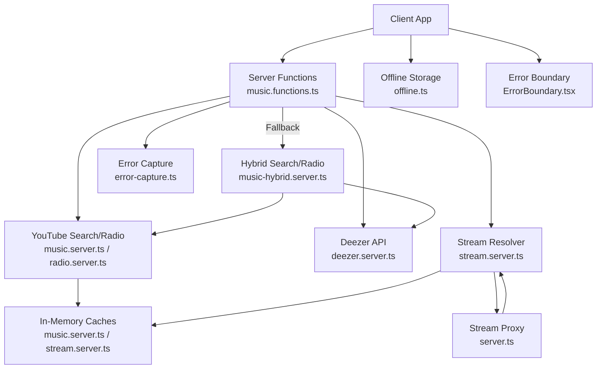
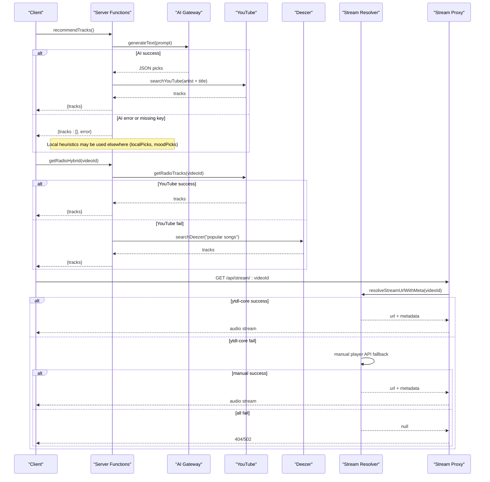
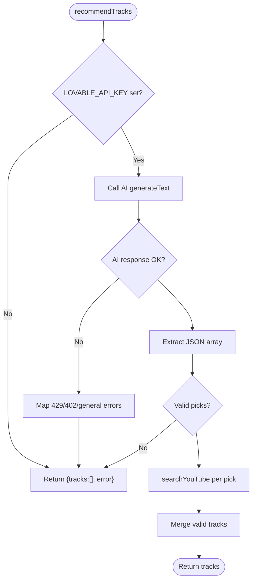
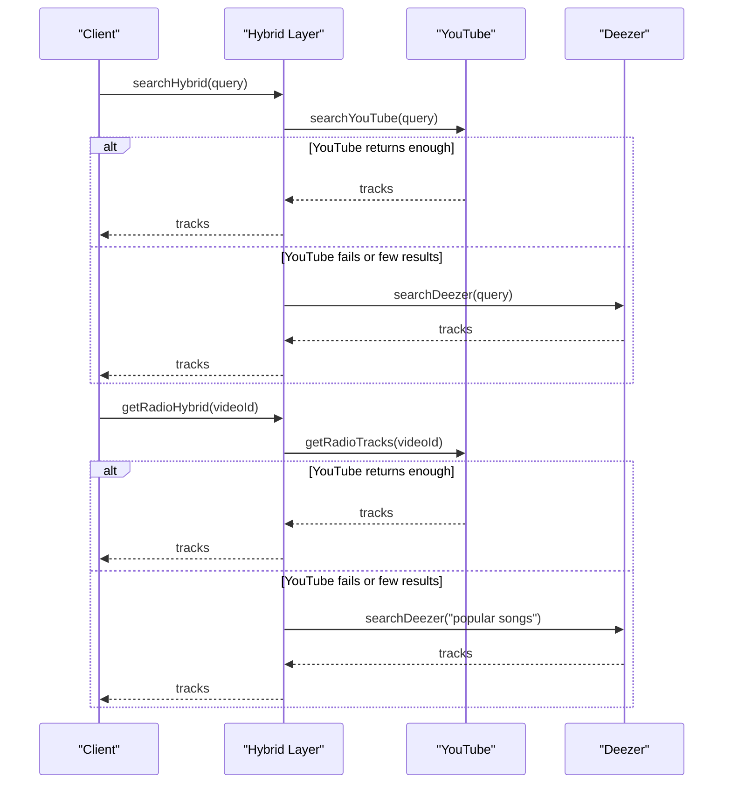
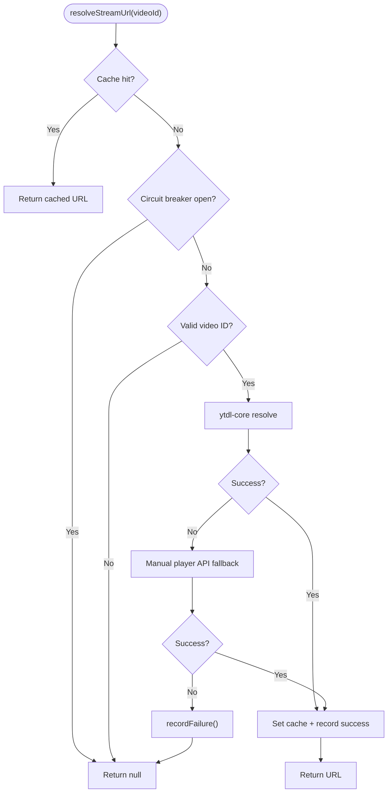
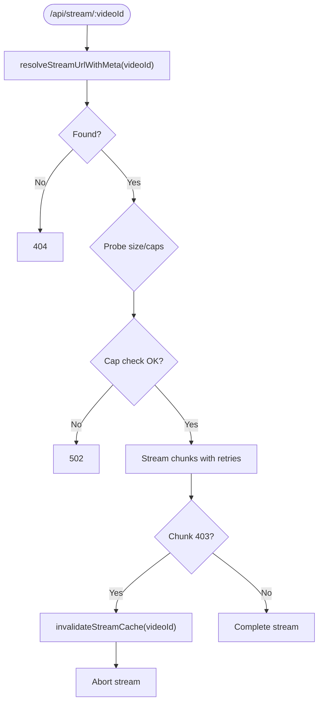
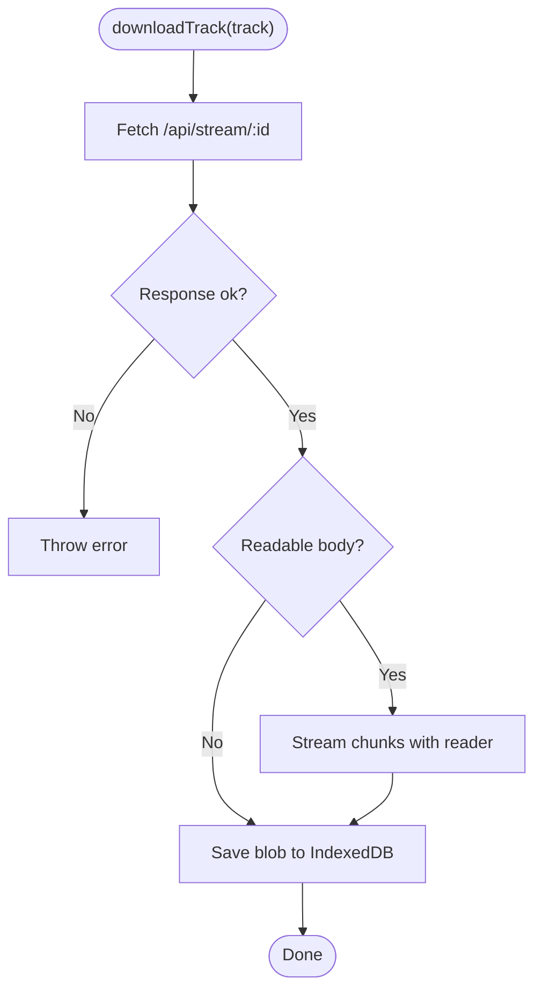
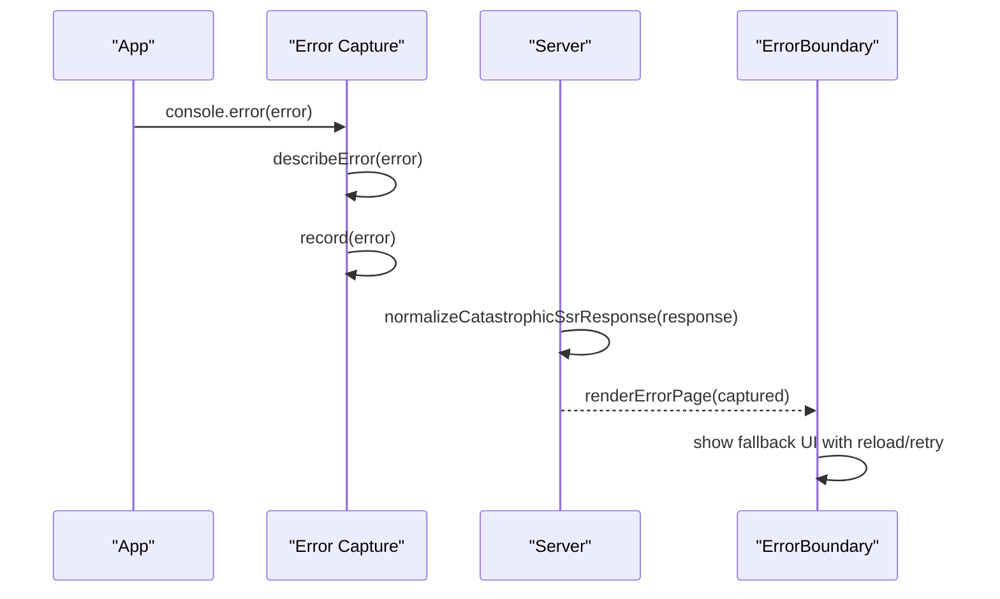
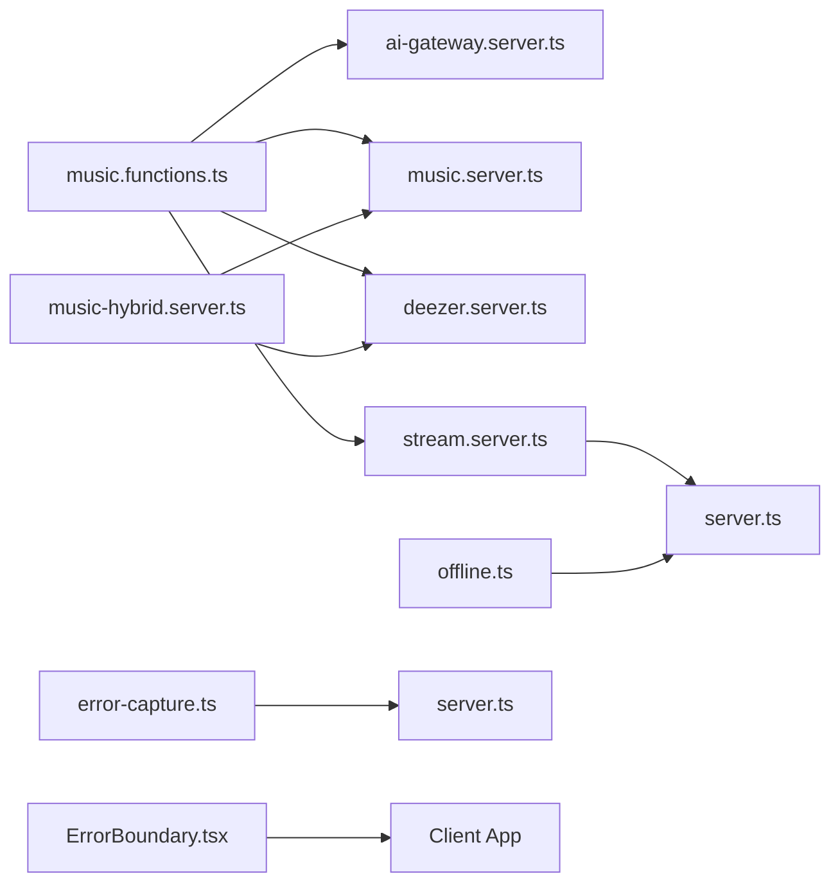

# Fallback Mechanisms & Error Handling

<cite>
**Referenced Files in This Document**
- [ai-gateway.server.ts](file://src/lib/ai-gateway.server.ts)
- [music.functions.ts](file://src/lib/music.functions.ts)
- [music-hybrid.server.ts](file://src/lib/music-hybrid.server.ts)
- [music.server.ts](file://src/lib/music.server.ts)
- [deezer.server.ts](file://src/lib/deezer.server.ts)
- [radio.server.ts](file://src/lib/radio.server.ts)
- [stream.server.ts](file://src/lib/stream.server.ts)
- [server.ts](file://src/server.ts)
- [error-capture.ts](file://src/lib/error-capture.ts)
- [offline.ts](file://src/lib/offline.ts)
- [ErrorBoundary.tsx](file://src/components/music/ErrorBoundary.tsx)
</cite>

## Table of Contents
1. [Introduction](#introduction)
2. [Project Structure](#project-structure)
3. [Core Components](#core-components)
4. [Architecture Overview](#architecture-overview)
5. [Detailed Component Analysis](#detailed-component-analysis)
6. [Dependency Analysis](#dependency-analysis)
7. [Performance Considerations](#performance-considerations)
8. [Troubleshooting Guide](#troubleshooting-guide)
9. [Conclusion](#conclusion)
10. [Appendices](#appendices)

## Introduction
This document explains the fallback mechanisms that keep recommendations and playback available when AI providers or upstream music sources are unavailable or return unexpected responses. It covers:
- Tiered fallback strategy across local heuristics, cached results, and alternative music sources
- Error detection, retry logic, and graceful degradation patterns
- Configuration options for customizing behavior and monitoring fallback triggers
- Troubleshooting guides for common failure scenarios

The system is designed to always return something playable when possible, falling back from AI-driven recommendations to deterministic heuristics and from YouTube-based results to Deezer previews.

## Project Structure
The fallbacks span several layers:
- Server functions orchestrate feature flows (recommendations, mixes, radio, new drops)
- Music search and radio utilities provide primary and fallback sources
- Stream resolution includes a circuit breaker and multiple resolver strategies
- Offline storage ensures playback without network connectivity
- Error capture and UI boundaries ensure graceful user experiences

**Diagram sources**
- [music.functions.ts:58-137](file://src/lib/music.functions.ts#L58-L137)
- [music.functions.ts:156-245](file://src/lib/music.functions.ts#L156-L245)
- [music-hybrid.server.ts:22-49](file://src/lib/music-hybrid.server.ts#L22-L49)
- [music-hybrid.server.ts:54-78](file://src/lib/music-hybrid.server.ts#L54-L78)
- [music.server.ts:182-247](file://src/lib/music.server.ts#L182-L247)
- [radio.server.ts:25-94](file://src/lib/radio.server.ts#L25-L94)
- [deezer.server.ts:39-74](file://src/lib/deezer.server.ts#L39-L74)
- [stream.server.ts:301-344](file://src/lib/stream.server.ts#L301-L344)
- [server.ts:119-202](file://src/server.ts#L119-L202)
- [error-capture.ts:1-82](file://src/lib/error-capture.ts#L1-L82)
- [offline.ts:149-201](file://src/lib/offline.ts#L149-L201)
- [ErrorBoundary.tsx:16-96](file://src/components/music/ErrorBoundary.tsx#L16-L96)

**Section sources**
- [music.functions.ts:58-137](file://src/lib/music.functions.ts#L58-L137)
- [music-hybrid.server.ts:22-49](file://src/lib/music-hybrid.server.ts#L22-L49)
- [stream.server.ts:301-344](file://src/lib/stream.server.ts#L301-L344)
- [server.ts:119-202](file://src/server.ts#L119-L202)

## Core Components
- AI gateway provider: configures an OpenAI-compatible provider used by recommendation endpoints
- Recommendation server functions: implement tiered fallbacks from AI to local heuristics
- Hybrid search/radio: YouTube primary with Deezer fallback; always returns playable tracks
- YouTube search and radio: scraping and playlist engine with caching and filters
- Deezer API: free preview source used as fallback and direct playback when available
- Stream resolver: ytdl-core primary, manual player API fallback, circuit breaker, cache
- Stream proxy: handles range requests, throttling, and invalidation on failures
- Offline storage: IndexedDB-backed downloads for offline playback
- Error capture and UI boundary: robust error logging and recovery UX

**Section sources**
- [ai-gateway.server.ts:1-10](file://src/lib/ai-gateway.server.ts#L1-L10)
- [music.functions.ts:58-137](file://src/lib/music.functions.ts#L58-L137)
- [music-hybrid.server.ts:22-49](file://src/lib/music-hybrid.server.ts#L22-L49)
- [music.server.ts:52-75](file://src/lib/music.server.ts#L52-L75)
- [deezer.server.ts:39-74](file://src/lib/deezer.server.ts#L39-L74)
- [stream.server.ts:22-90](file://src/lib/stream.server.ts#L22-L90)
- [server.ts:62-94](file://src/server.ts#L62-L94)
- [offline.ts:58-141](file://src/lib/offline.ts#L58-L141)
- [error-capture.ts:1-82](file://src/lib/error-capture.ts#L1-L82)
- [ErrorBoundary.tsx:16-96](file://src/components/music/ErrorBoundary.tsx#L16-L96)

## Architecture Overview
The system implements a layered fallback strategy:
- AI-driven recommendations fall back to deterministic heuristics when the AI key is missing or errors occur
- YouTube search/radio falls back to Deezer previews when YouTube fails or returns insufficient results
- Stream resolution uses ytdl-core first, then manual player API calls, with a circuit breaker and cache
- Playback can continue via offline storage if streaming fails

**Diagram sources**
- [music.functions.ts:58-137](file://src/lib/music.functions.ts#L58-L137)
- [music-hybrid.server.ts:54-78](file://src/lib/music-hybrid.server.ts#L54-L78)
- [stream.server.ts:301-344](file://src/lib/stream.server.ts#L301-L344)
- [server.ts:119-202](file://src/server.ts#L119-L202)

## Detailed Component Analysis

### AI Recommendations Fallback
- Primary path: AI generates JSON picks, which are resolved into YouTube tracks
- Fallback conditions: missing API key, rate limits (429), credits exhausted (402), parsing errors
- Behavior: returns empty tracks with descriptive errors; other features like localPicks and moodPicks remain available

**Diagram sources**
- [music.functions.ts:58-137](file://src/lib/music.functions.ts#L58-L137)

**Section sources**
- [music.functions.ts:58-137](file://src/lib/music.functions.ts#L58-L137)
- [ai-gateway.server.ts:1-10](file://src/lib/ai-gateway.server.ts#L1-L10)

### Hybrid Search and Radio Fallback
- Search: YouTube primary; if insufficient results or error, fallback to Deezer
- Radio: YouTube radio primary; if insufficient or error, fallback to Deezer trending
- Always returns playable content when possible; Deezer tracks include direct preview URLs

**Diagram sources**
- [music-hybrid.server.ts:22-49](file://src/lib/music-hybrid.server.ts#L22-L49)
- [music-hybrid.server.ts:54-78](file://src/lib/music-hybrid.server.ts#L54-L78)
- [music.server.ts:182-247](file://src/lib/music.server.ts#L182-L247)
- [radio.server.ts:25-94](file://src/lib/radio.server.ts#L25-L94)
- [deezer.server.ts:39-74](file://src/lib/deezer.server.ts#L39-L74)

**Section sources**
- [music-hybrid.server.ts:22-49](file://src/lib/music-hybrid.server.ts#L22-L49)
- [music-hybrid.server.ts:54-78](file://src/lib/music-hybrid.server.ts#L54-L78)

### Stream Resolution Fallback and Circuit Breaker
- Primary: ytdl-core resolves best audio-only format and probes URL
- Fallback: manual YouTube player API calls with client rotation
- Circuit breaker: after consecutive failures, backs off for cooldown
- Cache: LRU with TTL reduces repeated work and improves resilience

**Diagram sources**
- [stream.server.ts:301-344](file://src/lib/stream.server.ts#L301-L344)
- [stream.server.ts:22-90](file://src/lib/stream.server.ts#L22-L90)

**Section sources**
- [stream.server.ts:22-90](file://src/lib/stream.server.ts#L22-L90)
- [stream.server.ts:301-344](file://src/lib/stream.server.ts#L301-L344)

### Stream Proxy Resilience
- Range streaming in 1 MiB chunks to avoid throttling
- On 403 chunk errors, invalidates stream cache to force fresh URL resolution
- Probes capped streams and returns appropriate status codes

**Diagram sources**
- [server.ts:62-94](file://src/server.ts#L62-L94)
- [server.ts:119-202](file://src/server.ts#L119-L202)

**Section sources**
- [server.ts:62-94](file://src/server.ts#L62-L94)
- [server.ts:119-202](file://src/server.ts#L119-L202)

### Offline Playback Fallback
- Downloads saved as blobs in IndexedDB via the app’s stream proxy
- Supports progress tracking and timeout handling
- Provides list, remove, clear, and total size utilities

**Diagram sources**
- [offline.ts:149-201](file://src/lib/offline.ts#L149-L201)

**Section sources**
- [offline.ts:58-141](file://src/lib/offline.ts#L58-L141)
- [offline.ts:149-201](file://src/lib/offline.ts#L149-L201)

### Error Detection and UI Recovery
- Global error capture wraps console.error and listens for global errors/unhandled rejections
- Server normalizes h3-swallowed SSR errors and renders a friendly page
- UI ErrorBoundary provides reload and recovery attempts with limited retries

**Diagram sources**
- [error-capture.ts:1-82](file://src/lib/error-capture.ts#L1-L82)
- [server.ts:21-46](file://src/server.ts#L21-L46)
- [ErrorBoundary.tsx:16-96](file://src/components/music/ErrorBoundary.tsx#L16-L96)

**Section sources**
- [error-capture.ts:1-82](file://src/lib/error-capture.ts#L1-L82)
- [server.ts:21-46](file://src/server.ts#L21-L46)
- [ErrorBoundary.tsx:16-96](file://src/components/music/ErrorBoundary.tsx#L16-L96)

## Dependency Analysis
- Server functions depend on AI gateway, YouTube search, and Deezer APIs
- Hybrid layer depends on both YouTube and Deezer, providing resilience
- Stream resolver depends on ytdl-core and YouTube player API
- Stream proxy depends on stream resolver and performs range streaming
- Offline storage depends on stream proxy for bytes and IndexedDB for persistence
- Error capture integrates with server and UI to ensure consistent error handling

**Diagram sources**
- [music.functions.ts:58-137](file://src/lib/music.functions.ts#L58-L137)
- [music-hybrid.server.ts:22-49](file://src/lib/music-hybrid.server.ts#L22-L49)
- [stream.server.ts:301-344](file://src/lib/stream.server.ts#L301-L344)
- [server.ts:119-202](file://src/server.ts#L119-L202)
- [offline.ts:149-201](file://src/lib/offline.ts#L149-L201)
- [error-capture.ts:1-82](file://src/lib/error-capture.ts#L1-L82)

**Section sources**
- [music.functions.ts:58-137](file://src/lib/music.functions.ts#L58-L137)
- [music-hybrid.server.ts:22-49](file://src/lib/music-hybrid.server.ts#L22-L49)
- [stream.server.ts:301-344](file://src/lib/stream.server.ts#L301-L344)
- [server.ts:119-202](file://src/server.ts#L119-L202)
- [offline.ts:149-201](file://src/lib/offline.ts#L149-L201)
- [error-capture.ts:1-82](file://src/lib/error-capture.ts#L1-L82)

## Performance Considerations
- In-memory caches reduce repeated external calls:
  - Search cache with 5-minute TTL and max entries
  - Stream URL cache with 25-minute TTL and LRU eviction
- Circuit breaker prevents cascading failures during upstream outages
- Range streaming avoids large single requests and mitigates throttling
- Timeout signals limit hanging requests across network calls
- Offline storage reduces network dependency for playback

[No sources needed since this section provides general guidance]

## Troubleshooting Guide
Common failure scenarios and resolutions:

- AI recommendations unavailable
  - Symptoms: empty tracks with error messages about configuration or credits
  - Causes: missing LOVABLE_API_KEY, rate limits (429), credits exhausted (402), malformed AI response
  - Actions: configure API key, retry later, use local heuristics (localPicks, moodPicks)

- YouTube search/radio failures
  - Symptoms: no results or insufficient tracks
  - Causes: network errors, restricted videos, scraping changes
  - Actions: hybrid layer automatically falls back to Deezer; verify query terms; check logs for warnings

- Stream not found or unavailable
  - Symptoms: 404 or 502 responses from /api/stream
  - Causes: invalid video ID, expired/throttled URLs, capped streams
  - Actions: invalidate stream cache on 403; retry; check upstream availability; confirm video ID validity

- Offline download timeouts
  - Symptoms: download fails after extended time
  - Causes: slow upstream, network interruptions
  - Actions: retry download; ensure sufficient storage; check browser support for IndexedDB

- UI rendering errors
  - Symptoms: error screen with reload/retry options
  - Causes: component crashes, unexpected state
  - Actions: reload app; attempt recovery up to configured limit; inspect dev stack in development mode

**Section sources**
- [music.functions.ts:58-137](file://src/lib/music.functions.ts#L58-L137)
- [music-hybrid.server.ts:22-49](file://src/lib/music-hybrid.server.ts#L22-L49)
- [stream.server.ts:301-344](file://src/lib/stream.server.ts#L301-L344)
- [server.ts:62-94](file://src/server.ts#L62-L94)
- [offline.ts:149-201](file://src/lib/offline.ts#L149-L201)
- [ErrorBoundary.tsx:16-96](file://src/components/music/ErrorBoundary.tsx#L16-L96)

## Conclusion
The recommendation and playback systems employ robust, multi-layered fallbacks to maintain availability:
- AI-driven features gracefully degrade to deterministic heuristics
- YouTube-based results fall back to Deezer previews
- Stream resolution includes multiple strategies, caching, and circuit breaking
- Offline storage ensures playback continuity
- Comprehensive error capture and UI recovery improve user experience

These patterns ensure reliable service even under adverse conditions.

[No sources needed since this section summarizes without analyzing specific files]

## Appendices

### Configuration Options
- AI gateway provider name and base URL configured in the gateway module
- Environment variable LOVABLE_API_KEY required for AI-powered features
- Timeouts applied to network requests across modules
- Cache sizes and TTLs defined in memory caches
- Circuit breaker thresholds and cooldown durations

**Section sources**
- [ai-gateway.server.ts:1-10](file://src/lib/ai-gateway.server.ts#L1-L10)
- [music.functions.ts:58-137](file://src/lib/music.functions.ts#L58-L137)
- [music.server.ts:52-75](file://src/lib/music.server.ts#L52-L75)
- [stream.server.ts:22-90](file://src/lib/stream.server.ts#L22-L90)

### Monitoring Fallback Triggers
- Console warnings indicate fallback transitions (e.g., YouTube failed, circuit breaker tripped)
- Error capture expands error details and records last captured errors
- Stream proxy logs chunk failures and invalidations
- UI displays error messages and recovery options

**Section sources**
- [music-hybrid.server.ts:22-49](file://src/lib/music-hybrid.server.ts#L22-L49)
- [stream.server.ts:82-90](file://src/lib/stream.server.ts#L82-L90)
- [server.ts:62-94](file://src/server.ts#L62-L94)
- [error-capture.ts:1-82](file://src/lib/error-capture.ts#L1-L82)
- [ErrorBoundary.tsx:16-96](file://src/components/music/ErrorBoundary.tsx#L16-L96)