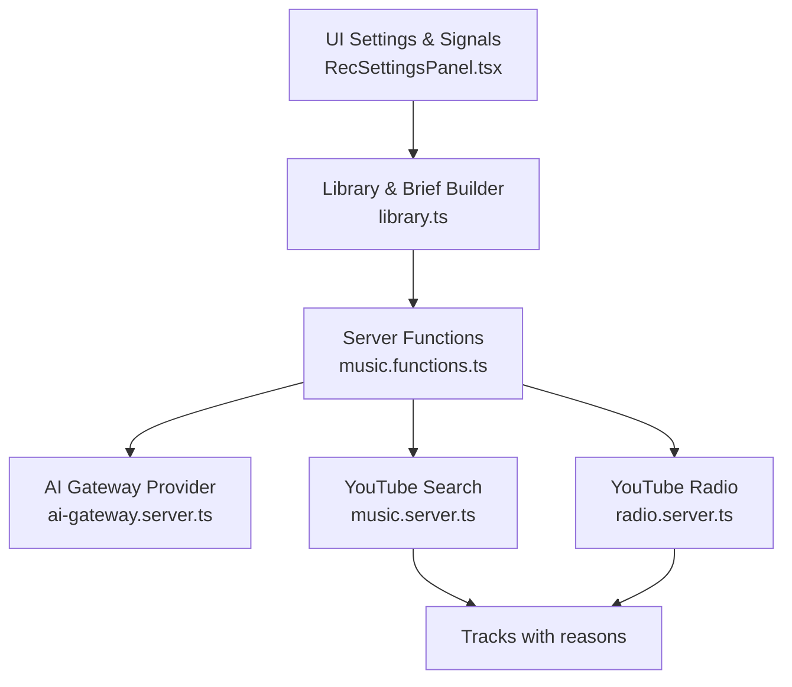
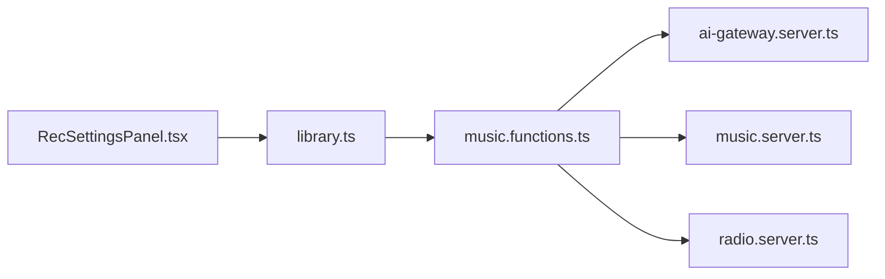

# Prompt Engineering & Strategy

<cite>
**Referenced Files in This Document**
- [music.functions.ts](file://src/lib/music.functions.ts)
- [ai-gateway.server.ts](file://src/lib/ai-gateway.server.ts)
- [library.ts](file://src/lib/library.ts)
- [RecSettingsPanel.tsx](file://src/components/music/RecSettingsPanel.tsx)
- [music.server.ts](file://src/lib/music.server.ts)
- [radio.server.ts](file://src/lib/radio.server.ts)
</cite>

## Table of Contents
1. [Introduction](#introduction)
2. [Project Structure](#project-structure)
3. [Core Components](#core-components)
4. [Architecture Overview](#architecture-overview)
5. [Detailed Component Analysis](#detailed-component-analysis)
6. [Dependency Analysis](#dependency-analysis)
7. [Performance Considerations](#performance-considerations)
8. [Troubleshooting Guide](#troubleshooting-guide)
9. [Conclusion](#conclusion)
10. [Appendices](#appendices)

## Introduction
This document explains the prompt engineering strategies used by the AI recommendation engine to turn user listening history, likes, dislikes, and preferences into high-quality music suggestions. It covers how context is built from behavioral signals, how prompts are constructed for different scenarios (mood-based, artist discovery, genre exploration), and how parameters are tuned to balance comfort, novelty, and energy. It also includes best practices for prompt optimization and testing methodologies to ensure consistent recommendation quality.

## Project Structure
The recommendation system combines:
- Behavioral data and preference settings stored locally and synced to a user account
- Server functions that build prompts and call an AI gateway
- Search and radio utilities that resolve suggested tracks to playable items



**Diagram sources**
- [RecSettingsPanel.tsx:17-280](file://src/components/music/RecSettingsPanel.tsx#L17-L280)
- [library.ts:68-103](file://src/lib/library.ts#L68-L103)
- [library.ts:563-588](file://src/lib/library.ts#L563-L588)
- [music.functions.ts:58-137](file://src/lib/music.functions.ts#L58-L137)
- [music.functions.ts:156-245](file://src/lib/music.functions.ts#L156-L245)
- [ai-gateway.server.ts:1-10](file://src/lib/ai-gateway.server.ts#L1-L10)
- [music.server.ts:182-247](file://src/lib/music.server.ts#L182-L247)
- [radio.server.ts:25-94](file://src/lib/radio.server.ts#L25-L94)

**Section sources**
- [RecSettingsPanel.tsx:17-280](file://src/components/music/RecSettingsPanel.tsx#L17-L280)
- [library.ts:68-103](file://src/lib/library.ts#L68-L103)
- [music.functions.ts:58-137](file://src/lib/music.functions.ts#L58-L137)

## Core Components
- Behavioral signals and preferences:
  - Likes, dislikes, recent history, skips, replays, completions
  - Tuning panel controls: moods, genres, languages, podcast topics, discovery vs familiarity, energy, instrumental-only
- Prompt builders:
  - General recommendations: combine liked songs, recent sequence, skipped/disliked, mood, and tuning brief
  - Discovery mix: avoid known artists, emphasize new artists close to sonic profile
- Resolution layer:
  - Resolve AI-suggested titles/artists to playable YouTube tracks
  - Fallbacks via YouTube radio or Deezer previews when needed

Key implementation references:
- Recommendation server function and prompt assembly: [music.functions.ts:58-137](file://src/lib/music.functions.ts#L58-L137)
- Discovery mix prompt assembly: [music.functions.ts:156-245](file://src/lib/music.functions.ts#L156-L245)
- Settings-to-brief generator: [library.ts:563-588](file://src/lib/library.ts#L563-L588)
- AI provider configuration: [ai-gateway.server.ts:1-10](file://src/lib/ai-gateway.server.ts#L1-L10)
- Track resolution via YouTube search: [music.server.ts:182-247](file://src/lib/music.server.ts#L182-L247)
- Radio fallback: [radio.server.ts:25-94](file://src/lib/radio.server.ts#L25-L94)

**Section sources**
- [music.functions.ts:58-137](file://src/lib/music.functions.ts#L58-L137)
- [music.functions.ts:156-245](file://src/lib/music.functions.ts#L156-L245)
- [library.ts:563-588](file://src/lib/library.ts#L563-L588)
- [ai-gateway.server.ts:1-10](file://src/lib/ai-gateway.server.ts#L1-L10)
- [music.server.ts:182-247](file://src/lib/music.server.ts#L182-L247)
- [radio.server.ts:25-94](file://src/lib/radio.server.ts#L25-L94)

## Architecture Overview
End-to-end flow from user signals to recommended tracks:

```mermaid
sequenceDiagram
participant U as "User"
participant UI as "RecSettingsPanel.tsx"
participant L as "library.ts"
participant SF as "music.functions.ts"
participant AG as "ai-gateway.server.ts"
participant Y as "music.server.ts"
participant R as "radio.server.ts"
U->>UI : Adjust moods, genres, languages, discovery, energy
UI->>L : Update settings; compute brief + sequences
U->>SF : Call recommendTracks / buildMix
SF->>L : Read likes, history, stats, settings
SF->>SF : Build prompt from signals + brief
SF->>AG : generateText(prompt)
AG-->>SF : JSON array of {title, artist, reason}
SF->>Y : Resolve each suggestion to YouTube track
alt No AI key or error
SF->>R : Fallback to radio tracks
end
SF-->>U : Tracks with reasons
```

**Diagram sources**
- [RecSettingsPanel.tsx:17-280](file://src/components/music/RecSettingsPanel.tsx#L17-L280)
- [library.ts:563-588](file://src/lib/library.ts#L563-L588)
- [music.functions.ts:58-137](file://src/lib/music.functions.ts#L58-L137)
- [music.functions.ts:156-245](file://src/lib/music.functions.ts#L156-L245)
- [ai-gateway.server.ts:1-10](file://src/lib/ai-gateway.server.ts#L1-L10)
- [music.server.ts:182-247](file://src/lib/music.server.ts#L182-L247)
- [radio.server.ts:25-94](file://src/lib/radio.server.ts#L25-L94)

## Detailed Component Analysis

### Context Building from User Behavior
- Liked songs: strong positive signal; included up to a capped list to keep prompts concise.
- Recent history and sequence: ordered behavior (played, replayed, skipped) informs next picks.
- Skips and dislikes: negative signals steer away from similar sounds.
- Mood and tuning brief: derived from explicit settings (mood weights, genres, languages, discovery level, energy, instrumental-only).

References:
- Sequence builder and stats-driven actions: [library.ts:632-645](file://src/lib/library.ts#L632-L645)
- Settings-to-brief conversion: [library.ts:563-588](file://src/lib/library.ts#L563-L588)
- Input schema for recommendations: [music.functions.ts:47-56](file://src/lib/music.functions.ts#L47-L56)

**Section sources**
- [library.ts:563-588](file://src/lib/library.ts#L563-L588)
- [library.ts:632-645](file://src/lib/library.ts#L632-L645)
- [music.functions.ts:47-56](file://src/lib/music.functions.ts#L47-L56)

### Prompt Templates and Variations
- General recommendations:
  - Combines liked songs, recent sequence, skipped/disliked, optional mood request, and tuning brief.
  - Enforces a balanced batch: comfort, older favorites, and new artists close to profile.
  - Strict JSON output format for reliable parsing.
  - Reference: [music.functions.ts:58-137](file://src/lib/music.functions.ts#L58-L137)
- Discovery mix:
  - Focuses on new artists not already known to the listener while matching their sonic profile.
  - Excludes known artists explicitly.
  - Reference: [music.functions.ts:156-245](file://src/lib/music.functions.ts#L156-L245)
- Mood-based suggestions:
  - Uses curated query mappings to YouTube searches for instant mood radios without AI.
  - Reference: [music.functions.ts:583-610](file://src/lib/music.functions.ts#L583-L610)
- Artist discovery:
  - Discovery mix template avoids known artists and emphasizes new ones close to taste.
  - Reference: [music.functions.ts:189-205](file://src/lib/music.functions.ts#L189-L205)
- Genre exploration:
  - Genres selected in settings feed into the brief; combined with language filters and energy/discovery levels.
  - Reference: [library.ts:563-588](file://src/lib/library.ts#L563-L588)

Prompt construction pattern:
- Assemble modular sections based on available signals
- Filter out empty sections to keep prompts focused
- Append strict output instructions to enforce structured responses

**Section sources**
- [music.functions.ts:58-137](file://src/lib/music.functions.ts#L58-L137)
- [music.functions.ts:156-245](file://src/lib/music.functions.ts#L156-L245)
- [music.functions.ts:583-610](file://src/lib/music.functions.ts#L583-L610)
- [library.ts:563-588](file://src/lib/library.ts#L563-L588)

### Parameter Tuning and Controls
- Moods: per-mood weighting influences the brief and can be emphasized or avoided.
- Genres and languages: constrain search and brief content.
- Discovery vs familiarity: balances well-known hits with deep cuts/new artists.
- Energy: targets calm to energetic spectrum.
- Instrumental-only: restricts results to instrumentals.
- Fresh release injection interval: periodically injects new drops into queues.

References:
- Settings model and defaults: [library.ts:68-103](file://src/lib/library.ts#L68-L103)
- UI controls and validation: [RecSettingsPanel.tsx:17-280](file://src/components/music/RecSettingsPanel.tsx#L17-L280)

**Section sources**
- [library.ts:68-103](file://src/lib/library.ts#L68-L103)
- [RecSettingsPanel.tsx:17-280](file://src/components/music/RecSettingsPanel.tsx#L17-L280)

### Resolution and Fallbacks
- AI returns title/artist pairs; these are resolved to playable tracks via YouTube search.
- If AI is unavailable or fails, radio tracks are used as a fallback to maintain continuity.
- Hybrid strategy ensures always-playable results using YouTube primary and Deezer preview fallback where applicable.

References:
- Resolution via YouTube search: [music.functions.ts:124-137](file://src/lib/music.functions.ts#L124-L137)
- Radio fallback: [music.functions.ts:571-580](file://src/lib/music.functions.ts#L571-L580)
- Hybrid search and radio: [music-hybrid.server.ts:22-98](file://src/lib/music-hybrid.server.ts#L22-L98)

**Section sources**
- [music.functions.ts:124-137](file://src/lib/music.functions.ts#L124-L137)
- [music.functions.ts:571-580](file://src/lib/music.functions.ts#L571-L580)
- [music-hybrid.server.ts:22-98](file://src/lib/music-hybrid.server.ts#L22-L98)

## Dependency Analysis


**Diagram sources**
- [RecSettingsPanel.tsx:17-280](file://src/components/music/RecSettingsPanel.tsx#L17-L280)
- [library.ts:563-588](file://src/lib/library.ts#L563-L588)
- [music.functions.ts:58-137](file://src/lib/music.functions.ts#L58-L137)
- [ai-gateway.server.ts:1-10](file://src/lib/ai-gateway.server.ts#L1-L10)
- [music.server.ts:182-247](file://src/lib/music.server.ts#L182-L247)
- [radio.server.ts:25-94](file://src/lib/radio.server.ts#L25-L94)

**Section sources**
- [music.functions.ts:58-137](file://src/lib/music.functions.ts#L58-L137)
- [library.ts:563-588](file://src/lib/library.ts#L563-L588)
- [ai-gateway.server.ts:1-10](file://src/lib/ai-gateway.server.ts#L1-L10)
- [music.server.ts:182-247](file://src/lib/music.server.ts#L182-L247)
- [radio.server.ts:25-94](file://src/lib/radio.server.ts#L25-L94)

## Performance Considerations
- Prompt length management:
  - Cap lists of liked/recent tracks to reduce token usage and improve focus.
  - Use concise briefs generated from settings to keep prompts efficient.
- Parallel resolution:
  - Resolve multiple AI-suggested tracks concurrently to minimize latency.
- Caching:
  - Search results cached with short TTL to reduce repeated network calls.
- Fallbacks:
  - Graceful degradation to radio or hybrid sources when AI is unavailable or rate-limited.

References:
- Concurrency in resolution: [music.functions.ts:124-137](file://src/lib/music.functions.ts#L124-L137)
- Cache implementation: [music.server.ts:52-75](file://src/lib/music.server.ts#L52-L75)
- Error handling and fallbacks: [music.functions.ts:97-137](file://src/lib/music.functions.ts#L97-L137)

**Section sources**
- [music.functions.ts:124-137](file://src/lib/music.functions.ts#L124-L137)
- [music.server.ts:52-75](file://src/lib/music.server.ts#L52-L75)
- [music.functions.ts:97-137](file://src/lib/music.functions.ts#L97-L137)

## Troubleshooting Guide
Common issues and resolutions:
- Missing API key:
  - When no AI key is configured, return informative errors and rely on non-AI paths.
  - Reference: [music.functions.ts:61-63](file://src/lib/music.functions.ts#L61-L63)
- Rate limits and credits:
  - Detect HTTP 429 and credit exhaustion messages; return friendly errors.
  - Reference: [music.functions.ts:105-111](file://src/lib/music.functions.ts#L105-L111)
- Parsing failures:
  - Validate JSON response structure; handle malformed outputs gracefully.
  - Reference: [music.functions.ts:113-121](file://src/lib/music.functions.ts#L113-L121)
- Search failures:
  - Handle network errors and empty results; fall back to radio or hybrid sources.
  - Reference: [music.functions.ts:124-137](file://src/lib/music.functions.ts#L124-L137), [music-hybrid.server.ts:22-98](file://src/lib/music-hybrid.server.ts#L22-L98)

**Section sources**
- [music.functions.ts:61-63](file://src/lib/music.functions.ts#L61-L63)
- [music.functions.ts:105-111](file://src/lib/music.functions.ts#L105-L111)
- [music.functions.ts:113-121](file://src/lib/music.functions.ts#L113-L121)
- [music.functions.ts:124-137](file://src/lib/music.functions.ts#L124-L137)
- [music-hybrid.server.ts:22-98](file://src/lib/music-hybrid.server.ts#L22-L98)

## Conclusion
The recommendation engine uses a layered approach: collect rich behavioral signals and explicit preferences, convert them into focused prompts, and resolve AI suggestions to playable tracks with robust fallbacks. By balancing comfort, novelty, and energy through tunable parameters, the system delivers personalized, diverse, and relevant music suggestions across scenarios like mood-based listening, artist discovery, and genre exploration.

## Appendices

### Scenario-Specific Prompt Strategies
- Mood-based suggestions:
  - Use curated queries for immediate results without AI; optionally include mood in brief for AI-driven personalization.
  - References: [music.functions.ts:583-610](file://src/lib/music.functions.ts#L583-L610), [library.ts:563-588](file://src/lib/library.ts#L563-L588)
- Artist discovery:
  - Emphasize new artists close to sonic profile; exclude known artists explicitly.
  - Reference: [music.functions.ts:189-205](file://src/lib/music.functions.ts#L189-L205)
- Genre exploration:
  - Combine genre selections with language filters and energy/discovery levels in the brief.
  - Reference: [library.ts:563-588](file://src/lib/library.ts#L563-L588)

### Best Practices for Prompt Optimization
- Keep prompts concise: cap lists, use briefs, filter empty sections.
- Enforce structured outputs: require JSON arrays with clear fields.
- Balance diversity: specify proportions for comfort, nostalgia, and discovery.
- Provide negative constraints: explicitly list disliked/skipped items to avoid repetition.
- Test variations: iterate on prompt wording and parameter ranges to improve relevance.

### Testing Methodologies
- Unit tests for prompt assembly:
  - Verify correct inclusion/exclusion of liked, recent, skipped, and brief segments.
  - References: [music.functions.ts:58-137](file://src/lib/music.functions.ts#L58-L137), [music.functions.ts:156-245](file://src/lib/music.functions.ts#L156-L245)
- Integration tests for resolution:
  - Ensure AI suggestions resolve to valid tracks; validate fallback paths.
  - References: [music.functions.ts:124-137](file://src/lib/music.functions.ts#L124-L137), [music-hybrid.server.ts:22-98](file://src/lib/music-hybrid.server.ts#L22-L98)
- End-to-end tests:
  - Simulate user interactions (likes, skips, settings changes) and verify resulting recommendations align with expectations.
  - References: [library.ts:353-411](file://src/lib/library.ts#L353-L411), [RecSettingsPanel.tsx:17-280](file://src/components/music/RecSettingsPanel.tsx#L17-L280)