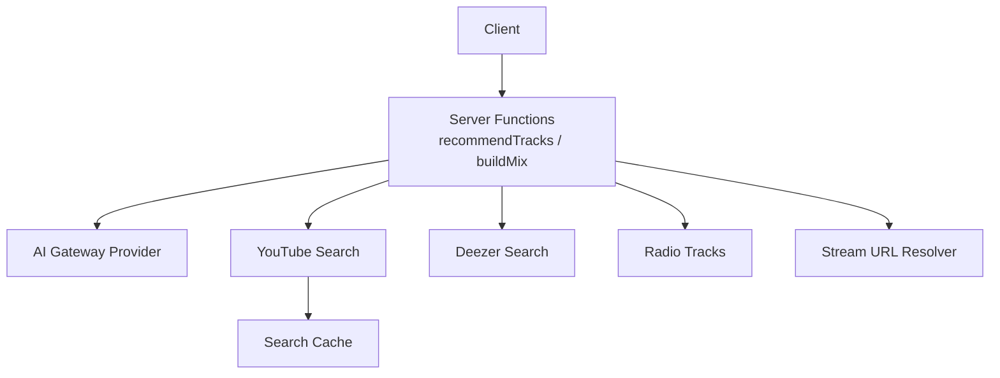
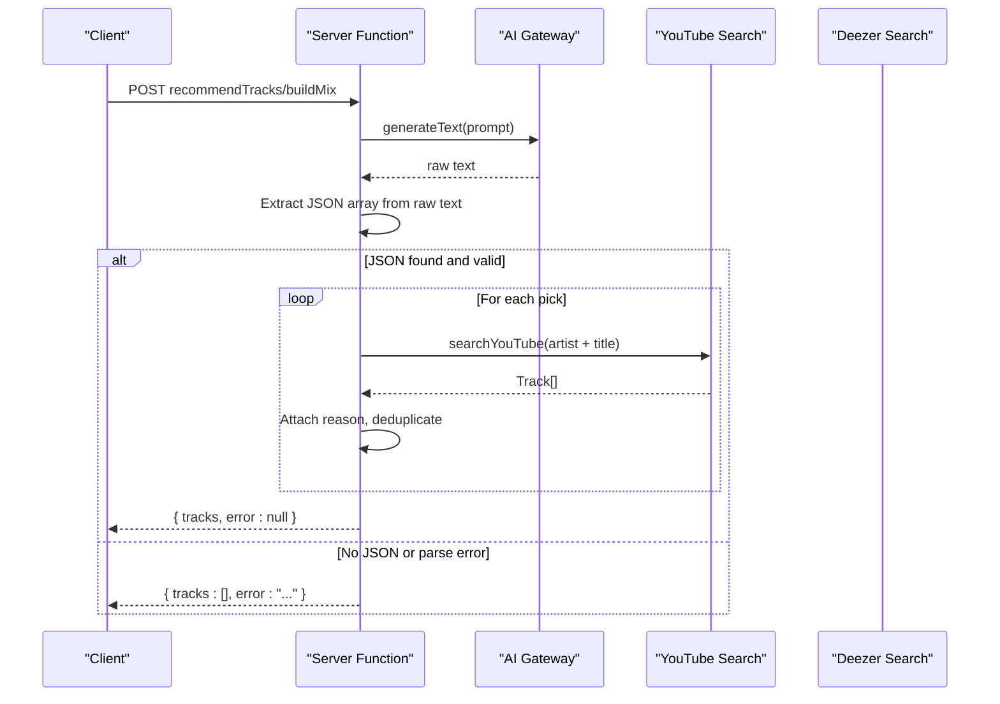
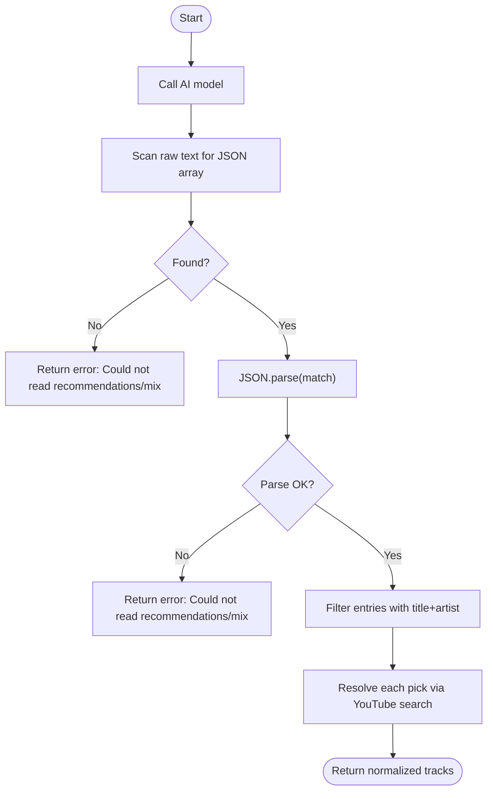
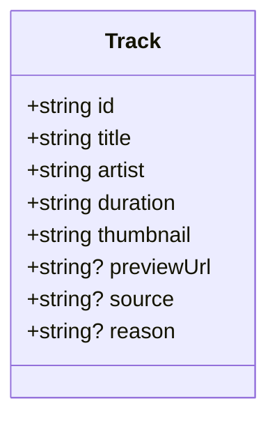
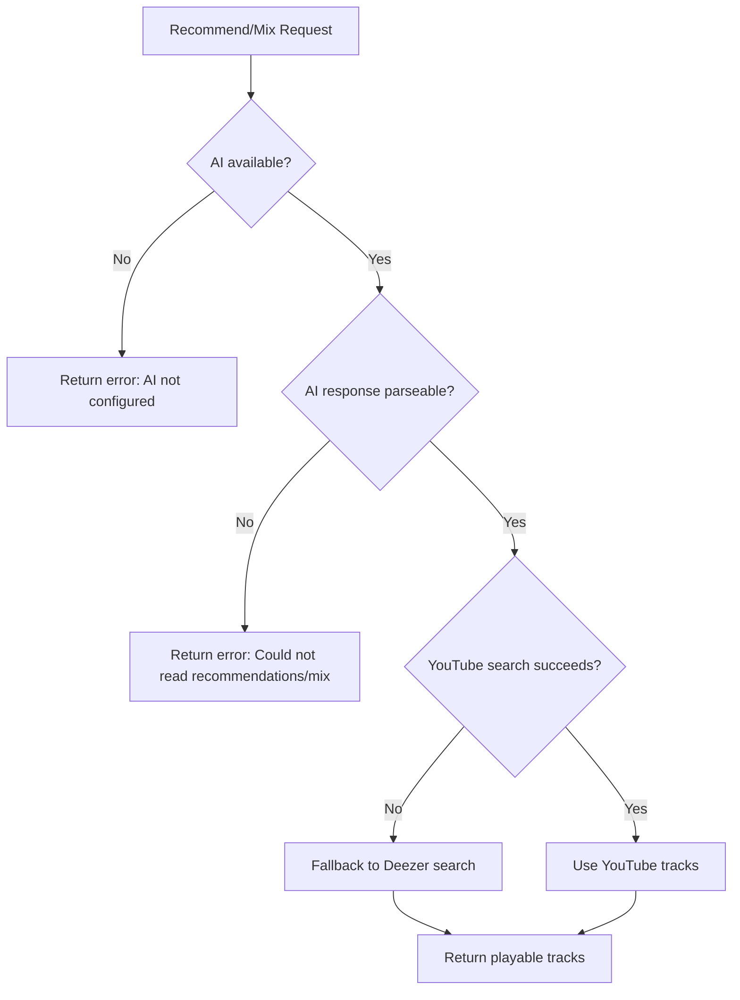
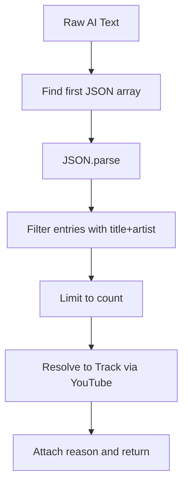
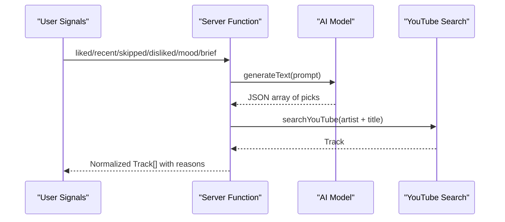
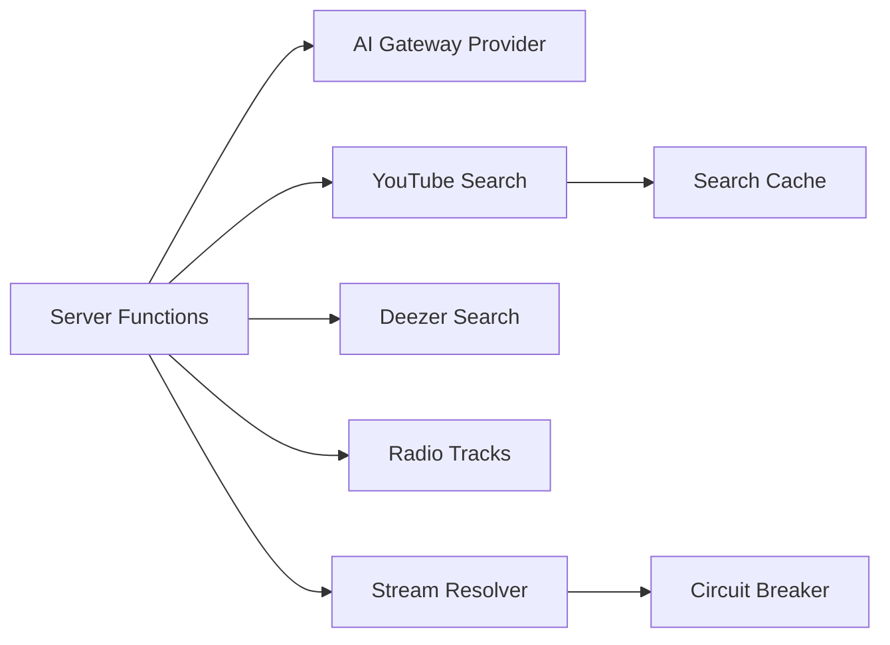

# Response Parsing & Processing

<cite>
**Referenced Files in This Document**
- [music.functions.ts](file://src/lib/music.functions.ts)
- [ai-gateway.server.ts](file://src/lib/ai-gateway.server.ts)
- [music.server.ts](file://src/lib/music.server.ts)
- [deezer.server.ts](file://src/lib/deezer.server.ts)
- [radio.server.ts](file://src/lib/radio.server.ts)
- [stream.server.ts](file://src/lib/stream.server.ts)
</cite>

## Table of Contents
1. Introduction
2. Project Structure
3. Core Components
4. Architecture Overview
5. Detailed Component Analysis
6. Dependency Analysis
7. Performance Considerations
8. Troubleshooting Guide
9. Conclusion

## Introduction
This document explains how the application converts unstructured AI-generated content into structured, playable track objects. It covers parsing algorithms for JSON arrays returned by AI models, validation and normalization to a consistent Track schema, error handling and fallback strategies when parsing or downstream services fail, and performance considerations including caching of parsed results and stream URLs.

## Project Structure
The response parsing pipeline spans several server-side modules:
- AI gateway configuration and provider creation
- Server functions that call AI models and parse their responses
- YouTube and Deezer search utilities that resolve AI suggestions into concrete tracks
- Radio and streaming utilities used as alternatives or complements

**Diagram sources**
- [music.functions.ts:58-137](file://src/lib/music.functions.ts#L58-L137)
- [music.functions.ts:156-245](file://src/lib/music.functions.ts#L156-L245)
- [ai-gateway.server.ts:1-9](file://src/lib/ai-gateway.server.ts#L1-L9)
- [music.server.ts:182-247](file://src/lib/music.server.ts#L182-L247)
- [deezer.server.ts:39-74](file://src/lib/deezer.server.ts#L39-L74)
- [radio.server.ts:25-94](file://src/lib/radio.server.ts#L25-L94)
- [stream.server.ts:301-344](file://src/lib/stream.server.ts#L301-L344)

**Section sources**
- [music.functions.ts:58-137](file://src/lib/music.functions.ts#L58-L137)
- [music.functions.ts:156-245](file://src/lib/music.functions.ts#L156-L245)
- [ai-gateway.server.ts:1-9](file://src/lib/ai-gateway.server.ts#L1-L9)
- [music.server.ts:182-247](file://src/lib/music.server.ts#L182-L247)
- [deezer.server.ts:39-74](file://src/lib/deezer.server.ts#L39-L74)
- [radio.server.ts:25-94](file://src/lib/radio.server.ts#L25-L94)
- [stream.server.ts:301-344](file://src/lib/stream.server.ts#L301-L344)

## Core Components
- AI Gateway Provider: Configures an OpenAI-compatible client to call the Lovable AI gateway with the configured API key.
- Recommendation and Mix Builders: Build prompts from user taste signals, call the AI model, extract a JSON array from the raw text, validate entries, and resolve each suggestion to a real track via YouTube search.
- YouTube Search: Scrapes YouTube search results, filters non-music content, normalizes fields into a unified Track type, and caches results.
- Deezer Search: Provides direct preview MP3s as a fallback source and enriches tracks with a direct preview URL.
- Radio Tracks: Uses YouTube’s built-in radio endpoint to get similar tracks without AI.
- Stream URL Resolver: Resolves ad-free audio URLs for playback with robust fallbacks and caching.

**Section sources**
- [ai-gateway.server.ts:1-9](file://src/lib/ai-gateway.server.ts#L1-L9)
- [music.functions.ts:58-137](file://src/lib/music.functions.ts#L58-L137)
- [music.functions.ts:156-245](file://src/lib/music.functions.ts#L156-L245)
- [music.server.ts:1-13](file://src/lib/music.server.ts#L1-L13)
- [music.server.ts:182-247](file://src/lib/music.server.ts#L182-L247)
- [deezer.server.ts:39-74](file://src/lib/deezer.server.ts#L39-L74)
- [radio.server.ts:25-94](file://src/lib/radio.server.ts#L25-L94)
- [stream.server.ts:301-344](file://src/lib/stream.server.ts#L301-L344)

## Architecture Overview
The end-to-end flow for AI-driven recommendations:
1. The client calls recommendTracks or buildMix.
2. The server function constructs a prompt based on user signals (liked/recent/skipped/disliked/mood/brief).
3. The AI gateway provider is created and generateText is called.
4. The raw text response is scanned for a JSON array; if found, it is parsed.
5. Each entry is validated to have required fields (title, artist).
6. For each valid entry, a YouTube search resolves it to a concrete Track object; optional reason text is attached.
7. Results are returned to the client. If any step fails, a user-friendly error is returned instead of crashing.

**Diagram sources**
- [music.functions.ts:58-137](file://src/lib/music.functions.ts#L58-L137)
- [music.functions.ts:156-245](file://src/lib/music.functions.ts#L156-L245)
- [ai-gateway.server.ts:1-9](file://src/lib/ai-gateway.server.ts#L1-L9)
- [music.server.ts:182-247](file://src/lib/music.server.ts#L182-L247)

## Detailed Component Analysis

### AI Response Extraction and Validation
- Raw response scanning: The code searches the entire raw string for the first occurrence of a JSON array using a regular expression. If no match is found, it returns a specific error indicating the mix could not be read.
- Parsing and validation: The matched substring is parsed as JSON. If parsing fails, a user-facing error is returned. After parsing, entries are filtered to ensure they contain both title and artist, then limited to the requested count.
- Enrichment: Each valid pick is resolved to a real track by searching YouTube with the artist and title. On success, the resulting track includes the AI-provided reason.

**Diagram sources**
- [music.functions.ts:97-137](file://src/lib/music.functions.ts#L97-L137)
- [music.functions.ts:207-245](file://src/lib/music.functions.ts#L207-L245)

**Section sources**
- [music.functions.ts:97-137](file://src/lib/music.functions.ts#L97-L137)
- [music.functions.ts:207-245](file://src/lib/music.functions.ts#L207-L245)

### Data Normalization to Track Schema
- Unified Track type: All sources produce a consistent Track object with id, title, artist, duration, thumbnail, and optional fields like previewUrl, source, and reason.
- YouTube normalization: The scraper extracts video metadata from rendered nodes, filters out non-music content, and maps fields to the Track schema.
- Deezer normalization: Deezer results are mapped to Track with a direct previewUrl and source set to "deezer".

**Diagram sources**
- [music.server.ts:1-13](file://src/lib/music.server.ts#L1-L13)

**Section sources**
- [music.server.ts:1-13](file://src/lib/music.server.ts#L1-L13)
- [music.server.ts:182-247](file://src/lib/music.server.ts#L182-L247)
- [deezer.server.ts:39-74](file://src/lib/deezer.server.ts#L39-L74)

### Fallback Strategies
- AI service errors: Rate limits and credit exhaustion are detected from error messages and converted into friendly errors.
- Parsing failures: Missing or invalid JSON leads to a graceful error return rather than throwing.
- YouTube search failures: When YouTube search fails or returns insufficient results, hybrid search falls back to Deezer to ensure playable results.
- Radio fallback: If YouTube radio fails, Deezer trending tracks are used as a fallback.
- Stream resolution: If ytdl-core fails to resolve a stream URL, a manual player API fallback is attempted; a circuit breaker prevents repeated failures during outages.

**Diagram sources**
- [music.functions.ts:58-137](file://src/lib/music.functions.ts#L58-L137)
- [music.functions.ts:156-245](file://src/lib/music.functions.ts#L156-L245)
- [music-hybrid.server.ts:22-49](file://src/lib/music-hybrid.server.ts#L22-L49)
- [music-hybrid.server.ts:54-78](file://src/lib/music-hybrid.server.ts#L54-L78)

**Section sources**
- [music.functions.ts:58-137](file://src/lib/music.functions.ts#L58-L137)
- [music.functions.ts:156-245](file://src/lib/music.functions.ts#L156-L245)
- [music-hybrid.server.ts:22-49](file://src/lib/music-hybrid.server.ts#L22-L49)
- [music-hybrid.server.ts:54-78](file://src/lib/music-hybrid.server.ts#L54-L78)

### Example Response Formats and Parsing Logic
- Expected AI response format: A JSON array of objects with at least title and artist fields, plus an optional reason field.
- Parsing logic:
  - Extract the first JSON array substring from the raw response.
  - Parse it into an array of objects.
  - Filter entries to those with both title and artist present.
  - Limit to the requested count.
  - Resolve each entry to a real track via YouTube search and attach the reason.

**Diagram sources**
- [music.functions.ts:97-137](file://src/lib/music.functions.ts#L97-L137)
- [music.functions.ts:207-245](file://src/lib/music.functions.ts#L207-L245)

**Section sources**
- [music.functions.ts:97-137](file://src/lib/music.functions.ts#L97-L137)
- [music.functions.ts:207-245](file://src/lib/music.functions.ts#L207-L245)

### Data Transformation Pipeline
- Input: User taste signals and request parameters.
- Prompt assembly: Combines liked/recent/skipped/disliked artists, sequence behavior, mood, and brief tuning preferences into a single prompt.
- AI call: Generates a list of suggested tracks with reasons.
- Validation and enrichment: Validates entries, resolves them to concrete tracks, and attaches reasons.
- Output: A normalized array of Track objects ready for UI rendering and playback.

**Diagram sources**
- [music.functions.ts:58-137](file://src/lib/music.functions.ts#L58-L137)
- [music.functions.ts:156-245](file://src/lib/music.functions.ts#L156-L245)
- [music.server.ts:182-247](file://src/lib/music.server.ts#L182-L247)

**Section sources**
- [music.functions.ts:58-137](file://src/lib/music.functions.ts#L58-L137)
- [music.functions.ts:156-245](file://src/lib/music.functions.ts#L156-L245)
- [music.server.ts:182-247](file://src/lib/music.server.ts#L182-L247)

## Dependency Analysis
- Server functions depend on:
  - AI gateway provider for model access
  - YouTube search for resolving AI suggestions
  - Deezer search for fallback and direct previews
  - Radio server for similarity-based recommendations
  - Stream resolver for playback URLs
- Cohesion: Each module has a focused responsibility (parsing, search, streaming), reducing coupling.
- External dependencies:
  - AI SDK for generating text
  - YouTube scraping and radio endpoints
  - Deezer public search API
  - ytdl-core for stream resolution

**Diagram sources**
- [music.functions.ts:58-137](file://src/lib/music.functions.ts#L58-L137)
- [music.functions.ts:156-245](file://src/lib/music.functions.ts#L156-L245)
- [ai-gateway.server.ts:1-9](file://src/lib/ai-gateway.server.ts#L1-L9)
- [music.server.ts:52-75](file://src/lib/music.server.ts#L52-L75)
- [stream.server.ts:67-90](file://src/lib/stream.server.ts#L67-L90)

**Section sources**
- [music.functions.ts:58-137](file://src/lib/music.functions.ts#L58-L137)
- [music.functions.ts:156-245](file://src/lib/music.functions.ts#L156-L245)
- [ai-gateway.server.ts:1-9](file://src/lib/ai-gateway.server.ts#L1-L9)
- [music.server.ts:52-75](file://src/lib/music.server.ts#L52-L75)
- [stream.server.ts:67-90](file://src/lib/stream.server.ts#L67-L90)

## Performance Considerations
- Search result caching: YouTube search results are cached in-memory with a 5-minute TTL and a maximum size to reduce redundant network requests.
- Stream URL caching: Resolved stream URLs are cached with a 25-minute TTL and LRU eviction to avoid repeated expensive resolution calls.
- Circuit breaker: Repeated failures in stream resolution trigger a cooldown period to prevent cascading load on external services.
- Parallel resolution: AI suggestions are resolved in parallel to minimize latency.
- Query optimization: YouTube queries append “audio” to prioritize audio-only content and use upload filters for fresh releases.

[No sources needed since this section provides general guidance]

## Troubleshooting Guide
- AI not configured: If the environment key is missing, functions return a clear error indicating AI is not configured.
- Rate limiting or credits exhausted: Errors from the AI gateway are detected and translated into user-friendly messages.
- Parsing failures: If the AI response does not contain a valid JSON array or cannot be parsed, a specific error is returned.
- YouTube search failures: Hybrid search automatically falls back to Deezer to ensure playable results.
- Stream resolution failures: The resolver tries multiple strategies and uses a circuit breaker; probe checks verify stream availability before returning URLs.

**Section sources**
- [music.functions.ts:58-137](file://src/lib/music.functions.ts#L58-L137)
- [music.functions.ts:156-245](file://src/lib/music.functions.ts#L156-L245)
- [music-hybrid.server.ts:22-49](file://src/lib/music-hybrid.server.ts#L22-L49)
- [stream.server.ts:301-344](file://src/lib/stream.server.ts#L301-L344)

## Conclusion
The response parsing system transforms AI-generated suggestions into reliable, playable track objects through careful extraction, validation, and normalization. Robust fallbacks ensure resilience across AI, YouTube, and Deezer services. Caching and circuit breaking improve performance and stability under load. The design balances personalization with reliability, delivering consistent output formats for the UI and playback layers.