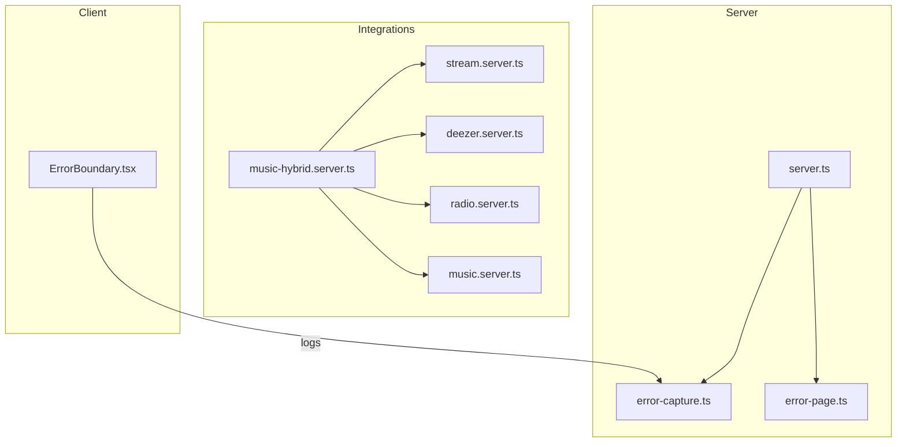
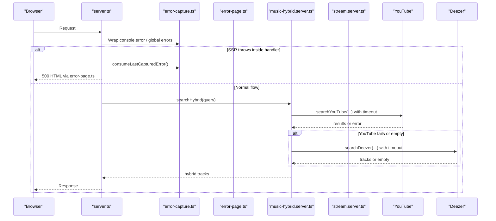
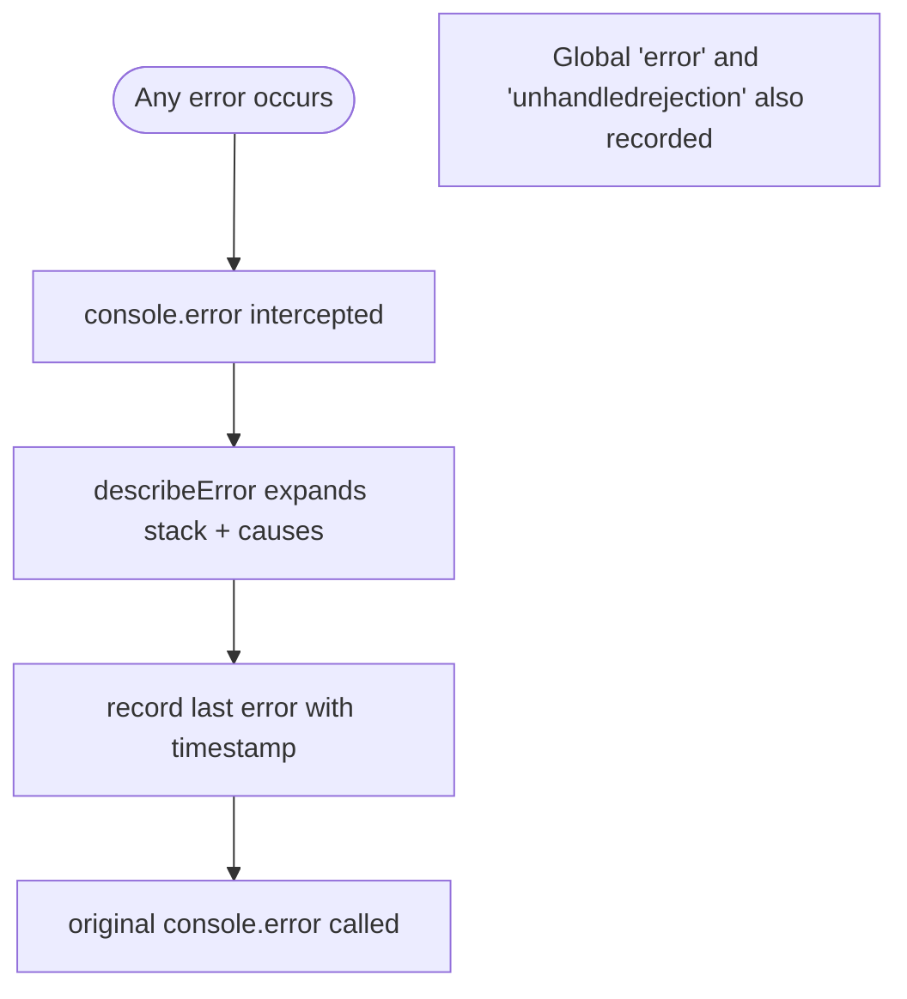
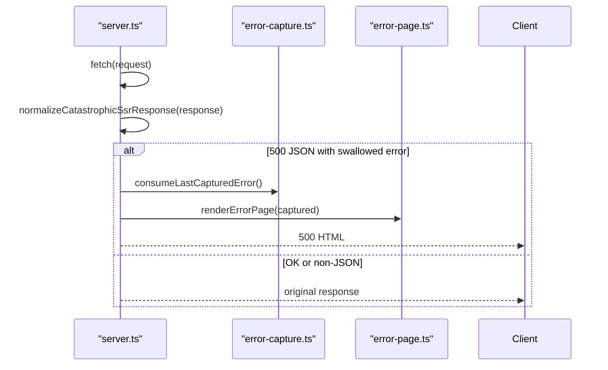
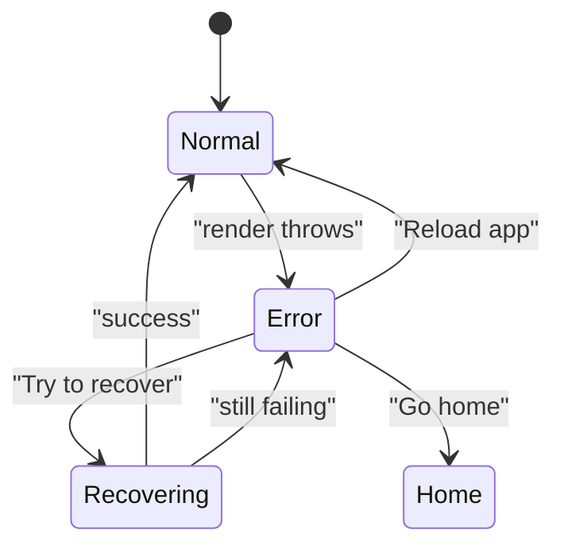
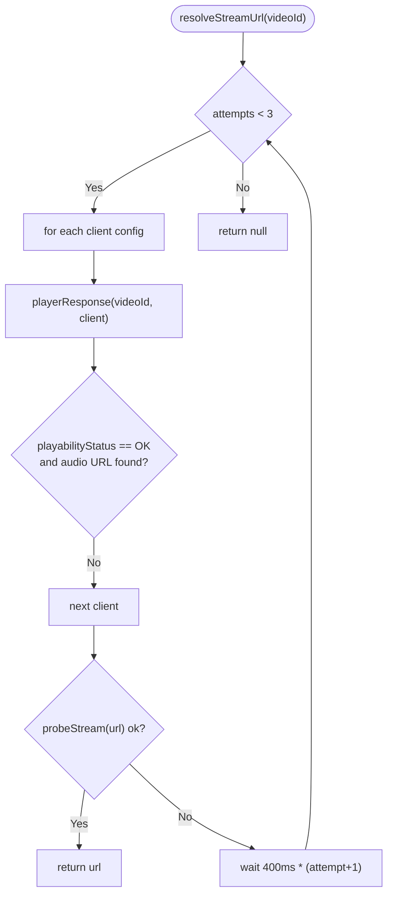
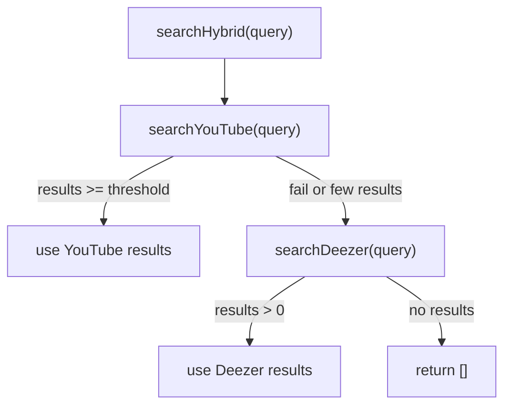
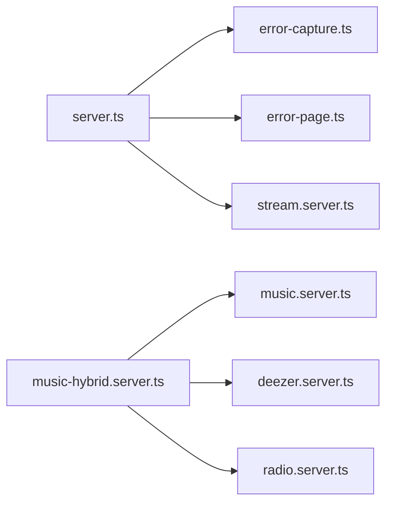

# Error Handling Patterns

<cite>
**Referenced Files in This Document**
- [error-capture.ts](file://src/lib/error-capture.ts)
- [lovable-error-reporting.ts](file://src/lib/lovable-error-reporting.ts)
- [error-page.ts](file://src/lib/error-page.ts)
- [server.ts](file://src/server.ts)
- [ErrorBoundary.tsx](file://src/components/music/ErrorBoundary.tsx)
- [stream.server.ts](file://src/lib/stream.server.ts)
- [music-hybrid.server.ts](file://src/lib/music-hybrid.server.ts)
- [deezer.server.ts](file://src/lib/deezer.server.ts)
- [radio.server.ts](file://src/lib/radio.server.ts)
- [music.server.ts](file://src/lib/music.server.ts)
</cite>

## Table of Contents
1. [Introduction](#introduction)
2. [Project Structure](#project-structure)
3. [Core Components](#core-components)
4. [Architecture Overview](#architecture-overview)
5. [Detailed Component Analysis](#detailed-component-analysis)
6. [Dependency Analysis](#dependency-analysis)
7. [Performance Considerations](#performance-considerations)
8. [Troubleshooting Guide](#troubleshooting-guide)
9. [Conclusion](#conclusion)
10. [Appendices](#appendices)

## Introduction
This document explains how the application handles errors across external service integrations (YouTube, Deezer, and internal streaming). It covers:
- Centralized error capture and reporting on the server
- Retry logic for transient failures
- Graceful degradation when upstream services are unavailable
- Error categorization, user-facing messages, and development debugging aids
- Examples for timeouts, rate limits, authentication failures, and malformed responses
- Guidelines to implement consistent error handling in new integrations and test error scenarios

## Project Structure
The error handling spans server-side capture and rendering, client-side boundaries, and resilient integration modules that call external APIs with timeouts and fallbacks.

**Diagram sources**
- [server.ts:1-37](file://src/server.ts#L1-L37)
- [error-capture.ts:1-81](file://src/lib/error-capture.ts#L1-L81)
- [error-page.ts:1-41](file://src/lib/error-page.ts#L1-L41)
- [music-hybrid.server.ts:1-98](file://src/lib/music-hybrid.server.ts#L1-L98)
- [stream.server.ts:1-123](file://src/lib/stream.server.ts#L1-L123)
- [deezer.server.ts:1-97](file://src/lib/deezer.server.ts#L1-L97)
- [radio.server.ts:1-95](file://src/lib/radio.server.ts#L1-L95)
- [music.server.ts:1-248](file://src/lib/music.server.ts#L1-L248)
- [ErrorBoundary.tsx:1-97](file://src/components/music/ErrorBoundary.tsx#L1-L97)

**Section sources**
- [server.ts:1-37](file://src/server.ts#L1-L37)
- [error-capture.ts:1-81](file://src/lib/error-capture.ts#L1-L81)
- [error-page.ts:1-41](file://src/lib/error-page.ts#L1-L41)
- [music-hybrid.server.ts:1-98](file://src/lib/music-hybrid.server.ts#L1-L98)
- [stream.server.ts:1-123](file://src/lib/stream.server.ts#L1-L123)
- [deezer.server.ts:1-97](file://src/lib/deezer.server.ts#L1-L97)
- [radio.server.ts:1-95](file://src/lib/radio.server.ts#L1-L95)
- [music.server.ts:1-248](file://src/lib/music.server.ts#L1-L248)
- [ErrorBoundary.tsx:1-97](file://src/components/music/ErrorBoundary.tsx#L1-L97)

## Core Components
- Centralized error capture and expansion: wraps console.error and global error events to record and describe errors with cause chains and status codes.
- Server error normalization: detects h3-swallowed SSR errors, logs captured errors, and renders a friendly HTML error page.
- Client error boundary: catches React render errors, offers recovery attempts, and shows dev-only stack traces.
- Integration resilience:
  - Timeouts via AbortSignal.timeout on all outbound requests.
  - Retry loops for stream resolution with multiple client configs and backoff.
  - Graceful degradation by falling back from YouTube to Deezer for search and radio.
  - Safe parsing and filtering to handle malformed or partial responses.

**Section sources**
- [error-capture.ts:1-81](file://src/lib/error-capture.ts#L1-L81)
- [server.ts:21-37](file://src/server.ts#L21-L37)
- [ErrorBoundary.tsx:16-97](file://src/components/music/ErrorBoundary.tsx#L16-L97)
- [stream.server.ts:108-122](file://src/lib/stream.server.ts#L108-L122)
- [music-hybrid.server.ts:22-49](file://src/lib/music-hybrid.server.ts#L22-L49)
- [deezer.server.ts:39-74](file://src/lib/deezer.server.ts#L39-L74)
- [radio.server.ts:25-94](file://src/lib/radio.server.ts#L25-L94)
- [music.server.ts:164-180](file://src/lib/music.server.ts#L164-L180)

## Architecture Overview
The system uses layered error handling:
- Server entry normalizes catastrophic SSR errors and surfaces them via a rendered error page.
- All external calls use timeouts; failures return safe defaults or trigger fallbacks.
- Stream resolution retries across clients and probes URLs before returning.
- Client boundary isolates UI crashes and provides recovery UX.

**Diagram sources**
- [server.ts:21-37](file://src/server.ts#L21-L37)
- [error-capture.ts:52-81](file://src/lib/error-capture.ts#L52-L81)
- [error-page.ts:1-41](file://src/lib/error-page.ts#L1-L41)
- [music-hybrid.server.ts:22-49](file://src/lib/music-hybrid.server.ts#L22-L49)
- [stream.server.ts:108-122](file://src/lib/stream.server.ts#L108-L122)

## Detailed Component Analysis

### Centralized Error Capture and Reporting
- Wraps console.error to expand Error objects into strings preserving message, stack, and cause chain up to a depth limit, and records the last error for later consumption.
- Subscribes to global error and unhandledrejection events to capture runtime issues.
- Provides a TTL-guarded consumer to retrieve the last captured error once per request cycle.

**Diagram sources**
- [error-capture.ts:18-32](file://src/lib/error-capture.ts#L18-L32)
- [error-capture.ts:52-81](file://src/lib/error-capture.ts#L52-L81)

**Section sources**
- [error-capture.ts:1-81](file://src/lib/error-capture.ts#L1-L81)

### Server Error Normalization and User-Facing Pages
- Detects h3-swallowed SSR errors by inspecting JSON bodies and replaces them with a styled HTML error page.
- Uses the captured error context to include meaningful details in the response.
- Falls back to generic error page if no captured error is available.

**Diagram sources**
- [server.ts:21-37](file://src/server.ts#L21-L37)
- [error-capture.ts:72-81](file://src/lib/error-capture.ts#L72-L81)
- [error-page.ts:1-41](file://src/lib/error-page.ts#L1-L41)

**Section sources**
- [server.ts:21-37](file://src/server.ts#L21-L37)
- [error-page.ts:1-41](file://src/lib/error-page.ts#L1-L41)

### Client Error Boundary and Recovery UX
- Catches React render errors, logs them, and displays a user-friendly page with actions: reload app, try to recover (limited attempts), and go home.
- In development, shows component stack for debugging.

**Diagram sources**
- [ErrorBoundary.tsx:16-97](file://src/components/music/ErrorBoundary.tsx#L16-L97)

**Section sources**
- [ErrorBoundary.tsx:16-97](file://src/components/music/ErrorBoundary.tsx#L16-L97)

### Retry Logic for Transient Failures
- Stream resolution retries across multiple client configurations with exponential backoff between attempts.
- Probes returned URLs to ensure they actually stream before returning.

**Diagram sources**
- [stream.server.ts:47-82](file://src/lib/stream.server.ts#L47-L82)
- [stream.server.ts:92-106](file://src/lib/stream.server.ts#L92-L106)
- [stream.server.ts:108-122](file://src/lib/stream.server.ts#L108-L122)

**Section sources**
- [stream.server.ts:47-122](file://src/lib/stream.server.ts#L47-L122)

### Graceful Degradation Strategies
- Hybrid search prefers YouTube but falls back to Deezer if YouTube fails or returns insufficient results.
- Radio similarly tries YouTube first, then Deezer trending as fallback.
- Individual integrations return safe defaults (empty arrays) on network or parse errors to keep the UI functional.

**Diagram sources**
- [music-hybrid.server.ts:22-49](file://src/lib/music-hybrid.server.ts#L22-L49)
- [music-hybrid.server.ts:54-78](file://src/lib/music-hybrid.server.ts#L54-L78)
- [deezer.server.ts:39-74](file://src/lib/deezer.server.ts#L39-L74)

**Section sources**
- [music-hybrid.server.ts:22-78](file://src/lib/music-hybrid.server.ts#L22-L78)
- [deezer.server.ts:39-74](file://src/lib/deezer.server.ts#L39-L74)

### Error Categorization and User-Friendly Messages
- Errors are categorized implicitly by source and outcome:
  - Network/timeouts: handled by returning empty results or specific HTTP statuses (e.g., 404, 502).
  - Parsing failures: caught and treated as empty data to avoid crashing.
  - Playability restrictions: detected via playability status and surfaced as unavailable streams.
- User-facing pages provide clear messaging and actionable buttons without exposing internals.

Examples in code:
- Timeouts: AbortSignal.timeout used across integrations.
- Rate limits/throttling: stream proxy checks range responses and caps large files to avoid 403 throttled segments.
- Authentication failures: not directly implemented here; would surface as non-OK responses and be treated as unavailable.
- Malformed responses: try/catch around JSON/text parsing with safe defaults.

**Section sources**
- [deezer.server.ts:45-61](file://src/lib/deezer.server.ts#L45-L61)
- [radio.server.ts:27-52](file://src/lib/radio.server.ts#L27-L52)
- [music.server.ts:167-179](file://src/lib/music.server.ts#L167-L179)
- [stream.server.ts:92-106](file://src/lib/stream.server.ts#L92-L106)
- [server.ts:114-149](file://src/server.ts#L114-L149)

### Debugging Tools for Development Environments
- Global error capture expands stacks and cause chains for richer logs.
- Client error boundary shows component stack only in development mode.
- Server logs include contextual tags like “[MelodyMap]” and “[stream-proxy]” to aid tracing.

**Section sources**
- [error-capture.ts:18-32](file://src/lib/error-capture.ts#L18-L32)
- [ErrorBoundary.tsx:83-89](file://src/components/music/ErrorBoundary.tsx#L83-L89)
- [music-hybrid.server.ts:34-45](file://src/lib/music-hybrid.server.ts#L34-L45)
- [server.ts:73-74](file://src/server.ts#L73-L74)

## Dependency Analysis
- server.ts depends on error-capture and error-page to centralize error handling and rendering.
- music-hybrid orchestrates dependencies on music.server, deezer.server, and radio.server to provide resilient search and radio.
- stream.server encapsulates retry and probing logic for YouTube player API and stream validation.
- Integrations depend on AbortSignal.timeout for consistent timeout behavior.

**Diagram sources**
- [server.ts:1-37](file://src/server.ts#L1-L37)
- [music-hybrid.server.ts:14-49](file://src/lib/music-hybrid.server.ts#L14-L49)
- [stream.server.ts:108-122](file://src/lib/stream.server.ts#L108-L122)

**Section sources**
- [server.ts:1-37](file://src/server.ts#L1-L37)
- [music-hybrid.server.ts:14-49](file://src/lib/music-hybrid.server.ts#L14-L49)
- [stream.server.ts:108-122](file://src/lib/stream.server.ts#L108-L122)

## Performance Considerations
- Timeouts prevent long-running requests from blocking:
  - 5–10 seconds depending on operation (search, radio, player, stream probe).
- Retry with backoff avoids hammering flaky endpoints while improving success rates.
- Streaming proxy chunks large files to work around throttling and reduce memory usage.
- Cache for search results reduces repeated network calls during short intervals.

[No sources needed since this section provides general guidance]

## Troubleshooting Guide
Common issues and where to look:
- Network timeouts: check AbortSignal.timeout usage in integrations and verify upstream availability.
- Throttled or capped streams: stream proxy may return 502 if ranges fail beyond ~1 MiB; verify upstream range support.
- Malformed responses: integrations catch parse errors and return safe defaults; inspect logs for unexpected payloads.
- SSR errors: server normalizes h3-swapped errors and renders an HTML page; use captured error context to diagnose.
- Client crashes: ErrorBoundary shows recovery options and dev-only stack traces.

Actionable steps:
- Enable development logging to see expanded error descriptions and component stacks.
- Inspect server logs for “[MelodyMap]” and “[stream-proxy]” entries.
- Validate upstream endpoints manually using curl or browser DevTools to confirm timeouts or throttling.

**Section sources**
- [error-capture.ts:18-32](file://src/lib/error-capture.ts#L18-L32)
- [server.ts:114-149](file://src/server.ts#L114-L149)
- [ErrorBoundary.tsx:83-89](file://src/components/music/ErrorBoundary.tsx#L83-L89)
- [music-hybrid.server.ts:34-45](file://src/lib/music-hybrid.server.ts#L34-L45)

## Conclusion
The application implements robust error handling across server and client layers:
- Centralized capture ensures rich diagnostics even when frameworks swallow exceptions.
- Retries and backoffs improve resilience for flaky upstreams.
- Graceful degradation keeps the app usable when primary services fail.
- Clear user-facing pages and development tools streamline debugging and recovery.

[No sources needed since this section summarizes without analyzing specific files]

## Appendices

### Guidelines for Implementing Consistent Error Handling in New Integrations
- Always set explicit timeouts using AbortSignal.timeout for outbound requests.
- Wrap network and parsing calls in try/catch; return safe defaults (e.g., empty arrays) rather than propagating errors unless necessary.
- If calling multiple upstreams, implement fallback strategies similar to hybrid search/radio.
- For streaming or large downloads, chunk and probe to handle throttling and range limitations.
- Log contextual information with consistent tags to aid tracing.
- Avoid exposing internal details to users; render friendly messages and provide actionable options.

[No sources needed since this section provides general guidance]

### Testing Error Scenarios
- Simulate timeouts by blocking or delaying upstream responses; verify default behaviors and fallbacks.
- Inject malformed JSON or truncated payloads; confirm graceful parsing and safe defaults.
- Force non-OK HTTP responses; validate that integrations treat them as unavailable and do not crash.
- Test stream proxy with capped ranges to ensure 502 responses for restricted content.
- Trigger client render errors to verify ErrorBoundary recovery UX and dev-only stack display.

[No sources needed since this section provides general guidance]