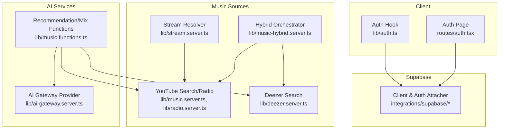
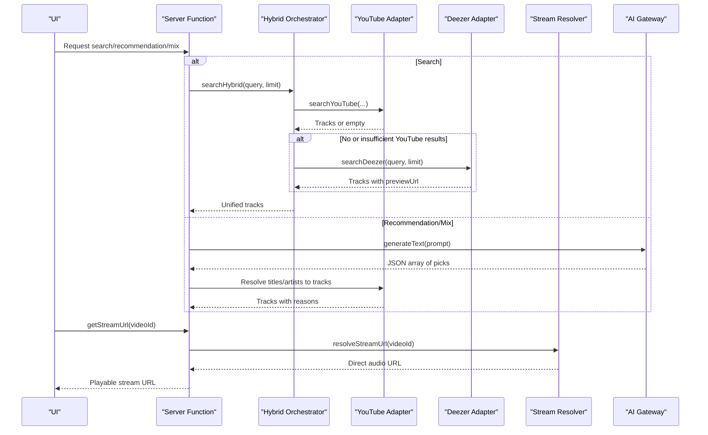
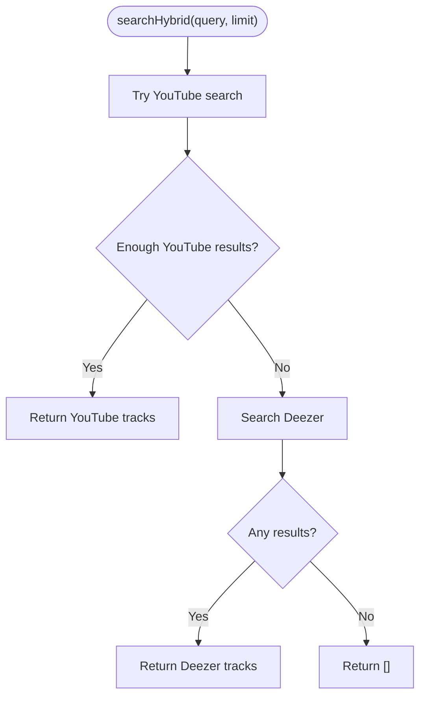
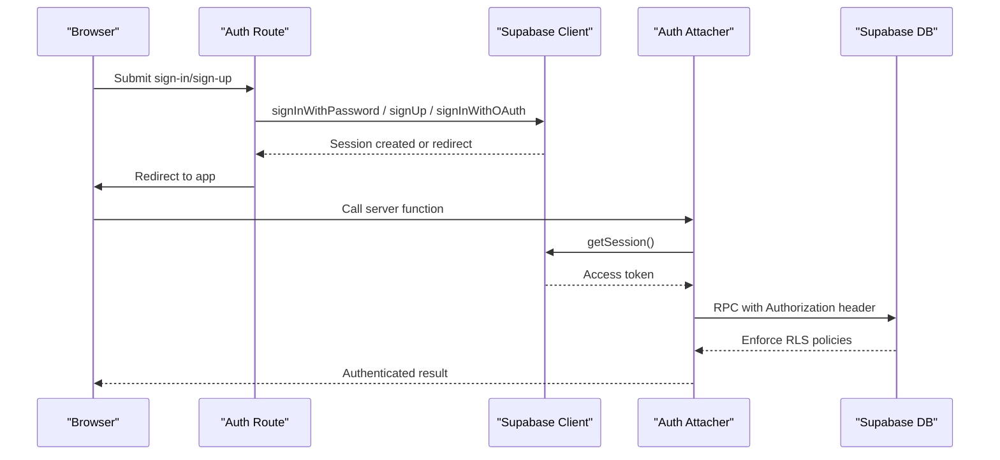
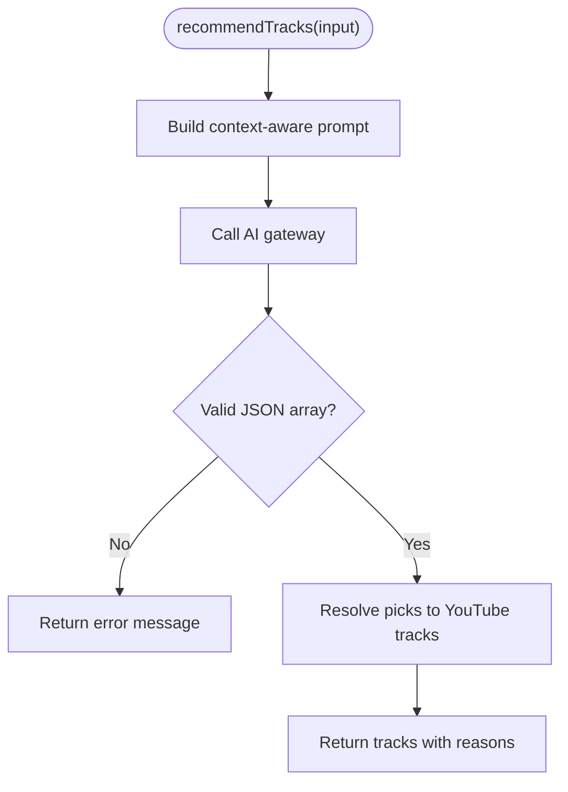
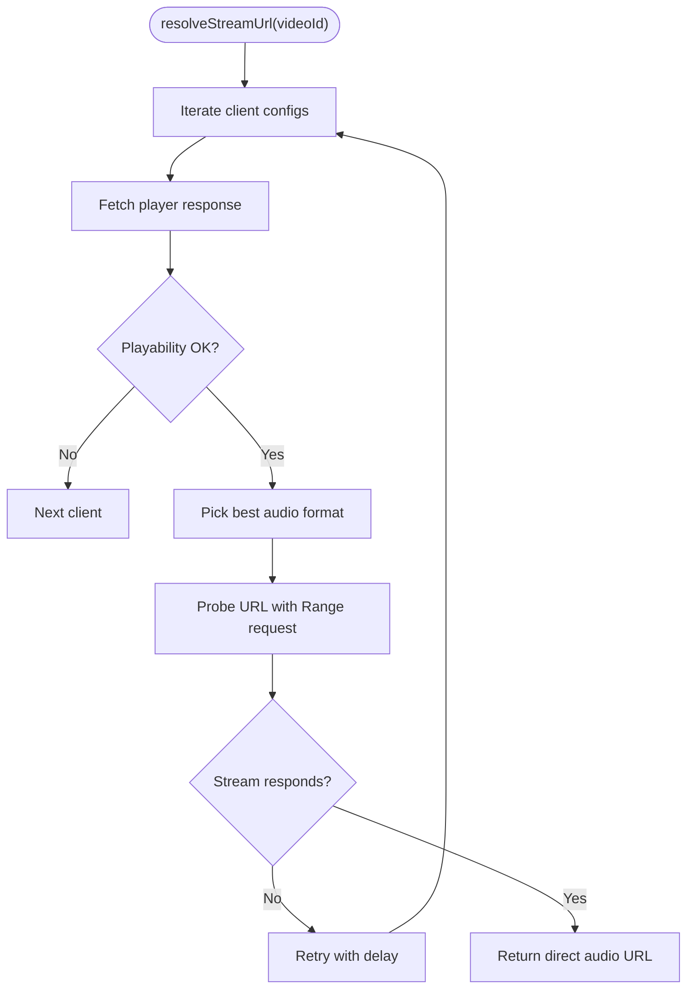
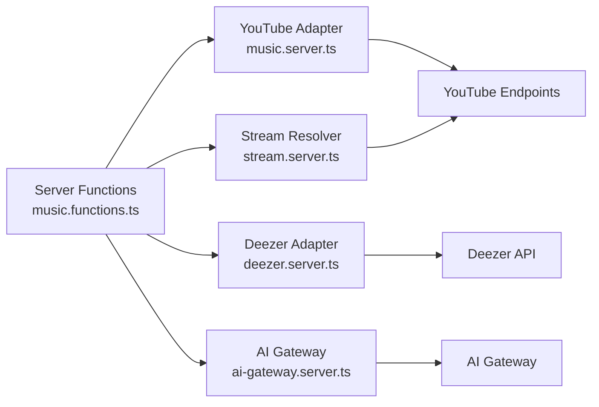

# Integration Patterns

<cite>
**Referenced Files in This Document**
- [client.ts](file://src/integrations/supabase/client.ts)
- [auth-attacher.ts](file://src/integrations/supabase/auth-attacher.ts)
- [auth.tsx](file://src/routes/auth.tsx)
- [auth.ts](file://src/lib/auth.ts)
- [music.server.ts](file://src/lib/music.server.ts)
- [deezer.server.ts](file://src/lib/deezer.server.ts)
- [music-hybrid.server.ts](file://src/lib/music-hybrid.server.ts)
- [radio.server.ts](file://src/lib/radio.server.ts)
- [stream.server.ts](file://src/lib/stream.server.ts)
- [ai-gateway.server.ts](file://src/lib/ai-gateway.server.ts)
- [music.functions.ts](file://src/lib/music.functions.ts)
- [error-capture.ts](file://src/lib/error-capture.ts)
- [ErrorBoundary.tsx](file://src/components/music/ErrorBoundary.tsx)
- [config.toml](file://supabase/config.toml)
</cite>

## Table of Contents
1. Introduction
2. Project Structure
3. Core Components
4. Architecture Overview
5. Detailed Component Analysis
6. Dependency Analysis
7. Performance Considerations
8. Troubleshooting Guide
9. Conclusion

## Introduction
This document explains the external service integration patterns used by the application, focusing on:
- Abstraction layers for multiple music sources (YouTube and Deezer) with consistent interfaces
- Supabase authentication flow, session management, and permission handling
- AI service integration for recommendations, including prompt engineering, response parsing, and fallbacks
- Error handling strategies, retry logic, and circuit breaker-like behavior for third-party APIs
- Rate limiting, request queuing, and resource management for external calls
- Configuration management across environments and credentials
- Security considerations for API keys, request signing, and data privacy

## Project Structure
The integration surface is organized into clear layers:
- Client integrations: Supabase client and auth middleware
- Music source adapters: YouTube scraping/search, Deezer search, radio, and streaming resolution
- Hybrid orchestration: Combines YouTube and Deezer to ensure playable results
- Server functions: Typed endpoints that call adapters and AI services
- Error capture and UI boundaries: Centralized error logging and component-level recovery

**Diagram sources**
- [auth.tsx:10-81](file://src/routes/auth.tsx#L10-L81)
- [auth.ts:12-69](file://src/lib/auth.ts#L12-L69)
- [client.ts:30-67](file://src/integrations/supabase/client.ts#L30-L67)
- [auth-attacher.ts:7-15](file://src/integrations/supabase/auth-attacher.ts#L7-L15)
- [music.server.ts:182-247](file://src/lib/music.server.ts#L182-L247)
- [radio.server.ts:25-94](file://src/lib/radio.server.ts#L25-L94)
- [deezer.server.ts:39-96](file://src/lib/deezer.server.ts#L39-L96)
- [music-hybrid.server.ts:22-98](file://src/lib/music-hybrid.server.ts#L22-L98)
- [stream.server.ts:108-122](file://src/lib/stream.server.ts#L108-L122)
- [ai-gateway.server.ts:3-9](file://src/lib/ai-gateway.server.ts#L3-L9)
- [music.functions.ts:58-137](file://src/lib/music.functions.ts#L58-L137)

**Section sources**
- [auth.tsx:10-81](file://src/routes/auth.tsx#L10-L81)
- [auth.ts:12-69](file://src/lib/auth.ts#L12-L69)
- [client.ts:30-67](file://src/integrations/supabase/client.ts#L30-L67)
- [auth-attacher.ts:7-15](file://src/integrations/supabase/auth-attacher.ts#L7-L15)
- [music.server.ts:182-247](file://src/lib/music.server.ts#L182-L247)
- [radio.server.ts:25-94](file://src/lib/radio.server.ts#L25-L94)
- [deezer.server.ts:39-96](file://src/lib/deezer.server.ts#L39-L96)
- [music-hybrid.server.ts:22-98](file://src/lib/music-hybrid.server.ts#L22-L98)
- [stream.server.ts:108-122](file://src/lib/stream.server.ts#L108-L122)
- [ai-gateway.server.ts:3-9](file://src/lib/ai-gateway.server.ts#L3-L9)
- [music.functions.ts:58-137](file://src/lib/music.functions.ts#L58-L137)

## Core Components
- Supabase client and auth attacher: Initializes the client with environment variables, persists sessions, auto-refreshes tokens, and attaches bearer tokens to server function RPCs.
- Music source adapters:
  - YouTube: Search and radio via internal endpoints; includes caching and filtering to return music-only tracks.
  - Deezer: Free preview search returning direct MP3 URLs as a reliable fallback.
- Hybrid orchestrator: Tries YouTube first, then falls back to Deezer to guarantee playable content.
- Stream resolver: Probes and retries multiple client configs to obtain ad-free audio URLs from YouTube.
- AI gateway provider: Configures an OpenAI-compatible provider for recommendation generation.
- Server functions: Typed endpoints that orchestrate search, recommendations, mixes, radio, and streaming.

**Section sources**
- [client.ts:30-67](file://src/integrations/supabase/client.ts#L30-L67)
- [auth-attacher.ts:7-15](file://src/integrations/supabase/auth-attacher.ts#L7-L15)
- [music.server.ts:52-75](file://src/lib/music.server.ts#L52-L75)
- [music.server.ts:182-247](file://src/lib/music.server.ts#L182-L247)
- [radio.server.ts:25-94](file://src/lib/radio.server.ts#L25-L94)
- [deezer.server.ts:39-96](file://src/lib/deezer.server.ts#L39-L96)
- [music-hybrid.server.ts:22-98](file://src/lib/music-hybrid.server.ts#L22-L98)
- [stream.server.ts:108-122](file://src/lib/stream.server.ts#L108-L122)
- [ai-gateway.server.ts:3-9](file://src/lib/ai-gateway.server.ts#L3-L9)
- [music.functions.ts:58-137](file://src/lib/music.functions.ts#L58-L137)

## Architecture Overview
The system uses layered abstractions to unify disparate external services behind consistent interfaces:
- Music sources are abstracted through a shared Track type and hybrid orchestration.
- Authentication is centralized in Supabase with automatic token attachment to server functions.
- AI recommendations are isolated behind a gateway provider and parsed into structured track objects.
- Streaming is resolved server-side to avoid ads and maintain background playback.

**Diagram sources**
- [music-hybrid.server.ts:22-98](file://src/lib/music-hybrid.server.ts#L22-L98)
- [music.server.ts:182-247](file://src/lib/music.server.ts#L182-L247)
- [deezer.server.ts:39-96](file://src/lib/deezer.server.ts#L39-L96)
- [stream.server.ts:108-122](file://src/lib/stream.server.ts#L108-L122)
- [ai-gateway.server.ts:3-9](file://src/lib/ai-gateway.server.ts#L3-L9)
- [music.functions.ts:58-137](file://src/lib/music.functions.ts#L58-L137)

## Detailed Component Analysis

### Music Source Abstraction Layer
- Shared interface: All sources produce a normalized Track object with id, title, artist, duration, thumbnail, optional previewUrl, and source tag.
- YouTube adapter: Scrapes search results with filters to keep music-only content; caches results for 5 minutes to reduce load.
- Deezer adapter: Searches free previews and returns direct MP3 links; used as a robust fallback when YouTube fails or returns restricted content.
- Hybrid orchestrator: Implements a primary/fallback strategy ensuring always-playable results; also provides radio fallback using popular songs when YouTube radio is unavailable.

**Diagram sources**
- [music-hybrid.server.ts:22-49](file://src/lib/music-hybrid.server.ts#L22-L49)
- [music.server.ts:182-247](file://src/lib/music.server.ts#L182-L247)
- [deezer.server.ts:39-96](file://src/lib/deezer.server.ts#L39-L96)

**Section sources**
- [music-hybrid.server.ts:22-98](file://src/lib/music-hybrid.server.ts#L22-L98)
- [music.server.ts:52-75](file://src/lib/music.server.ts#L52-L75)
- [music.server.ts:182-247](file://src/lib/music.server.ts#L182-L247)
- [deezer.server.ts:39-96](file://src/lib/deezer.server.ts#L39-L96)

### Supabase Authentication Flow and Permissions
- Client initialization: Reads environment variables, configures fetch wrapper to set apikey header, enables session persistence and auto-refresh.
- Auth middleware: Attaches current access token to server function RPCs so backend calls are authenticated.
- Sign-in/sign-up: Email/password and Google OAuth flows handled in the auth route; redirects after success.
- Session state: React hook listens to auth state changes and loads user profile; supports updating profile and signing out.
- Permissions: Row-level security policies restrict profiles and user library to the authenticated user.

**Diagram sources**
- [client.ts:30-67](file://src/integrations/supabase/client.ts#L30-L67)
- [auth-attacher.ts:7-15](file://src/integrations/supabase/auth-attacher.ts#L7-L15)
- [auth.tsx:46-93](file://src/routes/auth.tsx#L46-L93)
- [auth.ts:12-69](file://src/lib/auth.ts#L12-L69)
- [config.toml:1-1](file://supabase/config.toml#L1-L1)

**Section sources**
- [client.ts:30-67](file://src/integrations/supabase/client.ts#L30-L67)
- [auth-attacher.ts:7-15](file://src/integrations/supabase/auth-attacher.ts#L7-L15)
- [auth.tsx:46-93](file://src/routes/auth.tsx#L46-L93)
- [auth.ts:12-69](file://src/lib/auth.ts#L12-L69)
- [config.toml:1-1](file://supabase/config.toml#L1-L1)

### AI Service Integration for Recommendations
- Prompt engineering: Builds contextual prompts from liked/recent/disliked tracks, listening sequence, skipped items, mood, and tuning preferences; instructs the model to output a strict JSON array.
- Response parsing: Extracts JSON array from model text, validates entries, and resolves each pick to a real track via YouTube search.
- Fallback mechanisms: Handles rate limits (429), credit exhaustion (402), and general errors; returns user-friendly messages and empty results.
- Mix builder: Similar pattern for discovering new artists while excluding known ones; also falls back to local heuristics when no AI key is configured.

**Diagram sources**
- [music.functions.ts:58-137](file://src/lib/music.functions.ts#L58-L137)
- [ai-gateway.server.ts:3-9](file://src/lib/ai-gateway.server.ts#L3-L9)

**Section sources**
- [music.functions.ts:58-137](file://src/lib/music.functions.ts#L58-L137)
- [ai-gateway.server.ts:3-9](file://src/lib/ai-gateway.server.ts#L3-L9)

### Streaming Resolution and Reliability
- Multi-client retry: Attempts multiple client configurations to bypass throttling or region restrictions.
- Playability checks: Verifies play status and probes returned URLs to ensure they stream before returning.
- Best format selection: Chooses preferred audio-only formats for quality and compatibility.

**Diagram sources**
- [stream.server.ts:47-122](file://src/lib/stream.server.ts#L47-L122)

**Section sources**
- [stream.server.ts:47-122](file://src/lib/stream.server.ts#L47-L122)

### Radio and Discovery
- YouTube radio: Uses YouTube’s built-in recommendation endpoint to build similar tracks based on a seed video.
- Hybrid radio: If YouTube radio fails, falls back to searching popular songs on Deezer to ensure continuous discovery.

**Section sources**
- [radio.server.ts:25-94](file://src/lib/radio.server.ts#L25-L94)
- [music-hybrid.server.ts:54-78](file://src/lib/music-hybrid.server.ts#L54-L78)

## Dependency Analysis
- Server functions depend on:
  - Music adapters (YouTube, Deezer)
  - AI gateway provider
  - Stream resolver
- Adapters depend on:
  - External HTTP endpoints (YouTube, Deezer)
  - Environment configuration (API keys where applicable)
- Supabase integration depends on:
  - Environment variables for URL and publishable key
  - Auth middleware to attach tokens to server functions

**Diagram sources**
- [music.functions.ts:58-137](file://src/lib/music.functions.ts#L58-L137)
- [music.server.ts:182-247](file://src/lib/music.server.ts#L182-L247)
- [deezer.server.ts:39-96](file://src/lib/deezer.server.ts#L39-L96)
- [stream.server.ts:108-122](file://src/lib/stream.server.ts#L108-L122)
- [ai-gateway.server.ts:3-9](file://src/lib/ai-gateway.server.ts#L3-L9)

**Section sources**
- [music.functions.ts:58-137](file://src/lib/music.functions.ts#L58-L137)
- [music.server.ts:182-247](file://src/lib/music.server.ts#L182-L247)
- [deezer.server.ts:39-96](file://src/lib/deezer.server.ts#L39-L96)
- [stream.server.ts:108-122](file://src/lib/stream.server.ts#L108-L122)
- [ai-gateway.server.ts:3-9](file://src/lib/ai-gateway.server.ts#L3-L9)

## Performance Considerations
- Caching: In-memory LRU-style cache with TTL reduces repeated YouTube searches.
- Timeouts: Abort signals enforce timeouts on network requests to prevent hanging.
- Parallelism: Batched parallel calls for recommendations and mix building improve throughput.
- Format selection: Choosing optimal audio formats reduces bandwidth and improves playback reliability.
- Fallbacks: Hybrid strategies ensure low-latency, playable results even when primary sources fail.

[No sources needed since this section provides general guidance]

## Troubleshooting Guide
- Error capture: Centralized error logging expands stack traces and cause chains; captures last error for recovery.
- UI boundaries: Component-level error boundary prevents crashes and offers recovery attempts.
- Common issues:
  - Missing environment variables for Supabase or AI gateway lead to early failures; check configuration.
  - Network timeouts or throttling trigger fallbacks; retry or adjust limits.
  - Parsing errors in AI responses return user-friendly messages; validate prompts and outputs.

**Section sources**
- [error-capture.ts:1-82](file://src/lib/error-capture.ts#L1-L82)
- [ErrorBoundary.tsx:16-35](file://src/components/music/ErrorBoundary.tsx#L16-L35)
- [music.functions.ts:58-137](file://src/lib/music.functions.ts#L58-L137)

## Conclusion
The application employs robust abstraction layers to unify multiple music sources, secure authentication, and AI-driven recommendations. It emphasizes resilience through caching, timeouts, retries, and fallbacks, while maintaining performance via parallelization and efficient format selection. Configuration and security are managed through environment variables, token attachment, and row-level permissions, ensuring safe and scalable integrations.

[No sources needed since this section summarizes without analyzing specific files]