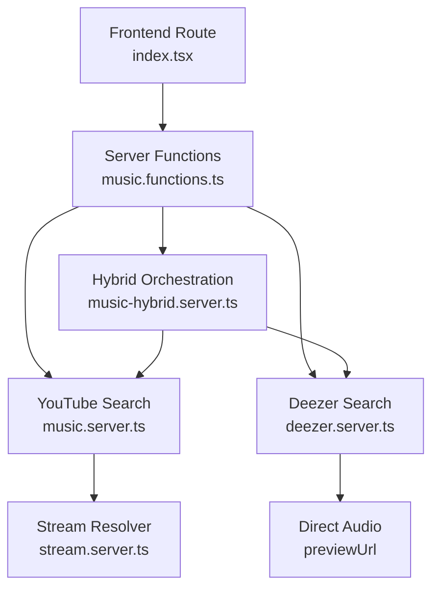
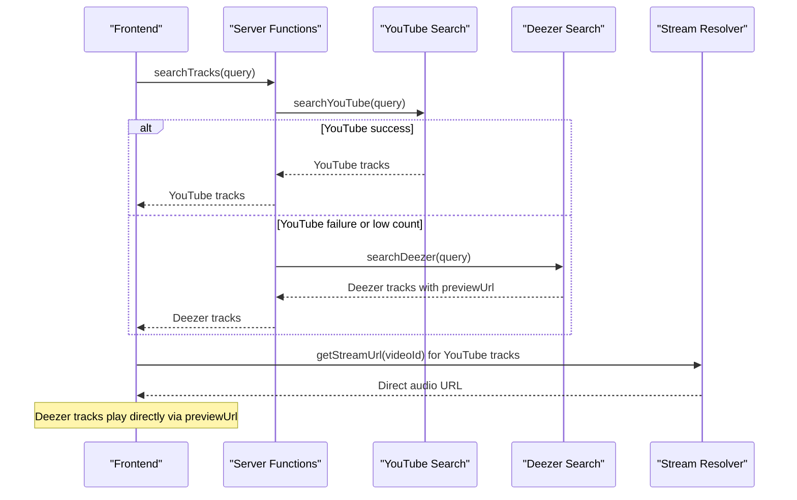
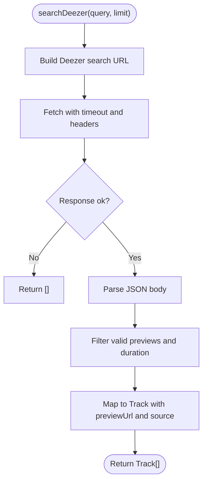
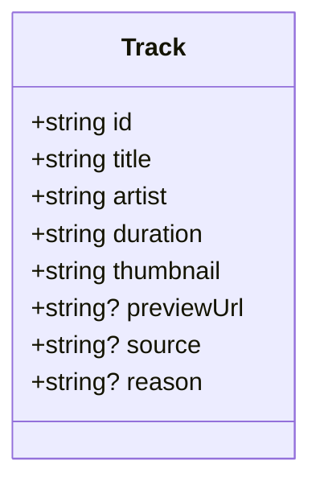
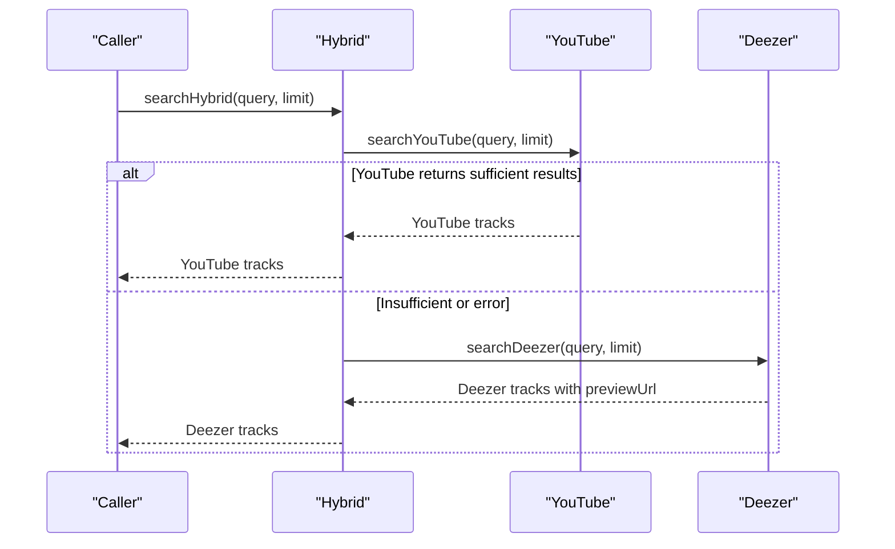
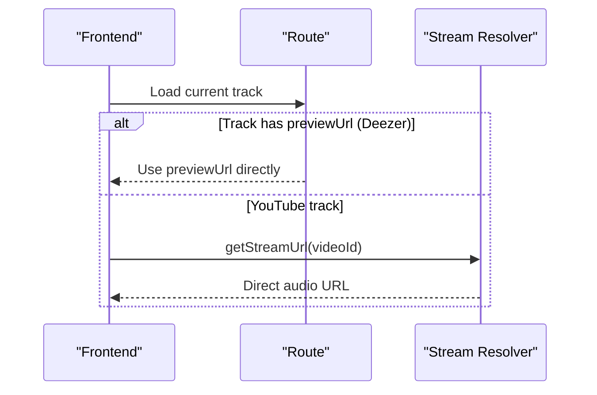
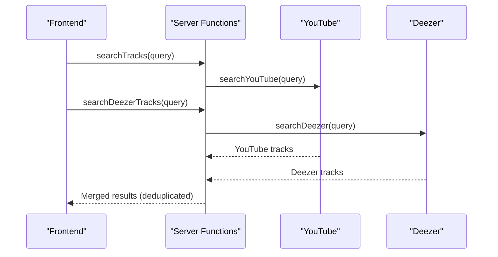
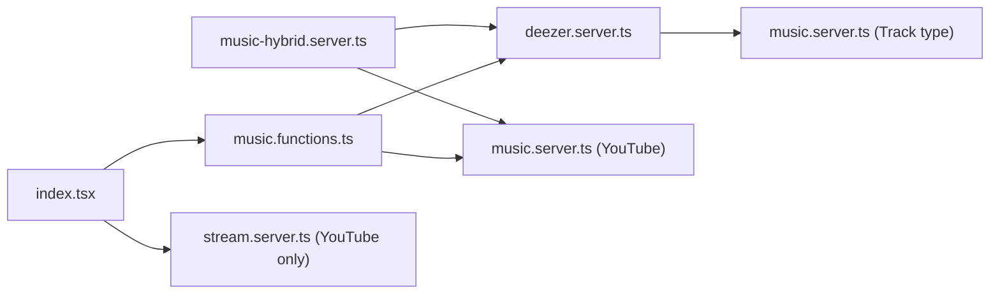

# Deezer Integration

<cite>
**Referenced Files in This Document**
- [deezer.server.ts](file://src/lib/deezer.server.ts)
- [music-hybrid.server.ts](file://src/lib/music-hybrid.server.ts)
- [music.server.ts](file://src/lib/music.server.ts)
- [stream.server.ts](file://src/lib/stream.server.ts)
- [music.functions.ts](file://src/lib/music.functions.ts)
- [index.tsx](file://src/routes/index.tsx)
</cite>

## Table of Contents
1. [Introduction](#introduction)
2. [Project Structure](#project-structure)
3. [Core Components](#core-components)
4. [Architecture Overview](#architecture-overview)
5. [Detailed Component Analysis](#detailed-component-analysis)
6. [Dependency Analysis](#dependency-analysis)
7. [Performance Considerations](#performance-considerations)
8. [Troubleshooting Guide](#troubleshooting-guide)
9. [Conclusion](#conclusion)

## Introduction
This document explains how the application integrates Deezer to provide direct audio streaming via 30-second preview URLs, and how those results are unified with YouTube search results into a single Track interface. It covers:
- Deezer client configuration and authentication (no API key required)
- API endpoint usage for track search and preview URL generation
- How Deezer tracks integrate alongside YouTube results
- Handling of the previewUrl field to stream directly without proxying through YouTube
- Examples of Deezer-specific queries, result processing, and error handling
- Fallback mechanisms when Deezer is unavailable and graceful degradation to YouTube-only functionality

## Project Structure
The Deezer integration spans several server-side modules and a frontend route that orchestrates parallel searches across providers:
- Deezer client: [deezer.server.ts](file://src/lib/deezer.server.ts)
- Hybrid orchestration: [music-hybrid.server.ts](file://src/lib/music-hybrid.server.ts)
- Unified Track type and YouTube search: [music.server.ts](file://src/lib/music.server.ts)
- Stream resolver for YouTube: [stream.server.ts](file://src/lib/stream.server.ts)
- Server functions exposed to the UI: [music.functions.ts](file://src/lib/music.functions.ts)
- Frontend search flow merging YouTube and Deezer: [index.tsx](file://src/routes/index.tsx)

**Diagram sources**
- [index.tsx:760-790](file://src/routes/index.tsx#L760-L790)
- [music.functions.ts:34-44](file://src/lib/music.functions.ts#L34-L44)
- [music.server.ts:182-247](file://src/lib/music.server.ts#L182-L247)
- [deezer.server.ts:39-74](file://src/lib/deezer.server.ts#L39-L74)
- [music-hybrid.server.ts:22-49](file://src/lib/music-hybrid.server.ts#L22-L49)
- [stream.server.ts:301-344](file://src/lib/stream.server.ts#L301-L344)

**Section sources**
- [deezer.server.ts:1-97](file://src/lib/deezer.server.ts#L1-L97)
- [music-hybrid.server.ts:1-98](file://src/lib/music-hybrid.server.ts#L1-L98)
- [music.server.ts:1-309](file://src/lib/music.server.ts#L1-L309)
- [stream.server.ts:1-388](file://src/lib/stream.server.ts#L1-L388)
- [music.functions.ts:1-643](file://src/lib/music.functions.ts#L1-L643)
- [index.tsx:760-790](file://src/routes/index.tsx#L760-L790)

## Core Components
- Deezer client: Provides free search without an API key and returns tracks with direct MP3 preview URLs.
- Unified Track interface: A shared shape used by both YouTube and Deezer results, including optional fields for direct audio streaming and source attribution.
- Hybrid orchestration: Tries YouTube first; if insufficient or failing, falls back to Deezer to ensure playable results.
- Stream resolver: Resolves direct audio URLs for YouTube videos; not used for Deezer previews because they are already direct links.
- Server functions: Expose search capabilities to the frontend, including a dedicated Deezer search function.

Key responsibilities:
- Deezer search and mapping to Track
- Hybrid fallback logic
- Direct playback via previewUrl for Deezer
- YouTube streaming via /api/stream/:videoId

**Section sources**
- [deezer.server.ts:39-74](file://src/lib/deezer.server.ts#L39-L74)
- [music.server.ts:1-13](file://src/lib/music.server.ts#L1-L13)
- [music-hybrid.server.ts:22-49](file://src/lib/music-hybrid.server.ts#L22-L49)
- [stream.server.ts:301-344](file://src/lib/stream.server.ts#L301-L344)
- [music.functions.ts:34-44](file://src/lib/music.functions.ts#L34-L44)

## Architecture Overview
The system uses a hybrid approach:
- Primary: YouTube search for full tracks
- Fallback: Deezer search for 30-second previews when YouTube fails or yields too few results
- Playback:
  - YouTube tracks use a stream resolver to obtain direct audio URLs
  - Deezer tracks play directly from their previewUrl without any proxy

**Diagram sources**
- [music.functions.ts:8-21](file://src/lib/music.functions.ts#L8-L21)
- [music.functions.ts:34-44](file://src/lib/music.functions.ts#L34-L44)
- [music-hybrid.server.ts:22-49](file://src/lib/music-hybrid.server.ts#L22-L49)
- [stream.server.ts:301-344](file://src/lib/stream.server.ts#L301-L344)

## Detailed Component Analysis

### Deezer Client
- Endpoint: Uses the public Deezer search endpoint without requiring an API key.
- Request behavior: Sets a User-Agent header and applies a timeout to avoid hanging requests.
- Response handling: Parses JSON, filters out entries without valid previews or short durations, and maps results to the unified Track type.
- Preview URLs: Each returned track includes a direct MP3 previewUrl suitable for immediate playback in standard audio players.
- Helper: A convenience function cleans titles and finds a matching Deezer preview for a given title/artist pair.

**Diagram sources**
- [deezer.server.ts:39-74](file://src/lib/deezer.server.ts#L39-L74)

**Section sources**
- [deezer.server.ts:39-74](file://src/lib/deezer.server.ts#L39-L74)
- [deezer.server.ts:80-96](file://src/lib/deezer.server.ts#L80-L96)

### Unified Track Interface
- Fields include id, title, artist, duration, thumbnail, and optional previewUrl and source.
- The presence of previewUrl indicates a direct audio link (e.g., Deezer), bypassing the YouTube stream proxy.
- Source field distinguishes between "youtube" and "deezer".

**Diagram sources**
- [music.server.ts:1-13](file://src/lib/music.server.ts#L1-L13)

**Section sources**
- [music.server.ts:1-13](file://src/lib/music.server.ts#L1-L13)

### Hybrid Orchestration
- Strategy: Try YouTube first; if it returns enough results, use them. Otherwise, fall back to Deezer to guarantee playable content.
- Radio/recommendations: Similar pattern—try YouTube radio first, then fall back to Deezer trending if needed.
- Utilities: Helpers identify Deezer-originated tracks and compute the correct playable URL per track type.

**Diagram sources**
- [music-hybrid.server.ts:22-49](file://src/lib/music-hybrid.server.ts#L22-L49)

**Section sources**
- [music-hybrid.server.ts:22-49](file://src/lib/music-hybrid.server.ts#L22-L49)
- [music-hybrid.server.ts:54-78](file://src/lib/music-hybrid.server.ts#L54-L78)
- [music-hybrid.server.ts:83-97](file://src/lib/music-hybrid.server.ts#L83-L97)

### Streaming and Playback
- YouTube tracks: Use the stream resolver to resolve direct audio URLs with caching and circuit breaker protections.
- Deezer tracks: Play directly using the previewUrl field; no additional resolution is necessary.
- Frontend handling: The route passes previewUrl directly to the audio player when present, enabling seamless playback.

**Diagram sources**
- [index.tsx:537-575](file://src/routes/index.tsx#L537-L575)
- [stream.server.ts:301-344](file://src/lib/stream.server.ts#L301-L344)

**Section sources**
- [stream.server.ts:301-344](file://src/lib/stream.server.ts#L301-L344)
- [index.tsx:537-575](file://src/routes/index.tsx#L537-L575)

### Server Functions and Frontend Integration
- Server function for Deezer search: Validates input and delegates to the Deezer client, returning tracks with playable preview URLs.
- Frontend search: Executes YouTube and Deezer searches in parallel, merges results while deduplicating by title+artist, and displays up to a capped number of results.

**Diagram sources**
- [music.functions.ts:8-21](file://src/lib/music.functions.ts#L8-L21)
- [music.functions.ts:34-44](file://src/lib/music.functions.ts#L34-L44)
- [index.tsx:760-790](file://src/routes/index.tsx#L760-L790)

**Section sources**
- [music.functions.ts:34-44](file://src/lib/music.functions.ts#L34-L44)
- [index.tsx:760-790](file://src/routes/index.tsx#L760-L790)

## Dependency Analysis
- Deezer client depends on the unified Track type to normalize results.
- Hybrid orchestration depends on both YouTube and Deezer clients to implement fallback logic.
- Frontend route depends on server functions to perform cross-provider searches and merge results.
- Stream resolver is independent and only used for YouTube tracks.

**Diagram sources**
- [deezer.server.ts:9-97](file://src/lib/deezer.server.ts#L9-L97)
- [music-hybrid.server.ts:14-97](file://src/lib/music-hybrid.server.ts#L14-L97)
- [music.functions.ts:8-44](file://src/lib/music.functions.ts#L8-L44)
- [index.tsx:760-790](file://src/routes/index.tsx#L760-L790)
- [stream.server.ts:301-344](file://src/lib/stream.server.ts#L301-L344)

**Section sources**
- [deezer.server.ts:9-97](file://src/lib/deezer.server.ts#L9-L97)
- [music-hybrid.server.ts:14-97](file://src/lib/music-hybrid.server.ts#L14-L97)
- [music.functions.ts:8-44](file://src/lib/music.functions.ts#L8-L44)
- [index.tsx:760-790](file://src/routes/index.tsx#L760-L790)
- [stream.server.ts:301-344](file://src/lib/stream.server.ts#L301-L344)

## Performance Considerations
- Timeouts: Deezer search uses a request timeout to prevent long hangs.
- Caching: YouTube search results are cached for a short period to reduce repeated network calls.
- Circuit breaker: The stream resolver implements a circuit breaker to avoid hammering YouTube during failures.
- Parallel execution: The frontend performs YouTube and Deezer searches concurrently to minimize latency.

[No sources needed since this section provides general guidance]

## Troubleshooting Guide
Common issues and mitigations:
- Network errors or timeouts: Deezer search returns empty arrays on fetch or parse failures, preventing crashes and allowing fallbacks.
- Rate limits: The stream resolver’s circuit breaker reduces load on YouTube when consecutive failures occur.
- Unavailable content: If YouTube cannot stream a video, the hybrid strategy can still return Deezer previews; the frontend also handles multiple playback errors gracefully by skipping tracks.

Operational tips:
- Validate query strings and limits to avoid excessive requests.
- Monitor logs for warnings about failed resolutions or rate limiting.
- Ensure timeouts are appropriate for your environment to balance responsiveness and reliability.

**Section sources**
- [deezer.server.ts:45-61](file://src/lib/deezer.server.ts#L45-L61)
- [stream.server.ts:65-90](file://src/lib/stream.server.ts#L65-L90)
- [index.tsx:497-512](file://src/routes/index.tsx#L497-L512)

## Conclusion
The Deezer integration enhances resilience and availability by providing direct audio previews when YouTube is restricted or unavailable. Tracks from both providers are unified under a common interface, enabling seamless playback:
- Deezer tracks stream directly via previewUrl
- YouTube tracks use a robust stream resolver with caching and circuit breaking
- Hybrid orchestration ensures users always receive playable content
- The frontend merges and deduplicates results for a cohesive search experience

[No sources needed since this section summarizes without analyzing specific files]