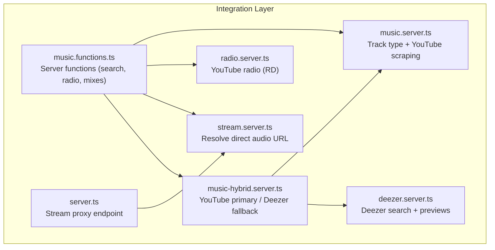
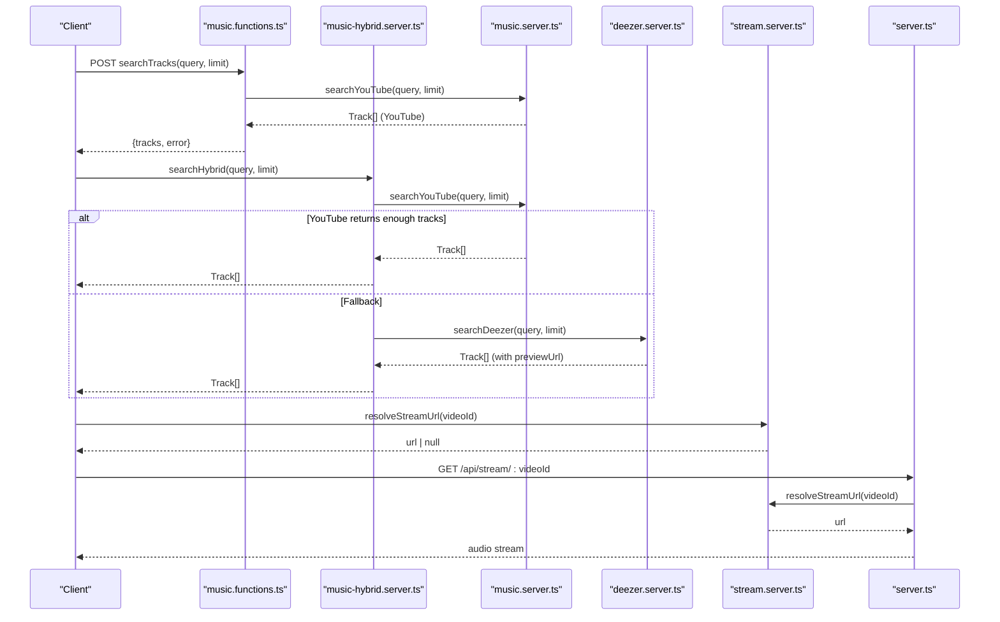
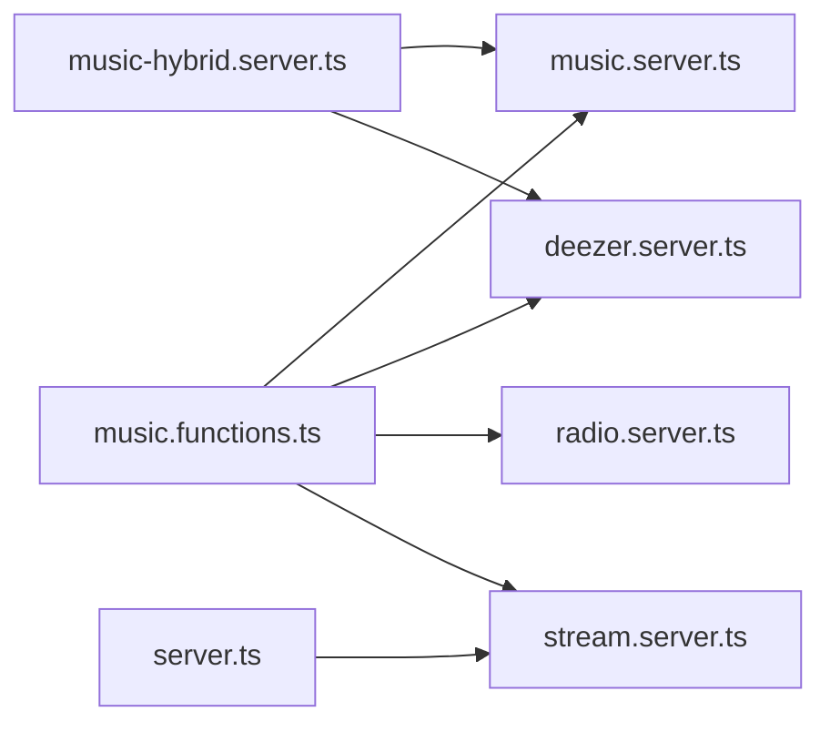

# Music Sources Integration

<cite>
**Referenced Files in This Document**
- [music.server.ts](file://src/lib/music.server.ts)
- [deezer.server.ts](file://src/lib/deezer.server.ts)
- [music-hybrid.server.ts](file://src/lib/music-hybrid.server.ts)
- [stream.server.ts](file://src/lib/stream.server.ts)
- [radio.server.ts](file://src/lib/radio.server.ts)
- [music.functions.ts](file://src/lib/music.functions.ts)
- [server.ts](file://src/server.ts)
</cite>

## Table of Contents
1. [Introduction](#introduction)
2. [Project Structure](#project-structure)
3. [Core Components](#core-components)
4. [Architecture Overview](#architecture-overview)
5. [Detailed Component Analysis](#detailed-component-analysis)
6. [Dependency Analysis](#dependency-analysis)
7. [Performance Considerations](#performance-considerations)
8. [Troubleshooting Guide](#troubleshooting-guide)
9. [Conclusion](#conclusion)
10. [Appendices](#appendices)

## Introduction
This document explains the music sources integration layer that abstracts multiple streaming platforms behind a unified interface. It standardizes data from YouTube and Deezer into a common Track model, provides resilient search and playback flows, and offers fallback strategies when sources are unavailable. You will learn how YouTube scraping filters for music content, how Deezer previews are used as direct audio streams, and how to add new sources by implementing the standardized interface.

## Project Structure
The integration spans several server-side modules:
- Unified Track type and YouTube scraping logic
- Deezer API integration for preview tracks
- Hybrid orchestration combining YouTube and Deezer
- Stream resolution for ad-free playback
- Radio recommendations via YouTube’s internal endpoints
- Server functions exposing these capabilities to the client

**Diagram sources**
- [music.server.ts:1-248](file://src/lib/music.server.ts#L1-L248)
- [deezer.server.ts:1-97](file://src/lib/deezer.server.ts#L1-L97)
- [music-hybrid.server.ts:1-98](file://src/lib/music-hybrid.server.ts#L1-L98)
- [stream.server.ts:1-123](file://src/lib/stream.server.ts#L1-L123)
- [radio.server.ts:1-95](file://src/lib/radio.server.ts#L1-L95)
- [music.functions.ts:1-627](file://src/lib/music.functions.ts#L1-L627)
- [server.ts:64-175](file://src/server.ts#L64-L175)

**Section sources**
- [music.server.ts:1-248](file://src/lib/music.server.ts#L1-L248)
- [deezer.server.ts:1-97](file://src/lib/deezer.server.ts#L1-L97)
- [music-hybrid.server.ts:1-98](file://src/lib/music-hybrid.server.ts#L1-L98)
- [stream.server.ts:1-123](file://src/lib/stream.server.ts#L1-L123)
- [radio.server.ts:1-95](file://src/lib/radio.server.ts#L1-L95)
- [music.functions.ts:1-627](file://src/lib/music.functions.ts#L1-L627)
- [server.ts:64-175](file://src/server.ts#L64-L175)

## Core Components
- Unified Track interface: A single shape representing any track regardless of source, including provider identification and optional direct preview URLs.
- YouTube scraping: Search filtering for music-only results, detection of non-music content, and parsing of video metadata.
- Deezer integration: Direct MP3 preview retrieval with metadata mapping to the Track interface.
- Hybrid orchestration: Primary search on YouTube with automatic fallback to Deezer previews.
- Stream resolution: Resolves ad-free audio URLs for YouTube videos with retry and probing logic.
- Radio: Uses YouTube’s recommendation engine to generate similar tracks.

Key responsibilities:
- Normalize heterogeneous responses into a consistent Track object.
- Provide robust error handling and graceful degradation across sources.
- Cache and rate-limit where appropriate to reduce external calls.

**Section sources**
- [music.server.ts:1-248](file://src/lib/music.server.ts#L1-L248)
- [deezer.server.ts:1-97](file://src/lib/deezer.server.ts#L1-L97)
- [music-hybrid.server.ts:1-98](file://src/lib/music-hybrid.server.ts#L1-L98)
- [stream.server.ts:1-123](file://src/lib/stream.server.ts#L1-L123)
- [radio.server.ts:1-95](file://src/lib/radio.server.ts#L1-L95)

## Architecture Overview
The system composes multiple sources through a layered approach:
- Client-facing server functions call into source-specific modules.
- The hybrid layer coordinates between YouTube and Deezer to ensure playable results.
- Playback uses either direct preview URLs (Deezer) or resolved YouTube stream URLs proxied by the server.

**Diagram sources**
- [music.functions.ts:8-21](file://src/lib/music.functions.ts#L8-L21)
- [music-hybrid.server.ts:22-48](file://src/lib/music-hybrid.server.ts#L22-L48)
- [music.server.ts:183-247](file://src/lib/music.server.ts#L183-L247)
- [deezer.server.ts:39-74](file://src/lib/deezer.server.ts#L39-L74)
- [stream.server.ts:108-122](file://src/lib/stream.server.ts#L108-L122)
- [server.ts:102-175](file://src/server.ts#L102-L175)

## Detailed Component Analysis

### Unified Track Interface
The Track interface standardizes data from different sources:
- id: unique identifier per source
- title, artist, duration, thumbnail: display fields
- previewUrl: optional direct audio URL (e.g., Deezer preview)
- source: provider tag ("youtube" or "deezer")
- reason: optional AI recommendation context

This abstraction allows the UI and playback logic to treat all tracks uniformly while preserving source-specific behavior.

**Section sources**
- [music.server.ts:1-13](file://src/lib/music.server.ts#L1-L13)

### YouTube Scraping Implementation
The YouTube module scrapes search results without an API key:
- Adds “audio” to queries to prioritize songs when musicOnly is enabled
- Applies category filters to keep results within music
- Parses embedded JSON containing video renderers
- Filters out non-music content using keyword lists and duration heuristics
- Deduplicates and limits results
- Caches results for 5 minutes with LRU eviction

Search filtering and music detection:
- Non-music keywords exclude interviews, podcasts, vlogs, etc.
- Compilation keywords filter out jukeboxes and best-of mixes
- Duration checks remove very short clips and live/shorts

Parsing:
- Extracts videoId, title, artist, duration, thumbnails
- Normalizes to Track objects

Caching:
- In-memory cache keyed by query parameters
- TTL-based expiration and size cap

**Section sources**
- [music.server.ts:40-162](file://src/lib/music.server.ts#L40-L162)
- [music.server.ts:183-247](file://src/lib/music.server.ts#L183-L247)

### Deezer API Integration
The Deezer module integrates with the free search API:
- Builds a search URL with query and limit
- Fetches with a User-Agent header and timeout
- Maps response to Track objects
- Includes direct previewUrl for immediate playback
- Filters results to include only those with previews and sufficient duration

Preview discovery helper:
- Cleans titles to improve matching
- Searches for a close match and returns the first previewUrl if found

**Section sources**
- [deezer.server.ts:1-97](file://src/lib/deezer.server.ts#L1-L97)

### Hybrid Orchestration (YouTube Primary, Deezer Fallback)
The hybrid layer ensures always-playable results:
- Attempts YouTube search first; if it returns enough tracks, uses them
- On failure or insufficient results, falls back to Deezer search
- Marks Deezer tracks with a special field to route playback to direct previews
- Provides utilities to detect Deezer tracks and compute the correct stream URL

Playback routing:
- Deezer tracks use their previewUrl directly
- YouTube tracks use the server stream proxy endpoint

**Section sources**
- [music-hybrid.server.ts:1-98](file://src/lib/music-hybrid.server.ts#L1-L98)

### Stream Resolution and Proxy
Resolving YouTube streams:
- Calls YouTube’s internal player API with multiple client configs
- Picks the best audio-only format (preferring higher bitrate)
- Probes the URL to ensure it actually streams before returning
- Retries across clients with small delays to handle throttling

Server stream proxy:
- Streams chunks from the resolved URL with range requests
- Caps large streams to avoid excessive bandwidth usage
- Handles errors and invalid ranges gracefully

**Section sources**
- [stream.server.ts:1-123](file://src/lib/stream.server.ts#L1-L123)
- [server.ts:64-175](file://src/server.ts#L64-L175)

### Radio Recommendations
Radio functionality leverages YouTube’s built-in recommendation engine:
- Requests the RD playlist for a given video
- Parses recommended items and maps to Track objects
- Excludes duplicates and non-video entries

**Section sources**
- [radio.server.ts:1-95](file://src/lib/radio.server.ts#L1-L95)

### Server Functions (Client Entry Points)
Server functions expose search, suggestions, recommendations, and streaming:
- searchTracks: wraps YouTube search with validation and error handling
- suggestQueries: fetches autocomplete suggestions from YouTube
- searchDeezerTracks: exposes Deezer search to clients
- recommendTracks/buildMix/newSongs/podcastPicks/localPicks/moodPicks: orchestrate searches and AI-driven picks
- radioTracks: fetches YouTube radio tracks
- getStreamUrl: resolves direct stream URLs

Error handling:
- Validates inputs
- Returns structured responses with tracks and error messages
- Gracefully handles network failures and timeouts

**Section sources**
- [music.functions.ts:1-627](file://src/lib/music.functions.ts#L1-L627)

## Dependency Analysis
The integration has clear separation of concerns:
- music.functions.ts depends on music.server.ts, deezer.server.ts, radio.server.ts, stream.server.ts
- music-hybrid.server.ts depends on music.server.ts and deezer.server.ts
- stream.server.ts is independent but consumed by server.ts and music.functions.ts
- server.ts proxies streams resolved by stream.server.ts

**Diagram sources**
- [music.functions.ts:1-627](file://src/lib/music.functions.ts#L1-L627)
- [music-hybrid.server.ts:1-98](file://src/lib/music-hybrid.server.ts#L1-L98)
- [stream.server.ts:1-123](file://src/lib/stream.server.ts#L1-L123)
- [server.ts:64-175](file://src/server.ts#L64-L175)

**Section sources**
- [music.functions.ts:1-627](file://src/lib/music.functions.ts#L1-L627)
- [music-hybrid.server.ts:1-98](file://src/lib/music-hybrid.server.ts#L1-L98)
- [stream.server.ts:1-123](file://src/lib/stream.server.ts#L1-L123)
- [server.ts:64-175](file://src/server.ts#L64-L175)

## Performance Considerations
- Caching: YouTube search results are cached for 5 minutes with LRU eviction to reduce repeated scraping.
- Timeouts: All external requests set explicit timeouts to prevent hanging.
- Filtering: Keyword and duration filters reduce irrelevant results early, improving UX and reducing downstream processing.
- Streaming: Stream proxy caps large transfers and uses chunked reading to conserve memory and bandwidth.
- Retry logic: Stream resolution retries across multiple client configs to mitigate throttling and flaky responses.

[No sources needed since this section provides general guidance]

## Troubleshooting Guide
Common issues and strategies:
- Network errors/timeouts: Modules return empty arrays or nulls instead of crashing; callers should handle empty results gracefully.
- Rate limiting: Stream resolution includes retries with delays; consider adding exponential backoff at higher layers if needed.
- Unplayable content: YouTube tracks may be restricted; hybrid fallback to Deezer previews ensures availability.
- Invalid ranges: Stream proxy validates Range headers and responds appropriately.
- Parsing failures: HTML/JSON parsing is wrapped in try/catch blocks; malformed responses degrade to empty results.

Operational tips:
- Log warnings when falling back to Deezer to monitor YouTube reliability.
- Monitor stream proxy errors for upstream chunk failures.
- Use the provided server functions’ error fields to inform users about transient issues.

**Section sources**
- [music-hybrid.server.ts:22-48](file://src/lib/music-hybrid.server.ts#L22-L48)
- [stream.server.ts:108-122](file://src/lib/stream.server.ts#L108-L122)
- [server.ts:102-175](file://src/server.ts#L102-L175)

## Conclusion
The music sources integration layer provides a robust, unified experience over multiple platforms. By standardizing data through the Track interface, applying smart filtering, and orchestrating fallbacks, it ensures reliable search and playback. The design supports easy extension: adding a new source means implementing the same interface and integrating it into the hybrid flow.

[No sources needed since this section summarizes without analyzing specific files]

## Appendices

### Adding a New Music Source
To integrate a new platform:
1. Define a local mapper that converts the platform’s response into the unified Track type.
2. Implement a search function that returns Track[], handling network errors and timeouts.
3. If the platform provides direct audio, include previewUrl and set source accordingly.
4. Integrate into the hybrid layer:
   - Add a new fallback branch after YouTube and before existing fallbacks (or replace one).
   - Ensure getTrackStreamUrl routes playback correctly based on previewUrl presence.
5. Expose a server function to call your new search capability.
6. Update tests and monitoring to validate performance and error rates.

Example integration points:
- Mapper and search: follow patterns in [deezer.server.ts:39-74](file://src/lib/deezer.server.ts#L39-L74)
- Hybrid fallback: extend [music-hybrid.server.ts:22-48](file://src/lib/music-hybrid.server.ts#L22-L48)
- Stream routing: use [music-hybrid.server.ts:80-98](file://src/lib/music-hybrid.server.ts#L80-L98)

**Section sources**
- [deezer.server.ts:39-74](file://src/lib/deezer.server.ts#L39-L74)
- [music-hybrid.server.ts:22-48](file://src/lib/music-hybrid.server.ts#L22-L48)
- [music-hybrid.server.ts:80-98](file://src/lib/music-hybrid.server.ts#L80-L98)