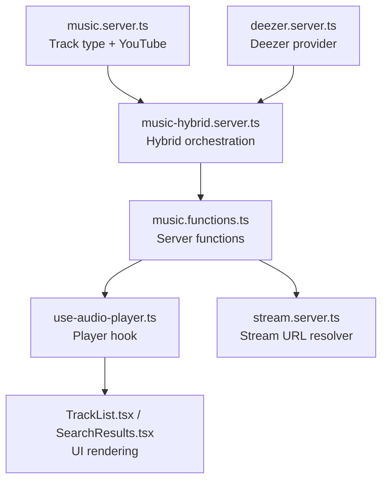
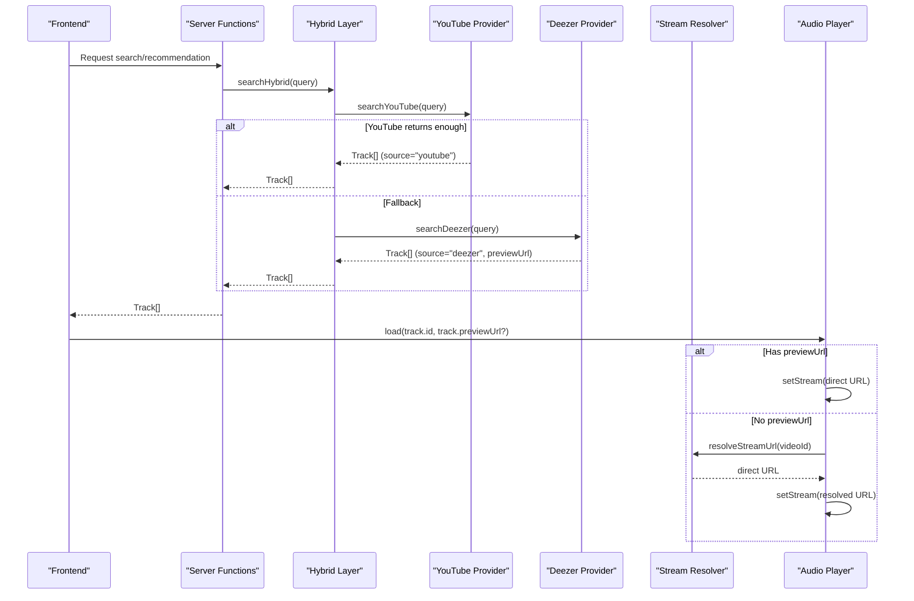
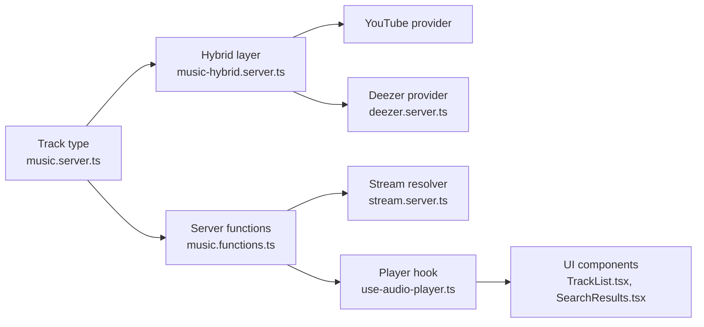

# Unified Track Interface

<cite>
**Referenced Files in This Document**
- [music.server.ts](file://src/lib/music.server.ts)
- [library.ts](file://src/lib/library.ts)
- [deezer.server.ts](file://src/lib/deezer.server.ts)
- [music-hybrid.server.ts](file://src/lib/music-hybrid.server.ts)
- [music.functions.ts](file://src/lib/music.functions.ts)
- [stream.server.ts](file://src/lib/stream.server.ts)
- [use-audio-player.ts](file://src/lib/use-audio-player.ts)
- [TrackList.tsx](file://src/components/music/TrackList.tsx)
- [SearchResults.tsx](file://src/components/music/ui/SearchResults.tsx)
</cite>

## Table of Contents
1. Introduction
2. Project Structure
3. Core Components
4. Architecture Overview
5. Detailed Component Analysis
6. Dependency Analysis
7. Performance Considerations
8. Troubleshooting Guide
9. Conclusion
10. Appendices

## Introduction
This document explains the unified Track interface that standardizes data from multiple music sources (YouTube and Deezer). It covers all Track properties, how each source populates them, differences in their data structures, usage of the source field to distinguish providers, examples of creating Track objects, frontend rendering considerations, previewUrl optimization for direct streaming, and guidelines for extending the interface to new sources.

## Project Structure
The Track type is defined centrally and consumed across server-side search, hybrid orchestration, streaming, and UI components:
- Server-side Track definition and YouTube integration
- Deezer provider implementation
- Hybrid orchestration layer
- Streaming resolver for YouTube streams
- Frontend player hook and list/search components

**Diagram sources**
- [music.server.ts:1-13](file://src/lib/music.server.ts#L1-L13)
- [deezer.server.ts:39-74](file://src/lib/deezer.server.ts#L39-L74)
- [music-hybrid.server.ts:22-49](file://src/lib/music-hybrid.server.ts#L22-L49)
- [music.functions.ts:8-21](file://src/lib/music.functions.ts#L8-L21)
- [stream.server.ts:301-344](file://src/lib/stream.server.ts#L301-L344)
- [use-audio-player.ts:142-156](file://src/lib/use-audio-player.ts#L142-L156)
- [TrackList.tsx:122-156](file://src/components/music/TrackList.tsx#L122-L156)
- [SearchResults.tsx:157-203](file://src/components/music/ui/SearchResults.tsx#L157-L203)

**Section sources**
- [music.server.ts:1-13](file://src/lib/music.server.ts#L1-L13)
- [library.ts:3-14](file://src/lib/library.ts#L3-L14)
- [deezer.server.ts:39-74](file://src/lib/deezer.server.ts#L39-L74)
- [music-hybrid.server.ts:22-49](file://src/lib/music-hybrid.server.ts#L22-L49)
- [music.functions.ts:8-21](file://src/lib/music.functions.ts#L8-L21)
- [stream.server.ts:301-344](file://src/lib/stream.server.ts#L301-L344)
- [use-audio-player.ts:142-156](file://src/lib/use-audio-player.ts#L142-L156)
- [TrackList.tsx:122-156](file://src/components/music/TrackList.tsx#L122-L156)
- [SearchResults.tsx:157-203](file://src/components/music/ui/SearchResults.tsx#L157-L203)

## Core Components
- Unified Track type defines a consistent shape for all tracks regardless of origin.
- Provider implementations transform raw API responses into the unified Track.
- Hybrid layer coordinates fallbacks between providers.
- Streaming layer resolves playable URLs per provider.
- UI consumes Track uniformly while optionally leveraging source-specific fields.

Key responsibilities:
- Standardization: All sources return the same Track shape.
- Source identification: The source field indicates the provider.
- Direct streaming: previewUrl allows bypassing proxy when available.
- AI reasons: reason field carries recommendation context.

**Section sources**
- [music.server.ts:1-13](file://src/lib/music.server.ts#L1-L13)
- [library.ts:3-14](file://src/lib/library.ts#L3-L14)
- [deezer.server.ts:39-74](file://src/lib/deezer.server.ts#L39-L74)
- [music-hybrid.server.ts:22-49](file://src/lib/music-hybrid.server.ts#L22-L49)
- [music.functions.ts:58-137](file://src/lib/music.functions.ts#L58-L137)
- [stream.server.ts:301-344](file://src/lib/stream.server.ts#L301-L344)
- [use-audio-player.ts:142-156](file://src/lib/use-audio-player.ts#L142-L156)
- [TrackList.tsx:122-156](file://src/components/music/TrackList.tsx#L122-L156)
- [SearchResults.tsx:157-203](file://src/components/music/ui/SearchResults.tsx#L157-L203)

## Architecture Overview
The system uses a layered approach:
- Providers: YouTube (via server utilities) and Deezer produce Tracks.
- Hybrid orchestrator selects primary results and falls back to Deezer if needed.
- Streaming resolver provides direct audio URLs for YouTube; Deezer tracks use direct previews.
- Player hook loads either direct URLs or proxies through a stream endpoint.
- UI renders tracks uniformly and can display optional metadata like reason.

**Diagram sources**
- [music-hybrid.server.ts:22-49](file://src/lib/music-hybrid.server.ts#L22-L49)
- [deezer.server.ts:39-74](file://src/lib/deezer.server.ts#L39-L74)
- [music.functions.ts:8-21](file://src/lib/music.functions.ts#L8-L21)
- [stream.server.ts:301-344](file://src/lib/stream.server.ts#L301-L344)
- [use-audio-player.ts:142-156](file://src/lib/use-audio-player.ts#L142-L156)

## Detailed Component Analysis

### Unified Track Type
The canonical Track type defines:
- id: string — unique identifier for playback routing
- title: string
- artist: string
- duration: string
- thumbnail: string
- previewUrl?: string — direct audio URL that bypasses the YouTube stream proxy
- source?: "youtube" | "deezer" — provider identification
- reason?: string — AI recommendation reason shown in feeds

Notes:
- The server-side definition includes reason; the library client-side definition mirrors core fields used by UI.
- Optional fields allow flexible population depending on source.

**Section sources**
- [music.server.ts:1-13](file://src/lib/music.server.ts#L1-L13)
- [library.ts:3-14](file://src/lib/library.ts#L3-L14)

### YouTube Provider
- Produces Tracks with source typically omitted or defaulting to "youtube".
- Uses server utilities to fetch video metadata and thumbnails.
- Does not include previewUrl; playback goes through the stream resolver.

Behavior highlights:
- Duration is formatted as a string.
- Thumbnail is sourced from YouTube video metadata.
- Reason may be attached by recommendation flows.

**Section sources**
- [music.server.ts:1-13](file://src/lib/music.server.ts#L1-L13)
- [music.functions.ts:58-137](file://src/lib/music.functions.ts#L58-L137)

### Deezer Provider
- Produces Tracks with source explicitly set to "deezer".
- Includes previewUrl pointing to a direct MP3 preview.
- Formats duration to a human-readable string.
- Sets thumbnail from album cover variants.

Data mapping:
- id prefixed with provider namespace for uniqueness.
- artist name extracted from nested object.
- duration converted from seconds to "m:ss".

**Section sources**
- [deezer.server.ts:39-74](file://src/lib/deezer.server.ts#L39-L74)

### Hybrid Orchestration
- Tries YouTube first; if insufficient results or failure, falls back to Deezer.
- Adds an internal _deezerPreview field for stream selection logic in certain flows.
- Provides helpers to detect Deezer-originated tracks and compute playable URLs.

Key behaviors:
- Ensures always-playable results by falling back to Deezer previews.
- Stream URL selection prefers direct preview when available.

**Section sources**
- [music-hybrid.server.ts:22-49](file://src/lib/music-hybrid.server.ts#L22-L49)
- [music-hybrid.server.ts:80-97](file://src/lib/music-hybrid.server.ts#L80-L97)

### Streaming Resolution
- For YouTube tracks without previewUrl, resolves a direct audio URL via ytdl-core or manual player API fallback.
- Implements caching and circuit breaker to handle rate limits and failures.
- Probes URLs to ensure they stream before returning.

Flow:
- Check cache → validate ID → try ytdl-core → fallback to manual API → cache and return.

**Section sources**
- [stream.server.ts:301-344](file://src/lib/stream.server.ts#L301-L344)
- [stream.server.ts:122-174](file://src/lib/stream.server.ts#L122-L174)
- [stream.server.ts:268-289](file://src/lib/stream.server.ts#L268-L289)

### Frontend Player Hook
- Accepts an optional directUrl parameter to bypass proxy when previewUrl is present.
- Otherwise, routes playback through a stream endpoint using the track id.
- Supports offline playback via cached blobs.

Usage pattern:
- If track has previewUrl, pass it directly to avoid server round-trip.
- Else, call load/cue with id only; hook will request stream resolution.

**Section sources**
- [use-audio-player.ts:142-156](file://src/lib/use-audio-player.ts#L142-L156)
- [use-audio-player.ts:103-121](file://src/lib/use-audio-player.ts#L103-L121)

### UI Rendering
- Displays title, artist, thumbnail, and duration uniformly.
- Optionally shows reason text next to artist line for recommendations.
- Media cards and lists render consistently regardless of source.

Source-aware behavior:
- UI does not need to branch on source for basic rendering.
- When available, previewUrl influences playback path chosen by the player hook.

**Section sources**
- [TrackList.tsx:122-156](file://src/components/music/TrackList.tsx#L122-L156)
- [SearchResults.tsx:157-203](file://src/components/music/ui/SearchResults.tsx#L157-L203)

## Dependency Analysis
- The Track type is imported by both server modules and UI libraries.
- Hybrid depends on YouTube and Deezer providers.
- Server functions depend on hybrid and streaming resolver.
- Player hook depends on streaming endpoint or direct URLs.

**Diagram sources**
- [music.server.ts:1-13](file://src/lib/music.server.ts#L1-L13)
- [music.functions.ts:8-21](file://src/lib/music.functions.ts#L8-L21)
- [music-hybrid.server.ts:22-49](file://src/lib/music-hybrid.server.ts#L22-L49)
- [deezer.server.ts:39-74](file://src/lib/deezer.server.ts#L39-L74)
- [stream.server.ts:301-344](file://src/lib/stream.server.ts#L301-L344)
- [use-audio-player.ts:142-156](file://src/lib/use-audio-player.ts#L142-L156)
- [TrackList.tsx:122-156](file://src/components/music/TrackList.tsx#L122-L156)
- [SearchResults.tsx:157-203](file://src/components/music/ui/SearchResults.tsx#L157-L203)

**Section sources**
- [music.server.ts:1-13](file://src/lib/music.server.ts#L1-L13)
- [music.functions.ts:8-21](file://src/lib/music.functions.ts#L8-L21)
- [music-hybrid.server.ts:22-49](file://src/lib/music-hybrid.server.ts#L22-L49)
- [deezer.server.ts:39-74](file://src/lib/deezer.server.ts#L39-L74)
- [stream.server.ts:301-344](file://src/lib/stream.server.ts#L301-L344)
- [use-audio-player.ts:142-156](file://src/lib/use-audio-player.ts#L142-L156)
- [TrackList.tsx:122-156](file://src/components/music/TrackList.tsx#L122-L156)
- [SearchResults.tsx:157-203](file://src/components/music/ui/SearchResults.tsx#L157-L203)

## Performance Considerations
- Use previewUrl when available to bypass server-side stream resolution, reducing latency and server load.
- Hybrid fallback ensures availability even when YouTube is restricted or rate-limited.
- Stream resolver caches resolved URLs and employs a circuit breaker to mitigate repeated failures.
- UI renders efficiently with lazy images and memoized components.

[No sources needed since this section provides general guidance]

## Troubleshooting Guide
Common issues and resolutions:
- Playback fails due to restricted content:
  - Hybrid fallback to Deezer previews improves reliability.
  - Stream resolver includes probing and fallback strategies.
- Rate limiting or blocking:
  - Circuit breaker backs off after consecutive failures.
  - Manual player API fallback provides resilience.
- Missing or invalid previewUrl:
  - Ensure provider mapping sets previewUrl for Deezer tracks.
  - Player hook will route to stream resolver if previewUrl is absent.

**Section sources**
- [music-hybrid.server.ts:22-49](file://src/lib/music-hybrid.server.ts#L22-L49)
- [stream.server.ts:301-344](file://src/lib/stream.server.ts#L301-L344)
- [use-audio-player.ts:142-156](file://src/lib/use-audio-player.ts#L142-L156)

## Conclusion
The unified Track interface abstracts differences between YouTube and Deezer, enabling consistent UI rendering and robust playback. By leveraging previewUrl for direct streaming and maintaining a reliable hybrid strategy, the system delivers a seamless listening experience. Extending to new sources requires adhering to the Track contract and integrating with the hybrid and streaming layers.

[No sources needed since this section summarizes without analyzing specific files]

## Appendices

### Track Properties Reference
- id: string — Unique playback identifier; provider-specific prefixes may be used for clarity.
- title: string — Track title.
- artist: string — Artist name.
- duration: string — Human-readable duration.
- thumbnail: string — Cover image URL.
- previewUrl?: string — Direct audio URL; when present, bypasses the YouTube stream proxy.
- source?: "youtube" | "deezer" — Provider identification; defaults to "youtube" when omitted.
- reason?: string — AI recommendation reason displayed in feeds.

**Section sources**
- [music.server.ts:1-13](file://src/lib/music.server.ts#L1-L13)
- [library.ts:3-14](file://src/lib/library.ts#L3-L14)

### Source Field Usage
- "youtube": Default or omitted; playback routed through stream resolver unless previewUrl is provided.
- "deezer": Indicates direct preview availability; playback uses previewUrl directly.

**Section sources**
- [deezer.server.ts:39-74](file://src/lib/deezer.server.ts#L39-L74)
- [use-audio-player.ts:142-156](file://src/lib/use-audio-player.ts#L142-L156)

### Examples of Track Creation
- From YouTube:
  - Fields populated via YouTube metadata; no previewUrl; source may be omitted or set to "youtube".
  - Reason may be added by recommendation flows.
- From Deezer:
  - Fields mapped from Deezer API; previewUrl set to direct MP3; source set to "deezer".

**Section sources**
- [music.functions.ts:58-137](file://src/lib/music.functions.ts#L58-L137)
- [deezer.server.ts:39-74](file://src/lib/deezer.server.ts#L39-L74)

### Frontend Handling of Source-Specific Rendering
- Basic rendering is uniform across sources.
- Optional reason text is appended next to artist when present.
- Playback path is determined by presence of previewUrl; UI does not need explicit branching.

**Section sources**
- [TrackList.tsx:122-156](file://src/components/music/TrackList.tsx#L122-L156)
- [SearchResults.tsx:157-203](file://src/components/music/ui/SearchResults.tsx#L157-L203)
- [use-audio-player.ts:142-156](file://src/lib/use-audio-player.ts#L142-L156)

### Guidelines for Extending the Interface
To add a new music source:
- Map the source’s response to the unified Track shape.
- Set source to the new provider value or extend the union type if necessary.
- Provide previewUrl when possible to enable direct streaming and reduce server load.
- Integrate with hybrid orchestration to include the new source in search/radio flows.
- Update any stream resolver logic if the new source requires special handling.
- Ensure UI remains unaffected by adding new source values; rely on previewUrl for optimized playback.

[No sources needed since this section provides general guidance]