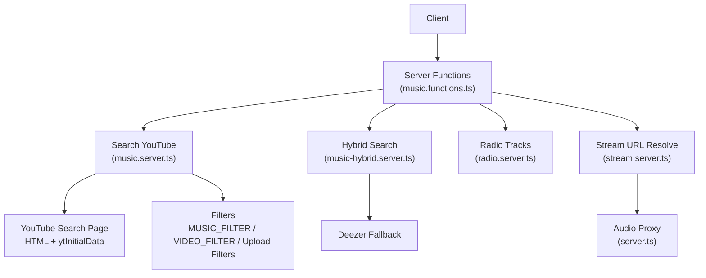
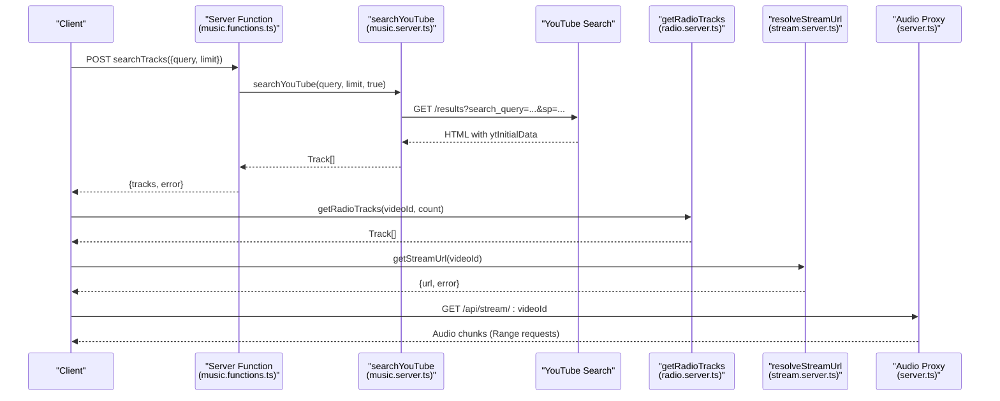
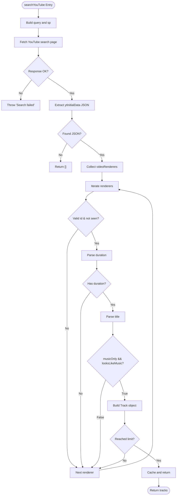
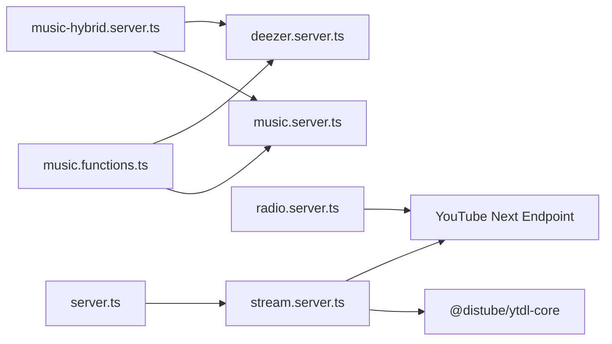

# YouTube Integration

<cite>
**Referenced Files in This Document**
- [music.server.ts](file://src/lib/music.server.ts)
- [music.functions.ts](file://src/lib/music.functions.ts)
- [music-hybrid.server.ts](file://src/lib/music-hybrid.server.ts)
- [radio.server.ts](file://src/lib/radio.server.ts)
- [stream.server.ts](file://src/lib/stream.server.ts)
- [server.ts](file://src/server.ts)
</cite>

## Table of Contents
1. [Introduction](#introduction)
2. [Project Structure](#project-structure)
3. [Core Components](#core-components)
4. [Architecture Overview](#architecture-overview)
5. [Detailed Component Analysis](#detailed-component-analysis)
6. [Dependency Analysis](#dependency-analysis)
7. [Performance Considerations](#performance-considerations)
8. [Troubleshooting Guide](#troubleshooting-guide)
9. [Conclusion](#conclusion)
10. [Appendices](#appendices)

## Introduction
This document explains the YouTube integration layer that scrapes search results without requiring API keys. It focuses on the searchYouTube function, music content filtering, video renderer extraction, and metadata parsing from YouTube’s HTML structure. It also covers the MUSIC_FILTER and VIDEO_FILTER constants, the looksLikeMusic filter, query construction, upload date filtering, result limiting, error handling for network failures, HTML parsing errors, and rate limiting scenarios, plus guidance for maintaining compatibility with YouTube’s changing HTML structure.

## Project Structure
The YouTube integration is implemented across several server-side modules:
- Search scraping and filtering: music.server.ts
- Server functions composing searches and mixes: music.functions.ts
- Hybrid fallback to Deezer when YouTube fails or returns few results: music-hybrid.server.ts
- Radio recommendations via YouTube’s built-in engine: radio.server.ts
- Stream URL resolution and proxying: stream.server.ts and server.ts

**Diagram sources**
- [music.functions.ts:8-21](file://src/lib/music.functions.ts#L8-L21)
- [music.server.ts:183-247](file://src/lib/music.server.ts#L183-L247)
- [music-hybrid.server.ts:22-49](file://src/lib/music-hybrid.server.ts#L22-L49)
- [radio.server.ts:25-94](file://src/lib/radio.server.ts#L25-L94)
- [stream.server.ts:301-344](file://src/lib/stream.server.ts#L301-L344)
- [server.ts:48-164](file://src/server.ts#L48-L164)

**Section sources**
- [music.server.ts:1-248](file://src/lib/music.server.ts#L1-L248)
- [music.functions.ts:1-627](file://src/lib/music.functions.ts#L1-L627)
- [music-hybrid.server.ts:1-98](file://src/lib/music-hybrid.server.ts#L1-L98)
- [radio.server.ts:1-95](file://src/lib/radio.server.ts#L1-L95)
- [stream.server.ts:1-388](file://src/lib/stream.server.ts#L1-L388)
- [server.ts:48-164](file://src/server.ts#L48-L164)

## Core Components
- searchYouTube(query, limit, musicOnly, upload): Scrapes YouTube search results using a browser-like request, extracts embedded JSON (ytInitialData), collects video renderers, parses metadata, applies music filters, and returns up to limit tracks. Results are cached for 5 minutes.
- looksLikeMusic(title, seconds): Filters out non-music content by excluding known non-music keywords and compilation phrases, and enforcing typical song duration bounds.
- collectVideoRenderers(node, out): Recursively traverses parsed data to find all videoRenderer entries.
- text(node): Extracts display text from YouTube’s structured text nodes (simpleText or runs).
- Suggest queries: suggestQueries fetches autocomplete suggestions from YouTube’s suggest service.
- getRadioTracks(videoId, limit): Uses YouTube’s “RD” playlist endpoint to build a radio list around a seed video.
- resolveStreamUrl(videoId): Resolves direct audio URLs via ytdl-core with manual player API fallback, caching and circuit breaking.

**Section sources**
- [music.server.ts:17-38](file://src/lib/music.server.ts#L17-L38)
- [music.server.ts:40-50](file://src/lib/music.server.ts#L40-L50)
- [music.server.ts:77-162](file://src/lib/music.server.ts#L77-L162)
- [music.server.ts:164-180](file://src/lib/music.server.ts#L164-L180)
- [music.server.ts:183-247](file://src/lib/music.server.ts#L183-L247)
- [radio.server.ts:25-94](file://src/lib/radio.server.ts#L25-L94)
- [stream.server.ts:301-344](file://src/lib/stream.server.ts#L301-L344)

## Architecture Overview
The system composes multiple strategies to deliver music results and playback:
- Search: Primary path uses YouTube search scraping; optional upload-date filters narrow results to recent content. Music-only mode adds “audio” to the query and applies MUSIC_FILTER; otherwise VIDEO_FILTER is used.
- Filtering: After extracting video renderers, each candidate is validated by looksLikeMusic to ensure it resembles a single track rather than a vlog, podcast, or long compilation.
- Recommendations: Radio tracks are fetched via YouTube’s RD playlist endpoint.
- Playback: Stream URLs are resolved with ytdl-core and a manual player API fallback, then proxied through a same-origin endpoint to handle CORS and throttling.

**Diagram sources**
- [music.functions.ts:8-21](file://src/lib/music.functions.ts#L8-L21)
- [music.server.ts:183-247](file://src/lib/music.server.ts#L183-L247)
- [radio.server.ts:25-94](file://src/lib/radio.server.ts#L25-L94)
- [stream.server.ts:301-344](file://src/lib/stream.server.ts#L301-L344)
- [server.ts:48-164](file://src/server.ts#L48-L164)

## Detailed Component Analysis

### searchYouTube Implementation
- Query construction: When musicOnly is true, “audio” is appended to the query to prioritize audio-only content. The sp parameter selects either MUSIC_FILTER or VIDEO_FILTER unless an upload range is specified.
- Network request: Uses fetch with a realistic User-Agent and Accept-Language headers. Non-OK responses throw an error indicating search failure.
- HTML parsing: Extracts the inline JSON object assigned to ytInitialData using a regular expression. If not found, returns an empty array. Parses JSON safely; parse errors return an empty array.
- Renderer collection: Recursively gathers all videoRenderer objects from the parsed data.
- Metadata parsing: For each renderer, extracts id, title, artist (ownerText or longBylineText), duration (lengthText), and thumbnail (last thumbnail url or default image). Skips entries without duration (live streams/shorts).
- Music filtering: Applies looksLikeMusic when musicOnly is enabled.
- Limiting and deduplication: Stops after reaching the requested limit and avoids duplicates via a Set keyed by videoId.
- Caching: Results are cached for 5 minutes with a simple LRU-style cache bounded by size.

**Diagram sources**
- [music.server.ts:183-247](file://src/lib/music.server.ts#L183-L247)

**Section sources**
- [music.server.ts:183-247](file://src/lib/music.server.ts#L183-L247)

### MUSIC_FILTER and VIDEO_FILTER
- MUSIC_FILTER: Selects YouTube’s “Music” category filter to keep results focused on songs rather than general videos.
- VIDEO_FILTER: Default video filter when musicOnly is false.
- UPLOAD_FILTERS: Provides “today” and “week” upload date filters to narrow results to recently published content.

These constants are passed as the sp parameter in the search URL to influence YouTube’s result set.

**Section sources**
- [music.server.ts:40-50](file://src/lib/music.server.ts#L40-L50)

### looksLikeMusic Filtering
- Excludes titles containing known non-music terms (e.g., interview, podcast, reaction, review, vlog, trailer, tutorial, gameplay, news, shorts, speech, documentary, lyric video, official video, live performance, concert, etc.).
- Excludes compilation-type titles (jukebox, compilation, non-stop, mashup, best of, greatest hits, top hits, full album, etc.).
- Enforces typical song duration bounds: durations under 45 seconds are rejected.

This ensures that only plausible single-track results pass into the final list when musicOnly is enabled.

**Section sources**
- [music.server.ts:77-162](file://src/lib/music.server.ts#L77-L162)

### Video Renderer Extraction and Metadata Parsing
- collectVideoRenderers recursively walks the parsed data structure to find all videoRenderer entries.
- text helper extracts display strings from YouTube’s structured text nodes (simpleText or runs).
- Metadata fields extracted include:
  - id: videoId
  - title: from title node
  - artist: ownerText or longBylineText
  - duration: lengthText
  - thumbnail: last thumbnail url or default image URL

**Section sources**
- [music.server.ts:17-38](file://src/lib/music.server.ts#L17-L38)
- [music.server.ts:217-241](file://src/lib/music.server.ts#L217-L241)

### Example Usage Patterns
- Basic search: Call searchYouTube with a query string and desired limit.
- Music-only search: Pass musicOnly=true to append “audio” and apply MUSIC_FILTER plus looksLikeMusic.
- Upload date filtering: Pass upload="week" or "today" to restrict to recent uploads.
- Mixed usage: Combine query terms like “artist new song year” to target fresh releases.

Examples are constructed throughout the server functions:
- General search and suggestion endpoints
- New release mix building per artist
- Language-focused new songs
- Podcast picks with musicOnly=false

**Section sources**
- [music.functions.ts:8-21](file://src/lib/music.functions.ts#L8-L21)
- [music.functions.ts:156-181](file://src/lib/music.functions.ts#L156-L181)
- [music.functions.ts:398-458](file://src/lib/music.functions.ts#L398-L458)
- [music.functions.ts:491-559](file://src/lib/music.functions.ts#L491-L559)

### Error Handling
- Network failures:
  - searchYouTube throws an error if the response is not OK.
  - Suggest queries and other fetch calls catch exceptions and return safe defaults (empty arrays).
- HTML parsing errors:
  - If ytInitialData cannot be found or JSON parsing fails, searchYouTube returns an empty array instead of crashing.
- Rate limiting and throttling:
  - Stream resolver includes a circuit breaker that backs off after consecutive failures to avoid hammering YouTube.
  - The audio proxy handles throttled URLs by chunking requests and invalidating stale URLs upon 403 responses.
- Graceful degradation:
  - Hybrid search falls back to Deezer if YouTube returns too few results or fails entirely.
  - Radio and stream functions return empty arrays or nulls on failure rather than propagating unhandled errors.

**Section sources**
- [music.server.ts:197-215](file://src/lib/music.server.ts#L197-L215)
- [music.functions.ts:14-21](file://src/lib/music.functions.ts#L14-L21)
- [music-hybrid.server.ts:22-49](file://src/lib/music-hybrid.server.ts#L22-L49)
- [stream.server.ts:65-90](file://src/lib/stream.server.ts#L65-L90)
- [server.ts:60-88](file://src/server.ts#L60-L88)

### Maintaining Compatibility with YouTube’s HTML Structure
- Robust traversal: collectVideoRenderers walks arbitrary nested structures to locate videoRenderer entries, reducing brittleness against layout changes.
- Defensive parsing: text helper supports both simpleText and runs formats; missing fields gracefully fall back to defaults.
- Regex extraction: ytInitialData is extracted via a regex; if the pattern no longer matches, the function returns an empty array, preventing crashes.
- Multiple client strategies: Stream resolution tries multiple player clients and falls back to manual API calls to adapt to changes in streaming endpoints.
- Monitoring and logging: Warnings and errors are logged to aid detection of structural changes and rate-limiting events.

**Section sources**
- [music.server.ts:17-38](file://src/lib/music.server.ts#L17-L38)
- [music.server.ts:206-215](file://src/lib/music.server.ts#L206-L215)
- [stream.server.ts:116-174](file://src/lib/stream.server.ts#L116-L174)
- [stream.server.ts:215-289](file://src/lib/stream.server.ts#L215-L289)

## Dependency Analysis
- music.functions.ts depends on music.server.ts for search and suggestions, and optionally on deezer.server.ts for hybrid fallback.
- music-hybrid.server.ts orchestrates YouTube primary and Deezer fallback.
- radio.server.ts depends on YouTube’s internal next endpoint to build radio lists.
- stream.server.ts depends on ytdl-core and implements manual player API fallback; server.ts provides the streaming proxy.

**Diagram sources**
- [music.functions.ts:8-21](file://src/lib/music.functions.ts#L8-L21)
- [music-hybrid.server.ts:22-49](file://src/lib/music-hybrid.server.ts#L22-L49)
- [radio.server.ts:25-94](file://src/lib/radio.server.ts#L25-L94)
- [stream.server.ts:20-21](file://src/lib/stream.server.ts#L20-L21)
- [stream.server.ts:215-289](file://src/lib/stream.server.ts#L215-L289)
- [server.ts:48-164](file://src/server.ts#L48-L164)

**Section sources**
- [music.functions.ts:1-627](file://src/lib/music.functions.ts#L1-L627)
- [music-hybrid.server.ts:1-98](file://src/lib/music-hybrid.server.ts#L1-L98)
- [radio.server.ts:1-95](file://src/lib/radio.server.ts#L1-L95)
- [stream.server.ts:1-388](file://src/lib/stream.server.ts#L1-L388)
- [server.ts:48-164](file://src/server.ts#L48-L164)

## Performance Considerations
- Search caching: 5-minute TTL with LRU eviction reduces repeated scraping and network load.
- Result limiting: Limits returned tracks to reduce payload size and processing time.
- Deduplication: Prevents duplicate tracks in results.
- Stream caching: Stream URLs are cached for 25 minutes to avoid repeated resolution.
- Circuit breaker: Prevents cascading failures during rate limiting or outages.
- Chunked proxy: Breaks large streams into manageable chunks to work around throttling and improve reliability.

[No sources needed since this section provides general guidance]

## Troubleshooting Guide
- Search returns empty:
  - Check if ytInitialData extraction succeeds; if the HTML structure changed, the regex may fail.
  - Verify network connectivity and HTTP status codes; non-OK responses throw errors.
- Too many non-music results:
  - Ensure musicOnly is true so looksLikeMusic and MUSIC_FILTER are applied.
  - Review NON_MUSIC and COMPILATION keyword lists to refine filtering.
- Playback issues:
  - Inspect stream resolution logs; verify ytdl-core success and manual API fallback.
  - Use the proxy to handle CORS and throttling; check for 403 responses indicating expired URLs.
- Rate limiting:
  - Observe circuit breaker cooldowns; wait before retrying.
  - Reduce concurrent requests or increase intervals between searches.

**Section sources**
- [music.server.ts:197-215](file://src/lib/music.server.ts#L197-L215)
- [music.server.ts:77-162](file://src/lib/music.server.ts#L77-L162)
- [stream.server.ts:65-90](file://src/lib/stream.server.ts#L65-L90)
- [server.ts:60-88](file://src/server.ts#L60-L88)

## Conclusion
The YouTube integration layer provides a robust, keyless search and recommendation pipeline by scraping YouTube’s public pages, parsing embedded JSON, and applying targeted music filters. It balances accuracy with resilience through caching, graceful error handling, and fallback strategies. Ongoing maintenance should focus on monitoring HTML structure changes, updating filters as needed, and ensuring stream resolution remains compatible with evolving YouTube endpoints.

[No sources needed since this section summarizes without analyzing specific files]

## Appendices

### Key Constants and Their Roles
- MUSIC_FILTER: Narrows search to YouTube’s “Music” category.
- VIDEO_FILTER: Default video filter when musicOnly is false.
- UPLOAD_FILTERS: Restricts results to today or this week.
- NON_MUSIC and COMPILATION: Keyword lists used by looksLikeMusic to exclude non-track content.

**Section sources**
- [music.server.ts:40-50](file://src/lib/music.server.ts#L40-L50)
- [music.server.ts:77-162](file://src/lib/music.server.ts#L77-L162)

### Common Query Construction Patterns
- Basic: searchYouTube("artist title", limit)
- Music-only: searchYouTube("artist title", limit, true)
- Recent uploads: searchYouTube("artist new song year", limit, true, "week")
- Language-focused: searchYouTube("new hindi songs", limit, true, "week")

**Section sources**
- [music.functions.ts:156-181](file://src/lib/music.functions.ts#L156-L181)
- [music.functions.ts:398-458](file://src/lib/music.functions.ts#L398-L458)