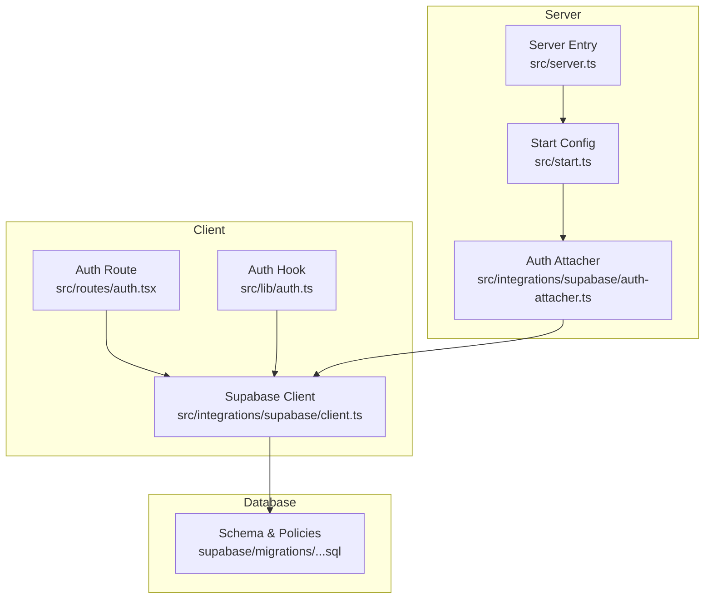
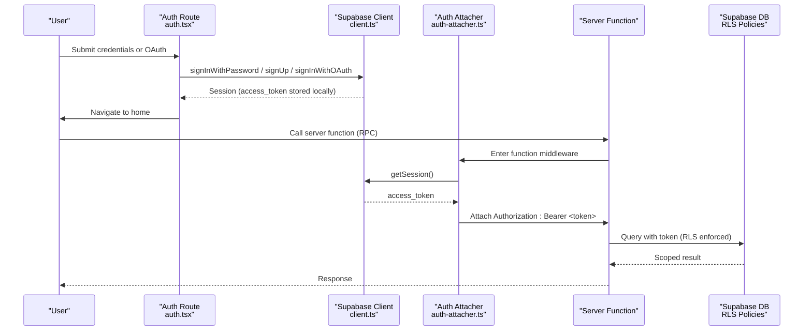
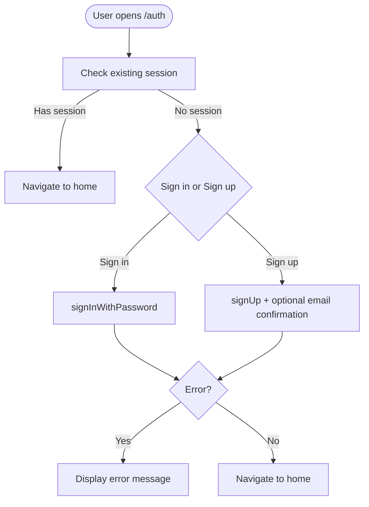
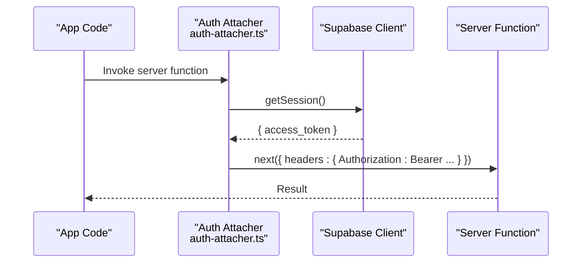
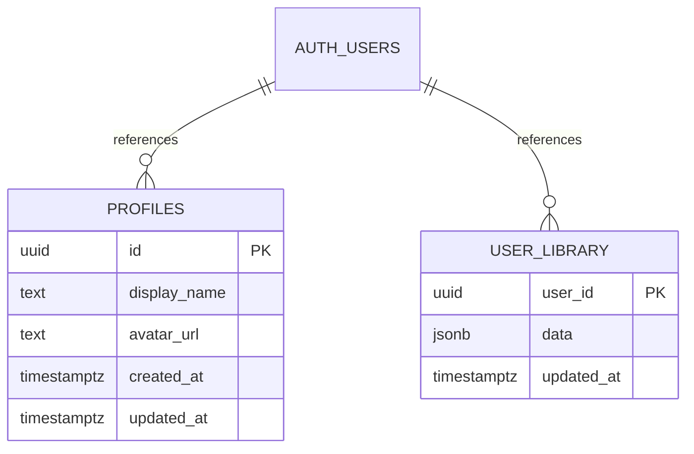
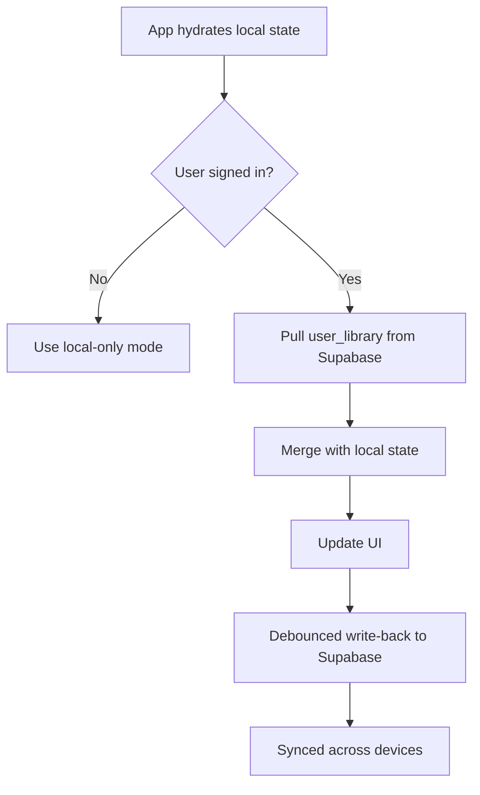
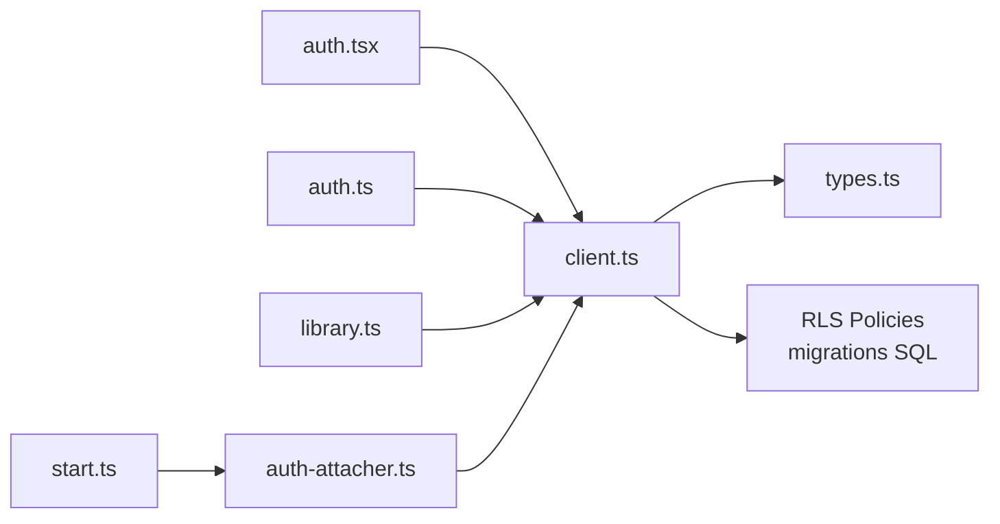

# Supabase Authentication

<cite>
**Referenced Files in This Document**
- [auth-attacher.ts](file://src/integrations/supabase/auth-attacher.ts)
- [client.ts](file://src/integrations/supabase/client.ts)
- [types.ts](file://src/integrations/supabase/types.ts)
- [auth.ts](file://src/lib/auth.ts)
- [auth.tsx](file://src/routes/auth.tsx)
- [start.ts](file://src/start.ts)
- [server.ts](file://src/server.ts)
- [library.ts](file://src/lib/library.ts)
- [20260808085443_8253f78c-652e-4cb4-8772-8818ce90215c.sql](file://supabase/migrations/20260808085443_8253f78c-652e-4cb4-8772-8818ce90215c.sql)
</cite>

## Table of Contents
1. Introduction
2. Project Structure
3. Core Components
4. Architecture Overview
5. Detailed Component Analysis
6. Dependency Analysis
7. Performance Considerations
8. Troubleshooting Guide
9. Conclusion
10. Appendices

## Introduction
This document explains how the application integrates Supabase for authentication, session management, permission handling, and data synchronization. It covers:
- The end-to-end login flow to session establishment, including token persistence and automatic refresh
- The auth attacher middleware that injects the bearer token into server function calls
- Type-safe database access using generated Supabase types
- Security considerations for client-side authentication and server-side validation
- Examples of protected routes, user-scoped queries, and real-time subscription patterns

## Project Structure
The Supabase integration is centered around a small set of files:
- Client initialization and environment configuration
- Auth state hook for UI
- Auth route for sign-in/sign-up and OAuth
- Middleware that attaches tokens to server function RPCs
- Database schema with Row Level Security policies
- Library sync logic that persists user data to Supabase

**Diagram sources**
- [auth.tsx:1-197](file://src/routes/auth.tsx#L1-L197)
- [auth.ts:1-70](file://src/lib/auth.ts#L1-L70)
- [client.ts:1-69](file://src/integrations/supabase/client.ts#L1-L69)
- [start.ts:1-32](file://src/start.ts#L1-L32)
- [auth-attacher.ts:1-16](file://src/integrations/supabase/auth-attacher.ts#L1-L16)
- [server.ts:1-199](file://src/server.ts#L1-L199)
- [20260808085443_8253f78c-652e-4cb4-8772-8818ce90215c.sql:1-63](file://supabase/migrations/20260808085443_8253f78c-652e-4cb4-8772-8818ce90215c.sql#L1-L63)

**Section sources**
- [auth.tsx:1-197](file://src/routes/auth.tsx#L1-L197)
- [auth.ts:1-70](file://src/lib/auth.ts#L1-L70)
- [client.ts:1-69](file://src/integrations/supabase/client.ts#L1-L69)
- [start.ts:1-32](file://src/start.ts#L1-L32)
- [auth-attacher.ts:1-16](file://src/integrations/supabase/auth-attacher.ts#L1-L16)
- [server.ts:1-199](file://src/server.ts#L1-L199)
- [20260808085443_8253f78c-652e-4cb4-8772-8818ce90215c.sql:1-63](file://supabase/migrations/20260808085443_8253f78c-652e-4cb4-8772-8818ce90215c.sql#L1-L63)

## Core Components
- Supabase client: Initializes the SDK with environment variables, configures persistent sessions, auto-refresh tokens, and a custom fetch wrapper that sets apikey headers and avoids misusing API keys as bearer tokens.
- Auth hook: Subscribes to auth state changes, loads current session, and fetches the user profile from the profiles table when signed in.
- Auth route: Provides email/password sign-in and sign-up flows, plus Google OAuth. Redirects authenticated users away from the page.
- Auth attacher middleware: Extracts the current session’s access token and attaches it as an Authorization header for server function RPCs.
- Start configuration: Registers the auth attacher as a function middleware so all server functions run with the correct context.
- Database schema: Defines profiles and user_library tables with Row Level Security policies ensuring users can only access their own data.

**Section sources**
- [client.ts:1-69](file://src/integrations/supabase/client.ts#L1-L69)
- [auth.ts:1-70](file://src/lib/auth.ts#L1-L70)
- [auth.tsx:1-197](file://src/routes/auth.tsx#L1-L197)
- [auth-attacher.ts:1-16](file://src/integrations/supabase/auth-attacher.ts#L1-L16)
- [start.ts:1-32](file://src/start.ts#L1-L32)
- [20260808085443_8253f78c-652e-4cb4-8772-8818ce90215c.sql:1-63](file://supabase/migrations/20260808085443_8253f78c-652e-4cb4-8772-8818ce90215c.sql#L1-L63)

## Architecture Overview
The authentication architecture combines client-side session management with server-side token propagation via middleware.

**Diagram sources**
- [auth.tsx:46-93](file://src/routes/auth.tsx#L46-L93)
- [client.ts:46-55](file://src/integrations/supabase/client.ts#L46-L55)
- [auth-attacher.ts:7-15](file://src/integrations/supabase/auth-attacher.ts#L7-L15)
- [start.ts:28-31](file://src/start.ts#L28-L31)
- [20260808085443_8253f78c-652e-4cb4-8772-8818ce90215c.sql:13-32](file://supabase/migrations/20260808085443_8253f78c-652e-4cb4-8772-8818ce90215c.sql#L13-L32)

## Detailed Component Analysis

### Authentication Flow: Login to Session Establishment
- Sign-in/sign-up: The auth route handles email/password flows and redirects to the app root on success. For new accounts without immediate session, it instructs the user to confirm email.
- OAuth: Google sign-in redirects to the configured origin and returns to the app after successful authentication.
- Session persistence: The Supabase client stores sessions in localStorage and automatically refreshes tokens when needed.

**Diagram sources**
- [auth.tsx:40-81](file://src/routes/auth.tsx#L40-L81)
- [client.ts:46-55](file://src/integrations/supabase/client.ts#L46-L55)

**Section sources**
- [auth.tsx:40-93](file://src/routes/auth.tsx#L40-L93)
- [client.ts:46-55](file://src/integrations/supabase/client.ts#L46-L55)

### Token Management and Automatic Refresh
- Local storage: Sessions are persisted across reloads.
- Auto-refresh: Tokens are refreshed automatically by the client when they expire.
- Custom fetch wrapper: Ensures the apikey header is set and prevents misuse of API keys as bearer tokens.

**Section sources**
- [client.ts:9-27](file://src/integrations/supabase/client.ts#L9-L27)
- [client.ts:46-55](file://src/integrations/supabase/client.ts#L46-L55)

### Auth Attacher Middleware: Request Authentication and Context Propagation
- Purpose: Injects the current session’s access token into server function RPC requests by setting the Authorization header.
- Registration: Must be registered as a function middleware in the start configuration; otherwise, server functions will not receive the token.
- Behavior: If no session exists, requests proceed without Authorization, and server-side operations rely on RLS to deny unauthorized access.

**Diagram sources**
- [auth-attacher.ts:7-15](file://src/integrations/supabase/auth-attacher.ts#L7-L15)
- [start.ts:28-31](file://src/start.ts#L28-L31)

**Section sources**
- [auth-attacher.ts:1-16](file://src/integrations/supabase/auth-attacher.ts#L1-L16)
- [start.ts:1-32](file://src/start.ts#L1-L32)

### Type-Safe Database Access Patterns
- Generated types: The types file defines the database schema, including tables and row/insert/update shapes, enabling type-checked queries.
- Profiles: Stores display name and avatar URL per user.
- User library: Stores JSONB payload containing likes, dislikes, history, playlists, settings, and stats for cross-device sync.

**Diagram sources**
- [types.ts:9-73](file://src/integrations/supabase/types.ts#L9-L73)
- [20260808085443_8253f78c-652e-4cb4-8772-8818ce90215c.sql:1-33](file://supabase/migrations/20260808085443_8253f78c-652e-4cb4-8772-8818ce90215c.sql#L1-L33)

**Section sources**
- [types.ts:9-73](file://src/integrations/supabase/types.ts#L9-L73)
- [20260808085443_8253f78c-652e-4cb4-8772-8818ce90215c.sql:1-33](file://supabase/migrations/20260808085443_8253f78c-652e-4cb4-8772-8818ce90215c.sql#L1-L33)

### Permission Handling via Row Level Security
- Profiles: Signed-in users can read any profile; insert/update restricted to the owner.
- User library: Users can manage only their own row.
- Service role: Grants full control for server-side operations where necessary.

**Section sources**
- [20260808085443_8253f78c-652e-4cb4-8772-8818ce90215c.sql:9-32](file://supabase/migrations/20260808085443_8253f78c-652e-4cb4-8772-8818ce90215c.sql#L9-L32)

### Data Synchronization Patterns
- Local-first: The app maintains local state for likes, dislikes, history, playlists, settings, and stats.
- On sign-in: Pulls account copy from Supabase and merges with local data.
- Debounced push: Changes are written back to Supabase with a delay to avoid excessive writes.
- Profile updates: When the user updates their profile, the hook performs an upsert and refreshes local state.

**Diagram sources**
- [library.ts:242-349](file://src/lib/library.ts#L242-L349)
- [auth.ts:32-66](file://src/lib/auth.ts#L32-L66)

**Section sources**
- [library.ts:242-349](file://src/lib/library.ts#L242-L349)
- [auth.ts:32-66](file://src/lib/auth.ts#L32-L66)

### Protected Routes and Server Functions
- Function middleware: All server functions automatically receive the Authorization header when called from the browser, enabling RLS enforcement.
- CSRF protection: CSRF middleware is enabled for server functions to prevent cross-site request forgery.

**Section sources**
- [start.ts:21-31](file://src/start.ts#L21-L31)
- [auth-attacher.ts:5-15](file://src/integrations/supabase/auth-attacher.ts#L5-L15)

### Real-Time Subscription Patterns
- Capability: The Supabase client includes realtime capabilities via Phoenix channels. While this project primarily uses pull-based sync for user_library, you can subscribe to changes using Supabase’s realtime features if needed.
- Typical pattern: Subscribe to a channel on a table, handle events to update local state, and unsubscribe on cleanup.

[No sources needed since this section provides general guidance]

## Dependency Analysis
- Client depends on environment variables for URL and publishable key; missing values cause startup errors.
- Auth route depends on Supabase auth methods and navigation.
- Auth hook depends on Supabase auth state and profiles table.
- Library sync depends on user_library table and merges local/cloud state.
- Start configuration wires the auth attacher into server functions.

**Diagram sources**
- [auth.tsx:1-197](file://src/routes/auth.tsx#L1-L197)
- [auth.ts:1-70](file://src/lib/auth.ts#L1-L70)
- [library.ts:242-349](file://src/lib/library.ts#L242-L349)
- [start.ts:1-32](file://src/start.ts#L1-L32)
- [auth-attacher.ts:1-16](file://src/integrations/supabase/auth-attacher.ts#L1-L16)
- [client.ts:1-69](file://src/integrations/supabase/client.ts#L1-L69)
- [types.ts:1-197](file://src/integrations/supabase/types.ts#L1-L197)
- [20260808085443_8253f78c-652e-4cb4-8772-8818ce90215c.sql:1-63](file://supabase/migrations/20260808085443_8253f78c-652e-4cb4-8772-8818ce90215c.sql#L1-L63)

**Section sources**
- [client.ts:30-55](file://src/integrations/supabase/client.ts#L30-L55)
- [auth.tsx:40-93](file://src/routes/auth.tsx#L40-L93)
- [auth.ts:18-66](file://src/lib/auth.ts#L18-L66)
- [library.ts:262-349](file://src/lib/library.ts#L262-L349)
- [start.ts:21-31](file://src/start.ts#L21-L31)

## Performance Considerations
- Debounced writes: Library changes are batched to reduce network overhead.
- Local-first state: Immediate UI responsiveness while syncing in background.
- Token refresh: Automatic token refresh avoids repeated login prompts.
- Streaming proxy: Server-side streaming uses chunked transfers to handle large audio streams efficiently.

[No sources needed since this section provides general guidance]

## Troubleshooting Guide
- Missing environment variables: The client throws an error if SUPABASE_URL or SUPABASE_PUBLISHABLE_KEY are not set. Ensure these are configured in your environment.
- No Authorization header on server functions: Verify that the auth attacher is registered as a function middleware in the start configuration.
- RLS denies access: Confirm that the user is signed in and that policies allow the requested operation.
- OAuth redirect issues: Ensure the redirect URI matches your app’s origin.

**Section sources**
- [client.ts:30-44](file://src/integrations/supabase/client.ts#L30-L44)
- [start.ts:21-31](file://src/start.ts#L21-L31)
- [20260808085443_8253f78c-652e-4cb4-8772-8818ce90215c.sql:13-32](file://supabase/migrations/20260808085443_8253f78c-652e-4cb4-8772-8818ce90215c.sql#L13-L32)

## Conclusion
This integration leverages Supabase’s client-side session management, automatic token refresh, and server-side token propagation through middleware to enforce secure, user-scoped access via Row Level Security. The local-first library sync ensures responsive UX while keeping data consistent across devices. By following the patterns outlined here, you can build protected routes, perform user-specific queries, and implement real-time subscriptions safely and efficiently.

## Appendices

### Example: Protected Route Using Server Function
- Pattern: Call a server function from the client; the auth attacher attaches the bearer token automatically.
- Outcome: Supabase enforces RLS based on the authenticated user.

**Section sources**
- [auth-attacher.ts:7-15](file://src/integrations/supabase/auth-attacher.ts#L7-L15)
- [start.ts:28-31](file://src/start.ts#L28-L31)

### Example: User-Specific Data Query
- Pattern: Use the Supabase client to query user_library filtered by user_id; RLS ensures the user can only access their own row.
- Outcome: Type-safe queries with generated types.

**Section sources**
- [library.ts:268-273](file://src/lib/library.ts#L268-L273)
- [types.ts:41-58](file://src/integrations/supabase/types.ts#L41-L58)
- [20260808085443_8253f78c-652e-4cb4-8772-8818ce90215c.sql:20-32](file://supabase/migrations/20260808085443_8253f78c-652e-4cb4-8772-8818ce90215c.sql#L20-L32)

### Example: Real-Time Subscription Pattern
- Pattern: Subscribe to a Supabase channel for a table, handle INSERT/UPDATE/DELETE events, and update local state accordingly. Unsubscribe on component cleanup.
- Note: This project currently uses pull-based sync for user_library; realtime can be added as needed.

[No sources needed since this section provides general guidance]