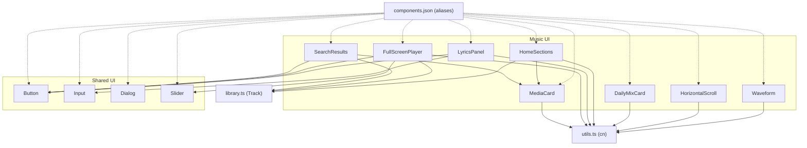
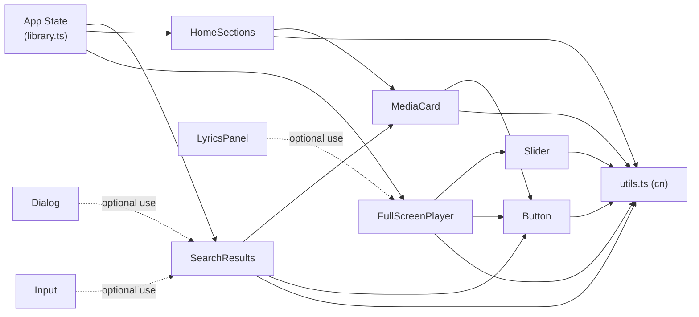
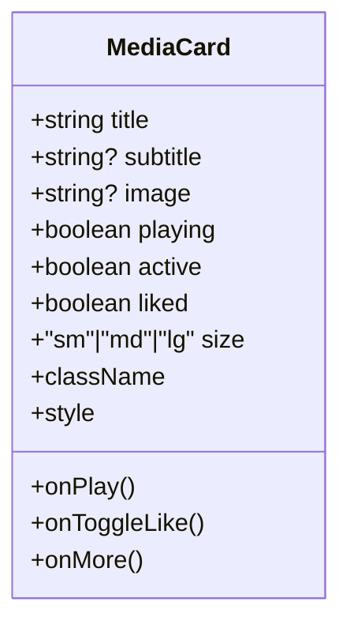
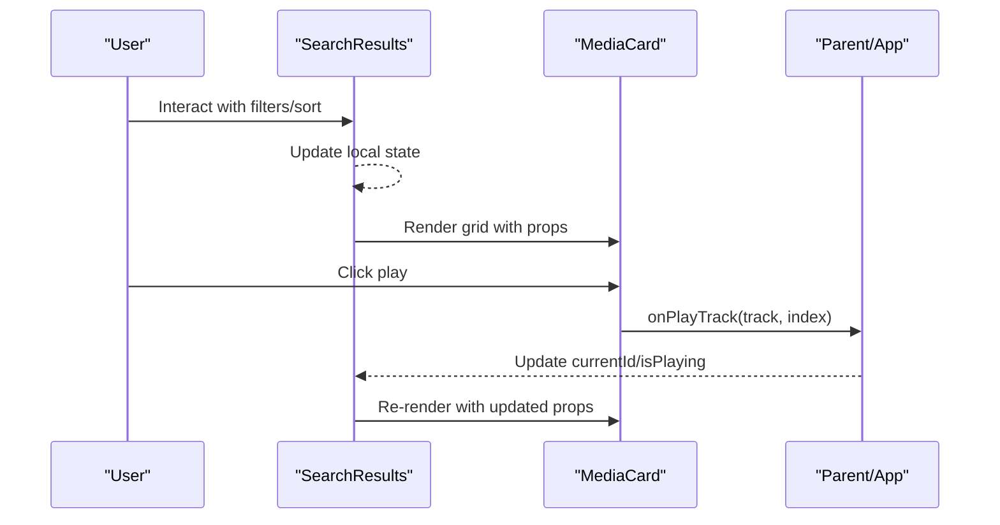
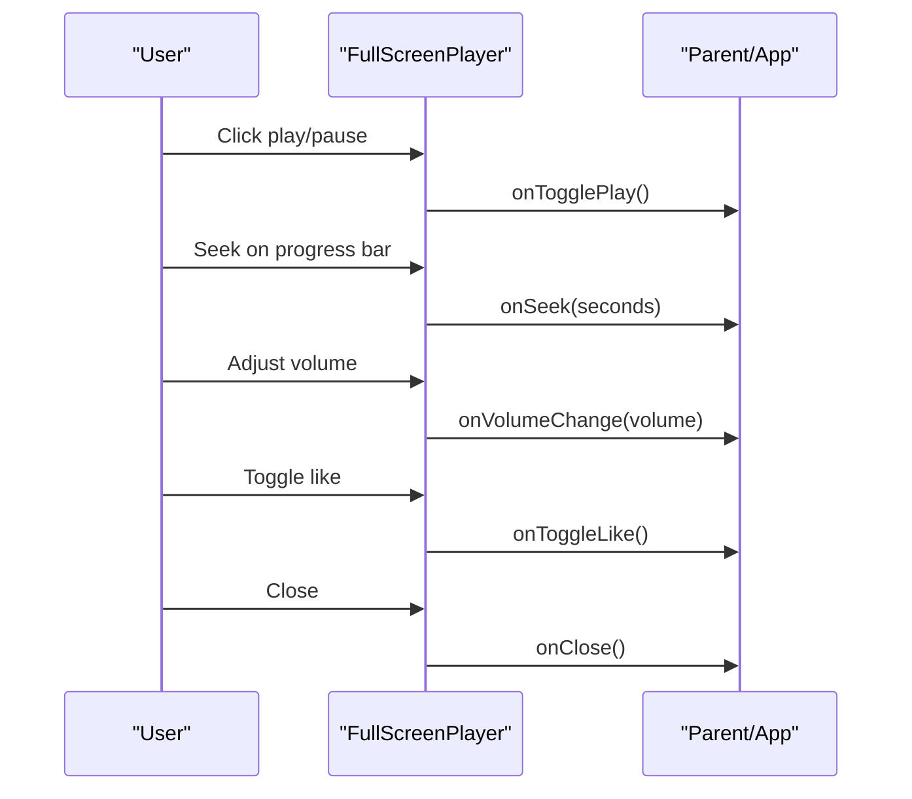
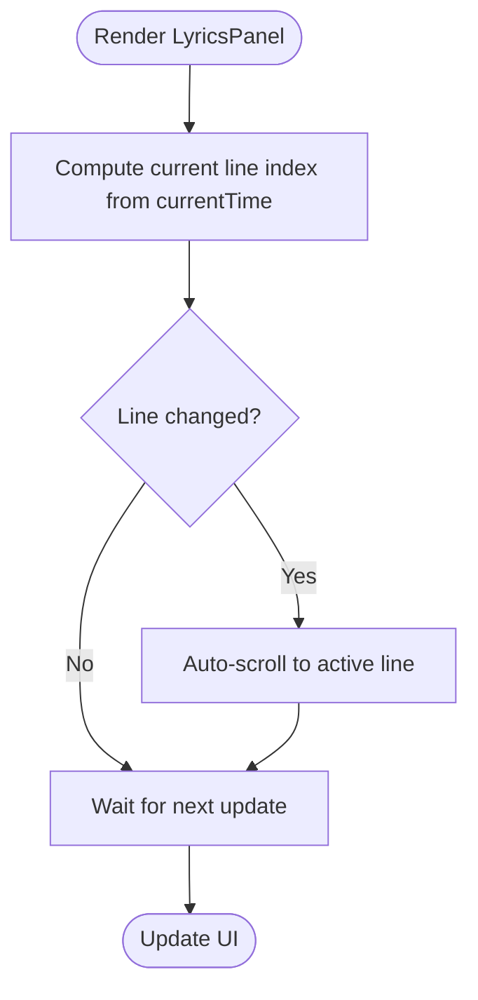
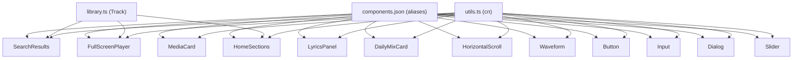

# Component Library

<cite>
**Referenced Files in This Document**
- [MediaCard.tsx](file://src/components/music/ui/MediaCard.tsx)
- [SearchResults.tsx](file://src/components/music/ui/SearchResults.tsx)
- [FullScreenPlayer.tsx](file://src/components/music/ui/FullScreenPlayer.tsx)
- [DailyMixCard.tsx](file://src/components/music/ui/DailyMixCard.tsx)
- [HorizontalScroll.tsx](file://src/components/music/ui/HorizontalScroll.tsx)
- [LyricsPanel.tsx](file://src/components/music/ui/LyricsPanel.tsx)
- [HomeSections.tsx](file://src/components/music/ui/HomeSections.tsx)
- [Waveform.tsx](file://src/components/music/ui/Waveform.tsx)
- [button.tsx](file://src/components/ui/button.tsx)
- [input.tsx](file://src/components/ui/input.tsx)
- [dialog.tsx](file://src/components/ui/dialog.tsx)
- [slider.tsx](file://src/components/ui/slider.tsx)
- [utils.ts](file://src/lib/utils.ts)
- [library.ts](file://src/lib/library.ts)
- [components.json](file://components.json)
</cite>

## Table of Contents
1. Introduction
2. Project Structure
3. Core Components
4. Architecture Overview
5. Detailed Component Analysis
6. Dependency Analysis
7. Performance Considerations
8. Troubleshooting Guide
9. Conclusion
10. Appendices

## Introduction
This document describes the reusable component library powering the YouTube Music Companion application. It covers music-specific components (MediaCard, SearchResults, FullScreenPlayer, DailyMixCard, LyricsPanel, HomeSections, HorizontalScroll, Waveform) and shared UI primitives (Button, Input, Dialog, Slider). For each component, you will find visual behavior, props, events, customization options, composition patterns, styling with Tailwind CSS, accessibility notes, responsive design guidance, performance considerations, and integration patterns with other components and libraries.

## Project Structure
The component library is organized into two primary areas:
- Music-specific components under src/components/music/ui for media-centric features like cards, search results, full-screen player, lyrics panel, and home sections.
- Shared UI primitives under src/components/ui for foundational building blocks such as Button, Input, Dialog, and Slider.

Utility functions and types are centralized:
- src/lib/utils.ts provides a class name merger used across components.
- src/lib/library.ts defines core data models (e.g., Track) consumed by components.
- components.json configures Shadcn-style aliases and tooling for consistent imports.

**Diagram sources**
- [MediaCard.tsx:1-129](file://src/components/music/ui/MediaCard.tsx#L1-L129)
- [SearchResults.tsx:1-249](file://src/components/music/ui/SearchResults.tsx#L1-L249)
- [FullScreenPlayer.tsx:1-231](file://src/components/music/ui/FullScreenPlayer.tsx#L1-L231)
- [DailyMixCard.tsx:1-97](file://src/components/music/ui/DailyMixCard.tsx#L1-L97)
- [LyricsPanel.tsx:1-172](file://src/components/music/ui/LyricsPanel.tsx#L1-L172)
- [HomeSections.tsx:1-112](file://src/components/music/ui/HomeSections.tsx#L1-L112)
- [HorizontalScroll.tsx:1-70](file://src/components/music/ui/HorizontalScroll.tsx#L1-L70)
- [Waveform.tsx:1-44](file://src/components/music/ui/Waveform.tsx#L1-L44)
- [button.tsx:1-50](file://src/components/ui/button.tsx#L1-L50)
- [input.tsx:1-23](file://src/components/ui/input.tsx#L1-L23)
- [dialog.tsx:1-105](file://src/components/ui/dialog.tsx#L1-L105)
- [slider.tsx:1-24](file://src/components/ui/slider.tsx#L1-L24)
- [utils.ts:1-7](file://src/lib/utils.ts#L1-L7)
- [library.ts:1-636](file://src/lib/library.ts#L1-L636)
- [components.json:1-23](file://components.json#L1-L23)

**Section sources**
- [components.json:1-23](file://components.json#L1-L23)
- [utils.ts:1-7](file://src/lib/utils.ts#L1-L7)
- [library.ts:1-636](file://src/lib/library.ts#L1-L636)

## Core Components
This section summarizes the key components, their purpose, appearance, behavior, props, events, and customization options.

- MediaCard
  - Visual: Card with album art, title/subtitle, hover play button, optional like/more actions, and neon glow when active or playing.
  - Behavior: Lazy image loading with fallback; hover reveals play button; supports size variants; accessible labels for actions.
  - Props: title, subtitle, image, playing, active, liked, onPlay, onToggleLike, onMore, size ("sm" | "md" | "lg"), className, style.
  - Events: onPlay, onToggleLike, onMore.
  - Customization: Size variants, className/style overrides, conditional active/playing states.
  - Accessibility: aria-labels for like and more buttons; semantic button for play area.

- SearchResults
  - Visual: Header with query context, filter chips (All/Songs/Artists/Albums/Playlists), sort dropdown, top result highlight, grid of MediaCards, empty/loading states, recent/trending suggestions.
  - Behavior: Local filtering/sorting demo; renders MediaCards for tracks; integrates with app playback via callbacks.
  - Props: results (Track[]), loading, query, onPlayTrack(track, index), onToggleLike(track), likedIds (Set<string>), currentId?, isPlaying.
  - Events: onPlayTrack, onToggleLike.
  - Customization: Filter and sort options can be extended; layout adapts to screen sizes.

- FullScreenPlayer
  - Visual: Fullscreen overlay with blurred background from track thumbnail, large album art, controls (play/pause, skip, shuffle/repeat toggles), progress bar, volume slider, like button, queue/lyrics toggles.
  - Behavior: Controls playback state; updates progress; manages local visibility of lyrics/queue panels; uses formatTime utility.
  - Props: track (Track|null), isPlaying, liked, position, duration, volume, onTogglePlay, onToggleLike, onNext, onPrevious, onSeek(seconds), onVolumeChange(volume), onClose, canNext, canPrevious.
  - Events: All playback and UI control callbacks listed above.
  - Customization: Volume slider width; responsive layout; animations for ambient gradient and glow.

- DailyMixCard
  - Visual: Gradient card with icon, mix name, and floating play button; active state highlights border/glow.
  - Behavior: Selectable and playable; shows playing state with animated play/pause indicator.
  - Props: mix (from DAILY_MIXES), active?, playing?, onSelect(), onPlay().
  - Events: onSelect, onPlay.
  - Customization: Mix gradients and icons defined centrally; active/playing states drive visuals.

- HorizontalScroll
  - Visual: Scrollable row with optional title/subtitle and left/right arrow navigation that enables/disables based on scroll position.
  - Behavior: Smooth scrolling by fixed increments; updates arrow availability on scroll.
  - Props: children (ReactNode), className?, title?, subtitle?.
  - Events: None exposed; internal scroll handling.
  - Customization: Optional header; arrow visibility controlled by scroll bounds.

- LyricsPanel
  - Visual: Right-side slide-in panel with header (track info), search input, scrollable lyrics list, footer status.
  - Behavior: Syncs current line to currentTime; auto-scrolls to active line; filters lyrics by search text.
  - Props: trackId, trackTitle, trackArtist, currentTime, isPlaying, onClose().
  - Events: onClose.
  - Customization: Styling via className; search placeholder; active line highlighting.

- HomeSections
  - Visual: Sections for Recently played, Trending now, New releases, Recommended for you; each section renders a responsive grid of MediaCards.
  - Behavior: Renders only if data exists; passes playback state to MediaCards.
  - Props: recentlyPlayed, trending, newReleases, recommended (Track[]), onPlayTrack(track, index), onToggleLike(track), likedIds (Set<string>), currentId?, isPlaying.
  - Events: onPlayTrack, onToggleLike.
  - Customization: Section titles/icons configurable; showMore toggle per section.

- Waveform
  - Visual: Animated bars representing audio waveform; default or large variant; color gradient when active.
  - Behavior: Animates bars with staggered delays; static bars when inactive.
  - Props: active?, barCount?, className?, variant ("default" | "large").
  - Events: None.
  - Customization: Bar count, height presets per variant, animation timing via inline styles.

**Section sources**
- [MediaCard.tsx:1-129](file://src/components/music/ui/MediaCard.tsx#L1-L129)
- [SearchResults.tsx:1-249](file://src/components/music/ui/SearchResults.tsx#L1-L249)
- [FullScreenPlayer.tsx:1-231](file://src/components/music/ui/FullScreenPlayer.tsx#L1-L231)
- [DailyMixCard.tsx:1-97](file://src/components/music/ui/DailyMixCard.tsx#L1-L97)
- [HorizontalScroll.tsx:1-70](file://src/components/music/ui/HorizontalScroll.tsx#L1-L70)
- [LyricsPanel.tsx:1-172](file://src/components/music/ui/LyricsPanel.tsx#L1-L172)
- [HomeSections.tsx:1-112](file://src/components/music/ui/HomeSections.tsx#L1-L112)
- [Waveform.tsx:1-44](file://src/components/music/ui/Waveform.tsx#L1-L44)

## Architecture Overview
The component architecture emphasizes composition and separation of concerns:
- Shared UI primitives provide consistent interaction patterns and accessibility.
- Music-specific components compose primitives and utilities to deliver rich media experiences.
- Data models (Track) and utilities (cn) are centralized to ensure consistency and reduce duplication.

**Diagram sources**
- [library.ts:1-636](file://src/lib/library.ts#L1-L636)
- [SearchResults.tsx:1-249](file://src/components/music/ui/SearchResults.tsx#L1-L249)
- [HomeSections.tsx:1-112](file://src/components/music/ui/HomeSections.tsx#L1-L112)
- [FullScreenPlayer.tsx:1-231](file://src/components/music/ui/FullScreenPlayer.tsx#L1-L231)
- [MediaCard.tsx:1-129](file://src/components/music/ui/MediaCard.tsx#L1-L129)
- [slider.tsx:1-24](file://src/components/ui/slider.tsx#L1-L24)
- [button.tsx:1-50](file://src/components/ui/button.tsx#L1-L50)
- [dialog.tsx:1-105](file://src/components/ui/dialog.tsx#L1-L105)
- [input.tsx:1-23](file://src/components/ui/input.tsx#L1-L23)
- [utils.ts:1-7](file://src/lib/utils.ts#L1-L7)

## Detailed Component Analysis

### MediaCard
- Purpose: Reusable media item card for albums/playlists/tracks with hover play action and optional like/more actions.
- Appearance: Rounded card with image, gradient overlay, floating play/pause button, title/subtitle, and neon glow when active.
- Behavior: Lazy image load with fallback; hover reveals play button; supports size variants; accessible labels for actions.
- Props: title, subtitle, image, playing, active, liked, onPlay, onToggleLike, onMore, size ("sm" | "md" | "lg"), className, style.
- Events: onPlay, onToggleLike, onMore.
- Customization: Size variants, className/style overrides, conditional active/playing states.
- Accessibility: aria-labels for like and more buttons; semantic button for play area.
- Composition: Used by SearchResults and HomeSections to render grids of items.

**Diagram sources**
- [MediaCard.tsx:5-18](file://src/components/music/ui/MediaCard.tsx#L5-L18)

**Section sources**
- [MediaCard.tsx:1-129](file://src/components/music/ui/MediaCard.tsx#L1-L129)

### SearchResults
- Purpose: Displays filtered/sorted search results with a top result highlight and grid of MediaCards.
- Appearance: Header with query context, filter chips, sort dropdown, loading/empty states, and responsive grid.
- Behavior: Local filtering/sorting demo; renders MediaCards; integrates with app playback via callbacks.
- Props: results (Track[]), loading, query, onPlayTrack(track, index), onToggleLike(track), likedIds (Set<string>), currentId?, isPlaying.
- Events: onPlayTrack, onToggleLike.
- Customization: Extend filter/sort options; adjust grid breakpoints; customize top result layout.
- Integration: Uses Button and MediaCard; consumes Track type from library.

**Diagram sources**
- [SearchResults.tsx:20-29](file://src/components/music/ui/SearchResults.tsx#L20-L29)
- [SearchResults.tsx:181-206](file://src/components/music/ui/SearchResults.tsx#L181-L206)
- [MediaCard.tsx:20-34](file://src/components/music/ui/MediaCard.tsx#L20-L34)

**Section sources**
- [SearchResults.tsx:1-249](file://src/components/music/ui/SearchResults.tsx#L1-L249)

### FullScreenPlayer
- Purpose: Immersive fullscreen playback view with controls, progress, volume, and toggles for lyrics/queue.
- Appearance: Blurred background from track thumbnail, large album art, gradient overlays, glowing play button, progress bar, volume slider.
- Behavior: Controls playback state; updates progress; manages local visibility of lyrics/queue panels; formats time using utility.
- Props: track (Track|null), isPlaying, liked, position, duration, volume, onTogglePlay, onToggleLike, onNext, onPrevious, onSeek(seconds), onVolumeChange(volume), onClose, canNext, canPrevious.
- Events: All playback and UI control callbacks listed above.
- Customization: Volume slider width; responsive layout; animations for ambient gradient and glow.
- Integration: Uses Button, Slider, and formatTime utility; depends on Track type.

**Diagram sources**
- [FullScreenPlayer.tsx:26-42](file://src/components/music/ui/FullScreenPlayer.tsx#L26-L42)
- [FullScreenPlayer.tsx:162-219](file://src/components/music/ui/FullScreenPlayer.tsx#L162-L219)

**Section sources**
- [FullScreenPlayer.tsx:1-231](file://src/components/music/ui/FullScreenPlayer.tsx#L1-L231)

### DailyMixCard
- Purpose: Presents a daily mix with gradient visuals and play action.
- Appearance: Gradient card with icon, mix name, and floating play button; active state highlights border/glow.
- Behavior: Selectable and playable; shows playing state with animated play/pause indicator.
- Props: mix (from DAILY_MIXES), active?, playing?, onSelect(), onPlay().
- Events: onSelect, onPlay.
- Customization: Mix gradients and icons defined centrally; active/playing states drive visuals.

**Section sources**
- [DailyMixCard.tsx:1-97](file://src/components/music/ui/DailyMixCard.tsx#L1-L97)

### HorizontalScroll
- Purpose: Provides a horizontally scrollable container with optional header and arrow navigation.
- Appearance: Scrollable row with optional title/subtitle and left/right arrows that enable/disable based on scroll position.
- Behavior: Smooth scrolling by fixed increments; updates arrow availability on scroll.
- Props: children (ReactNode), className?, title?, subtitle?.
- Events: None exposed; internal scroll handling.
- Customization: Optional header; arrow visibility controlled by scroll bounds.

**Section sources**
- [HorizontalScroll.tsx:1-70](file://src/components/music/ui/HorizontalScroll.tsx#L1-L70)

### LyricsPanel
- Purpose: Slide-in panel displaying synchronized lyrics with search capability.
- Appearance: Right-side panel with header (track info), search input, scrollable lyrics list, footer status.
- Behavior: Syncs current line to currentTime; auto-scrolls to active line; filters lyrics by search text.
- Props: trackId, trackTitle, trackArtist, currentTime, isPlaying, onClose().
- Events: onClose.
- Customization: Styling via className; search placeholder; active line highlighting.
- Integration: Uses Button and Input; relies on utils for class merging.

**Diagram sources**
- [LyricsPanel.tsx:58-83](file://src/components/music/ui/LyricsPanel.tsx#L58-L83)

**Section sources**
- [LyricsPanel.tsx:1-172](file://src/components/music/ui/LyricsPanel.tsx#L1-L172)

### HomeSections
- Purpose: Aggregates multiple content sections (recently played, trending, new releases, recommended) and renders MediaCards.
- Appearance: Section headers with icons; responsive grid of MediaCards.
- Behavior: Renders only if data exists; passes playback state to MediaCards.
- Props: recentlyPlayed, trending, newReleases, recommended (Track[]), onPlayTrack(track, index), onToggleLike(track), likedIds (Set<string>), currentId?, isPlaying.
- Events: onPlayTrack, onToggleLike.
- Customization: Section titles/icons configurable; showMore toggle per section.

**Section sources**
- [HomeSections.tsx:1-112](file://src/components/music/ui/HomeSections.tsx#L1-L112)

### Waveform
- Purpose: Animated visualization for playback activity.
- Appearance: Animated bars representing audio waveform; default or large variant; color gradient when active.
- Behavior: Animates bars with staggered delays; static bars when inactive.
- Props: active?, barCount?, className?, variant ("default" | "large").
- Events: None.
- Customization: Bar count, height presets per variant, animation timing via inline styles.

**Section sources**
- [Waveform.tsx:1-44](file://src/components/music/ui/Waveform.tsx#L1-L44)

### Shared UI Primitives

#### Button
- Purpose: Consistent interactive element with variants and sizes.
- Appearance: Default, destructive, outline, secondary, ghost, link variants; sm, default, lg, icon sizes.
- Behavior: Supports asChild composition; focus-visible ring; disabled states.
- Props: variant, size, asChild, plus standard HTML button attributes.
- Customization: Variants and sizes via class-variance-authority; extendable with additional variants.
- Accessibility: Focus-visible outlines; keyboard navigable.

**Section sources**
- [button.tsx:1-50](file://src/components/ui/button.tsx#L1-L50)

#### Input
- Purpose: Standard text input with consistent styling.
- Appearance: Transparent background, border, focus ring, disabled state.
- Behavior: Forwarded ref; accepts all native input attributes.
- Props: type, className, and other HTML input attributes.
- Customization: Extend via className; integrate with form libraries.
- Accessibility: Native semantics; focus-visible ring.

**Section sources**
- [input.tsx:1-23](file://src/components/ui/input.tsx#L1-L23)

#### Dialog
- Purpose: Accessible modal dialog built on Radix primitives.
- Appearance: Overlay with fade animations; centered content; close button.
- Behavior: Portal-based rendering; open/close states; focus management.
- Props: Root, Trigger, Portal, Close, Overlay, Content, Header, Footer, Title, Description.
- Customization: Style via className; animate-in/out classes provided.
- Accessibility: Keyboard support; focus trap; sr-only close label.

**Section sources**
- [dialog.tsx:1-105](file://src/components/ui/dialog.tsx#L1-L105)

#### Slider
- Purpose: Accessible range slider for values like volume.
- Appearance: Track with range fill and thumb; focus-visible ring.
- Behavior: Touch-none; select-none; controlled value via props.
- Props: Root props from Radix Slider; className.
- Customization: Track/range/thumb styling via className; controlled value binding.
- Accessibility: Keyboard navigation; focus-visible ring; disabled state.

**Section sources**
- [slider.tsx:1-24](file://src/components/ui/slider.tsx#L1-L24)

## Dependency Analysis
Components rely on shared utilities and types to maintain consistency:
- Class merging via utils.ts ensures predictable Tailwind class composition.
- Track type from library.ts is consumed by music components for data modeling.
- Shadcn configuration in components.json sets aliases and tooling preferences.

**Diagram sources**
- [utils.ts:1-7](file://src/lib/utils.ts#L1-L7)
- [library.ts:1-636](file://src/lib/library.ts#L1-L636)
- [components.json:1-23](file://components.json#L1-L23)
- [MediaCard.tsx:1-129](file://src/components/music/ui/MediaCard.tsx#L1-L129)
- [SearchResults.tsx:1-249](file://src/components/music/ui/SearchResults.tsx#L1-L249)
- [FullScreenPlayer.tsx:1-231](file://src/components/music/ui/FullScreenPlayer.tsx#L1-L231)
- [LyricsPanel.tsx:1-172](file://src/components/music/ui/LyricsPanel.tsx#L1-L172)
- [HomeSections.tsx:1-112](file://src/components/music/ui/HomeSections.tsx#L1-L112)
- [DailyMixCard.tsx:1-97](file://src/components/music/ui/DailyMixCard.tsx#L1-L97)
- [HorizontalScroll.tsx:1-70](file://src/components/music/ui/HorizontalScroll.tsx#L1-L70)
- [Waveform.tsx:1-44](file://src/components/music/ui/Waveform.tsx#L1-L44)
- [button.tsx:1-50](file://src/components/ui/button.tsx#L1-L50)
- [input.tsx:1-23](file://src/components/ui/input.tsx#L1-L23)
- [dialog.tsx:1-105](file://src/components/ui/dialog.tsx#L1-L105)
- [slider.tsx:1-24](file://src/components/ui/slider.tsx#L1-L24)

**Section sources**
- [utils.ts:1-7](file://src/lib/utils.ts#L1-L7)
- [library.ts:1-636](file://src/lib/library.ts#L1-L636)
- [components.json:1-23](file://components.json#L1-L23)

## Performance Considerations
- Image loading: MediaCard implements lazy loading with error handling and a graceful fallback to avoid layout shifts and improve perceived performance.
- Memoization: MediaCard is memoized to prevent unnecessary re-renders when props remain stable.
- Efficient rendering: SearchResults and HomeSections render grids conditionally and limit slices where appropriate to reduce DOM size.
- Animation efficiency: Waveform uses CSS animations with staggered delays; avoid excessive bar counts on low-end devices.
- State co-location: Keep UI state (filters, sort, visibility toggles) within components to minimize prop drilling and re-renders.
- Debounced persistence: While not part of components, library.ts demonstrates debounced writes to storage; apply similar patterns when persisting UI state.

[No sources needed since this section provides general guidance]

## Troubleshooting Guide
- Images fail to load: MediaCard falls back to a gradient placeholder; verify image URLs and network conditions.
- Incorrect active/playing states: Ensure parent components pass accurate currentId and isPlaying to MediaCard and related components.
- Progress bar not updating: Verify onSeek and duration/position props are correctly bound in FullScreenPlayer.
- Volume changes not applied: Confirm onVolumeChange callback updates underlying audio state.
- Dialog focus issues: Use Dialog primitives as intended; ensure triggers and closers are properly associated.
- Slider interactions: Ensure controlled value is passed and onValueChange updates state consistently.

**Section sources**
- [MediaCard.tsx:37-76](file://src/components/music/ui/MediaCard.tsx#L37-L76)
- [FullScreenPlayer.tsx:144-219](file://src/components/music/ui/FullScreenPlayer.tsx#L144-L219)
- [dialog.tsx:17-54](file://src/components/ui/dialog.tsx#L17-L54)
- [slider.tsx:6-20](file://src/components/ui/slider.tsx#L6-L20)

## Conclusion
The component library combines robust music-specific features with reliable shared UI primitives. By centralizing utilities and types, enforcing consistent styling through Tailwind, and leveraging accessible primitives, the library delivers a cohesive user experience across devices. Follow the documented composition patterns, props/events, and customization strategies to extend or create new components while maintaining performance and accessibility standards.

[No sources needed since this section summarizes without analyzing specific files]

## Appendices

### Styling Approach with Tailwind CSS
- Class merging: Use cn from utils.ts to merge dynamic and static classes safely.
- Responsive design: Leverage Tailwind’s responsive prefixes (sm, md, lg, xl) for adaptive layouts.
- Theme variables: Shadcn configuration enables CSS variables for consistent theming.
- Animations: Apply custom animations (e.g., ambient, neon glow) via global styles referenced by components.

**Section sources**
- [utils.ts:1-7](file://src/lib/utils.ts#L1-L7)
- [components.json:1-23](file://components.json#L1-L23)

### Accessibility Compliance
- Keyboard navigation: Buttons, inputs, dialogs, and sliders support focus and keyboard interactions.
- ARIA labels: MediaCard exposes aria-labels for like and more actions; Dialog includes sr-only close label.
- Focus management: Dialog traps focus; components use focus-visible rings for clear focus indicators.
- Semantic elements: Buttons and headings convey intent to assistive technologies.

**Section sources**
- [MediaCard.tsx:100-120](file://src/components/music/ui/MediaCard.tsx#L100-L120)
- [dialog.tsx:47-50](file://src/components/ui/dialog.tsx#L47-L50)
- [button.tsx:7-9](file://src/components/ui/button.tsx#L7-L9)
- [slider.tsx:15-19](file://src/components/ui/slider.tsx#L15-L19)

### Cross-Browser Compatibility
- Modern browsers: Components rely on standard Web APIs and CSS features supported by modern browsers.
- Polyfills: If targeting older environments, consider polyfills for CSS animations and advanced features.
- Testing: Validate behavior across Chrome, Firefox, Safari, and Edge for consistent UX.

[No sources needed since this section provides general guidance]

### Extending Components and Creating New Ones
- Follow established patterns:
  - Define typed props with clear defaults.
  - Compose primitives (Button, Input, Dialog, Slider) for consistent interactions.
  - Use cn for class composition and className/style for overrides.
  - Implement memoization where appropriate to optimize re-renders.
  - Provide accessible labels and keyboard support.
- Integration:
  - Consume Track type from library.ts for data modeling.
  - Bind events to parent state handlers for playback and UI updates.
  - Use HorizontalScroll for carousels and lists requiring horizontal navigation.

**Section sources**
- [library.ts:1-636](file://src/lib/library.ts#L1-L636)
- [HorizontalScroll.tsx:1-70](file://src/components/music/ui/HorizontalScroll.tsx#L1-L70)
- [button.tsx:1-50](file://src/components/ui/button.tsx#L1-L50)
- [input.tsx:1-23](file://src/components/ui/input.tsx#L1-L23)
- [dialog.tsx:1-105](file://src/components/ui/dialog.tsx#L1-L105)
- [slider.tsx:1-24](file://src/components/ui/slider.tsx#L1-L24)