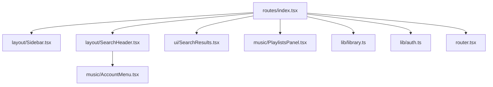
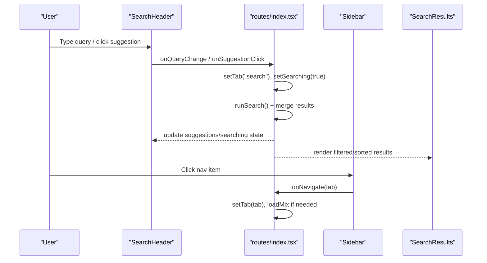
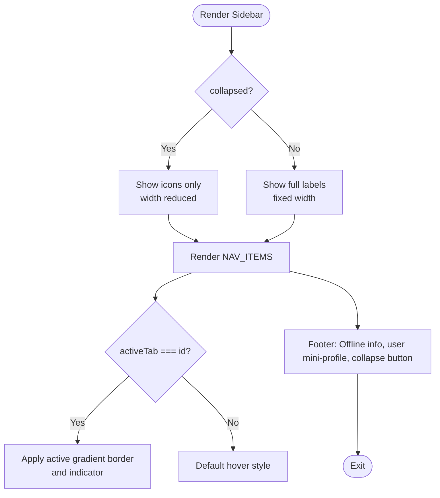
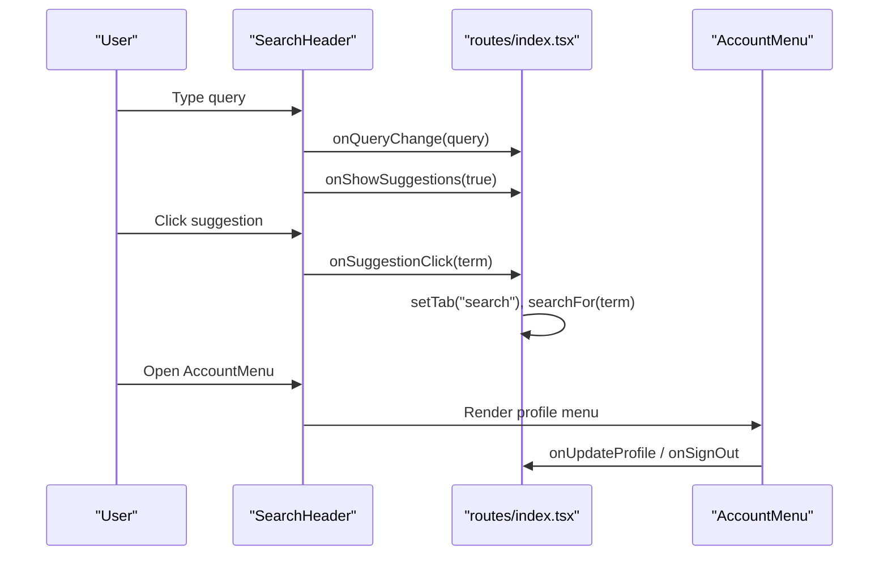
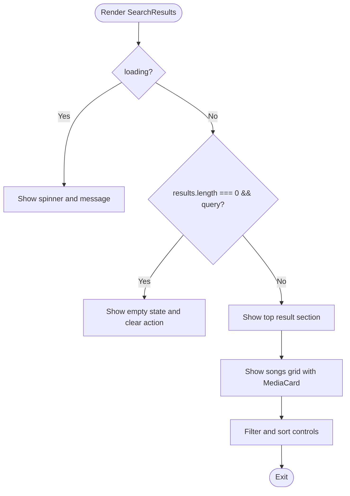
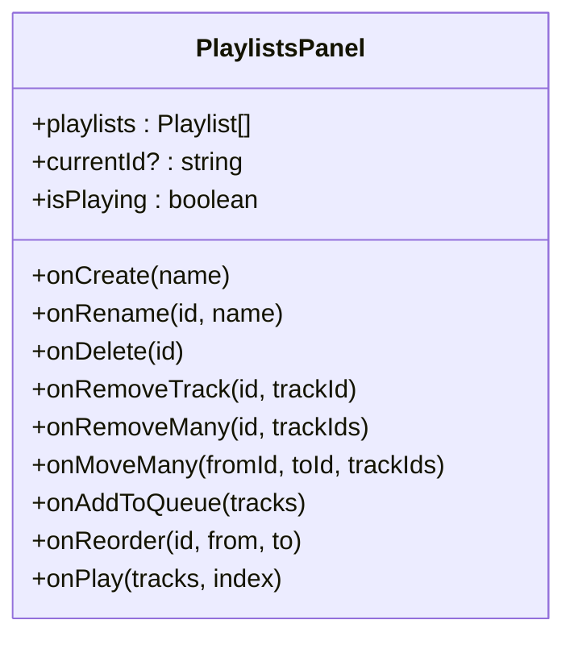
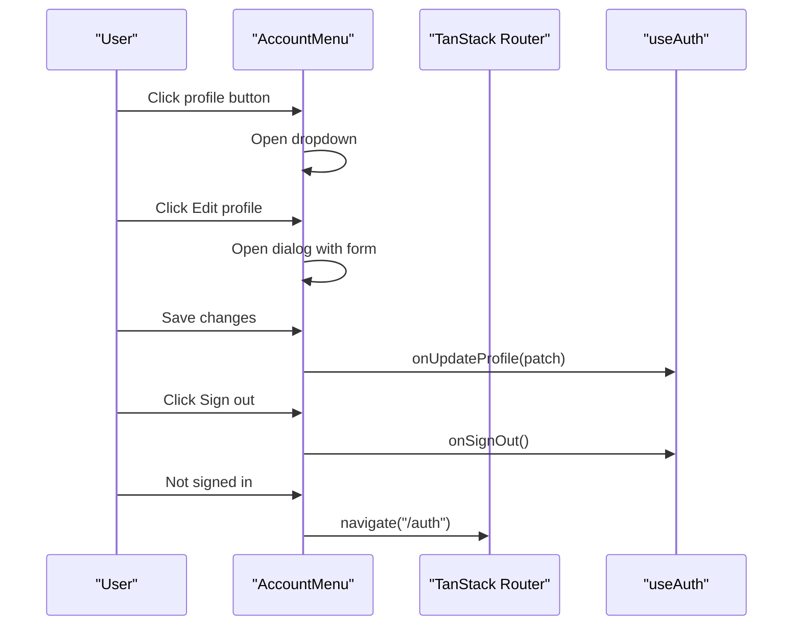
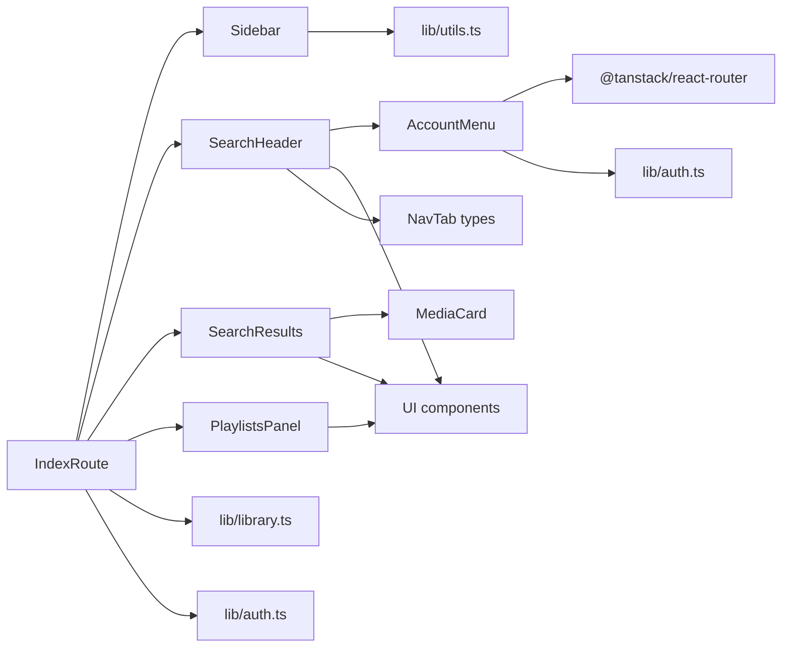

# Layout Components

<cite>
**Referenced Files in This Document**
- [Sidebar.tsx](file://src/components/music/layout/Sidebar.tsx)
- [SearchHeader.tsx](file://src/components/music/layout/SearchHeader.tsx)
- [SearchResults.tsx](file://src/components/music/ui/SearchResults.tsx)
- [PlaylistsPanel.tsx](file://src/components/music/PlaylistsPanel.tsx)
- [AccountMenu.tsx](file://src/components/music/AccountMenu.tsx)
- [index.tsx](file://src/routes/index.tsx)
- [auth.ts](file://src/lib/auth.ts)
- [library.ts](file://src/lib/library.ts)
- [utils.ts](file://src/lib/utils.ts)
- [router.tsx](file://src/router.tsx)
</cite>

## Table of Contents
1. [Introduction](#introduction)
2. [Project Structure](#project-structure)
3. [Core Components](#core-components)
4. [Architecture Overview](#architecture-overview)
5. [Detailed Component Analysis](#detailed-component-analysis)
6. [Dependency Analysis](#dependency-analysis)
7. [Performance Considerations](#performance-considerations)
8. [Troubleshooting Guide](#troubleshooting-guide)
9. [Conclusion](#conclusion)
10. [Appendices](#appendices)

## Introduction
This document provides comprehensive documentation for the layout components that provide structural organization and navigation patterns for the music application. It focuses on:
- Sidebar component: persistent navigation menu with playlist access, library sections, and user account controls integration.
- SearchHeader component: global search with autocomplete suggestions, recent searches, voice input, and navigation to tabs.

For each component, we detail prop interfaces, state management patterns, responsive behavior across screen sizes, routing integration, customization examples, active states, spacing and visual hierarchy, and accessibility considerations including keyboard navigation, screen reader support, and focus management.

## Project Structure
The layout is composed of two primary layout components and supporting UI panels:
- Sidebar: left-side persistent navigation with collapsible mode and tab-based navigation.
- SearchHeader: top header with global search, suggestions, recent searches, and account controls.
- Supporting panels: PlaylistsPanel for playlist management; AccountMenu for profile and sign-in/sign-out flows.
- Routing: TanStack Router configured at the app level; route tree generated automatically.

**Diagram sources**
- [index.tsx:975-997](file://src/routes/index.tsx#L975-L997)
- [Sidebar.tsx:1-186](file://src/components/music/layout/Sidebar.tsx#L1-L186)
- [SearchHeader.tsx:1-213](file://src/components/music/layout/SearchHeader.tsx#L1-L213)
- [AccountMenu.tsx:1-137](file://src/components/music/AccountMenu.tsx#L1-L137)
- [SearchResults.tsx:1-249](file://src/components/music/ui/SearchResults.tsx#L1-L249)
- [library.ts:242-349](file://src/lib/library.ts#L242-L349)
- [auth.ts:12-69](file://src/lib/auth.ts#L12-L69)
- [router.tsx:5-16](file://src/router.tsx#L5-L16)

**Section sources**
- [index.tsx:975-997](file://src/routes/index.tsx#L975-L997)
- [router.tsx:5-16](file://src/router.tsx#L5-L16)

## Core Components
- Sidebar: Provides persistent navigation with configurable tabs, collapse/expand behavior, download status display, and user mini-profile. Integrates with routing via a callback to switch tabs.
- SearchHeader: Provides global search with query state, suggestions, recent searches from localStorage, voice search, and account controls. Integrates with routing by invoking navigation callbacks and updating the active tab.

Key responsibilities:
- Maintain consistent spacing, alignment, and visual hierarchy using utility classes and shared design tokens.
- Manage local state (e.g., collapsed sidebar, suggestion visibility) while delegating side effects to parent components.
- Provide accessible interactions with proper labels, roles, and focus management.

**Section sources**
- [Sidebar.tsx:15-47](file://src/components/music/layout/Sidebar.tsx#L15-L47)
- [SearchHeader.tsx:9-26](file://src/components/music/layout/SearchHeader.tsx#L9-L26)

## Architecture Overview
The root route orchestrates layout and content:
- The root component holds global state for tabs, search, results, queue, and settings.
- Sidebar and SearchHeader are rendered within the main layout area.
- SearchHeader integrates with AccountMenu for profile management and sign-in/sign-out.
- Search results are displayed via SearchResults panel when searching.
- Library data and auth state are provided by hooks and integrated into the layout.

**Diagram sources**
- [SearchHeader.tsx:67-153](file://src/components/music/layout/SearchHeader.tsx#L67-L153)
- [index.tsx:760-790](file://src/routes/index.tsx#L760-L790)
- [Sidebar.tsx:92-132](file://src/components/music/layout/Sidebar.tsx#L92-L132)
- [SearchResults.tsx:72-120](file://src/components/music/ui/SearchResults.tsx#L72-L120)

## Detailed Component Analysis

### Sidebar Component
Purpose:
- Persistent navigation menu with tab-based sections: For you, Mixes, Podcasts, Search, Likes, Playlists, History, Downloads.
- Collapsible mode to save space on smaller screens or user preference.
- Displays offline download summary and user mini-profile when expanded.

Prop interface:
- activeTab: Current active navigation tab.
- collapsed: Boolean to toggle between expanded and icon-only modes.
- onToggleCollapse: Callback to change collapsed state.
- onNavigate: Callback to handle navigation to a specific tab.
- downloadCount, downloadSize, isSynced: Display offline storage status.
- userName, userInitial, userAvatar: Optional user profile details for mini-profile.

State management:
- Local state for collapsed state is managed by parent; Sidebar receives collapsed as a prop and triggers onToggleCollapse.
- Active state computed from activeTab prop.

Responsive behavior:
- Hidden on small screens; visible on md and up.
- Collapsed width reduces to icon-only; expanded width uses fixed width.
- Brand text and labels hide when collapsed to maintain compact layout.

Routing integration:
- onNavigate(tab) updates the active tab in the parent, which may trigger loading mixes or navigating to specific sections.

Customization examples:
- Add new navigation items by extending the NAV_ITEMS array with id, label, and icon.
- Customize active styles via conditional class names based on activeTab.
- Show additional badges or counters per tab by adding logic around specific ids.

Accessibility:
- Buttons have aria-labels for collapse toggle.
- Icons and labels provide context; tooltips via title when collapsed.
- Focus ring styling ensures keyboard navigation visibility.

**Diagram sources**
- [Sidebar.tsx:62-183](file://src/components/music/layout/Sidebar.tsx#L62-L183)

**Section sources**
- [Sidebar.tsx:15-47](file://src/components/music/layout/Sidebar.tsx#L15-L47)
- [Sidebar.tsx:62-183](file://src/components/music/layout/Sidebar.tsx#L62-L183)

### SearchHeader Component
Purpose:
- Global search bar with autocomplete suggestions and recent searches.
- Voice search using browser SpeechRecognition API when available.
- Navigation to tabs and account controls via AccountMenu.

Prop interface:
- query: Current search string.
- onQueryChange: Update query state.
- suggestions: Array of suggested terms.
- showSuggestions: Visibility flag for dropdown.
- onShowSuggestions: Toggle suggestion dropdown.
- onSearch: Form submission handler.
- onSuggestionClick: Handle selection of suggestion or recent search.
- searching: Loading state for search.
- activeTab: Current active tab for highlighting mobile nav tabs.
- onNavigate: Navigate to a different tab.
- userId, email, profile: Auth state passed to AccountMenu.
- onUpdateProfile, onSignOut: Profile update and sign-out handlers.
- onOpenSettings: Optional settings dialog trigger.

State management:
- Recent searches read from localStorage on mount; persisted separately.
- Suggestion dropdown toggled via showSuggestions and blur/focus events.

Responsive behavior:
- Mobile brand shown on small screens; desktop brand hidden.
- Search button hidden on small screens; visible on sm and up.
- Mobile nav tabs below header for quick navigation excluding search.

Routing integration:
- onNavigate(tab) switches tabs in the parent, enabling deep linking or mix loading.
- Suggestion clicks set query and trigger search flow in parent.

Customization examples:
- Extend suggestions by integrating server-side suggestSearch function in parent.
- Customize recent searches persistence key and limit.
- Add custom actions to suggestion items (e.g., open playlists).

Accessibility:
- Input has placeholder and aria attributes; buttons have aria-labels.
- Dropdown list items are interactive with mouseDown prevention to avoid losing focus prematurely.
- Voice search button labeled appropriately.

**Diagram sources**
- [SearchHeader.tsx:67-153](file://src/components/music/layout/SearchHeader.tsx#L67-L153)
- [index.tsx:975-997](file://src/routes/index.tsx#L975-L997)
- [AccountMenu.tsx:56-90](file://src/components/music/AccountMenu.tsx#L56-L90)

**Section sources**
- [SearchHeader.tsx:9-26](file://src/components/music/layout/SearchHeader.tsx#L9-L26)
- [SearchHeader.tsx:46-53](file://src/components/music/layout/SearchHeader.tsx#L46-L53)
- [SearchHeader.tsx:67-153](file://src/components/music/layout/SearchHeader.tsx#L67-L153)
- [SearchHeader.tsx:191-209](file://src/components/music/layout/SearchHeader.tsx#L191-L209)

### SearchResults Panel
Purpose:
- Displays search results with filtering and sorting options.
- Shows top result, songs grid, empty state, and recent/trending suggestions when no query.

Prop interface:
- results: Array of tracks returned from search.
- loading: Boolean indicating search in progress.
- query: Current search term for display.
- onPlayTrack: Handler to play a specific track at an index.
- onToggleLike: Toggle like state for a track.
- likedIds: Set of liked track IDs.
- currentId: Currently playing track ID.
- isPlaying: Boolean indicating playback state.

State management:
- Local filter and sort states control client-side presentation.
- Filtering currently treats all results as songs for demo purposes.

Responsive behavior:
- Grid adapts columns based on screen size.
- Filters scroll horizontally on small screens.

Integration points:
- Uses MediaCard for individual result cards.
- Hooks into parent-provided playback and like states.

**Diagram sources**
- [SearchResults.tsx:72-120](file://src/components/music/ui/SearchResults.tsx#L72-L120)
- [SearchResults.tsx:122-146](file://src/components/music/ui/SearchResults.tsx#L122-L146)
- [SearchResults.tsx:148-206](file://src/components/music/ui/SearchResults.tsx#L148-L206)

**Section sources**
- [SearchResults.tsx:20-29](file://src/components/music/ui/SearchResults.tsx#L20-L29)
- [SearchResults.tsx:59-70](file://src/components/music/ui/SearchResults.tsx#L59-L70)
- [SearchResults.tsx:72-120](file://src/components/music/ui/SearchResults.tsx#L72-L120)

### PlaylistsPanel Component
Purpose:
- Manages playlists: create, rename, delete, reorder tracks, select multiple tracks, add to queue, move between playlists.

Prop interface:
- playlists: Array of playlists with tracks.
- currentId: Currently selected playlist ID.
- isPlaying: Playback state for active track indication.
- onCreate, onRename, onDelete: CRUD operations for playlists.
- onRemoveTrack, onRemoveMany, onMoveMany: Track management operations.
- onAddToQueue: Add selected tracks to queue.
- onReorder: Reorder tracks within a playlist.
- onPlay: Play playlist starting at a given index.

State management:
- Tracks selection state resets when opening/closing a playlist.
- Drag-and-drop reordering handled via drag events.

Responsive behavior:
- Flexible layout with wrap for playlist tabs.
- Controls adapt to screen size with appropriate spacing.

Integration points:
- Uses Checkbox, Button, Input, DropdownMenu from UI kit.
- Integrates with library hooks for playlist operations.

**Diagram sources**
- [PlaylistsPanel.tsx:16-29](file://src/components/music/PlaylistsPanel.tsx#L16-L29)

**Section sources**
- [PlaylistsPanel.tsx:31-44](file://src/components/music/PlaylistsPanel.tsx#L31-L44)
- [PlaylistsPanel.tsx:61-108](file://src/components/music/PlaylistsPanel.tsx#L61-L108)
- [PlaylistsPanel.tsx:110-207](file://src/components/music/PlaylistsPanel.tsx#L110-L207)
- [PlaylistsPanel.tsx:214-303](file://src/components/music/PlaylistsPanel.tsx#L214-L303)

### AccountMenu Component
Purpose:
- Provides sign-in CTA when not authenticated or profile dropdown when signed in.
- Allows editing profile (display name, avatar URL) and signing out.

Prop interface:
- userId, email, profile: Authentication state.
- onUpdateProfile: Save profile changes.
- onSignOut: Trigger sign-out flow.

State management:
- Local state for edit dialog openness and form fields.
- Navigates to auth page when not signed in.

Integration points:
- Uses DropdownMenu and Dialog components.
- Integrates with router for navigation to auth.

**Diagram sources**
- [AccountMenu.tsx:33-51](file://src/components/music/AccountMenu.tsx#L33-L51)
- [AccountMenu.tsx:56-90](file://src/components/music/AccountMenu.tsx#L56-L90)
- [AccountMenu.tsx:92-133](file://src/components/music/AccountMenu.tsx#L92-L133)

**Section sources**
- [AccountMenu.tsx:25-31](file://src/components/music/AccountMenu.tsx#L25-L31)
- [AccountMenu.tsx:33-51](file://src/components/music/AccountMenu.tsx#L33-L51)
- [AccountMenu.tsx:56-90](file://src/components/music/AccountMenu.tsx#L56-L90)
- [AccountMenu.tsx:92-133](file://src/components/music/AccountMenu.tsx#L92-L133)

## Dependency Analysis
- Sidebar depends on shared utilities (cn) and icons; renders navigation items defined locally.
- SearchHeader depends on AccountMenu, UI components (Button, Input), and imports NavTab types from Sidebar.
- SearchResults depends on MediaCard and UI components; uses library types for tracks.
- PlaylistsPanel depends on UI components and library types for playlists and tracks.
- AccountMenu depends on router and UI components; integrates with auth types.
- Root route orchestrates all components and manages global state, integrating with library and auth hooks.

**Diagram sources**
- [Sidebar.tsx:13-34](file://src/components/music/layout/Sidebar.tsx#L13-L34)
- [SearchHeader.tsx:1-8](file://src/components/music/layout/SearchHeader.tsx#L1-L8)
- [SearchResults.tsx:1-15](file://src/components/music/ui/SearchResults.tsx#L1-L15)
- [PlaylistsPanel.tsx:1-14](file://src/components/music/PlaylistsPanel.tsx#L1-L14)
- [AccountMenu.tsx:1-23](file://src/components/music/AccountMenu.tsx#L1-L23)
- [index.tsx:30-45](file://src/routes/index.tsx#L30-L45)
- [library.ts:242-349](file://src/lib/library.ts#L242-L349)
- [auth.ts:12-69](file://src/lib/auth.ts#L12-L69)

**Section sources**
- [Sidebar.tsx:13-34](file://src/components/music/layout/Sidebar.tsx#L13-L34)
- [SearchHeader.tsx:1-8](file://src/components/music/layout/SearchHeader.tsx#L1-L8)
- [SearchResults.tsx:1-15](file://src/components/music/ui/SearchResults.tsx#L1-L15)
- [PlaylistsPanel.tsx:1-14](file://src/components/music/PlaylistsPanel.tsx#L1-L14)
- [AccountMenu.tsx:1-23](file://src/components/music/AccountMenu.tsx#L1-L23)
- [index.tsx:30-45](file://src/routes/index.tsx#L30-L45)

## Performance Considerations
- Debounced autocomplete: Suggestions are fetched after a delay to reduce network calls during typing.
- Parallel search: Searches YouTube and Deezer in parallel and merges results efficiently using deduplication.
- Local-first library: Data is stored locally and synced to cloud when authenticated, reducing latency.
- Efficient rendering: Conditional rendering based on loading states and empty states prevents unnecessary computations.
- Memory management: Lists are trimmed to reasonable limits (e.g., history, playback queue) to prevent memory growth.

[No sources needed since this section provides general guidance]

## Troubleshooting Guide
Common issues and resolutions:
- Suggestions not appearing: Ensure query length is sufficient and server functions are available; check network requests and error messages.
- Recent searches not loading: Verify localStorage availability and JSON parsing; handle errors gracefully.
- Voice search not working: Check browser support for SpeechRecognition; ensure permissions are granted.
- Navigation not updating: Confirm onNavigate callbacks are properly bound and activeTab state is updated.
- Account menu not showing profile: Ensure auth state is loaded and profile data is available; handle loading states appropriately.

**Section sources**
- [SearchHeader.tsx:46-53](file://src/components/music/layout/SearchHeader.tsx#L46-L53)
- [SearchHeader.tsx:87-102](file://src/components/music/layout/SearchHeader.tsx#L87-L102)
- [index.tsx:793-800](file://src/routes/index.tsx#L793-L800)

## Conclusion
The layout components provide a robust foundation for the music application's navigation and search experience. Sidebar offers persistent, customizable navigation with responsive behavior and accessibility features. SearchHeader delivers a comprehensive search interface with autocomplete, recent searches, voice input, and seamless integration with routing and account management. Together, these components maintain consistent spacing, alignment, and visual hierarchy while supporting complex interactions and state management patterns.

[No sources needed since this section summarizes without analyzing specific files]

## Appendices

### Prop Interfaces Summary

#### Sidebar Props
- activeTab: Current navigation tab identifier.
- collapsed: Boolean controlling collapsed state.
- onToggleCollapse: Function to toggle collapsed state.
- onNavigate: Function to handle navigation to a tab.
- downloadCount, downloadSize, isSynced: Offline storage indicators.
- userName, userInitial, userAvatar: Optional user profile details.

**Section sources**
- [Sidebar.tsx:36-47](file://src/components/music/layout/Sidebar.tsx#L36-L47)

#### SearchHeader Props
- query: Current search query string.
- onQueryChange: Function to update query.
- suggestions: Array of suggestion strings.
- showSuggestions: Boolean to control dropdown visibility.
- onShowSuggestions: Function to toggle suggestions.
- onSearch: Function to handle form submission.
- onSuggestionClick: Function to handle suggestion selection.
- searching: Boolean indicating search in progress.
- activeTab: Current active tab for highlighting.
- onNavigate: Function to navigate to a tab.
- userId, email, profile: Authentication state.
- onUpdateProfile, onSignOut: Profile and sign-out handlers.
- onOpenSettings: Optional settings dialog trigger.

**Section sources**
- [SearchHeader.tsx:9-26](file://src/components/music/layout/SearchHeader.tsx#L9-L26)

### Accessibility Checklist
- Keyboard navigation: All interactive elements are focusable and navigable via keyboard.
- Screen reader support: Proper aria-labels and semantic HTML structure.
- Focus management: Focus remains predictable; dropdowns manage focus appropriately.
- Color contrast: Text and backgrounds meet contrast requirements.
- Touch targets: Interactive elements have adequate size for touch devices.

[No sources needed since this section provides general guidance]