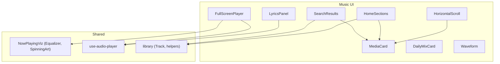
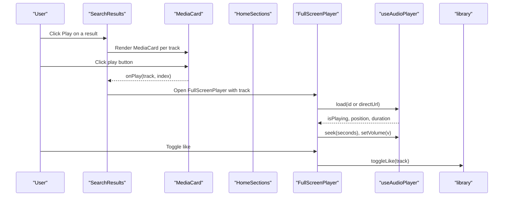
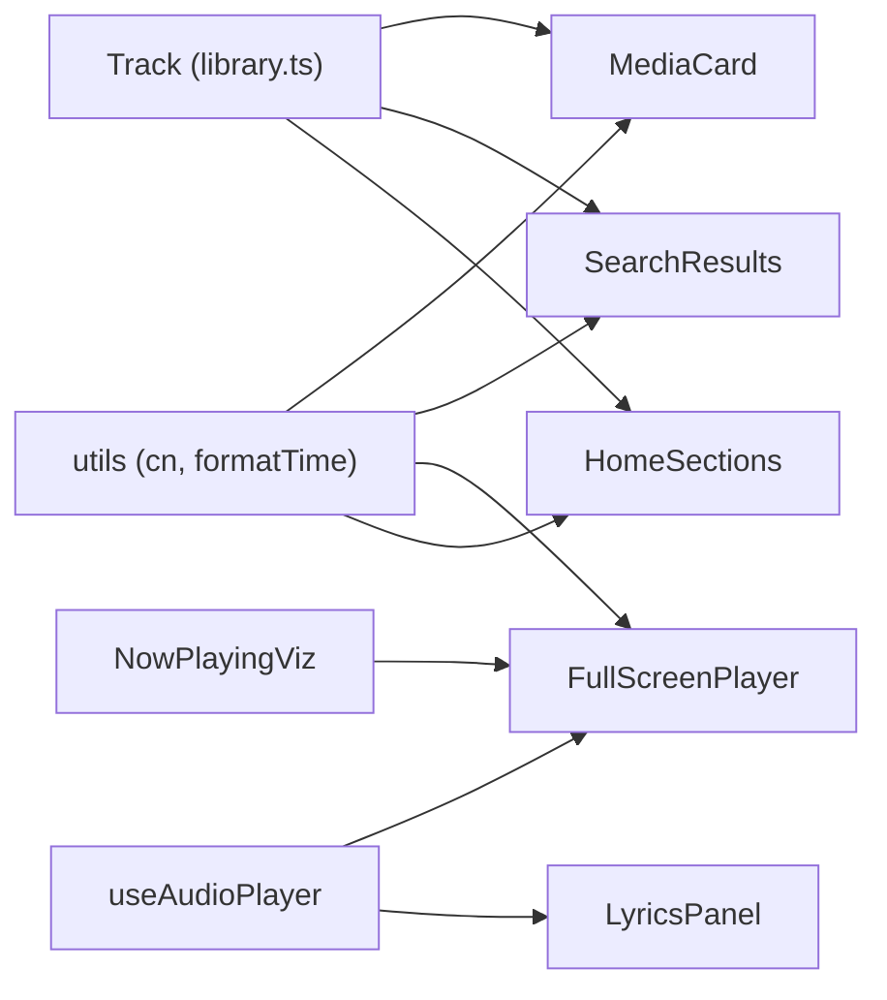

# Music UI Components

<cite>
**Referenced Files in This Document**
- [MediaCard.tsx](file://src/components/music/ui/MediaCard.tsx)
- [SearchResults.tsx](file://src/components/music/ui/SearchResults.tsx)
- [FullScreenPlayer.tsx](file://src/components/music/ui/FullScreenPlayer.tsx)
- [DailyMixCard.tsx](file://src/components/music/ui/DailyMixCard.tsx)
- [HomeSections.tsx](file://src/components/music/ui/HomeSections.tsx)
- [LyricsPanel.tsx](file://src/components/music/ui/LyricsPanel.tsx)
- [Waveform.tsx](file://src/components/music/ui/Waveform.tsx)
- [HorizontalScroll.tsx](file://src/components/music/ui/HorizontalScroll.tsx)
- [library.ts](file://src/lib/library.ts)
- [NowPlayingViz.tsx](file://src/components/music/NowPlayingViz.tsx)
- [use-audio-player.ts](file://src/lib/use-audio-player.ts)
</cite>

## Table of Contents
1. Introduction
2. Project Structure
3. Core Components
4. Architecture Overview
5. Detailed Component Analysis
6. Dependency Analysis
7. Performance Considerations
8. Troubleshooting Guide
9. Conclusion

## Introduction
This document provides comprehensive documentation for the music-specific UI components that power the YouTube Music Companion application. It covers MediaCard, SearchResults, FullScreenPlayer, DailyMixCard, HomeSections, LyricsPanel, Waveform, and HorizontalScroll. For each component, you will find props interfaces, event handlers, styling customization options, integration patterns, usage examples, responsive design considerations, accessibility features, and performance optimization techniques. The document also explains how these components compose together to deliver cohesive browsing and playback experiences.

## Project Structure
The music UI lives under src/components/music/ui and integrates with shared utilities, hooks, and data models:
- Components: MediaCard, SearchResults, FullScreenPlayer, DailyMixCard, HomeSections, LyricsPanel, Waveform, HorizontalScroll
- Shared visuals: Equalizer and SpinningArt in NowPlayingViz
- Data model: Track type and library utilities in library.ts
- Audio runtime: useAudioPlayer hook for streaming, seeking, volume, and offline playback

**Diagram sources**
- [MediaCard.tsx:1-129](file://src/components/music/ui/MediaCard.tsx#L1-L129)
- [SearchResults.tsx:1-249](file://src/components/music/ui/SearchResults.tsx#L1-L249)
- [FullScreenPlayer.tsx:1-257](file://src/components/music/ui/FullScreenPlayer.tsx#L1-L257)
- [DailyMixCard.tsx:1-97](file://src/components/music/ui/DailyMixCard.tsx#L1-L97)
- [HomeSections.tsx:1-155](file://src/components/music/ui/HomeSections.tsx#L1-L155)
- [LyricsPanel.tsx:1-172](file://src/components/music/ui/LyricsPanel.tsx#L1-L172)
- [Waveform.tsx:1-44](file://src/components/music/ui/Waveform.tsx#L1-L44)
- [HorizontalScroll.tsx:1-70](file://src/components/music/ui/HorizontalScroll.tsx#L1-L70)
- [NowPlayingViz.tsx:1-63](file://src/components/music/NowPlayingViz.tsx#L1-L63)
- [use-audio-player.ts:1-221](file://src/lib/use-audio-player.ts#L1-L221)
- [library.ts:1-646](file://src/lib/library.ts#L1-L646)

**Section sources**
- [MediaCard.tsx:1-129](file://src/components/music/ui/MediaCard.tsx#L1-L129)
- [SearchResults.tsx:1-249](file://src/components/music/ui/SearchResults.tsx#L1-L249)
- [FullScreenPlayer.tsx:1-257](file://src/components/music/ui/FullScreenPlayer.tsx#L1-L257)
- [DailyMixCard.tsx:1-97](file://src/components/music/ui/DailyMixCard.tsx#L1-L97)
- [HomeSections.tsx:1-155](file://src/components/music/ui/HomeSections.tsx#L1-L155)
- [LyricsPanel.tsx:1-172](file://src/components/music/ui/LyricsPanel.tsx#L1-L172)
- [Waveform.tsx:1-44](file://src/components/music/ui/Waveform.tsx#L1-L44)
- [HorizontalScroll.tsx:1-70](file://src/components/music/ui/HorizontalScroll.tsx#L1-L70)
- [NowPlayingViz.tsx:1-63](file://src/components/music/NowPlayingViz.tsx#L1-L63)
- [use-audio-player.ts:1-221](file://src/lib/use-audio-player.ts#L1-L221)
- [library.ts:1-646](file://src/lib/library.ts#L1-L646)

## Core Components
This section summarizes each component’s purpose, props, events, styling, and integration notes.

- MediaCard: Displays a track or album card with play overlay, like/more actions, and size variants.
- SearchResults: Multi-source search results display with filters, sorting, top result highlight, and grid of MediaCards.
- FullScreenPlayer: Immersive full-screen player with progress, controls, volume, and toggles for lyrics/queue.
- DailyMixCard: Personalized mix recommendation card with gradient backgrounds and play action.
- HomeSections: Dashboard layout organizing sections like recently played, trending, new releases, and recommendations.
- LyricsPanel: Synchronized lyrics panel with auto-scrolling, search, and current line highlighting.
- Waveform: Animated waveform visualization for active playback states.
- HorizontalScroll: Scrollable carousel container with arrow navigation and optional title/subtitle.

**Section sources**
- [MediaCard.tsx:1-129](file://src/components/music/ui/MediaCard.tsx#L1-L129)
- [SearchResults.tsx:1-249](file://src/components/music/ui/SearchResults.tsx#L1-L249)
- [FullScreenPlayer.tsx:1-257](file://src/components/music/ui/FullScreenPlayer.tsx#L1-L257)
- [DailyMixCard.tsx:1-97](file://src/components/music/ui/DailyMixCard.tsx#L1-L97)
- [HomeSections.tsx:1-155](file://src/components/music/ui/HomeSections.tsx#L1-L155)
- [LyricsPanel.tsx:1-172](file://src/components/music/ui/LyricsPanel.tsx#L1-L172)
- [Waveform.tsx:1-44](file://src/components/music/ui/Waveform.tsx#L1-L44)
- [HorizontalScroll.tsx:1-70](file://src/components/music/ui/HorizontalScroll.tsx#L1-L70)

## Architecture Overview
The UI is driven by a central audio runtime and a local-first library model. Components consume shared types and state via props and callbacks, while the audio hook manages playback, seeking, and volume. Visualizations and animations are provided by shared visual components.

**Diagram sources**
- [SearchResults.tsx:150-206](file://src/components/music/ui/SearchResults.tsx#L150-L206)
- [MediaCard.tsx:50-90](file://src/components/music/ui/MediaCard.tsx#L50-L90)
- [FullScreenPlayer.tsx:64-76](file://src/components/music/ui/FullScreenPlayer.tsx#L64-L76)
- [use-audio-player.ts:142-172](file://src/lib/use-audio-player.ts#L142-L172)
- [library.ts:353-366](file://src/lib/library.ts#L353-L366)

## Detailed Component Analysis

### MediaCard
Purpose:
- Presents a track or album with image, title, subtitle, and play overlay. Supports active/playing states and like/more actions.

Props interface:
- title: string
- subtitle?: string
- image?: string
- playing?: boolean
- active?: boolean
- liked?: boolean
- onPlay?: () => void
- onToggleLike?: () => void
- onMore?: () => void
- size?: "sm" | "md" | "lg"
- className?: string
- style?: React.CSSProperties

Event handlers:
- onPlay: triggers when the card’s main area is clicked
- onToggleLike: toggles favorite state; stops propagation to avoid triggering parent click
- onMore: opens additional options menu

Styling customization:
- Uses utility class composition for hover effects, gradients, neon glow, and focus rings
- Size-based width classes control card dimensions
- Active state applies animated gradient border and glow

Integration patterns:
- Used inside SearchResults and HomeSections to render grids of tracks
- Accepts external state for playing/active/liked to reflect global playback and library state

Accessibility:
- Buttons include aria-labels for like and more actions
- Image alt text is empty to avoid redundant announcements; decorative

Performance:
- Memoized export prevents unnecessary re-renders
- Lazy image loading with error fallback improves perceived performance

Usage example:
- Render a grid of MediaCard instances from SearchResults or HomeSections, passing track metadata and callbacks to handle play and like actions.

Responsive design:
- Grid layouts adapt across breakpoints; card sizes remain consistent within rows

Common pitfalls:
- Ensure onPlay is bound to the correct track context to avoid misfiring

**Section sources**
- [MediaCard.tsx:5-18](file://src/components/music/ui/MediaCard.tsx#L5-L18)
- [MediaCard.tsx:21-129](file://src/components/music/ui/MediaCard.tsx#L21-L129)

### SearchResults
Purpose:
- Displays search results with filtering, sorting, a highlighted top result, and a grid of MediaCards.

Props interface:
- results: Track[]
- loading: boolean
- query: string
- onPlayTrack: (track: Track, index: number) => void
- onToggleLike: (track: Track) => void
- likedIds: Set<string>
- currentId?: string
- isPlaying: boolean

Event handlers:
- onPlayTrack: invoked when user clicks play on a result
- onToggleLike: toggles like status for a track

Styling customization:
- Filter chips and sort dropdown styled with borders and gradients
- Top result uses a highlighted card with play action
- Grid adapts to screen size using responsive classes

Integration patterns:
- Consumes Track type from library.ts
- Renders MediaCard for each result, wiring up play and like callbacks
- Can be composed with HorizontalScroll if needed for horizontal carousels

Accessibility:
- Loading and empty states provide clear messaging
- Buttons have descriptive labels

Performance:
- Client-side filter/sort placeholders can be replaced with server-side logic for large datasets
- Staggered animation delays improve perceived performance

Usage example:
- Pass search results and handlers to SearchResults; open FullScreenPlayer on play and update likedIds via library state.

**Section sources**
- [SearchResults.tsx:20-29](file://src/components/music/ui/SearchResults.tsx#L20-L29)
- [SearchResults.tsx:31-249](file://src/components/music/ui/SearchResults.tsx#L31-L249)
- [library.ts:3-14](file://src/lib/library.ts#L3-L14)

### FullScreenPlayer
Purpose:
- Provides an immersive full-screen playback experience with album art, progress bar, controls, and volume.

Props interface:
- track: Track | null
- isPlaying: boolean
- liked: boolean
- position: number
- duration: number
- volume: number
- onTogglePlay: () => void
- onToggleLike: () => void
- onNext: () => void
- onPrevious: () => void
- onSeek: (seconds: number) => void
- onVolumeChange: (volume: number) => void
- onClose: () => void
- canNext: boolean
- canPrevious: boolean

Event handlers:
- onTogglePlay: toggles playback
- onToggleLike: toggles like state
- onNext/onPrevious: navigates queue
- onSeek: seeks to a specific time based on progress bar click
- onVolumeChange: updates volume via slider
- onClose: collapses the full-screen view

Styling customization:
- Cinematic blurred background derived from track thumbnail
- Gradient overlays and animated ambient effects
- Progress bar with gradient fill and hover shadow

Integration patterns:
- Uses formatTime from use-audio-player for time formatting
- Integrates with NowPlayingViz for equalizer/spinning visuals
- Connects to library for like toggling

Accessibility:
- Progress bar uses role="progressbar" with aria attributes
- Controls have aria-labels for play/pause, next, previous, like

Performance:
- Computes progress percentage with useMemo to avoid recalculation
- Avoids heavy operations during frequent updates

Usage example:
- Bind FullScreenPlayer to useAudioPlayer state (isPlaying, position, duration) and call load/cue/play/pause/seek/setVolume accordingly.

**Section sources**
- [FullScreenPlayer.tsx:26-42](file://src/components/music/ui/FullScreenPlayer.tsx#L26-L42)
- [FullScreenPlayer.tsx:44-257](file://src/components/music/ui/FullScreenPlayer.tsx#L44-L257)
- [use-audio-player.ts:215-221](file://src/lib/use-audio-player.ts#L215-L221)
- [NowPlayingViz.tsx:1-63](file://src/components/music/NowPlayingViz.tsx#L1-L63)

### DailyMixCard
Purpose:
- Displays personalized mix cards with gradient backgrounds, icons, and play actions.

Props interface:
- mix: { id: DailyMixId; name: string; mood?: string; icon: LucideIcon; gradient: string }
- active?: boolean
- playing?: boolean
- onSelect: () => void
- onPlay: () => void

Event handlers:
- onSelect: selects the mix
- onPlay: plays the mix; stops propagation to prevent selecting again

Styling customization:
- Gradient backgrounds vary per mix
- Hover scale and glow effects enhance interactivity

Integration patterns:
- Uses predefined DAILY_MIXES configuration for consistent look and feel
- Can be wrapped in HorizontalScroll for carousel behavior

Accessibility:
- Play button includes aria-label describing the mix name

Usage example:
- Render a list of DailyMixCard items with onSelect navigating to a mix page and onPlay starting playback.

**Section sources**
- [DailyMixCard.tsx:15-48](file://src/components/music/ui/DailyMixCard.tsx#L15-L48)
- [DailyMixCard.tsx:50-97](file://src/components/music/ui/DailyMixCard.tsx#L50-L97)

### HomeSections
Purpose:
- Organizes dashboard content into sections such as recently played, trending, new releases, and recommended.

Props interface:
- recentlyPlayed: Track[]
- trending: Track[]
- newReleases: Track[]
- recommended: Track[]
- onPlayTrack: (track: Track, index: number) => void
- onToggleLike: (track: Track) => void
- likedIds: Set<string>
- currentId?: string
- isPlaying: boolean
- loading?: boolean

Event handlers:
- onPlayTrack: plays a track from any section
- onToggleLike: toggles like for a track

Styling customization:
- Section headers with icons and “See all” buttons
- Skeleton placeholders for loading states
- Responsive grid layout for cards

Integration patterns:
- Composes MediaCard for each track
- Uses Track type from library.ts
- Can be combined with HorizontalScroll for horizontal sections

Accessibility:
- Empty state provides guidance when no content is available

Performance:
- Limits displayed tracks per section to 12 for performance
- Skeleton rendering avoids layout shifts during loading

Usage example:
- Populate sections with data from library or API; wire onPlayTrack to start playback and update currentId/isPlaying.

**Section sources**
- [HomeSections.tsx:6-18](file://src/components/music/ui/HomeSections.tsx#L6-L18)
- [HomeSections.tsx:20-155](file://src/components/music/ui/HomeSections.tsx#L20-L155)
- [library.ts:3-14](file://src/lib/library.ts#L3-L14)

### LyricsPanel
Purpose:
- Shows synchronized lyrics for the currently playing track with auto-scrolling and search.

Props interface:
- trackId: string
- trackTitle: string
- trackArtist: string
- currentTime: number
- isPlaying: boolean
- onClose: () => void

Event handlers:
- onClose: closes the lyrics panel

Styling customization:
- Fixed side panel with backdrop blur and premium scrollbar
- Current line highlighted with gradient border and glow
- Search input integrated with filtered results

Integration patterns:
- Uses currentTime from useAudioPlayer to determine current line
- Auto-scrolls to keep the active line centered

Accessibility:
- Panel header includes track info
- Close button is accessible via keyboard and screen readers

Performance:
- Finds current line efficiently using array indexing
- Smooth scrolling avoids jank

Usage example:
- Pass currentTime from useAudioPlayer and isOpen state to show/hide LyricsPanel.

**Section sources**
- [LyricsPanel.tsx:7-19](file://src/components/music/ui/LyricsPanel.tsx#L7-L19)
- [LyricsPanel.tsx:44-172](file://src/components/music/ui/LyricsPanel.tsx#L44-L172)

### Waveform
Purpose:
- Animated waveform visualization for active playback states.

Props interface:
- active?: boolean
- barCount?: number
- className?: string
- variant?: "default" | "large"

Styling customization:
- Gradient bars animate when active; static bars otherwise
- Height and spacing controlled by variant and CSS classes

Integration patterns:
- Often used alongside Equalizer or in mini player bars
- Controlled by playback state to enable/disable animation

Accessibility:
- Decorative element marked aria-hidden

Usage example:
- Render Waveform with active={isPlaying} to visualize playback.

**Section sources**
- [Waveform.tsx:3-8](file://src/components/music/ui/Waveform.tsx#L3-L8)
- [Waveform.tsx:11-44](file://src/components/music/ui/Waveform.tsx#L11-L44)

### HorizontalScroll
Purpose:
- Scrollable container with smooth arrow navigation and optional title/subtitle.

Props interface:
- children: ReactNode
- className?: string
- title?: string
- subtitle?: string

Event handlers:
- Arrow buttons trigger scrollBy with smooth behavior

Styling customization:
- Hidden scrollbar with custom styling
- Disabled arrows when at edges

Integration patterns:
- Wraps lists of MediaCard or DailyMixCard for carousel behavior
- Updates arrow states based on scroll position

Accessibility:
- Arrows have aria-labels for left/right navigation

Usage example:
- Wrap a row of DailyMixCard or MediaCard elements to create a horizontally scrollable section.

**Section sources**
- [HorizontalScroll.tsx:5-10](file://src/components/music/ui/HorizontalScroll.tsx#L5-L10)
- [HorizontalScroll.tsx:13-70](file://src/components/music/ui/HorizontalScroll.tsx#L13-L70)

## Dependency Analysis
Components depend on shared types, hooks, and utilities:
- Track type from library.ts defines the shape of media items
- useAudioPlayer provides playback state and methods
- NowPlayingViz offers equalizer and spinning artwork visuals
- Utility functions (cn, formatTime) standardize styling and formatting

**Diagram sources**
- [library.ts:3-14](file://src/lib/library.ts#L3-L14)
- [use-audio-player.ts:1-221](file://src/lib/use-audio-player.ts#L1-L221)
- [NowPlayingViz.tsx:1-63](file://src/components/music/NowPlayingViz.tsx#L1-L63)
- [MediaCard.tsx:1-129](file://src/components/music/ui/MediaCard.tsx#L1-L129)
- [SearchResults.tsx:1-249](file://src/components/music/ui/SearchResults.tsx#L1-L249)
- [FullScreenPlayer.tsx:1-257](file://src/components/music/ui/FullScreenPlayer.tsx#L1-L257)
- [HomeSections.tsx:1-155](file://src/components/music/ui/HomeSections.tsx#L1-L155)
- [LyricsPanel.tsx:1-172](file://src/components/music/ui/LyricsPanel.tsx#L1-L172)

**Section sources**
- [library.ts:3-14](file://src/lib/library.ts#L3-L14)
- [use-audio-player.ts:1-221](file://src/lib/use-audio-player.ts#L1-L221)
- [NowPlayingViz.tsx:1-63](file://src/components/music/NowPlayingViz.tsx#L1-L63)

## Performance Considerations
- Image lazy loading and error handling in MediaCard reduce initial load impact and improve resilience.
- Memoization in MediaCard prevents unnecessary re-renders in lists.
- useMemo in FullScreenPlayer computes progress percentage only when dependencies change.
- Limiting displayed tracks per section in HomeSections avoids excessive DOM nodes.
- useAudioPlayer manages a single HTMLAudioElement instance, minimizing resource usage and ensuring proper cleanup.
- Offline playback via blob URLs reduces network requests when cached content is available.

[No sources needed since this section provides general guidance]

## Troubleshooting Guide
Common issues and resolutions:
- Playback blocked: If autoplay is prevented by browser policy, prompt the user to tap play. The audio hook logs warnings and surfaces an error message.
- Unavailable songs: Errors trigger a message indicating unavailability; consider disabling auto-advance until manual skip is implemented.
- Network errors: Stream proxy may fail; ensure /api/stream endpoints are reachable and properly configured.
- LocalStorage quota exceeded: Library writes are wrapped in try/catch; monitor console warnings and consider pruning history or stats.

**Section sources**
- [use-audio-player.ts:56-67](file://src/lib/use-audio-player.ts#L56-L67)
- [use-audio-player.ts:116-119](file://src/lib/use-audio-player.ts#L116-L119)
- [library.ts:125-143](file://src/lib/library.ts#L125-L143)

## Conclusion
These music UI components form a cohesive system for browsing and playing music. They integrate tightly with a robust audio runtime and a local-first library model, providing responsive, accessible, and performant experiences. By composing MediaCard, SearchResults, FullScreenPlayer, DailyMixCard, HomeSections, LyricsPanel, Waveform, and HorizontalScroll, developers can build rich music interfaces that scale gracefully and delight users.

[No sources needed since this section summarizes without analyzing specific files]