# Shared UI Primitives

<cite>
**Referenced Files in This Document**
- [button.tsx](file://src/components/ui/button.tsx)
- [input.tsx](file://src/components/ui/input.tsx)
- [dialog.tsx](file://src/components/ui/dialog.tsx)
- [slider.tsx](file://src/components/ui/slider.tsx)
- [checkbox.tsx](file://src/components/ui/checkbox.tsx)
- [dropdown-menu.tsx](file://src/components/ui/dropdown-menu.tsx)
- [label.tsx](file://src/components/ui/label.tsx)
- [switch.tsx](file://src/components/ui/switch.tsx)
- [utils.ts](file://src/lib/utils.ts)
- [styles.css](file://src/styles.css)
- [components.json](file://components.json)
</cite>

## Table of Contents
1. Introduction
2. Project Structure
3. Core Components
4. Architecture Overview
5. Detailed Component Analysis
6. Dependency Analysis
7. Performance Considerations
8. Troubleshooting Guide
9. Conclusion

## Introduction
This document describes the shared UI primitive components that form the foundation of the application’s design system. It covers Button, Input, Dialog, Slider, Checkbox, DropdownMenu, Label, and Switch. For each component, it specifies prop interfaces, event handling patterns, accessibility compliance (ARIA attributes and keyboard navigation), styling customization via Tailwind CSS classes, and theme integration. Practical usage patterns, error handling strategies, and integration with form libraries are included, along with guidance on responsive behavior, cross-browser compatibility, and performance considerations for frequently used UI elements.

## Project Structure
The primitives live under src/components/ui and are built on Radix UI primitives with Tailwind CSS styling. A shared utility function merges class names safely to support composition and overrides. Theme tokens and design tokens are defined in the global styles and configured via a configuration file.

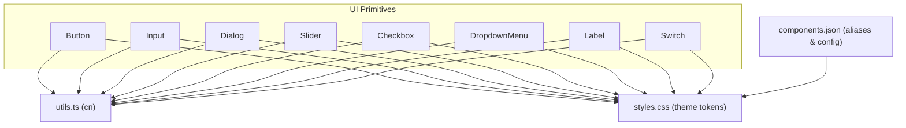

**Diagram sources**
- [button.tsx:1-50](file://src/components/ui/button.tsx#L1-L50)
- [input.tsx:1-23](file://src/components/ui/input.tsx#L1-L23)
- [dialog.tsx:1-105](file://src/components/ui/dialog.tsx#L1-L105)
- [slider.tsx:1-24](file://src/components/ui/slider.tsx#L1-L24)
- [checkbox.tsx:1-27](file://src/components/ui/checkbox.tsx#L1-L27)
- [dropdown-menu.tsx:1-188](file://src/components/ui/dropdown-menu.tsx#L1-L188)
- [label.tsx:1-22](file://src/components/ui/label.tsx#L1-L22)
- [switch.tsx:1-28](file://src/components/ui/switch.tsx#L1-L28)
- [utils.ts:1-7](file://src/lib/utils.ts#L1-L7)
- [styles.css:13-111](file://src/styles.css#L13-L111)
- [components.json:1-23](file://components.json#L1-L23)

**Section sources**
- [button.tsx:1-50](file://src/components/ui/button.tsx#L1-L50)
- [input.tsx:1-23](file://src/components/ui/input.tsx#L1-L23)
- [dialog.tsx:1-105](file://src/components/ui/dialog.tsx#L1-L105)
- [slider.tsx:1-24](file://src/components/ui/slider.tsx#L1-L24)
- [checkbox.tsx:1-27](file://src/components/ui/checkbox.tsx#L1-L27)
- [dropdown-menu.tsx:1-188](file://src/components/ui/dropdown-menu.tsx#L1-L188)
- [label.tsx:1-22](file://src/components/ui/label.tsx#L1-L22)
- [switch.tsx:1-28](file://src/components/ui/switch.tsx#L1-L28)
- [utils.ts:1-7](file://src/lib/utils.ts#L1-L7)
- [styles.css:13-111](file://src/styles.css#L13-L111)
- [components.json:1-23](file://components.json#L1-L23)

## Core Components
- Button: Variant-driven styling (default, destructive, outline, secondary, ghost, link) and sizes (default, sm, lg, icon). Supports asChild composition to render as another element while preserving behavior. Uses class-variance-authority for variant management and a shared cn utility for class merging.
- Input: Standard input with consistent spacing, borders, focus rings, and disabled states. Accepts all native input props and supports type variations.
- Dialog: Full modal system including overlay, content, header, footer, title, description, trigger, close, and portal. Includes animations and accessible close button.
- Slider: Accessible range control with track, range, and thumb. Supports disabled state and focus ring.
- Checkbox: Accessible checkbox with indicator and focus states. Integrates with Radix for correct semantics.
- DropdownMenu: Rich menu with items, checkboxes, radios, labels, separators, shortcuts, groups, submenus, and portals. Includes open/close animations and side-aware positioning.
- Label: Accessible label for form controls with disabled peer styling.
- Switch: Accessible toggle with checked/unchecked states, focus ring, and disabled state.

All components rely on Tailwind CSS utilities and CSS variables from the theme for colors, typography, and radii. The cn utility ensures safe class merging and overrides.

**Section sources**
- [button.tsx:7-49](file://src/components/ui/button.tsx#L7-L49)
- [input.tsx:5-20](file://src/components/ui/input.tsx#L5-L20)
- [dialog.tsx:9-104](file://src/components/ui/dialog.tsx#L9-L104)
- [slider.tsx:6-21](file://src/components/ui/slider.tsx#L6-L21)
- [checkbox.tsx:7-24](file://src/components/ui/checkbox.tsx#L7-L24)
- [dropdown-menu.tsx:9-187](file://src/components/ui/dropdown-menu.tsx#L9-L187)
- [label.tsx:9-19](file://src/components/ui/label.tsx#L9-L19)
- [switch.tsx:6-25](file://src/components/ui/switch.tsx#L6-L25)
- [utils.ts:4-6](file://src/lib/utils.ts#L4-L6)
- [styles.css:13-111](file://src/styles.css#L13-L111)

## Architecture Overview
The primitives are thin wrappers around Radix UI primitives. Styling is applied through Tailwind classes and theme variables. Class merging is centralized via the cn utility. Dialog and DropdownMenu use portals to render outside the React tree for proper stacking context and focus management.

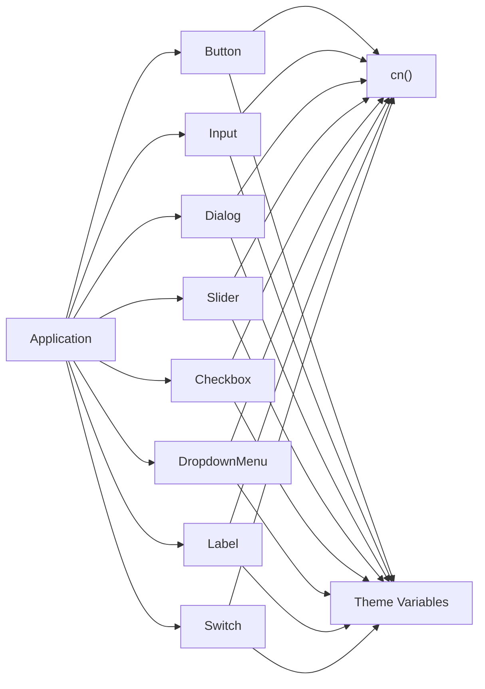

**Diagram sources**
- [button.tsx:1-50](file://src/components/ui/button.tsx#L1-L50)
- [input.tsx:1-23](file://src/components/ui/input.tsx#L1-L23)
- [dialog.tsx:1-105](file://src/components/ui/dialog.tsx#L1-L105)
- [slider.tsx:1-24](file://src/components/ui/slider.tsx#L1-L24)
- [checkbox.tsx:1-27](file://src/components/ui/checkbox.tsx#L1-L27)
- [dropdown-menu.tsx:1-188](file://src/components/ui/dropdown-menu.tsx#L1-L188)
- [label.tsx:1-22](file://src/components/ui/label.tsx#L1-L22)
- [switch.tsx:1-28](file://src/components/ui/switch.tsx#L1-L28)
- [utils.ts:1-7](file://src/lib/utils.ts#L1-L7)
- [styles.css:13-111](file://src/styles.css#L13-L111)

## Detailed Component Analysis

### Button
- Props: Inherits standard HTML button attributes plus variant and size variants; optional asChild to compose with other elements.
- Events: All standard button events (click, keydown, etc.) pass through.
- Accessibility: Focus-visible ring and disabled states are styled; when used as a child, ensure the underlying element is focusable and has appropriate role.
- Styling: Variants and sizes are driven by class-variance-authority; base styles include transitions, rounded corners, and consistent spacing.
- Theme Integration: Colors and typography come from CSS variables mapped to semantic tokens.
- Usage Patterns: Use asChild to wrap icons or custom elements; combine with form libraries by forwarding ref and value/onChange where applicable.

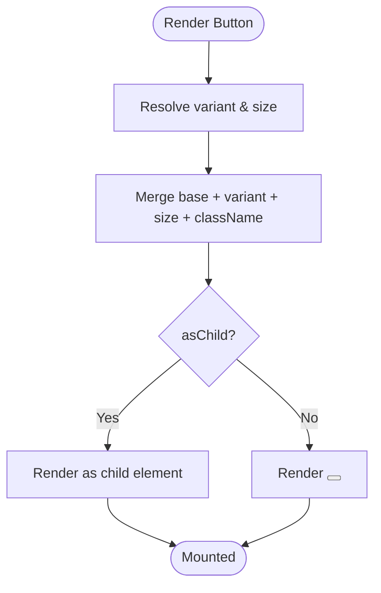

**Diagram sources**
- [button.tsx:7-49](file://src/components/ui/button.tsx#L7-L49)

**Section sources**
- [button.tsx:7-49](file://src/components/ui/button.tsx#L7-L49)

### Input
- Props: All native input attributes (type, placeholder, disabled, required, etc.).
- Events: onChange, onBlur, onFocus, onKeyDown, etc., pass through.
- Accessibility: Native semantics; pair with Label for accessible labeling.
- Styling: Consistent border, padding, focus ring, and disabled opacity; responsive text sizing.
- Theme Integration: Border, background, and text colors use theme tokens.
- Form Libraries: Works with React Hook Form, Formik, etc., by passing ref and value/onChange.

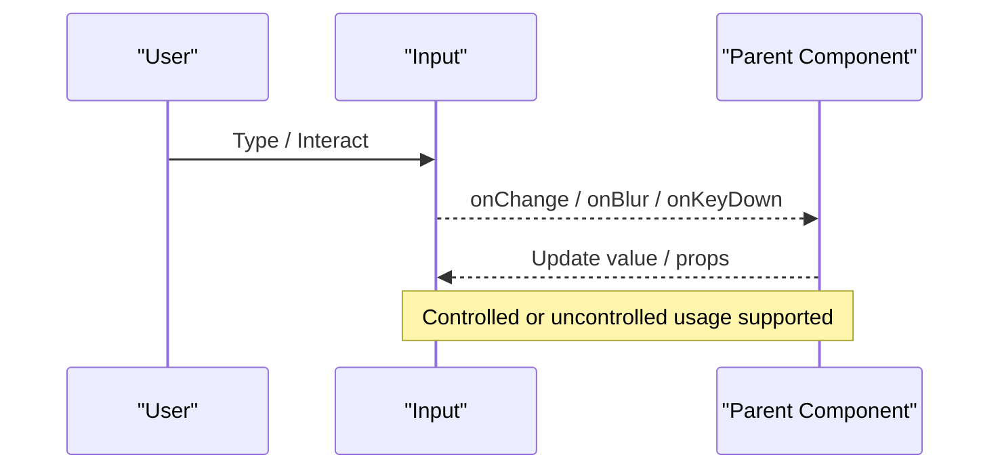

**Diagram sources**
- [input.tsx:5-20](file://src/components/ui/input.tsx#L5-L20)

**Section sources**
- [input.tsx:5-20](file://src/components/ui/input.tsx#L5-L20)

### Dialog
- Props: Root, Trigger, Portal, Overlay, Content, Header, Footer, Title, Description, Close.
- Events: Open/close lifecycle handled by Radix; custom actions can be wired into triggers and buttons inside content.
- Accessibility: Focus trap, escape-to-close, screen reader announcements via aria attributes managed by Radix; close button includes sr-only text.
- Styling: Overlay fade-in/out, content zoom and fade, responsive rounded corners; uses theme tokens for backgrounds and borders.
- Theming: Backgrounds, borders, and text colors derive from theme variables.

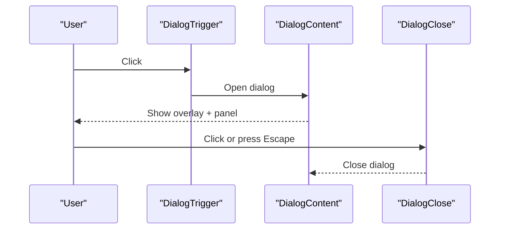

**Diagram sources**
- [dialog.tsx:9-104](file://src/components/ui/dialog.tsx#L9-L104)

**Section sources**
- [dialog.tsx:9-104](file://src/components/ui/dialog.tsx#L9-L104)

### Slider
- Props: All root slider attributes (min, max, step, value, defaultValue, disabled, orientation).
- Events: onChange/onValueChange propagate updates; keyboard navigation supported by Radix.
- Accessibility: Focusable thumb, ARIA roles and values managed by Radix; disabled state reduces opacity and disables interaction.
- Styling: Track, range, and thumb styled with theme colors; focus ring present.
- Theme Integration: Primary color used for active range and thumb border.

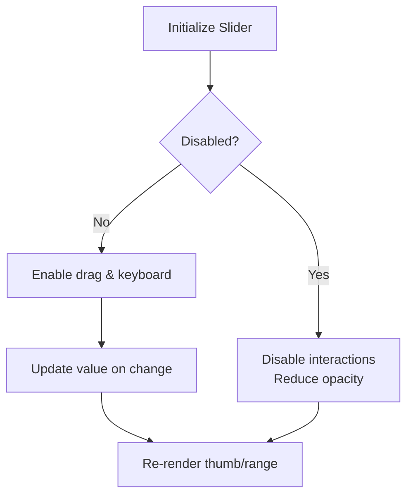

**Diagram sources**
- [slider.tsx:6-21](file://src/components/ui/slider.tsx#L6-L21)

**Section sources**
- [slider.tsx:6-21](file://src/components/ui/slider.tsx#L6-L21)

### Checkbox
- Props: All root checkbox attributes (checked, defaultChecked, disabled, name, value).
- Events: onChange toggles state; keyboard space/enter supported by Radix.
- Accessibility: ARIA attributes and focus ring managed by Radix; indicator shows check icon when checked.
- Styling: Checked state fills primary color; focus-visible ring; disabled state reduces opacity.
- Theme Integration: Uses primary and foreground tokens for checked state.

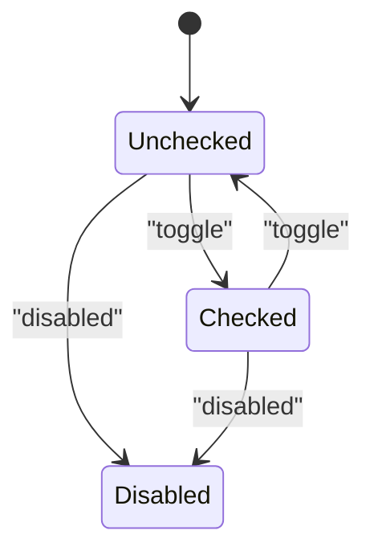

**Diagram sources**
- [checkbox.tsx:7-24](file://src/components/ui/checkbox.tsx#L7-L24)

**Section sources**
- [checkbox.tsx:7-24](file://src/components/ui/checkbox.tsx#L7-L24)

### DropdownMenu
- Props: Menu, Trigger, Content, Item, CheckboxItem, RadioItem, Group, Separator, Label, Shortcut, Sub, SubContent, SubTrigger, Portal, RadioGroup.
- Events: Items handle click; CheckboxItem/RadioItem manage selection state; Sub menus open/close automatically.
- Accessibility: Radix manages focus traversal, ARIA roles, and keyboard navigation; items are focusable and announce state changes.
- Styling: Popover-like content with animations, side-aware placement, and scrollable area; inset options for nested indentation.
- Theme Integration: Backgrounds, borders, and text colors use theme tokens.

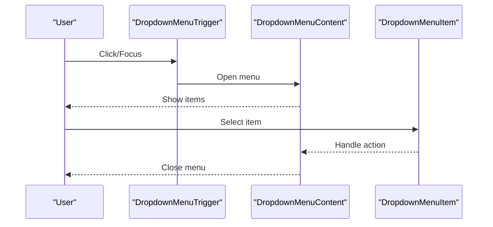

**Diagram sources**
- [dropdown-menu.tsx:9-187](file://src/components/ui/dropdown-menu.tsx#L9-L187)

**Section sources**
- [dropdown-menu.tsx:9-187](file://src/components/ui/dropdown-menu.tsx#L9-L187)

### Label
- Props: All label attributes; visually styled with font-medium and disabled peer behavior.
- Events: No direct events; associates with form controls via htmlFor or wrapping.
- Accessibility: Proper association improves screen reader experience; disabled state reflects peer disabled inputs.
- Styling: Base typography and disabled opacity; integrates with theme tokens.

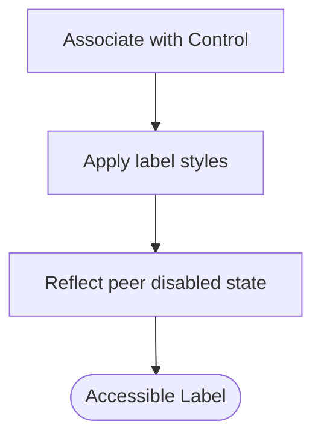

**Diagram sources**
- [label.tsx:9-19](file://src/components/ui/label.tsx#L9-L19)

**Section sources**
- [label.tsx:9-19](file://src/components/ui/label.tsx#L9-L19)

### Switch
- Props: All root switch attributes (checked, defaultChecked, disabled, name, value).
- Events: onChange toggles state; keyboard navigation supported by Radix.
- Accessibility: ARIA attributes and focus ring managed by Radix; thumb animates between states.
- Styling: Checked state uses primary color; unchecked uses input token; focus-visible ring and disabled opacity.
- Theme Integration: Uses primary and input tokens for visual states.

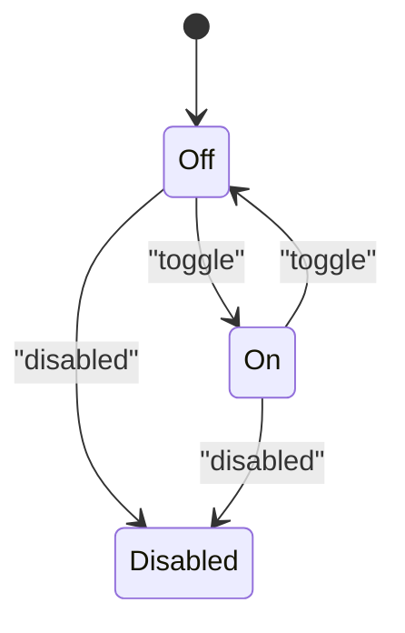

**Diagram sources**
- [switch.tsx:6-25](file://src/components/ui/switch.tsx#L6-L25)

**Section sources**
- [switch.tsx:6-25](file://src/components/ui/switch.tsx#L6-L25)

## Dependency Analysis
- Radix UI: Provides accessible primitives for Dialog, DropdownMenu, Checkbox, Slider, Switch, and Label.
- Class Variance Authority: Used by Button and Label to manage variants and sizes.
- Lucide Icons: Used within Dialog close and Checkbox indicator.
- Tailwind CSS: Utility-first styling with theme variables for colors, typography, and radii.
- Utilities: cn merges class names safely using clsx and tailwind-merge.

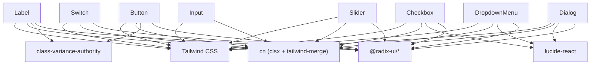

**Diagram sources**
- [button.tsx:1-50](file://src/components/ui/button.tsx#L1-L50)
- [dialog.tsx:1-105](file://src/components/ui/dialog.tsx#L1-L105)
- [dropdown-menu.tsx:1-188](file://src/components/ui/dropdown-menu.tsx#L1-L188)
- [slider.tsx:1-24](file://src/components/ui/slider.tsx#L1-L24)
- [checkbox.tsx:1-27](file://src/components/ui/checkbox.tsx#L1-L27)
- [switch.tsx:1-28](file://src/components/ui/switch.tsx#L1-L28)
- [label.tsx:1-22](file://src/components/ui/label.tsx#L1-L22)
- [input.tsx:1-23](file://src/components/ui/input.tsx#L1-L23)
- [utils.ts:1-7](file://src/lib/utils.ts#L1-L7)

**Section sources**
- [button.tsx:1-50](file://src/components/ui/button.tsx#L1-L50)
- [dialog.tsx:1-105](file://src/components/ui/dialog.tsx#L1-L105)
- [dropdown-menu.tsx:1-188](file://src/components/ui/dropdown-menu.tsx#L1-L188)
- [slider.tsx:1-24](file://src/components/ui/slider.tsx#L1-L24)
- [checkbox.tsx:1-27](file://src/components/ui/checkbox.tsx#L1-L27)
- [switch.tsx:1-28](file://src/components/ui/switch.tsx#L1-L28)
- [label.tsx:1-22](file://src/components/ui/label.tsx#L1-L22)
- [input.tsx:1-23](file://src/components/ui/input.tsx#L1-L23)
- [utils.ts:1-7](file://src/lib/utils.ts#L1-L7)

## Performance Considerations
- Prefer controlled components for forms to avoid unnecessary re-renders; debounce rapid updates for sliders and inputs if needed.
- Use asChild on Button to avoid extra wrapper nodes when composing with existing interactive elements.
- Keep Dialog and DropdownMenu content minimal; lazy-load heavy content when opening to reduce initial bundle cost.
- Avoid excessive animations; leverage provided data-state animations which are GPU-friendly.
- Use memoization for expensive computations around form validation to prevent re-renders on unrelated changes.
- Ensure images and icons are optimized; prefer SVG icons from Lucide for lightweight rendering.

[No sources needed since this section provides general guidance]

## Troubleshooting Guide
- Focus not visible: Verify focus-visible styles are not overridden; ensure components are not wrapped in non-focusable containers.
- Dialog not closing: Confirm DialogClose is used or handle escape behavior; ensure no z-index conflicts block pointer events.
- Dropdown misplacement: Check available viewport height and side offsets; consider adding padding or adjusting sideOffset.
- Slider thumb not updating: Ensure value/onChange are correctly bound; verify min/max/step constraints.
- Checkbox/Switch not toggling: Confirm controlled/uncontrolled state consistency; ensure disabled prop is not unintentionally set.
- Label not associated: Use htmlFor matching input id or wrap input within Label for automatic association.
- Theme mismatch: Verify CSS variables are loaded and tokens match expected names; confirm dark mode class if used.

**Section sources**
- [dialog.tsx:32-54](file://src/components/ui/dialog.tsx#L32-L54)
- [dropdown-menu.tsx:57-74](file://src/components/ui/dropdown-menu.tsx#L57-L74)
- [slider.tsx:6-21](file://src/components/ui/slider.tsx#L6-L21)
- [checkbox.tsx:7-24](file://src/components/ui/checkbox.tsx#L7-L24)
- [switch.tsx:6-25](file://src/components/ui/switch.tsx#L6-L25)
- [label.tsx:9-19](file://src/components/ui/label.tsx#L9-L19)
- [styles.css:13-111](file://src/styles.css#L13-L111)

## Conclusion
These primitives provide a robust, accessible, and themeable foundation for building consistent user interfaces. By leveraging Radix UI for semantics and behavior, Tailwind CSS for styling, and a centralized theme, the components remain flexible and maintainable. Follow the guidelines for props, events, accessibility, and styling to integrate them effectively with your forms and workflows.

[No sources needed since this section summarizes without analyzing specific files]