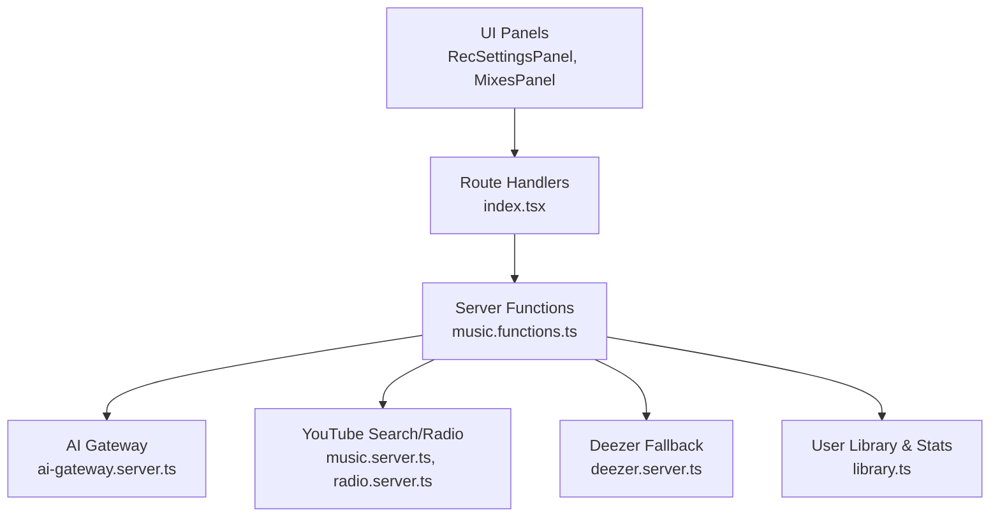
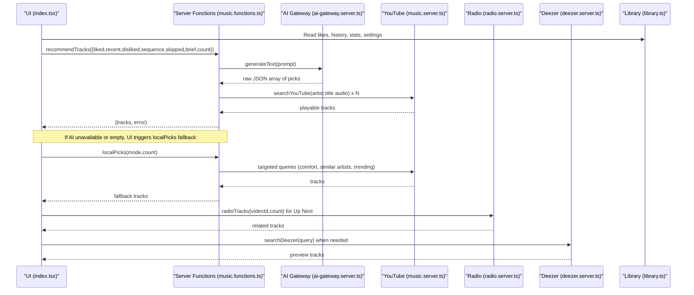
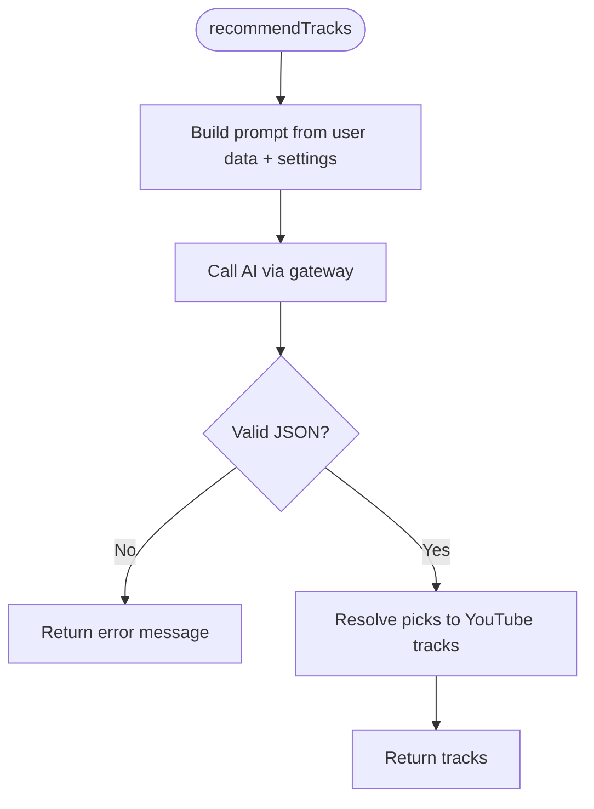
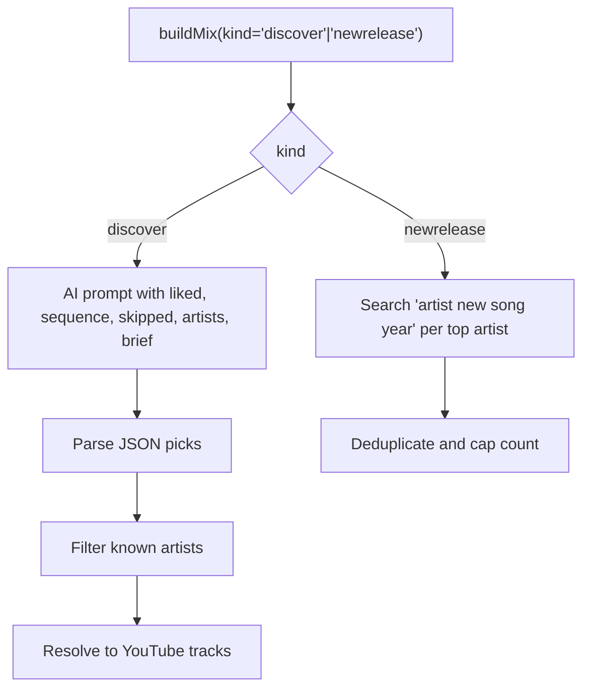
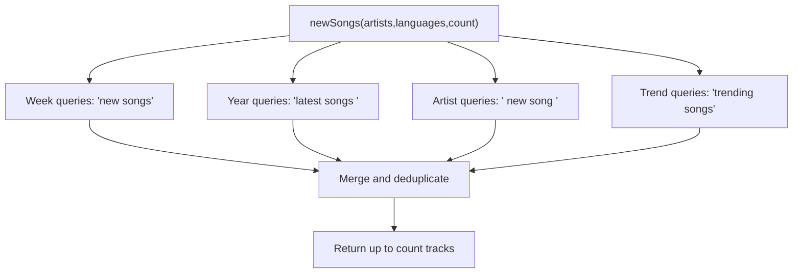
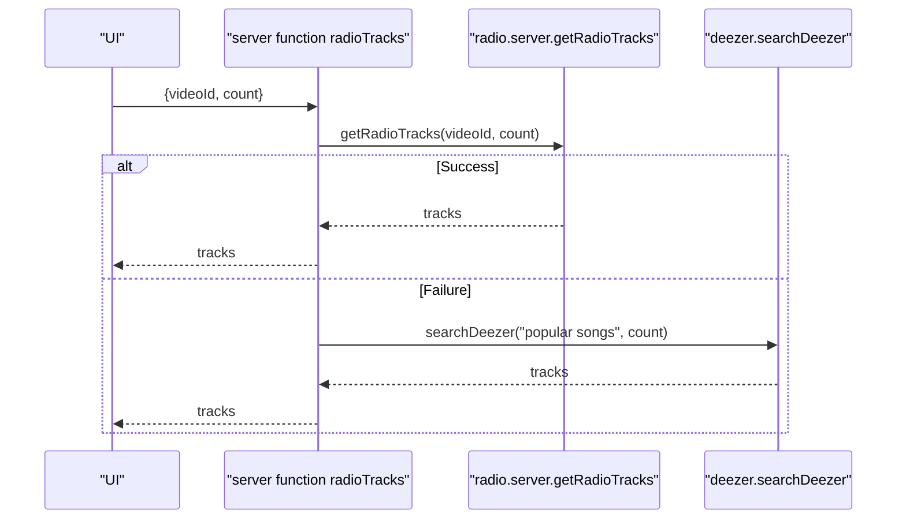
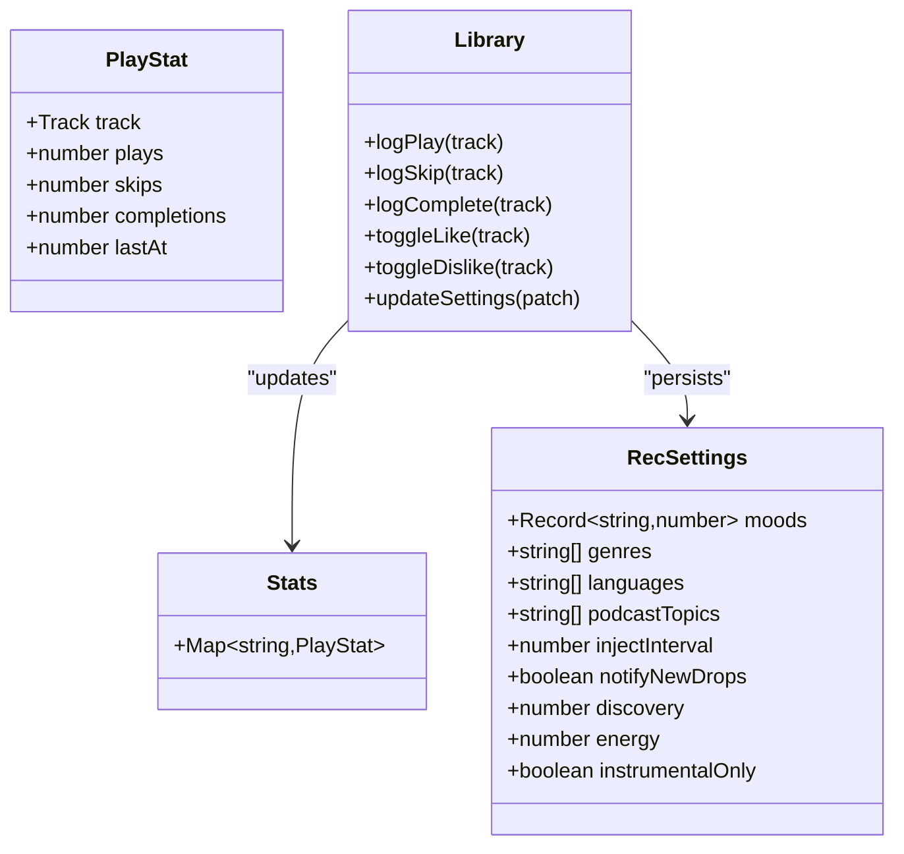
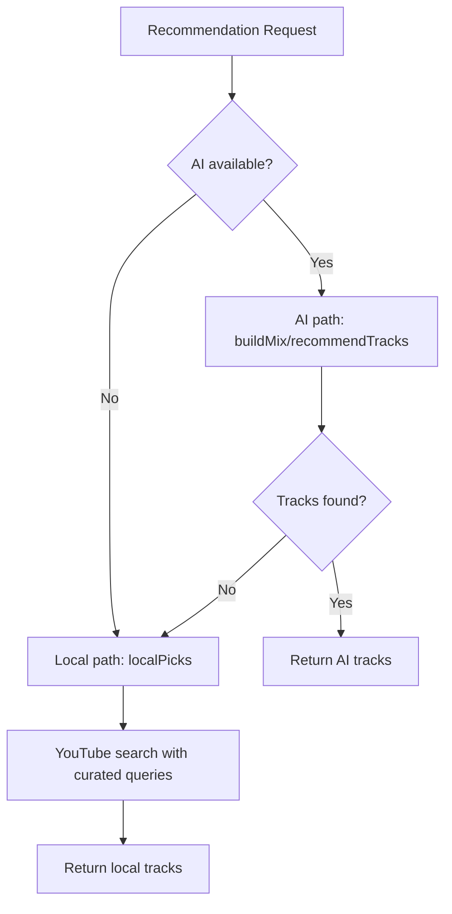
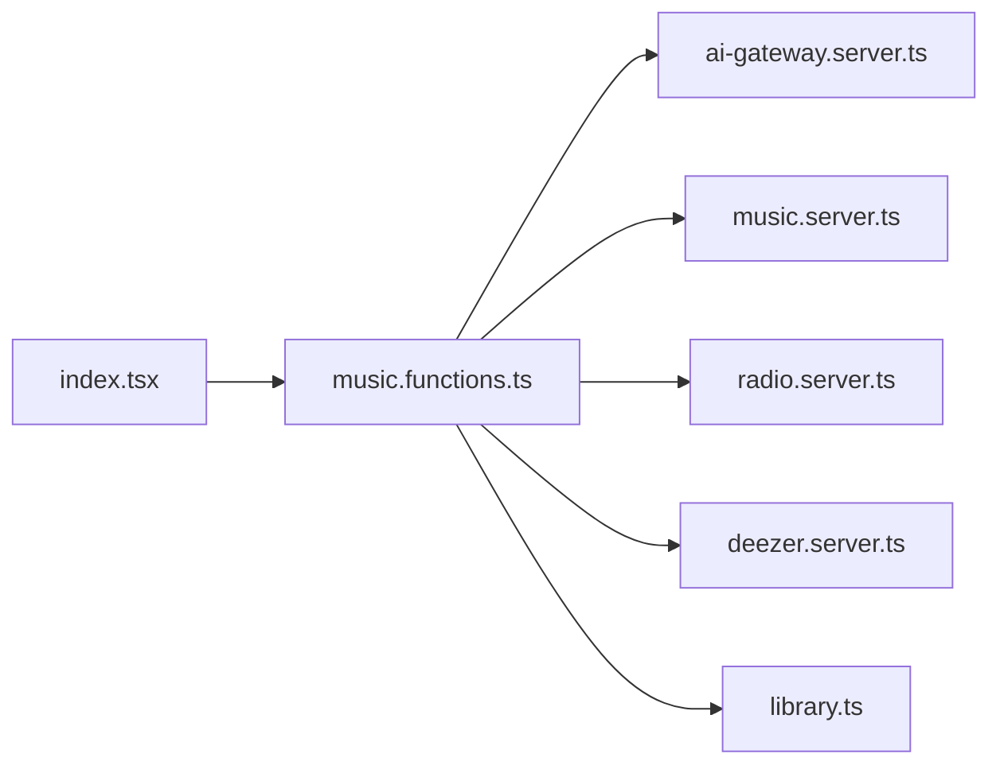

# AI Recommendation Engine

<cite>
**Referenced Files in This Document**
- [ai-gateway.server.ts](file://src/lib/ai-gateway.server.ts)
- [music.functions.ts](file://src/lib/music.functions.ts)
- [library.ts](file://src/lib/library.ts)
- [music.server.ts](file://src/lib/music.server.ts)
- [radio.server.ts](file://src/lib/radio.server.ts)
- [deezer.server.ts](file://src/lib/deezer.server.ts)
- [index.tsx](file://src/routes/index.tsx)
- [RecSettingsPanel.tsx](file://src/components/music/RecSettingsPanel.tsx)
- [MixesPanel.tsx](file://src/components/music/MixesPanel.tsx)
</cite>

## Table of Contents
1. [Introduction](#introduction)
2. [Project Structure](#project-structure)
3. [Core Components](#core-components)
4. [Architecture Overview](#architecture-overview)
5. [Detailed Component Analysis](#detailed-component-analysis)
6. [Dependency Analysis](#dependency-analysis)
7. [Performance Considerations](#performance-considerations)
8. [Troubleshooting Guide](#troubleshooting-guide)
9. [Conclusion](#conclusion)
10. [Appendices](#appendices)

## Introduction
This document explains the AI-powered recommendation engine that generates personalized music suggestions by analyzing user behavior (likes, dislikes, skips, play sequences, and listening patterns). It covers:
- The OpenAI-compatible integration via ai-gateway.server.ts
- Prompt engineering strategies and response parsing mechanisms
- Recommendation types: Discover Mix, New Release Mix, Radio Stations, Mood-based playlists, Explore New Songs, and Podcasts
- User preference learning system, taste profiling algorithms, and content scoring methods
- Examples of recommendation inputs, AI prompts, and response processing
- Configuration options, fallback mechanisms when AI services are unavailable, and performance optimization for real-time recommendations

## Project Structure
The recommendation system spans UI components, a server function layer, and integrations with YouTube and Deezer. Key modules:
- Server functions orchestrate AI calls and search queries
- Library module tracks user preferences, history, and stats
- Search and radio modules fetch tracks from YouTube and Deezer
- UI panels expose settings and mix browsing

**Diagram sources**
- [index.tsx:156-166](file://src/routes/index.tsx#L156-L166)
- [music.functions.ts:58-137](file://src/lib/music.functions.ts#L58-L137)
- [ai-gateway.server.ts:3-9](file://src/lib/ai-gateway.server.ts#L3-L9)
- [music.server.ts:182-247](file://src/lib/music.server.ts#L182-L247)
- [radio.server.ts:25-94](file://src/lib/radio.server.ts#L25-L94)
- [deezer.server.ts:39-74](file://src/lib/deezer.server.ts#L39-L74)
- [library.ts:242-557](file://src/lib/library.ts#L242-L557)

**Section sources**
- [index.tsx:156-166](file://src/routes/index.tsx#L156-L166)
- [music.functions.ts:58-137](file://src/lib/music.functions.ts#L58-L137)
- [ai-gateway.server.ts:3-9](file://src/lib/ai-gateway.server.ts#L3-L9)
- [music.server.ts:182-247](file://src/lib/music.server.ts#L182-L247)
- [radio.server.ts:25-94](file://src/lib/radio.server.ts#L25-L94)
- [deezer.server.ts:39-74](file://src/lib/deezer.server.ts#L39-L74)
- [library.ts:242-557](file://src/lib/library.ts#L242-L557)

## Core Components
- AI Gateway Provider: Creates an OpenAI-compatible provider to call the hosted gateway with API key headers.
- Server Functions: Encapsulate recommendation logic, prompt construction, AI invocation, JSON parsing, and track resolution.
- User Library: Persists likes/dislikes/history/settings/stats; computes briefs and scores for taste profiling.
- Search and Radio: YouTube scraping with caching and filtering; radio using YouTube’s built-in “RD” playlist; Deezer preview fallback.
- UI Panels: Settings panel for mood weighting, genres, languages, energy, discovery level; Mixes panel for discovering mixes.

**Section sources**
- [ai-gateway.server.ts:3-9](file://src/lib/ai-gateway.server.ts#L3-L9)
- [music.functions.ts:58-137](file://src/lib/music.functions.ts#L58-L137)
- [library.ts:68-103](file://src/lib/library.ts#L68-L103)
- [library.ts:563-645](file://src/lib/library.ts#L563-L645)
- [music.server.ts:52-75](file://src/lib/music.server.ts#L52-L75)
- [radio.server.ts:25-94](file://src/lib/radio.server.ts#L25-L94)
- [deezer.server.ts:39-74](file://src/lib/deezer.server.ts#L39-L74)
- [RecSettingsPanel.tsx:17-284](file://src/components/music/RecSettingsPanel.tsx#L17-L284)
- [MixesPanel.tsx:10-46](file://src/components/music/MixesPanel.tsx#L10-L46)

## Architecture Overview
End-to-end flow for generating personalized recommendations:

**Diagram sources**
- [index.tsx:612-650](file://src/routes/index.tsx#L612-L650)
- [music.functions.ts:58-137](file://src/lib/music.functions.ts#L58-L137)
- [ai-gateway.server.ts:3-9](file://src/lib/ai-gateway.server.ts#L3-L9)
- [music.server.ts:182-247](file://src/lib/music.server.ts#L182-L247)
- [radio.server.ts:25-94](file://src/lib/radio.server.ts#L25-L94)
- [deezer.server.ts:39-74](file://src/lib/deezer.server.ts#L39-L74)
- [library.ts:563-645](file://src/lib/library.ts#L563-L645)

## Detailed Component Analysis

### AI Gateway Integration
- Purpose: Provide an OpenAI-compatible client to call the hosted gateway with a custom API key header.
- Behavior: Returns a provider configured with name, base URL, and headers used by the AI SDK.

**Section sources**
- [ai-gateway.server.ts:3-9](file://src/lib/ai-gateway.server.ts#L3-L9)

### Recommendation Server Function (For You Feed)
- Input: liked/recent/disliked lists, sequence of recent actions, skipped labels, optional mood, brief from settings, count.
- Prompt Engineering:
  - Describes sonic DNA mapping and sequential behavior reading
  - Includes loved songs, recent plays, session sequence, repeated skips, disliked songs
  - Adds tuning preferences (moods, genres, languages, discovery vs familiarity, energy, instrumental-only)
  - Requests balanced output: comfort, forgotten favorites, new artists; no repeats
  - Enforces strict JSON array format with title, artist, reason
- AI Call: Uses the gateway provider to call the model
- Response Parsing: Extracts JSON array, validates entries, resolves each pick to a playable track via YouTube search
- Error Handling: Maps HTTP errors (rate limits, credits) to user-friendly messages

**Diagram sources**
- [music.functions.ts:58-137](file://src/lib/music.functions.ts#L58-L137)

**Section sources**
- [music.functions.ts:58-137](file://src/lib/music.functions.ts#L58-L137)

### Discover Mix and New Release Mix
- Discover Mix:
  - Uses AI to find new artists close to listener’s sonic profile
  - Excludes known artists; enforces unique artists per batch
  - Resolves picks to YouTube tracks
- New Release Mix:
  - Searches for latest releases from top artists without AI
  - Aggregates results per artist with deduplication

**Diagram sources**
- [music.functions.ts:156-245](file://src/lib/music.functions.ts#L156-L245)

**Section sources**
- [music.functions.ts:156-245](file://src/lib/music.functions.ts#L156-L245)

### Explore New Songs and Podcasts
- Explore New Songs:
  - Language-aware searches for fresh uploads this week, latest this year, trending
  - Incorporates top artists’ new releases
  - No AI required
- Podcasts:
  - Topic-driven or language-focused searches for new episodes and top shows
  - Streams audio-only like any other track

**Diagram sources**
- [music.functions.ts:398-458](file://src/lib/music.functions.ts#L398-L458)

**Section sources**
- [music.functions.ts:398-458](file://src/lib/music.functions.ts#L398-L458)

### Radio Stations (Up Next)
- Uses YouTube’s built-in radio (“RD” playlist) to get similar tracks based on current video
- Falls back to Deezer trending if YouTube radio fails

**Diagram sources**
- [music.functions.ts:571-580](file://src/lib/music.functions.ts#L571-L580)
- [radio.server.ts:25-94](file://src/lib/radio.server.ts#L25-L94)
- [music-hybrid.server.ts:54-78](file://src/lib/music-hybrid.server.ts#L54-L78)

**Section sources**
- [music.functions.ts:571-580](file://src/lib/music.functions.ts#L571-L580)
- [radio.server.ts:25-94](file://src/lib/radio.server.ts#L25-L94)
- [music-hybrid.server.ts:54-78](file://src/lib/music-hybrid.server.ts#L54-L78)

### Mood-Based Playlists
- Curated mood queries mapped to YouTube search terms
- Instant generation without AI; robust fallback if search fails

**Section sources**
- [music.functions.ts:583-610](file://src/lib/music.functions.ts#L583-L610)

### User Preference Learning System and Taste Profiling
- Behavioral Signals:
  - Tracks plays, skips, completions per song with timestamps
  - Maintains ordered history and deduplicated likes/dislikes
  - Syncs to cloud account when signed in; merges device and cloud data
- Scoring Algorithms:
  - Replay Mix: weighted score combining plays, completions, skips, recency
  - Top Artists: aggregated score from plays/completions/skips plus like boosts
  - Skipped Labels: identifies strongly disliked sounds to avoid
  - Sequence Brief: recent sessions with actions (played, skipped, replayed)
- Settings Brief:
  - Converts moods, genres, languages, discovery vs familiarity, energy, instrumental-only into a natural-language brief for AI

**Diagram sources**
- [library.ts:68-103](file://src/lib/library.ts#L68-L103)
- [library.ts:112-121](file://src/lib/library.ts#L112-L121)
- [library.ts:353-411](file://src/lib/library.ts#L353-L411)
- [library.ts:593-645](file://src/lib/library.ts#L593-L645)

**Section sources**
- [library.ts:68-103](file://src/lib/library.ts#L68-L103)
- [library.ts:353-411](file://src/lib/library.ts#L353-L411)
- [library.ts:593-645](file://src/lib/library.ts#L593-L645)

### Recommendation Inputs, Prompts, and Response Processing Examples
- Inputs:
  - Liked songs (labels), recent plays (labels), disliked songs (labels)
  - Sequence of recent actions with outcomes
  - Skipped labels to steer away from certain sounds
  - Optional mood request and settings brief
  - Count of desired recommendations
- Prompts:
  - For For You feed: combines sonic DNA description, liked/recent, sequence, skipped, disliked, mood, brief, balance instructions, JSON format enforcement
  - For Discover Mix: focuses on new artists close to sonic profile, excludes known artists, JSON format enforcement
- Response Processing:
  - Extracts JSON array from AI text
  - Validates entries (title, artist)
  - Resolves each pick to a playable YouTube track
  - Attaches reason strings for display

**Section sources**
- [music.functions.ts:58-137](file://src/lib/music.functions.ts#L58-L137)
- [music.functions.ts:156-245](file://src/lib/music.functions.ts#L156-L245)
- [library.ts:563-645](file://src/lib/library.ts#L563-L645)

### Fallback Mechanisms When AI Services Are Unavailable
- Local Picks:
  - Mirrors YouTube Music balance: comfort hits, similar artists, older favorites
  - Modes: feed, discover, nextup
  - Uses YouTube search with curated queries
- Hybrid Search/Radio:
  - YouTube primary, Deezer fallback for search and radio
  - Ensures playable content even when one source fails

**Diagram sources**
- [music.functions.ts:324-369](file://src/lib/music.functions.ts#L324-L369)
- [music-hybrid.server.ts:22-49](file://src/lib/music-hybrid.server.ts#L22-L49)
- [music-hybrid.server.ts:54-78](file://src/lib/music-hybrid.server.ts#L54-L78)

**Section sources**
- [music.functions.ts:324-369](file://src/lib/music.functions.ts#L324-L369)
- [music-hybrid.server.ts:22-49](file://src/lib/music-hybrid.server.ts#L22-L49)
- [music-hybrid.server.ts:54-78](file://src/lib/music-hybrid.server.ts#L54-L78)

## Dependency Analysis
Key dependencies and relationships:
- UI depends on server functions for all recommendation flows
- Server functions depend on AI gateway for AI-powered paths
- Search and radio modules depend on external services (YouTube, Deezer)
- Library module provides persistent state and derived metrics used across flows

**Diagram sources**
- [index.tsx:156-166](file://src/routes/index.tsx#L156-L166)
- [music.functions.ts:58-137](file://src/lib/music.functions.ts#L58-L137)
- [ai-gateway.server.ts:3-9](file://src/lib/ai-gateway.server.ts#L3-L9)
- [music.server.ts:182-247](file://src/lib/music.server.ts#L182-L247)
- [radio.server.ts:25-94](file://src/lib/radio.server.ts#L25-L94)
- [deezer.server.ts:39-74](file://src/lib/deezer.server.ts#L39-L74)
- [library.ts:242-557](file://src/lib/library.ts#L242-L557)

**Section sources**
- [index.tsx:156-166](file://src/routes/index.tsx#L156-L166)
- [music.functions.ts:58-137](file://src/lib/music.functions.ts#L58-L137)
- [ai-gateway.server.ts:3-9](file://src/lib/ai-gateway.server.ts#L3-L9)
- [music.server.ts:182-247](file://src/lib/music.server.ts#L182-L247)
- [radio.server.ts:25-94](file://src/lib/radio.server.ts#L25-L94)
- [deezer.server.ts:39-74](file://src/lib/deezer.server.ts#L39-L74)
- [library.ts:242-557](file://src/lib/library.ts#L242-L557)

## Performance Considerations
- Caching:
  - In-memory LRU cache for YouTube search results with TTL to reduce redundant requests
- Concurrency:
  - Parallel resolution of AI picks to YouTube tracks via Promise.all
  - Parallel search across multiple sources (YouTube and Deezer) where applicable
- Quotas and Limits:
  - Caps on input arrays (liked/recent/disliked/sequence) to control prompt size and processing time
  - Limit counts for generated tracks to bound response size
- Fallback Efficiency:
  - Quick switch to localPicks when AI is unavailable or returns empty
  - Hybrid search/radio ensures playable content even under failures
- Streaming and Playback:
  - Direct Deezer preview URLs bypass proxies for faster playback
  - Episode position tracking minimizes re-buffering for long-form content

[No sources needed since this section provides general guidance]

## Troubleshooting Guide
Common issues and resolutions:
- AI not configured:
  - Symptom: “AI is not configured yet.”
  - Resolution: Set environment variable for the gateway API key
- Rate limiting:
  - Symptom: “Too many requests — try again shortly.”
  - Resolution: Retry after delay; consider reducing request frequency
- Credits exhausted:
  - Symptom: “AI credits are exhausted — add credits...”
  - Resolution: Add credits to the gateway account
- Network failures:
  - Symptom: “Could not reach the music catalog.”
  - Resolution: Check connectivity; rely on hybrid fallback to Deezer
- Empty results:
  - Symptom: No tracks returned
  - Resolution: Use localPicks fallback; adjust settings (moods, genres, languages); refresh mixes

**Section sources**
- [music.functions.ts:58-137](file://src/lib/music.functions.ts#L58-L137)
- [music.functions.ts:156-245](file://src/lib/music.functions.ts#L156-L245)
- [music-hybrid.server.ts:22-49](file://src/lib/music-hybrid.server.ts#L22-L49)

## Conclusion
The recommendation engine blends AI-driven personalization with robust local heuristics and reliable external sources. It learns from user behavior through detailed stats and settings, constructs precise prompts, parses structured responses, and resolves picks to playable tracks. Fallback mechanisms ensure continuous operation even when AI services are down, while performance optimizations keep recommendations responsive and efficient.

[No sources needed since this section summarizes without analyzing specific files]

## Appendices

### Configuration Options
- Environment:
  - LOVABLE_API_KEY: Required for AI-powered paths
- User Settings:
  - Moods: Weighted sliders influence tone and style
  - Genres/Languages: Filter scope for recommendations
  - Discovery vs Familiarity: Balance between comfort and exploration
  - Energy: Target calm to energetic spectrum
  - Instrumental Only: Restrict to vocal-free tracks
  - Inject Interval: Periodically insert fresh releases into queue
  - Notify New Drops: Browser notifications for favorite artists’ new songs

**Section sources**
- [library.ts:68-103](file://src/lib/library.ts#L68-L103)
- [RecSettingsPanel.tsx:17-284](file://src/components/music/RecSettingsPanel.tsx#L17-L284)

### Example Workflows
- For You Feed:
  - Inputs: liked/recent/disliked, sequence, skipped, brief, count
  - AI prompt includes sonic DNA, behavioral context, tuning preferences
  - Output: JSON array resolved to playable tracks
- Discover Mix:
  - Inputs: liked, sequence, skipped, known artists, brief, count
  - AI prompt emphasizes new artists close to profile
  - Output: JSON array filtered against known artists and resolved
- New Release Mix:
  - Inputs: top artists, count
  - Process: search “artist new song year”, deduplicate
  - Output: latest drops from listened artists
- Radio Stations:
  - Inputs: current videoId, count
  - Process: YouTube RD playlist; fallback to Deezer trending
  - Output: related tracks for Up Next
- Mood Playlists:
  - Inputs: mood string
  - Process: map to curated YouTube query
  - Output: mood-aligned tracks

**Section sources**
- [music.functions.ts:58-137](file://src/lib/music.functions.ts#L58-L137)
- [music.functions.ts:156-245](file://src/lib/music.functions.ts#L156-L245)
- [music.functions.ts:398-458](file://src/lib/music.functions.ts#L398-L458)
- [music.functions.ts:571-580](file://src/lib/music.functions.ts#L571-L580)
- [music.functions.ts:583-610](file://src/lib/music.functions.ts#L583-L610)