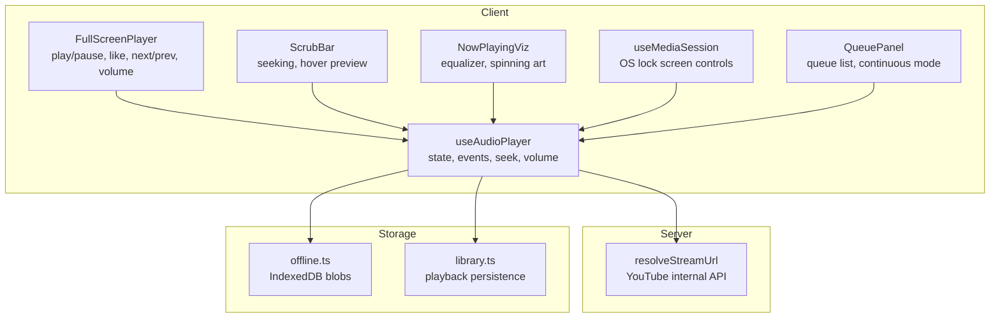
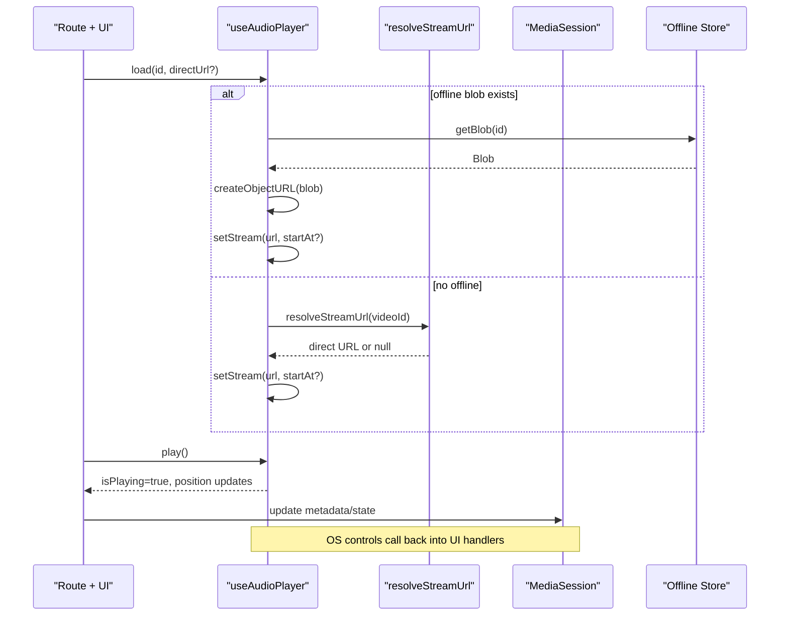
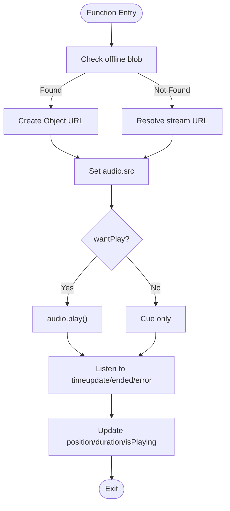
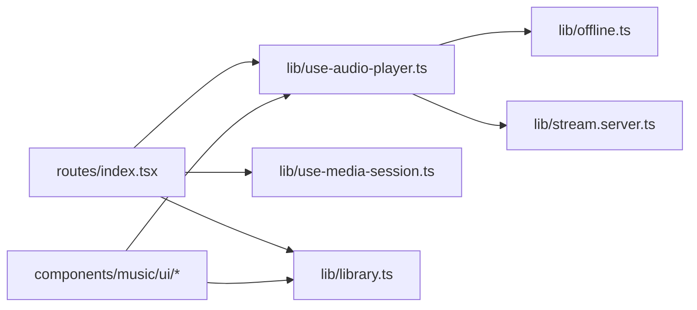

# Audio Player & Playback System

<cite>
**Referenced Files in This Document**
- [use-audio-player.ts](file://src/lib/use-audio-player.ts)
- [FullScreenPlayer.tsx](file://src/components/music/ui/FullScreenPlayer.tsx)
- [ScrubBar.tsx](file://src/components/music/ScrubBar.tsx)
- [NowPlayingViz.tsx](file://src/components/music/NowPlayingViz.tsx)
- [stream.server.ts](file://src/lib/stream.server.ts)
- [use-media-session.ts](file://src/lib/use-media-session.ts)
- [library.ts](file://src/lib/library.ts)
- [index.tsx](file://src/routes/index.tsx)
- [offline.ts](file://src/lib/offline.ts)
- [sw.js](file://public/sw.js)
</cite>

## Table of Contents
1. [Introduction](#introduction)
2. [Project Structure](#project-structure)
3. [Core Components](#core-components)
4. [Architecture Overview](#architecture-overview)
5. [Detailed Component Analysis](#detailed-component-analysis)
6. [Dependency Analysis](#dependency-analysis)
7. [Performance Considerations](#performance-considerations)
8. [Troubleshooting Guide](#troubleshooting-guide)
9. [Conclusion](#conclusion)
10. [Appendices](#appendices)

## Introduction
This document explains the audio player and playback system powering the music application. It covers:
- The custom React hook that manages audio state, progress tracking, and cross-platform compatibility
- The full-screen player UI with visualization and scrubbing
- The stream proxy that resolves direct audio URLs from YouTube to avoid ads and enable background playback
- Queue management, auto-extension logic, and media session integration for mobile devices
- Examples of initialization, event handling, and state synchronization across components
- Browser compatibility, memory management, and performance optimization for long listening sessions

## Project Structure
The audio system is composed of a client-side player hook, UI components, a server-side stream resolver, and integrations for offline playback and OS media controls.

**Diagram sources**
- [use-audio-player.ts:16-212](file://src/lib/use-audio-player.ts#L16-L212)
- [FullScreenPlayer.tsx:26-257](file://src/components/music/ui/FullScreenPlayer.tsx#L26-L257)
- [ScrubBar.tsx:5-145](file://src/components/music/ScrubBar.tsx#L5-L145)
- [NowPlayingViz.tsx:4-63](file://src/components/music/NowPlayingViz.tsx#L4-L63)
- [stream.server.ts:108-122](file://src/lib/stream.server.ts#L108-L122)
- [use-media-session.ts:13-81](file://src/lib/use-media-session.ts#L13-L81)
- [offline.ts:58-95](file://src/lib/offline.ts#L58-L95)
- [library.ts:151-166](file://src/lib/library.ts#L151-L166)

**Section sources**
- [use-audio-player.ts:16-212](file://src/lib/use-audio-player.ts#L16-L212)
- [FullScreenPlayer.tsx:26-257](file://src/components/music/ui/FullScreenPlayer.tsx#L26-L257)
- [ScrubBar.tsx:5-145](file://src/components/music/ScrubBar.tsx#L5-L145)
- [NowPlayingViz.tsx:4-63](file://src/components/music/NowPlayingViz.tsx#L4-L63)
- [stream.server.ts:108-122](file://src/lib/stream.server.ts#L108-L122)
- [use-media-session.ts:13-81](file://src/lib/use-media-session.ts#L13-L81)
- [offline.ts:58-95](file://src/lib/offline.ts#L58-L95)
- [library.ts:151-166](file://src/lib/library.ts#L151-L166)

## Core Components
- useAudioPlayer: HTML5 <audio>-based hook exposing load/cue/play/pause/seek/volume, position/duration state, and error/ended callbacks. Supports offline playback via IndexedDB blobs and streaming through a same-origin proxy.
- FullScreenPlayer: Rich UI for current track, progress bar, controls (play/pause, previous/next), volume slider, and toggles for lyrics/queue.
- ScrubBar: Seekable progress bar with hover thumbnail/time preview and keyboard navigation.
- NowPlayingViz: Visual indicators (equalizer bars, spinning artwork) that animate only while playing.
- Stream Proxy: Server function that resolves ad-free, playable audio URLs from YouTube using internal endpoints, probing ranges to ensure they work.
- Media Session: Bridges OS-level media controls (lock screen, headset) to app actions.
- Queue Management: Tracks upcoming tracks, supports continuous mode, and auto-extends by fetching more recommendations when the queue ends.
- Offline Storage: Downloads and plays audio from IndexedDB when available; service worker avoids caching large streams.

**Section sources**
- [use-audio-player.ts:16-212](file://src/lib/use-audio-player.ts#L16-L212)
- [FullScreenPlayer.tsx:26-257](file://src/components/music/ui/FullScreenPlayer.tsx#L26-L257)
- [ScrubBar.tsx:5-145](file://src/components/music/ScrubBar.tsx#L5-L145)
- [NowPlayingViz.tsx:4-63](file://src/components/music/NowPlayingViz.tsx#L4-L63)
- [stream.server.ts:108-122](file://src/lib/stream.server.ts#L108-L122)
- [use-media-session.ts:13-81](file://src/lib/use-media-session.ts#L13-L81)
- [index.tsx:473-584](file://src/routes/index.tsx#L473-L584)
- [index.tsx:716-750](file://src/routes/index.tsx#L716-L750)
- [offline.ts:58-95](file://src/lib/offline.ts#L58-L95)
- [sw.js:33-48](file://public/sw.js#L33-L48)

## Architecture Overview
The playback flow uses a small set of coordinated pieces:
- The route component initializes the player, loads the current track, and persists playback state.
- The player hook manages an HTML5 audio element, listens to events, and exposes methods to control playback.
- When loading a track, it first tries offline playback; if unavailable, it requests a direct stream URL via the server proxy or uses a direct URL if provided.
- The UI components render controls and visuals bound to the player’s state.
- Media session keeps OS controls synchronized.
- When the queue ends, the app extends it automatically.

**Diagram sources**
- [use-audio-player.ts:104-172](file://src/lib/use-audio-player.ts#L104-L172)
- [stream.server.ts:108-122](file://src/lib/stream.server.ts#L108-L122)
- [use-media-session.ts:20-80](file://src/lib/use-media-session.ts#L20-L80)
- [offline.ts:85-95](file://src/lib/offline.ts#L85-L95)
- [index.tsx:542-575](file://src/routes/index.tsx#L542-L575)

## Detailed Component Analysis

### useAudioPlayer Hook
Responsibilities:
- Create and manage a single HTML5 <audio> element
- Track isPlaying, position, duration
- Handle ended and error events
- Support autoplay gating via wantPlayRef
- Load network streams via /api/stream/:id or direct URLs
- Prefer offline playback from IndexedDB when available
- Provide cue/load/play/pause/seek/setVolume APIs
- Clean up object URLs and detach listeners on unmount

Key behaviors:
- Autoplay: Only starts when wantPlayRef is true; otherwise cues without playing
- Seeking: Attaches a one-time listener to set currentTime after metadata loads
- Error handling: Emits a message to the consumer; auto-advance is handled at the route level
- Memory: Revokes object URLs and clears src/load on cleanup

**Diagram sources**
- [use-audio-player.ts:104-172](file://src/lib/use-audio-player.ts#L104-L172)
- [use-audio-player.ts:42-101](file://src/lib/use-audio-player.ts#L42-L101)

**Section sources**
- [use-audio-player.ts:16-212](file://src/lib/use-audio-player.ts#L16-L212)

### FullScreenPlayer Component
Responsibilities:
- Display album art, title, artist
- Render progress bar with click-to-seek
- Expose play/pause, previous/next, like toggle, volume slider
- Toggle lyrics and queue panels

Integration points:
- Uses formatTime from the player hook
- Calls props for play/pause, seek, volume changes
- Displays visual feedback based on isPlaying

Accessibility:
- aria-labels for buttons and progress bar
- Keyboard focusable elements where applicable

**Section sources**
- [FullScreenPlayer.tsx:26-257](file://src/components/music/ui/FullScreenPlayer.tsx#L26-L257)

### ScrubBar Component
Responsibilities:
- Render seekable progress bar with hover thumbnail and timestamp preview
- Debounce seeking during drag using requestAnimationFrame
- Support keyboard seeking (arrows, Home/End)

Performance:
- Throttles frequent seeks during dragging to reduce re-renders and network churn

**Section sources**
- [ScrubBar.tsx:5-145](file://src/components/music/ScrubBar.tsx#L5-L145)

### NowPlayingViz Components
- Equalizer: Animated bars that move only when active
- SpinningArt: Rotating artwork with glow effects while playing

These are presentational and driven by isPlaying state passed from the player context.

**Section sources**
- [NowPlayingViz.tsx:4-63](file://src/components/music/NowPlayingViz.tsx#L4-L63)

### Stream Proxy (Server-Side)
Purpose:
- Resolve direct, ad-free audio URLs from YouTube using internal player endpoints
- Try multiple client configs to improve reliability
- Probe returned URLs with a Range request to ensure they stream
- Return best audio-only format (prefer 128kbps m4a)

Behavior:
- Retries across clients with short delays
- Skips non-playable videos (age-restricted, region-blocked)
- Returns null if no valid URL can be verified

**Section sources**
- [stream.server.ts:14-122](file://src/lib/stream.server.ts#L14-L122)

### Media Session Integration
Purpose:
- Sync OS/lock-screen media controls with app playback
- Update metadata (title, artist, artwork) and playback state
- Handle play/pause/next/previous/seek actions from device controls

Error handling:
- Wraps action handler registration in try/catch with warnings
- Clears all handlers on cleanup

**Section sources**
- [use-media-session.ts:13-81](file://src/lib/use-media-session.ts#L13-L81)

### Queue Management and Auto-Extension
Responsibilities:
- Maintain current index and queue array
- On track end, advance to next track or extend queue if at end
- Extend queue by fetching radio picks or AI/local fallbacks
- Persist queue and position periodically to resume later

Auto-extension flow:
- After last track, fetch similar tracks or recommendations
- Append unique tracks to queue and set index to new length

**Section sources**
- [index.tsx:473-584](file://src/routes/index.tsx#L473-L584)
- [index.tsx:716-750](file://src/routes/index.tsx#L716-L750)
- [library.ts:151-166](file://src/lib/library.ts#L151-L166)

### Offline Playback
- Downloads are stored as blobs in IndexedDB
- Player prefers offline playback when available
- Service worker bypasses cache for audio streams to avoid bloating storage

**Section sources**
- [offline.ts:58-95](file://src/lib/offline.ts#L58-L95)
- [sw.js:33-48](file://public/sw.js#L33-L48)

## Dependency Analysis
High-level dependencies between modules:

**Diagram sources**
- [index.tsx:473-584](file://src/routes/index.tsx#L473-L584)
- [use-audio-player.ts:16-212](file://src/lib/use-audio-player.ts#L16-L212)
- [use-media-session.ts:13-81](file://src/lib/use-media-session.ts#L13-L81)
- [library.ts:151-166](file://src/lib/library.ts#L151-L166)
- [offline.ts:58-95](file://src/lib/offline.ts#L58-L95)
- [stream.server.ts:108-122](file://src/lib/stream.server.ts#L108-L122)

**Section sources**
- [index.tsx:473-584](file://src/routes/index.tsx#L473-L584)
- [use-audio-player.ts:16-212](file://src/lib/use-audio-player.ts#L16-L212)
- [use-media-session.ts:13-81](file://src/lib/use-media-session.ts#L13-L81)
- [library.ts:151-166](file://src/lib/library.ts#L151-L166)
- [offline.ts:58-95](file://src/lib/offline.ts#L58-L95)
- [stream.server.ts:108-122](file://src/lib/stream.server.ts#L108-L122)

## Performance Considerations
- Event throttling: ScrubBar uses requestAnimationFrame to throttle seeks during drag, reducing unnecessary re-renders and network requests.
- Autoplay gating: Prevents browser policy errors by deferring play until user interaction or explicit play call.
- Memory hygiene:
  - Revoke object URLs when replaced or on unmount
  - Clear audio src and load to release resources
  - Avoid caching large audio streams in the service worker
- Network efficiency:
  - Prefer offline playback when available
  - Probe stream URLs before use to avoid dead links
  - Use bounded range requests via the proxy to support seeking and mitigate throttling
- Long sessions:
  - Periodic persistence of queue and position to survive reloads
  - Graceful error handling with limited auto-skip attempts to prevent rapid skip loops

[No sources needed since this section provides general guidance]

## Troubleshooting Guide
Common issues and resolutions:
- Playback blocked by autoplay policy: Ensure user gesture triggers play; the hook warns and waits for manual resume.
- Song unavailable: The hook emits an error; the route handles a single auto-skip attempt and stops after consecutive failures to let the user decide.
- No sound after switching tracks: Verify audio element has a valid src and that metadata loaded; the hook sets currentTime after metadata when resuming.
- Offline playback not working: Confirm IndexedDB availability and that a blob exists for the track id.
- OS controls not updating: Ensure MediaSession metadata and playback state are updated; check for unsupported environments.

**Section sources**
- [use-audio-player.ts:56-67](file://src/lib/use-audio-player.ts#L56-L67)
- [index.tsx:473-511](file://src/routes/index.tsx#L473-L511)
- [use-media-session.ts:47-80](file://src/lib/use-media-session.ts#L47-L80)
- [offline.ts:24-41](file://src/lib/offline.ts#L24-L41)

## Conclusion
The playback system combines a robust HTML5-based player hook, a resilient server-side stream resolver, and a polished UI to deliver ad-free, background-capable audio playback. It integrates seamlessly with OS media controls, supports offline listening, and includes safeguards for long sessions such as memory cleanup, throttled seeking, and persistent queue state. The design separates concerns cleanly, making it straightforward to extend features like auto-extension, analytics, or additional source providers.

[No sources needed since this section summarizes without analyzing specific files]

## Appendices

### Initialization Example (Conceptual)
- Create the player with onEnded and onError callbacks
- When current track changes, cue or load depending on whether you want immediate playback
- Bind UI controls to player methods and keep MediaSession in sync

**Section sources**
- [index.tsx:473-584](file://src/routes/index.tsx#L473-L584)
- [use-audio-player.ts:142-172](file://src/lib/use-audio-player.ts#L142-L172)
- [use-media-session.ts:20-80](file://src/lib/use-media-session.ts#L20-L80)

### State Synchronization Across Components
- Player hook exposes isPlaying, position, duration
- FullScreenPlayer and ScrubBar read these values and call back into player methods
- MediaSession mirrors state for OS controls
- Queue panel reflects current index and offers jump/remove operations

**Section sources**
- [use-audio-player.ts:37-40](file://src/lib/use-audio-player.ts#L37-L40)
- [FullScreenPlayer.tsx:26-257](file://src/components/music/ui/FullScreenPlayer.tsx#L26-L257)
- [ScrubBar.tsx:5-145](file://src/components/music/ScrubBar.tsx#L5-L145)
- [use-media-session.ts:20-80](file://src/lib/use-media-session.ts#L20-L80)
- [QueuePanel.tsx:20-156](file://src/components/music/QueuePanel.tsx#L20-L156)