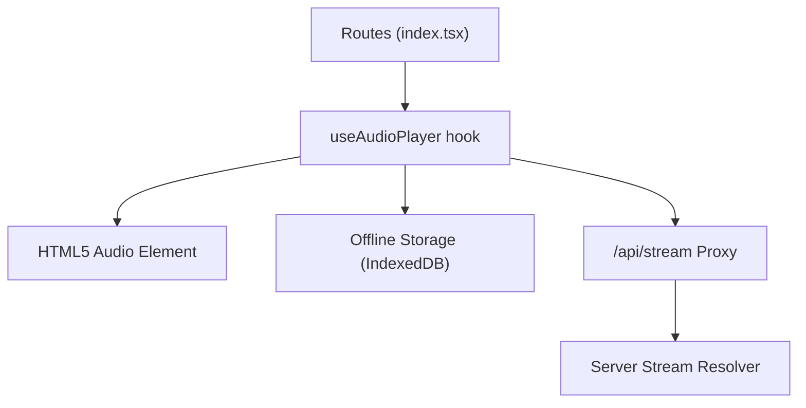
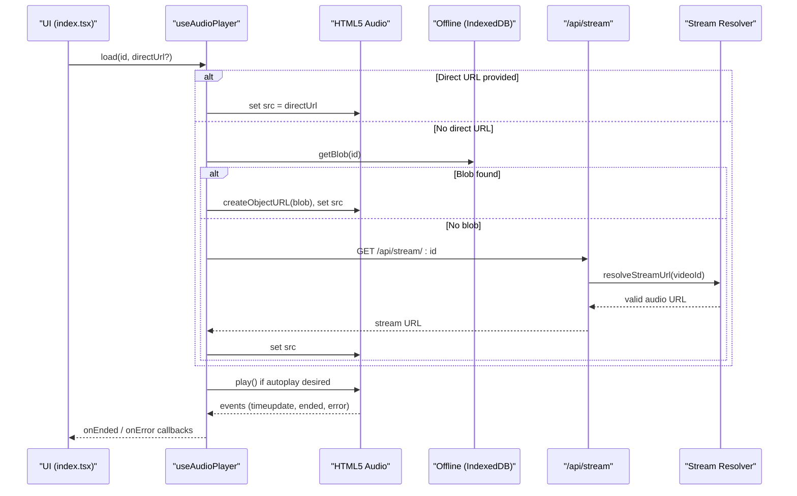
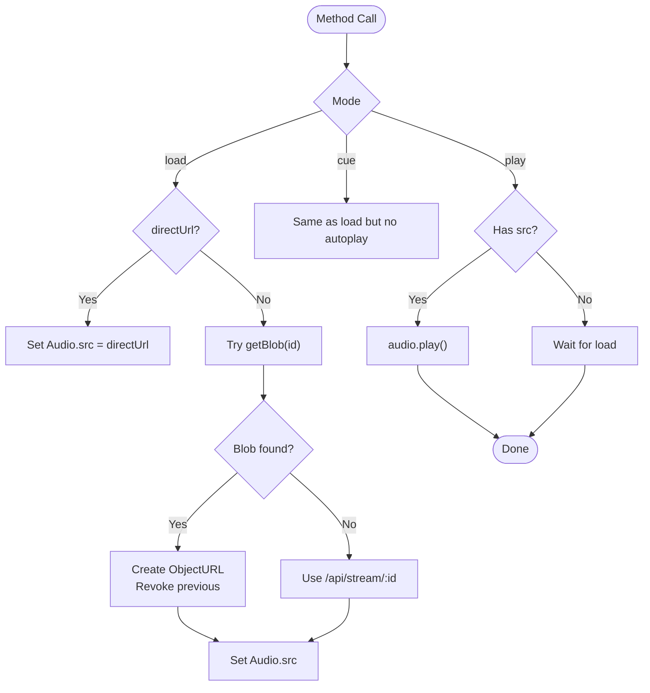
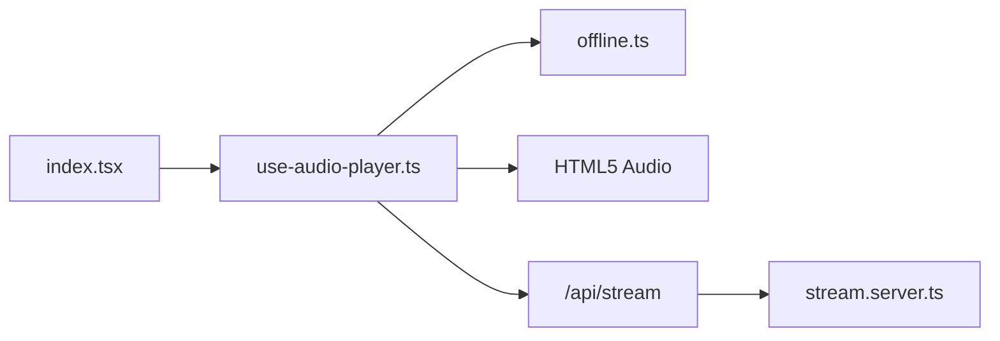

# Audio Player Hook (use-audio-player)

<cite>
**Referenced Files in This Document**
- [use-audio-player.ts](file://src/lib/use-audio-player.ts)
- [offline.ts](file://src/lib/offline.ts)
- [stream.server.ts](file://src/lib/stream.server.ts)
- [index.tsx](file://src/routes/index.tsx)
- [library.ts](file://src/lib/library.ts)
</cite>

## Table of Contents
1. [Introduction](#introduction)
2. [Project Structure](#project-structure)
3. [Core Components](#core-components)
4. [Architecture Overview](#architecture-overview)
5. [Detailed Component Analysis](#detailed-component-analysis)
6. [Dependency Analysis](#dependency-analysis)
7. [Performance Considerations](#performance-considerations)
8. [Troubleshooting Guide](#troubleshooting-guide)
9. [Conclusion](#conclusion)
10. [Appendices](#appendices)

## Introduction
This document explains the use-audio-player React hook that powers audio playback in the application. It manages an HTML5 Audio element, synchronizes state for play/pause/seek operations, and handles events such as time updates, metadata loading, and errors. The hook supports two playback modes:
- Online streaming via a same-origin /api/stream proxy that resolves ad-free audio URLs server-side.
- Offline playback using IndexedDB blobs created from previous downloads.

The hook exposes methods to load, cue, play, pause, seek, and set volume, and integrates with queue management through onEnded and onError callbacks. It also implements robust memory management by revoking object URLs and cleaning up event listeners and the audio element on unmount.

## Project Structure
The audio player is implemented as a single-purpose hook in the lib layer and integrated into the main route where queue logic and user interactions live. Supporting modules provide offline storage and server-side stream resolution.

**Diagram sources**
- [use-audio-player.ts:16-213](file://src/lib/use-audio-player.ts#L16-L213)
- [offline.ts:10-201](file://src/lib/offline.ts#L10-L201)
- [stream.server.ts:108-123](file://src/lib/stream.server.ts#L108-L123)
- [index.tsx:479-512](file://src/routes/index.tsx#L479-L512)

**Section sources**
- [use-audio-player.ts:16-213](file://src/lib/use-audio-player.ts#L16-L213)
- [index.tsx:479-512](file://src/routes/index.tsx#L479-L512)

## Core Components
- useAudioPlayer hook: Creates and manages an HTML5 Audio instance, wires event listeners, exposes control methods, and coordinates online/offline playback.
- Offline module: Provides IndexedDB-backed blob storage and retrieval for offline playback and download utilities.
- Server stream resolver: Resolves direct, ad-free audio URLs from YouTube’s internal API and validates them before returning.
- Route integration: Initializes the hook with onEnded/onError handlers, manages queue navigation, and persists playback state.

Key responsibilities:
- Maintain isPlaying, position, duration state synchronized with the underlying Audio element.
- Prefer offline playback when a blob exists; otherwise stream via /api/stream or a direct URL if provided.
- Handle auto-play policy constraints and inform users when playback is blocked.
- Clean up resources (event listeners, object URLs, audio element) on unmount.

**Section sources**
- [use-audio-player.ts:22-101](file://src/lib/use-audio-player.ts#L22-L101)
- [offline.ts:85-141](file://src/lib/offline.ts#L85-L141)
- [stream.server.ts:108-123](file://src/lib/stream.server.ts#L108-L123)
- [index.tsx:479-512](file://src/routes/index.tsx#L479-L512)

## Architecture Overview
The hook encapsulates all audio engine logic. The route composes queue behavior around the hook’s callbacks and exposes controls to the UI.

**Diagram sources**
- [use-audio-player.ts:103-172](file://src/lib/use-audio-player.ts#L103-L172)
- [offline.ts:85-95](file://src/lib/offline.ts#L85-L95)
- [stream.server.ts:108-123](file://src/lib/stream.server.ts#L108-L123)
- [index.tsx:479-512](file://src/routes/index.tsx#L479-L512)

## Detailed Component Analysis

### useAudioPlayer Hook
Responsibilities:
- Create and persist a single HTML5 Audio instance across renders.
- Subscribe to audio events to keep React state in sync.
- Provide methods: load, cue, play, pause, seek, setVolume.
- Support offline playback via IndexedDB blobs and online playback via /api/stream or direct URLs.
- Manage memory: revoke object URLs and clean up event listeners/audio on unmount.

State synchronization:
- isPlaying toggled on play/pause events.
- position/duration updated on timeupdate, durationchange, loadedmetadata.
- ended triggers onEnded callback and resets playing state.
- error triggers onError callback and resets playing state.

Playback modes:
- Offline: getBlob(id) returns a Blob; createObjectURL sets src; old object URLs are revoked before creating new ones.
- Online: setStream assigns src to either directUrl or /api/stream/:id; optional startAt seeks after metadata loads.

Event handling:
- Event listeners attached once in useEffect; removed in cleanup.
- Auto-play attempts catch browser policy errors and surface a user message via onError.

Memory management:
- Unmount cleanup pauses audio, clears src, calls load(), and revokes any active object URL.

**Diagram sources**
- [use-audio-player.ts:103-172](file://src/lib/use-audio-player.ts#L103-L172)
- [use-audio-player.ts:174-199](file://src/lib/use-audio-player.ts#L174-L199)

**Section sources**
- [use-audio-player.ts:22-101](file://src/lib/use-audio-player.ts#L22-L101)
- [use-audio-player.ts:103-199](file://src/lib/use-audio-player.ts#L103-L199)

### Offline Module (IndexedDB)
Responsibilities:
- Store and retrieve audio blobs keyed by track id.
- Provide utilities to list, remove, clear downloads and compute total size.
- Download tracks via /api/stream with progress reporting and timeout handling.

Key functions:
- saveDownload(track, blob): Persists blob with metadata; warns on low storage quota.
- getBlob(id): Returns Blob or null if not present.
- downloadTrack(track, onProgress?): Streams via /api/stream and saves result.

Error handling:
- Graceful fallbacks return empty arrays or null on failures.
- Timeout and abort signals prevent hanging downloads.

**Section sources**
- [offline.ts:24-48](file://src/lib/offline.ts#L24-L48)
- [offline.ts:58-95](file://src/lib/offline.ts#L58-L95)
- [offline.ts:150-201](file://src/lib/offline.ts#L150-L201)

### Server Stream Resolver
Responsibilities:
- Resolve a playable, ad-free audio URL for a given video id using YouTube’s internal player API.
- Retry across multiple client configurations and probe URLs to ensure they stream correctly.

Key behaviors:
- Picks best audio-only format (prefers specific itag values).
- Probes URLs with Range requests to confirm availability.
- Returns null if no valid URL can be resolved.

**Section sources**
- [stream.server.ts:47-90](file://src/lib/stream.server.ts#L47-L90)
- [stream.server.ts:96-123](file://src/lib/stream.server.ts#L96-L123)

### Route Integration (Queue Management)
Responsibilities:
- Initialize the hook with onEnded and onError handlers.
- Manage queue index and continuous mode to auto-advance or extend queue.
- Persist current queue and position to localStorage for session resumption.
- Offer resume prompts for long episodes based on saved positions.

Integration patterns:
- onEnded advances to next track or extends queue if continuous.
- onError increments consecutive error counter; after two failures, stops auto-skip and shows a message.
- Uses cue to load without autoplay for resume scenarios; uses load + play for normal starts.

**Section sources**
- [index.tsx:479-512](file://src/routes/index.tsx#L479-L512)
- [index.tsx:521-575](file://src/routes/index.tsx#L521-L575)
- [index.tsx:577-600](file://src/routes/index.tsx#L577-L600)

## Dependency Analysis
The hook depends on:
- React hooks for state and lifecycle management.
- Offline module for blob retrieval and download.
- Server stream resolver indirectly via /api/stream proxy for online playback.
- Route layer for queue orchestration and persistence.

Coupling and cohesion:
- High cohesion within the hook: all audio engine logic centralized.
- Low coupling to UI: only requires onEnded/onError callbacks and method invocations.
- Clear separation between playback engine (hook), storage (offline), and network resolution (server).

Potential circular dependencies:
- None observed; dependencies flow one-way from UI to hook to storage/network.

External integrations:
- Browser APIs: HTML5 Audio, IndexedDB, URL.createObjectURL/revokeObjectURL.
- Network: fetch to /api/stream and YouTube internal API (server-side).

**Diagram sources**
- [use-audio-player.ts:16-213](file://src/lib/use-audio-player.ts#L16-L213)
- [offline.ts:10-201](file://src/lib/offline.ts#L10-L201)
- [stream.server.ts:108-123](file://src/lib/stream.server.ts#L108-L123)
- [index.tsx:479-512](file://src/routes/index.tsx#L479-L512)

**Section sources**
- [use-audio-player.ts:16-213](file://src/lib/use-audio-player.ts#L16-L213)
- [offline.ts:10-201](file://src/lib/offline.ts#L10-L201)
- [stream.server.ts:108-123](file://src/lib/stream.server.ts#L108-L123)
- [index.tsx:479-512](file://src/routes/index.tsx#L479-L512)

## Performance Considerations
- Prefer offline playback when available to reduce network latency and enable background playback.
- Revoke previous object URLs before creating new ones to avoid memory leaks.
- Debounce or throttle UI updates driven by frequent timeupdate events if needed; currently state updates are minimal and efficient.
- Use preload="auto" to allow smoother start-up while respecting browser policies.
- Avoid unnecessary re-renders by keeping stable references for callbacks and refs.

[No sources needed since this section provides general guidance]

## Troubleshooting Guide
Common issues and resolutions:
- Playback blocked by browser policy:
  - The hook catches play() promise rejections and surfaces a user-friendly message via onError. Prompt the user to tap play again.
- Song unavailable or restricted:
  - onError is triggered; the route may auto-skip once, then stop after consecutive failures to let the user decide.
- Offline playback fails:
  - getBlob returns null; the hook falls back to online streaming. Ensure downloads completed successfully.
- Memory leaks:
  - Object URLs are revoked on unmount and when replaced. Verify that unmount cleanup runs in production environments.
- Seeking before metadata:
  - The hook waits for loadedmetadata to apply startAt offsets safely.

**Section sources**
- [use-audio-player.ts:56-67](file://src/lib/use-audio-player.ts#L56-L67)
- [use-audio-player.ts:107-121](file://src/lib/use-audio-player.ts#L107-L121)
- [use-audio-player.ts:124-140](file://src/lib/use-audio-player.ts#L124-L140)
- [index.tsx:497-512](file://src/routes/index.tsx#L497-L512)

## Conclusion
The use-audio-player hook provides a robust, self-contained audio engine that abstracts HTML5 Audio complexities, supports both online and offline playback, and integrates cleanly with queue management. Its design emphasizes reliability (error handling, retries), performance (object URL management, efficient state updates), and maintainability (clear separation of concerns).

[No sources needed since this section summarizes without analyzing specific files]

## Appendices

### Method Reference
- load(id, directUrl?):
  - Parameters:
    - id: string — Track identifier used for offline lookup and /api/stream routing.
    - directUrl?: string — Optional direct audio URL (e.g., Deezer preview) that bypasses the proxy.
  - Behavior: Attempts offline playback first; if unavailable, streams via directUrl or /api/stream. Autoplay enabled if possible.
- cue(id, startSeconds, directUrl?):
  - Parameters:
    - id: string — Track identifier.
    - startSeconds: number — Seek position to resume at.
    - directUrl?: string — Optional direct URL.
  - Behavior: Loads track without autoplay; useful for resuming sessions or offering resume prompts.
- play():
  - Behavior: Starts playback if a source is set; handles autoplay policy errors gracefully.
- pause():
  - Behavior: Pauses playback and prevents future autoplay until explicitly resumed.
- seek(seconds):
  - Behavior: Seeks within bounds [0, duration]; safe even if duration is unknown.
- setVolume(v):
  - Parameters:
    - v: number — Volume percentage (0–100); clamped internally.
  - Behavior: Updates audio volume.

**Section sources**
- [use-audio-player.ts:142-199](file://src/lib/use-audio-player.ts#L142-L199)

### Initialization and Callback Handling Example
- Initialize the hook with onEnded and onError:
  - onEnded: Advance queue or extend if continuous; log completions.
  - onError: Increment error counter; auto-skip once; show messages; stop auto-skip after repeated failures.
- Integrate with queue:
  - Use cue to load paused for resume prompts; use load + play for normal starts.
  - Persist queue and position to localStorage for session resumption.

**Section sources**
- [index.tsx:479-512](file://src/routes/index.tsx#L479-L512)
- [index.tsx:521-575](file://src/routes/index.tsx#L521-L575)

### Memory Management Practices
- Object URL cleanup:
  - Revoke previous object URLs before creating new ones during offline playback.
  - Revoke on unmount to free memory.
- Event listener cleanup:
  - Attach listeners once; remove them in useEffect cleanup to prevent leaks.
- Audio element cleanup:
  - Pause, remove src, and call load() on unmount to reset state.

**Section sources**
- [use-audio-player.ts:87-101](file://src/lib/use-audio-player.ts#L87-L101)
- [use-audio-player.ts:124-140](file://src/lib/use-audio-player.ts#L124-L140)