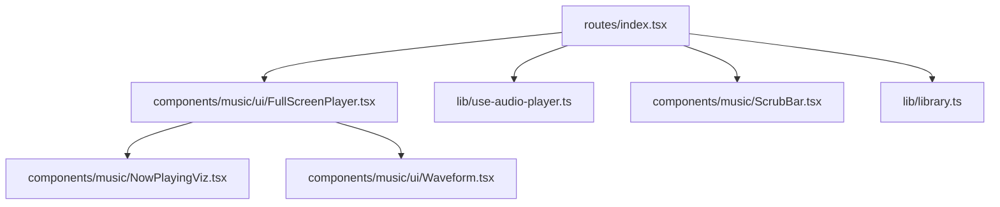
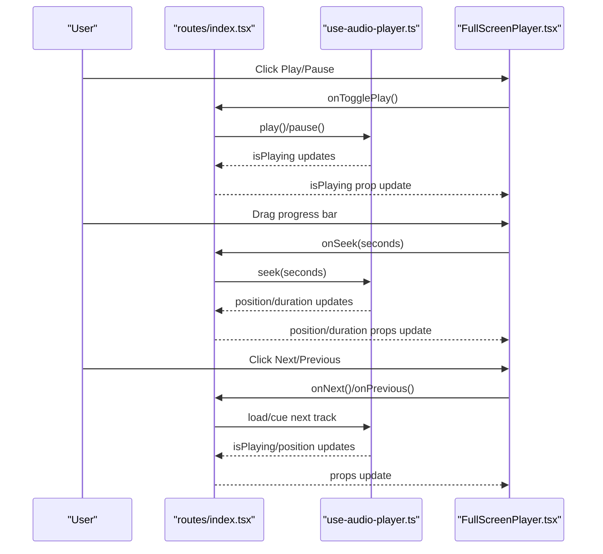
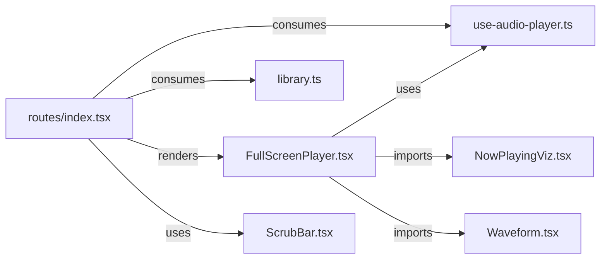

# Full Screen Player Component

<cite>
**Referenced Files in This Document**
- [FullScreenPlayer.tsx](file://src/components/music/ui/FullScreenPlayer.tsx)
- [NowPlayingViz.tsx](file://src/components/music/NowPlayingViz.tsx)
- [use-audio-player.ts](file://src/lib/use-audio-player.ts)
- [Waveform.tsx](file://src/components/music/ui/Waveform.tsx)
- [ScrubBar.tsx](file://src/components/music/ScrubBar.tsx)
- [index.tsx](file://src/routes/index.tsx)
- [library.ts](file://src/lib/library.ts)
</cite>

## Table of Contents
1. Introduction
2. Project Structure
3. Core Components
4. Architecture Overview
5. Detailed Component Analysis
6. Dependency Analysis
7. Performance Considerations
8. Troubleshooting Guide
9. Conclusion

## Introduction
This document provides detailed documentation for the FullScreenPlayer component, which delivers an immersive music listening experience. It covers visual design and layout, responsive behavior across screen sizes, integration with NowPlayingViz for audio visualization, player controls (play/pause, track navigation, volume control, fullscreen toggle), state synchronization via the use-audio-player hook, styling customization options, accessibility features, keyboard navigation support, and performance considerations for smooth animations and efficient re-renders during playback.

## Project Structure
The FullScreenPlayer is a presentational overlay rendered by the main application route when the user opens the full-screen mode. It consumes props from the parent route that manages playback state and actions.

**Diagram sources**
- [index.tsx:1600-1619](file://src/routes/index.tsx#L1600-L1619)
- [FullScreenPlayer.tsx:1-257](file://src/components/music/ui/FullScreenPlayer.tsx#L1-L257)
- [use-audio-player.ts:1-221](file://src/lib/use-audio-player.ts#L1-L221)
- [NowPlayingViz.tsx:1-63](file://src/components/music/NowPlayingViz.tsx#L1-L63)
- [Waveform.tsx:1-44](file://src/components/music/ui/Waveform.tsx#L1-L44)
- [ScrubBar.tsx:1-145](file://src/components/music/ScrubBar.tsx#L1-L145)
- [library.ts:1-646](file://src/lib/library.ts#L1-L646)

**Section sources**
- [index.tsx:1600-1619](file://src/routes/index.tsx#L1600-L1619)
- [FullScreenPlayer.tsx:1-257](file://src/components/music/ui/FullScreenPlayer.tsx#L1-L257)

## Core Components
- FullScreenPlayer: A full-screen overlay that displays album art, track info, progress bar, transport controls, like button, and volume slider. It renders a cinematic blurred background using the current track’s thumbnail and includes subtle ambient gradients.
- NowPlayingViz: Provides animated equalizer bars and a spinning record artwork used elsewhere in the app; referenced by imports to maintain consistent visual language.
- Waveform: Animated waveform visualization component used as a decorative element in other parts of the UI.
- ScrubBar: Reusable seek bar with hover preview and keyboard seeking; used in the main route but conceptually related to progress interaction patterns.
- use-audio-player: Hook that encapsulates HTML5 Audio lifecycle, exposes playback state (isPlaying, position, duration), and methods (load, cue, play, pause, seek, setVolume). Also exports formatTime utility.
- library: Defines Track type and local storage-based library utilities; FullScreenPlayer consumes Track for display.

Key responsibilities:
- FullScreenPlayer focuses on presentation and user interactions, delegating actual playback to the parent route and use-audio-player.
- The parent route orchestrates queue management, media session integration, and persistence, then passes down props to FullScreenPlayer.

**Section sources**
- [FullScreenPlayer.tsx:26-60](file://src/components/music/ui/FullScreenPlayer.tsx#L26-L60)
- [NowPlayingViz.tsx:1-63](file://src/components/music/NowPlayingViz.tsx#L1-L63)
- [Waveform.tsx:1-44](file://src/components/music/ui/Waveform.tsx#L1-L44)
- [ScrubBar.tsx:1-145](file://src/components/music/ScrubBar.tsx#L1-L145)
- [use-audio-player.ts:16-213](file://src/lib/use-audio-player.ts#L16-L213)
- [library.ts:3-14](file://src/lib/library.ts#L3-L14)

## Architecture Overview
The FullScreenPlayer is a controlled component driven entirely by props from the parent route. The parent uses use-audio-player to manage the underlying audio element and exposes callbacks for play/pause, next/previous, seek, and volume changes. FullScreenPlayer updates its UI based on these props and invokes callbacks on user actions.

**Diagram sources**
- [index.tsx:1600-1619](file://src/routes/index.tsx#L1600-L1619)
- [use-audio-player.ts:174-199](file://src/lib/use-audio-player.ts#L174-L199)
- [FullScreenPlayer.tsx:184-215](file://src/components/music/ui/FullScreenPlayer.tsx#L184-L215)

## Detailed Component Analysis

### FullScreenPlayer Visual Design and Layout
- Background: Uses the current track’s thumbnail as a large, blurred backdrop with a gradient overlay for contrast and depth. An ambient animated gradient adds subtle motion.
- Content layout: Centered vertically with flexible spacing; album art scales responsively with aspect-square constraints and rounded corners; text truncation ensures readability on small screens.
- Progress bar: Gradient-filled indicator with time labels formatted via formatTime; click-to-seek calculates ratio from mouse position relative to bar width.
- Controls: Transport buttons (previous, play/pause, next) with disabled states based on canPrevious/canNext; like button toggles liked state; volume slider visible on medium+ screens.
- Responsive behavior: Tailwind breakpoints adjust padding, font sizes, icon sizes, and visibility of secondary controls (e.g., download, volume slider).

Accessibility highlights:
- Buttons include aria-labels for screen readers.
- Progress bar uses role="progressbar" with aria-valuemin, aria-valuemax, and aria-valuenow bound to duration and position.
- Toggle buttons for lyrics and queue expose aria-pressed to reflect state.

Styling customization:
- Colors and gradients are applied via utility classes; you can modify palette by changing class tokens (e.g., pink-500, purple-500, cyan-400).
- Animations such as ambient glow and pulse are applied via CSS classes; customize durations or intensities by adjusting class names or adding custom keyframes.

Keyboard navigation:
- While FullScreenPlayer itself does not implement global keyboard shortcuts, it relies on standard focusable elements (buttons, sliders) and accessible attributes. For advanced keyboard controls, consider integrating a global handler in the parent route.

Performance notes:
- Uses useMemo to compute progress percentage from position and duration to avoid unnecessary recalculations.
- Uses useCallback for event handlers to stabilize references and reduce re-renders in child components.
- Renders minimal DOM nodes per frame; heavy work (audio decoding, streaming) is delegated to the browser’s audio engine.

Integration points:
- Props interface defines all necessary data and callbacks for playback state and user actions.
- Consumes formatTime from use-audio-player for consistent time formatting.
- Imports Equalizer and SpinningArt from NowPlayingViz to maintain consistent visual motifs across the app.

**Section sources**
- [FullScreenPlayer.tsx:26-60](file://src/components/music/ui/FullScreenPlayer.tsx#L26-L60)
- [FullScreenPlayer.tsx:64-76](file://src/components/music/ui/FullScreenPlayer.tsx#L64-L76)
- [FullScreenPlayer.tsx:80-257](file://src/components/music/ui/FullScreenPlayer.tsx#L80-L257)
- [use-audio-player.ts:215-221](file://src/lib/use-audio-player.ts#L215-L221)
- [NowPlayingViz.tsx:1-63](file://src/components/music/NowPlayingViz.tsx#L1-L63)

### NowPlayingViz Integration
- Equalizer: Animated bars that scale and animate while active; useful for indicating playback activity in compact areas.
- SpinningArt: Rotating record-like artwork with a glowing halo when playing; integrates seamlessly with album art visuals.

Usage in this project:
- Imported into FullScreenPlayer to align visual language, though the primary visual in FullScreenPlayer is the album art image with ambient effects.

**Section sources**
- [NowPlayingViz.tsx:1-63](file://src/components/music/NowPlayingViz.tsx#L1-L63)
- [FullScreenPlayer.tsx:20-20](file://src/components/music/ui/FullScreenPlayer.tsx#L20-L20)

### Player Controls Implementation
- Play/Pause: Toggles playback via onTogglePlay callback; icon switches based on isPlaying prop.
- Track Navigation: Previous/Next buttons call onPrevious/onNext; disabled states reflect canPrevious/canNext.
- Seek: Progress bar click computes ratio and calls onSeek with seconds; scrubbing is precise and clamped within bounds.
- Volume: Slider updates volume via onVolumeChange; value range is 0–100; hidden on small screens to save space.
- Like: Heart button toggles liked state via onToggleLike; visual feedback indicates current state.

Parent wiring:
- The parent route binds these callbacks to use-audio-player methods and queue management logic, ensuring UI stays in sync with actual playback.

**Section sources**
- [FullScreenPlayer.tsx:184-245](file://src/components/music/ui/FullScreenPlayer.tsx#L184-L245)
- [index.tsx:1600-1619](file://src/routes/index.tsx#L1600-L1619)

### State Management with use-audio-player
- Playback state: isPlaying, position, duration exposed by the hook; updated via native audio events (timeupdate, durationchange, loadedmetadata).
- Methods:
  - load(id, directUrl?): Loads a stream URL or direct URL and starts playback if autoplay is allowed.
  - cue(id, startSeconds, directUrl?): Loads without autoplay; useful for resuming sessions.
  - play()/pause(): Control playback directly.
  - seek(seconds): Jumps to a specific time, clamped to valid range.
  - setVolume(v): Sets volume normalized to 0–1 internally.
- Error handling: onError notifies the parent; auto-skip logic is managed in the parent route to prevent rapid skip loops.
- Time formatting: formatTime converts seconds to mm:ss for display.

Synchronization flow:
- Parent route subscribes to hook state and passes values to FullScreenPlayer as props; user actions in FullScreenPlayer invoke callbacks that mutate hook state indirectly through methods.

**Section sources**
- [use-audio-player.ts:16-213](file://src/lib/use-audio-player.ts#L16-L213)
- [use-audio-player.ts:215-221](file://src/lib/use-audio-player.ts#L215-L221)
- [index.tsx:479-512](file://src/routes/index.tsx#L479-L512)

### Accessibility Features
- ARIA roles and attributes:
  - Progress bar: role="progressbar", aria-valuemin, aria-valuemax, aria-valuenow.
  - Buttons: aria-label for clear intent (e.g., “Previous track”, “Pause”).
  - Toggle buttons: aria-pressed reflects active state for lyrics/queue toggles.
- Focus management: Standard focusable elements ensure keyboard users can navigate controls.
- Semantic markup: Headings and paragraphs convey track information clearly.

Enhancements:
- Consider adding global keyboard shortcuts (space for play/pause, arrow keys for seek) at the parent level for power users.

**Section sources**
- [FullScreenPlayer.tsx:97-131](file://src/components/music/ui/FullScreenPlayer.tsx#L97-L131)
- [FullScreenPlayer.tsx:158-182](file://src/components/music/ui/FullScreenPlayer.tsx#L158-L182)
- [FullScreenPlayer.tsx:184-245](file://src/components/music/ui/FullScreenPlayer.tsx#L184-L245)

### Keyboard Navigation Support
- Built-in:
  - Progress bar supports pointer interactions; keyboard seeking is implemented in ScrubBar (used elsewhere in the app) with arrow keys and Home/End navigation.
  - FullScreenPlayer relies on default browser behavior for focusable elements.
- Recommended:
  - Implement global key handlers in the parent route to support Space (play/pause), Left/Right (seek ±5s), Shift+Left/Right (±10s), Home/End (start/end).

**Section sources**
- [ScrubBar.tsx:47-74](file://src/components/music/ScrubBar.tsx#L47-L74)

### Styling Customization Options
- Color themes: Modify gradient colors and accent hues in progress bar and buttons by updating Tailwind classes.
- Animation intensity: Adjust animation durations and opacities for ambient overlays and pulsing effects.
- Responsive breakpoints: Tailwind classes control layout shifts; tweak spacing and visibility at sm/md/lg thresholds.
- Iconography: Replace icons by swapping lucide-react imports; maintain consistent sizing and accessibility labels.

**Section sources**
- [FullScreenPlayer.tsx:80-257](file://src/components/music/ui/FullScreenPlayer.tsx#L80-L257)

## Dependency Analysis
- FullScreenPlayer depends on:
  - Props from routes/index.tsx for playback state and actions.
  - formatTime from use-audio-player for consistent time display.
  - NowPlayingViz components for consistent visual motifs.
- routes/index.tsx depends on:
  - use-audio-player for audio lifecycle and state.
  - library types (Track) for data modeling.
  - ScrubBar for inline progress interaction in the main view.
- use-audio-player depends on:
  - Browser Audio API for playback.
  - Offline utilities for blob playback (optional).
  - Stream proxy endpoint for network playback.

**Diagram sources**
- [FullScreenPlayer.tsx:1-257](file://src/components/music/ui/FullScreenPlayer.tsx#L1-L257)
- [use-audio-player.ts:1-221](file://src/lib/use-audio-player.ts#L1-L221)
- [NowPlayingViz.tsx:1-63](file://src/components/music/NowPlayingViz.tsx#L1-L63)
- [Waveform.tsx:1-44](file://src/components/music/ui/Waveform.tsx#L1-L44)
- [index.tsx:1600-1619](file://src/routes/index.tsx#L1600-L1619)
- [ScrubBar.tsx:1-145](file://src/components/music/ScrubBar.tsx#L1-L145)
- [library.ts:1-646](file://src/lib/library.ts#L1-L646)

**Section sources**
- [index.tsx:1600-1619](file://src/routes/index.tsx#L1600-L1619)
- [use-audio-player.ts:16-213](file://src/lib/use-audio-player.ts#L16-L213)
- [library.ts:3-14](file://src/lib/library.ts#L3-L14)

## Performance Considerations
- Efficient re-renders:
  - FullScreenPlayer uses useMemo for progress percentage and useCallback for handlers to minimize unnecessary updates.
  - Parent route throttles progress persistence and episode position writes via intervals to avoid excessive state churn.
- Audio streaming:
  - use-audio-player leverages HTML5 Audio with range requests via a stream proxy; this improves seeking and reduces bandwidth usage.
  - Offline playback uses Blob URLs with proper cleanup to prevent memory leaks.
- Animations:
  - CSS-driven animations (ambient gradients, pulse) are GPU-accelerated where possible; keep animation counts reasonable to avoid jank.
- Memory management:
  - Object URLs created for offline playback are revoked on unmount or replacement.
  - Event listeners are attached and removed in useEffect cleanup to prevent leaks.

Optimization recommendations:
- Debounce high-frequency updates (e.g., seeking) using requestAnimationFrame or throttling, similar to ScrubBar’s approach.
- Avoid deep object comparisons in props; pass stable references via useCallback.
- Lazy-load non-critical panels (lyrics, queue) only when needed to reduce initial render cost.

[No sources needed since this section provides general guidance]

## Troubleshooting Guide
Common issues and resolutions:
- Playback blocked:
  - Symptom: Errors when calling play() due to autoplay policies.
  - Resolution: Ensure user gesture initiates playback; show a message prompting the user to tap play.
- Song unavailable:
  - Symptom: onError triggers; automatic skip may be attempted once.
  - Resolution: Parent route handles consecutive errors by stopping auto-advance and notifying the user.
- Seeking out of bounds:
  - Symptom: Seek attempts beyond duration.
  - Resolution: use-audio-player clamps seek values to valid ranges; verify UI calculations match duration.
- Volume not applying:
  - Symptom: Slider changes do not affect audio.
  - Resolution: Ensure setVolume is called after player.ready; parent route applies volume when ready.

Debugging tips:
- Inspect console warnings for play() failures and offline playback errors.
- Verify stream URL correctness and network availability.
- Use browser dev tools to monitor audio events and state changes.

**Section sources**
- [use-audio-player.ts:56-67](file://src/lib/use-audio-player.ts#L56-L67)
- [use-audio-player.ts:115-120](file://src/lib/use-audio-player.ts#L115-L120)
- [use-audio-player.ts:174-199](file://src/lib/use-audio-player.ts#L174-L199)
- [index.tsx:497-512](file://src/routes/index.tsx#L497-L512)

## Conclusion
FullScreenPlayer delivers a polished, responsive full-screen music experience by combining thoughtful visual design, accessible controls, and robust state synchronization with use-audio-player. Its separation of concerns—presentation in the component and orchestration in the parent route—ensures maintainability and scalability. With careful attention to performance (memoization, throttled updates, efficient animations) and accessibility (ARIA attributes, keyboard-friendly controls), it provides a smooth and inclusive listening experience across devices.

[No sources needed since this section summarizes without analyzing specific files]